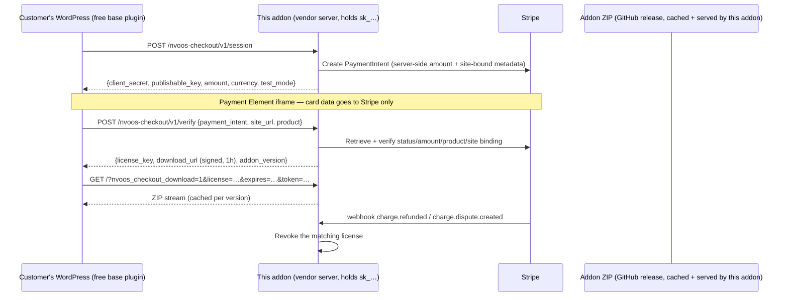

# NV oOS Checkout API

**Vendor-side checkout service for NV oOS premium addons.**

> **Status:** v0.1.0 — initial release (Stripe sessions + verification, license
> issuance, signed ZIP downloads, Stripe webhook receiver, storefront admin).

Runs on the vendor's own server (e.g. nvdigitalsolutions.com). It is the
server half of the purchase flow built into the free
`nvoos-content-graph` plugin — see `plugins/nvoos-content-graph/docs/commerce-vendor-api.md`
for the contract and the client side.

The customer never needs Stripe keys. They click "Get NV oOS Content Graph — AI"
on their own site, pay with their card on Stripe's secure UI, and their site
calls this API to verify the payment and receive a signed download URL.

## How it fits together

## Endpoints

| Route | Auth | Purpose |
|---|---|---|
| `POST /wp-json/nvoos-checkout/v1/session` | Public, IP rate-limited | Create a Stripe PaymentIntent |
| `POST /wp-json/nvoos-checkout/v1/verify` | Public, IP rate-limited | Verify payment, issue license + signed download URL |
| `POST /wp-json/nvoos-checkout/v1/webhooks/stripe` | Stripe signature | `payment_intent.succeeded` issues the license server-side (interrupted-browser recovery); refunds/disputes revoke |
| `GET /?nvoos_checkout_download=1&license=…&expires=…&token=…` | Signed HMAC token | Stream the addon ZIP |

### Why the session/verify routes are public

The customer-side plugin is distributed for free, so no shared secret can be
shipped inside it. These routes are therefore protected by three layers
instead: per-IP rate limiting, strict input validation, and Stripe itself —
a license is only issued for a **real, paid PaymentIntent** whose metadata
matches the requested product and site URL. A stolen `pi_…` ID cannot be
replayed from a different site (site binding) or for a different product.

## Setup

1. Install this addon **on your own site only**. Never distribute it to
   customers, never submit it to WordPress.org.
2. Create a Stripe account (or a test key set) and fill in **NV oOS Checkout**
   in WP-Admin: secret key, publishable key, price, currency, addon version,
   ZIP source (defaults to the GitHub release pattern; set a private mirror
   URL or absolute path if you want the download gated behind your CDN).
3. In the Stripe dashboard, add a webhook endpoint pointing at the URL shown
   on the settings screen, with events `payment_intent.succeeded`,
   `charge.refunded`, and `charge.dispute.created`, and paste the signing
   secret (`whsec_…`). The `payment_intent.succeeded` event is what issues
   the license when a buyer's browser flow is interrupted after paying —
   their site picks the license up via `/verify` when they return.
4. Publish the first addon release so the ZIP source resolves (the addon
   caches it under `wp-content/uploads/nvoos-checkout/` per version).
5. Verify with Stripe test cards while test mode is on; switch to live keys
   when ready.

## Data stored

- `nvoos_checkout_settings` — storefront config incl. Stripe keys.
- `{prefix}nvoos_checkout_licenses` — one row per issued license (key,
  product, site URL, payment intent, amount, status, timestamp). No card
  data ever touches this server.
- `nvoos_checkout_processed_events` — ring buffer of processed Stripe
  webhook event IDs (idempotency).

## License

Unlike the rest of the NV oOS repository (which is GPLv3), this addon is
proprietary software of NV Digital Solutions. It is **not** licensed under
the repo-root `LICENSE` (GPLv3) and is **not** distributed via WordPress.org.
Use, reproduction, modification, and redistribution are governed by the
addon-local [`LICENSE`](LICENSE) file in this directory.

For licensing enquiries: licensing@nvdigitalsolutions.com
