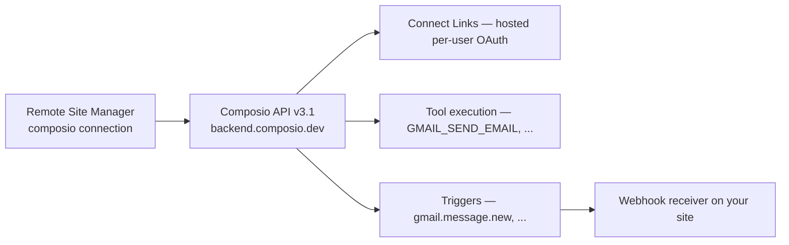

# Composio Connect Integration

Composio Connect gives your NV oOS Pro assistants per-user authenticated access to **1,000+ third-party apps** — Gmail, Slack, GitHub, Notion, Linear and more — through a single connection in the **Remote Site Manager**.

## How it works

**Provider OAuth tokens never touch WordPress.** Users authenticate on Composio's hosted page ("Connect Link"); Composio stores and refreshes their credentials. WordPress only ever holds your project API key (encrypted) and the webhook signing secret (encrypted).

## 1. Get a Composio API key

1. Create an account at [app.composio.dev](https://app.composio.dev) (or your regional endpoint).
2. Open **Settings → API Keys** and create a project key (`ak_...`).
3. *(Recommended)* Use a **scoped** key without the `proxy_execute` permission — NV oOS does not use the proxy endpoint.

## 2. Create the connection

1. Go to **NV oOS Pro → Remote Sites → Add New Connection**.
2. Choose **Composio Connect (AI Tool Aggregator)** as the connection type.
3. Paste your project API key.
4. Leave **API Base URL** at `https://backend.composio.dev` unless you use a regional or self-hosted endpoint (must be public HTTPS).
5. Choose the **Identity Mode**:
   - **Shared (site-wide)** — one identity for all assistants (default, simplest). Every Connect Link and tool call is made as the built-in `nvoos-shared` identity.
   - **Per user** — each WordPress user connects their own accounts (`wp-{user_id}`).
6. Optionally restrict the **Toolkit Allowlist** (e.g. `gmail, slack, github`).
7. Save, then click **Test Connection**.

After saving, the **Identity Mode** row shows the exact Composio identity the connection resolves to. This is the quickest way to confirm shared mode is in effect.

## 3. Connect your first app

1. On the connection edit screen, under **Connect an App**, enter a toolkit slug (e.g. `gmail`) and click **Open Connect Link**.
2. NV oOS resolves the toolkit to your project's auth config automatically (preferring the Composio-managed default config) and opens Composio's hosted page.
3. Complete the flow on Composio's hosted page.
4. You are redirected back and the new connected account is available to assistants.

If your Composio project has **callback identity verification** enabled (dashboard → Settings → General), NV oOS redeems the single-use verification session automatically — this defends against OAuth session fixation.

> **Tip:** If Connect Link creation fails with *"No enabled auth config was found…"*, the toolkit has not been set up in your Composio project yet. Connect the toolkit once from the Composio dashboard (or create an auth config for it), then try again. NV oOS uses your project's default/Composio-managed auth config — custom OAuth apps are not selectable from the plugin UI.

## 3a. Manage connected apps

The **Connected Apps** table on the connection edit screen lists every connected account with its app, account alias, **Identity** (the Composio `user_id` it is bound to), status and account ID.

- **Remove** deletes the account at Composio *and* asks Composio to revoke the upstream provider credentials (`DELETE /connected_accounts/{id}?revoke_on_delete=true`). Assistants lose access immediately. Use it to clear out stuck `INITIALIZING` or `EXPIRED` rows.
- **Refresh list** clears the 5-minute listing cache, for apps connected in another tab or from the Composio dashboard.

The **Identity** column matters: a connected account is always owned by one Composio identity, and every tool call must send that identity along with the account ID. Accounts linked under an identity that differs from the connection's current mode still work — NV oOS reads the account's own identity at execution time — but a mismatch usually means the identity mode was changed after the app was linked.

## 3b. Checking and fixing a broken connection

A connected account can stop working without Composio noticing. The status shown in **Connected Apps** is Composio's *stored* status: if a user revokes the app in their Google, Slack or GitHub settings, Composio keeps reporting `ACTIVE` until its own background refresh fails or it sends the `composio.connected_account.expired` webhook. Trusting the stored status is how you get a `401` on first real use.

NV oOS therefore **verifies rather than assumes**: `composio_list_connected_accounts` probes each account with a harmless read-only call by default and reports a `health` block with `needs_reconnect` alongside the stored status. Verdicts are reused for 15 minutes, so asking repeatedly is cheap — *"Is my Gmail connection still working?"* is a safe question to put to an assistant.

When something is broken, work through three actions on `composio_manage_accounts`, in order:

1. **Validate.** `action: "validate"` with a `toolkit` (or a single `connected_account_id`) forces a live probe that is never answered from cache. Each account comes back with its `health` verdict, credential expiry, and a `reconnect_url` if it needs re-authorising.
2. **Reconnect.** `action: "reconnect"` re-authorises the **same** account and returns a URL for the user to finish the flow, so the account keeps its ID, alias and any triggers pinned to it. Prefer this over opening a fresh Connect Link, which creates a *new* account and leaves the broken one behind. If in-place reconnection is unavailable, NV oOS falls back to a Connect Link and tells you plainly that a new account will be created — delete the old one afterwards.
3. **Prune.** `action: "prune"` requires an explicit `toolkit`, so the blast radius is always stated. Every account for that app is probed immediately before deletion and only the genuinely dead ones are removed; you get back how many were `deleted`, `kept` and `failed`.

Use `disable` / `enable` to park an account without deleting it, and `delete` to remove a single account (its upstream provider credentials are revoked too, unless you pass `revoke: false`).

> **Note:** `verification_method: status_only` means the credential could **not** be probed — no zero-argument read-only tool exists for that toolkit — so its status is *unconfirmed*, not verified.

## 4. Tools for assistants

| Tool | Purpose |
|---|---|
| `composio_list_tools` | Browse or search the 1,000+ tool catalog by intent or toolkit. `connected_only` shows only what your authenticated accounts can actually run; `list_toolkits` returns the app directory. Every result lists its required arguments |
| `composio_get_tool_schema` | Full input/output schema for a tool slug |
| `composio_list_connected_accounts` | Connected accounts with *verified* health, not just Composio's stored status — each account is probed with a harmless read-only call by default |
| `composio_create_connect_link` | Create a hosted auth link for a user |
| `composio_manage_accounts` | Validate, reconnect, disable, enable, delete or prune connected accounts |
| `composio_execute_tool` | Execute a tool on a connected account (write-class actions flagged `destructive`) |
| `composio_manage_triggers` | Discover / upsert / enable / disable / delete triggers |

## 5. Triggers (webhooks)

Events such as `gmail.message.new` can be pushed to your site:

1. Create a trigger via `composio_manage_triggers` (upsert) or the Composio dashboard.
2. Register a **webhook subscription** pointing at:
   `https://yoursite.example/wp-json/mcp-ai/v1/webhooks/composio/{connection_id}`
3. Store the returned signing secret on the connection (`webhook_secret`). Every delivery is HMAC-SHA256 verified; duplicates are deduped.

Trigger events are exposed to automation through the `wp_mcp_ai_composio_trigger` action (Pro Workflow Builder / Schedule Manager integrations can subscribe via the `wp_mcp_ai_composio_trigger_handlers` filter).

## 6. Security model

- **Stored in WordPress (encrypted AES-256-CBC):** Composio API key, webhook signing secret.
- **Stored in Composio (never in WordPress):** all end-user OAuth tokens.
- **API key handling:** never logged, never returned by REST endpoints, masked in the admin UI.
- **Webhooks:** signature-gated, event-ID deduped, unknown events acknowledged to avoid retry loops.
- **Execution guardrails:** all write-class tool slugs are classified `destructive` in tool responses; tools require `manage_options`.

## 7. FAQ

**Why not install `@composio/core` (TypeScript SDK)?** NV oOS is a PHP plugin; the SDK targets Node/TS agent runtimes and would add a build chain plus secret-exposure risk in browser JS. All integration is done server-side against the Composio REST API v3.1.

**Does this work on multisite?** Yes — connections and webhooks are per-site.

**What if Composio is rate-limited?** The client backs off on `429` with `Retry-After` and surfaces clear errors.

**What happens if a user's account expires?** Composio sends `composio.connected_account.expired`; NV oOS records a `needs_reconnect` verdict for that account immediately, so tool calls stop choosing it, and offers a one-click reconnect (see step 3b).

## 8. Troubleshooting

**`HTTP 401` when testing or opening a Connect Link.** Composio returns 401 only when the `x-api-key` header is invalid. Check, in order:

1. The key was copied from **Settings → API Keys** in the Composio dashboard and starts with `ak_` (integration keys, JWT tokens, and `ck_`/`uak_` keys are not project API keys).
2. The key still exists — keys are revoked when a project API key is regenerated or deleted, and **regenerating a project API key invalidates all existing keys for that project**.
3. You are pasting the key for the *same project* you intend to use.
4. No leading/trailing whitespace was copied with the key (NV oOS trims this automatically since 1.4.x).

**`cURL error 28: Operation timed out` (or DNS failures).** The request never reached Composio — this is a hosting-level egress problem, not a credential problem. Verify that your server can resolve and reach `backend.composio.dev` over HTTPS (firewall, proxy, WAF, or hosting provider egress rules). A quick check: `curl -sS -o /dev/null -w "%{http_code}" https://backend.composio.dev/api/v3.1/tools/enum -H "x-api-key: <YOUR_KEY>"` — a 200 confirms connectivity and the key together.

**`HTTP 403` with a scoped project API key.** Scoped keys only reach the resources granted to them. Grant the key Connected Accounts / Toolkits / Tools permissions in the dashboard, or use a full project API key.

**Connect Link creation fails (`400`/`422` or "auth_config_id is required").** Composio's link endpoint requires a project auth config ID, not a toolkit slug. Update to a build that resolves the auth config automatically, and make sure the toolkit has an auth config in the Composio dashboard (see the tip in step 3 above).

**`HTTP 400: User ID is required with connected account.`** Composio's execute endpoint requires the `user_id` that owns the connected account to be sent in the same request body as `connected_account_id`. NV oOS sends it automatically: the identity is resolved from the connection's Identity Mode, and overridden by the account's own `user_id` when the two differ. If you still see this error, the build predates that fix — check the **Identity** column in **Connected Apps** and update the plugin.

**A connected app is stuck in `INITIALIZING`, or a stale account keeps being picked.** Click **Remove** on that row in **Connected Apps**, or run `composio_manage_accounts` with `action: "prune"` for the toolkit, then connect the app again. Auto-resolution only ever picks `ACTIVE` accounts, prefers the one matching the connection's identity, and skips accounts whose last credential check failed — so validating and pruning keeps the choice unambiguous.

## 9. References

- [Composio docs](https://docs.composio.dev/docs)
- [Connected Accounts API](https://docs.composio.dev/reference/api-reference/connected-accounts)
- [Tools API](https://docs.composio.dev/reference/api-reference/tools)
- Proposal: `docs/project/proposals/030-composio-connect-integration-proposal.md`
- Implementation plan: `docs/project/proposals/030-composio-connect-integration-implementation-plan.md`
