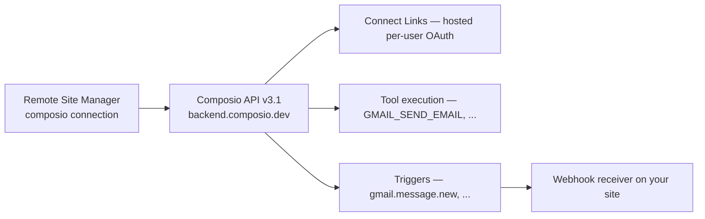

# Composio Connect Integration

Composio Connect gives your NV oOS Pro assistants per-user authenticated access to **1,000+ third-party apps** — Gmail, Slack, GitHub, Notion, Linear and more — through a single connection in the **Remote Site Manager**.

## How it works

**Provider OAuth tokens never touch WordPress.** Users authenticate on Composio's hosted page ("Connect Link"); Composio stores and refreshes their credentials. WordPress only ever holds your project API key (encrypted) and the webhook signing secret (encrypted).

## 1. Get a Composio API key

1. Create an account at [app.composio.dev](https://app.composio.dev) (or your regional endpoint).
2. Open **Settings → API Keys** and create a project key (`ak_...`).
3. *(Recommended)* Use a **scoped** key without the `proxy_execute` permission — NV oOS does not use the proxy endpoint.

## 2. Create the connection

1. Go to **NV oOS Pro → Remote Sites → Add New Connection**.
2. Choose **Composio Connect (AI Tool Aggregator)** as the connection type.
3. Paste your project API key.
4. Leave **API Base URL** at `https://backend.composio.dev` unless you use a regional or self-hosted endpoint (must be public HTTPS).
5. Choose the **Identity Mode**:
   - **Shared (site-wide)** — one identity for all assistants (default, simplest).
   - **Per user** — each WordPress user connects their own accounts.
6. Optionally restrict the **Toolkit Allowlist** (e.g. `gmail, slack, github`).
7. Save, then click **Test Connection**.

## 3. Connect your first app

1. On the connection edit screen, under **Connect an App**, enter a toolkit slug (e.g. `gmail`) and click **Open Connect Link**.
2. Complete the flow on Composio's hosted page.
3. You are redirected back and the new connected account is available to assistants.

If your Composio project has **callback identity verification** enabled (dashboard → Settings → General), NV oOS redeems the single-use verification session automatically — this defends against OAuth session fixation.

## 4. Tools for assistants

| Tool | Purpose |
|---|---|
| `composio_list_tools` | Search the 1,000+ tool catalog by intent or toolkit |
| `composio_get_tool_schema` | Input/output schema for a tool slug |
| `composio_list_connected_accounts` | Status of connected accounts |
| `composio_create_connect_link` | Create a hosted auth link for a user |
| `composio_execute_tool` | Execute a tool on a connected account (write-class actions flagged `destructive`) |
| `composio_manage_triggers` | Discover / upsert / enable / disable / delete triggers |

## 5. Triggers (webhooks)

Events such as `gmail.message.new` can be pushed to your site:

1. Create a trigger via `composio_manage_triggers` (upsert) or the Composio dashboard.
2. Register a **webhook subscription** pointing at:
   `https://yoursite.example/wp-json/mcp-ai/v1/webhooks/composio/{connection_id}`
3. Store the returned signing secret on the connection (`webhook_secret`). Every delivery is HMAC-SHA256 verified; duplicates are deduped.

Trigger events are exposed to automation through the `wp_mcp_ai_composio_trigger` action (Pro Workflow Builder / Schedule Manager integrations can subscribe via the `wp_mcp_ai_composio_trigger_handlers` filter).

## 6. Security model

- **Stored in WordPress (encrypted AES-256-CBC):** Composio API key, webhook signing secret.
- **Stored in Composio (never in WordPress):** all end-user OAuth tokens.
- **API key handling:** never logged, never returned by REST endpoints, masked in the admin UI.
- **Webhooks:** signature-gated, event-ID deduped, unknown events acknowledged to avoid retry loops.
- **Execution guardrails:** all write-class tool slugs are classified `destructive` in tool responses; tools require `manage_options`.

## 7. FAQ

**Why not install `@composio/core` (TypeScript SDK)?** NV oOS is a PHP plugin; the SDK targets Node/TS agent runtimes and would add a build chain plus secret-exposure risk in browser JS. All integration is done server-side against the Composio REST API v3.1.

**Does this work on multisite?** Yes — connections and webhooks are per-site.

**What if Composio is rate-limited?** The client backs off on `429` with `Retry-After` and surfaces clear errors.

**What happens if a user's account expires?** Composio sends `composio.connected_account.expired`; NV oOS marks the account and the admin panel offers a "reconnect" Connect Link.

## 8. References

- [Composio docs](https://docs.composio.dev/docs)
- [Connected Accounts API](https://docs.composio.dev/reference/api-reference/connected-accounts)
- [Tools API](https://docs.composio.dev/reference/api-reference/tools)
- Proposal: `docs/project/proposals/030-composio-connect-integration-proposal.md`
- Implementation plan: `docs/project/proposals/030-composio-connect-integration-implementation-plan.md`
