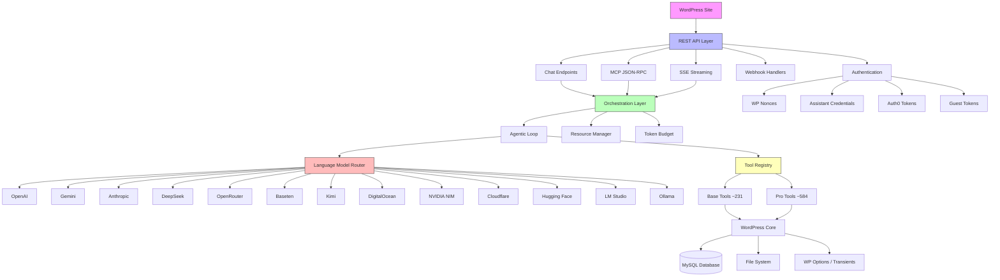
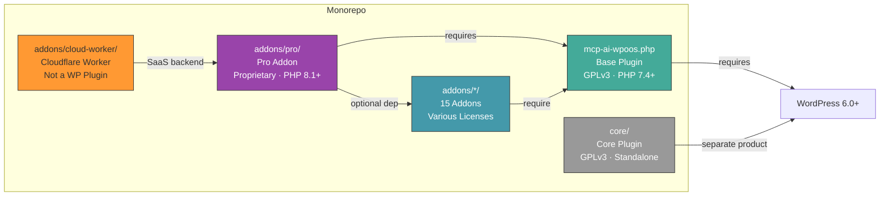

# NV oOS Architecture Overview

**Last Updated:** June 2026
**Version:** 1.1.27

This document provides a high-level architectural overview of the Open Operator System (NV oOS) plugin. For detailed technical documentation, see the main [docs](../) directory. For a step-by-step trace of a chat request, see [REQUEST-FLOW-WALKTHROUGH.md](REQUEST-FLOW-WALKTHROUGH.md).

## Table of Contents

- [System Overview](#system-overview)
- [Core Components](#core-components)
- [Data Flow](#data-flow)
- [Key Design Patterns](#key-design-patterns)
- [Extension Points](#extension-points)
- [Security Architecture](#security-architecture)

## System Overview

NV oOS is a WordPress plugin that provides an AI Assistant framework integrating with **13 language-model providers** and implementing the Model Context Protocol (MCP) for tool-based AI interactions. The plugin ships **~815 tool classes** (231 base + 584 pro) across 34 REST controllers.

### Component Diagram



### Repository Component Map



### High-Level Architecture

```
┌──────────────────────────────────────────────────────────────────────┐
│                         Frontend Layer                               │
│  ┌───────────┐  ┌───────────┐  ┌───────────┐  ┌───────────────────┐ │
│  │ Shortcode │  │ Elementor │  │ Chat      │  │ Telegram Mini App │ │
│  │   [chat]  │  │  Widgets  │  │  Bubble   │  │  (React SPAs)     │ │
│  └───────────┘  └───────────┘  └───────────┘  └───────────────────┘ │
└──────────────────────────────────────────────────────────────────────┘
                               │
                               ▼
┌──────────────────────────────────────────────────────────────────────┐
│                       REST API Layer (34 controllers)                │
│  ┌───────────┐  ┌───────────┐  ┌───────────┐  ┌──────────────────┐ │
│  │ Chat      │  │ MCP       │  │ SSE       │  │ Channel Webhooks │ │
│  │ /chat-    │  │ JSON-RPC  │  │ Streaming │  │ Slack/Teams/TG   │ │
│  │  client   │  │ /mcp-v1   │  │ Events    │  │ Discord/WA/etc.  │ │
│  └───────────┘  └───────────┘  └───────────┘  └──────────────────┘ │
└──────────────────────────────────────────────────────────────────────┘
                               │
                               ▼
┌──────────────────────────────────────────────────────────────────────┐
│                      Orchestration Layer                             │
│  ┌───────────┐  ┌───────────┐  ┌───────────┐  ┌──────────────────┐ │
│  │ Agentic   │  │ Resource  │  │ Token     │  │ Multi-Agent      │ │
│  │ Loop      │  │ Manager   │  │ Budget    │  │ Orchestrator     │ │
│  └───────────┘  └───────────┘  └───────────┘  └──────────────────┘ │
└──────────────────────────────────────────────────────────────────────┘
                               │
                               ▼
┌──────────────────────────────────────────────────────────────────────┐
│                 Language Model Router (9 providers)                   │
│  ┌────────┐ ┌────────┐ ┌────────┐ ┌───────────┐ ┌────────────────┐ │
│  │ OpenAI │ │ Gemini │ │Anthropic│ │ NVIDIA NIM│ │ Hugging Face   │ │
│  └────────┘ └────────┘ └────────┘ └───────────┘ └────────────────┘ │
│  ┌────────┐ ┌────────┐ ┌──────────┐ ┌────────────────────────────┐ │
│  │ Ollama │ │LM Studio│ │Cloudflare│ │ Embedded (Pro — on-device) │ │
│  └────────┘ └────────┘ └──────────┘ └────────────────────────────┘ │
└──────────────────────────────────────────────────────────────────────┘
                               │
                               ▼
┌──────────────────────────────────────────────────────────────────────┐
│                     Tool Layer (837 tool classes)                     │
│  ┌──────────────┐  ┌──────────────┐  ┌──────────────────────────┐   │
│  │ Base Tools   │  │  Pro Tools   │  │  Custom / Third-Party    │   │
│  │    (227)     │  │    (610)     │  │     (Extensible)         │   │
│  └──────────────┘  └──────────────┘  └──────────────────────────┘   │
└──────────────────────────────────────────────────────────────────────┘
```

## Core Components

### 1. Assistant Management (`includes/assistants/`)

**Purpose:** Manage AI assistant configurations, tools, and settings.

**Key Classes:**
- `WP_MCP_AI_Assistant_CPT` — Custom Post Type for assistants
- `WP_MCP_AI_JetEngine_Assistants_CCT` — Optional CCT sync with JetEngine
- `WP_MCP_AI_Assistant_Repository` — Data access layer
- `WP_MCP_AI_Assistant_Service` — Business logic (includes/services/)

**Storage Options:**
- **CPT (Custom Post Type):** Default storage in `wp_posts` table
- **CCT (Custom Content Type):** Optional JetEngine CCT for enhanced querying

### 2. Tool Registry (`includes/tools/`, `addons/pro/includes/tools/`, `addons/pro/includes/src/Tools/`)

**Purpose:** Centralized registration and management of AI tools.

**Key Classes:**
- `WP_MCP_AI_Tool_Registry` — Singleton registry (hook: `wp_mcp_ai_register_tools`)
- `WP_MCP_AI_Tool_Interface` — Interface all tools must implement
- `WP_MCP_AI_Tool_Capability_Flags_Interface` — Optional capability flags (read-only, write, async, etc.)
- **837 tool classes** total (227 base + 610 pro)

**Tool Categories (highlights):**
| Category | Base | Pro | Examples |
|----------|------|-----|----------|
| WordPress Core | 50+ | — | Posts, pages, media, users, taxonomy, settings |
| Third-Party Plugins | 20+ | 30+ | JetEngine, WooCommerce, Elementor, Rank Math, WPCode |
| External Services | 20+ | 80+ | Email, SMS, webhooks, Shopify, Upwork, GitHub, social media |
| Research & Content | 25+ | 40+ | Web search, summarization, analysis, RAG |
| Healthcare & Compliance | — | 60+ | DICOM imaging, vitals, registration, ECA |
| Communication Channels | — | 60+ | Slack, Teams, Discord, Telegram, WhatsApp, Messenger |
| Document Generation | 15+ | 30+ | PDF, DOCX, Excel, email templates |
| Site Management | 30+ | 50+ | Cron, cache, diagnostics, code snippets, redirects |

### 3. AI Provider Clients

**Purpose:** Abstract and normalize AI provider APIs.

**Language Model Router** (`includes/class-wp-mcp-ai-language-model-router.php`):

| Provider | Client Class | Type |
|----------|-------------|------|
| OpenAI | `WP_MCP_AI_OpenAI_Client` | Cloud API |
| Google Gemini | `WP_MCP_AI_Gemini_Client` | Cloud API |
| Anthropic (Claude) | `WP_MCP_AI_Anthropic_Client` | Cloud API |
| NVIDIA NIM | `WP_MCP_AI_Nvidia_Client` | Cloud API |
| Hugging Face | `WP_MCP_AI_Huggingface_Client` | Cloud API |
| Cloudflare Workers AI | `WP_MCP_AI_Cloudflare_Client` | Cloud API |
| Ollama | `WP_MCP_AI_Ollama_Client` | Local |
| LM Studio | `WP_MCP_AI_LM_Studio_Client` | Local |
| Embedded | `WP_MCP_AI_Embedded_Client` (Pro) | On-device |

**Infrastructure layer** (`includes/infrastructure/providers/`) provides additional provider-specific adapters for Anthropic, Cloudflare, Gemini, LM Studio, NVIDIA, Ollama, and OpenAI.

**Features:**
- Unified interface across all 9 providers
- Automatic model selection and fallback
- Token counting and budget management
- Streaming support (SSE)
- Function calling / tool use

### 4. REST API Layer

**Purpose:** Expose AI functionality via REST endpoints.

**34 REST controllers** (16 base + 18 pro):

| Controller (Base) | Route(s) | Purpose |
|-------------------|----------|---------|
| `WP_MCP_AI_REST` (main) | `/chat`, `/chat-client`, `/tools`, `/assistants` | Core chat, tool execution, assistant listing |
| `WP_MCP_AI_REST_Chat_Controller` | `/chat-client` | Streaming chat-client endpoint |
| `WP_MCP_AI_REST_MCP_Controller` | `/mcp-v1` | MCP JSON-RPC 2.0 |
| `WP_MCP_AI_REST_Tools_Controller` | `/tools/*` | Direct tool execution |
| `WP_MCP_AI_SSE_Handler` | `/sse` | Server-Sent Events |
| `WP_MCP_AI_REST_Authenticator` | (middleware) | Authentication for all endpoints |
| `WP_MCP_AI_REST_Validator` | (middleware) | Request validation |
| `WP_MCP_AI_REST_A2A_Controller` | `/a2a/*` | Agent-to-Agent protocol |
| `WP_MCP_AI_REST_Analytics_Manager` | `/analytics/*` | Cost & usage analytics |
| `WP_MCP_AI_REST_Cost_Manager` | `/costs/*` | Token cost tracking |
| `WP_MCP_AI_REST_Token_Manager` | `/tokens/*` | API token management |
| `WP_MCP_AI_REST_Teams_Controller` | `/teams/*` | Multi-agent teams |
| `WP_MCP_AI_REST_Slash_Command_Controller` | `/slash-commands/*` | Slash command execution |

| Controller (Pro) | Route(s) | Purpose |
|------------------|----------|---------|
| Telegram webhook/login/mini-app | `/telegram/*` | Telegram bot & Mini App |
| Slack/Discord/Teams/WhatsApp | `/slack/*`, `/discord/*`, etc. | Channel webhooks |
| Apple Messages/Messenger/Outlook | `/apple/*`, `/messenger/*`, etc. | Additional channels |
| Google Chat | `/google-chat/*` | Google Workspace |
| ECA REST | `/eca/*` | Event & Community tools |
| Skill Manager | `/skills/*` | Agent skill management |
| WebChat Signaling | `/webchat/*` | Peer-to-peer signaling |

**Authentication Methods** (checked in order):
1. **WordPress Nonce** — `X-WP-Nonce` header (same-origin)
2. **Assistant Credentials** — Plugin-issued bearer tokens (`cred_xxxxx.SECRET`)
3. **Mesh API Key** — Cross-site mesh federation tokens
4. **Auth0 Bearer Token** — Enterprise JWT validation
5. **Guest Token** — `X-WP-MCP-AI-Guest` header (temporary public access)

### 5. Orchestration Layer (`includes/services/`)

**Purpose:** Manage AI workflow execution, resource allocation, and budget enforcement.

**64 service classes** (53 base + 11 pro):

**Key Classes:**
- `WP_MCP_AI_Agentic_Workflow_Optimizer` — Optimize multi-step workflows
- `WP_MCP_AI_Resource_Manager` — Monitor and allocate system resources
- `WP_MCP_AI_Token_Budget_Manager` — Enforce token limits with safety margins
- `WP_MCP_AI_Orchestration_Health_Service` — System health monitoring
- `WP_MCP_AI_Agent_Team_Orchestrator` — Multi-agent team coordination
- `WP_MCP_AI_Context_Compression_Service` — Message context truncation
- `WP_MCP_AI_Cost_Tracking_Service` — Per-model cost tracking
- `WP_MCP_AI_Process_Service` — Symfony Process-based command execution

**Novel Features:**
- Predictive budget allocation with auto-model switching
- Dynamic resource adjustment based on real-time metrics
- Registry-state-based tool scheduling
- Capability-based access control enforcement
- Multi-agent team composition (Planner → Executor → Critic → Specialist roles)

See [orchestration/ORCHESTRATION-LAYER-ARCHITECTURE.md](orchestration/ORCHESTRATION-LAYER-ARCHITECTURE.md) for detailed analysis.

### 6. Admin Interface (`includes/admin/`)

**Purpose:** WordPress admin UI for configuration and management.

**Key Classes:**
- `WP_MCP_AI_Admin_Settings` — Main settings page
- `WP_MCP_AI_Tools_Manager` — Tools configuration UI with 61 quick-select presets
- `WP_MCP_AI_Performance_Reporter` — Performance monitoring dashboard
- `WP_MCP_AI_Cron_Manager` — Scheduled tasks management
- `WP_MCP_AI_Onboarding_Wizard` — 4-step guided setup with 8 use-case presets

## Data Flow

### Chat Request Flow

```
 1. User sends message via frontend (shortcode / Elementor / chat bubble / TMA)
    ↓
 2. JavaScript chat.js validates and bundles message
    ↓
 3. POST /wp-json/mcp-ai/v1/chat-client
    ↓
 4. Authentication (5 methods: nonce → credential → mesh → Auth0 → guest)
    ↓
 5. Load assistant configuration (CPT / CCT)
    ↓
 6. Language Model Router selects provider client (9 providers)
    ↓
 7. SSE headers sent, streaming begins
    ↓
 8. Provider returns response (may include tool_calls)
    ↓
 9. Agentic loop (up to 15 iterations):
    │  a. Extract tool_calls from AI response
    │  b. Execute each tool (capability check → registry lookup → execute())
    │  c. Append tool results as role='tool' messages
    │  d. Validate token budget (auto-model-switch if over TPM limit)
    │  e. Call provider again with updated messages
    │  f. Repeat until no tool_calls or max iterations reached
    ↓
10. Stream final response chunks via SSE events
    ↓
11. Frontend renders markdown, stores transcript in localStorage (24 h)
    ↓
12. (Optional) Save transcript to JetEngine CCT for permanent storage
```

See [REQUEST-FLOW-WALKTHROUGH.md](REQUEST-FLOW-WALKTHROUGH.md) for the full annotated walkthrough with source references.

### Tool Execution Flow

```
 1. AI model requests tool execution (tool_calls array in response)
    ↓
 2. extract_tool_calls_from_response() normalises format
    ↓
 3. Tool registry looks up tool by slug (with slug candidate generation)
    ↓
 4. Capability check — tool's required_capability vs user role
    ↓
 5. Guest bypass check (guest_request + assistant_id in context)
    ↓
 6. Validate tool arguments against JSON schema
    ↓
 7. Execute tool's execute( $arguments, $context ) method
    ↓
 8. Tool performs operation (query DB, call API, generate file, etc.)
    ↓
 9. normalize_tool_result() — sanitize and format response
    ↓
10. Return result to agentic loop as role='tool' message
    ↓
11. Model processes result and either returns final answer or requests more tools
```

## Key Design Patterns

### 1. Repository Pattern

Abstracts data access for assistants, settings, and other entities.

**Example:**
```php
// Interface
interface WP_MCP_AI_Repository_Interface {
    public function find( $id );
    public function save( $entity );
    public function delete( $id );
}

// Implementation
class WP_MCP_AI_Assistant_Repository implements WP_MCP_AI_Repository_Interface {
    public function find( $id ) {
        return get_post( $id );
    }
}
```

### 2. Dependency Injection

Service container manages dependencies and promotes testability.

**Example:**
```php
$container = WP_MCP_AI_Container::get_instance();
$container->register( 'settings_repository', function() {
    return new WP_MCP_AI_Settings_Repository();
});
```

### 3. Registry Pattern

Tool registry provides centralized tool management.

**Example:**
```php
$registry = WP_MCP_AI_Tool_Registry::get_instance();
$registry->register_tool( 'WP_MCP_AI_Tool_Create_Post' );
$tool = $registry->get_tool( 'create_post' );
```

### 4. Strategy Pattern

Provider abstraction allows switching AI providers without code changes.

**Example:**
```php
$router = new WP_MCP_AI_Language_Model_Router();
$client = $router->get_client( $model_config );
// Returns OpenAI, Gemini, or Ollama client based on model
```

### 5. Observer Pattern

WordPress hooks/filters for extensibility.

**Example:**
```php
// Plugin provides hooks
do_action( 'wp_mcp_ai_register_tools', $registry );
apply_filters( 'wp_mcp_ai_tool_response', $response, $tool );

// Custom code extends
add_action( 'wp_mcp_ai_register_tools', function( $registry ) {
    $registry->register_tool( 'My_Custom_Tool' );
});
```

## Extension Points

### 1. Custom Tools

Add new AI tools via the registry:

```php
add_action( 'wp_mcp_ai_register_tools', function( $registry ) {
    require_once 'my-custom-tool.php';
    $registry->register_tool( 'My_Custom_Tool' );
});
```

### 2. Custom Providers

Extend provider support:

```php
add_filter( 'wp_mcp_ai_get_client', function( $client, $model_config ) {
    if ( 'my-provider' === $model_config['provider'] ) {
        return new My_Custom_AI_Client( $model_config );
    }
    return $client;
}, 10, 2 );
```

### 3. Custom Authentication

Add authentication methods:

```php
add_filter( 'wp_mcp_ai_authenticate_request', function( $user_id, $request ) {
    // Custom authentication logic
    return $user_id;
}, 10, 2 );
```

### 4. Hooks & Filters

**Tool Execution:**
- `wp_mcp_ai_before_tool_execution` - Before tool runs
- `wp_mcp_ai_after_tool_execution` - After tool runs
- `wp_mcp_ai_tool_response` - Filter tool response

**Chat:**
- `wp_mcp_ai_before_chat_request` - Before processing chat
- `wp_mcp_ai_after_chat_response` - After chat completes
- `wp_mcp_ai_chat_capability` - Filter required capability

**Configuration:**
- `wp_mcp_ai_settings` - Filter all settings
- `wp_mcp_ai_model_config` - Filter model configuration
- `wp_mcp_ai_tool_list` - Filter available tools

See [../guides/developer/architecture/DYNAMIC-CONFIGURATION-FILTERS.md](../guides/developer/architecture/DYNAMIC-CONFIGURATION-FILTERS.md) for complete list.

## Security Architecture

### Multi-Layer Security

**1. Input Validation & Sanitization:**
```php
$message = sanitize_text_field( $request['message'] );
$assistant_id = absint( $request['assistant_id'] );
$email = sanitize_email( $request['email'] );
```

**2. Capability Checks:**
```php
if ( ! current_user_can( 'edit_posts' ) ) {
    return new WP_Error( 'insufficient_permissions' );
}
```

**3. Nonce Verification:**
```php
if ( ! wp_verify_nonce( $nonce, 'wp_rest' ) ) {
    return new WP_Error( 'invalid_nonce' );
}
```

**4. Output Escaping:**
```php
echo esc_html( $assistant_name );
echo '<a href="' . esc_url( $link ) . '">';
```

**5. Rate Limiting:**
- Per-user limits
- Per-model limits
- Global API limits
- Configurable via admin UI

**6. Security Monitoring:**
- `WP_MCP_AI_Nefarious_Usage_Monitor` - Detect suspicious patterns
- `WP_MCP_AI_Root_Security_Key` - Emergency shutdown
- Comprehensive audit logging

See [../../SECURITY.md](../../SECURITY.md) for complete security documentation.

## Performance Considerations

### Caching Strategy

**1. Transient Cache:**
```php
WP_MCP_AI_Cache_Helper::get( $key );
WP_MCP_AI_Cache_Helper::set( $key, $value, $expiration );
```

**2. Object Cache:**
```php
wp_cache_get( $key, 'wp_mcp_ai' );
wp_cache_set( $key, $value, 'wp_mcp_ai' );
```

**3. Database Query Optimization:**
- Prepared statements
- Index optimization
- Query result caching

### Optimization Features

- Message bundling (reduce API calls)
- Token budget management (prevent overspending)
- Resource monitoring (prevent memory exhaustion)
- Lazy loading (load tools on demand)
- SSE streaming (reduce perceived latency)

See [../features/performance/PERFORMANCE-OPTIMIZATION.md](../features/performance/PERFORMANCE-OPTIMIZATION.md) for details.

## Testing Architecture

### Test Suite Structure

```
tests/
├── bootstrap.php              # PHPUnit bootstrap
├── test-*.php                # Unit tests (60+ files)
├── rest/                     # REST API tests
├── rest-api/                 # REST integration tests
├── memory/                   # Memory handling tests
├── security/                 # Security tests
├── performance/              # Performance tests
└── js/                       # JavaScript tests
```

### Testing Tools

- **PHPUnit** - PHP unit and integration tests
- **Jest** - JavaScript testing
- **WordPress Test Suite** - WordPress-specific testing environment
- **Code Coverage** - Xdebug coverage reporting

See [../../CONTRIBUTING.md](../../CONTRIBUTING.md) for testing guidelines.

## Directory Structure

```
mcp-ai-wpoos/
├── includes/                  # Core plugin code (761 PHP files)
│   ├── a2a/                  # Agent-to-Agent protocol
│   ├── admin/                # Admin UI classes & settings sections
│   ├── agents/               # Agent role definitions
│   ├── assistants/           # Assistant CPT/CCT management
│   ├── blocks/               # Gutenberg blocks
│   ├── bootstrap/            # Boot: constants → autoload → hooks → loader
│   ├── bundled-skills/       # Pre-packaged agent skills
│   ├── cache/                # Caching helpers
│   ├── cli/                  # WP-CLI commands
│   ├── crawler/              # Crawl4AI integration
│   ├── data/                 # Static data files
│   ├── domain/               # Domain models
│   ├── elementor/            # Elementor widgets
│   ├── filesystem/           # File system abstractions
│   ├── helpers/              # Utility helpers
│   ├── http/                 # HTTP client wrappers
│   ├── infrastructure/       # Provider adapters & infrastructure
│   ├── integrations/         # Third-party integrations (Auth0, OAuth, etc.)
│   ├── interfaces/           # PHP interfaces
│   ├── knowledge-base/       # Knowledge base loaders
│   ├── metaboxes/            # Custom metaboxes
│   ├── professions/          # 200+ profession definitions
│   ├── repositories/         # Data access layer
│   ├── rest/                 # REST API controllers (16)
│   ├── services/             # Business logic services (53)
│   ├── slash-commands/       # /help, /ship, /compact, /context, etc.
│   ├── teams/                # Multi-agent team management
│   ├── tools/                # Base tool implementations (227)
│   ├── traits/               # PHP traits
│   └── validators/           # Input validators
├── addons/
│   ├── pro/                  # Pro addon (PHP 8.1+)
│   │   ├── includes/         # 945 PHP files
│   │   │   ├── rest/         # Pro REST controllers (18)
│   │   │   ├── services/     # Pro services (11)
│   │   │   ├── tools/        # Pro tool implementations (495)
│   │   │   └── src/Tools/    # Pro tool classes (111)
│   │   └── assets/           # Pro frontend assets
│   ├── canvas/               # Canvas standalone addon
│   ├── algorave/             # Algorave standalone addon
│   └── cornerstone3d/        # Cornerstone3D standalone addon
├── assets/                   # Frontend assets
│   ├── js/                   # JavaScript files (138)
│   └── css/                  # Stylesheets (77)
├── tests/                    # Test suite (865 PHP files)
├── docs/                     # Documentation (1,600+ files)
├── bin/                      # Development & build scripts
├── languages/                # Translation files
└── vendor/                   # Composer dependencies
```

## Further Reading

- **[REQUEST-FLOW-WALKTHROUGH.md](REQUEST-FLOW-WALKTHROUGH.md)** — End-to-end chat request trace
- **[QUICK_REFERENCE.md](../QUICK_REFERENCE.md)** — Fast reference guide
- **[DOCUMENTATION_INDEX.md](../DOCUMENTATION_INDEX.md)** — Complete documentation map
- **[ORCHESTRATION-LAYER-ARCHITECTURE.md](orchestration/ORCHESTRATION-LAYER-ARCHITECTURE.md)** — Detailed orchestration layer analysis
- **[hooks-reference.md](../hooks-reference.md)** — 543+ hooks reference (80+ actions, 460+ filters)

## Version History

- **1.1.6** (2026-04) — April 2026
  - 9 language-model providers (added Anthropic, NVIDIA NIM, Hugging Face, Cloudflare, LM Studio, Embedded)
  - 837 tool classes (227 base + 610 pro); 568 unique tools by slug
  - 34 REST controllers (16 base + 18 pro)
  - Agent-to-Agent (A2A) protocol, JetEngine 3.8 MCP bridge
  - Agent Command Center (7-tab dashboard), floating chat bubble widget
  - Anthropic & Gemini subscription tiers, image validation tools
  - 865 test files, 1,600+ documentation files

- **1.0.0** (2025-11) — Initial release
  - 3 providers (OpenAI, Gemini, Ollama)
  - 104+ tools
  - MCP JSON-RPC 2.0 implementation
  - SSE streaming
  - Comprehensive admin UI

---

**Last Updated:** April 2026
**Maintainer:** NV Digital Solutions
**License:** GPLv3 or later
