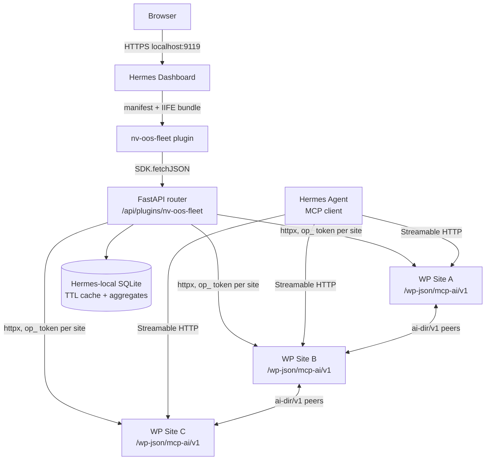

# Hermes Dashboard Extensions — NV oOS Offload Plan

> **Status:** Proposal / research complete
> **Audience:** Agent devs, plugin maintainers
> **Goal:** Port NV oOS WordPress admin load into the Hermes Agent web dashboard
> (`hermes dashboard`) as drop-in extensions, so WordPress installs stop rendering
> heavy admin screens and only serve REST/MCP traffic.

---

## 1. Context

NV oOS ships a large `wp-admin` surface (`includes/admin/` — ~90 screen classes,
22 settings sections, analytics dashboards, cron managers, workflow/DAG builders,
security monitors). Every one of those screens costs a full WordPress bootstrap
plus PHP rendering plus admin-ajax polling. Running the same monitoring across a
*fleet* of sites multiplies that cost and forces operators to log into N
wp-admins.

Hermes Agent's web dashboard now has a first-class extension system
([docs](https://hermes-agent.nousresearch.com/docs/user-guide/features/extending-the-dashboard),
shipped in [PR #10951](https://github.com/NousResearch/hermes-agent/pull/10951)).
It exposes three drop-in layers — **themes**, **UI plugins**, and **backend
plugins** — with no repo fork, no build step, and runtime hot-reload. Hermes is
already the natural companion: the NV oOS REST layer explicitly treats "Direct
MCP clients (Hermes, Zed bridges, Claude Desktop)" as a first-class consumer
(`.context/rest-api.md` §5), and Hermes ships an MCP client that can consume the
plugin's `/wp-json/mcp-ai/v1/mcp` Streamable-HTTP endpoint directly.

**Thesis:** move *viewing and orchestration* to Hermes; keep *tool execution and
data mutation* on WordPress where the data lives.

---

## 2. Research summary — the Hermes extension model

### 2.1 The three layers

| Layer | Location | Format | Notes |
|---|---|---|---|
| **Theme** | `~/.hermes/dashboard-themes/*.yaml` | YAML | Palette (3-layer), typography, layout (`standard`/`cockpit`/`tiled`), component chrome, raw `customCSS` (32 KiB cap), asset slots as CSS vars |
| **UI plugin** | `~/.hermes/plugins/<name>/dashboard/` | `manifest.json` + pre-built JS bundle (IIFE, no build step) | Registers tabs, replaces built-in pages (`tab.override`), injects into shell/page slots, optional `style.css` |
| **Backend plugin** | same dir | `plugin_api.py` exporting a FastAPI `router` | Mounted at `/api/plugins/<name>/`, runs in the dashboard process, can import Hermes internals |

All three are drop-in at runtime; discovery priority is `user` >
`bundled` > `project`. `GET /api/dashboard/plugins/rescan` picks up new UI
plugins without restart; backend routes are mounted **once at startup**.

### 2.2 Plugin SDK (browser side)

`window.__HERMES_PLUGIN_SDK__` provides:
- `SDK.React` + `SDK.hooks.*` — plugins never bundle React.
- `SDK.components.*` — shadcn/ui primitives (Card, Button, Input, Select,
  Tabs, Badge, PluginSlot, …).
- `SDK.api.*` — typed Hermes client (`getStatus`, `getSessions`, …).
- `SDK.fetchJSON(path)` — fetch with the dashboard auth token injected; the
  canonical way to call your own backend plugin.
- `SDK.utils.cn`, `SDK.utils.timeAgo`, `SDK.useI18n`.

### 2.3 Slots (composition without forking)

Shell-wide: `backdrop`, `header-left`, `header-right`, `header-banner`,
`sidebar` (cockpit variant only), `pre-main`, `post-main`, `footer-left`,
`footer-right`, `overlay`.

Page-scoped: `<page>:top` / `<page>:bottom` for `sessions`, `analytics`,
`logs`, `cron`, `skills`, `config`, `env`, `docs`, `chat` — the recommended
way to augment built-in pages (prefer over `tab.override` so future Hermes
updates keep working).

### 2.4 Backend plugin rules

- `plugin_api.py` exports module-level `router = APIRouter()`.
- Routes sit behind the dashboard auth gate (401 before the plugin runs).
- Can import Hermes internals: `hermes_state`, `hermes_cli.config`,
  `hermes_*` modules.
- **Don't expose the dashboard on a public interface with `--host 0.0.0.0`
  while running untrusted plugins** (official warning).
- Distribution today = directory layout / git clone; no pip installer yet.

### 2.5 Industry-standard constraints this plan follows

- IIFE bundles, React externalised, target **a few KB** per plugin (Hermes
  reference plugins: single-surface, < ~200 LOC, production-shaped).
- Page-scoped slots over full page replacement; `tab.hidden: true` for
  slot-only plugins.
- Per-plugin CSS references `--color-*` tokens so extensions reskin with the
  active theme.
- Backend caching discipline (TTL + stale-while-revalidate), async fan-out
  with connection pooling — standard control-plane practice.
- Credentials out of the UI bundle; stored server-side with 0600 perms
  (Hermes itself does this for MCP tokens at `~/.hermes/mcp-tokens/`).

---

## 3. What exists on the NV oOS side (the porting surface)

### 3.1 REST surface usable *today* (no WP changes needed for Phase 1–3)

| Area | Endpoints | Auth |
|---|---|---|
| MCP JSON-RPC 2.0 (Streamable HTTP) | `POST/GET /mcp-ai/v1/mcp` | cred token, raw or `Bearer` form |
| Chat (streaming) | `POST /mcp-ai/v1/chat`, `GET /sse` | nonce / cred / guest |
| Assistants | `GET /mcp-ai/v1/assistants`, create | cred (assistant-scoped) |
| Tools | `POST /mcp-ai/v1/tools` | cred |
| Async jobs | `GET /mcp-ai/v1/cron-status`, `/cron-status/stream`, `/{job_id}/cancel`, `/{job_id}/retry` | owner-scoped |
| Memory bridge | `/mcp-ai/v1/chat-memory/*` (6 routes) | cred |
| Paper Store | `/mcp-ai/v1/paper-store` CRUD + search | cred |
| Restrictions | `/mcp-ai/v1/restrictions`, `/users/{id}/restrictions` | `manage_options` on writes |
| Health / token / cost / analytics managers | REST managers registered in `class-wp-mcp-ai-rest.php` | varies |
| Pro Shared Analytics | `/mcp-ai-pro/v1/analytics/*` (v1.1.53) | Pro |
| Pro OKF (read-only) | `/mcp-ai-pro/v1/okf/*` (v1.1.62) | Pro |
| Federation directory | `ai-dir/v1/peers` register/list/search/reverify/report | admin / rate-limited public |

### 3.2 Admin screens that generate the most load (port candidates)

| Screen | Class | Why it's heavy |
|---|---|---|
| Analytics dashboard | `class-wp-mcp-ai-analytics-dashboard.php` | aggregate SQL over the measurement event store per page view |
| Cron manager | `class-wp-mcp-ai-admin-cron-manager.php` | admin-ajax polling of job state |
| Workflow/DAG builder + run timeline | `class-wp-mcp-ai-admin-dag-builder.php`, `class-wp-mcp-ai-admin-run-timeline.php` | large React bundles enqueued in wp-admin |
| DLQ manager | `class-wp-mcp-ai-admin-dlq-manager.php` | polling |
| Token manager | `class-wp-mcp-ai-admin-token-manager.php` | credential lifecycle UI |
| Security monitor | `class-wp-mcp-ai-security-monitor-admin.php` | posture scans + audit rendering |
| Orchestration / multi-agent dashboards | `class-wp-mcp-ai-admin-orchestration-dashboard.php`, `-multi-agent-dashboard.php` | fleet-of-agents views |
| Settings dashboard (~22 sections) | `settings-dashboard-init.php` + `sections/` | every visit = full bootstrap + registry |

### 3.3 Multi-site primitives that make Hermes a natural control plane

- **Federation directory** (`ai-dir/v1/peers`) — sites already publish
  capability/region/policy metadata; Hermes can render the whole mesh.
- **Mesh peer sync / router / tester** — per-site peer state is REST-readable.
- **Credential tokens** (`cred_*.SECRET`, assistant-scoped, hashed at rest) —
  exactly the auth primitive a Hermes backend needs, with least-privilege
  granularity already built in.

---

## 4. Target architecture



Key properties:

- **Browser → WordPress never happens directly.** The FastAPI backend proxies
  everything, so there are no CORS issues and the dashboard auth gate protects
  every route.
- **One poller per site, not N browsers per site.** The backend owns polling
  (cron-status, logs, posture) with TTL caches; the browser gets push-shaped
  refresh via lightweight SSE from FastAPI.
- **Hermes' own MCP client** is the *second* integration lane: each WP site
  registered as an `mcp_servers` entry in Hermes `config.yaml`
  (`url: https://site/wp-json/mcp-ai/v1/mcp`, `Authorization` header with the
  cred token) turns the WP tool registry into `mcp_<site>_<tool>` tools in the
  Hermes agent — moving *agentic orchestration and chat* off WordPress
  entirely, while tool execution still runs where the data lives.
- **Aggregation happens in Hermes**, so cross-site analytics never runs on any
  single WordPress DB.

---

## 5. The extension suite — `nv-oos-fleet`

One plugin directory, three layers, phased delivery. Everything below is a
**single install**: `~/.hermes/plugins/nv-oos-fleet/` +
`~/.hermes/dashboard-themes/nv-oos.yaml`.

**Repo home:** `extensions/nv-oos-fleet/` (top-level, outside the
WordPress plugin tree — Hermes-side code does not ship in the WP plugin;
`.distignore` excludes the folder). `extensions/install.sh` copies the
tree into `~/.hermes/`. The WP-side companion is `addons/fleet-operator/`,
which issues the `op_*.SECRET` operator credentials this extension consumes.

```
# Source of truth (this repo)
extensions/nv-oos-fleet/
├── dashboard/
│   ├── manifest.json
│   ├── dist/
│   │   ├── index.js          # IIFE bundle — all tabs + slots
│   │   └── style.css         # NV oOS-branded, --color-* aware
│   ├── plugin_api.py         # FastAPI router
│   └── sites.yaml.example    # registry template (never commit real tokens)
└── theme/nv-oos.yaml

# Runtime (installed by install.sh)
~/.hermes/plugins/nv-oos-fleet/
└── dashboard/ ...
~/.hermes/dashboard-themes/nv-oos.yaml
```

### Phase 0 — Foundation (theme + connect)

1. **`nv-oos.yaml` theme** — NV oOS brand palette (3-layer), typography,
   `layoutVariant: cockpit`, sidebar/crest assets, `componentStyles` notched
   cards. Pure marketing-grade reskin; zero code.
2. **`/nv-oos/sites` tab** — site registry CRUD backed by `plugin_api.py`:
   - `GET/POST /api/plugins/nv-oos-fleet/sites` — list/add (URL + operator
     token, token never echoed back).
   - `POST /api/plugins/nv-oos-fleet/sites/{id}/import` — paste the
     `config.yaml` / `.env` fragment emitted by the fleet-operator addon's
     config generator and parse it into a registry entry (reuses the
     allowlist/read-only scope the operator already declared on the WP side).
   - `POST /api/plugins/nv-oos-fleet/sites/{id}/test` — round-trip health
     check via the health REST manager.
   - `sites.yaml` stored with 0600 perms, token values redacted in responses
     (mirrors Hermes' `redact_key` convention).
3. **`header-right` slot** — fleet status badge (N sites, degraded count) fed
   by a 30 s backend poll.

### Phase 1 — Read-only fleet monitoring (the biggest load win)

| Tab | Replaces on WP | Backend routes | WP endpoint used |
|---|---|---|---|
| `/nv-oos/fleet` | multi-agent + orchestration dashboards | `/fleet/health`, `/fleet/assistants` | health REST, `/assistants` |
| `/nv-oos/logs` | error/activity log screens | `/logs/errors`, `/logs/activity?site=&since=` | log options via REST manager |
| `/nv-oos/jobs` | cron manager + DLQ manager + run timeline | `/jobs/snapshot`, `/jobs/stream` (SSE proxy), `/jobs/{id}/cancel|retry` | `/cron-status`, `/cron-status/stream`, cancel/retry routes |
| `/nv-oos/analytics` | analytics dashboard | `/analytics/summary?range=`, `/analytics/top-tools`, `/analytics/costs` | measurement store + `mcp-ai-pro/v1/analytics/*` |
| `/nv-oos/security` | security monitor + audit admin | `/security/posture`, `/security/audit`, `/security/restrictions` | security REST managers, `/restrictions` |

Backend behaviour:
- **Cache policy:** health 30 s TTL, logs 15 s, posture 60 s,
  analytics 5–15 min (stale-while-revalidate on miss). Cross-site aggregates
  computed in Hermes SQLite, never on WP.
- **SSE proxy:** FastAPI streaming response forwards `/cron-status/stream`
  from one upstream connection per site and fans out to all connected browser
  tabs — this alone removes dozens of long-held PHP-FPM workers on busy sites.
- **Fan-out:** `httpx.AsyncClient` + `asyncio.gather` with a per-site
  semaphore and 5 s timeout; one dead site degrades its card, never the page.

### Phase 2 — Control plane (write paths)

| Tab | Capability | Gate |
|---|---|---|
| `/nv-oos/tokens` | generate / rotate / revoke assistant credential tokens fleet-wide (bulk rotation) | write-scoped cred token |
| `/nv-oos/tools` | browse/search the ~303–1,565 tool registry per site, flip per-assistant enablement | write-scoped cred token |
| `/nv-oos/workflows` | Pro workflow runs — monitor run history, re-dispatch, cancel | write-scoped cred token |
| `/nv-oos/paper-store` | Paper Store browse/search + import/export across sites | read/write cred token |
| `/nv-oos/mesh` | federation directory browser (`ai-dir/v1/peers`), peer verify/report | admin-scoped cred token |

Write-path rules:
- Every write route requires a site entry flagged `write: true` in `sites.yaml`
  (opt-in per site, not fleet-wide).
- Bulk operations (token rotation, workflow dispatch) run sequentially with
  per-site result reporting — never fire-and-forget.
- All mutations are audited into Hermes' own session/log store (backend plugin
  can import `hermes_state`), giving a control-plane audit trail independent of
  the WP sites.

### Phase 3 — Agent ops (Hermes-native orchestration)

1. **MCP bridge (config, not a plugin)** — generate a `hermes mcp add` snippet
   per site from the `/nv-oos/sites` tab:

   ```yaml
   # ~/.hermes/config.yaml
   mcp_servers:
     site-a:
       url: "https://site-a.example/wp-json/mcp-ai/v1/mcp"
       headers:
         Authorization: "Bearer op_xxxxx.SECRET"
       timeout: 120
   ```

   (The `op_*.SECRET` operator credential comes from the fleet-operator
   addon's config generator — allowlist-scoped, optionally read-only.)

   Result: Hermes agents call `mcp_site-a_get_recent_posts` etc. directly;
   WP no longer hosts the chat/orchestration loop, only tool execution.
2. **Chat monitoring** — `/nv-oos/chat` tab streams active `/sse` sessions per
   site (backend holds one upstream SSE per site, fans out locally).
3. **Embedded ask widget** — `chat:bottom` slot on Hermes' own chat page
   offering "Ask the fleet": a Hermes agent session that already has all WP
   sites mounted as MCP servers (Hermes is the orchestrator; WP sites are the
   tools).
4. **`sessions:bottom` slot** — cross-site cost/usage summary for the current
   Hermes session window, closing the loop between Hermes conversations and
   WP-side token tracking.

---

## 6. Load analysis — what actually moves off WordPress

| Load today | Hermes replacement | WP-side effect |
|---|---|---|
| Full `wp-admin` bootstrap + ~90 screen classes per visit | SPA tab rendered by the local dashboard | zero admin bootstraps for monitoring |
| N browsers admin-ajax polling (cron, DLQ, run timeline) | one backend poller per site + SSE fan-out | one poller instead of N; polling cadence decoupled from viewers |
| Analytics aggregate SQL per page view | aggregates cached in Hermes SQLite (TTL 5–15 min) | one aggregate query per cache window |
| Chart.js + admin asset enqueues per page | a few-KB IIFE bundle served by Hermes | no asset enqueue/parse on WP |
| Long-held SSE (chat, jobs stream) consuming PHP-FPM workers | proxied: one upstream connection per site, fan-out locally | fewer long-lived PHP workers |
| Logging into N wp-admins for fleet state | single pane of glass + federation directory | monitoring queries amortized and cacheable |
| Chat/orchestration loop running through WP PHP | Hermes MCP client orchestrates; WP serves tools only | WP drops model-orchestration overhead |

**What cannot move** (by design): tool execution that needs WP data, plugin
settings writes requiring WP nonces/capabilities, CPT/meta mutation. These are
on-demand operations, not standing load — which is exactly the split that keeps
WP healthy.

**Optional WP-side compounding win** (follow-up, separate PR): a
`WP_MCP_AI_HEADLESS_ADMIN` constant that skips registering the heaviest admin
screens (analytics, cron manager, DAG builder, DLQ) on sites fully managed from
Hermes — turning the offload from "users stop visiting" into "the load cannot
be generated".

---

## 7. Security model

1. **Credentials live only in `sites.yaml`** (0600, chmod-enforced on write),
   never in the JS bundle, never logged; responses return redacted forms
   (Hermes' `redact_key` convention).
2. **Least privilege by construction** — the fleet-operator addon issues
   `op_*.SECRET` operator credentials that are site-bound, expiring,
   rate-limited, and tool-allowlisted (with an optional read-only mode). The
   Hermes backend consumes those: monitoring tabs use read-only operators,
   write tabs use operators whose allowlists include only the tools those
   tabs need, and writes are gated per site (`write: true` in `sites.yaml`).
   Assistant `cred_*.SECRET` tokens are deliberately not used for the
   dashboard backend.
3. **Dashboard auth gate** — all `/api/plugins/nv-oos-fleet/*` routes sit
   behind Hermes' session auth (401 before the route runs). No new public
   surface is created on the WP side at all.
4. **Transport** — https-only site URLs enforced in the registry validator;
   self-signed/Cloudflare-proxied cases need explicit allowlisting.
5. **Do not run the dashboard with `--host 0.0.0.0`** while the fleet plugin
   is installed (official Hermes guidance for untrusted plugins; our plugin
   holds fleet credentials).
6. **Audit trail** — every write proxied to a WP site is also recorded in
   Hermes' session store, giving one tamper-evident control-plane log across
   the fleet.

---

## 8. Best-practice checklist (derived from research)

- [ ] IIFE bundle, React from `SDK.React`, no build step; bundle under ~20 KB.
- [ ] `manifest.json` fields: `name`, `label`, `icon` (Lucide from the mapped
      list), `version`, `tab.path/position`, `entry`, `css`, `api`.
- [ ] Use page-scoped slots (`sessions:bottom`, `chat:bottom`) instead of
      `tab.override` wherever possible.
- [ ] `style.css` references `--color-*` / `--radius` / `--spacing-mul` vars so
      the plugin reskins with any active theme.
- [ ] Backend exports module-level `router = APIRouter()`; remember backend
      changes need a dashboard restart (only UI rescans hot).
- [ ] Defensive SDK guards: check `window.__HERMES_PLUGIN_SDK__` exists before
      registering (mirrors the `strike-freedom-cockpit` reference pattern).
- [ ] Timeouts + per-site semaphores; degrade per-site, never fail fleet-wide.
- [ ] TTL caches with stale-while-revalidate; cache keys include site id.
- [ ] Distribution: git repo cloned into `~/.hermes/plugins/` (the documented
      path — no pip installer exists yet).

---

## 9. Risks & mitigations

| Risk | Mitigation |
|---|---|
| WP REST still costs a query per cache miss | cache-first reads; batch fan-out; keep aggregates in Hermes SQLite |
| Backend routes mount once — iteration is slow | develop routes against FastAPI directly (uvicorn), then drop into `plugin_api.py`; rescan for UI |
| Hermes dashboard plugin API is young (shipped ~2026) | pin to documented surfaces only; avoid `tab.override`; feature-detect slots |
| Cred token sprawl across fleet | token lifecycle tab (Phase 2) + per-site `write` opt-in flag |
| WP rate limits (tool rate limiting, request guard) | Hermes backend respects 429 + IETF rate-limit headers; backoff + jitter |
| Cloudflare 524 on long SSE polls (~100 s) | keep upstream SSE read-buffer flushing; reuse the WP side's documented poll budget limits |

---

## 10. Milestones & effort

| Milestone | Scope | Effort | Exit criteria |
|---|---|---|---|
| M0 — Foundation | theme YAML, sites registry, connect tab, header badge | 1–2 days | 2+ sites added, health test green, theme switcher shows NV oOS |
| M1 — Fleet monitoring | fleet/logs/jobs/analytics/security tabs (read-only) | 3–5 days | all tabs render against Docker WP sites; cache hits observable |
| M2 — Control plane | tokens/tools/workflows/paper-store/mesh tabs (writes) | 3–4 days | bulk token rotation + workflow re-dispatch succeed; audit rows written |
| M3 — Agent ops | MCP bridge generator, chat monitor, ask-widget slots | 2–3 days | Hermes agent calls `mcp_site-*` tools; chat streams through dashboard |

Total: **~9–14 days** of focused effort, with zero WP-side PHP changes required
for M0–M3.

---

## 11. Validation

**WP side (unchanged):** verify endpoints respond with a test cred token:

```bash
curl -H "Authorization: Bearer cred_xxxxx.SECRET" \
  https://site/wp-json/mcp-ai/v1/assistants
```

**Hermes side:**

```bash
curl http://127.0.0.1:9119/api/dashboard/plugins          # plugin discovered
curl http://127.0.0.1:9119/api/plugins/nv-oos-fleet/sites # backend mounted
```

**Load comparison (the actual goal):**
- WP side: Query Monitor / New Relic before-and-after — DB query count per
  monitoring view should drop from per-view aggregates to per-TTL-window.
- PHP-FPM: worker time held by SSE should fall to one upstream connection per
  site regardless of viewer count.
- Browser: dashboard tab render vs. wp-admin page render (lighthouse/console
  timing).

---

## 12. Alternatives considered

| Option | Verdict |
|---|---|
| Re-skin the WP admin as a React SPA (pro-dashboard style) | Keeps the load on WP; doesn't solve fleet view — rejected as the *primary* path |
| Iframe-embed WP admin pages in Hermes tabs | No auth/load benefit, still boots WP per frame — rejected |
| Standalone (non-Hermes) control-plane app | Rebuilds auth/UI/infra Hermes already ships — rejected |
| Full REST write-through for settings (nonce impersonation) | Needs WP-side changes and widens attack surface — deferred to a later `HEADLESS_ADMIN` follow-up |
| OAuth (Auth0) instead of cred tokens | Works for enterprise fleets; cred tokens are simpler per-site and already assistant-scoped — supported later as an auth *method* behind the same tabs |

---

## 13. References

- Hermes docs — Extending the Dashboard:
  <https://hermes-agent.nousresearch.com/docs/user-guide/features/extending-the-dashboard>
- Hermes dashboard plugin system PR:
  <https://github.com/NousResearch/hermes-agent/pull/10951>
- Hermes reference plugins: <https://github.com/NousResearch/hermes-example-plugins>
- Hermes MCP docs: <https://hermes-agent.nousresearch.com/docs/user-guide/features/mcp>
- NV oOS REST surface: `.context/rest-api.md`
- NV oOS admin surface: `includes/admin/README.md`
- NV oOS federation: `includes/class-wp-mcp-ai-federation*.php`
- NV oOS fleet operator addon (WP-side credential issuer + config generator):
  `addons/fleet-operator/README.md`
- Fleet operator proposal (WP-side plan, incl. Hermes config generation):
  `docs/project/proposals/024-hermes-agent-fleet-operator-implementation-plan.md`
- WordPress MCP over Hermes (community):
  <https://lobehub.com/skills/lmoncany-hermes-wordpress-skill-wordpress-mcp-setup>