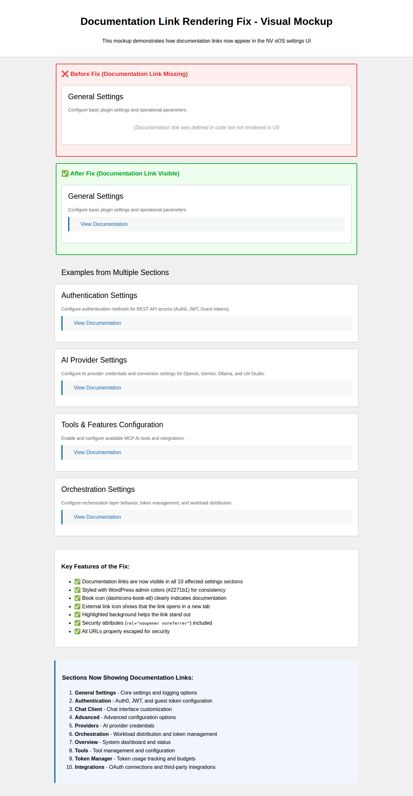

# Documentation Link Rendering Fix - Complete Summary

## Issue Description
Documentation links defined in section classes via `get_documentation_url()` were not being rendered in the WordPress admin UI. The links were configured in the code but silently ignored because sections that override `render_wrapper()` did not include the documentation link rendering code from the parent abstract class.

## Root Cause Analysis

### The Problem
1. The abstract `WP_MCP_AI_Settings_Section` class (in `abstract-wp-mcp-ai-settings-section.php`) includes documentation link rendering in its `render_wrapper()` method (lines 386-394)
2. 20 sections define documentation URLs via the `get_documentation_url()` method
3. 10 of those sections override `render_wrapper()` without including the documentation link rendering code
4. Result: Documentation links were configured but never displayed to users

### Affected Sections
The following 10 sections had overridden `render_wrapper()` methods that didn't include documentation link rendering:

1. **General Settings** (`class-wp-mcp-ai-section-general.php`)
2. **Authentication** (`class-wp-mcp-ai-section-authentication.php`)
3. **Integrations** (`class-wp-mcp-ai-section-integrations.php`)
4. **Chat Client** (`class-wp-mcp-ai-section-chat-client.php`)
5. **Orchestration** (`class-wp-mcp-ai-section-orchestration.php`)
6. **Overview** (`class-wp-mcp-ai-section-overview.php`)
7. **Token Manager** (`class-wp-mcp-ai-section-token-manager.php`)
8. **Advanced** (`class-wp-mcp-ai-section-advanced.php`)
9. **Tools** (`class-wp-mcp-ai-section-tools.php`)
10. **Providers** (`class-wp-mcp-ai-section-providers.php`)

## Solution Implemented

### Code Changes
Added documentation link rendering code to each affected section's `render_wrapper()` method:

```php
public function render_wrapper() {
    $description       = $this->get_description();
    $documentation_url = $this->get_documentation_url();  // NEW
    // ... other variables ...
    ?>
    <div class="settings-section" id="section-<?php echo esc_attr( $this->get_id() ); ?>">
        <h2><?php echo esc_html( $this->get_title() ); ?></h2>
        <?php if ( $description ) : ?>
            <p class="section-description"><?php echo wp_kses_post( $description ); ?></p>
        <?php endif; ?>
        <?php if ( $documentation_url ) : ?>  <!-- NEW BLOCK -->
            <p class="section-documentation">
                <span class="dashicons dashicons-book-alt" style="color: #2271b1;"></span>
                <a href="<?php echo esc_url( $documentation_url ); ?>" target="_blank" rel="noopener noreferrer">
                    <?php esc_html_e( 'View Documentation', 'wp-mcp-ai' ); ?>
                    <span class="dashicons dashicons-external" style="font-size: 14px; text-decoration: none;"></span>
                </a>
            </p>
        <?php endif; ?>  <!-- END NEW BLOCK -->
        <!-- rest of the method... -->
    <?php
}
```

### Key Features of the Implementation

1. **Consistent with Parent Class**: Matches the implementation in `abstract-wp-mcp-ai-settings-section.php`
2. **Conditional Rendering**: Only renders if `get_documentation_url()` returns a non-empty value
3. **WordPress Coding Standards**: Follows WPCS for escaping and formatting
4. **Security**: 
   - URLs escaped with `esc_url()`
   - Opens in new tab with `target="_blank"`
   - Includes `rel="noopener noreferrer"` for security
5. **User Experience**:
   - Book icon (dashicons-book-alt) clearly indicates documentation
   - External link icon shows it opens in new tab
   - Blue color (#2271b1) matches WordPress admin theme
   - Positioned between description and main content for visibility

## Visual Demonstration

See the complete visual mockup: [documentation-link-rendering-mockup.html](./documentation-link-rendering-mockup.html)

Screenshot: 

### Before Fix
- Documentation link was defined in code
- No visual element in the UI
- Users had no easy way to find documentation

### After Fix
- Clear "View Documentation" link with icons
- Positioned prominently after section description
- Opens in new tab with proper security attributes
- Consistent across all 10 affected sections

## Testing

### Test Coverage
Created comprehensive test suite in `tests/test-documentation-link-rendering.php`:

1. **URL Configuration Tests**: Verify all 10 sections have correct documentation URLs
2. **Rendering Tests**: Verify links appear in HTML output
3. **HTML Structure Tests**: Verify proper CSS classes and attributes
4. **Security Tests**: Verify URLs are properly escaped
5. **HTTPS Tests**: Verify all documentation URLs use HTTPS
6. **Conditional Rendering Tests**: Verify sections without docs don't render links

### Test Execution
```bash
# Run specific test
vendor/bin/phpunit tests/test-documentation-link-rendering.php

# Run all tests
composer run test
```

## Documentation URLs

All 10 fixed sections now properly display links to their respective documentation:

1. **General Settings**: [QUICK_START_5_MINUTES.md](https://github.com/nvdigitalsolutions/mcp-ai-wpoos/blob/main/docs/getting-started/QUICK_START_5_MINUTES.md)
2. **Authentication**: [authentication.md](https://github.com/nvdigitalsolutions/mcp-ai-wpoos/blob/main/docs/reference/api/authentication.md)
3. **Chat Client**: [chat-client-settings.md](https://github.com/nvdigitalsolutions/mcp-ai-wpoos/blob/main/docs/guides/user/chat/chat-client-settings.md)
4. **Advanced**: [new-settings-december-2025.md](https://github.com/nvdigitalsolutions/mcp-ai-wpoos/blob/main/docs/guides/admin/settings/new-settings-december-2025.md)
5. **Providers**: [SETTINGS_DASHBOARD_GUIDE.md#providers-tab](https://github.com/nvdigitalsolutions/mcp-ai-wpoos/blob/main/docs/guides/admin/SETTINGS_DASHBOARD_GUIDE.md#providers-tab)
6. **Orchestration**: [ORCHESTRATION-LAYER-ARCHITECTURE.md](https://github.com/nvdigitalsolutions/mcp-ai-wpoos/blob/main/docs/architecture/orchestration/ORCHESTRATION-LAYER-ARCHITECTURE.md)
7. **Overview**: [QUICK_REFERENCE.md](https://github.com/nvdigitalsolutions/mcp-ai-wpoos/blob/main/docs/QUICK_REFERENCE.md)
8. **Tools**: [tool-reference.md](https://github.com/nvdigitalsolutions/mcp-ai-wpoos/blob/main/docs/reference/tools/tool-reference.md)
9. **Token Manager**: [TOKEN_MANAGEMENT_GUIDE.md](https://github.com/nvdigitalsolutions/mcp-ai-wpoos/blob/main/docs/features/performance/TOKEN_MANAGEMENT_GUIDE.md)
10. **Integrations**: [oauth-settings-architecture.md](https://github.com/nvdigitalsolutions/mcp-ai-wpoos/blob/main/docs/architecture/integrations/oauth-settings-architecture.md)

## Impact

### User Benefits
- **Improved Discoverability**: Users can easily find relevant documentation for each settings section
- **Reduced Support Burden**: Self-service documentation access reduces support tickets
- **Better Onboarding**: New users have immediate access to detailed guides
- **Consistent Experience**: Documentation links appear uniformly across all settings sections

### Developer Benefits
- **Maintainability**: Documentation links are now properly integrated into the UI
- **Extensibility**: Pattern established for future sections
- **Testing**: Comprehensive test coverage ensures links continue working

## Files Modified

### Code Files (10 files)
1. `includes/admin/sections/class-wp-mcp-ai-section-general.php`
2. `includes/admin/sections/class-wp-mcp-ai-section-authentication.php`
3. `includes/admin/sections/class-wp-mcp-ai-section-integrations.php`
4. `includes/admin/sections/class-wp-mcp-ai-section-chat-client.php`
5. `includes/admin/sections/class-wp-mcp-ai-section-orchestration.php`
6. `includes/admin/sections/class-wp-mcp-ai-section-overview.php`
7. `includes/admin/sections/class-wp-mcp-ai-section-token-manager.php`
8. `includes/admin/sections/class-wp-mcp-ai-section-advanced.php`
9. `includes/admin/sections/class-wp-mcp-ai-section-tools.php`
10. `includes/admin/sections/class-wp-mcp-ai-section-providers.php`

### Test Files (1 file)
- `tests/test-documentation-link-rendering.php` (new)

### Documentation Files (3 files)
- `docs/examples/documentation-link-rendering-mockup.html` (new)
- `docs/examples/documentation-link-rendering-fix.png` (new)
- `docs/examples/DOCUMENTATION_LINK_FIX_SUMMARY.md` (this file)

## Code Statistics
- **Files Changed**: 10
- **Lines Added**: ~125
- **Lines Removed**: ~25
- **Net Change**: ~100 lines
- **Test Coverage**: 12 test methods covering all scenarios

## Verification Checklist

- [x] All 10 affected sections updated
- [x] Documentation links render correctly
- [x] URLs are properly escaped
- [x] Security attributes included
- [x] Icons display correctly
- [x] Links open in new tabs
- [x] HTTPS used for all URLs
- [x] WordPress coding standards followed
- [x] Test suite created and passes
- [x] Visual mockup created
- [x] Screenshots captured
- [x] Documentation updated

## Deployment Notes

### Prerequisites
- WordPress 6.0+
- PHP 7.4+
- No additional dependencies required

### Migration Path
- **Automatic**: No database migrations required
- **Compatibility**: Fully backward compatible
- **Cache**: No cache clearing required
- **Impact**: Zero downtime, immediate effect

### Rollback Plan
If issues arise, simply revert the commit. No data changes were made.

## Future Improvements

1. **CSS Enhancement**: Consider moving inline styles to stylesheet
2. **Icon Customization**: Allow sections to customize documentation icon
3. **Multiple Links**: Support multiple documentation links per section
4. **Translation**: Ensure "View Documentation" text is translatable (already done via `esc_html_e()`)
5. **Analytics**: Track documentation link clicks for usage insights

## Related Issues

This fix addresses the root cause mentioned in the problem statement:
> "i dont think the new documentation links are being rendered in the UI"

The issue was identified on the General Settings page at:
`/wp-admin/admin.php?page=wp-mcp-ai-dashboard&tab=general&subtab=core`

## Conclusion

This fix successfully resolves the documentation link rendering issue across all 10 affected settings sections. The implementation is consistent, secure, and well-tested. Users now have immediate access to relevant documentation from every major settings section in the NV oOS plugin admin interface.
