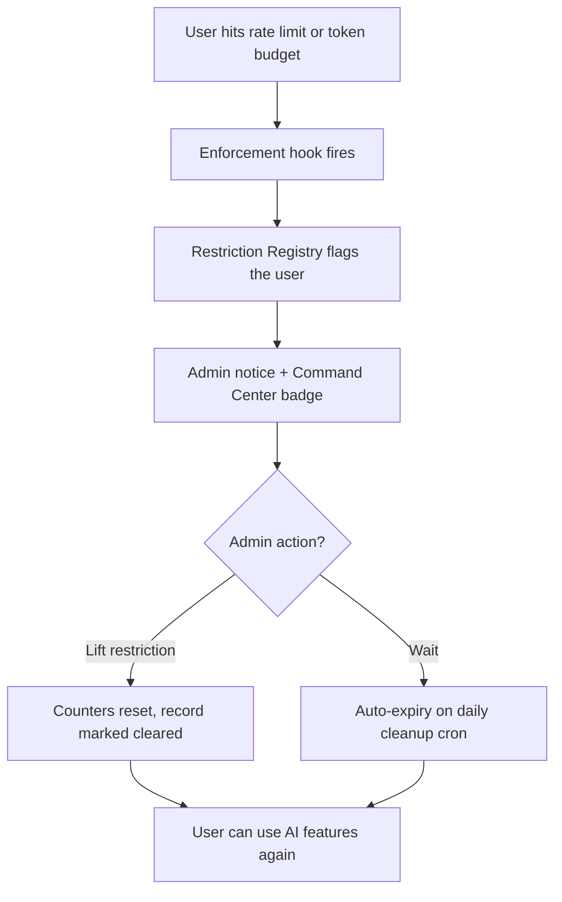

# User Restrictions — Flagging & Unblocking

The restriction system converts ephemeral enforcement events — chat rate limits,
daily token overages, and per-session budgets — into persistent, reviewable
records. When a user is blocked, administrators can see **who** is blocked,
**why**, and **for how long**, and can lift the restriction with one action
from the Token Manager or the Pro Command Center.

## Lifecycle



1. **Flag** — one of the enforcement hooks fires (`wp_mcp_ai_tool_token_limit_exceeded`,
   `wp_mcp_ai_per_session_limit_exceeded`, or `wp_mcp_ai_rate_limit_exceeded`).
   The `WP_MCP_AI_Restriction_Registry` upserts a restriction record and indexes it.
2. **Review** — the restriction appears on the Token Manager page ("Restricted
   Users" panel), the Pro Command Center ("Restrictions" tab with a live badge),
   and in a dismissible admin notice (unless disabled, see Settings).
3. **Lift** — an administrator lifts the restriction. The registry clears the
   record **and resets the underlying counters** (token usage, session budgets,
   rate-limit windows) so the user can continue immediately.
4. **Auto-expire** — rate-limit windows and daily token limits carry release
   timestamps; the daily cleanup cron sweeps expired records out of the active
   index (history is retained on the user record).

## What gets flagged

| Restriction type | Trigger | Auto-release |
|---|---|---|
| `rate_limit` | Chat rate limit exhausted (default 60 requests/min per user+assistant) | Window end |
| `token_overage` | Daily per-tool token limit exceeded (tier-based) | Next daily reset |
| `session_limit` | Per-session token budget exhausted | 1 hour grace (or admin lift) |
| `manual` | Admin-applied block via REST/CLI | Optional expiry |

## Admin surfaces

- **Token Manager (Base):** "Restricted Users" panel with a Lift button per row
  (`wp mcp-ai` menu → Token Manager).
- **Command Center (Pro):** Restrictions tab with KPI cards, filterable table,
  per-row Lift actions, nav-tab badge showing the active count, and an Overview
  banner when restrictions exist.
- **Admin notices:** dismissible banner listing newly restricted users.
  Toggle: Settings → Orchestration → **Restriction Notifications**
  (`enable_restriction_admin_notices`, default on). The
  `wp_mcp_ai_restriction_admin_notices` filter overrides at runtime.

## Lifting restrictions

Lifting also clears the storage behind the block:

- `token_overage` → `WP_MCP_AI_Tool_Token_Limits::reset_user_tool_usage()` +
  the usage-tracker user meta.
- `session_limit` → the session usage transient for that session.
- `rate_limit` → every `chat:{user_id}:*` window in the rate-limiter adapter's
  key index.

Every lift is audit-logged (who lifted, for whom, when) via the security audit
logger, and fires the `wp_mcp_ai_restriction_lifted` action.

## API surface

### REST (`mcp-ai/v1` namespace, write routes require `manage_options`)

| Method | Route | Purpose |
|---|---|---|
| `GET` | `/restrictions` | List active restrictions (`type`, `user_id`, `per_page`, `page`) |
| `GET` | `/users/{id}/restrictions` | Per-user records (self or admin) |
| `POST` | `/users/{id}/restrictions` | Admin-applied manual block (`reason`, `expires_in`) |
| `DELETE` | `/users/{id}/restrictions/{type}` | Lift a restriction |

### AJAX

- `wp_mcp_ai_lift_user_restriction` — lift (nonce `wp_mcp_ai_dashboard`).
- `wp_mcp_ai_get_restrictions` — list active restrictions.
- `wp_mcp_ai_dismiss_restriction_notice` — clear the notice queue.

### WP-CLI

```bash
wp mcp-ai restrictions list [--type=rate_limit] [--user=42] [--format=json]
wp mcp-ai restrictions lift 42 [--type=all]
wp mcp-ai restrictions add 42 --reason="Manual review" [--expires-in=86400]
```

## Filters & settings

| Hook / setting | Purpose |
|---|---|
| `wp_mcp_ai_chat_rate_limit` | Chat requests per window (default 60) |
| `wp_mcp_ai_chat_rate_limit_window` | Chat window length in seconds (default 60) |
| `wp_mcp_ai_restriction_admin_notices` | Runtime toggle for admin notices |
| `wp_mcp_ai_restriction_types` | Extend the known restriction types |
| `enable_restriction_admin_notices` | Settings toggle (Orchestration section) |

## Rate-limit response headers

REST responses that carry a rate-limited chat error include IETF-style headers
(`draft-ietf-httpapi-ratelimit-headers`) so clients can adapt their retry
policy:

```
RateLimit-Policy: quota;q=60;w=60
RateLimit: quota;r=0;t=60
Retry-After: 60
```

Values mirror the `wp_mcp_ai_chat_rate_limit*` filters. Blocked users also see
the guidance "If you believe this is an error, contact the site administrator."

## Storage model

- **Full records:** user meta `_wp_mcp_ai_restrictions` (`type => record`) with
  status (`active|expired|cleared`), trigger counts, and cleared-by audit data.
- **Fast index:** option `wp_mcp_ai_active_restrictions` (autoload off), keyed
  `user_id:type`, powering badge counts and table listings.
- **Rate-limit keys:** option `wp_mcp_ai_rl_index` maintained by the
  `Nvoos\WordPress\Adapter\RateLimiter` so windows can be enumerated and reset.
- **Audit:** `wp_mcp_ai_security_log` via the security audit logger
  (`wp_mcp_ai_restriction_flagged`, `wp_mcp_ai_restriction_lifted`,
  `wp_mcp_ai_restriction_manual_added`).

## Multisite notes

User meta is network-global in multisite, while the active index and the
rate-limit key index are per-site options. A restriction flagged on one site
therefore records against the user network-wide, but is only listed (and
liftable) on the site where it was flagged. This is intentional: each site
manages its own AI budget enforcement.
