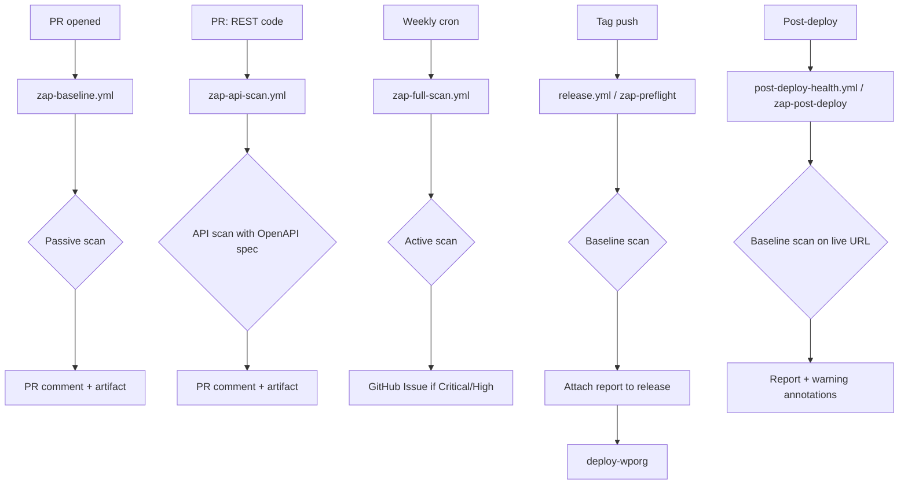

# OWASP ZAP DAST — Operational Reference

> **Status:** Phase 1–5 deployed (baseline + full + API scans active, pre-flight gate in release pipeline)
> **Proposal:** `docs/project/proposals/OWASP-ZAP-DAST-INTEGRATION-PROPOSAL.md`
> **Audit item:** R-T-06 ✅

---

## Overview

OWASP ZAP (Zed Attack Proxy) is the industry-standard open-source DAST (Dynamic Application Security Testing) tool. It runs against a live WordPress instance, spiders the site, and inspects traffic for security vulnerabilities — catching runtime issues that static analysis (SAST) cannot.

This plugin integrates ZAP into CI/CD via three GitHub Actions workflows:

| Workflow | Scan Type | Trigger | Blocking? |
|---|---|---|---|
| `zap-baseline.yml` | Passive spider + passive rules | PRs touching PHP/REST code | No (advisory only) |
| `zap-full-scan.yml` | Active spider + attack payloads | Weekly cron + manual | Warn-only (hardening in progress) |
| `zap-api-scan.yml` | OpenAPI-driven API scan | PRs touching REST controllers | Warn-only (hardening in progress) |
| `release.yml` (zap-preflight job) | Passive baseline scan | Tag push (release) | Warn-only — reports attached to release |
| `post-deploy-health.yml` (zap-post-deploy job) | Passive baseline scan | Post-deploy (opt-in) | Informational only |

---

## Architecture



---

## Quick Start

### Run a baseline scan locally

```bash
# Start the QA Docker stack
docker compose -f tests/qa/docker/docker-compose.qa.yml up -d wordpress db

# Wait for WordPress to be healthy
timeout 120 bash -c '
  while ! docker compose -f tests/qa/docker/docker-compose.qa.yml ps wordpress | grep -q "healthy"; do
    sleep 5
  done
'

# Run WordPress setup
docker compose -f tests/qa/docker/docker-compose.qa.yml run --rm setup

# Run ZAP baseline scan (passive only, safe)
docker run --network host -v $(pwd):/zap ghcr.io/zaproxy/zaproxy:stable \
  zap-baseline.py -t http://localhost:8000 \
  -c .zap-rules.tsv \
  -r zap-report.html \
  -J zap-report.json \
  --auto

# View the HTML report
open zap-report.html

# Tear down
docker compose -f tests/qa/docker/docker-compose.qa.yml down -v
```

### Run a full active scan locally

**⚠️ Warning:** The full scan sends real attack payloads (SQL injection, XSS, command injection). Only run against local/dev environments — never production.

```bash
docker run --network host -v $(pwd):/zap ghcr.io/zaproxy/zaproxy:stable \
  zap-full-scan.py -t http://localhost:8000 \
  -c .zap-rules.tsv \
  -r zap-full-report.html \
  -J zap-full-report.json \
  --auto
```

---

## Rules Configuration

The `.zap-rules.tsv` file in the repository root controls how ZAP handles each alert. Format:

```
<rule-id>\t<action>\t<reason>
```

Actions:
- **`IGNORE`** — Known false positive or accepted risk. Suppressed entirely.
- **`WARN`** — Needs review but doesn't block the build.
- **`FAIL`** — Blocks the build. Only for confirmed Critical/High findings.

### Adding a new rule

1. Identify the rule ID from the ZAP report (HTML or JSON).
2. Determine the correct action:
   - Is it a WordPress core behavior the plugin can't control? → `IGNORE`
   - Is it a legitimate finding that needs investigation? → `WARN`
   - Is it a confirmed vulnerability that must be fixed? → `FAIL`
3. Add a line to `.zap-rules.tsv` with a brief justification.

### Example

```
# This header is set by the web server, not the plugin.
10021	IGNORE	X-Content-Type-Options Header Missing — set by WP core / server config

# XSS in AI-generated content display is a real risk.
40012	FAIL	Cross Site Scripting (Reflected) — critical for AI-generated content display
```

---

## CI Workflow Details

### `zap-baseline.yml` (Phase 1 — Active)

**What it does:**
1. Checks out the repository.
2. Pulls Docker images (WordPress 6.9, MySQL 8.0, WP-CLI).
3. Starts the QA Docker stack (`tests/qa/docker/docker-compose.qa.yml`).
4. Runs WordPress setup (install, activate plugin, configure permalinks).
5. Smoke-tests the target URL.
6. Runs ZAP baseline scan (passive spider for 1 minute + passive rules).
7. Uploads HTML/JSON reports as workflow artifacts (30-day retention).
8. Posts a PR comment with alert severity summary (High/Medium/Low/Info counts).
9. Tears down the Docker stack.

**Artifacts:**
- `zap-baseline-report.html` — Full HTML report with alert details.
- `zap-baseline-report.json` — Machine-readable JSON report.
- `.zap-rules.tsv` — The rules file used for the scan (for audit trail).

### `zap-full-scan.yml` (Phase 3 — Planned)

**What it does:**
1. Runs on weekly cron (Sunday 02:00 UTC) or manual dispatch.
2. Can target a staging URL (repository variable) or spin up Docker locally.
3. Runs active spider (crawls all discovered pages) + active scan (sends real attack payloads).
4. Creates GitHub Issues for Critical/High findings.

### `zap-api-scan.yml` (Phase 4 — Planned)

**What it does:**
1. Generates an OpenAPI 3.0 spec from WordPress registered REST routes.
2. Runs ZAP API scan using the generated spec.
3. Triggers on PRs touching REST controller files.

---

## Interpreting Results

### Alert Severity Levels

| Level | ZAP Code | Meaning | Action |
|---|---|---|---|
| 🔴 High | 3 | Confirmed exploitable vulnerability | Fix immediately |
| 🟡 Medium | 2 | Potential vulnerability, needs investigation | Review within sprint |
| 🟢 Low | 1 | Minor issue or best-practice deviation | Review when convenient |
| 🔵 Info | 0 | Informational only | No action required |

### Common WordPress False Positives

| Finding | Why It's a False Positive | Rule Action |
|---|---|---|
| `X-Content-Type-Options` header missing | Set by WordPress core or web server | `IGNORE` (10021) |
| `Server` header leaks version | WordPress core behavior | `IGNORE` (10036) |
| Missing CSP header | Typically set at reverse-proxy level | `WARN` (10038) |
| XML-RPC enabled | WordPress core feature | `IGNORE` (90001) |
| `X-Powered-By` header | PHP/Apache behavior, not plugin | `IGNORE` (10037) |
| Missing `SameSite` cookie attribute | WordPress core cookie handling | `IGNORE` (10010) |

### Real Findings to Watch For

| Finding | Why It Matters for This Plugin | Rule Action |
|---|---|---|
| Reflected XSS | AI-generated content displayed without escaping | `FAIL` (40012) |
| SQL Injection | ~830 tools may construct queries from AI input | `FAIL` (40018) |
| Path Traversal | File upload/processing tools accept user paths | `FAIL` (6) |
| SSRF | Tools fetch external URLs (web scraping, API calls) | `WARN` (40028) |
| Auth bypass | 4 auth methods + `__return_true` callbacks | `FAIL` (10040) |
| CORS misconfig | REST API responses with wildcard origins | `FAIL` (10040) |

---

## Troubleshooting

### ZAP scan fails to start

```
Error: Unable to access target URL
```

**Cause:** WordPress Docker stack didn't start in time or is unhealthy.

**Fix:**
```bash
# Check if WordPress is healthy
docker compose -f tests/qa/docker/docker-compose.qa.yml ps wordpress

# Check WordPress logs
docker compose -f tests/qa/docker/docker-compose.qa.yml logs wordpress

# Manual curl test
curl -v http://localhost:8000
```

### ZAP reports "0 alerts found" but you expected some

**Cause:** The spider didn't discover enough pages (only 1 minute of crawling).

**Fix:**
- Increase spider duration: `-m 5` in `cmd_options` (5 minutes).
- Ensure the WordPress setup step completed successfully (plugin activated, permalinks set).
- Check that the plugin's REST API endpoints are registered (needs permalinks).

### Too many false positives

**Cause:** The `.zap-rules.tsv` baseline hasn't been tuned yet.

**Fix:**
1. Review the ZAP HTML report to identify recurring false positives.
2. Add `IGNORE` rules to `.zap-rules.tsv` with documented justifications.
3. Commit and push the updated rules file.

### Build blocked by ZAP findings

**Cause:** A `FAIL` rule was triggered (Phase 5 hardened mode).

**Fix:**
1. Review the finding in the ZAP HTML report.
2. If it's a real vulnerability: fix the code.
3. If it's a false positive: update `.zap-rules.tsv` to `IGNORE` or `WARN`.
4. If it's a WordPress core behavior: `IGNORE` with justification.

---

## Security Considerations

- **Never run full active scans against production.** The `zap-full-scan.yml` workflow targets the ephemeral Docker environment by default.
- **ZAP reports may contain sensitive data** (URLs, parameters, response snippets). Reports are uploaded as GitHub Actions artifacts with 30-day retention and are only accessible to repository collaborators.
- **The `.zap-rules.tsv` file is public.** Don't include secrets or internal URLs in rule justifications.
- **ZAP runs in the GitHub Actions runner's network namespace.** It can reach `localhost:8000` (the Docker port mapping) but cannot reach internal services outside the runner.

---

## References

- [OWASP ZAP Documentation](https://www.zaproxy.org/docs/)
- [ZAP Docker Images](https://www.zaproxy.org/docs/docker/)
- [ZAP GitHub Actions](https://github.com/zaproxy/action-baseline)
- [OWASP Top 10 (2021)](https://owasp.org/www-project-top-ten/)
- [WordPress REST API Authentication](https://developer.wordpress.org/rest-api/using-the-rest-api/authentication/)
- [NV oOS Security Audit (2026-04)](../../project/audits/2026-04/README.md)
