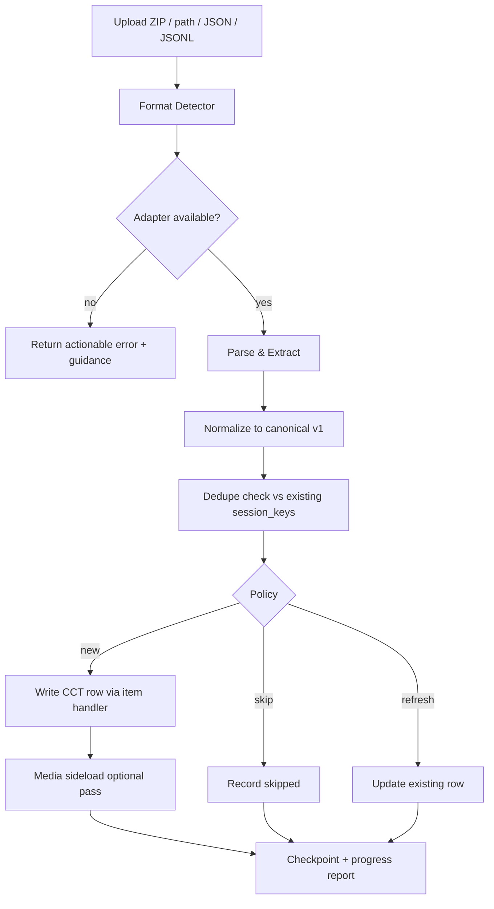

# Conversation Import to CCT — Implementation Plan

**Status:** All four phases implemented (2026-08-20) — ChatGPT + Gemini + Claude + ShareGPT + OpenAI-JSONL adapters, core pipeline, tools, CLI, async queue, admin UI, privacy, deletion tooling, media sideloading, memory mining, and docs. See §6.
**Scope:** Import external AI conversation exports (OpenAI ChatGPT, Anthropic Claude, Google Gemini, ShareGPT datasets, OpenAI fine-tuning JSONL) into the JetEngine `ai_chat_transcripts` CCT.
**Confirmed decisions:** one CCT row per conversation · branch policy = `current_node` only · Phase 1 = ChatGPT (with Gemini early) · Gemini is early priority · Full-version (JetEngine) placement only.
**Author:** Zed coding agent
**Date:** 2026-08-20

---

## 1. Goals

1. Give site owners a single, reliable way to bring their external chat history into the
   existing `ai_chat_transcripts` CCT so it is queryable via JetEngine UI/REST and usable
   by downstream plugin features (memory mining, analytics, chat continuation).
2. Support the four dominant industry export formats with an adapter architecture that
   makes adding new sources cheap.
3. Guarantee **idempotency** (re-importing the same archive never duplicates rows) and
   **resumability** (a 200 MB archive can be imported in batches without restarting from zero).
4. Preserve provenance: every imported row must record where it came from, when it was
   imported, and with which importer version.
5. Meet the plugin's security bar: capability checks, upload validation, zip-slip
   protection, escaping, and privacy-export/erase integration.

---

## 2. Research Summary — Source Formats & Industry Standards

### 2.1 Format inventory

| Source | Export mechanism | Payload files | Format | Maturity of schema |
|---|---|---|---|---|
| OpenAI ChatGPT | Settings → Data Controls → Export data (email link) | `conversations.json` (+ `chat.html`, sanitized images) | Single minified JSON array, **tree/graph message mapping** | Well documented (community-reverse-engineered) |
| Anthropic Claude | claude.ai → Settings → Privacy → Export data (email link) | `conversations.jsonl` | JSONL, one conversation per line | Moderate; changed over time (`text` vs `content` blocks) |
| Google Gemini | takeout.google.com → My Activity → Gemini Apps | `My Activity/Gemini/*.json` (or HTML) | Activity records, non-conversation-shaped | Weakest; least standardized |
| ShareGPT / Vicuna / FastChat | Community tooling (oobabooga, chatgpt-exporter, exporters) | `*.json` / `*.jsonl` | `{"conversations": [{"from", "value"}]}` | De facto lingua franca for fine-tuning datasets |
| OpenAI fine-tuning JSONL | Platform & community tooling | `*.jsonl` | One `{"messages": [{"role", "content"}]}` per line | Official API format |

### 2.2 Key structural facts per format

**ChatGPT `conversations.json`** (see [docs-for-agents schema](https://github.com/xuy/docs-for-agents/blob/main/ChatGPT_export_schema.md) and [OpenAI help](https://help.openai.com/en/articles/7260999-how-do-i-export-my-chatgpt-history-and-data)):

- Root is a flat array of conversation objects: `id`, `title`, `create_time` (float unix seconds),
  `update_time`, `default_model_slug` (~98% present), `current_node`, `mapping`.
- `mapping` is a tree: nodes have `message` (nullable), `parent`, `children[]`. Branches occur when
  the user edited/regenerated a response. Industry-standard linearization: walk `current_node`
  backwards to the root, then reverse.
- Message roles: `user`, `assistant`, `system`, `tool`. Content types: `text`, `multimodal_text`,
  `code`, `execution_output`, `thoughts`, `reasoning_recap`, etc. — `content.parts` is an array of
  strings or image-pointer objects.
- Hidden messages: `weight: 0.0` and/or `metadata.is_visually_hidden_from_conversation: true`
  (mostly `system` messages) — must be filtered (or flagged) for user-facing views.
- Images are `image_asset_pointer` objects referencing `sediment://file_XXXX` → sanitized files in
  the ZIP root; many are absent, so resolution must be graceful.
- Files routinely exceed 100–200 MB; single-line minified JSON. Citations appear inline as
  `【cite】【...】` or `\ue200cite\ue202...\ue201` markers and should be cleaned or normalized.

**Claude `conversations.jsonl`** (see [XTrace guide](https://xtrace.ai/blog/export-claude-conversations), [LLMnesia](https://www.llmnesia.com/blog/how-to-export-claude-conversation-history)):

- One JSON object per line: `uuid`, `name`, `created_at` / `updated_at` (ISO strings), `account`,
  and `chat_messages[]` with `sender` (`human` | `assistant`), `text` and/or structured `content`
  blocks (newer exports move text into blocks), `attachments`, `files`.
- Branched conversations are **not** marked in current exports — linearize in array order.
- JSONL is trivial to stream line-by-line — the recommended format for very large archives.

**Gemini via Google Takeout** ([Takeout → My Activity → Gemini Apps](https://www.llmnesia.com/blog/how-to-export-gemini-conversation-history)):

- Activity JSON under `Takeout/My Activity/Gemini/` with records containing `time`, `title`,
  `subtitles`, `products`; prompt/response text lives inside nested activity details. HTML format
  is also selectable and should be rejected with guidance (or parsed only if JSON is unavailable).
- Note the Takeout quirk: the top-level "Gemini" category exports *Gems*, not chat logs — the real
  history is under **My Activity → Gemini Apps**.

**ShareGPT** (see [oobabooga #7184](https://github.com/oobabooga/text-generation-webui/issues/7184), [TRL #2083](https://github.com/huggingface/trl/issues/2083), [Anyscale docs](https://docs.anyscale.com/llm/fine-tuning/data-preparation)):

- `{"conversations": [{"from": "human"|"gpt"|"system", "value": "..."}]}`; canonical role mapping
  `human→user`, `gpt→assistant` is the agreed convention across the fine-tuning ecosystem.

### 2.3 Best practices distilled from the research

1. **Normalize to one canonical model early.** Every credible converter (chatgpt-exporter,
   oobabooga, TRL) collapses its source into a role/message list before anything else. The
   OpenAI Chat Completions messages shape (`role` + `content`) is the community's interchange
   default; we adopt it internally.
2. **Defensive parsing.** Optional fields are everywhere (`default_model_slug` ~98%, `gizmo_id`
   ~25%). Never assume presence; use defaults; validate shapes before mapping.
3. **Tree linearization policy.** Follow `current_node` → root; expose a branch policy
   (current-node is default) rather than hardcoding it.
4. **Hidden-message filtering.** Drop `weight: 0.0` / `is_visually_hidden_from_conversation`
   messages by default for display, but keep the **raw original payload** archived so nothing
   is ever lost.
5. **Streaming for large files.** JSONL streams naturally; minified 200 MB JSON arrays need a
   memory guard (size cap + `WP_MEMORY_LIMIT` check) with a documented fallback ("export as
   JSONL via a converter").
6. **Idempotent, resumable imports.** Composite key = `platform + source_id (+ update_time)`;
   skip-or-refresh policy; checkpoints so a failed batch job resumes instead of restarting.
7. **Preserve provenance.** Record platform, source ID, source title, source timestamps, model
   slugs, importer version, and dedupe hash on every row (mirrors Zep/mem0 provenance thinking
   already referenced in the Agent Memories CCT).
8. **Media handled as a second-class concern.** Image pointers resolve against export files
   *when present*; missing files degrade to text placeholders, never fatal errors.

---

## 3. Target Data Model — `ai_chat_transcripts` CCT

### 3.1 Existing schema (`WP_MCP_AI_JetEngine_CCT`, slug `ai_chat_transcripts`)

| Field | Type | Purpose |
|---|---|---|
| `session_key` | text (required, max 96) | Correlation key grouping related messages/turns |
| `user_id` | number | WordPress user ID |
| `assistant_id` | text | Internal assistant identifier |
| `assistant_model` | text | Model string |
| `request_payload` | textarea (JSON) | Full request payload |
| `response_payload` | textarea (JSON) | Assistant response payload |
| `metadata` | textarea (serialized) | Token usage, cost, latency details |
| `latency_ms` | number | End-to-end latency |
| `request_started_at` | datetime (timestamp) | Request start |
| `response_completed_at` | datetime (timestamp) | Response completion |

### 3.2 Recommended row strategy — **one CCT row per imported conversation** (confirmed)

Rationale: the CCT is already "an exchange plus payloads", and `session_key` exists precisely to
group related rows. Importing a 40-message conversation as 40 rows would inflate the CCT ~40x
with rows that no plugin feature (transcript recorder consumers, mining) is shaped to read,
while a single row per conversation keeps imported data queryable as a unit and matches how
transcripts are displayed.

| CCT field | Imported value |
|---|---|
| `session_key` | `import:{platform}:{source_id}` truncated to 96 chars |
| `user_id` | Importing WP user ID (or 0 for CLI/system imports) |
| `assistant_id` | `import-{platform}` (e.g. `import-chatgpt`) |
| `assistant_model` | `default_model_slug` / last assistant model / empty |
| `request_payload` | JSON of normalized messages array (canonical format §4.1) |
| `response_payload` | JSON of final assistant message (for consumers expecting one) |
| `metadata` | Provenance envelope (§4.4) |
| `latency_ms` | 0 (not applicable) |
| `request_started_at` | conversation `create_time` (UTC) |
| `response_completed_at` | conversation `update_time` (UTC) |

Variant (rejected for now): **per-turn mode** — one row per user/assistant pair with the same
`session_key`. Deferred; would be an `import_mode` argument (`conversation` | `turns`) if ever
wanted.

### 3.3 No schema changes required for Phase 1

Provenance fits entirely inside the existing `metadata` field. If per-turn mode proves popular,
a Phase 2+ schema addition (`source_platform`, `source_conversation_id` as first-class columns)
can ride the existing CCT migrator pattern (`WP_MCP_AI_Agent_Memory_CCT_Migrator`).

---

## 4. Architecture

### 4.1 Canonical intermediate format (v1)

```json
{
  "schema_version": 1,
  "source": {
    "platform": "chatgpt | claude | gemini | sharegpt | openai_jsonl",
    "source_id": "67a678d3-a274-8191-94ee-7ca817b25b36",
    "title": "Python Data Processing",
    "created_at": 1760486728,
    "updated_at": 1767650773,
    "model": "gpt-4"
  },
  "messages": [
    {
      "role": "user | assistant | system | tool",
      "content": "Hello!",
      "timestamp": 1760486728,
      "attachments": ["file_0000...-sanitized.jpg"],
      "hidden": false,
      "metadata": {}
    }
  ]
}
```

Rules: roles normalized to the OpenAI set (`human→user`, `gpt→assistant`); timestamps stored as
UTC unix seconds; `content` always a plain string (rich blocks collapsed to text, images become
`[Image: filename]` placeholders resolved later by the media pass).

### 4.2 Pipeline



### 4.3 Component inventory

New folder `includes/conversation-import/` (with its own `README.md` per repo convention):

| File | Responsibility |
|---|---|
| `interface-wp-mcp-ai-conversation-import-adapter.php` | `detect()`, `extract()`, `parse()`, `normalize()` contract |
| `class-wp-mcp-ai-conversation-import-adapter-chatgpt.php` | conversations.json tree walk, `current_node` linearization, hidden filter, citation cleanup |
| `class-wp-mcp-ai-conversation-import-adapter-claude.php` | JSONL line streaming, sender mapping, content-block collapse |
| `class-wp-mcp-ai-conversation-import-adapter-sharegpt.php` | `conversations[]` → canonical |
| `class-wp-mcp-ai-conversation-import-adapter-openai-jsonl.php` | `messages[]` lines → canonical |
| `class-wp-mcp-ai-conversation-import-adapter-gemini.php` | Takeout activity JSON (Phase 4) |
| `class-wp-mcp-ai-conversation-import-format-detector.php` | File/MIME/content sniffing → adapter selection |
| `class-wp-mcp-ai-conversation-import-canonical-model.php` | Canonical v1 DTO + validation |
| `class-wp-mcp-ai-conversation-import-cct-writer.php` | Maps canonical → CCT row via `WP_MCP_AI_JetEngine_CCT::get_item_handler()->update_item()` |
| `class-wp-mcp-ai-conversation-import-manager.php` | Orchestration: dry-run, batching, checkpoints, dedupe policy, report assembly |

New tools (`includes/tools/`, following `paper_store_*` / `crawl4ai_*` conventions):

| Tool slug | Purpose |
|---|---|
| `conversation_import_detect` | Inspect an uploaded file/URL; report detected format, counts, preview |
| `conversation_import_run` | Execute import (dry-run flag, `import_mode`, policy, batch size, limit) |
| `conversation_import_status` | Progress/checkpoint status, last-run report, errors |

Other surfaces:

- **WP-CLI**: extend `WP_MCP_AI_Cli_Command` — `wp mcp-ai import-conversations <path> [--dry-run] [--format=...] [--batch=...]`.
- **Admin UI** (Phase 2): Tools → NV oOS → Import Conversations page; upload + settings + live progress.
- **Async execution**: large imports run through `WP_MCP_AI_Async_Job_Queue` so a 200 MB archive
  doesn't block a web request.

### 4.4 Idempotency & dedupe

- Dedupe key: `platform + source_id + update_time` hashed (`hash('sha256', ...)`) and stored in
  `metadata` on the CCT row.
- Pre-import pass: `WP_Query`-style fetch of existing `session_key`s in the target range, then:
  - `skip` (default): identical hash → skipped; new/updated → imported.
  - `refresh`: updated source rows overwrite the existing CCT row.
- Never update rows that carry the same `session_key` but a different platform prefix (key
  includes platform, so collisions are structurally impossible).

### 4.5 Batching, checkpoints & resumability

- Process in chunks of `batch_size` (default 25 conversations per job tick).
- Checkpoint option `wp_mcp_ai_conversation_import_checkpoint` records: job token, adapter,
  last processed index, totals, and per-conversation results — updated after every batch.
- A `--resume <token>` resumes from the checkpoint; completed conversations are skipped by dedupe.
- Memory guard: if file size exceeds `wp_mcp_ai_import_max_file_mb` (default 128) **and** is a
  non-streamable single-line JSON, refuse with guidance to re-export as JSONL or split; JSONL
  sources stream line-by-line with no whole-file decode.

### 4.6 Media sideloading (Phase 4)

- After a successful import, optionally resolve `[Image: ...]` references against files found
  in the ZIP/archive folder using `media_handle_sideload()`, then rewrite placeholders to
  attachment URLs. Missing files are left as placeholders. Default **off** (opt-in argument).

---

## 5. Security & Privacy

1. **Capability**: `manage_options` for all import tools/routes/CLI (mirrors CCT's own
   `capability`). No guest/`nopriv` access.
2. **Upload validation**: extension + MIME allowlist (`.zip`, `.json`, `.jsonl`), size caps,
   `wp_check_filetype_and_ext()`; uploads land in a hashed temp dir under uploads and are deleted
   after the job (or on failure/timeout).
3. **Zip-slip protection**: reject archive entries with absolute paths, `..` segments, or
   symlinks; extraction via `WP_MCP_AI_Filesystem_Service` (extend it if a safe `ZipArchive`
   walker is missing there).
4. **Output escaping**: imported text is escaped at render time (`esc_html`, `wp_kses_post` for
   display contexts); raw payloads are stored as data, never echoed unsanitized (two-gate rule).
5. **Sanitization at entry**: adapter fields sanitized at extraction (same two-gate discipline
   the tool sniffs enforce); JSON decoded with `JSON_THROW_ON_ERROR` and shape-validated before
   mapping.
6. **Privacy integration**: imported transcripts are personal data of the site owner. Wire the
   import manager into `WP_MCP_AI_Privacy` exporter/eraser handlers (identify imported rows via
   `session_key LIKE 'import:%'` or metadata flag) so GDPR exports/erasure cover imported data.
7. **Retention**: imported rows respect `WP_MCP_AI_Transcript_Retention` policies; add an
   explicit "delete imported conversations" tool/command for cleanup.
8. **Audit**: every import run writes a `WP_MCP_AI_Logger` audit event (who, what file, how many
   rows, hash of the archive).

---

## 6. Phased Implementation Plan

### Phase 1 — Core pipeline + ChatGPT adapter (the flagship format) ✅ implemented

Deliverables (all landed 2026-08-20):
- `includes/conversation-import/` folder + `README.md`; canonical model + validator.
- ChatGPT adapter: mapping tree walk, `current_node` linearization, hidden-message filter,
  `multimodal_text`/`code`/`execution_output` collapse, citation cleanup, graceful image refs.
- **Gemini adapter (early priority)**: Takeout activity JSON, grouping by `titleUrl` conversation ID,
  HTML response stripping.
- CCT writer via existing `WP_MCP_AI_JetEngine_CCT::get_item_handler()` (`update_item`).
- Format detector (structural sniffing), safe ZIP extraction with zip-slip protection.
- Dedupe (skip/refresh policies), dry-run, batch processing, checkpoint/resume.
- Tools: `conversation_import_detect`, `conversation_import_run`, `conversation_import_status`.
- WP-CLI: `wp mcp-ai conversation-import import|detect|status`.
- Tests: `tests/test-conversation-import.php`.

### Phase 2 — Hardening: async queue, admin UI, privacy ✅ implemented

Deliverables (all landed 2026-08-20; checkpoint/resume, batching, error taxonomy, and the
status tool already landed in Phase 1):
- Async job queue integration: `conversation_import` job type on `WP_MCP_AI_Async_Job_Queue`,
  progress updates per batch, `WP_MCP_AI_Conversation_Import_Queue` bridge, source-file cleanup
  after successful runs.
- Admin page: Tools → NV oOS → Conversation Import (`wp-mcp-ai-conversation-import`) with
  upload + format preview, dry-run/policy/limit controls, AJAX progress bar, downloadable JSON
  report.
- Privacy wiring: `WP_MCP_AI_Conversation_Import_Privacy` registers a dedicated exporter +
  eraser (`wp-mcp-ai-imported-conversations`) and privacy-policy content; imported rows carry
  the importing user ID so the generic transcript eraser and retention sweeps also cover them.
- Retention: imported rows participate in the existing `WP_MCP_AI_Transcript_Retention`
  sweeps automatically (age-based and per-user cap) via `cct_author_id` / `cct_created`.
- Delete tooling: `conversation_import_delete` MCP tool + `wp mcp-ai conversation-import
  delete` CLI subcommand (platform-scoped, dry-run, safety-capped).
- Tests: `tests/test-conversation-import-phase2.php`.

### Phase 3 — Remaining adapters: Claude, ShareGPT, OpenAI JSONL + media sideloading ✅ implemented

Deliverables (all landed 2026-08-20):
- Claude JSONL adapter: `sender` mapping (`human` → user, `assistant` → assistant), `text` and
  structured `content` block handling, tool-use markers, ISO timestamp conversion.
- ShareGPT adapter: community role mapping (`human`/`gpt`/`system` + tool-family roles),
  synthetic source IDs, title from the first user turn.
- OpenAI fine-tuning JSONL adapter: `messages` shape with multimodal content collapse,
  plus `{prompt, completion}` and `system` fallback shapes.
- JSONL decoding in the format detector (line-by-line with per-line error reporting).
- Media sideload pass (opt-in): `WP_MCP_AI_Conversation_Import_Media` resolves ChatGPT
  `sediment://file_*` placeholders against sibling export files, sideloads them via
  `media_handle_sideload`, and rewrites placeholders to attachment URLs — capped at 50
  images per run, missing files degrade to placeholders. Wired through the manager
  (`sideload_media`), run tool, CLI (`--sideload-media`), queue bridge, and admin form.
- Tests: `tests/test-conversation-import-phase3.php`.

Acceptance criteria:
- Each adapter round-trips its fixture to canonical v1 and into the CCT; malformed JSONL lines
  are reported per-line without aborting the whole file.
- Sideload works and does not import files outside the archive (path traversal tests).

### Phase 4 — Integrations & documentation ✅ implemented

Deliverables (all landed 2026-08-20):
- Memory-mining pass: `WP_MCP_AI_Conversation_Import_Memory_Miner` feeds freshly imported
  sessions through the existing `mine_agent_memory` flow (`source=transcripts` scoped by
  session key, deduped by content hash, virtual `import-miner` agent) — gated behind the
  `conversation_import_mine_memory` setting (default OFF).
- Analytics: `wp_mcp_ai_conversation_import_completed` action (report + imported session
  keys) for analytics integrations; `WP_MCP_AI_Conversation_Import_Deleter::count_imported()`
  helper exposes per-platform imported-row counts to dashboards.
- Docs: `docs/user-guides/conversation-import.md` user guide, Conversation Import section in
  `docs/reference/tools/tool-reference.md`, documentation index entries, folder README.
- Tests: `tests/test-conversation-import-phase4.php`.

Acceptance criteria:
- Docs reflect all three surfaces (tools, CLI, admin); CI (`composer run ci:all`) green.

**Effort sketch:** Phase 1 ≈ M (done), Phase 2 ≈ M (done), Phase 3 ≈ S–M (done), Phase 4 ≈ S (done).
Feature ships in the **Full version** (JetEngine is an optional dependency); Base version remains untouched.

---

## 7. Testing Plan

- **Unit (PHPUnit, `tests/`)**: canonical model validation; per-adapter normalization using
  compact real-shaped fixtures (ChatGPT tree w/ branches + hidden msgs; Claude JSONL with block
  content; ShareGPT; OpenAI JSONL); branch policy variants; citation cleanup; dedupe hashing.
- **Integration**: CCT writer against the JetEngine handler (mirror existing CCT tests);
  idempotent re-import; per-turn mode; checkpoint resume.
- **Security tests** (`tests/security/`): capability gating on every tool/route; zip-slip and
  path-traversal fixtures; MIME allowlist rejection; oversized-file guard; escaping of imported
  content in rendered output.
- **CLI tests**: happy path, dry-run, resume, malformed file error codes.
- **Manual QA**: full real ChatGPT export (large), Claude export, Takeout export.

---

## 8. Risks & Mitigations

| Risk | Mitigation |
|---|---|
| 200 MB+ single-line JSON exhausts memory | Size cap + memory guard; recommend JSONL; batch/checkpoint |
| ChatGPT export schema drifts (new content types, fields) | Defensive parsing; unknown content types collapsed to text; raw payload always archived; schema_version on canonical model |
| Claude export shape changes (`text` vs blocks) | Adapter handles both; per-line errors instead of aborting |
| Gemini Takeout variants (HTML, Gems vs activity) | Detection + actionable guidance; adapter scoped to JSON activity |
| `update_item` performance on thousands of rows | Batch size control + async queue; single-row-per-conversation default keeps volume low |
| Imported third-party PII exposure | manage_options-only access; privacy eraser integration; retention policy; audit log |
| Timestamp/timezone ambiguity | Normalize all timestamps to UTC unix at extraction |

---

## 9. Decisions (confirmed 2026-08-20)

1. **Row strategy**: one CCT row per conversation — confirmed (§3.2).
2. **Branch policy**: follow `current_node` only — confirmed (§4.1 implementation).
3. **Phase 1 scope**: ChatGPT adapter — confirmed; Gemini also shipped early per priority.
4. **Gemini priority**: needed early — delivered in this pass.
5. **Feature placement**: Full-version only (JetEngine dependency) — confirmed; classes load in
   `includes/bootstrap/loader.php` under the JetEngine-available branches.

Still open (follow-ups):
- Import size cap default 128 MB — filter `wp_mcp_ai_conversation_import_max_file_bytes` exists;
  confirm default or expose a setting later.
- Surface the memory-mining toggle in the admin UI and expose `count_imported()` in an
  analytics dashboard widget when one is built.
