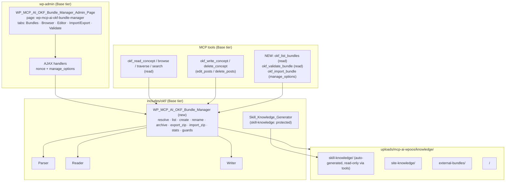

# OKF Bundle Management & Enhancement — Implementation Plan

**Status:** All six phases implemented (2026-08-21) — A: `okf_write_concept` creates missing bundles on first write. B: `WP_MCP_AI_OKF_Bundle_Manager` engine service (lifecycle, ZipSlip-safe ZIP import/export, stats, log maintenance) with all 7 tools refactored onto it, `skill-knowledge` write protection, knowledge-root guards, `okf_version` stamping. C: three new tools (`okf_list_bundles`, `okf_validate_bundle`, `okf_import_bundle`) + extended write schema (resource/sources/usage_window/verified). D: Base-tier Bundle Manager admin UI under the assistant CPT (Bundles/Browser/Editor/Import-Export/Validate tabs, 7 AJAX handlers + streamed export). E: broken-link reporting (advisory), import `okf_version` stamping, trust-tier histograms in validate output, and reader `realpath` path hardening. F: OKF → Skill Bridge (Pro) — `load_skill` resolves `bundle:concept_id` via the Pro bridge with per-assistant grants, draft rejection, and optional trust-tier gating, plus the assistant grant metabox. **Roadmap Phases 7-8 also shipped (2026-08-21):** G: Auto-Enrichment Agent (Pro) — deterministic site-content → OKF concept generation with cross-links, provenance, protected-bundle refusal, admin form + `okf_enrich_site_content` tool. H: Hybrid Knowledge Router (Pro) — deterministic query classification across OKF/Vector/Paper with filter seams + `route_knowledge_query` tool. All eight roadmap phases complete.
**Scope:** Make OKF bundles first-class manageable objects: a central bundle-manager service, bundle-level MCP tools, a Skill-Manager-style admin UI, spec-compliance upgrades (OKF v0.2), and the groundwork for the Phase 6 OKF → Skill Bridge.
**Confirmed decisions:** Bundle manager + admin UI ship in **Base tier** (OKF engine and tools are Base; no Pro-only dependencies). The OKF → Skill Bridge (roadmap Phase 6) remains **Pro tier** and is planned as Phase F. `skill-knowledge` becomes a **protected, auto-generated bundle** (read-only via tools) once the manager ships.
**Author:** Zed coding agent
**Date:** 2026-08-21

---

## 1. Goals

1. Give site owners and assistants a **complete bundle lifecycle**: create, list, browse,
   rename, archive, export, import, and validate OKF bundles without touching the filesystem
   by hand.
2. Eliminate the copy-pasted `resolve_bundle_root()` logic in all 7 OKF tools and replace it
   with one audited, path-traversal-safe **bundle manager** — a single source of truth for
   where bundles live.
3. Close the gap between the plugin and **OKF v0.2** (the current spec): `okf_version`
   stamping, `sources`/`verified` support in the write tool, `log.md` maintenance, and
   conformance validation surfaced to humans.
4. Mirror the proven **Skill Manager** UX (`edit.php?post_type=mcp_ai_assistant&page=wp-mcp-ai-skill-manager`)
   so admins who already manage skills get a familiar interface for knowledge bundles.
5. Lay the foundation for **roadmap Phase 6 (OKF → Skill Bridge)** by giving concepts a
   stable, addressable identity (`bundle` + `concept_id`) that the skill loader can consume.

---

## 2. Research Summary — OKF v0.2 & Industry Standards

### 2.1 Spec essentials (OKF v0.2, Google, Apache 2.0)

Source: [GoogleCloudPlatform/knowledge-catalog `okf/SPEC.md`](https://github.com/GoogleCloudPlatform/knowledge-catalog/blob/main/okf/SPEC.md)
and the [Google Cloud blog on v0.2 trust signals](https://cloud.google.com/blog/products/data-analytics/okf-v0-2-adds-trust-signals).

| Spec area | Requirement that shapes this plan |
|---|---|
| **Bundle** (§2, §3) | A self-contained, hierarchical directory of markdown; the *unit of distribution*. May be distributed as a git repo, tarball, **or zip archive** → motivates the Import/Export tab. |
| **Reserved filenames** (§3.1) | `index.md` (directory listing / progressive disclosure) and `log.md` (update history) MUST NOT be used for concepts. The writer already generates `index.md`; `log.md` support exists (`append_log()`) but is **never called by the tools** → wire it up. |
| **Concept** (§4) | One markdown file = one concept; `type` is the only required frontmatter field. |
| **Provenance & trust** (§5) | `sources[]` (+ `author`, `usage_count`, `last_modified`, `usage_window`), `generated {by, at}`, `verified[] {by, at}`, trust tiers: **unverified → machine-confirmed → human-reviewed**. The write tool currently supports `generated` only → extend its schema with `sources`, `verified`, `resource`, `usage_window`. |
| **Lifecycle** (§5.4–5.5) | `status: draft|stable|deprecated`, `stale_after` (absolute instant). Already supported in the write tool and validator. |
| **Actor convention** (§7) | `human:<id>` vs `<producer>/<version>` vs `process:<id>` — the write tool hardcodes `generated.by: "okf_write_concept tool"`; keep, but let the schema accept an optional `verified` entry (typically `human:*`). |
| **Versioning** (§12) | Bundle-root `index.md` MAY declare `okf_version: "0.2"` in frontmatter (the only index frontmatter allowed). The plugin never stamps this → stamp on bundle creation and import. |
| **Attested Computation** (§10) | `runtime`, `parameters`, `computation`, `executor`, `attester`. The `okf_validate_attestation` tool already exists; the bundle manager's validator should simply preserve these concepts. |
| **Conformance** (§11) | Consumers MUST NOT reject bundles for missing optional fields, unknown types, broken links, or missing `index.md`. Validators SHOULD surface — not silently drop — problems. → The Validate tab reports issues *without blocking* reads. |
| **`references/` convention** (§6.3) | Subdirectory mirroring external material/run instructions — nothing to implement; document it in the UI help text. |

### 2.2 Industry practice

- **WitsCode** maintains a free, open-source [OKF conformance suite](https://witscode.com/open-knowledge-format)
  — precedent that *validation as a first-class feature* is the ecosystem norm. The plugin's
  `validate_bundle()` already implements most of §11; expose it.
- **Knowledge Catalog** round-trips bundles preserving trust/provenance signals — reinforces
  that import/export must preserve frontmatter verbatim (round-trip fidelity, §4.1: "Consumers
  SHOULD preserve unknown keys when round-tripping").
- **Skills ecosystem** (agentskills.io, Anthropic skills): the plugin's own Skill Manager
  (`addons/pro/includes/admin/class-wp-mcp-ai-skill-manager-admin-page.php`) is the in-repo UX
  benchmark — tabs, CodeMirror editor, AJAX with nonce + `manage_options`, ZIP upload.

---

## 3. Current State Assessment

| # | Gap | Evidence |
|---|---|---|
| 1 | **Bundle creation was manual-only.** `okf_write_concept` failed with `okf_bundle_not_found` for new bundles because `resolve_bundle_root()` required `is_dir()` before the Writer's `ensure_bundle_root()` could run (dead code). | `includes/tools/okf/class-wp-mcp-ai-tool-okf-write-concept.php` (pre-1.1.62) |
| 2 | **Seven copies** of `resolve_bundle_root()` across tools — copy-paste drift and 7 places to audit for traversal bugs. | `includes/tools/okf/class-wp-mcp-ai-tool-okf-*.php` |
| 3 | **No bundle listing/CRUD.** No tool or API lists bundles, renames, archives, exports, or imports them. | grep `okf_list_bundles|rename_bundle|export_bundle` → nothing |
| 4 | **No admin UI.** Skill Manager (Pro) and Paper Store (Pro admin UI) exist; OKF has none. | `includes/admin/` has no OKF page |
| 5 | **Write-tool frontmatter subset.** Only `type/title/description/tags/status/stale_after/generated` are writable; `sources`, `verified`, `resource`, `usage_window` are not exposed. | `class-wp-mcp-ai-tool-okf-write-concept.php` schema |
| 6 | **`skill-knowledge` is silently overwriteable.** The generator wipes and rebuilds it on every version change, so any concept an assistant writes there is lost on upgrade. | `class-wp-mcp-ai-okf-skill-knowledge-generator.php::generate()` |
| 7 | **`log.md` never maintained.** `WP_MCP_AI_OKF_Writer::append_log()` exists but no tool calls it. | grep `append_log` → writer definition only |
| 8 | **Deletion convention drift.** Docs say concepts move to `.archive/`; the writer renames to `<file>.deleted.<timestamp>`. | `docs/features/okf-integration.md` vs `class-wp-mcp-ai-okf-writer.php::delete_concept()` |
| 9 | **No `okf_version` stamping**, no zip import/export (spec §3 distribution formats), no bundle-health surface (stale/deprecated/broken-link counts are computed by `validate_bundle()` but never shown anywhere). | `validate_bundle()` result consumed by nothing |
| 10 | **No `.htaccess`/`index.php` guard** in the knowledge root (Paper Store does this; OKF does not). Traversal guards use string prefix checks, not `realpath`. | `class-wp-mcp-ai-paper-store-manager.php::init()` vs OKF tools |

---

## 4. Target Architecture

Key principle: **tools and admin UI go through the manager, never to the filesystem directly.**
The manager is the only component that knows the knowledge root and the only one that
validates paths.

---

## 5. Implementation Phases

### Phase A — First-write bundle creation (DONE, 2026-08-21)

Shipped in this pass:

- `WP_MCP_AI_OKF_Writer::ensure_bundle_root()` now fires `wp_mcp_ai_okf_bundle_initialized`
  (with concept count 0) when it actually creates the bundle directory.
- `WP_MCP_AI_Tool_OKF_Write_Concept` now:
  - validates bundle names against `/^[a-z0-9][a-z0-9_-]{0,99}$/` (they become directory names),
  - treats a missing bundle directory as "create on first write" instead of
    `okf_bundle_not_found`,
  - regenerates the root `index.md` for brand-new bundles (best-effort; never fails the write),
  - reports `bundle_created` and `index_regenerated` in the canonical response envelope.
- Tests: `tests/test-okf-write-concept-create-bundle.php` — 10 tests / 44 assertions
  (creation, second-write idempotency, 7 invalid-name cases, capability gate, reader
  round-trip). All green; WPCS clean on production files.

**Deliberately deferred to Phase B:** protecting `skill-knowledge` from tool writes (needs a
decision + migration note), and centralizing resolution (needs the manager to exist first).

### Phase B — `WP_MCP_AI_OKF_Bundle_Manager` (engine service, Base) — DONE (2026-08-21)

Shipped in this pass, matching the table below with two notes:

- **Protection rule:** `skill-knowledge` is flagged `protected`; `okf_write_concept` and
  `okf_delete_concept` return `okf_protected_bundle` for it (behavior change — see §10).
- **Log maintenance** was also wired into the write/delete tools in this pass (originally
  listed under Phase C), since the manager ships the delegate anyway.

Implemented surface: `get_knowledge_root()` (filterable, `.htaccess` + `index.php` guards),
`resolve_bundle_root( $bundle, $create )` (slug validation for new names, `realpath`
containment, legacy-name back-compat), `list_bundles()` / `bundle_stats()` (concept/stale/
deprecated counts, trust-tier histogram, types), `create_bundle()` (`okf_version` stamp +
`log.md` init), `rename_bundle()`, `archive_bundle()` (→ `knowledge/.trash/`), `delete_bundle()`,
`export_bundle_zip()` / `import_bundle_zip()` (ZipSlip + symlink rejection, entry/size caps,
minimum-concept check), `append_log()`. All 7 tools refactored onto the manager; the
skill-knowledge generator routes through it so the knowledge-root filter applies everywhere.
Tests: `tests/test-okf-bundle-manager.php` (25 tests; ZIP tests skip without ext-zip).

| Method | Behavior |
|---|---|
| `get_knowledge_root()` | `wp_upload_dir()['basedir'] . '/mcp-ai-wpoos/knowledge'`, filterable via `wp_mcp_ai_okf_knowledge_root` (mirrors `wp_mcp_ai_paper_store_root`). Creates root + `.htaccess` (`Deny from all`) + `index.php` (silence) on first use — Paper Store pattern. |
| `resolve_bundle_root( $bundle, $create = false )` | Single audited resolver: reject `..`, strict slug regex, `wp_normalize_path`, then `realpath` containment check against the knowledge root (stronger than the current string-prefix checks — catches symlink escapes). Replaces the 7 tool copies. |
| `list_bundles()` | Scan root; return per-bundle metadata: name, path, concept count, type list, stale/deprecated counts, trust-tier histogram, `is_protected` (skill-knowledge), last-modified. |
| `create_bundle( $name )` | `ensure_bundle_root()` + stamp bundle-root `index.md` with `okf_version: "0.2"` frontmatter + `log.md` initialization entry. |
| `rename_bundle( $from, $to )` | Guard: refuse to rename protected/standard bundles; validate destination slug; atomic `rename` via `WP_MCP_AI_Filesystem_Service` (with `@rename` fallback). |
| `archive_bundle( $name )` / `delete_bundle( $name )` | Archive = move to `knowledge/.trash/<name>-<ts>/` (recoverable, mirrors Paper Store thinking); delete = hard remove with `manage_options` + nonce + confirmation. Never allow either on `skill-knowledge`. |
| `export_bundle_zip( $name )` | Recursively zip the bundle (preserving `index.md`, `log.md`, `references/`), stream or return path. Round-trip fidelity requirement (§4.1). |
| `import_bundle_zip( $zip_path, $name )` | ZipSlip-safe extraction (reject `..` and absolute entries, per the repo's `wp-security-deep` skill), reject symlink entries, size cap, require at least one conformant concept or a valid bundle-root index, refuse to overwrite protected bundles, then validate. |
| `bundle_stats( $name )` | Thin wrapper over `validate_bundle()` + reader `get_types()`, normalized for the admin UI. |
| `append_log( $bundle, $path, $entry, $action )` | Delegate to the writer; called by the write/delete tools from now on (closes gap #7). |

### Phase C — MCP tool surface (Base) — DONE (2026-08-21)

Shipped in this pass:

- `okf_list_bundles` (`read`) — bundle health stats; filesystem paths deliberately not exposed.
- `okf_validate_bundle` (`read`) — advisory conformance report via `validate_bundle()`.
- `okf_import_bundle` (`manage_options`) — wraps `import_bundle_zip()` for server-side ZIPs.
- `okf_write_concept` schema extended with the v0.2 provenance/trust families: `resource`,
  `sources` (credibility signals incl. `usage_count`), `usage_window`, `verified` — with
  per-field sanitizers (`sanitize_sources` / `sanitize_usage_window` / `sanitize_verified`).
- `log.md` maintenance and the `.deleted.<timestamp>` standardization were already shipped in
  Phase B (the writer's behavior was kept; the docs were corrected).
- Presets: `essentials_internal` gains `okf_list_bundles` + `okf_validate_bundle`;
  `files_documents` gains all three new tools. OKF tool surface is now 10 tools.
- Tests: `tests/test-okf-phase-c-tools.php` (8 tests; ZIP tests skip without ext-zip).

Original scope table (now implemented):

| Tool | Capability | Notes |
|---|---|---|
| `okf_list_bundles` (NEW) | `read` | Lists bundles + stats from `list_bundles()`. Enables assistants to discover knowledge before choosing a bundle — closes the "you must know the bundle name" discovery gap. |
| `okf_validate_bundle` (NEW) | `read` | Exposes `validate_bundle()`: conformant flag, issues, stale/deprecated counts. Complements the existing `okf_validate_attestation` (which validates one concept's attestation contract). |
| `okf_import_bundle` (NEW) | `manage_options` | Wraps `import_bundle_zip()`; takes a path to an uploaded/admin-placed zip. High-capability because it writes arbitrary files to disk. |
| `okf_write_concept` (EXTEND) | `edit_posts` | Add optional `sources` (list of `{id, resource, title, author, usage_count, last_modified}`), `usage_window`, `verified` (`{by, at}` list), `resource` to the schema — the v0.2 provenance/trust family. Also append a `log.md` entry on create/update. |
| `okf_delete_concept` (EXTEND) | `delete_posts` | Standardize on the writer's `.deleted.<timestamp>` rename (gap #8: update the doc, not the code), append a `log.md` entry, and **never** auto-delete when `status: deprecated` would suffice (already in the description). |

Preset updates: add the three new tools to the existing OKF presets
(`essentials_internal`, `files_documents`) per the tool-preset helper conventions.

### Phase D — Bundle Manager admin UI (Base) — DONE (2026-08-21)

Shipped in this pass:

- `includes/admin/class-wp-mcp-ai-okf-bundle-manager-admin-page.php` registered under the
  assistant CPT (`edit.php?post_type=mcp_ai_assistant&page=wp-mcp-ai-okf-bundle-manager`,
  `manage_options`), tab pattern + CodeMirror mirroring the Skill Manager.
- Tabs: **Bundles** (create form + stats table + rename/archive/delete/export actions),
  **Browser** (concept tree, trust badges, new-concept form), **Editor** (raw concept
  editing with reserved/protected guards; `index.md`/`log.md` read-only), **Import/Export**
  (ZIP upload + authenticated streamed ZIP download), **Validate** (advisory report).
- AJAX: `wp_mcp_ai_okf_bundle_create|rename|archive|delete|import|save_concept|delete_concept`
  (nonce + `manage_options` via `verify_request()`); export streams via `admin_post`.
- Manager gained `save_concept_raw()` (editor writes: traversal + reserved-filename +
  frontmatter validation, atomic write, log + `wp_mcp_ai_okf_concept_saved` event) and
  `create_bundle()` now refuses protected names. Inline CSS/JS follow the
  conversation-import admin pattern (no new asset files).
- Tests: `tests/test-okf-bundle-manager-admin.php` (registration/hooks/rendering) +
  `tests/test-okf-bundle-manager-admin-ajax.php` (handler matrix; uses the repo's AJAX
  harness, which is CI-validated — the local Windows harness is slow/flaky, so handler
  logic is additionally covered via the manager suites).

Original scope table (now implemented):

| Tab | Contents |
|---|---|
| **Bundles** | Table of bundles with stats columns (concepts, types, stale, deprecated, trust-tier histogram, protected badge). Row actions: Browse, Export ZIP, Rename, Archive, Validate. "Create bundle" form (name field with the slug regex enforced client- and server-side). |
| **Browser** | Per-bundle concept tree via `okf_browse`/`browse()`, with trust-tier and staleness badges; click-through to the editor. |
| **Editor** | CodeMirror editor for a concept file (frontmatter + body), Save via AJAX (nonce + `manage_options`), delete (soft) action. Root `index.md`/`log.md` viewable read-only. |
| **Import / Export** | Upload ZIP (validated via `import_bundle_zip()`), download ZIP per bundle. |
| **Validate** | Runs `validate_bundle()` on demand; renders issues list with per-concept links; shows conformant/not without blocking reads (§11 semantics). |

AJAX handlers: `wp_mcp_ai_okf_bundle_create`, `_rename`, `_archive`, `_export`, `_import`,
`_save_concept`, `_delete_concept`, `_validate`. All check `check_ajax_referer` +
`current_user_can( 'manage_options' )`. Asset enqueueing scoped to the page hook (Skill
Manager pattern). Folder README updates for `includes/admin/` and `includes/okf/` per the
folder-readme convention (`composer run docs:check-folder-readmes`).

### Phase E — Spec-compliance & trust UX polish (Base) — DONE (2026-08-21)

Shipped in this pass:

- **Broken-link reporting:** `WP_MCP_AI_OKF_Reader::find_broken_links()` (absolute,
  relative, external-scheme aware) feeds a new advisory `broken_links` list in
  `validate_bundle()` — reported, never affecting conformance (§6.1). Surfaced in
  `okf_validate_bundle`, the admin Validate tab, and bundle stats
  (`broken_link_count` + trust-tier histogram).
- **Import stamping (§12):** `import_bundle_zip()` stamps `okf_version` onto an
  imported root index.md lacking frontmatter (entries preserved) and generates a
  stamped index when the archive has none.
- **Reader hardening:** `resolve_file_path()` gains a `/`-boundary lexical check +
  symlink-aware `realpath` containment (closes a pre-existing `..`-segment gap);
  fixed a Windows separator bug (`DIRECTORY_SEPARATOR` vs normalized `/`) that
  broke the new link checks.
- Tests: manager suite (+4 cases), validate-tool suite (+3 assertions).

### Phase F — OKF → Skill Bridge (Pro, roadmap Phase 6) — DONE (2026-08-21)

Shipped in this pass:

- **Base seam:** `WP_MCP_AI_Tool_Load_Skill` consults `wp_mcp_ai_load_skill_external`
  before the installed-skill registry; unchanged behavior for registry skills.
- **Pro bridge:** `WP_MCP_AI_OKF_Skill_Bridge` (`addons/pro/includes/okf/`) resolves
  `bundle:concept_id` names into skill-shaped instructions with a provenance/trust
  banner; fail-closed per-assistant grants (`_wp_mcp_ai_okf_concepts`), draft
  rejection, and an optional `wp_mcp_ai_okf_skill_bridge_min_trust` tier gate.
- **Pro grant UI:** `WP_MCP_AI_OKF_Concepts_Metabox` on the assistant editor
  (checkboxes per bundle concept; grants sanitized against the live layout).
- Module `pro_okf_skill_bridge` registered in the Pro module registry.
- Progressive-disclosure index integration deferred (concepts load explicitly
  by name; noted in the roadmap).
- Tests: `tests/test-okf-skill-bridge.php` (9 tests).

Original scope table (now implemented):

- `load_skill` gains an `okf` source: `load_skill( { name: "bundle:concept_id" } )` (or a
  `source: okf` parameter) that resolves through the manager + reader and returns the concept
  as skill-shaped instructions.
- Assistant allow-listing: extend the skills metabox or add an "OKF concepts" multi-select so
  admins grant specific concepts per assistant (mirrors the existing `_wp_mcp_ai_skills`
  allow-list in `class-wp-mcp-ai-tool-load-skill.php`).
- Trust gating: only concepts with `status != draft` (and optionally trust tier ≥
  machine-confirmed) are loadable as skills; draft concepts are excluded from the
  progressive-disclosure index.
- Tests: loader resolution, allow-list enforcement, trust gating, traversal rejection.
- Tests: `tests/test-okf-skill-bridge.php` (9 tests).

### Phase G — Auto-Enrichment Agent (Pro, roadmap Phase 7) — DONE (2026-08-21)

Shipped in this pass:

- **Pro agent:** `WP_MCP_AI_OKF_Enrichment_Agent` (`addons/pro/includes/okf/`) crawls
  published posts/pages (any public post type) and optionally public taxonomy terms,
  writing concepts into a bundle (default `site-content`, created on first run).
  Concept IDs are post-type-namespaced (`post/<slug>`, `terms/<taxonomy>/<slug>`);
  concepts carry the Phase C provenance schema (`resource`, `sources`,
  `generated: { by: process:okf-enrichment }`) and cross-links extracted from
  internal `<a>` links; bundle + per-directory indexes regenerate after each run.
- **Deterministic + idempotent:** re-runs overwrite the same concept files — no
  bundled LLM. `wp_mcp_ai_okf_enrichment_description` upgrades the excerpt to an
  AI summary; protected bundles (`skill-knowledge`) are always refused.
- **Surfaces:** Pro MCP tool `okf_enrich_site_content` (`manage_options`) and a
  Pro-gated enrichment form on the Base Bundle Manager admin page (Import/Export
  tab; AJAX `wp_mcp_ai_okf_bundle_enrich`, rendered only when Pro is active).
- Tests: `tests/test-okf-enrichment.php` (10 tests).

### Phase H — Hybrid Knowledge Router (Pro, roadmap Phase 8) — DONE (2026-08-21)

Shipped in this pass:

- **Pro router:** `WP_MCP_AI_Hybrid_Knowledge_Router` (`addons/pro/includes/okf/`)
  classifies a knowledge query into an ordered routing plan across OKF / vector /
  Paper via keyword signals (policies → OKF; incidents/logs → Paper; similarity →
  Vector; unmatched queries fall back to OKF → Vector → Paper).
  `wp_mcp_ai_hybrid_router_signals` extends the pattern table;
  `wp_mcp_ai_hybrid_router_decision` replaces the whole plan (LLM-backed or custom
  classifiers). `search_okf()` ranks OKF concepts by deterministic token overlap
  with trust/stale metadata.
- **Surfaces:** Pro MCP tool `route_knowledge_query` (`read`) — performs the OKF
  lookup only when OKF is the primary route.
- Tests: `tests/test-hybrid-knowledge-router.php` (12 tests),
  `tests/test-okf-phase-7-8-tools.php` (9 tests, incl. registry smoke).

---

## 6. Security Requirements (checklist)

1. Every state-changing path: `check_ajax_referer` + capability check (admin:
   `manage_options`; tools: `edit_posts`/`delete_posts`/`manage_options` as above).
2. One resolver, `realpath`-based containment, no string-prefix shortcuts (Phase B).
3. Zip import: ZipSlip guard, symlink rejection, size caps, no PHP/executable files written
   into a web-servable position — combined with `.htaccess` deny + `index.php` silence on the
   knowledge root (files are never served over HTTP; they're read via PHP filesystem APIs).
4. Bundle names: strict slug regex everywhere (manager is the single enforcement point).
5. No new autoloaded options; bundle state lives on disk only. Export paths under
   `wp_upload_dir()` and never predictable from user input.
6. Multisite: knowledge root is under per-blog `uploads/`, so per-site isolation is automatic;
   no network-wide changes needed (note in docs).
7. Log security-relevant events (bundle create/archive/import) via `WP_MCP_AI_Logger`/
   audit conventions per `.context/security-checklist.md`.

## 7. Testing Strategy

| Layer | Coverage |
|---|---|
| Unit (PHPUnit, Base) | Manager: list/create/rename/archive/export/import round-trip; ZipSlip + symlink rejection; protected-bundle refusal; resolver traversal matrix (incl. symlink escape); `okf_version` stamping; log append. |
| Tool tests | `okf_list_bundles`, `okf_validate_bundle`, `okf_import_bundle` capability + envelope; `okf_write_concept` new frontmatter fields round-trip through the reader; `skill-knowledge` write refusal. |
| AJAX tests | Mirror `tests/test-skill-manager-ajax.php`: nonce + capability matrix for every handler. |
| Manual | `tests/manual/` scripts for zip round-trip on real bundles (existing OKF manual-test pattern). |
| Regression | Existing `tests/test-okf-skill-knowledge-generator.php`, `tests/test-okf-write-concept-create-bundle.php`, manual OKF suite. |

## 8. Documentation & Release Tasks

- Update `docs/features/okf-integration.md`: bundle lifecycle, new tools, protected
  `skill-knowledge`, `.deleted.<timestamp>` convention correction, roadmap table (Phases 6–8
  status).
- Update `includes/okf/README.md` + `includes/tools/okf/README.md` (new class + tools).
- `CHANGELOG.md` entries per phase; `readme.txt`/`README.md` what's-new bullets.
- Tool reference (`docs/tool-reference.md`) entries for the 3 new tools.
- Version stamps: `@since 1.1.62` (Base) per phase as shipped.

## 9. Rollout / Risks & Mitigations

| Risk | Mitigation |
|---|---|
| Writing into `skill-knowledge` stops working (behavior change) | Clear error code `okf_protected_bundle`, changelog + migration note pointing assistants at `site-knowledge`; ship with Phase B, not Phase A. |
| Imported zip writes executables | `.htaccess` deny + `index.php` silence + reject executable extensions on import; files never web-served. |
| Copy-paste drift returns if tools bypass the manager | Manager is the only resolver; code review rule + tests assert tools delegate. |
| Conformance validation scaring users | UI frames issues as advisory (§11 semantics: never block reads). |
| Scope creep into Phase 6 | Phase 6 kept as a separate Pro sub-plan (Phase F) with its own tests. |

## 10. Open Questions (decision points)

1. **Archive location for bundles:** `knowledge/.trash/` (hidden, same root) vs
   `wp-content/uploads/mcp-ai-wpoos/knowledge-trash/` (sibling root)? Leaning: hidden
   subdirectory, consistent with skill soft-delete.
2. **Bundle name separators:** allow dots (`v1.2`) or stick to `[a-z0-9_-]`? Leaning: keep the
   conservative regex; dots add ambiguity with file extensions.
3. **`okf_import_bundle` capability:** `manage_options` (admin-only, this plan) vs `edit_posts`
   (assistant-driven import)? Leaning: `manage_options` for v1 — importing arbitrary files is
   high-risk; assistant import can be revisited with a dedicated upload surface.
4. **Phase D UI tier:** Base (this plan) vs Pro? Leaning: Base — OKF engine/tools are Base and
   the UI has no Pro-only dependencies.
