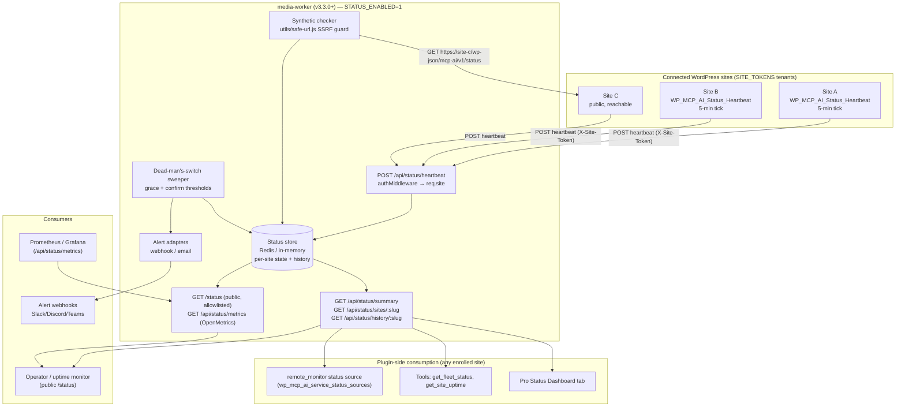
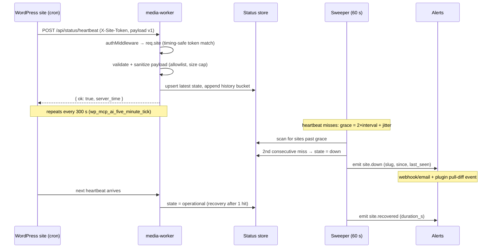
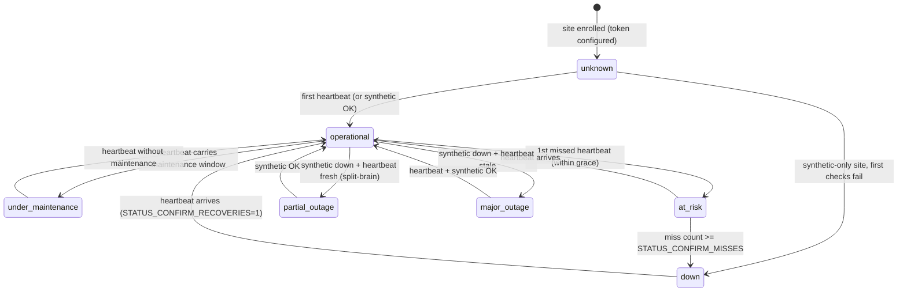

# Media Worker as Fleet Status & Monitoring Service — Comprehensive Implementation Plan

> **Status:** Implemented — Phases 1–5 landed on branch `add/media-worker-status-monitoring` (plugin v1.1.93 / worker v3.3.0). Deferred follow-ups: the rich JS Fleet tab in the Pro Status Dashboard (server-rendered section ships now), the k6 status load-test scenario (`bin/load-test/status-check.js`), and the standalone `status-worker` split (criteria-gated in §1).
> **Scope:** `addons/media-worker/` (worker-side status module) + `includes/` (plugin heartbeat + status-source integration) + `addons/pro/` (dashboard, alerts, incident automation)
> **Related:** [`multi-site-gateway-plan.md`](multi-site-gateway-plan.md) (tool federation — complementary, not overlapping), proposals `025–028` (worker hardening / multi-tenancy), ISO 27001 A.8.14 monitoring controls in `docs/operations/compliance/iso27001/`
> **Worker target version:** v3.3.0 (additive route group — no breaking changes)

---

## Table of Contents

1. [Executive Summary](#1-executive-summary)
2. [Research & Industry Standards](#2-research--industry-standards)
3. [Current State Audit](#3-current-state-audit)
4. [Target Architecture](#4-target-architecture)
5. [Key Architectural Decisions](#5-key-architectural-decisions)
6. [Gap Analysis](#6-gap-analysis)
7. [Implementation Phases](#7-implementation-phases)
8. [File Manifest](#8-file-manifest)
9. [Testing Strategy](#9-testing-strategy)
10. [Risk Register](#10-risk-register)
11. [Rollout & Backward Compatibility](#11-rollout--backward-compatibility)
12. [Alignment with Existing Roadmap](#12-alignment-with-existing-roadmap)
13. [Glossary](#13-glossary)
14. [References](#14-references)

---

## 1. Executive Summary

### Why This Matters

The media worker sidecar is already the **connectivity hub** for every site in the
Design Stack: in multi-tenant mode (`SITE_TOKENS` + `AUTH_MODE=strict`) every
connected WordPress site authenticates to it with its own token on every request,
and the worker already namespaces files, queues, rate limits, and usage counters
per site. But that connection is **one-way and workload-scoped** — the worker
knows which sites are *using* it, not whether those sites (or the fleets they
represent) are *healthy*.

Today, site health is site-local only:

- Each site runs its own `WP_MCP_AI_Service_Status_Registry` health checks
  (AI providers, tool registry, job queue) and exposes them at
  `GET /wp-json/mcp-ai/v1/status`.
- There is **no fleet-level view**: no operator can answer "are all 12
  connected sites up?" from one place.
- There is **no external monitoring**: a site whose PHP, cron, or database is
  down cannot report its own death, and nothing else notices.
- The existing `multi-site-gateway-plan.md` explicitly lists **"Health
  Dashboard" (gap #8)** as missing.

### The Solution

Extend the media worker — rather than ship a separate status-worker — with a
**status-monitoring module** (`/api/status/*` route group + `src/status/`
module). The worker becomes the fleet's monitoring/status service:

1. **Push (heartbeat) monitoring** — each connected site's plugin pushes a
   signed heartbeat every 5 minutes (dead man's switch). A missed heartbeat is
   a down site, even when the worker cannot reach the site from the outside.
2. **Pull (synthetic) monitoring** — for publicly reachable sites, the worker
   also performs external HTTP(S) checks (reachability, latency, TLS
   certificate expiry) against the site's public status endpoint, using the
   existing SSRF guard in reverse (public-target validation).
3. **Aggregation & API** — per-site state machine, 90-day uptime history,
   fleet summary API, Statuspage-style public page, and OpenMetrics
   exposition for Prometheus/Grafana.
4. **Alerting** — missed-heartbeat and synthetic failures fire alerts
   (webhooks, email, plugin-side events) after confirmation thresholds, with
   maintenance-window suppression.
5. **Plugin integration** — a base heartbeat emitter, a new
   `remote_monitor` service-status source, REST extensions, new tools
   (`get_fleet_status`, `get_site_uptime`), and Pro dashboard/incident
   automation — all **additive and opt-in**, so sites without a worker keep
   today's behavior unchanged.

### Why the Media Worker and Not a New status-worker

| Criteria | Extend media-worker | New standalone status-worker |
|---|---|---|
| Multi-tenant auth (per-site tokens, fail-closed) | ✅ Already shipped (v2.4.0) | Would need rebuilding |
| External to all sites (monitoring must be out-of-band) | ✅ Sidecar / Velocity host | ✅ (but a second deployment) |
| Redis queue + rate limiting + structured logs | ✅ Already shipped | Rebuild |
| Plugin→worker transport (`X-Site-Token`, URL/token option chain) | ✅ Already shipped | Rebuild + duplicate config |
| Ops surface (one container, one deploy pipeline, one sync workflow) | ✅ | ❌ Two containers |
| Blast-radius isolation (status load vs. media jobs) | ⚠️ Same process — mitigated by separate route group, rate limits, and optional Redis | ✅ |

**Decision (D0):** extend the media worker. The status module is designed as a
**self-contained, portable module** (`src/status/`) so it can be extracted into
a separate `status-worker` image later **without code changes** if any of these
triggers occur: (a) status traffic needs an independent scaling profile,
(b) operators want a stricter network security boundary for the public status
page, (c) the public `/status` surface is offered as a standalone SaaS.

### Key Numbers

| Parameter | Value | Rationale |
|---|---|---|
| Heartbeat interval | 300 s (min 60 s) | Reuses the existing `wp_mcp_ai_five_minute_tick` cron — zero new cron overhead |
| Miss grace period | 2× interval + 60 s jitter | Covers WP-Cron drift and transient worker restarts (Healthchecks-style grace) |
| Confirm-down threshold | 2 consecutive misses | Flap suppression; matches circuit-breaker conventions (3 strikes for the gateway plan) |
| Confirm-recovery threshold | 1 heartbeat | Fast recovery signal |
| Synthetic check interval | 60 s (default, per-site overridable) | ~4 min detection for public sites at 99.9 %-class SLAs (see §2.2) |
| History retention | 90 days raw + 30-min rollups | Matches the plugin's 90-day `cleanup_history()` window |
| Uptime buckets | Daily % = (total min − outage min) ÷ total min | Statuspage uptime rule; maintenance windows excluded |

---

## 2. Research & Industry Standards

### 2.1 Monitoring Modes: Push vs Pull (Heartbeat vs Synthetic)

Industry practice converges on a **hybrid** of two complementary modes:

| Mode | How it works | Detects | Limitation |
|---|---|---|---|
| **Synthetic (pull)** | External monitor polls the site over HTTP(S) at fixed intervals (UptimeRobot, Pingdom, Better Uptime, Statuspage) | Reachability, latency, TLS expiry — the customer's actual experience | Cannot see private/unreachable targets; checks add traffic; a single checker is a single point of view |
| **Heartbeat (push, dead man's switch)** | The monitored system checks in on schedule (Healthchecks.io, Cronitor, Uptime Kuma *push monitors*) | Cron/system death, host death, network partitions — even for private sites | Does not measure external reachability; the site's own judgment of "fine" can be wrong |

**Adopted:** heartbeat push as the **primary** signal (works for localhost,
staging, and firewalled sites that the worker can never reach), synthetic pull
as an **opt-in enhancement** for publicly reachable production sites. This is
exactly the split the sources recommend — *"A combined approach offers the most
comprehensive view, using synthetic monitoring for consistent checks and [the
site's own telemetry] for real-world validation"* — and it is the only model
that works given the worker's deployment topologies (Docker sidecar on the same
host, or a public Velocity host).

### 2.2 Check Frequency & SLA Error-Budget Math

The synthetic-monitoring frequency guidance is quantitative:

- A 99.9 % monthly SLA allows ~43.8 minutes of downtime. With 15-minute check
  intervals, **detection lag alone consumes a third of that budget** before
  anyone is paged (dotcom-monitor).
- Recommended practice: monitor at 1–5 minute intervals for production,
  alert only on **confirmed failures** (N consecutive checks), and compute
  SLO burn rates from the same time series rather than raw counts.
- Alerts should fire at **~50 % of the error budget**, not at 100 %
  (Postman SLA-monitoring guidance) — i.e., alerting thresholds are tied to
  the monitored interval, not to "somebody noticed".

**Adopted:** 60 s synthetic interval (default) for public sites; 300 s
heartbeat for everything; confirmation thresholds instead of instant alerts;
uptime history computed from bucketed state transitions so SLO math can be
derived later without a schema change.

### 2.3 Status Taxonomy & Uptime Calculation

Atlassian Statuspage defines the de-facto component-status taxonomy:

`operational` → `under_maintenance` → `degraded_performance` →
`partial_outage` → `major_outage`

with the rules:

- Top-level status = **worst** component status (impact aggregation).
- Uptime % = (total minutes − minutes in major/partial outage) ÷ total
  minutes × 100; degraded performance does **not** count as downtime.
- Historical bars are colored from outage minutes, and maintenance windows
  are excluded from uptime.

**Adopted:** the plugin's `Interface_WP_MCP_AI_Service_Status_Source`
(§3.2) already uses this exact five-value taxonomy and
`compute_overall_status()` already implements the worst-status rollup. The
worker adopts the **same five values** so local and remote components merge
losslessly — this is a deliberate compatibility decision, not a coincidence.

### 2.4 WordPress Agency Multi-Site Monitoring (Hub + Child Model)

Every mature WordPress multi-site management product uses the same shape:

| Product | Architecture |
|---|---|
| **ManageWP Worker** | Thin worker plugin on each site → central dashboard; uptime checks run from ManageWP's external infrastructure, not from the site |
| **MainWP** | Self-hosted dashboard + child plugin; uptime monitoring via external checks with retry scheduling |
| **WP Umbrella** | Child plugin reports to cloud hub; uptime/performance monitoring runs continuously from the hub's external checkers |
| **WPMU DEV Hub** | Child plugin + Hub cloud; Uptime module tracks uptime, downtime, and response times externally |

Common traits: a **thin, cheap client** on each site (never the monitor
itself), a **central aggregator**, and **external checkers** for reachability.
The media worker already plays the "central aggregator + external checker"
role for media jobs; this plan extends that role to monitoring. The plugin's
heartbeat emitter is the "thin client" — piggybacking on the existing
five-minute cron tick means **zero additional scheduled traffic** compared to
what every site already runs.

### 2.5 Metrics Exposition Standards

OpenMetrics/Prometheus text exposition format is the de-facto standard for
cloud-native metrics (IETF-track):

- Expose at a documented URL (conventionally `/metrics`); `HELP`/`TYPE` lines
  precede each metric group; counters are monotonic, gauges are not.
- Split **liveness** (minimal, public — "is it up") from **readiness/detail**
  (authenticated, full — "is it healthy in every dimension"). The worker
  already implements this split (`/api/health` public vs `/api/health/full`
  authenticated) and the new status surface keeps it.

**Adopted:** `GET /api/status/metrics` (authenticated) emits OpenMetrics
gauges (`nvoos_site_up`, `nvoos_site_latency_ms`), counters
(`nvoos_heartbeats_total`, `nvoos_synthetic_checks_total`), and per-site
labels — scrapable by Prometheus/Grafana without any new dependency. The
public `GET /status` stays minimal JSON/HTML (allowlisted fields only).

### 2.6 MCP Gateway Health-Aware Routing (Complementary Context)

The MCP gateway pattern (Kong, Cloudflare, Microsoft `mcp-gateway`) maintains
**per-backend health with circuit breakers** (3 consecutive failures → stop
routing), tool-discovery caching, and centralized observability — already
catalogued in `multi-site-gateway-plan.md` §2.2 and implemented in parts by
the Graphify remote-source driver. This plan's per-site state machine (confirm
thresholds, half-open recovery) is the same primitive, exposed as data so the
gateway plan can later consume the worker's site-health API for **health-aware
tool routing** (`hub::search_content` should not route to a `down` spoke).
The two plans stay decoupled: this plan produces health state; the gateway
plan consumes it.

### 2.7 Compliance Hooks

In-repo ISO 27001 documentation already demands uptime monitoring:
`docs/operations/compliance/iso27001/controls/A.8-Technological-Controls.md`
(A.8.14 Redundancy — *"Application uptime monitoring … API endpoint health
checks"*) and `Security-Objectives.md` (Objective 2 — *"Uptime monitoring
reports"*). This plan produces those reports natively (history API + uptime
rollups) instead of relying on a third-party monitor.

---

## 3. Current State Audit

### 3.1 Media Worker Capabilities Already Suitable for Monitoring

| Capability | Where | Reuse |
|---|---|---|
| Per-site identity + fail-closed auth | `src/middleware/auth.js` — `SITE_TOKENS`, `resolveSite()`, `req.site`, timing-safe compare | Heartbeat auth is identical: `X-Site-Token` + derived `req.site` |
| `X-Site-Url` change auditing | `auth.js` `auditSiteUrl()` | Reused verbatim — a heartbeat from a changed domain is a stolen-token signal |
| Redis + in-memory storage duality | `src/queue.js`, `middleware/rate-limit.js` | Status store follows the same pattern (`REDIS_URL` optional, in-memory fallback) |
| Rate limiting per group | `middleware/rate-limit.js` (`crawlLimiter` etc.) | New `statusLimiter` group |
| Split health endpoints | `src/index.js` `/api/health` + `/api/health/full` | Public `/status` vs authenticated `/api/status/*` |
| SSRF guard (public-target validation) | `utils/safe-url.js` `validatePublicUrl()` | Synthetic checks validate targets through it |
| Structured request logs, no secrets | `middleware/log.js` | Reused |
| Env-driven per-site overrides | `SITE_PROVIDER_KEYS_<SLUG>` merge pattern (`utils/provider-keys.js`) | `STATUS_<SLUG>_*` overrides copy the pattern |
| Graceful degradation + `503` envelopes | route conventions (`service_not_configured`) | Status module answers `503 status_not_enabled` when `STATUS_ENABLED` unset |

### 3.2 Plugin Service Status Subsystem (site-local)

| Component | File | Role |
|---|---|---|
| `Interface_WP_MCP_AI_Service_Status_Source` | `includes/interfaces/interface-wp-mcp-ai-service-status-source.php` | Contract: `get_slug/get_name/get_group/check_health/is_public`; five-value status taxonomy; sources MUST NOT throw |
| `WP_MCP_AI_Service_Status_Registry` | `includes/services/class-wp-mcp-ai-service-status-registry.php` | Singleton; `wp_mcp_ai_service_status_sources` filter; `run_health_checks()` (try/catch per source); cached snapshot option (`wp_mcp_ai_service_status`); `get_public_status()` allowlists public sources and strips `latency_ms`; `compute_overall_status()` worst-wins; `rollup_uptime_history()` hourly; `cleanup_history()` 90 days |
| Default sources | `includes/services/class-wp-mcp-ai-service-status-default-sources.php` | `ai_providers`, `tool_registry`, `queue_health` (+ `wp_mcp_ai_health_check_completed` action) |
| REST | `includes/rest/class-wp-mcp-ai-status-rest-controller.php` | Public `GET /mcp-ai/v1/status`, `/status/components`, `/status/history`; `include_private` only with `manage_options`; HTTP cache headers; maintenance + incident data from Pro CPTs |
| Cron | `includes/bootstrap/cron.php` | Consolidated `wp_mcp_ai_five_minute_tick` → `wp_mcp_ai_five_minute_tick_handler()` (transient lock, try/catch) + `wp_mcp_ai_five_minute_tick_completed` action — **the heartbeat seam** |
| Shortcode / widget | `includes/class-wp-mcp-ai-status-shortcode.php` (`[nvoos_status]`), `includes/elementor/class-wp-mcp-ai-elementor-system-health-status-widget.php` | Public status rendering |
| Slash command | `includes/slash-commands/commands/class-wp-mcp-ai-slash-command-status.php` | `/status` in chat |
| Pro dashboard | `addons/pro/includes/admin/class-wp-mcp-ai-pro-status-dashboard-page.php` + `class-wp-mcp-ai-pro-status-ajax.php` | Admin polling UI (uses `get_cached_status()` — never triggers a check on the request thread) |
| Pro maintenance/incidents | `WP_MCP_AI_Maintenance_CPT`, `WP_MCP_AI_Incident_CPT` | Feed the status REST response; incident lifecycle phases |

### 3.3 Existing Push Pattern (the template for the heartbeat)

`WP_MCP_AI_Media_Worker_Usage_Reporter`
(`includes/class-wp-mcp-ai-media-worker-usage-reporter.php`) already:

- resolves worker URL (constant → option) and token (constant → per-blog
  option on multisite → site option),
- schedules an **opt-in** daily cron, fetches `/api/health/full` with
  `X-Site-Token`, stores a snapshot option, and fires
  `wp_mcp_ai_media_worker_usage_updated`.

The heartbeat emitter is this class's sibling: same URL/token chain, same
opt-in option, but on the existing five-minute tick and POSTing instead of
GETting. **Refactor note:** the URL/token chain is duplicated between the
reporter and `trait-wp-mcp-ai-media-worker-client.php`; Phase 2 extracts one
`WP_MCP_AI_Media_Worker_Config` helper (behavior-preserving).

### 3.4 Existing Connectivity Surfaces

- `WP_MCP_AI_Pro_Remote_Site_Manager` (`addons/pro/includes/`) — option-stored
  connections (`wordpress`, `mcp_server`, `gmail`, `google_calendar`,
  `flowhub`, …), AES-256-CBC encrypted credential fields, `test_connection()`,
  restricted-host validation. **Not** the source of truth for "connected to
  the worker" — worker connections are defined by `SITE_TOKENS` on the worker
  side + the plugin's worker URL/token settings. The plan treats *"connected"*
  as **worker-enrolled** (slug + token + heartbeat enabled), and optionally
  enriches synthetic checks from public `wordpress`-type Remote Sites
  connections later (Phase 3).
- `remote_wp_connection` tool — data-plane CRUD against remote sites; useful
  for cross-checking a site during an incident, not for monitoring itself.

### 3.5 What's Missing (Gap Table)

| # | Gap | Priority | Description |
|---|---|---|---|
| G1 | Heartbeat ingestion endpoint | P0 | No worker endpoint accepts site status pushes |
| G2 | Per-site state store + history | P0 | No place to persist per-site state/uptime |
| G3 | Dead-man's-switch sweeper | P0 | No process detects missed heartbeats |
| G4 | Fleet summary / history APIs | P0 | No API for "all sites' status" |
| G5 | Plugin heartbeat emitter | P0 | No site-side push of the local status snapshot |
| G6 | Enrollment + settings UX | P1 | No guided "connect this site to the monitor" flow |
| G7 | Synthetic external checks | P1 | No external reachability/latency/TLS checks |
| G8 | Alerting | P1 | No notifications on confirmed outages |
| G9 | Fleet status source (plugin) | P1 | Local status page cannot show remote sites |
| G10 | Public status page / metrics | P2 | No Statuspage-style page or Prometheus endpoint |
| G11 | Incident automation | P2 | Outages don't create incident records |
| G12 | Fleet dashboard (Pro) | P2 | No unified admin view across sites |
| G13 | Load/scale evidence | P3 | No k6 evidence for status traffic |

---

## 4. Target Architecture

### 4.1 Component Diagram



### 4.2 Heartbeat Flow



### 4.3 Synthetic Check Flow (public sites only, opt-in)

1. Worker reads per-site synthetic config (defaults from heartbeat payload's
   `site_url`; overrides via `STATUS_<SLUG>_SYNTHETIC_URL`).
2. Every `STATUS_SYNTHETIC_INTERVAL_MS` (60 s default): `validatePublicUrl()`
   (SSRF guard — private/loopback targets rejected), then `GET
   <site_url>/wp-json/mcp-ai/v1/status` with timeout, recording `status_code`,
   `latency_ms`, `tls_days_left` (via `tls.connect` probe).
3. Result merges into the site's state: heartbeat fresh + synthetic down →
   `partial_outage` (split-brain: site up, frontend unreachable — CDN/DNS
   breakage); heartbeat stale + synthetic down → `major_outage`.
4. Check results append to the same history buckets; latency feeds the
   OpenMetrics histogram.

### 4.4 Per-Site State Machine



Status transitions are persisted as history entries (`{status, ts}`), which
makes uptime computation and alert burn-rate math a pure function of history.

### 4.5 Status Computation Pipeline

1. **Ingest** (heartbeat / synthetic result) → sanitized record.
2. **Merge** per site: worst-of(heartbeat components, synthetic view),
   maintenance override, freshness flags.
3. **Bucket** into 30-min rollup windows; daily uptime % from buckets.
4. **Roll up** fleet overall = worst site status (Statuspage rule).
5. **Expose** via summary API, public page (allowlisted), metrics.

---

## 5. Key Architectural Decisions

### D0 — Extend the media worker (portable module)

As argued in §1: extend `addons/media-worker/` with a self-contained
`src/status/` module + `/api/status/*` routes. The module never imports
media-route internals; it only consumes `middleware/auth.js`, `utils/safe-url.js`,
and the shared queue/Redis utilities. **Split criteria** (any → extract as
`status-worker` image): independent scaling profile, separate public-security
boundary, or standalone productization. The module's files are already
grouped so the split is a copy + `package.json` trim, not a rewrite.

### D1 — Push-pull hybrid

Heartbeat is primary and mandatory for private/unreachable sites; synthetic is
opt-in per site (Phase 3). Rationale and sources in §2.1–2.2. The worker never
assumes it can reach a site; the site never assumes it can be reached — both
signals together produce the truth table in §4.4.

### D2 — Taxonomy reuse

Worker statuses are exactly the plugin's five values
(`operational`, `under_maintenance`, `degraded_performance`,
`partial_outage`, `major_outage`). No mapping layer, no translation drift;
`WP_MCP_AI_Service_Status_Registry::compute_overall_status()` and the worker's
fleet rollup are implemented from the same severity table.

### D3 — Heartbeat Contract v1

```jsonc
// POST /api/status/heartbeat   (authenticated; 10 MB JSON cap applies)
{
  "v": 1,
  "site_url": "https://example.com",          // optional; server cross-checks X-Site-Url
  "sent_at": 1760000000,                       // UTC unix seconds
  "checks": {                                  // derived from the local status snapshot
    "overall": "operational",                  // local compute_overall_status()
    "components": {
      "ai_providers":  { "status": "operational", "message": "All 3 providers operational." },
      "tool_registry": { "status": "operational", "message": "352 tools registered." }
    }
  },
  "meta": {
    "wp_version": "6.7.2",
    "php_version": "8.2.25",
    "plugin_version": "1.1.92",
    "maintenance": null                        // { "until": 1760003600 } when active
  }
}
```

Rules:

- `v` is the only required field; the server derives `slug` from the token
  (`req.site`) — **the payload can never spoof another site's identity**.
- Allowed component slugs come from a server-side allowlist built from known
  source slugs; unknown fields are dropped (two-gate rule's JS equivalent:
  validate at entry, allowlist at exit).
- No secrets: the payload must never contain API keys, tokens, or user data.
  A worker-side validator rejects payloads with credential-shaped values
  (mirrors the plugin's `store_agent_context` sensitive-pattern scan).
- Response: `{ "ok": true, "server_time": 1760000001 }` — the client stores
  the skew for drift-tolerant grace computation.

### D4 — Auth, Identity & Enrollment

- Heartbeat auth = existing `authMiddleware` (timing-safe `X-Site-Token`,
  fail-closed in multi-tenant mode, `req.site` set). No new auth surface.
- `X-Site-Url` audit continues to warn on per-slug URL changes.
- **Enrollment** = two pre-existing steps, no new secret exchange:
  1. operator adds `"<slug>": "<token>"` to `SITE_TOKENS` (already documented);
  2. site admin sets worker URL/token (constant or Settings → Media Worker)
     and enables `wp_mcp_ai_status_heartbeat_enabled`.
  Phase 2 adds a "Test connection" button (POST a heartbeat + read summary)
  so enrollment is verifiable from the site admin.

### D5 — Storage

- **Redis (primary):** `status:site:<slug>` hash (latest record + state),
  `status:hist:<slug>` sorted set of `{ts}→{status,latency}` (90-day TTL),
  `status:rollup:<slug>` daily uptime. Site-scoped keys match the existing
  `tenants.*` naming discipline.
- **In-memory (fallback):** `Map` + ring buffers, single-process (same
  contract as `queue.js`); boot warning in PM2 cluster mode already exists as
  a pattern.
- **Retention:** raw 90 days; 30-min rollups kept 365 days for yearly
  uptime; a nightly compaction drops sub-bucket points. No new database.

### D6 — Alerting

- **Dead man's switch:** sweeper tick 60 s; grace = `interval ×
  STATUS_GRACE_MULTIPLIER + jitter(60 s)`; confirm down at N=2 misses,
  recover at 1 hit. All tunable per site (`STATUS_<SLUG>_*`).
- **Maintenance suppression:** heartbeat-carried maintenance windows (and
  worker-side `STATUS_<SLUG>_MAINTENANCE` overrides) suppress down-alerts and
  are excluded from uptime.
- **Adapters:** (1) webhook POST with HMAC-SHA256 signature
  (`STATUS_ALERT_WEBHOOK_SECRET`), JSON body `{event, slug, status, since,
  last_seen}`; (2) email via existing nodemailer env plumbing; (3)
  **plugin-side pull-diff** — the five-minute tick fetches the summary and
  diffs against the last snapshot, firing `wp_mcp_ai_site_status_event`
  (Pro hooks auto-create/update incidents via `WP_MCP_AI_Incident_CPT`).
  Pull-diff keeps every plugin↔worker path **outbound-only** (no inbound
  webhook surface needed on sites).

### D7 — Plugin Integration Seams

| Seam | Mechanism |
|---|---|
| Heartbeat emission | `wp_mcp_ai_five_minute_tick_completed` action → `WP_MCP_AI_Status_Heartbeat::maybe_send()` (async `wp_remote_post`, 3 s timeout, never blocks the tick) |
| Worker config resolution | Extracted `WP_MCP_AI_Media_Worker_Config` (constant → per-blog option → site option → default `wp_hash(home_url())`-style fallback stays out of scope) |
| Local status source | `WP_MCP_AI_Service_Status_Remote_Monitor_Source` registered on `wp_mcp_ai_service_status_sources`; `check_health()` fetches the worker summary (5 s timeout) and returns this site's fleet-visible state; **returns `under_maintenance`/skip-style degraded result on failure, never throws** (interface contract) |
| REST | `WP_MCP_AI_Status_REST_Controller` gains `GET /status/sites` (allowlisted public fields; 60 s HTTP cache) |
| Tools | `get_fleet_status` (worker summary; `edit_posts`), `get_site_uptime` (history for a slug; `edit_posts`) — canonical envelope, two-gate sanitization |
| Pro dashboard | `WP_MCP_AI_Pro_Status_Dashboard_Page` + AJAX get a "Fleet" tab polling `/status/sites` via `get_cached_status()` discipline |
| Slash command | `/status fleet` sub-command reuses the tool layer |

### D8 — Observability

- `GET /api/status/metrics` (authenticated) — OpenMetrics text format:
  `nvoos_site_up{site="slug"} 0|1` (gauge), `nvoos_site_latency_ms`
  (histogram for synthetic), `nvoos_heartbeats_total{site}` (counter),
  `nvoos_synthetic_checks_total{site,result}` (counter),
  `nvoos_heartbeat_age_s{site}` (gauge — seconds since last heartbeat).
- `GET /status` (public, opt-in via `STATUS_PUBLIC_PAGE=1`) — Statuspage-style
  JSON summary + `?format=html` server-rendered page; allowlisted fields only
  (site name, status, message, last_seen — never versions, latencies, or
  internals unless `X-Site-Token` authenticates).
- Worker structured logs tag status events `site=<slug>` (existing pattern).

---

## 6. Gap Analysis

| # | Gap | Phase | Effort | Risk if skipped |
|---|---|---|---|---|
| G1 | Heartbeat ingestion endpoint | 1 | S | No push signal |
| G2 | Per-site state store + history | 1 | M | No uptime math |
| G3 | Dead-man's-switch sweeper | 1 | M | Silent failures |
| G4 | Fleet summary/history APIs | 1 | M | No consumption surface |
| G5 | Plugin heartbeat emitter | 2 | S | No signal sources |
| G6 | Enrollment + settings UX | 2 | S | Unverifiable setup |
| G7 | Synthetic external checks | 3 | M | Blind to frontend/CDN/TLS failures |
| G8 | Alerting | 4 | M | Monitoring that never tells anyone |
| G9 | Fleet status source (plugin) | 2 | S | Sites can't render fleet state |
| G10 | Public status page / metrics | 5 | S | No external uptime monitors can consume |
| G11 | Incident automation | 4 | S | Manual incident bookkeeping |
| G12 | Fleet dashboard (Pro) | 5 | M | No admin UX |
| G13 | Load/scale evidence | 5 | S | Unbounded fan-in risk |

---

## 7. Implementation Phases

Each phase is independently shippable. Phases 1–2 form the MVP (push-only
fleet visibility). Phases 3–5 are enhancements, each behind its own env
flag/option.

### Phase 1 — Worker Status Core (worker v3.3.0)

**Goal:** ingest heartbeats, persist state, detect silence, serve summary +
history.

New files (all under `addons/media-worker/`):

| File | Responsibility |
|---|---|
| `src/status/config.js` | Env parsing + defaults (`STATUS_*`), per-site `STATUS_<SLUG>_*` overrides (copy the `provider-keys.js` merge pattern) |
| `src/status/store.js` | Redis/in-memory store: upsert heartbeat, append history, rollups, TTLs; `getLatest(slug)`, `listSites()`, `history(slug, days)` |
| `src/status/state.js` | Pure state machine (§4.4): `computeState(record, now)` + severity table (shared constants with the plugin's taxonomy) |
| `src/status/sweeper.js` | 60 s sweep: grace + confirm thresholds, emits transition events |
| `src/status/validate.js` | Payload v1 validation (allowlist, size cap, credential-shaped-value rejection) |
| `src/routes/status.js` | `POST /heartbeat`, `GET /summary`, `GET /sites/:slug`, `GET /history/:slug?days=` |
| `src/status/store.test.js`, `src/status/state.test.js`, `src/status/sweeper.test.js`, `src/status/validate.test.js`, `src/routes/status.test.js` | Jest-style node tests (`node --test`, matching `package.json` script) |

`src/index.js` changes (additive):

```js
import { statusRouter } from './routes/status.js';
import { startSweeper } from './status/sweeper.js';

// after the existing /api mount block:
if ( '1' === process.env.STATUS_ENABLED ) {
  app.use( '/api/status', statusLimiter, statusRouter ); // authMiddleware already gates /api
  startSweeper(); // .unref()'d interval, no-op when disabled
} else {
  app.get( '/api/status/summary', (_req, res) =>
    res.status( 503 ).json( { error: 'status_not_enabled' } ) );
}
```

`.env.example` additions:

```bash
# ── Status monitoring module (opt-in) ───────────────────────
STATUS_ENABLED=0
STATUS_HEARTBEAT_INTERVAL_MS=300000
STATUS_GRACE_MULTIPLIER=2
STATUS_CONFIRM_MISSES=2
STATUS_CONFIRM_RECOVERIES=1
STATUS_HISTORY_DAYS=90
STATUS_ROLLUP_BUCKET_MS=1800000
RATE_LIMIT_STATUS=60
```

**Definition of done:** k6-free unit coverage passes; a curl heartbeating loop
against a local worker shows `summary` state transitions `unknown →
operational → down → operational` with correct grace math.

### Phase 2 — Plugin Heartbeat Emitter + Status Source + REST + Tools

**Goal:** sites push real local status; sites can render fleet state; agents
can query it.

New files:

| File | Responsibility |
|---|---|
| `includes/class-wp-mcp-ai-media-worker-config.php` | `WP_MCP_AI_Media_Worker_Config::url()/token()` — extracted resolution chain; usage reporter + heartbeat + trait delegate to it (behavior-preserving refactor) |
| `includes/class-wp-mcp-ai-status-heartbeat.php` | `WP_MCP_AI_Status_Heartbeat`: `init()` hooks `wp_mcp_ai_five_minute_tick_completed`; `maybe_send()` checks opt-in option, builds payload v1 from `WP_MCP_AI_Service_Status_Registry::get_cached_status()` (never triggers a check), POSTs with 3 s timeout; `is_enabled()`; multisite-aware (per-blog scheduling) |
| `includes/services/class-wp-mcp-ai-service-status-remote-monitor-source.php` | `WP_MCP_AI_Service_Status_Remote_Monitor_Source` implements `Interface_WP_MCP_AI_Service_Status_Source` (`slug: remote_monitor`, `group: remote_sites`, `is_public: true`); `check_health()` → GET `/api/status/summary`, returns this site's entry (or `under_maintenance` with a descriptive message when unreachable/unconfigured — never throws) |
| `includes/tools/class-wp-mcp-ai-tool-get-fleet-status.php` | Tool `get_fleet_status` (`edit_posts`; optional `slug` filter; canonical envelope; two-gate sanitization) |
| `includes/tools/class-wp-mcp-ai-tool-get-site-uptime.php` | Tool `get_site_uptime` (`edit_posts`; `slug`, `days` 1–90; returns daily percentages + overall) |

Modified files:

| File | Change |
|---|---|
| `includes/services/class-wp-mcp-ai-service-status-default-sources.php` | `WP_MCP_AI_Service_Status_Default_Sources_Bootstrap` registers `remote_monitor` (guarded: only when heartbeat enabled/worker configured) |
| `includes/rest/class-wp-mcp-ai-status-rest-controller.php` | Add `GET /status/sites` — allowlisted fleet fields, `Cache-Control: public, max-age=60` |
| `includes/slash-commands/commands/class-wp-mcp-ai-slash-command-status.php` | `fleet` argument routes to the tool layer (capability + canonical envelope reuse) |
| `includes/tools-init.php` (or equivalent registration map) | Register the two new tools |
| `includes/bootstrap/cron.php` | No change needed — the `wp_mcp_ai_five_minute_tick_completed` action already fires; heartbeat subscribes (keep the tick handler untouched) |
| `docs/tool-reference.md` | Document `get_fleet_status`, `get_site_uptime` |

Settings (three-layer pattern: constant → option → default):

- `wp_mcp_ai_status_heartbeat_enabled` (bool, default `false` — opt-in)
- `wp_mcp_ai_status_heartbeat_include_details` (bool, default `true`)
- filters: `wp_mcp_ai_status_heartbeat_payload` (sanitized at send), `wp_mcp_ai_status_heartbeat_interval`

**Definition of done:** PHPUnit suites
(`tests/test-status-heartbeat.php`, `tests/test-status-remote-monitor-source.php`,
`tests/test-tool-get-fleet-status.php`, REST assertions for `/status/sites`);
with the worker running locally, the site's `/status` REST response includes a
`remote_monitor` component and the worker summary shows the site.

### Phase 3 — Synthetic External Checks

**Goal:** external truth for publicly reachable sites.

New files:

| File | Responsibility |
|---|---|
| `src/status/checks.js` | HTTP check (`axios` GET to `site_url + /wp-json/mcp-ai/v1/status`), TLS expiry probe (`tls.connect`), latency capture; **every target passes `validatePublicUrl()`** (SSRF guard — the same rule that gates crawling, per `.context/security-checklist.md`) |
| `src/status/checks.test.js` | Guard rejection cases (loopback/private), timeout, TLS math |

Env additions: `STATUS_SYNTHETIC_ENABLED=0`,
`STATUS_SYNTHETIC_INTERVAL_MS=60000`, `STATUS_SYNTHETIC_TIMEOUT_MS=10000`,
`STATUS_SSL_EXPIRY_WARN_DAYS=14`, per-site `STATUS_<SLUG>_SYNTHETIC_URL`.

Rules:

- Only sites with a public `site_url` from their heartbeat are eligible;
  private IPs are rejected by the guard (logged, counted as
  `synthetic_skipped`).
- Synthetic results merge per the §4.4 truth table; they never override a
  heartbeat-carried `under_maintenance`.
- Latency feeds `nvoos_site_latency_ms`.

**Definition of done:** jest coverage for merge logic and guard behavior;
manual run against a public site shows latency + TLS days in `summary`.

### Phase 4 — Alerting & Incident Automation

**Goal:** someone finds out.

Worker-side (new `src/status/alerts.js`):

- Transition events from the sweeper/checks → alert bus.
- Adapters: webhook (HMAC-signed, `STATUS_ALERT_WEBHOOKS` JSON array,
  `STATUS_ALERT_WEBHOOK_SECRET`), email (nodemailer envs — reuses existing
  `email.js` config pattern, `STATUS_ALERT_EMAIL_TO`).
- Event envelope (never contains payload details/secrets):
  `{ event, slug, status, since, last_seen, duration_s? }`.
- Suppression: maintenance, unconfirmed transitions, `STATUS_ALERT_COOLDOWN_MS`
  (default 15 min) to cap notification storms.

Plugin-side (new `includes/class-wp-mcp-ai-status-alert-poller.php`):

- On the five-minute tick: fetch `/api/status/summary`, diff against the last
  snapshot option, fire `wp_mcp_ai_site_status_event` (args: `slug`, `event`,
  `data`). Outbound-only — no inbound endpoint required.
- Pro hook-up (new `addons/pro/includes/class-wp-mcp-ai-pro-status-alerts.php`):
  `site.down` → auto-create `WP_MCP_AI_Incident_CPT` incident (title =
  site name, severity from status) if none open; `site.recovered` →
  auto-resolve with timeline update. Guarded by the existing incident CPT
  capability/flow rules; opt-in option `wp_mcp_ai_pro_status_auto_incidents`.

**Definition of done:** jest alert tests (flap suppression, cooldown, HMAC);
PHPUnit poller diff + incident auto-create/resolve tests; manual webhook
smoke test.

### Phase 5 — Dashboards, Public Page, Metrics, Hardening, Docs

Worker-side:

| File | Responsibility |
|---|---|
| `src/status/metrics.js` | OpenMetrics exposition (§D8) |
| `src/status/page.js` | `GET /status` JSON + `?format=html` Statuspage-style render (allowlisted fields; no auth) behind `STATUS_PUBLIC_PAGE=1` |
| `bin/load-test/status-check.js` | k6 scenario: N sites × heartbeat cadence + summary reads (extends the existing kit + split decision table) |

Plugin-side:

- Pro: Fleet tab in `WP_MCP_AI_Pro_Status_Dashboard_Page` (+
  `WP_MCP_AI_Pro_Status_Ajax` handler polling `/status/sites` via the cached
  snapshot; capability `manage_options`).
- Docs: `addons/media-worker/README.md` (new endpoints + env table),
  `.context/media-worker.md` (canonical facts: new route group, version
  3.3.0), `docs/operations/deployment/media-worker-docker-setup.md`
  (enrollment walkthrough), folder README for `src/status/` if the convention
  extends to JS (PHP-bearing rule applies; keep README at the route-group
  level).
- Security review against `.context/security-checklist.md` (two-gate
  equivalent, no secrets in payloads/logs, SSRF guard on synthetic checks,
  allowlisted public surface).

**Definition of done:** `composer run test` + worker `npm test` green; k6
report shows linear scaling with site count at the target interval; public
page renders from an uptime-monitor curl.

---

## 8. File Manifest

### New Files

**Worker (`addons/media-worker/`):**

```
src/status/config.js            # STATUS_* env parsing + per-site overrides
src/status/validate.js          # payload v1 allowlist validation
src/status/store.js             # Redis/in-memory state + history store
src/status/state.js             # state machine + severity table
src/status/sweeper.js           # dead man's switch
src/status/checks.js            # synthetic HTTP/TLS checks (Phase 3)
src/status/alerts.js            # alert bus + webhook/email adapters (Phase 4)
src/status/metrics.js           # OpenMetrics exposition (Phase 5)
src/status/page.js              # public /status render (Phase 5)
src/routes/status.js            # /api/status/* routes
src/status/*.test.js            # unit suites per phase
src/routes/status.test.js
bin/load-test/status-check.js   # k6 scenario (Phase 5)
```

**Plugin (`includes/`):**

```
includes/class-wp-mcp-ai-media-worker-config.php
includes/class-wp-mcp-ai-status-heartbeat.php
includes/class-wp-mcp-ai-status-alert-poller.php
includes/services/class-wp-mcp-ai-service-status-remote-monitor-source.php
includes/tools/class-wp-mcp-ai-tool-get-fleet-status.php
includes/tools/class-wp-mcp-ai-tool-get-site-uptime.php
tests/test-status-heartbeat.php
tests/test-status-remote-monitor-source.php
tests/test-tool-get-fleet-status.php
tests/test-status-alert-poller.php
```

**Pro (`addons/pro/includes/`):**

```
addons/pro/includes/class-wp-mcp-ai-pro-status-alerts.php
```

### Modified Files

```
addons/media-worker/src/index.js                    # mount statusRouter + sweeper + public /status
addons/media-worker/.env.example                    # STATUS_* table
addons/media-worker/README.md                       # endpoints + env + enrollment
includes/services/class-wp-mcp-ai-service-status-default-sources.php  # register remote_monitor (gated)
includes/rest/class-wp-mcp-ai-status-rest-controller.php    # /status/sites
includes/slash-commands/commands/class-wp-mcp-ai-slash-command-status.php  # /status fleet
includes/class-wp-mcp-ai-tool-registry.php          # register the two new base tools
includes/bootstrap/loader.php                       # require + init the new base classes
addons/pro/includes/admin/class-wp-mcp-ai-pro-status-dashboard-page.php   # server-rendered Fleet section
addons/pro/includes/class-wp-mcp-ai-pro-module-registry.php               # load Pro alerts in the incidents module
docs/reference/tools/tool-reference.md              # new tools + count bump
.context/media-worker.md                            # canonical facts bump (v3.3.0)
```

> **Deferred refactor (deliberate):** the usage reporter and the sidecar
> client trait keep their own URL/token resolution. Delegating them to
> `WP_MCP_AI_Media_Worker_Config` would change the reporter's behavior when
> no token option is set (the trait falls back to `wp_hash( home_url() )`
> while the reporter requires an explicit token and stays silent) — a
> behavior change to an existing feature, out of scope for this plan. The
> helper is the single resolution point for all NEW consumers.

### Existing Files to Reference (Do Not Modify)

```
includes/interfaces/interface-wp-mcp-ai-service-status-source.php   # taxonomy contract
includes/services/class-wp-mcp-ai-service-status-registry.php       # aggregation contract
includes/bootstrap/cron.php                                         # five-minute tick (subscribed, not edited)
addons/media-worker/src/middleware/auth.js                          # auth contract
addons/media-worker/src/utils/safe-url.js                           # SSRF guard contract
```

---

## 9. Testing Strategy

### 9.1 Worker Unit Tests (node --test)

- `validate.test.js` — allowlist drops unknown fields; rejects credential-shaped
  values; size cap; `v` required.
- `state.test.js` — every §4.4 transition; maintenance override; severity
  rollup parity with the plugin's severity table (pin the shared ordering).
- `store.test.js` — upsert/history/rollup/TTL in memory mode; Redis mode via
  `REDIS_URL` when available in CI (skip gracefully otherwise, matching
  existing queue test conventions).
- `sweeper.test.js` — grace math with jitter injected as a parameter; confirm
  N-miss / 1-hit recovery; cooldown.
- `checks.test.js` — SSRF guard rejection (loopback, RFC1918, obfuscated
  forms), TLS expiry math, timeout.
- `routes/status.test.js` — auth gating (401 without token), 503 when
  `STATUS_ENABLED` unset, envelope shapes.

### 9.2 Plugin PHPUnit

- `test-status-heartbeat.php` — opt-in gating; payload built from
  `get_cached_status()` (asserts no check triggered — the safe-read contract);
  token/URL chain precedence (constant > per-blog option > site option);
  no-op when worker unconfigured.
- `test-status-remote-monitor-source.php` — source registered only when
  configured; `check_health()` never throws and returns degraded on
  unreachable worker; `is_public()` true; group `remote_sites`.
- `test-tool-get-fleet-status.php` — canonical envelope; capability gating;
  sanitized output (two-gate rule); 503 mapping to `WP_Error`.
- `test-status-alert-poller.php` — diff logic; duplicate-suppression;
  `wp_mcp_ai_site_status_event` args; incident auto-create/resolve (Pro).
- REST — `/status/sites` allowlisted fields; `Cache-Control` header; no
  private fields for anonymous requests.

### 9.3 Integration / Manual QA

1. Single site + local worker: enroll → summary shows site `operational` →
   stop WP-Cron → within `2×interval + 60 s + 2 misses` the site flips
   `at_risk` → `down` → webhook fires → restart cron → `operational`.
2. Synthetic: public site → latency + TLS days appear; block the route →
   split-brain `partial_outage` while heartbeat stays fresh.
3. Maintenance: create a Pro maintenance window → heartbeat carries it →
   no alert fired, uptime excludes the window.
4. Public page: curl `/status` returns only allowlisted fields; metrics
   endpoint scrapes cleanly (Prometheus `promtool check metrics` optional).

### 9.4 Load (k6)

- 50 simulated sites × 5-min heartbeats + 60 s synthetic for 20 public sites
  + summary reads — assert p95 heartbeat latency and store memory growth
  (in-memory mode) stay flat; document the Redis recommendation past the
  threshold.

---

## 10. Risk Register

| Risk | Likelihood | Impact | Mitigation |
|---|---|---|---|
| Heartbeat traffic DoS/amplification | Low | Med | Auth + `statusLimiter`; payload cap; heartbeat is opt-in; interval floor 60 s |
| WP-Cron unreliability → false down-alerts | High | Low | Grace multiplier + confirm threshold; jitter; recovery at 1 hit; cooldown |
| Token leak → forged heartbeats for another site | Low | High | Slug always derived from token (never from payload); `X-Site-Url` audit; rotation already supported (`SITE_TOKENS_PREVIOUS`) |
| Payload leaking secrets into worker logs/store | Low | High | Allowlist + credential-shape rejection; structured logs without bodies |
| SSRF via synthetic checks | Low | High | Every target through `validatePublicUrl()`; skip + log private targets |
| Redis absence → state loss on restart | Med | Med | In-memory fallback (documented single-process contract); history is advisory, not billing data |
| Five-minute tick overload (adding heartbeat to a busy tick) | Low | Med | 3 s timeout, `wp_remote_post` non-blocking, `blocking=false`; heartbeat subscribes to the completed action (post-check) |
| Status page exposes too much publicly | Low | Med | Allowlisted public shape; HTML page renders only public fields; opt-in flag |
| Scope collision with `multi-site-gateway-plan.md` | Med | Low | This plan produces health **data**; gateway consumes it via the summary API — no overlapping code; gap #8 of that plan is closed by this one |
| Worker version drift (README/context files) | Low | Low | Phase 5 docs pass + `.context/media-worker.md` bump, per the repo's docs-catch-up discipline |

---

## 11. Rollout & Backward Compatibility

- **Worker:** all changes behind `STATUS_ENABLED=1` (default off). Without the
  flag, behavior is byte-identical to v3.2.0 except the mounted 503 stub.
  Version bump **v3.3.0** (additive route group — same convention as the
  v3.2.0 crawl addition).
- **Plugin:** heartbeat off by default; `remote_monitor` source self-unregisters
  when unconfigured; the Config-helper refactor preserves the exact resolution
  chain (covered by the usage-reporter's existing tests).
- **Base vs Pro:** heartbeat emitter, Config helper, `remote_monitor` source,
  REST route, and both tools are **Base** (no new dependencies; worker is
  optional for all of them). Pro adds the Fleet dashboard tab and incident
  automation.
- **Multisite:** per-blog token chain already handled by the shared Config
  helper; heartbeat payload carries the site URL of the current blog; worker
  slug mapping is per-token, so each blog of a network can enroll as its own
  slug.
- **Deactivation/uninstall:** nothing to add — heartbeat only fires on the
  existing tick (which deactivation already unschedules); the snapshot option
  is non-autoload and follows existing option cleanup conventions.

---

## 12. Alignment with Existing Roadmap

- **`multi-site-gateway-plan.md`** — closes gap #8 (Health Dashboard) and
  produces the health state the gateway's health-aware routing (gap #3,
  circuit breakers) can consume via `GET /api/status/summary`. Explicitly
  scoped to *monitoring*, not tool federation.
- **Worker proposals 025–028** — inherits the security baseline (025),
  multi-tenancy (026), per-site config merge pattern (027), and the
  opt-in/scale-without-breaking-changes discipline (028).
- **ISO 27001 controls** — supplies native uptime-monitoring evidence for
  A.8.14 and Security Objective 2 (currently satisfied by third-party
  monitors).
- **Security checklist (`.context/security-checklist.md`)** — new surfaces
  obey: fail-closed auth, allowlist-only public output, SSRF guard reuse, no
  secrets in logs/payloads, opt-in defaults.
- **Deferred splitting decision** — the `status-worker` extraction is a
  *documented, criteria-gated* follow-up, not part of this plan's phases.

---

## 13. Glossary

| Term | Meaning |
|---|---|
| **Heartbeat** | Periodic signed POST from a site's plugin to the worker carrying its local status snapshot |
| **Dead man's switch** | Monitoring pattern where the *absence* of an expected signal is the alarm |
| **Synthetic check** | External HTTP(S)/TLS probe performed by the worker against a public site |
| **Grace period** | Time allowed after a missed heartbeat before a site is considered at risk |
| **Confirm threshold** | Number of consecutive misses/failures required to flip state (flap suppression) |
| **Split-brain** | Site up (heartbeat fresh) but frontend unreachable (synthetic down) — `partial_outage` |
| **Rollup** | Aggregation of fine-grained history into 30-min buckets for long retention |
| **Enrollment** | A site being registered in `SITE_TOKENS` + heartbeat option enabled |
| **Fleet** | All sites connected to (enrolled with) the worker |

---

## 14. References

### Industry standards & practices (researched for this plan)

- Dotcom-Monitor — *Synthetic Monitoring Frequency: How Often to Check* — SLA error-budget vs check-interval math. <https://www.dotcom-monitor.com/blog/synthetic-monitoring-frequency/>
- Dotcom-Monitor — *What Is Synthetic Monitoring?* (2026 guide) — SLO burn rates, error budgets. <https://www.dotcom-monitor.com/blog/what-is-synthetic-monitoring/>
- Squadcast — *Uptime, Heartbeat, and Synthetic Monitoring: A Comparison* — hybrid model rationale. <https://medium.com/@squadcast/uptime-monitoring-heartbeat-monitoring-and-synthetic-monitoring-a-comprehensive-comparison-b3cacccc90c1>
- Postman — *SLA Monitoring: How to Catch Violations Before Your Customers Do* — alert at 50 % of budget, SLOs stricter than SLAs. <https://blog.postman.com/sla-monitoring/>
- Healthchecks.io — *Documentation* & *FAQ* — dead man's switch, grace periods, cron ping pattern. <https://healthchecks.io/docs/> , <https://healthchecks.io/docs/faq/>
- Atlassian Statuspage — *Component statuses*, *Top-level status calculations*, *Historical uptime* — taxonomy + uptime formula. <https://support.atlassian.com/statuspage/docs/what-is-a-component/> , <https://support.atlassian.com/jira-service-management-cloud/docs/view-the-status-page/>
- Prometheus / OpenMetrics — *Exposition formats* & *OpenMetrics spec* — `/metrics` endpoint, HELP/TYPE, counter/gauge semantics. <https://prometheus.io/docs/instrumenting/exposition_formats/> , <https://prometheus.io/docs/specs/om/open_metrics_spec/>
- ManageWP Worker / MainWP / WP Umbrella / WPMU DEV Hub — hub + thin child plugin, external uptime checkers. <https://wordpress.org/plugins/worker/> , <https://mainwp.com/> , <https://wp-umbrella.com/> , <https://wpmudev.com/docs/hub-2-0/uptime/>
- UptimeRobot — *11 Best Uptime Monitoring Tools in 2026* — push heartbeat + synthetic + SSL/cron coverage. <https://uptimerobot.com/knowledge-hub/monitoring/11-best-uptime-monitoring-tools-compared/>

### In-repo references

- `docs/project/plans/multi-site-gateway-plan.md` — §2.2 MCP gateway patterns (health-aware routing), §3.2 gap #8
- `docs/project/proposals/025-media-worker-cloud-deployment-security-implementation-plan.md` — security baseline, public `/api/health` stance
- `docs/project/proposals/026-media-worker-multi-tenancy-sidecar-proposal.md` — `SITE_TOKENS` design
- `docs/project/proposals/027-media-worker-multi-tenancy-phase2-spec.md` — per-site config merge pattern
- `docs/project/proposals/028-media-worker-phase3-proposal.md` — opt-in scale discipline, usage reporter seam
- `.context/media-worker.md` — canonical worker facts (update in Phase 5)
- `.context/security-checklist.md` — SSRF guard, fail-closed auth, secrets rules
- `docs/operations/compliance/iso27001/controls/A.8-Technological-Controls.md` — A.8.14 monitoring controls
