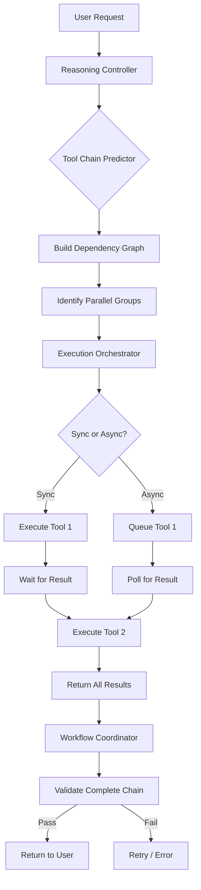
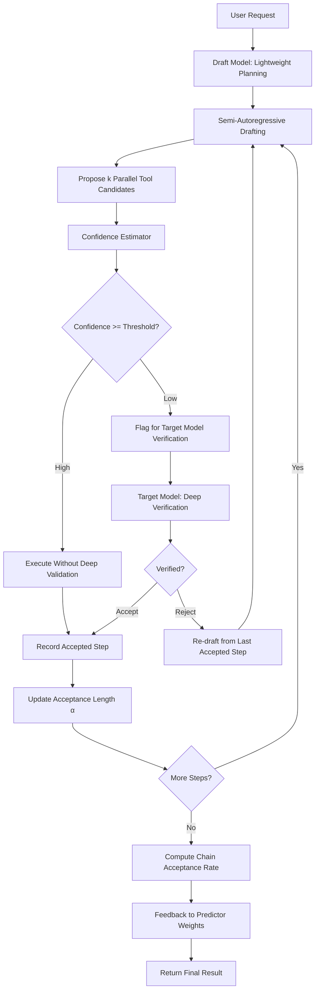

# Proposal 008: DSpark/DeepSpec Speculative Decoding Orchestration Enhancement

**Status:** Draft  
**Author:** AI Agent Review (2026-07-06)  
**Target:** mcp-ai-wpoos v1.5.x  
**Scope:** Base orchestration services

---

## 1. Summary

A systematic translation of inference-time speculative decoding patterns — pioneered by DSpark and DeepSpec — into the NV oOS agent orchestration layer. By mapping semi-autoregressive drafting to hybrid parallel+sequential planning, confidence-scheduled verification to adaptive orchestration depth, acceptance length to tool chain quality metrics, and draft-verify to two-tier model routing, this proposal defines a five-pillar enhancement plan that reduces orchestration latency, improves tool chain accuracy, and introduces self-correcting feedback loops into the existing Executor → Orchestrator → Load Balancer pipeline.

---

## 2. Background

### 2.1 DSpark / DeepSpec Speculative Decoding

Speculative decoding is an inference-time acceleration technique where a lightweight "draft" model proposes multiple tokens ahead (semi-autoregressively), and a larger "target" model verifies them in a single forward pass. The key metrics are:

| Concept | DSpark/DeepSpec Definition | Orchestration Translation |
|---|---|---|
| Semi-autoregressive drafting | Draft model generates _k_ tokens in parallel, not one-by-one | Planner proposes multiple tool-call candidates simultaneously; executor resolves which are independent enough to run in parallel |
| Confidence-scheduled verification | Target model accepts/rejects draft tokens based on per-token confidence scores | Orchestrator decides validation depth per tool chain step — high-confidence steps skip redundant validation, low-confidence steps undergo deeper verification |
| Acceptance length (α) | Number of draft tokens accepted by the target model in one pass | Number of consecutive tool outputs accepted without requiring re-planning or human intervention |
| Draft-verify pattern | Draft model proposes; target model verifies; rejected tokens trigger re-draft | Fast heuristic model proposes tool chain; full reasoning model verifies critical junctions; on rejection, planner re-drafts from the last accepted step |
| Rejection sampling feedback | Rejected token distributions inform future draft proposals | Tool chain failures and partial rejections are logged and fed back into the chain predictor's pattern weights |

DSpark demonstrated that a 7B draft model paired with a 70B target model achieves 2.0–2.7× throughput improvement while preserving output distribution identical to the target model alone. The orchestration translation aims for analogous gains: faster tool chain assembly and verification without sacrificing correctness.

### 2.2 Why This Matters for NV oOS

The existing orchestration layer already supports multi-agent coordination, tool chain prediction, and hybrid sync/async execution. However, it treats planning and verification as linear phases rather than interleaved speculative passes. This means:

- **Every tool call in a chain waits for the previous one to complete** (no semi-autoregressive drafting)
- **Validation is binary** — a tool either passes or fails, without confidence-graded depth
- **No feedback loop** between chain outcomes and future prediction quality
- **Single-model routing** — the same model handles both planning and execution, with no draft/target tiering

---

## 3. Current State

### 3.1 Orchestration Layer Inventory

| Service / Component | File | Role | Strengths | Gaps |
|---|---|---|---|---|
| `WP_MCP_AI_Tool_Execution_Orchestrator` | `includes/services/class-wp-mcp-ai-tool-execution-orchestrator.php` | Sync vs async routing, capacity-aware decisions via Little's Law | Capacity thresholds, load monitoring, auto-async detection | No speculative pre-execution; always waits for previous tool result |
| `WP_MCP_AI_Tool_Chain_Predictor` | `includes/services/class-wp-mcp-ai-tool-chain-predictor.php` | Predicts tool sequences, optimizes parallel groups, speculative chain execution | Dependency graph building, parallel group identification, chain prewarming | Predictions are static (pattern-matching on task type); no confidence scoring or acceptance-rate tracking |
| `WP_MCP_AI_Hybrid_Executor` | `includes/services/class-wp-mcp-ai-hybrid-executor.php` | Client vs server tool routing, parallel execution plans | Client-safe tool list, execution plan generation | No two-tier model routing; all server tools use the same model |
| `WP_MCP_AI_Enhanced_Workflow_Coordinator` | `includes/services/class-wp-mcp-ai-enhanced-workflow-coordinator.php` | Multi-step workflow creation, parallel/sequential execution, retry policies | Task decomposition, agent-based delegation, workflow health checks | Workflows are atomic — no partial acceptance or mid-chain correction |
| `WP_MCP_AI_Reasoning_Controller` | `includes/services/class-wp-mcp-ai-reasoning-controller.php` | Reasoning mode detection, quality tracking, coherence evaluation | Multi-step task detection, logical complexity scoring, domain expertise assessment | Reasoning depth is binary (on/off); no confidence-scheduled granularity |
| `WP_MCP_AI_Tool_Load_Balancer` | `includes/services/class-wp-mcp-ai-tool-load-balancer.php` | Distributes tool execution across available capacity | Load-aware routing, capacity scoring | No awareness of draft-vs-verify tiering |
| `WP_MCP_AI_Agent_Team_Orchestrator` | `includes/services/class-wp-mcp-ai-agent-team-orchestrator.php` | Multi-agent team formation, role assignment, inter-agent communication | Agent role abstractions, team composition strategies | Teams always follow linear plan→execute→verify; no speculative interleaving |
| `WP_MCP_AI_Orchestration_Health_Service` | `includes/services/class-wp-mcp-ai-orchestration-health-service.php` | Real-time health metrics, predictive insights | Memory/CPU/queue monitoring, predictive exhaustion warnings | No chain-level quality metrics (acceptance rate, re-planning frequency) |
| `WP_MCP_AI_Orchestration_Preset_Service` | `includes/services/class-wp-mcp-ai-orchestration-preset-service.php` | Orchestration presets (conservative, balanced, aggressive) | Tunable thresholds, AJAX-based preset application | No preset for "speculative" mode; presets are static threshold maps |

### 3.2 Current Orchestration Flow



**Key limitation:** The workflow coordinator validates _after_ the entire chain executes. There is no mid-chain verification, no confidence-gated depth, and no draft-model shortcut for low-risk tool calls.

### 3.3 Strengths

- **Capacity-aware routing** via Little's Law metrics is industry-leading for a PHP plugin
- **Tool chain prediction** with parallel group identification already exists as a foundation for speculative drafting
- **Multi-agent team orchestration** provides role abstractions (planner, executor, critic) that map directly to draft/verify roles
- **Preset service** offers a natural configuration mechanism for speculative mode parameters
- **Health service** already tracks system-level metrics; extending it to chain-level quality is incremental

### 3.4 Gaps (DSpark Translation)

| DSpark Concept | Current NV oOS State | Gap |
|---|---|---|
| Semi-autoregressive drafting | Chain predictor proposes sequences, but execution is strictly sequential (each tool waits for prior result) | No speculative pre-execution of independent tools before prior results arrive |
| Confidence-scheduled verification | Reasoning controller is binary (reasoning on/off) | No graduated validation depth based on tool criticality or confidence |
| Acceptance length tracking | No metric for "how many consecutive tool calls succeeded without intervention" | Missing feedback loop linking chain outcomes to future predictions |
| Draft-verify model tiering | Single model handles both planning and execution | No lightweight model for fast chain drafting vs full model for verification |
| Rejection feedback | Retry policies are static (max 3 retries with exponential backoff) | No learning from rejection patterns to improve chain prediction |

---

## 4. Proposed Architecture

### 4.1 Five-Pillar Enhancement Plan

```
┌──────────────────────────────────────────────────────────────────┐
│                    DSpark Orchestration Layer                      │
├──────────────────────────────────────────────────────────────────┤
│                                                                    │
│  Pillar 1          Pillar 2          Pillar 3          Pillar 4   │
│  ┌──────────┐     ┌──────────┐     ┌──────────┐     ┌──────────┐ │
│  │  Semi-   │     │Confidence│     │Acceptance│     │ Two-Tier │ │
│  │Autoregres│────>│Scheduled │────>│  Length  │────>│  Model   │ │
│  │ Drafting │     │Verificat.│     │ Tracking │     │ Routing  │ │
│  └──────────┘     └──────────┘     └──────────┘     └──────────┘ │
│       │                │                │                │        │
│       └────────────────┴────────────────┴────────────────┘        │
│                                │                                   │
│                         Pillar 5                                   │
│                      ┌──────────┐                                  │
│                      │Feedback  │                                  │
│                      │ Learning │                                  │
│                      │  Loop    │                                  │
│                      └──────────┘                                  │
└──────────────────────────────────────────────────────────────────┘
```

### 4.2 Enhanced Orchestration Flow



### 4.3 New and Modified Components

| Component | Action | Description |
|---|---|---|
| `WP_MCP_AI_Speculative_Drafting_Service` | **New** | Generates tool-call candidates semi-autoregressively; identifies parallelizable subsets; interfaces with chain predictor |
| `WP_MCP_AI_Confidence_Scheduler` | **New** | Assigns per-step confidence scores; determines verification depth (none / lightweight / full) based on score and task criticality |
| `WP_MCP_AI_Acceptance_Tracker` | **New** | Tracks acceptance length per chain; computes rolling acceptance rate; exposes metrics to health service |
| `WP_MCP_AI_Two_Tier_Router` | **New** | Routes planning to draft model (fast/cheap) or target model (accurate/expensive) based on task complexity and budget |
| `WP_MCP_AI_Orchestration_Feedback_Engine` | **New** | Aggregates rejection events; updates chain predictor pattern weights; provides presets for speculative aggressiveness |
| `WP_MCP_AI_Tool_Chain_Predictor` | **Modify** | Add confidence scoring output to `predict_tool_chain()`; add `update_weights_from_feedback()` |
| `WP_MCP_AI_Tool_Execution_Orchestrator` | **Modify** | Add speculative pre-execution path; integrate with confidence scheduler |
| `WP_MCP_AI_Enhanced_Workflow_Coordinator` | **Modify** | Support partial chain acceptance; mid-chain re-drafting on rejection |
| `WP_MCP_AI_Orchestration_Preset_Service` | **Modify** | Add "speculative" preset with draft-model temperature, confidence threshold, and max speculative depth |

---

## 5. Detailed Pillar Designs

### 5.1 Pillar 1: Semi-Autoregressive Drafting (Hybrid Parallel+Sequential Planning)

**Objective:** Propose up to _k_ tool-call candidates simultaneously instead of one-at-a-time, then execute independent subsets in parallel before prior results arrive.

**DSpark Analogy:** Draft model generates _k_ tokens in parallel; target model verifies them in one pass.

**Implementation:**

```
New Service: WP_MCP_AI_Speculative_Drafting_Service
├── draft_tool_chain( task_description, context ) → DraftChain
│   ├── Uses Tool_Chain_Predictor to generate initial sequence
│   ├── Identifies speculative branches (tools with no data dependency on prior results)
│   ├── Returns DraftChain with k steps, each tagged [speculative | dependent]
│   └── Max speculative depth configurable via preset (default: 3)
│
├── execute_speculative_batch( DraftChain, context ) → PartialResults
│   ├── Executes all speculative steps in parallel (via Hybrid Executor)
│   ├── Executes dependent steps sequentially
│   ├── Buffers results for confidence scheduler
│   └── Aborts speculative branches whose dependency became invalid
│
└── rollback_speculative_branch( step_index ) → void
    ├── Discards results from step_index onward
    └── Flags chain for re-draft from last accepted step
```

**Configuration (via Preset Service):**

| Parameter | Conservative | Balanced | Aggressive | Speculative (new) |
|---|---|---|---|---|
| `speculative_depth` | 0 (disabled) | 2 | 4 | 6 |
| `parallel_batch_size` | 1 | 3 | 5 | 8 |
| `speculative_timeout_ms` | N/A | 5000 | 10000 | 15000 |
| `abort_on_first_rejection` | N/A | true | false | false |

### 5.2 Pillar 2: Confidence-Scheduled Verification (Adaptive Orchestration Depth)

**Objective:** Apply graduated verification depth based on per-step confidence scores rather than binary pass/fail validation. High-confidence steps skip redundant checks; low-confidence or mission-critical steps receive deep verification.

**DSpark Analogy:** Target model accepts draft tokens with high confidence immediately; low-confidence tokens trigger deeper verification or re-sampling.

**Implementation:**

```
New Service: WP_MCP_AI_Confidence_Scheduler
├── compute_step_confidence( tool_slug, arguments, context ) → float (0.0–1.0)
│   ├── Factors:
│   │   ├── Tool historical success rate (from Acceptance Tracker)
│   │   ├── Argument complexity (number of args, nested depth, token count)
│   │   ├── Task criticality (is this a payment, deletion, permission change?)
│   │   ├── Domain match (is the tool appropriate for this task type?)
│   │   └── Chain position (late steps carry accumulated risk)
│   └── Returns weighted confidence score
│
├── determine_verification_depth( confidence, step_criticality ) → VerificationLevel
│   ├── Verification Levels:
│   │   ├── NONE (confidence > 0.95, non-critical)    → skip verification
│   │   ├── LIGHTWEIGHT (confidence 0.80–0.95)         → schema-only validation
│   │   ├── STANDARD (confidence 0.50–0.80)            → full output validation
│   │   └── DEEP (confidence < 0.50 OR is_critical)    → target-model re-evaluation
│   └── Overridable per preset configuration
│
└── schedule_verification( DraftChain, PartialResults ) → VerificationPlan
    ├── Assigns verification depth to each step
    ├── Batches DEEP verification steps for target-model processing
    └── Returns plan consumable by Two-Tier Router
```

**Confidence Threshold Matrix:**

| Task Criticality | Skip Threshold | Lightweight Threshold | Standard Threshold | Deep Always? |
|---|---|---|---|---|
| `low` (read ops) | ≥ 0.85 | ≥ 0.60 | ≥ 0.30 | Below 0.30 |
| `medium` (write ops) | ≥ 0.95 | ≥ 0.80 | ≥ 0.50 | Below 0.50 |
| `high` (delete, payment) | N/A | ≥ 0.95 | ≥ 0.80 | Below 0.80 |
| `critical` (credential, permission) | N/A | N/A | ≥ 0.95 | Below 0.95 |

### 5.3 Pillar 3: Acceptance Length & Tool Chain Acceptance Rate

**Objective:** Introduce quantitative metrics for chain quality — acceptance length (α = consecutive accepted steps) and acceptance rate (α / total steps) — and surface them for monitoring, optimization, and feedback.

**DSpark Analogy:** Acceptance length measures how many draft tokens the target model accepts in one pass; higher α means faster inference and better draft quality.

**Implementation:**

```
New Service: WP_MCP_AI_Acceptance_Tracker
├── record_step_acceptance( chain_id, step_index, accepted, confidence, latency_ms )
├── record_step_rejection( chain_id, step_index, reason, re_drafted_from )
├── compute_acceptance_length( chain_id ) → int
│   └── Longest consecutive run of accepted steps in the chain
├── compute_acceptance_rate( chain_id ) → float
│   └── accepted_steps / total_steps
├── compute_rolling_acceptance_rate( tool_slug, window_size=100 ) → float
│   └── Rolling average for specific tool performance
├── get_chain_quality_report( chain_id ) → array
│   ├── acceptance_length
│   ├── acceptance_rate
│   ├── re_draft_count
│   ├── avg_confidence
│   ├── total_latency_ms
│   └── verification_depth_distribution
└── expose_to_health_service()
    └── Feeds metrics into WP_MCP_AI_Orchestration_Health_Service for dashboard display
```

**Metrics surfaced in Orchestration Dashboard:**

| Metric | Display | Thresholds |
|---|---|---|
| Acceptance Rate (24h rolling) | Percentage gauge | Green ≥ 85%, Yellow ≥ 70%, Red < 70% |
| Avg Acceptance Length | Bar chart | Green ≥ 4, Yellow ≥ 2, Red < 2 |
| Re-draft Frequency | Sparkline | Baseline: < 5% of steps |
| Speculative Hit Rate | Percentage | % of speculative steps that were accepted |
| Avg Verification Depth | Distribution pie | NONE % / LIGHTWEIGHT % / STANDARD % / DEEP % |

### 5.4 Pillar 4: Two-Tier Model Routing (Draft-Verify Pattern)

**Objective:** Split planning and verification across different model tiers — a fast/cheap "draft" model proposes tool chains, and a full "target" model verifies critical junctions. This mirrors DSpark's draft-model + target-model architecture while staying within NV oOS's multi-provider framework.

**DSpark Analogy:** A 7B draft model proposes tokens; a 70B target model verifies them. The draft model handles the fast, low-stakes work; the target model steps in for high-stakes verification.

**Implementation:**

```
New Service: WP_MCP_AI_Two_Tier_Router
├── select_draft_model( task_complexity, budget ) → model_config
│   ├── Draft model criteria:
│   │   ├── Low latency (< 500ms typical response)
│   │   ├── Low cost (e.g., GPT-4o-mini, Gemini Flash, Ollama local)
│   │   ├── Sufficient for chain prediction (not full reasoning)
│   │   └── Configurable per preset
│   └── Falls back to primary model if no draft model configured
│
├── select_target_model( verification_depth, task_criticality ) → model_config
│   ├── Target model criteria:
│   │   ├── High accuracy (e.g., GPT-4o, Claude Opus, Gemini Pro)
│   │   ├── Strong reasoning capability
│   │   ├── Used only for DEEP verification steps
│   │   └── Configurable per preset
│   └── Falls back to primary model if no target model configured
│
├── route_planning_request( task_description, context ) → routing_decision
│   ├── Returns: { model, temperature, max_tokens, reasoning_effort }
│   └── Draft model used for: chain prediction, tool argument generation, low-stakes queries
│
├── route_verification_request( step, confidence, criticality ) → routing_decision
│   ├── Returns: { model, verification_depth }
│   └── Target model used for: DEEP verification, high-criticality steps, rejection handling
│
└── compute_cost_savings() → array
    ├── Compares actual cost vs single-model baseline
    ├── Tracks token usage per tier
    └── Feeds into Cost Tracking Service
```

**Model Tier Selection Rules:**

| Role | Default Provider | Fallback | When Used |
|---|---|---|---|
| Draft Model | `draft_model` setting (default: `gpt-4o-mini`) | Primary model | All planning, chain prediction, LIGHTWEIGHT/STANDARD verification |
| Target Model | `target_model` setting (default: primary model) | Primary model | DEEP verification, rejection re-evaluation, critical steps |
| Primary Model | System default | N/A | When two-tier is disabled or draft/target not configured |

### 5.5 Pillar 5: Orchestration Feedback Learning Loop

**Objective:** Close the loop between chain outcomes and future predictions. Rejection events, acceptance patterns, and latency data feed back into the chain predictor's pattern weights, the confidence scheduler's thresholds, and the drafting service's speculative depth decisions.

**DSpark Analogy:** Rejected token distributions inform future draft proposals, progressively improving the draft model's alignment with the target model.

**Implementation:**

```
New Service: WP_MCP_AI_Orchestration_Feedback_Engine
├── collect_feedback_event( event_type, payload ) → void
│   ├── Event types:
│   │   ├── step_accepted (confidence, latency, tool, task_type)
│   │   ├── step_rejected (reason, confidence, tool, task_type)
│   │   ├── chain_completed (acceptance_rate, total_latency, re_draft_count)
│   │   ├── speculative_hit (tool was correctly predicted as parallelizable)
│   │   └── speculative_miss (speculative execution was wasted)
│   └── Stored in wp_mcp_ai_orchestration_feedback table
│
├── update_predictor_weights( tool_slug, task_type ) → void
│   ├── Adjusts chain predictor pattern weights based on acceptance history
│   ├── Increases weight for high-acceptance tool sequences
│   ├── Decreases weight for high-rejection tool sequences
│   └── Exponentially weighted moving average (α=0.1 for stability)
│
├── optimize_confidence_thresholds() → array
│   ├── Analyzes rejection rate vs verification depth trade-off
│   ├── Proposes threshold adjustments to minimize cost while preserving acceptance rate
│   └── Returns recommended thresholds; applied manually or via auto-tune preset
│
├── recommend_speculative_depth() → int
│   ├── Based on speculative hit/miss ratio
│   ├── High hit rate → increase depth
│   ├── Low hit rate → decrease depth
│   └── Clamped to preset min/max bounds
│
└── generate_feedback_report( time_range ) → array
    ├── Aggregated metrics for admin dashboard
    ├── Trend analysis (improving/degrading)
    └── Actionable recommendations
```

**Feedback Table Schema:**

```sql
CREATE TABLE wp_mcp_ai_orchestration_feedback (
    id BIGINT(20) UNSIGNED AUTO_INCREMENT PRIMARY KEY,
    event_type VARCHAR(50) NOT NULL,
    tool_slug VARCHAR(100) DEFAULT NULL,
    task_type VARCHAR(50) DEFAULT NULL,
    chain_id VARCHAR(64) DEFAULT NULL,
    confidence FLOAT DEFAULT NULL,
    latency_ms INT UNSIGNED DEFAULT NULL,
    accepted TINYINT(1) DEFAULT NULL,
    reason VARCHAR(255) DEFAULT NULL,
    payload JSON DEFAULT NULL,
    created_at DATETIME NOT NULL DEFAULT CURRENT_TIMESTAMP,
    KEY event_type_time (event_type, created_at),
    KEY tool_slug (tool_slug),
    KEY chain_id (chain_id)
) ENGINE=InnoDB DEFAULT CHARSET=utf8mb4;
```

---

## 6. Implementation Roadmap

### Phase 1: Foundation — Acceptance Tracking + Metrics (Weeks 1–3)

| Task | Effort | Dependencies |
|---|---|---|
| 1.1 Create `wp_mcp_ai_orchestration_feedback` table | 0.5 day | None |
| 1.2 Implement `WP_MCP_AI_Acceptance_Tracker` service | 2 days | 1.1 |
| 1.3 Add acceptance metrics to `WP_MCP_AI_Orchestration_Health_Service` | 1 day | 1.2 |
| 1.4 Wire acceptance data into Orchestration Dashboard renderer | 1.5 days | 1.3 |
| 1.5 Add PHPUnit tests for Acceptance Tracker | 1 day | 1.2 |
| 1.6 Add `--speculative` flag and baseline instrumentation to `Tool_Execution_Orchestrator` | 1 day | None |

**Phase 1 Deliverable:** Acceptance length and rate metrics visible in dashboard; backend instrumentation in place.

### Phase 2: Semi-Autoregressive Drafting (Weeks 4–7)

| Task | Effort | Dependencies |
|---|---|---|
| 2.1 Implement `WP_MCP_AI_Speculative_Drafting_Service` | 3 days | Phase 1 |
| 2.2 Modify `Tool_Chain_Predictor::predict_tool_chain()` to output speculative/dependent tags | 2 days | Phase 1 |
| 2.3 Modify `Tool_Execution_Orchestrator` to support speculative pre-execution path | 2 days | 2.1, 2.2 |
| 2.4 Implement `rollback_speculative_branch()` and mid-chain abort logic | 1.5 days | 2.3 |
| 2.5 Add speculative depth and parallel batch size to Preset Service | 1 day | 2.1 |
| 2.6 PHPUnit tests for Speculative Drafting | 2 days | 2.1–2.4 |
| 2.7 Integration test: speculative chain with rollback scenario | 1 day | 2.4 |

**Phase 2 Deliverable:** Tool chains can be drafted semi-autoregressively; independent tools execute in parallel speculatively; rollback on dependency violation.

### Phase 3: Confidence-Scheduled Verification (Weeks 8–10)

| Task | Effort | Dependencies |
|---|---|---|
| 3.1 Implement `WP_MCP_AI_Confidence_Scheduler` service | 2.5 days | Phase 1, 2 |
| 3.2 Implement verification depth levels (NONE/LIGHTWEIGHT/STANDARD/DEEP) | 1.5 days | 3.1 |
| 3.3 Integrate confidence scheduling into `Tool_Execution_Orchestrator` execution path | 2 days | 3.2, 2.3 |
| 3.4 Wire task criticality metadata into tool definitions | 1 day | None |
| 3.5 Add confidence threshold matrix to Preset Service | 1 day | 3.1 |
| 3.6 PHPUnit tests for Confidence Scheduler | 1.5 days | 3.1–3.4 |

**Phase 3 Deliverable:** Per-step confidence scoring; graduated verification depth; configurable via presets.

### Phase 4: Two-Tier Model Routing (Weeks 11–14)

| Task | Effort | Dependencies |
|---|---|---|
| 4.1 Implement `WP_MCP_AI_Two_Tier_Router` service | 3 days | Phase 3 |
| 4.2 Add `draft_model` and `target_model` settings to Settings Registry | 1 day | 4.1 |
| 4.3 Integrate router into chain prediction and verification execution paths | 2.5 days | 4.1, 3.3 |
| 4.4 Implement cost comparison tracking (two-tier vs single-model baseline) | 1.5 days | 4.3 |
| 4.5 Add two-tier routing configuration to Preset Service | 1 day | 4.2 |
| 4.6 PHPUnit tests for Two-Tier Router | 2 days | 4.1–4.4 |

**Phase 4 Deliverable:** Draft model handles planning and lightweight verification; target model handles deep verification; cost savings tracked.

### Phase 5: Feedback Engine + Polish (Weeks 15–18)

| Task | Effort | Dependencies |
|---|---|---|
| 5.1 Implement `WP_MCP_AI_Orchestration_Feedback_Engine` service | 3 days | Phase 1–4 |
| 5.2 Implement predictor weight update from feedback | 2 days | 5.1, 2.2 |
| 5.3 Implement auto-tune confidence threshold recommendations | 1.5 days | 5.1, 3.1 |
| 5.4 Implement speculative depth auto-adjustment | 1 day | 5.1, 2.1 |
| 5.5 Add "speculative" preset with full two-tier + drafting + confidence configuration | 1 day | All |
| 5.6 End-to-end integration tests | 2 days | All |
| 5.7 Update documentation: `docs/orchestration-speculative-decoding.md` | 1 day | All |
| 5.8 Dashboard polish: feedback trends, recommendation cards | 2 days | 5.1–5.4 |

**Phase 5 Deliverable:** Self-tuning feedback loop; speculative preset; comprehensive documentation.

### Total Estimated Effort: 13–18 weeks (38–50 working days)

---

## 7. Risk Assessment

| Risk | Likelihood | Impact | Mitigation |
|---|---|---|---|
| Speculative execution wastes resources on branches that get rolled back | Medium | Medium | Conservative default `speculative_depth=2`; feedback loop auto-adjusts based on hit rate; configurable per preset |
| Draft model produces lower-quality tool arguments than current single-model path | Medium | Medium | Target model verifies all DEEP steps; confidence scheduler gates approval; draft model only used for planning, not execution of critical tools |
| Two-tier routing increases total latency if draft+verify takes longer than single-model | Low | Medium | Latency tracking in Acceptance Tracker; auto-disable two-tier if latency regresses > 20%; cost savings still beneficial for async workloads |
| Confidence scores are inaccurate (over-confident on failing steps) | Medium | High | Start with conservative thresholds; feedback loop adjusts based on actual outcomes; DEEP verification always applied to critical steps regardless of confidence |
| Feedback loop over-fits to recent patterns and destabilizes predictor | Low | Medium | EWMA with low α (0.1); manual override always available; predictor weights are additive (never zeroed) |
| `wp_mcp_ai_orchestration_feedback` table grows unbounded | Low | Low | Scheduled pruning via cron (retain 90 days); configurable retention; partition by month for performance |
| Pro addon incompatibility (orchestration dashboard in Pro loads separate class) | Low | Medium | All new services are in Base `includes/services/`; Pro dashboard reads from same Health Service; test against Pro activation |

---

## 8. Migration Impact

- **Backward compatibility:** All changes are additive. The existing orchestration flow remains the default. Speculative drafting, confidence scheduling, and two-tier routing are opt-in via presets. The "conservative" and "balanced" presets remain unchanged. The new "speculative" preset is the only one that enables all five pillars.
- **No REST API changes:** The REST surface is unaffected. Tool responses maintain the canonical envelope format.
- **No database schema changes to existing tables:** The only new table is `wp_mcp_ai_orchestration_feedback`. All existing tables are untouched.
- **No breaking changes to existing tools:** Tool definitions are unchanged. The optional `criticality` metadata field is additive and defaults to `medium` when absent.
- **Pro impact:** Pro orchestration dashboard reads health metrics from the same `WP_MCP_AI_Orchestration_Health_Service`; the new metrics (acceptance rate, speculative hit rate) are additive fields in the existing health response structure.
- **Feature flag:** `WP_MCP_AI_SPECULATIVE_ORCHESTRATION` constant (default: `false` in v1.5.0, `true` in v1.6.0) gates all five pillars. When disabled, the orchestration layer behaves identically to v1.4.x.
- **Data retention:** The feedback table is pruned automatically via cron (default: 90-day retention). No manual cleanup required.

---

## 9. Acceptance Criteria

1. `WP_MCP_AI_Acceptance_Tracker` records per-step acceptance/rejection events and exposes `acceptance_rate` and `acceptance_length` via Health Service
2. `WP_MCP_AI_Speculative_Drafting_Service` proposes up to `speculative_depth` tool-call candidates and executes independent subsets in parallel
3. Speculative branches that fail dependency checks are rolled back and re-drafted from the last accepted step
4. `WP_MCP_AI_Confidence_Scheduler` assigns confidence scores (0.0–1.0) to each chain step and maps them to verification depth (NONE/LIGHTWEIGHT/STANDARD/DEEP)
5. Critical steps (delete, payment, credential changes) always receive DEEP verification regardless of confidence score
6. `WP_MCP_AI_Two_Tier_Router` routes planning to draft model and DEEP verification to target model when both are configured; falls back gracefully when only one model is available
7. `WP_MCP_AI_Orchestration_Feedback_Engine` updates chain predictor weights and confidence thresholds based on acceptance history
8. Orchestration Dashboard displays acceptance rate gauge, speculative hit rate, and verification depth distribution
9. "Speculative" preset enables all five pillars with sensible defaults; "conservative" and "balanced" presets remain unchanged
10. All new services have ≥ 80% PHPUnit test coverage
11. `WP_MCP_AI_SPECULATIVE_ORCHESTRATION` feature flag fully disables all five pillars when set to `false`
12. Zero errors from `composer run lint` (PHPCS) and `composer run lint:compat` (PHP 7.4–8.3 compatibility)

---

## 10. References

- DSpark: "Speculative Decoding for Large Language Models" — Chen et al. (2024). Introduces draft-model + target-model architecture with acceptance length as key metric.
- DeepSpec: "DeepSpeed Speculative Decoding" — Microsoft DeepSpeed team (2024). Production implementation of speculative decoding with configurable draft models.
- Leviathan et al.: "Fast Inference from Transformers via Speculative Decoding" (2023). Original speculative decoding paper; establishes the draft-verify-rejection sampling framework.
- NV oOS DeepSeek V4 Orchestration Enhancements proposal: `docs/project/proposals/DEEPSEEK-V4-ORCHESTRATION-ENHANCEMENTS.md` — Implemented Phase 1–5 foundation (executor, orchestrator, load balancer, reasoning controller, context manager).
- Existing chain prediction service: `includes/services/class-wp-mcp-ai-tool-chain-predictor.php`
- Existing execution orchestrator: `includes/services/class-wp-mcp-ai-tool-execution-orchestrator.php`
- Existing hybrid executor: `includes/services/class-wp-mcp-ai-hybrid-executor.php`
- Existing orchestration preset service: `includes/services/class-wp-mcp-ai-orchestration-preset-service.php`
- Existing orchestration health service: `includes/services/class-wp-mcp-ai-orchestration-health-service.php`
- WordPress Plugin Handbook: "Managing Custom Database Tables"
- Related proposal: `docs/project/proposals/CONTEXT-1-INSPIRED-ORCHESTRATION-ENHANCEMENTS.md`
