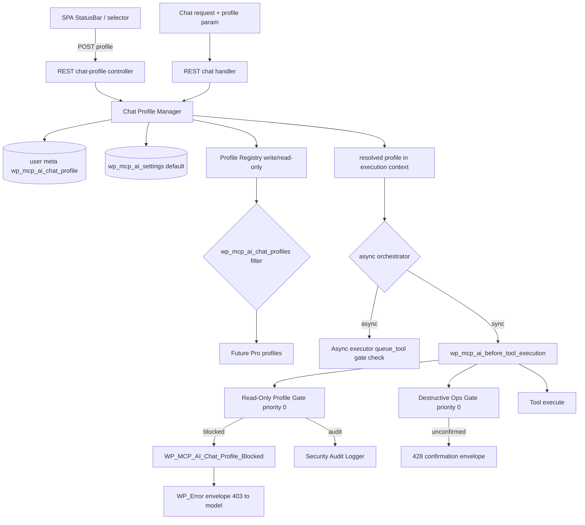

# Chat Profile & Read-Only Mode — Implementation Plan

**Proposal 015**
**Date:** 2026-10-09
**Status:** Proposal
**Target release:** v2.2.0 (Phase A–C), v2.3.0 (Phase D hardening)
**Compatibility:** Base: PHP 7.4+ · Pro: PHP 8.1+
**Author:** NV Digital Solutions (Zed coding agent)

---

## 1. Executive Summary

The Pro SPA v2 status bar shows `Profile: write`, but the feature is a dead stub: `useModelStore.profile` hardcodes `'write'`, `availableProfiles` is never seeded (`useBootstrap` declares `setAvailableProfiles` and never calls it), the profile `<select>`s only render when the list is non-empty, and the only server-side reference (`WP_MCP_AI_Profile_Manager` in the Pro SPA bootstrap controller) points at a class that **does not exist anywhere in the codebase**. The `profile` value is never sent with chat requests, and the chat REST controller has no profile handling at all — so nothing can make it read-only today.

This proposal wires Chat Profiles end-to-end as a **session-scoped, server-enforced permission boundary** for tool execution, using industry-standard agent permission-mode patterns (Claude Code permission modes, Cline Plan/Act, OWASP LLM06/LLM08 excessive-agency controls, Microsoft least-privilege agent guidance). Enforcement reuses the existing `wp_mcp_ai_before_tool_execution` gate pipeline (the Destructive Ops Gate is the reference implementation), so the boundary is architectural — not prompt-based — and applies to every tool-execution surface (REST tools, chat agentic loop, async jobs).

**V1 scope:** two built-in profiles — `write` (default, current behaviour) and `read-only` (blocks tools flagged `write` / `state-changing` / `destructive` / `irreversible` / `financial-impact` / `access-control-change` / `mass-email`). Selection is admin-gated, persisted per user, seeded into the SPA runtime, and reflected in the status bar.

### Why this matters

- **OWASP LLM06/LLM08 (Excessive Agency).** The plugin exposes ~1,700 tools, many state-changing. A read-only mode is the single most effective, auditable control for delegating the chat to lower-trust operators (editors, guests, clients).
- **Least privilege as a boundary, not a prompt.** "Please don't modify anything" in a system prompt is trivially defeated. The gate must live at the tool boundary, downstream of the model.
- **The machinery already exists.** Destructive Ops Gate (`includes/security/class-wp-mcp-ai-destructive-ops-gate.php`), capability flags (`WP_MCP_AI_Tool_Capability_Flags_Interface`), the security audit logger, and the safety-profile domain (`WP_MCP_AI_Action_Safety_Profile`) give us the hook, the flags, the audit trail, and the classification vocabulary. This is an additive, low-risk feature.

---

## 2. Industry Best Practices & Standards

Research summary (sources in §13):

| Practice | Source | How we adopt it |
|---|---|---|
| **Deny → ask → allow precedence** | Claude Code permission modes | Read-only gate (hard deny) runs at priority 0, *before* the Destructive Ops Gate (ask/confirm). A blocked write never degrades into a confirmation prompt. |
| **Plan vs Act separation** | Cline Plan/Act, Cursor Ask/Edit/Agent | `read-only` ≈ Plan mode: reads run freely, writes blocked with a descriptive result so the model produces a read-only answer instead of looping. Status bar shows the active mode. |
| **Read-allowlist first, not write-blocklist** | Matthew Wong (AI agent least privilege) | Read-only is enforced by a **gated-flag set** plus an explicit per-tool allowlist override. Any new tool that declares `write`/`state-changing` flags is automatically gated — no new registration step to forget. |
| **Enforce in the downstream system, never in prompts** | OWASP LLM06/LLM08 | Gate runs inside `wp_mcp_ai_before_tool_execution`, the same hook that already blocks unconfirmed destructive ops. The system-prompt hint is advisory only. |
| **Human-in-the-loop step-up for high-impact actions** | OWASP LLM06, Microsoft least-privilege agent blog | `write` mode keeps the existing confirmation flow for destructive tools. Read-only never auto-escalates; a one-shot admin override is an explicitly deferred extension (Phase D), never a silent prompt bypass. |
| **Separate read vs write duties; scope roles to work units** | Microsoft Security Blog | Profiles are *roles* over tools (read vs write), not per-user ACLs. Future profiles (`publish-only`, `commerce`) register through a filter without touching the gate. |
| **The agent must not be able to widen its own grant** | skilder (least-privilege agents) | The profile-switch REST route is capability-gated and is not a callable tool; the model is told the profile is fixed for the session. Non-admins can only *downgrade* (write → read-only), never upgrade. |
| **Audit every blocked/attempted escalation** | OWASP LLM08, Anthropic auto-mode | Blocked tool calls and profile-switch attempts are written to the security audit log (`WP_MCP_AI_Security_Audit_Logger`), same as destructive-op denials. |

---

## 3. Current State Audit (verified 2026-10-09)

| Component | Location | State |
|---|---|---|
| Profile store default | `addons/pro/assets/spa-v2/src/stores/modelStore.ts` | `profile: 'write'` hardcoded; `availableProfiles: []` |
| Store seeding | `.../src/hooks/useBootstrap.ts` | `setAvailableProfiles` declared, **never called** |
| Profile selectors | `.../src/features/chat/ChatPage.tsx` (admin-only), `.../src/components/layout/RightPanel.tsx` | Render only when `availableProfiles.length > 0` → never render |
| Status bar | `.../src/components/layout/StatusBar.tsx` | Displays the dead `'write'` default |
| Server profile source | `addons/pro/includes/rest/class-wp-mcp-ai-pro-spa-bootstrap-controller.php` | References `WP_MCP_AI_Profile_Manager` — class **does not exist**; `profiles` is always `[]` |
| Chat request | `includes/rest/class-wp-mcp-ai-rest-chat-controller.php`, `includes/class-wp-mcp-ai-rest.php` | No `profile` parameter anywhere in the chat flow |
| Threads | `includes/class-wp-mcp-ai-thread-manager.php` | Has a `profile VARCHAR(50) DEFAULT 'write'` column; threads browse UI was removed from Pro SPA v2 (leftovers: unused `ThreadsClient` import in `ChatPage.tsx`, orphaned `src/hooks/useThreads.ts`) — **not in scope for this proposal, noted for cleanup** |
| Gate hook | `wp_mcp_ai_before_tool_execution( $tool_slug, $arguments, $context )` fired at `includes/class-wp-mcp-ai-rest.php:6438` & `:12495`, `includes/rest/class-wp-mcp-ai-rest-tools-controller.php:670` | Existing gates: Destructive Ops (priority 0), Capability Boundary (priority 1), token limits, measurement observer |
| Exception → envelope pattern | `includes/exceptions/class-wp-mcp-ai-destructive-confirmation-required.php` + executor catches (`to_wp_error()`) | Reference implementation to mirror |
| Async path | `includes/services/class-wp-mcp-ai-tool-async-executor.php` | **Does not fire** `wp_mcp_ai_before_tool_execution` today (pre-existing gap — the destructive gate doesn't cover async jobs either). `sanitize_context()` allowlists `user_id, assistant_id, session_id, tool_call_id, blog_id` |
| Capability flags | `includes/interfaces/interface-wp-mcp-ai-tool.php:111` (`WP_MCP_AI_Tool_Capability_Flags_Interface`), `includes/tools/trait-wp-mcp-ai-tool-safety-profile.php` | Flags: `read-only`, `write`, `state-changing`, `destructive`, `irreversible`, `financial-impact`, `access-control-change`, `mass-email`, … (same vocabulary the destructive gate already keys on) |
| System prompt | `includes/class-wp-mcp-ai-rest.php:3464` & `:13300` — `apply_filters( 'wp_mcp_ai_system_prompt', … )` | Insertion point for the advisory read-only directive |

**Conclusion:** enforcement (gate), classification (flags), audit (logger), and UI scaffolding (selectors, store) all exist; only the profile *definition, resolution, transport, persistence, and wiring* are missing.

---

## 4. Design

### 4.1 Trust model (the core decision)

> **The server resolves the profile. The client never decides enforcement.**

Per request, the server resolves the active profile as:

```
client-sent `profile` param (display only)
   → validated against the user's persisted profile (user meta `wp_mcp_ai_chat_profile`)
   → fallback: site default (`wp_mcp_ai_settings['default_chat_profile']`, default `write`)
   → fallback: `write`
```

- If the client-sent value differs from the resolved value **and** the requester lacks the `wp_mcp_ai_change_chat_profile` capability → use the resolved value, log the mismatch (`EVENT_CHAT_PROFILE_ESCALATION_ATTEMPT`).
- If the requester *holds* the capability, a client-sent value may be adopted as a per-request override (allows admin power-users to run one request read-only). Overrides never bypass the user's own allowed set.
- Guests (no user meta) always inherit the site default. Recommended: site default `read-only` for guest-token surfaces (see §12 open questions).

This mirrors the industry rule that the boundary is enforced downstream of the model and cannot be widened by it.

### 4.2 Profile model

`WP_MCP_AI_Chat_Profile` (domain value object):

| Field | Example (`read-only`) |
|---|---|
| `slug` | `read-only` |
| `label` | `Read-only` |
| `description` | `Read tools only; writes, state changes and destructive actions are blocked.` |
| `gated_flags` | `['write', 'state-changing', 'destructive', 'irreversible', 'financial-impact', 'access-control-change', 'mass-email', 'data-destruction']` |
| `allowed_tool_slugs` | `[]` (explicit allowlist overrides for flagged tools, e.g. `update_option` style exceptions if ever needed) |
| `required_capability` | `wp_mcp_ai_change_chat_profile` (who may *select* it) |
| `is_default` | `false` |

Built-ins: `write` (`gated_flags = []`, current behaviour — zero change) and `read-only`. The registry is filterable (`wp_mcp_ai_chat_profiles`) so Pro toolkits can register `publish-only`, `commerce`, etc. later without touching the gate.

### 4.3 Enforcement gate

`WP_MCP_AI_Read_Only_Profile_Gate`, registered in `includes/agents-init.php` **before** the Destructive Ops Gate on `wp_mcp_ai_before_tool_execution` (priority 0, registration order wins at equal priority):

```
1. Resolve profile: $context['chat_profile'] if present (set by the REST handlers), else user meta.
2. If profile->gated_flags is empty → return (write mode, zero overhead).
3. Resolve tool instance; read get_capability_flags().
4. If tool slug ∈ profile->allowed_tool_slugs → return.
5. If flags ∩ gated_flags = ∅ → return.
6. Audit-log EVENT_CHAT_PROFILE_BLOCKED; throw WP_MCP_AI_Chat_Profile_Blocked (→ to_wp_error(), HTTP 403).
```

The error envelope (returned to the model as the tool result, mirroring the destructive gate's preview pattern) tells the model what happened and how to proceed:

```json
{
  "code": "wp_mcp_ai_chat_profile_blocked",
  "tool_slug": "update_post",
  "flags": ["write", "state-changing"],
  "profile": "read-only",
  "message": "Tool \"Update Post\" is blocked: the current chat profile is read-only. Answer using read-only tools only."
}
```

The model can then answer with read-only data instead of retrying the write in a loop.

**Precedence guarantee:** a write tool under `read-only` is *blocked*, never asked for confirmation — the read-only gate runs before the destructive gate (deny > ask > allow).

### 4.4 Transport & context propagation

- Chat endpoints (`/chat`, `/chat-client`) and the tools/call handler accept an optional `profile` request param (validated as in §4.1).
- Handlers put the **resolved** profile slug into `$context['chat_profile']` alongside `assistant_id`/`user_id`, so the gate, audit logger, and any future gate consume one consistent value.
- **Async jobs:** add `chat_profile` to `WP_MCP_AI_Tool_Async_Executor::sanitize_context()` allowlist, and enforce at `queue_tool()` time via the gate's static `is_tool_allowed( $tool, $profile )` check (reject the job before it is queued). Because the async worker does not fire the before-execution hook today (pre-existing gap affecting the destructive gate too), queue-time enforcement is the v1 guarantee; firing the hook inside the worker is a Phase D parity task.

### 4.5 Persistence & selection

- Site setting: `wp_mcp_ai_settings['chat_profile_enabled']` (bool, default `true`), `wp_mcp_ai_settings['default_chat_profile']` (`'write'`).
- Per-user: user meta `wp_mcp_ai_chat_profile` (slug string, validated against the registry on every read/write; multisite per-blog; deleted on user delete).
- Capability: meta-cap `wp_mcp_ai_change_chat_profile`, mapped to `manage_options` via `map_meta_cap`. A future refinement: allow *downgrade* (write → read-only) for all logged-in users while reserving *upgrade* for admins (§12 Q2).
- REST: `GET/POST /mcp-ai/v1/chat-profile` — GET lists profiles + current (cap: `read`), POST sets the current (cap: `wp_mcp_ai_change_chat_profile`; validated against registry + allowed set). The route is intentionally **not** a registered tool, so the agent cannot switch its own profile mid-run.

### 4.6 SPA wiring (Pro)

- `NVOOS_PRO_SPA` runtime gains:
  - `profiles: [{ slug, label, description, selectable }]` (top level)
  - `config.profile` (resolved current slug)
  - `config.profileSelector` (true only for users holding the switch capability)
- `useBootstrap` seeds `setAvailableProfiles( profiles )` and `setProfile( runtime.config.profile )` — activating the previously dead code path.
- The existing selectors (ChatPage toolbar for admins, RightPanel) render from the seeded list; on change they POST to the REST route, update the store, and show a toast on failure.
- Status bar keeps rendering `modelStore.profile` (now live); add `title` with the profile description.
- Embedded mode: no selector (non-admin surfaces); enforcement still applies server-side, so shortcode guests inherit the site default.

### 4.7 Advisory system-prompt hint

On the existing `wp_mcp_ai_system_prompt` filter, when the resolved profile has gated flags, append:

> `System: You are operating in {label} mode. Tools that modify data are blocked at the execution layer; do not attempt them. Prefer read-only tools and answer without side effects.`

Advisory only — the gate is the enforcement (§2).

---

## 5. Architecture Overview



---

## 6. File Manifest

### Base plugin — new files

| File | Contents |
|---|---|
| `includes/domain/class-wp-mcp-ai-chat-profile.php` | `WP_MCP_AI_Chat_Profile` value object + `PROFILE_WRITE`/`PROFILE_READ_ONLY` constants (pure PHP, mirrors `WP_MCP_AI_Action_Safety_Profile`) |
| `includes/chat/class-wp-mcp-ai-chat-profile-registry.php` | Registry: built-ins, `get_profile()`, `list_for_user()`, `wp_mcp_ai_chat_profiles` filter |
| `includes/chat/class-wp-mcp-ai-chat-profile-manager.php` | Resolution (§4.1), per-user get/set, site default, request-local static cache, mismatch logging |
| `includes/exceptions/class-wp-mcp-ai-chat-profile-blocked.php` | Exception with `to_wp_error()` (403 envelope), mirroring `WP_MCP_AI_Destructive_Confirmation_Required` |
| `includes/security/class-wp-mcp-ai-read-only-profile-gate.php` | The gate (§4.3) + static `is_tool_allowed()` for async queue-time reuse |
| `includes/rest/class-wp-mcp-ai-rest-chat-profile-controller.php` | `GET/POST /mcp-ai/v1/chat-profile` (§4.5) |
| `includes/chat/README.md` | Folder README per the repo convention |

### Base plugin — modified files

| File | Change |
|---|---|
| `includes/agents-init.php` | Register the read-only gate at priority 0, **before** the destructive gate |
| `includes/class-wp-mcp-ai-rest.php` | Accept `profile` param on chat/chat-client/tools; populate `$context['chat_profile']`; add `catch ( WP_MCP_AI_Chat_Profile_Blocked )` at the two `do_action` sites (≈6438, ≈12495) |
| `includes/rest/class-wp-mcp-ai-rest-tools-controller.php` | Same catch + context population (≈670) |
| `includes/rest/class-wp-mcp-ai-rest-chat-controller.php` | Validate/pass `profile` param through to the loop |
| `includes/services/class-wp-mcp-ai-tool-async-executor.php` | Add `chat_profile` to `sanitize_context()` allowlist; enforce via `is_tool_allowed()` in `queue_tool()` |
| `includes/security/class-wp-mcp-ai-security-audit-logger.php` | New event constants: `EVENT_CHAT_PROFILE_BLOCKED`, `EVENT_CHAT_PROFILE_ESCALATION_ATTEMPT` |
| `includes/class-wp-mcp-ai-rest.php` (system prompt sites ≈3464, ≈13300) | Append the §4.7 hint via the existing filter chain |
| `includes/admin/` (settings page) | Phase D: profile section (enable toggle, default profile, capability) |
| Capability bootstrap | `map_meta_cap` filter for `wp_mcp_ai_change_chat_profile` |

### Pro addon — new files

| File | Contents |
|---|---|
| `addons/pro/assets/spa-v2/src/api/chatProfile.ts` | Typed client for the REST route |
| `addons/pro/assets/spa-v2/src/__tests__/chat-profile.test.ts` | Store seeding, selector render, persist-on-change, failure toast |

### Pro addon — modified files

| File | Change |
|---|---|
| `addons/pro/includes/class-wp-mcp-ai-pro-spa-config.php` | Add `profiles`, `config.profile`, `config.profileSelector` to the runtime |
| `addons/pro/assets/spa-v2/src/api/config.ts` | Extend `ProSpaRuntime` types (all fields optional for backward compat) |
| `addons/pro/assets/spa-v2/src/hooks/useBootstrap.ts` | Seed `setAvailableProfiles()` + `setProfile()` (activate dead code) |
| `addons/pro/assets/spa-v2/src/features/chat/ChatPage.tsx` | Wire the existing selector to store + REST persist (admin-only gate stays) |
| `addons/pro/assets/spa-v2/src/components/layout/RightPanel.tsx` | Same wiring (render for capability holders) |
| `addons/pro/assets/spa-v2/src/components/layout/StatusBar.tsx` | `title`/`aria-label` with profile description |

### Explicitly out of scope (noted, not changed)

- Threads cleanup (orphaned `useThreads.ts`, unused `ThreadsClient` import, dangling `WP_MCP_AI_Profile_Manager` guard in the Pro bootstrap controller) — separate housekeeping PR.
- Legacy base chat UI (`assets/js/chat.js`) profile selector — base chat inherits enforcement via user meta automatically; a selector there is Phase D-optional.

---

## 7. API Contracts

### 7.1 `GET /mcp-ai/v1/chat-profile`

Capability: `read`. Response:

```json
{
  "success": true,
  "data": {
    "profiles": [
      { "slug": "write", "label": "Write", "description": "…", "selectable": true },
      { "slug": "read-only", "label": "Read-only", "description": "…", "selectable": true }
    ],
    "current": "write"
  }
}
```

### 7.2 `POST /mcp-ai/v1/chat-profile`

Capability: `wp_mcp_ai_change_chat_profile`. Body: `{ "profile": "read-only" }`. Validates against registry + user's allowed set; returns the same shape as GET with the new `current`. Invalid slug → 400; insufficient capability → 403.

### 7.3 Chat request (addition)

```json
{ "profile": "read-only" }
```

Optional, advisory (see §4.1). Never authoritative on its own.

### 7.4 Blocked-tool envelope (tool result)

```json
{ "code": "wp_mcp_ai_chat_profile_blocked", "tool_slug": "…", "flags": ["write"], "profile": "read-only", "message": "…" }
```

---

## 8. Phased Implementation

### Phase A — Foundation (base, zero behaviour change)

1. `WP_MCP_AI_Chat_Profile` domain class + constants (PHP 7.4-safe).
2. Registry with `write` + `read-only` built-ins and the `wp_mcp_ai_chat_profiles` filter.
3. Manager: resolve/get/set, site default key, request-local static cache.
4. Settings keys + `map_meta_cap` mapping + audit event constants.
5. PHPUnit: registry/managers tests (`tests/security/`, `tests/helpers/` per repo conventions).

**Gate:** default is `write` (empty gated flags) → nothing observable changes.

### Phase B — Enforcement (base, feature live)

1. `WP_MCP_AI_Chat_Profile_Blocked` exception + `to_wp_error()`.
2. Read-Only Profile Gate + registration before the destructive gate.
3. Executor catches at all three `do_action` sites.
4. `profile` param + `$context['chat_profile']` propagation in the REST handlers.
5. Async: `sanitize_context()` key + queue-time `is_tool_allowed()` check.
6. System-prompt advisory hint.
7. Flag-coverage audit: script that lists registered tools **without** capability flags (they pass the read-only gate by default). Output becomes a follow-up hardening ticket.
8. PHPUnit: gate matrix (read tool passes / write blocked / allowlist override / envelope shape / audit event / precedence over destructive gate / async queue rejection), REST controller permission + validation tests.

### Phase C — SPA UI (Pro)

1. Runtime fields in `class-wp-mcp-ai-pro-spa-config.php` (+ `config.profileSelector`).
2. `src/api/chatProfile.ts` client.
3. `useBootstrap` seeding (the previously dead path).
4. Selector wiring in ChatPage (admin) + RightPanel (capability holders); persist on change with toast.
5. Status bar tooltip.
6. Vitest: seeding, rendering, persist call, failure path; run typecheck + `npm run lint:a11y` + full suite; rebuild `assets/dist`.

### Phase D — Hardening & rollout (post-v1)

1. Settings-page section (enable, default profile, per-capability switching).
2. Async worker parity: fire `wp_mcp_ai_before_tool_execution` inside the worker (also fixes the destructive gate gap).
3. One-shot admin override for read-only (`confirm_write=true` → ask, not deny) as an opt-in filter — HITL step-up without weakening the default.
4. Site Health check reporting unflaged tools (read-only coverage %).
5. Legacy chat UI selector (optional).
6. Docs: `docs/tool-reference.md`/settings docs + changelog entry.

---

## 9. Testing Strategy

| Layer | Coverage |
|---|---|
| PHPUnit — gate | read-only tool passes; `write`/`state-changing`/`destructive`/`irreversible`/`financial-impact` blocked; multi-flag tools blocked; allowlist override passes; unflaged tool passes (documented decision); blocked call yields WP_Error envelope 403; audit event written; precedence: read-only block fires before destructive confirmation; `write` profile = gate inert |
| PHPUnit — manager/registry | default resolution chain (user meta → site default → write); invalid meta falls back; escalation mismatch logged; filter-registered profiles; capability mapping |
| PHPUnit — REST | GET/POST caps; invalid slug 400; persistence round-trip; non-admin cannot set a profile they cannot select |
| PHPUnit — async | `queue_tool` rejects a write tool under read-only before a job row is created; `sanitize_context` round-trips `chat_profile` |
| Vitest | bootstrap seeds store from runtime; selector renders for admins only; change persists via POST and updates store; failure shows toast; status bar reflects current profile; backward compat when runtime lacks the new fields |
| Manual | Admin sets read-only → chat tool call returns blocked envelope → model answers read-only → status bar shows Read-only → legacy chat also blocked (user meta) → guest shortcode inherits default |

Run gates: `composer run test`, `vendor/bin/phpunit tests/security/test-chat-profile-gate.php`, SPA `npm run typecheck && npm test && npm run lint:a11y`, `composer run lint` + `lint:compat` for the new PHP.

---

## 10. Security Considerations

1. **No client-side escalation.** The resolved profile is computed server-side; a client-sent `profile=write` from a read-only user is ignored and logged.
2. **No self-escalation by the agent.** The switch route is not a tool; the advisory prompt states the profile is fixed.
3. **Precedence is explicit.** Read-only deny > destructive ask > allow. A confirm parameter never unlocks a read-only block in v1.
4. **Async coverage.** Queue-time enforcement closes the async hole in v1 (worker-side hook parity in Phase D).
5. **Flag gaps.** Unflaged tools pass by default — the same residual risk the destructive gate already carries. Mitigations: flag-coverage audit script (Phase B.7), allowlist overrides, and a future `read-only-strict` (default-deny) profile. Do **not** default-deny in v1: ~1,700 tools were not all authored with flags, and v1 default-deny would break legitimate read tooling.
6. **Audit.** Every block and escalation attempt hits the security audit log; Site Health/security-posture integration is a Phase D option.
7. **Multisite.** User meta and settings are per-blog; async `blog_id` context preserved as today.

---

## 11. Risks & Mitigations

| Risk | Impact | Mitigation |
|---|---|---|
| Tools missing flags slip through read-only | High (boundary gap) | Audit script + allowlist + `read-only-strict` roadmap; publish coverage report |
| Wrong default profile flips a production site | Medium | `write` default = zero change; settings toggle `chat_profile_enabled`; rollout behind Phase B tests |
| Gate ordering vs destructive gate | Medium | Explicit priority-0-first registration + PHPUnit precedence test |
| Async jobs bypass gates | High (pre-existing) | Queue-time check in v1; worker hook parity in Phase D |
| SPA runtime changes break embedded/legacy surfaces | Medium | All new fields optional; `applyPerInstanceConfig` untouched; backward-compat vitest |
| Model loops after a block | Low | Blocked envelope tells the model to proceed read-only; prompt hint reinforces |
| Performance (registry load per request) | Low | Request-local static cache in the manager |

---

## 12. Open Questions (decisions needed before/at implementation)

1. **Built-in set:** `write` + `read-only` sufficient for v1? (Plan/Act naming vs Write/Read-only naming — current UI says "Profile", so Write/Read-only is recommended.)
2. **Switching policy:** admins-only (simplest), or allow *downgrade* for everyone and *upgrade* admins-only (recommended refinement)?
3. **Guests:** should guest-token shortcodes default to `read-only`? (Recommended for security; requires a settings default change for guests only.)
4. **Legacy chat UI selector** — in scope for v1 or Phase D?
5. **Read-only + confirm step-up** (`confirm_write` one-shot admin override) — defer to Phase D as planned, or v1?

---

## 13. References

- Anthropic — Claude Code permission modes: https://code.claude.com/docs/en/permission-modes (deny → ask → allow precedence; plan/acceptEdits/default modes)
- Cline — Plan & Act Mode: https://docs.cline.bot/core-workflows/plan-and-act
- OWASP GenAI Security Project — LLM06:2025 Excessive Agency (human-in-the-loop; enforce at the tool boundary): https://genai.owasp.org/llmrisk/llm06-sensitive-information-disclosure/ and commentary at https://www.deepinspect.ai/blog/owasp-llm08-excessive-agency
- Microsoft Security Blog — Least privilege for AI agents (roles as work units, separate read/write, step-up approvals): https://www.microsoft.com/en-us/security/blog/2026/07/16/least-privilege-for-ai-agents-identity-access-and-tool-binding/
- Matthew Wong — AI agent least privilege (allowlist of read tools first, not a write blocklist): https://www.matthewswong.com/en/blog/ai-agent-least-privilege-credentials/
- skilder — Least privilege for AI agents (role as the permission boundary; agent cannot widen its own grant): https://www.skilder.ai/en/blog/least-privilege-ai-agents/
- In-repo prior art: `includes/security/class-wp-mcp-ai-destructive-ops-gate.php`, `includes/domain/class-wp-mcp-ai-action-safety-profile.php`, `includes/agents/class-wp-mcp-ai-agent-capability-boundary.php`, `docs/developer/system-prompt-propagation.md`
