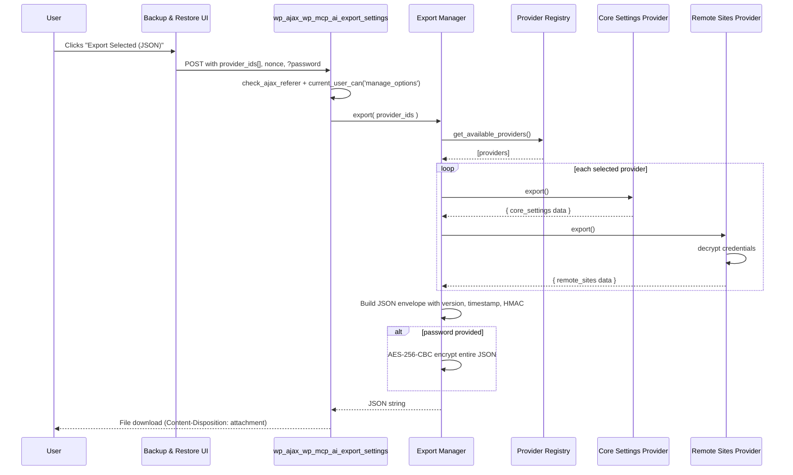
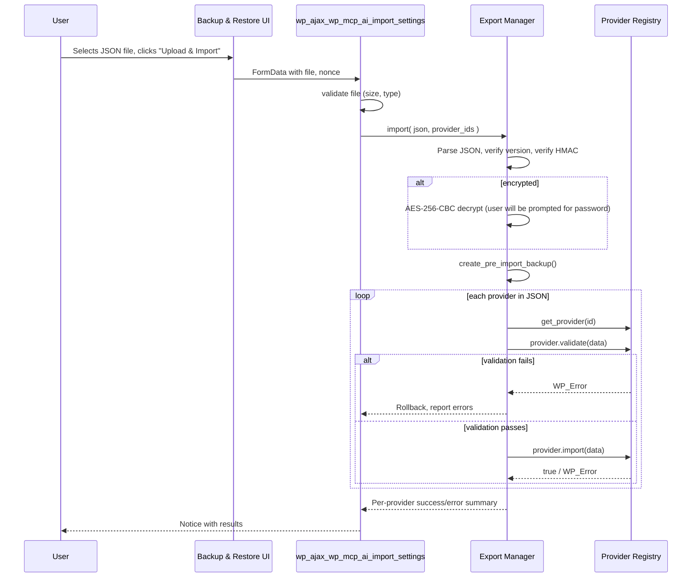

# Comprehensive Backup & Restore — Implementation Plan

**Date:** 2026-08-06 | **Status:** Draft | **Version:** 1.0
**Related:** [`020-comprehensive-backup-restore-proposal.md`](020-comprehensive-backup-restore-proposal.md)

---

## 1. Research Synthesis: WordPress Backup Patterns

### 1.1 Industry Standards

| Standard / Plugin | Key Pattern | Application to NV oOS |
|---|---|---|
| **WooCommerce Settings Export/Import Wizard** | Selective export by settings group; import with collision handling | Provider checkboxes with per-domain granularity |
| **Customizer Export/Import** | Single JSON file with version, timestamp, theme metadata | JSON envelope with `version`, `exported_at`, `plugin_version` |
| **All-in-One WP Migration** | Chunked streaming for large exports; progress bar | Chunked AJAX for tables > 10K rows |
| **WP All Export** | Filterable field selection; drag-drop column ordering | Provider-level checkboxes; `get_count()` badges |
| **UpdraftPlus** | Pre-backup snapshot; incremental backup support | Mandatory pre-import backup to `wp_mcp_ai_settings_backup_pre_import_{timestamp}` |
| **BackWPup** | Archive format with manifest; restore validation | JSON with per-provider `version` fields; `validate()` before commit |
| **WordPress Core Exporter** | WXR format with namespace extensibility | Hook `wp_mcp_ai_register_export_providers` for addon registration |
| **WooCommerce Blueprints** | Portable JSON store config; re-activation on import | License provider exports keys; import re-validates activation |

### 1.2 WordPress-Specific Rules

| Rule | Source | Implementation |
|---|---|---|
| Use `wp_json_encode()` not `json_encode()` | WPCS | All export serialization |
| Capability check: `manage_options` for export/import | WP Core pattern | Both AJAX handlers |
| Nonce: `wp-mcp-ai-dashboard` | Existing convention | Reuse existing nonce action |
| File upload: `wp_check_filetype()` + size limit | WP upload security | Import file validation |
| `wp_send_json_error()` / `wp_send_json_success()` | WP AJAX pattern | All AJAX responses |
| `wp_cache_delete()` before reading options | Existing plugin pattern | Pre-export cache invalidation |
| Sanitize at entry, escape at exit | Existing plugin P0 rule | Provider `import()` and UI rendering |

### 1.3 Sensitive Data Handling — Industry Consensus

| Principle | Source | Implementation |
|---|---|---|
| Never export plaintext secrets without explicit user consent | OWASP, WooCommerce Blueprints | `contains_sensitive_data()` flag + UI warning |
| Offer passphrase-based encryption for export files | Customizer Export/Import, WP Migrate DB Pro | Optional AES-256-CBC password field |
| Re-encrypt on import with target site's key | WooCommerce Settings Wizard | Remote Sites provider decrypts → imports → re-encrypts |
| Mask secrets in UI previews | WordPress password fields | `MASKED_SECRET_PLACEHOLDER` constant already exists |
| HMAC signature to detect tampering | JWT, WP REST API nonces | `hash_hmac('sha256', $payload, wp_salt())` |

---

## 2. Architecture: Component Design

### 2.1 Class Diagram

```
WP_MCP_AI_Export_Provider              (interface)
  ▲
  ├── WP_MCP_AI_Export_Provider_Base   (abstract base)
  │     ▲
  │     ├── WP_MCP_AI_Export_Provider_Core_Settings
  │     ├── WP_MCP_AI_Export_Provider_Toolkit_Options
  │     ├── WP_MCP_AI_Export_Provider_Addon_Options
  │     ├── WP_MCP_AI_Export_Provider_Assistants
  │     ├── WP_MCP_AI_Export_Provider_CPTs
  │     ├── WP_MCP_AI_Export_Provider_Custom_Tables
  │     ├── WP_MCP_AI_Export_Provider_Federation
  │     ├── WP_MCP_AI_Export_Provider_Remote_Sites     (Pro)
  │     ├── WP_MCP_AI_Export_Provider_License           (Pro)
  │     ├── WP_MCP_AI_Export_Provider_JetEngine_CCTs   (Pro, conditional)
  │     └── NV_oOS_Graphify_Export_Provider            (Graphify addon)
  │
  └── (future addon providers)

WP_MCP_AI_Export_Manager              (orchestrator)
  ├── register( provider )
  ├── get_available_providers()
  ├── export( provider_ids )
  ├── import( json, provider_ids )
  └── create_pre_import_backup()
```

### 2.2 Data Flow — Export



### 2.3 Data Flow — Import



---

## 3. File Manifest

### 3.1 New Files

| # | File Path | Purpose |
|---|---|---|
| 1 | `includes/admin/export/interface-wp-mcp-ai-export-provider.php` | Provider contract |
| 2 | `includes/admin/export/class-wp-mcp-ai-export-provider-base.php` | Abstract base with shared logic |
| 3 | `includes/admin/export/class-wp-mcp-ai-export-manager.php` | Orchestrator: registration, export, import |
| 4 | `includes/admin/export/class-wp-mcp-ai-export-provider-core-settings.php` | Refactors existing export into provider |
| 5 | `includes/admin/export/class-wp-mcp-ai-export-provider-toolkit-options.php` | Auto-scans `wp_mcp_ai_*_toolkit_settings` |
| 6 | `includes/admin/export/class-wp-mcp-ai-export-provider-addon-options.php` | Auto-scans `nvoos_*_settings`, WebChat, WebLLM |
| 7 | `includes/admin/export/class-wp-mcp-ai-export-provider-assistants.php` | `mcp_ai_assistant` CPT + post meta |
| 8 | `includes/admin/export/class-wp-mcp-ai-export-provider-cpts.php` | Tasks, vault, audit CPTs |
| 9 | `includes/admin/export/class-wp-mcp-ai-export-provider-custom-tables.php` | Embeddings, threads, tenants, jobs |
| 10 | `includes/admin/export/class-wp-mcp-ai-export-provider-federation.php` | Federation peers, MCP connections |
| 11 | `addons/pro/includes/export/class-wp-mcp-ai-export-provider-remote-sites.php` | **Remote Sites — user's primary ask** |
| 12 | `addons/pro/includes/export/class-wp-mcp-ai-export-provider-license.php` | Pro license keys |
| 13 | `addons/pro/includes/export/class-wp-mcp-ai-export-provider-jetengine-ccts.php` | JetEngine CCT data (conditional) |
| 14 | `addons/graphify/includes/export/class-nvoos-graphify-export-provider.php` | Graphify knowledge graph tables |
| 15 | `includes/admin/export/README.md` | Provider authoring guide for addon developers |
| 16 | `tests/test-export-manager.php` | Unit tests for Export Manager |
| 17 | `tests/test-export-provider-core-settings.php` | Unit tests for Core Settings provider |
| 18 | `tests/test-export-provider-remote-sites.php` | Unit tests for Remote Sites provider |
| 19 | `tests/test-export-import-roundtrip.php` | Integration: export → import round-trip |

### 3.2 Modified Files

| # | File Path | Change |
|---|---|---|
| 1 | `includes/admin/class-wp-mcp-ai-settings-dashboard.php` | Replace `handle_export_settings()` and `handle_import_settings()` with delegating wrappers; add `handle_export_providers_list()` AJAX for UI population |
| 2 | `includes/admin/sections/class-wp-mcp-ai-section-advanced.php` | Replace static Backup & Restore card with provider-checkbox UI; add password field; add JavaScript for dynamic provider list |
| 3 | `includes/admin/class-wp-mcp-ai-admin-settings-base.php` | Add `encrypt_export()` / `decrypt_export()` static helpers (reuse existing AES-256-CBC from Remote Site Manager) |
| 4 | `includes/class-wp-mcp-ai-plugin.php` or main bootstrap | Fire `wp_mcp_ai_register_export_providers` action on `admin_init` |
| 5 | `addons/pro/nvoos-pro.php` | Register Pro-specific providers on the hook |
| 6 | `addons/graphify/nvoos-graphify.php` | Register Graphify provider on the hook |

---

## 4. Detailed Implementation Steps

### Step 1: Provider Interface (`includes/admin/export/interface-wp-mcp-ai-export-provider.php`)

```php
<?php
/**
 * Export Provider Interface.
 *
 * Every data domain that wishes to participate in Backup & Restore
 * must implement this contract.
 *
 * @package WP_MCP_AI
 * @since   1.2.0
 */

interface WP_MCP_AI_Export_Provider {

    /**
     * Unique provider identifier (kebab-case).
     *
     * @return string e.g. 'core_settings', 'remote_sites', 'assistants'.
     */
    public function get_id(): string;

    /**
     * Human-readable label for the UI checkbox.
     *
     * @return string e.g. 'Remote Sites'.
     */
    public function get_label(): string;

    /**
     * Description shown beneath the checkbox in the UI.
     *
     * @return string
     */
    public function get_description(): string;

    /**
     * Whether this provider is available on the current site.
     *
     * @return bool False if a dependency is missing (e.g., Pro not active).
     */
    public function is_available(): bool;

    /**
     * Whether the exported data contains sensitive values
     * (API keys, tokens, passwords). Triggers UI warning.
     *
     * @return bool
     */
    public function contains_sensitive_data(): bool;

    /**
     * Approximate count of items for the UI badge.
     *
     * @return int e.g. 3 for "3 connections", 7 for "7 assistants".
     */
    public function get_count(): int;

    /**
     * Export all data owned by this provider.
     *
     * @return array Associative array of export data.
     */
    public function export(): array;

    /**
     * Dry-run validation before committing an import.
     *
     * @param array $data The data section for this provider from the JSON.
     * @return true|\WP_Error True if valid, WP_Error with specific failures.
     */
    public function validate( array $data );

    /**
     * Import data into the current site.
     *
     * @param array $data The data section for this provider from the JSON.
     * @return true|\WP_Error True on success, WP_Error on failure.
     */
    public function import( array $data );
}
```

### Step 2: Abstract Base (`includes/admin/export/class-wp-mcp-ai-export-provider-base.php`)

Provides shared utilities:
- `get_option_safe( $name, $default )` — cache-busted option read
- `update_option_safe( $name, $value )` — with auto-backup
- `maybe_decrypt_value( $value )` — delegates to `WP_MCP_AI_Admin_Settings_Base::maybe_decrypt_sensitive_setting_value()`
- `maybe_encrypt_value( $value )` — delegates to encryption service
- `log_import( $provider_id, $action, $result )` — audit trail

### Step 3: Export Manager (`includes/admin/export/class-wp-mcp-ai-export-manager.php`)

```php
class WP_MCP_AI_Export_Manager {

    /** @var WP_MCP_AI_Export_Provider[] */
    private $providers = array();

    /** @var self|null */
    private static $instance = null;

    const EXPORT_VERSION = '2.0';
    const BACKUP_PREFIX  = 'wp_mcp_ai_settings_backup_pre_import_';

    /**
     * Register a provider. Idempotent — overwrites existing with same ID.
     */
    public function register( WP_MCP_AI_Export_Provider $provider ): void {
        $this->providers[ $provider->get_id() ] = $provider;
    }

    /**
     * Get all registered providers (including unavailable ones).
     */
    public function get_providers(): array {
        return $this->providers;
    }

    /**
     * Get only available providers, sorted by label.
     */
    public function get_available_providers(): array {
        $available = array_filter( $this->providers, function ( $p ) {
            return $p->is_available();
        } );
        uasort( $available, function ( $a, $b ) {
            return strcmp( $a->get_label(), $b->get_label() );
        } );
        return $available;
    }

    /**
     * Get a single provider by ID.
     */
    public function get_provider( string $id ): ?WP_MCP_AI_Export_Provider {
        return $this->providers[ $id ] ?? null;
    }

    /**
     * Export selected providers to JSON string.
     *
     * @param string[] $provider_ids Provider IDs to export. Empty = all available.
     * @param string   $password     Optional passphrase for AES-256-CBC encryption.
     * @return string JSON.
     */
    public function export( array $provider_ids = array(), string $password = '' ): string { ... }

    /**
     * Import from a JSON string.
     *
     * @param string   $json         Raw JSON content.
     * @param string[] $provider_ids Provider IDs to import. Empty = all in file.
     * @param string   $password     Passphrase if file is encrypted.
     * @return array{ success: array, errors: array } Per-provider results.
     */
    public function import( string $json, array $provider_ids = array(), string $password = '' ): array { ... }

    /**
     * Create a pre-import backup of current state.
     *
     * @return string Backup option key.
     */
    public function create_pre_import_backup(): string { ... }

    /**
     * Build the JSON envelope.
     */
    private function build_envelope( array $providers_data, bool $encrypted ): array { ... }

    /**
     * Validate and parse the JSON envelope.
     */
    private function parse_envelope( string $json ): array|\WP_Error { ... }

    /**
     * Compute HMAC-SHA256 signature.
     */
    private function compute_signature( array $providers_data ): string { ... }

    /**
     * AES-256-CBC encrypt a string with a passphrase.
     */
    private function encrypt_string( string $plaintext, string $passphrase ): string { ... }

    /**
     * AES-256-CBC decrypt a string with a passphrase.
     */
    private function decrypt_string( string $ciphertext, string $passphrase ): string|\WP_Error { ... }
}
```

### Step 4: Core Settings Provider (refactors existing code)

File: `includes/admin/export/class-wp-mcp-ai-export-provider-core-settings.php`

- `export()`: Calls `WP_MCP_AI_Admin_Settings::get_settings()` (identical to current `handle_export_settings()`)
- `import()`: Merges imported settings with defaults, preserves credentials encryption (identical to current `handle_import_settings()`)
- `contains_sensitive_data()`: `true`
- `get_count()`: `count( WP_MCP_AI_Admin_Settings::get_settings() )`

**This provider replaces the monolithic export/import in `class-wp-mcp-ai-settings-dashboard.php`.** The old `handle_export_settings()` and `handle_import_settings()` become thin wrappers:

```php
public function handle_export_settings() {
    check_ajax_referer( 'wp-mcp-ai-dashboard', 'nonce' );
    if ( ! current_user_can( 'manage_options' ) ) {
        wp_send_json_error( ... );
    }
    $manager = WP_MCP_AI_Export_Manager::instance();
    $json    = $manager->export( array( 'core_settings' ) );
    // ... send download headers, echo $json, exit
}
```

### Step 5: Remote Sites Provider (user's primary ask)

File: `addons/pro/includes/export/class-wp-mcp-ai-export-provider-remote-sites.php`

```php
class WP_MCP_AI_Export_Provider_Remote_Sites extends WP_MCP_AI_Export_Provider_Base {

    public function get_id(): string {
        return 'remote_sites';
    }

    public function get_label(): string {
        return __( 'Remote Sites', 'mcp-ai-wpoos-pro' );
    }

    public function get_description(): string {
        return __( 'All external service connections: Telegram, Discord, WordPress remotes, Shopify, Gmail, Upwork, and more.', 'mcp-ai-wpoos-pro' );
    }

    public function is_available(): bool {
        return class_exists( 'WP_MCP_AI_Pro_Remote_Site_Manager' );
    }

    public function contains_sensitive_data(): bool {
        return true; // API keys, bot tokens, OAuth secrets
    }

    public function get_count(): int {
        if ( ! $this->is_available() ) {
            return 0;
        }
        $connections = WP_MCP_AI_Pro_Remote_Site_Manager::get_all_connections();
        return count( $connections );
    }

    public function export(): array {
        $connections = WP_MCP_AI_Pro_Remote_Site_Manager::get_all_connections();

        // Decrypt all credential values for portable export.
        foreach ( $connections as $id => &$connection ) {
            foreach ( $connection as $key => $value ) {
                if ( WP_MCP_AI_Pro_Remote_Site_Manager::is_credential_field( $key ) ) {
                    $connection[ $key ] = WP_MCP_AI_Pro_Remote_Site_Manager::decrypt_value( $value );
                }
            }
        }
        unset( $connection );

        return array(
            'connections' => $connections,
            'count'       => count( $connections ),
        );
    }

    public function validate( array $data ) {
        if ( ! isset( $data['connections'] ) || ! is_array( $data['connections'] ) ) {
            return new WP_Error( 'invalid_format', __( 'Invalid remote sites data format.', 'mcp-ai-wpoos-pro' ) );
        }
        // Validate each connection has required fields.
        foreach ( $data['connections'] as $id => $conn ) {
            if ( empty( $conn['connection_type'] ) ) {
                return new WP_Error(
                    'missing_type',
                    sprintf( __( 'Connection "%s" missing type.', 'mcp-ai-wpoos-pro' ), $id )
                );
            }
        }
        return true;
    }

    public function import( array $data ) {
        $existing = WP_MCP_AI_Pro_Remote_Site_Manager::get_all_connections();

        foreach ( $data['connections'] as $id => $connection ) {
            // Re-encrypt credential fields with target site's encryption key.
            foreach ( $connection as $key => $value ) {
                if ( WP_MCP_AI_Pro_Remote_Site_Manager::is_credential_field( $key ) ) {
                    $connection[ $key ] = WP_MCP_AI_Pro_Remote_Site_Manager::encrypt_value( $value );
                }
            }

            // Merge: overwrite existing, add new.
            $existing[ $id ] = $connection;
        }

        update_option(
            WP_MCP_AI_Pro_Remote_Site_Manager::OPTION_NAME,
            $existing,
            false // No autoload — connections can be large.
        );

        return true;
    }
}
```

**Security note on `is_credential_field()`:** This static method needs to be added to `WP_MCP_AI_Pro_Remote_Site_Manager` to identify which fields in a connection array contain secrets:

```php
// Field names that contain secrets and need decrypt/encrypt handling.
const CREDENTIAL_FIELDS = array(
    'api_key', 'api_secret', 'client_secret', 'bot_token',
    'password', 'access_token', 'access_token_secret',
    'refresh_token', 'webhook_secret', 'private_key',
    'mesh_inbound_api_key', 'consumer_key', 'consumer_secret',
    'app_password', 'auth_code', 'bearer_token',
);

public static function is_credential_field( string $key ): bool {
    return in_array( $key, self::CREDENTIAL_FIELDS, true );
}
```

### Step 6: Toolkit Options Scanner Provider

File: `includes/admin/export/class-wp-mcp-ai-export-provider-toolkit-options.php`

```php
class WP_MCP_AI_Export_Provider_Toolkit_Options extends WP_MCP_AI_Export_Provider_Base {

    public function get_id(): string {
        return 'toolkit_options';
    }

    public function is_available(): bool {
        return true; // Always available — scans wp_options.
    }

    public function get_count(): int {
        return count( $this->get_toolkit_option_names() );
    }

    public function export(): array {
        $data = array();
        foreach ( $this->get_toolkit_option_names() as $option_name ) {
            $value = $this->get_option_safe( $option_name, array() );
            if ( ! empty( $value ) ) {
                $data[ $option_name ] = $value;
            }
        }
        return $data;
    }

    /**
     * Scan wp_options for all plugin toolkit settings.
     */
    private function get_toolkit_option_names(): array {
        global $wpdb;
        // phpcs:ignore WordPress.DB.DirectDatabaseQuery
        $results = $wpdb->get_col(
            $wpdb->prepare(
                "SELECT option_name FROM {$wpdb->options}
                 WHERE option_name LIKE %s
                 AND option_name NOT LIKE %s",
                'wp_mcp_ai_%_toolkit_settings',
                'wp_mcp_ai_%\_%\_%' // Exclude non-toolkit wp_mcp_ai_* options
            )
        );
        return is_array( $results ) ? $results : array();
    }
}
```

### Step 7: Addon Options Scanner Provider

File: `includes/admin/export/class-wp-mcp-ai-export-provider-addon-options.php`

Scans for:
- `nvoos_*_settings` (Algorave, Canvas Toolkit, Chat SPA, Cloudways Dashboard, CDS, Embedded, Graphify, LibreChat, Fantasy Football, Page Agent)
- `wp_mcp_ai_webchat_settings`, `wp_mcp_ai_webchat_default_*`
- `wp_mcp_ai_webllm_settings`
- `wp_mcp_ai_telegram_settings`, `wp_mcp_ai_telegram_mini_app_template`
- `wp_mcp_ai_social_media_settings`
- `wp_mcp_ai_media_settings`
- `wp_mcp_ai_fantasy_football_settings`
- `wp_mcp_ai_pro_schedule_toolkit_settings`
- `wp_mcp_ai_pro_workflows`, `wp_mcp_ai_pro_schedules`
- Operational exclusions (NOT exported): `wp_mcp_ai_recent_*`, `wp_mcp_ai_*_log*`, `wp_mcp_ai_*_jobs`, transients, locks

```php
const ALLOWLIST = array(
    'nvoos_algorave_settings',
    'nvoos_canvas_toolkit_settings',
    'nvoos_chat_spa_settings',
    'nvoos_cloudways_dashboard_settings',
    'nvoos_cds_settings',
    'nvoos_embedded_settings',
    'nvoos_graphify_settings',
    'nvoos_librechat_settings',
    'nvoos_fantasy_football_settings',
    'nvoos_page_agent_confirm_destructive',
    'wp_mcp_ai_webchat_settings',
    'wp_mcp_ai_webchat_default_max_participants',
    'wp_mcp_ai_webchat_default_signaling_server',
    'wp_mcp_ai_webllm_settings',
    'wp_mcp_ai_telegram_settings',
    'wp_mcp_ai_telegram_mini_app_template',
    'wp_mcp_ai_social_media_settings',
    'wp_mcp_ai_media_settings',
    'wp_mcp_ai_fantasy_football_settings',
    'wp_mcp_ai_pro_schedule_toolkit_settings',
    'wp_mcp_ai_pro_workflows',
    'wp_mcp_ai_pro_schedules',
);

const EXCLUDE_PATTERNS = array(
    '/^wp_mcp_ai_recent_/',
    '/_log$/', '/_logs$/', '/_jobs$/',
    '/_transient/', '/_lock/',
    '/_cache/', '/_queue/',
    '/_history/', '/_telemetry/',
    '/_migration_/', '/_migrated/',
    '/_seeded$/', '/_synced$/',
);
```

### Step 8: Assistant CPT Provider

File: `includes/admin/export/class-wp-mcp-ai-export-provider-assistants.php`

```php
class WP_MCP_AI_Export_Provider_Assistants extends WP_MCP_AI_Export_Provider_Base {

    const POST_TYPE = 'mcp_ai_assistant';

    public function get_id(): string {
        return 'assistants';
    }

    public function get_count(): int {
        $counts = wp_count_posts( self::POST_TYPE );
        return (int) ( $counts->publish ?? 0 ) + (int) ( $counts->draft ?? 0 );
    }

    public function export(): array {
        $posts = get_posts( array(
            'post_type'      => self::POST_TYPE,
            'post_status'    => array( 'publish', 'draft', 'pending' ),
            'posts_per_page' => -1,
            'orderby'        => 'ID',
            'order'          => 'ASC',
        ) );

        $data = array();
        foreach ( $posts as $post ) {
            $meta = get_post_meta( $post->ID );
            // Unserialize and clean meta.
            $clean_meta = array();
            foreach ( $meta as $key => $values ) {
                // Skip internal WordPress meta.
                if ( str_starts_with( $key, '_' ) && ! str_starts_with( $key, '_wp_mcp_ai' ) ) {
                    continue;
                }
                $clean_meta[ $key ] = array_map( 'maybe_unserialize', $values );
            }

            $data[] = array(
                'post_title'   => $post->post_title,
                'post_name'    => $post->post_name,
                'post_excerpt' => $post->post_excerpt,
                'post_content' => $post->post_content,
                'post_status'  => $post->post_status,
                'post_type'    => $post->post_type,
                'meta'         => $clean_meta,
            );
        }

        return array(
            'posts' => $data,
            'count' => count( $data ),
        );
    }

    public function validate( array $data ) {
        if ( ! isset( $data['posts'] ) || ! is_array( $data['posts'] ) ) {
            return new WP_Error( 'invalid_format', __( 'Invalid assistants data format.', 'mcp-ai-wpoos' ) );
        }
        foreach ( $data['posts'] as $i => $post ) {
            if ( empty( $post['post_title'] ) ) {
                return new WP_Error(
                    'missing_title',
                    sprintf( __( 'Assistant #%d missing title.', 'mcp-ai-wpoos' ), $i + 1 )
                );
            }
        }
        return true;
    }

    public function import( array $data ) {
        $results = array(
            'created' => 0,
            'updated' => 0,
            'skipped' => 0,
            'errors'  => array(),
        );

        foreach ( $data['posts'] as $post_data ) {
            // Check if assistant with this slug already exists.
            $existing = get_page_by_path( $post_data['post_name'], OBJECT, self::POST_TYPE );

            $post_arr = array(
                'post_title'   => $post_data['post_title'],
                'post_name'    => $post_data['post_name'],
                'post_excerpt' => $post_data['post_excerpt'] ?? '',
                'post_content' => $post_data['post_content'] ?? '',
                'post_status'  => $post_data['post_status'] ?? 'publish',
                'post_type'    => self::POST_TYPE,
            );

            if ( $existing ) {
                $post_arr['ID'] = $existing->ID;
                $post_id        = wp_update_post( $post_arr, true );
                if ( is_wp_error( $post_id ) ) {
                    $results['errors'][] = $post_id->get_error_message();
                    continue;
                }
                ++$results['updated'];
            } else {
                $post_id = wp_insert_post( $post_arr, true );
                if ( is_wp_error( $post_id ) ) {
                    $results['errors'][] = $post_id->get_error_message();
                    continue;
                }
                ++$results['created'];
            }

            // Import post meta.
            if ( isset( $post_data['meta'] ) && is_array( $post_data['meta'] ) ) {
                foreach ( $post_data['meta'] as $meta_key => $meta_values ) {
                    // Delete existing meta for this key.
                    delete_post_meta( $post_id, $meta_key );
                    foreach ( $meta_values as $meta_value ) {
                        add_post_meta( $post_id, $meta_key, $meta_value );
                    }
                }
            }
        }

        return $results;
    }
}
```

### Step 9: CPTs Provider (Tasks, Vault, Audit)

File: `includes/admin/export/class-wp-mcp-ai-export-provider-cpts.php`

Same pattern as Assistant CPT provider but handles multiple post types:
- `mcp_ai_task`
- `mcp_task_plan`
- `mcp_vault_folder`
- `mcp_vault_item`
- `mcp_ai_audit`
- `mcp_site_template`
- `ai_peer`
- `mcp_test_reg`

Each post type is a subsection in the export data:

```php
public function export(): array {
    $post_types = $this->get_handled_post_types();
    $data = array();
    foreach ( $post_types as $pt ) {
        $data[ $pt ] = $this->export_post_type( $pt );
    }
    return $data;
}
```

### Step 10: Custom Tables Provider

File: `includes/admin/export/class-wp-mcp-ai-export-provider-custom-tables.php`

Handles two tiers:

**Tier 1 — Recommended for backup (checked by default):**
- `wp_mcp_ai_content_embeddings`, `wp_mcp_ai_context_embeddings`, `wp_mcp_ai_tool_embeddings`
- `mcp_ai_tenants`, `mcp_ai_tenant_user_map`
- `mcp_ai_threads`, `mcp_ai_thread_messages`, `mcp_ai_thread_checkpoints`

**Tier 2 — Operational (unchecked by default, high volume):**
- `mcp_ai_audit_trail`, `mcp_ai_slash_command_audit`
- `mcp_ai_qms_audit`, `mcp_ai_compliance_checks`, `mcp_ai_risks`, `mcp_ai_controls`, `mcp_ai_evidence`
- `mcp_ai_eca_attendance`, `mcp_ai_eca_enrollments`
- `mcp_ai_job_queue`, `mcp_ai_events`, `mcp_ai_metric_events`, `mcp_ai_hourly_token_usage`, `mcp_ai_custom_metrics`

Uses chunked export for tables > 5K rows:

```php
private function export_table_chunked( string $table_name, int $chunk_size = 1000 ): array {
    global $wpdb;
    $rows   = array();
    $offset = 0;

    while ( true ) {
        // phpcs:ignore WordPress.DB.DirectDatabaseQuery
        $chunk = $wpdb->get_results(
            $wpdb->prepare(
                "SELECT * FROM {$table_name} LIMIT %d OFFSET %d",
                $chunk_size,
                $offset
            ),
            ARRAY_A
        );
        if ( empty( $chunk ) ) {
            break;
        }
        $rows = array_merge( $rows, $chunk );
        $offset += $chunk_size;

        // Safety: max 100K rows per table.
        if ( $offset >= 100000 ) {
            break;
        }
    }
    return $rows;
}
```

### Step 11: UI Enhancement

File: `includes/admin/sections/class-wp-mcp-ai-section-advanced.php`

**Replace the existing static Backup & Restore card** (line 3813–3856) with a dynamic provider list:

```php
private function render_settings_management() {
    $manager         = WP_MCP_AI_Export_Manager::instance();
    $providers       = $manager->get_available_providers();
    $settings_count  = count( WP_MCP_AI_Admin_Settings::get_settings() );
    // ... backup count as before ...

    ?>
    <div class="wp-mcp-ai-settings-management" style="padding: 20px; max-width: 800px;">

        <!-- ... Settings Health card unchanged ... -->

        <!-- Backup & Restore (enhanced) -->
        <div class="wp-mcp-ai-card" style="...">
            <h4>
                <span class="dashicons dashicons-database-export"></span>
                <?php esc_html_e( 'Backup & Restore', 'mcp-ai-wpoos' ); ?>
            </h4>
            <p>
                <strong><?php esc_html_e( 'Core Settings:', 'mcp-ai-wpoos' ); ?></strong>
                <?php printf( esc_html( _n( '%d field', '%d fields', $settings_count, 'mcp-ai-wpoos' ) ), $settings_count ); ?>
            </p>

            <div id="wp-mcp-ai-export-providers" style="margin: 15px 0;">
                <p><strong><?php esc_html_e( 'Select data to export:', 'mcp-ai-wpoos' ); ?></strong></p>
                <?php foreach ( $providers as $provider ) : ?>
                    <label style="display: block; margin: 8px 0; padding: 8px; background: #f8f9fa; border-radius: 4px;">
                        <input type="checkbox"
                               class="wp-mcp-ai-export-provider-checkbox"
                               value="<?php echo esc_attr( $provider->get_id() ); ?>"
                               <?php checked( in_array( $provider->get_id(), array( 'core_settings' ), true ) ); ?>
                               <?php disabled( ! $provider->is_available() ); ?> />
                        <strong><?php echo esc_html( $provider->get_label() ); ?></strong>
                        <span class="count-badge" style="background: #e0e0e0; padding: 1px 8px; border-radius: 10px; font-size: 12px; margin-left: 6px;">
                            <?php echo esc_html( $provider->get_count() ); ?>
                        </span>
                        <?php if ( $provider->contains_sensitive_data() ) : ?>
                            <span class="dashicons dashicons-warning" style="color: #d63638; vertical-align: middle;"
                                  title="<?php esc_attr_e( 'Contains sensitive data (API keys, tokens). Secure this file.', 'mcp-ai-wpoos' ); ?>"></span>
                        <?php endif; ?>
                        <br>
                        <small style="color: #666;"><?php echo esc_html( $provider->get_description() ); ?></small>
                    </label>
                <?php endforeach; ?>
            </div>

            <!-- Password protection (optional) -->
            <div style="margin: 15px 0;">
                <label>
                    <input type="checkbox" id="wp-mcp-ai-export-encrypt" />
                    <?php esc_html_e( 'Password-protect export file (AES-256-CBC)', 'mcp-ai-wpoos' ); ?>
                </label>
                <input type="password" id="wp-mcp-ai-export-password" class="regular-text"
                       style="display: none; margin-top: 5px;"
                       placeholder="<?php esc_attr_e( 'Enter passphrase...', 'mcp-ai-wpoos' ); ?>" />
            </div>

            <div style="margin: 15px 0;">
                <button type="button" id="wp-mcp-ai-export-settings" class="button button-primary">
                    <span class="dashicons dashicons-download"></span>
                    <?php esc_html_e( 'Export Selected (JSON)', 'mcp-ai-wpoos' ); ?>
                </button>
                <button type="button" id="wp-mcp-ai-export-all" class="button button-secondary">
                    <?php esc_html_e( 'Export All', 'mcp-ai-wpoos' ); ?>
                </button>
            </div>

            <!-- Import section (unchanged structure, enhanced with provider support) -->
            <hr>
            <div style="margin: 15px 0;">
                <label for="wp-mcp-ai-import-file">
                    <span class="dashicons dashicons-upload"></span>
                    <?php esc_html_e( 'Import Settings:', 'mcp-ai-wpoos' ); ?>
                </label>
                <input type="file" id="wp-mcp-ai-import-file" accept=".json,application/json" />
                <input type="password" id="wp-mcp-ai-import-password" class="regular-text"
                       style="display: none; margin-top: 5px;"
                       placeholder="<?php esc_attr_e( 'Decryption passphrase (if file is encrypted)...', 'mcp-ai-wpoos' ); ?>" />
                <button type="button" id="wp-mcp-ai-import-settings" class="button button-secondary" disabled>
                    <?php esc_html_e( 'Upload & Import', 'mcp-ai-wpoos' ); ?>
                </button>
                <p class="description">
                    <?php esc_html_e( 'Import settings from a previously exported JSON file. Current settings will be backed up before import.', 'mcp-ai-wpoos' ); ?>
                </p>
            </div>
        </div>

        <!-- ... Cache Management + Reset sections unchanged ... -->

        <!-- Import Results -->
        <div id="wp-mcp-ai-import-results" style="display: none; margin: 15px 0;"></div>
    </div>
    <?php
    // ... existing JavaScript enhanced for provider selection ...
}
```

**JavaScript enhancements** (added to the existing inline `<script>` block):

```javascript
// Export with provider selection.
$('#wp-mcp-ai-export-settings').on('click', function() {
    var selected = [];
    $('.wp-mcp-ai-export-provider-checkbox:checked').each(function() {
        selected.push($(this).val());
    });
    if (selected.length === 0) {
        alert('Please select at least one data type to export.');
        return;
    }
    var url = ajaxurl + '?action=wp_mcp_ai_export_settings&nonce=' + nonce
        + '&providers=' + selected.join(',');
    if ($('#wp-mcp-ai-export-encrypt').is(':checked')) {
        var pw = $('#wp-mcp-ai-export-password').val();
        if (!pw) {
            alert('Please enter a passphrase for encryption.');
            return;
        }
        url += '&password=' + encodeURIComponent(pw);
    }
    window.location.href = url;
});

// Toggle password field.
$('#wp-mcp-ai-export-encrypt').on('change', function() {
    $('#wp-mcp-ai-export-password').toggle(this.checked);
});

// Show password field on import if file might be encrypted.
$('#wp-mcp-ai-import-file').on('change', function() {
    $('#wp-mcp-ai-import-password').show();
    $('#wp-mcp-ai-import-settings').prop('disabled', !this.files.length);
});

// Import with password support.
$('#wp-mcp-ai-import-settings').on('click', function() {
    // ... existing import logic enhanced to pass password ...
    var pw = $('#wp-mcp-ai-import-password').val();
    if (pw) {
        formData.append('password', pw);
    }
    // ... rest of existing import logic ...
});
```

### Step 12: Hook Registration Point

In `includes/class-wp-mcp-ai-plugin.php` (or wherever `admin_init` is handled):

```php
add_action( 'admin_init', function () {
    if ( ! current_user_can( 'manage_options' ) ) {
        return;
    }

    $manager = WP_MCP_AI_Export_Manager::instance();

    // Core providers (always available).
    $manager->register( new WP_MCP_AI_Export_Provider_Core_Settings() );
    $manager->register( new WP_MCP_AI_Export_Provider_Toolkit_Options() );
    $manager->register( new WP_MCP_AI_Export_Provider_Addon_Options() );
    $manager->register( new WP_MCP_AI_Export_Provider_Assistants() );
    $manager->register( new WP_MCP_AI_Export_Provider_CPTs() );
    $manager->register( new WP_MCP_AI_Export_Provider_Custom_Tables() );
    $manager->register( new WP_MCP_AI_Export_Provider_Federation() );

    // Allow addons to register their own providers.
    do_action( 'wp_mcp_ai_register_export_providers', $manager );
}, 20 ); // After plugins_loaded, before UI renders.
```

In `addons/pro/nvoos-pro.php`:

```php
add_action( 'wp_mcp_ai_register_export_providers', function ( $manager ) {
    $manager->register( new WP_MCP_AI_Export_Provider_Remote_Sites() );
    $manager->register( new WP_MCP_AI_Export_Provider_License() );

    if ( class_exists( 'Jet_Engine' ) ) {
        $manager->register( new WP_MCP_AI_Export_Provider_JetEngine_CCTs() );
    }
} );
```

In `addons/graphify/nvoos-graphify.php`:

```php
add_action( 'wp_mcp_ai_register_export_providers', function ( $manager ) {
    $manager->register( new NV_oOS_Graphify_Export_Provider() );
} );
```

### Step 13: Additional Method on Remote Site Manager

In `addons/pro/includes/class-wp-mcp-ai-pro-remote-site-manager.php`, add:

```php
/**
 * Fields within a connection array that contain secrets.
 *
 * Used by the export/import provider to identify which values
 * need decryption on export and re-encryption on import.
 *
 * @since 1.2.0
 * @var array<string>
 */
const CREDENTIAL_FIELDS = array(
    'api_key',
    'api_secret',
    'client_secret',
    'bot_token',
    'password',
    'access_token',
    'access_token_secret',
    'refresh_token',
    'webhook_secret',
    'private_key',
    'mesh_inbound_api_key',
    'consumer_key',
    'consumer_secret',
    'app_password',
    'auth_code',
    'bearer_token',
    'signing_secret',
    'public_key',
    'encryption_key',
);

/**
 * Check whether a connection field name is a credential field.
 *
 * @since 1.2.0
 *
 * @param string $field_name Field key within a connection array.
 * @return bool
 */
public static function is_credential_field( string $field_name ): bool {
    return in_array( $field_name, self::CREDENTIAL_FIELDS, true );
}
```

---

## 5. Filter & Action Hooks

```php
/**
 * Fires when export providers are being registered.
 *
 * Addons should hook here to register their providers.
 *
 * @since 1.2.0
 *
 * @param WP_MCP_AI_Export_Manager $manager The export manager instance.
 */
do_action( 'wp_mcp_ai_register_export_providers', $manager );

/**
 * Filters the list of providers shown in the Backup & Restore UI.
 *
 * Use to hide providers that shouldn't be user-selectable.
 *
 * @since 1.2.0
 *
 * @param WP_MCP_AI_Export_Provider[] $providers Available providers.
 * @return WP_MCP_AI_Export_Provider[]
 */
apply_filters( 'wp_mcp_ai_export_visible_providers', $providers );

/**
 * Filters export data for a provider before serialization.
 *
 * Use to redact specific fields from the export.
 *
 * @since 1.2.0
 *
 * @param array  $data        The export data array.
 * @param string $provider_id The provider identifier.
 * @return array
 */
apply_filters( 'wp_mcp_ai_export_data', $data, $provider_id );

/**
 * Filters import data for a provider before validation.
 *
 * Use to transform data from older export formats.
 *
 * @since 1.2.0
 *
 * @param array  $data        The import data array.
 * @param string $provider_id The provider identifier.
 * @return array
 */
apply_filters( 'wp_mcp_ai_import_data', $data, $provider_id );

/**
 * Fires after a successful import for a provider.
 *
 * Use to clear caches, rebuild indexes, or trigger side effects.
 *
 * @since 1.2.0
 *
 * @param string $provider_id  The provider identifier.
 * @param array  $imported_data The data that was imported.
 */
do_action( 'wp_mcp_ai_after_import', $provider_id, $imported_data );
```

---

## 6. Testing Strategy

### 6.1 Unit Tests

**`tests/test-export-manager.php`**
- `test_register_provider()` — provider appears in `get_providers()`
- `test_register_duplicate_id()` — second registration overwrites first
- `test_get_available_providers_excludes_unavailable()`
- `test_export_no_providers()` — returns valid JSON envelope with empty providers
- `test_export_with_providers()` — each provider's `export()` is called
- `test_import_valid_json()` — each provider's `validate()` and `import()` called
- `test_import_invalid_json()` — returns error
- `test_import_version_mismatch()` — rejects v1 format gracefully
- `test_import_hmac_invalid()` — tampered file rejected
- `test_create_pre_import_backup()` — backup option created, contains current data
- `test_encrypt_decrypt_roundtrip()` — password encrypt → decrypt returns original
- `test_encrypt_wrong_password()` — decrypt with wrong password returns WP_Error

**`tests/test-export-provider-core-settings.php`**
- `test_export_returns_settings_array()`
- `test_export_includes_credentials()`
- `test_export_has_expected_keys()`
- `test_import_merges_with_defaults()`
- `test_import_preserves_existing_when_key_absent()`
- `test_validate_accepts_valid_data()`
- `test_validate_rejects_incorrect_structure()`

**`tests/test-export-provider-remote-sites.php`**
- `test_export_decrypts_credentials()`
- `test_export_marks_sensitive()`
- `test_import_encrypts_credentials()`
- `test_import_merges_with_existing()`
- `test_validate_rejects_missing_type()`
- `test_is_available_false_without_pro()`

### 6.2 Integration Tests

**`tests/test-export-import-roundtrip.php`**
- `test_core_settings_roundtrip()` — export → import → settings identical
- `test_remote_sites_roundtrip()` — export → import → connections identical
- `test_assistants_roundtrip()` — export → import → posts + meta identical
- `test_cross_provider_isolation()` — importing core_settings doesn't affect remote_sites
- `test_pre_import_backup_created_on_import()`

### 6.3 Manual QA Checklist

- [ ] Export "Core Settings" only → file contains only `core_settings` provider data
- [ ] Export "Remote Sites" only → file contains decrypted connections; import restores them
- [ ] Export "All" → file contains all providers; all data sections present
- [ ] Password-protected export → file is not human-readable; import with password succeeds
- [ ] Import with wrong password → error message, nothing changed
- [ ] Import on fresh site → all data restored correctly
- [ ] Import on site with existing data → existing preserved, new merged
- [ ] Tampered JSON file → HMAC validation fails, import rejected
- [ ] Pre-import backup → option created before any import
- [ ] Browser file download works for small and large exports
- [ ] UI checkboxes show/hide correctly; counts update
- [ ] JetEngine CCT provider appears only when JetEngine is active
- [ ] Remote Sites provider hidden when Pro is not active

---

## 7. Migration Path: Backward Compatibility

### 7.1 Old Export Format (v1)

Current exports have format:
```json
{
    "version": "1.0",
    "exported_at": "...",
    "settings": { ... }
}
```

The Export Manager's `parse_envelope()` detects `version: "1.0"` and **auto-wraps** it:
```json
{
    "version": "1.0",
    "exported_at": "...",
    "providers": {
        "core_settings": {
            "label": "Core Settings",
            "version": 1,
            "data": { ... original settings ... }
        }
    }
}
```

This means old export files are still importable — they just only restore core settings (which is exactly what the old behavior was).

### 7.2 Direct AJAX URL (legacy)

The existing export URL pattern `ajaxurl?action=wp_mcp_ai_export_settings&nonce=...` continues to work — it now delegates to `$manager->export(['core_settings'])` internally, producing identical output.

---

## 8. Rollout Strategy

| Phase | Deliverable | Milestone |
|---|---|---|
| **Phase 1** | Provider interface, abstract base, Export Manager, Core Settings provider (refactor) | Core settings export/import unchanged but now via manager |
| **Phase 2** | Toolbox Options, Addon Options, Assistants, CPTs, Custom Tables providers | Export includes more than just core settings |
| **Phase 3** | Remote Sites provider + encryption helpers on Remote Site Manager | **User's primary ask satisfied** |
| **Phase 4** | UI enhancement (checkboxes, counts, warnings, password field) | Users can select what to export |
| **Phase 5** | Pro License, JetEngine CCT, Graphify, Federation providers | Complete coverage |
| **Phase 6** | HMAC signing, password encryption, import validation | Security hardening |
| **Phase 7** | PHPUnit tests, QA checklist | Ready for release |
