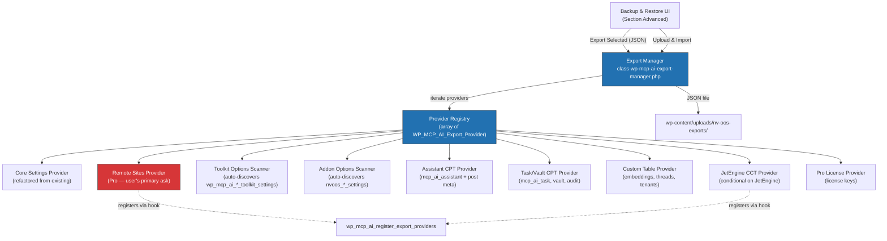

# Comprehensive Backup & Restore — Architectural Proposal

**Date:** 2026-08-06
**Status:** Draft
**Author:** AI Agent (architectural analysis)
**Version:** 1.0

---

## 1. Executive Summary

The NV oOS plugin's **Settings Management** page (`admin.php?page=wp-mcp-ai-dashboard&tab=advanced&subtab=settings_management`) provides a Backup & Restore feature that currently exports only **two** WordPress options: `wp_mcp_ai_settings` (~469 fields) and `wp_mcp_ai_credentials`. This leaves **~120+ other plugin-owned options, ~9 custom database tables, ~8 custom post types with post meta, and the entire Remote Sites connection registry** completely un-backed-up.

**The problem:** A site administrator who exports "settings" and restores them onto a new site loses every remote connection (Telegram bots, Discord, WooCommerce remotes, Gmail OAuth, Shopify, Upwork, LinkedIn, etc.), all assistant configurations (CPT posts), all knowledge graph data, all thread/message history, and all toolkit-specific settings.

**The recommendation:** Replace the monolithic JSON export with a **modular Export Provider Registry** where each data domain self-registers its own export/import logic. This mirrors the existing tool registry pattern and allows addons, toolkits, and Pro features to opt into backup coverage without modifying core export code.

---

## 2. Problem Statement

### 2.1 Current State

```
Backup & Restore exports:
  └── wp_mcp_ai_settings (merged with wp_mcp_ai_credentials)
```

### 2.2 What Is NOT Backed Up

| Data Domain | Storage Mechanism | Approx. Count | Backup Criticality |
|---|---|---|---|
| **Remote Sites** (user's primary concern) | `wp_mcp_ai_pro_remote_sites` option | 1–50 connections | **CRITICAL** — contains encrypted API keys, bot tokens, OAuth credentials |
| **Toolkit settings** | Scattered `wp_mcp_ai_*_toolkit_settings` options | ~15 options | **HIGH** — EZuite, Flowhub, Shopify, Media, Calendar, Chat Channels, Ecommerce, etc. |
| **Addon settings** | `nvoos_*` and `wp_mcp_ai_webchat/weblm_*` options | ~12 options | **HIGH** — Graphify, WebChat, WebLLM, Algorave, Fantasy Football, etc. |
| **Assistant CPT** | `mcp_ai_assistant` posts + post meta | 1–100 posts | **HIGH** — system prompts, tool assignments, model configs |
| **Task/Vault/Audit CPTs** | `mcp_ai_task`, `mcp_vault_*`, `mcp_ai_audit` posts | 0–10,000 posts | **MEDIUM** — task plans, vault items, audit records |
| **Custom DB tables** | Embeddings, threads, graph, tenants, jobs, metrics | ~16 tables | **LOW–MEDIUM** — large but rebuildable |
| **JetEngine CCTs** | `jet_cct_ai_*` tables (conditional on JetEngine) | ~6 CCTs | **MEDIUM** — chat transcripts, memories, contacts |
| **Pro license data** | `wp_mcp_ai_pro_license_*` options | ~4 options | **LOW** — re-activatable |
| **Federation/MCP** | `wp_mcp_ai_federation_peers`, `wp_mcp_ai_mcp_connections` | ~2 options | **MEDIUM** |

### 2.3 User Impact

A site administrator migrating or restoring from backup today would need to:
1. Manually re-create every remote site connection (re-entering API keys, bot tokens)
2. Re-configure every toolkit's settings
3. Re-create every AI assistant from scratch
4. Lose all thread/message history
5. Lose all knowledge graph data (Graphify)
6. Lose all embeddings (expensive to regenerate)

---

## 3. Design Principles

Based on research of industry-standard WordPress backup patterns (WooCommerce Settings Export/Import Wizard, Customizer Export/Import, All-in-One WP Migration, WP All Export, UpdraftPlus, BackWPup):

| Principle | Description |
|---|---|
| **Modular providers** | Each data domain is a self-contained class implementing `WP_MCP_AI_Export_Provider` |
| **Opt-in, not opt-out** | Only explicitly registered providers appear; nothing is auto-discovered without registration |
| **Selective export** | Users choose which domains to include via checkboxes in the UI |
| **Portable JSON** | Single `.json` file with version metadata, site URL, export timestamp, and per-provider data sections |
| **Pre-import backup** | Always snapshot current state before applying any import |
| **Sensitive field handling** | Providers declare which fields contain secrets; UI warns and optionally password-encrypts the export |
| **Validation layer** | Schema version check + per-provider dry-run validation before commit |
| **Hook-based extensibility** | Addons register via `wp_mcp_ai_register_export_providers` action — no core code changes needed |

---

## 4. Architecture

### 4.1 System Diagram



### 4.2 Provider Interface

```php
interface WP_MCP_AI_Export_Provider {
    /**
     * Unique provider ID (e.g. 'core_settings', 'remote_sites').
     */
    public function get_id(): string;

    /**
     * Human-readable label for the UI checkbox (e.g. 'Remote Sites').
     */
    public function get_label(): string;

    /**
     * Description shown beneath the checkbox.
     */
    public function get_description(): string;

    /**
     * Whether this provider is available on this site
     * (e.g., Remote Sites requires Pro; JetEngine CCT requires JetEngine).
     */
    public function is_available(): bool;

    /**
     * Whether this provider's export contains sensitive data
     * (credentials, API keys). Triggers UI warning.
     */
    public function contains_sensitive_data(): bool;

    /**
     * Approximate item count for the UI badge (e.g. "3 connections").
     */
    public function get_count(): int;

    /**
     * Export data as an associative array.
     */
    public function export(): array;

    /**
     * Import data from an associative array.
     * Must return true on success or WP_Error on failure.
     */
    public function import( array $data ): bool|\WP_Error;

    /**
     * Dry-run validation: check data structure before committing.
     * Return true or WP_Error with specific validation failures.
     */
    public function validate( array $data ): bool|\WP_Error;
}
```

### 4.3 Export Manager

```php
class WP_MCP_AI_Export_Manager {
    /** @var WP_MCP_AI_Export_Provider[] */
    private array $providers = [];

    public function register( WP_MCP_AI_Export_Provider $provider ): void;
    public function get_providers(): array;
    public function get_available_providers(): array;
    public function get_provider( string $id ): ?WP_MCP_AI_Export_Provider;

    /**
     * Export selected providers to a JSON string.
     */
    public function export( array $provider_ids = [] ): string;

    /**
     * Import from a JSON string. Returns per-provider results.
     */
    public function import( string $json, array $provider_ids = [] ): array;

    /**
     * Create a pre-import backup of current state.
     */
    public function create_pre_import_backup(): string; // Returns backup key
}
```

### 4.4 JSON Export Format

```json
{
    "version": "2.0",
    "exported_at": "2026-08-06 14:30:00",
    "exported_by": "admin",
    "site_url": "https://example.com",
    "plugin_version": "1.1.50",
    "signature": "sha256-hmac-of-contents",
    "encrypted": false,
    "providers": {
        "core_settings": {
            "label": "Core Settings",
            "version": 1,
            "data": { ... }
        },
        "remote_sites": {
            "label": "Remote Sites",
            "version": 1,
            "sensitive": true,
            "data": { ... }
        }
    }
}
```

---

## 5. Security Considerations

| Risk | Mitigation |
|---|---|
| Export contains plaintext credentials | Providers declare `contains_sensitive_data()`. UI shows ⚠ warning. Optional AES-256-CBC password encryption of entire JSON. |
| Import overwrites existing data | Mandatory pre-import backup stored in `wp_mcp_ai_settings_backup_pre_import_{timestamp}`. Per-provider `validate()` before commit. |
| Cross-site credential mismatch | Remote Sites provider re-encrypts with target site's key on import. Logs warning if encryption key differs. |
| Unauthorized export | `manage_options` capability + nonce verification on both AJAX handlers. |
| File tampering | HMAC-SHA256 signature on export. Validated on import. |
| Large exports cause timeout | Chunked streaming for tables > 10K rows. AJAX progress polling. |
| License key leakage | License provider default-off. Explicit user opt-in with warning. |

---

## 6. Provider Inventory

### 6.1 Core Providers (in `includes/admin/export/`)

| Provider ID | File | Data | Sensitive |
|---|---|---|---|
| `core_settings` | `class-wp-mcp-ai-export-provider-core-settings.php` | `wp_mcp_ai_settings` + `wp_mcp_ai_credentials` | Yes |
| `toolkit_options` | `class-wp-mcp-ai-export-provider-toolkit-options.php` | All `wp_mcp_ai_*_toolkit_settings` options | Some |
| `addon_options` | `class-wp-mcp-ai-export-provider-addon-options.php` | All `nvoos_*_settings`, `wp_mcp_ai_webchat_settings`, `wp_mcp_ai_webllm_settings`, etc. | Some |
| `assistants` | `class-wp-mcp-ai-export-provider-assistants.php` | `mcp_ai_assistant` CPT + post meta | No |
| `task_vault_audit` | `class-wp-mcp-ai-export-provider-cpts.php` | `mcp_ai_task`, `mcp_task_plan`, `mcp_vault_folder`, `mcp_vault_item`, `mcp_ai_audit`, `mcp_site_template`, `ai_peer` | No |
| `custom_tables` | `class-wp-mcp-ai-export-provider-custom-tables.php` | Embeddings, threads, tenants, audit, jobs | No |

### 6.2 Pro Providers (in `addons/pro/includes/export/`)

| Provider ID | File | Data | Sensitive |
|---|---|---|---|
| `remote_sites` | `class-wp-mcp-ai-export-provider-remote-sites.php` | `wp_mcp_ai_pro_remote_sites` | **Yes** |
| `pro_license` | `class-wp-mcp-ai-export-provider-license.php` | `wp_mcp_ai_pro_license_*` | Yes |
| `jetengine_ccts` | `class-wp-mcp-ai-export-provider-jetengine-ccts.php` | `jet_cct_ai_*` tables | No |

### 6.3 Addon Providers (in respective addon directories)

| Provider ID | File | Data | Sensitive |
|---|---|---|---|
| `graphify` | `addons/graphify/includes/export/class-nvoos-graphify-export-provider.php` | `nvoos_graph_*` tables | No |
| `federation` | `includes/admin/export/class-wp-mcp-ai-export-provider-federation.php` | `wp_mcp_ai_federation_peers`, `wp_mcp_ai_mcp_connections` | Some |

---

## 7. Estimated Effort

| Phase | Work | Est. Days |
|---|---|---|
| **Phase 1:** Foundation | Export Manager + Provider Interface + refactor existing code | 2–3 |
| **Phase 2:** Core providers | Core settings, toolkit scanner, addon scanner, assistants, CPTs, custom tables | 3–4 |
| **Phase 3:** Remote Sites (user's ask) | Remote Sites provider + license provider + JetEngine CCT provider | 2–3 |
| **Phase 4:** UI | Checkbox-based provider selector, counts, warnings, password encryption toggle | 2–3 |
| **Phase 5:** Security | HMAC signing, password encryption, import validation, pre-import backup hardening | 1–2 |
| **Phase 6:** Hooks & docs | Filter/action hooks, provider authoring guide, inline docs | 1 |
| **Phase 7:** Testing | PHPUnit tests per provider, import collision tests, cross-site migration test | 2–3 |
| **Total** | | **13–19 days** |

---

## 8. Risks & Mitigations

| Risk | Likelihood | Impact | Mitigation |
|---|---|---|---|
| Export file too large for browser download | Medium | High | Chunked streaming; server-side file storage with download link |
| Credential decryption on export, re-encryption on import fails | Low | High | Graceful fallback: export masked values; require manual re-entry on import |
| Custom table provider scans tables that don't exist (addon not active) | Medium | Low | `is_available()` checks table existence before registering |
| Import collision (assistant slug already exists) | High | Medium | Three-way merge: skip, overwrite, or rename |
| Backward compatibility with v1 export format | Low | Medium | Version field in JSON; import handler supports both formats |

---

## 9. Success Criteria

1. **Remote sites are included** in export/import with decrypted → re-encrypted credential flow
2. **Users can select** which data domains to export via checkboxes (not all-or-nothing)
3. **Pre-import backup** is always created automatically before any import
4. **Sensitive data** is clearly flagged in the UI and can be password-protected
5. **All existing providers** (core settings) continue to work identically — no regression
6. **Addons can register** new providers without modifying core files
7. **PHPUnit tests** cover export → import round-trip for each provider

---

## 10. Related Documents

- `020-comprehensive-backup-restore-implementation-plan.md` — detailed implementation steps
- `includes/admin/sections/class-wp-mcp-ai-section-advanced.php` — current Backup & Restore UI
- `includes/admin/class-wp-mcp-ai-settings-dashboard.php` — current export/import AJAX handlers
- `addons/pro/includes/class-wp-mcp-ai-pro-remote-site-manager.php` — Remote Sites storage
- `includes/admin/class-wp-mcp-ai-admin-settings-base.php` — `get_settings()` merge logic
