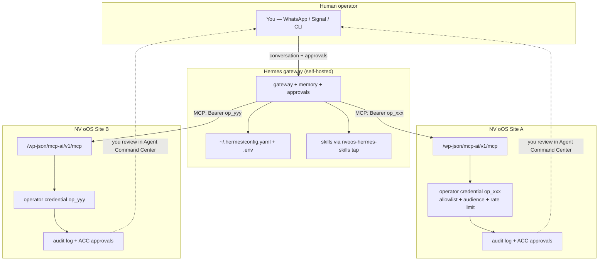

# Hermes Agent Fleet Operator - Proposal & Comprehensive Implementation Plan

**Date:** 2026-08-13
**Status:** 🔮 PENDING
**Estimated Effort:** 7-11 dev-days (Phases 0-3) + 5-10 dev-days (optional Phase 4)
**Priority:** HIGH
**Related:** [media-worker-sidecar-proposal.md](./media-worker-sidecar-proposal.md), [sidecar-expansion-plan.md](./sidecar-expansion-plan.md), [pro-toolkit-mcp-servers-expansion-plan.md](./pro-toolkit-mcp-servers-expansion-plan.md), [orchestration-platform-comparison.md](./orchestration-platform-comparison.md)

---

## Executive Summary

Nous Research's open-source **Hermes Agent** (`nousresearch/hermes-agent`) is a memory-first, self-improving agent harness that can connect to any number of **remote HTTP MCP servers** with per-server bearer auth, per-server tool filtering, and per-server trust/approval controls. NV oOS already exposes exactly such a server: the JSON-RPC 2.0 `/wp-json/mcp-ai/v1/mcp` endpoint backed by ~1,500 tools, assistant credential tokens (`cred_xxxxx.SECRET`), capability checks, audit logging, and a destructive-operations approval gate.

This proposal defines **"Hermes manages the sites; you manage Hermes"** as a first-class NV oOS capability: a new `addons/fleet-operator` addon that issues *scoped operator credentials* (allowlisted tools, audience-bound, rate-limited, revocable), filters `tools/list` server-side to those allowlists, attributes every audit entry to the operator, and generates ready-to-paste Hermes `config.yaml` / `.env` blocks and a Hermes skills pack so a single Hermes gateway can operate multiple NV oOS sites from one memory and one conversation surface (CLI/Telegram/WhatsApp/Signal).

The integration requires **zero changes to Hermes itself** — it is a governance, scoping, and configuration-automation layer on the NV oOS side, built on the MCP Authorization draft and OWASP Agentic Top 10 practices (deny-by-default, per-site audience-bound tokens, human-in-the-loop approval gates, tamper-evident audit attribution).

**Placement decision:** a new `addons/fleet-operator` addon — **not** inside `addons/media-worker`, which is a per-site media-operations sidecar one-way-synced to a standalone repo; fleet governance is a different concern and a different release surface. An optional Phase 4 central hub would be a *separate* Node sidecar (`addons/fleet-hub`) that reuses media-worker's patterns without entangling its scope.

---

## Problem Statement

**Current state.** NV oOS can already be called by MCP clients (Zed, Claude Desktop, Cursor) using assistant credentials, and sites can already talk to each other via the mesh and the A2A protocol. What is missing is the *supervisor* pattern:

1. **No external-operator identity.** Assistant credentials are bound to one assistant, not to an external operator managing the site; there is no way to issue a credential that says "this is Hermes, and it may only touch these 30 content tools."
2. **Full tool surface exposure.** A remote MCP client that authenticates can enumerate the entire registry (up to ~1,500 tools). Industry data shows 250+ tool schemas exhaust context windows; every host (Cursor caps at 40 tools) must filter — but today that filtering can only be configured client-side, in Hermes' `config.yaml`, with no server-side enforcement.
3. **No config automation.** Wiring Hermes to N sites is a hand-written `mcp_servers:` block per site, with tokens and tool globs maintained by hand.
4. **No operator attribution.** The audit logger records tool executions but has no concept of "which external operator drove this," so a human supervising Hermes cannot easily reconstruct or approve its activity per site.
5. **Protocol friction risk.** The `/mcp` endpoint's `method` argument is a strict `enum` of five methods (`initialize`, `tools/list`, `tools/call`, `resources/list`, `prompts/list`). MCP clients routinely send `ping` and `notifications/initialized`; those would be rejected with a 400 before we ever get to the interesting problems.

**Goal state.** A site admin can, in minutes: create an "External Operator" for Hermes → choose tool groups → get a scoped token + a generated `config.yaml` block → hand it to Hermes. Hermes then operates the site within the allowlist, every write to elevated-risk tools pauses at the existing approval gate, and every action lands in the audit log attributed to the operator and the authorizing human.

---

## Goals & Non-Goals

### Goals

1. **Operator credentials** — a new credential type (proposed prefix `op_`) with: tool allowlist, read/write mode, audience binding to the site URL, expiry, rate limit, instant revocation (kill switch).
2. **Server-side tool scoping** — `tools/list` returns only the allowlisted subset for operator-authenticated requests ("never registered ⇒ nothing to block"). Allowlist by tool group, explicit slug, or glob.
3. **Fleet console** — Pro admin page to manage operators, preview the scoped tool list, and generate Hermes `config.yaml` (`mcp_servers:`) + `.env` blocks for one or many sites.
4. **Audit attribution** — every tool call and chat interaction initiated via an operator credential carries `operator_id` through the existing activity/audit logging, visible in the Agent Command Center.
5. **Hermes skills pack** — a GitHub "tap" repo of `SKILL.md` files teaching Hermes how to operate NV oOS sites (tool groups, SOPs, approval etiquette, per-site context), plus setup runbook docs.
6. **Verification & hardening** — Phase 0 proves the current endpoint against a real Hermes install and fixes protocol-enum friction; the plan stays vendor-neutral (any MCP host or A2A agent can consume the same surface).

### Non-Goals

- **No Hermes code changes or forks.** We consume its documented config surface only.
- **No re-implementation of A2A or the mesh.** Both exist; Phase 4 *documents and verifies* using them for delegation, rather than rebuilding.
- **No server/sysadmin ops** (WP updates, backups, PHP) through this surface in v1 — those remain WP-CLI/human territory.
- **No central hub in the core phases** — direct Hermes→site MCP connections are the MVP; the hub is an optional Phase 4 for audit aggregation and config churn reduction.

---

## Research Findings

### A. Hermes Agent integration surface (verified against Nous Research docs/source)

| Capability | Verified behavior | Source |
|---|---|---|
| Remote HTTP MCP | `mcp_servers.<name>.url:` + `headers.Authorization: Bearer ...` in `~/.hermes/config.yaml`; transport is implicit (`url:` = Streamable HTTP, `transport: sse` to force SSE) | [MCP feature docs](https://hermes-agent.nousresearch.com/docs/user-guide/features/mcp), [config reference](https://hermes-agent.nousresearch.com/docs/reference/mcp-config-reference) |
| Per-server tool filtering | `tools.include` / `tools.exclude` with exact names and fnmatch globs; `include` wins when both set; `resources: false`, `prompts: false` disable wrapper tools | [config reference](https://hermes-agent.nousresearch.com/docs/reference/mcp-config-reference) |
| Approval gates | `trust: untrusted` forces user approval for every write-capable tool call; global `approvals.mode: smart\|manual\|off` with fail-closed timeout; hardline blocklist not bypassable by `--yolo` | [security docs](https://hermes-agent.nousresearch.com/docs/user-guide/security) |
| Auth options | bearer headers, OAuth 2.1 (PKCE + refresh, token cache `0600`), mTLS `client_cert`/`client_key`, `${env:VAR}` secret substitution from `~/.hermes/.env` | [MCP docs](https://hermes-agent.nousresearch.com/docs/user-guide/features/mcp) |
| Tool namespacing | `mcp__<server>__<tool>`; ~3,300-tool servers supported via glob excludes (no documented hard limit) | [config reference](https://hermes-agent.nousresearch.com/docs/reference/mcp-config-reference) |
| A2A v1.0 | Bundled plugin, both directions: outbound `a2a_discover`/`a2a_call`/`a2a_orchestrate(capability, ...)`; inbound Agent Card + JSON-RPC 2.0 with per-peer bearer tokens, HMAC-signed push callbacks, `a2a_audit.jsonl`, anti-loop turn caps | [A2A docs](https://github.com/NousResearch/hermes-agent/blob/main/website/docs/user-guide/messaging/a2a.md) |
| Skills | `~/.hermes/skills/<cat>/<name>/SKILL.md` (frontmatter + markdown, optional `references/`); install via GitHub tap `hermes skills tap add`; `skills.external_dirs` can scan an existing skills directory (same layout as this repo's `.agents/skills/`) | [skills docs](https://hermes-agent.nousresearch.com/docs/user-guide/features/skills) |
| Runtime | Python 3.11 + uv installer, gateway via systemd/Docker (unprivileged uid 10000); secrets in `~/.hermes/.env` (0600) — **no encrypted vault; plaintext-with-permissions** | [installation](https://hermes-agent.nousresearch.com/docs/getting-started/installation), [configuration](https://hermes-agent.nousresearch.com/docs/user-guide/configuration) |
| Protocol version | MCP Python SDK client; standard `initialize` negotiation; **no documented minimum version pin (UNVERIFIED)** — must be validated empirically in Phase 0 | [config reference](https://hermes-agent.nousresearch.com/docs/reference/mcp-config-reference) |

**Key conclusion:** zero Hermes-side code is needed. The entire integration is (a) NV oOS-side scoped credentials + server-side filtering, (b) a config generator, (c) a skills pack, (d) runbooks.

### B. Industry standards & best practices

1. **MCP Authorization draft** ([modelcontextprotocol.io](https://modelcontextprotocol.io/specification/draft/basic/authorization)): OAuth 2.1 subset; `Authorization: Bearer` on every request; 401 for invalid, 403 + `WWW-Authenticate: Bearer error="insufficient_scope"` for out-of-scope; **audience binding via RFC 8707 `resource`** — tokens must be bound to the site URI they were issued for, preventing one site's token from replaying against a sibling. Machine-to-machine = `client_credentials` with per-site scopes. Our `op_` tokens implement the bearer + audience + scope model without needing a full OAuth AS (documented as a deliberate simplification).
2. **A2A 1.0** ([a2a-protocol.org](https://a2a-protocol.org/latest/specification/)): released; complements MCP — MCP for tools/resources (correct per site), A2A for delegating opaque tasks between agents; `TASK_STATE_AUTH_REQUIRED` is the protocol-native approval gate; callers MUST validate webhook URLs against SSRF. Use for cross-site delegation in Phase 4.
3. **OWASP LLM Top 10 (2025)** ([owasp.org](https://owasp.org/www-project-top-10-for-large-language-model-applications/)): LLM02 sensitive information disclosure, LLM06 excessive agency → "Utilise human-in-the-loop control to require a human to approve high-impact actions." Plus the **[OWASP Top 10 for Agentic Applications (2026)](https://genai.owasp.org/resource/owasp-top-10-for-agentic-applications-for-2026/)**: task-scoped short-lived tokens, approval gates on irreversible actions, tamper-evident decision logs, hard caps on autonomous loops ([Auth0 analysis](https://auth0.com/blog/owasp-top-10-agentic-applications-lessons/), [AI Agent Security Cheat Sheet](https://cheatsheetseries.owasp.org/cheatsheets/AI_Agent_Security_Cheat_Sheet.html)).
4. **Tool-bloat evidence & mitigations**: 250+ schemas exhaust 200K contexts ([r/ClaudeAI](https://www.reddit.com/r/ClaudeAI/comments/1jlitwe/extremely_important_point_of_250_mcp_tools/)); Cursor hard-caps 40 ([demiliani.com](https://demiliani.com/2025/09/04/model-context-protocol-and-the-too-many-tools-problem/)); mitigations: host-side allowlisting (Zed per-tool profiles), server-side filtering ([WP VIP](https://wpvip.com/blog/wordpress-mcp/)), router/tool-group indirection ([MCP discussion #537](https://github.com/orgs/modelcontextprotocol/discussions/537)), runtime `notifications/tools/list_changed` ([zed.dev/docs/ai/mcp](https://zed.dev/docs/ai/mcp)).
5. **WordPress agent-access practice**: Application Passwords authenticate as a full user with no scoping ([WP docs](https://developer.wordpress.org/advanced-administration/security/application-passwords/)); the reference implementation for AI agents is **WP VIP Secure MCP**: deny-by-default, agents as users, a dedicated MCP Call Log attributed to the authorizing human, step-up verification for sensitive writes, org-wide kill switch ([wpvip.com](https://wpvip.com/blog/wordpress-mcp/)). **Our design mirrors this**: operator = scoped identity, per-call audit attribution, approval gates, kill switch.
6. **Fleet patterns**: central MCP gateways exist to consolidate authn/z, rate limits, and logging in front of many servers ([Zuplo comparison](https://zuplo.com/blog/mcp-gateway-comparison), [MintMCP](https://www.mintmcp.com/blog/enterprise-ai-infrastructure-mcp)) — the "visibility black hole" argument is what motivates optional Phase 4. Cloudways documents agency-style management of 50+ sites via MCP ([cloudways.com](https://www.cloudways.com/blog/agency-management-mcp/)) — closest published analogue.

---

## Architecture Options & Placement Decision

| Option | Description | Verdict |
|---|---|---|
| **A. WP addon only** (`addons/fleet-operator`) — scoped credentials + server-side filtering + config generator | Minimal, uses Hermes' native multi-server config; audit stays per site | ✅ **Recommended core** |
| **B. Inside `addons/media-worker`** | Add operator/gateway routes to the media sidecar | ❌ Rejected — media-worker is a per-site media-ops service one-way-synced to a standalone repo ([sync note](./media-worker-sidecar-proposal.md)); fleet governance is a different concern, different release cadence, and would leak operator secrets into a media-processing container |
| **C. Addon + central Node hub** (`addons/fleet-hub`) | One MCP endpoint for Hermes, routing to N sites; aggregated audit/health; reduces Hermes-side config churn | ⏳ **Optional Phase 4** — justified only after dogfooding shows config churn/audit aggregation pain; reuses media-worker sidecar *patterns* (Express, token auth, Redis, Docker) as a separate service |
| **D. A2A-centric** (sites as A2A peers only, no raw MCP) | Hermes `a2a_orchestrate` across sites; coarser granularity (task-level, not tool-level) | ⏳ **Complement in Phase 4** — A2A already exists in NV oOS; use it for long-running delegated tasks, keep MCP for direct tool work |

**Recommendation:** Option A now (Phases 0-3), Option C + D evaluated after real-world usage (Phase 4 gate).

---

## Recommended Architecture



Data flow per tool call:

1. Hermes sends JSON-RPC `tools/call` with `Authorization: Bearer op_xxx.SECRET`.
2. `/mcp` permission callback authenticates the operator credential (hashed secret compare, expiry, revocation, audience/site-URL check, rate-limit slot).
3. The MCP methods handler resolves the tool **only if** its slug is in the credential allowlist; otherwise returns a JSON-RPC error (never exposes the tool in `tools/list` either).
4. Existing security stack applies unchanged: capability checks, two-gate sanitisation, destructive-ops gate (elevated tools → human approval in Agent Command Center), cost tracking, audit logging with `operator_id` attribution.

---

## Implementation Plan

### Phase 0 — Manual Proof of Concept & Protocol Verification (0.5-1 day, no code)

**Goal:** prove the existing endpoint against a real Hermes install and capture every friction point.

Tasks:
- [ ] Install Hermes (`curl ... | bash`) in WSL2; start gateway per [installation docs](https://hermes-agent.nousresearch.com/docs/getting-started/installation).
- [ ] Issue a temporary assistant credential (`cred_...`) via WP admin / `wp mcp-ai credential` CLI; wire it into `~/.hermes/config.yaml` with a 20-tool `tools.include` allowlist.
- [ ] Verify `initialize` handshake and `tools/list` (confirm protocol-version negotiation in `includes/class-wp-mcp-ai-rest-mcp-methods.php` works with the Hermes client).
- [ ] **Expected fix #1:** extend the `method` `enum` in `includes/rest/class-wp-mcp-ai-rest-mcp-controller.php` to accept `ping`, `notifications/initialized`, `notifications/cancelled`, `resources/read`, `prompts/get` (spec-mandated notification/utility methods clients send; the strict enum currently 400s them). Keep validation via a known-methods allowlist instead of an open string.
- [ ] Run one read tool + one write tool; confirm audit-log entries.
- [ ] Record findings in `docs/operations/fleet/hermes-operator-setup.md` (created in Phase 3).

**Acceptance:** Hermes lists and successfully calls a read tool and a write tool against a live site; all friction items are captured as Phase 1 backlog entries.

### Phase 1 — Operator Credentials & Server-Side Scoping (`addons/fleet-operator`, 3-5 days)

New addon structure (mirrors `addons/pro` conventions: `includes/`, `tests/`, `README.md` declaring purpose + `.context` links per folder-readme convention):

```
addons/fleet-operator/
├── fleet-operator.php                  # bootstrap: register classes on plugins_loaded
├── README.md
├── includes/
│   ├── class-wp-mcp-ai-operator-credential.php        # token model (op_ prefix), hashing, expiry, audience
│   ├── class-wp-mcp-ai-operator-credential-repository.php  # CRUD, revoke, rate-limit counters
│   ├── class-wp-mcp-ai-operator-tool-scope.php        # allowlist resolution (groups/globs/slugs) + tools/list filter
│   ├── class-wp-mcp-ai-operator-authenticator.php     # bearer parse + verify, hooks into /mcp permission callback
│   ├── class-wp-mcp-ai-operator-audit.php             # operator_id attribution on activity/audit entries
│   └── class-wp-mcp-ai-operator-config-generator.php  # Hermes YAML + .env builder (single + fleet)
└── tests/
    ├── test-operator-credential.php
    ├── test-operator-tool-scope.php
    └── test-operator-config-generator.php
```

Key design points:

- **Token format:** `op_` + `bin2hex( random_bytes( 32 ) )` (parallel to `cred_` in `includes/repositories/class-wp-mcp-ai-credential-repository.php`), secret stored hashed (reuse existing hashing util), full token shown once.
- **Allowlist model:** deny-by-default. Allow by (a) tool-group/toolkit (reuse the registry's existing `toolkit` categorization), (b) explicit slug, (c) glob. Reads of `tools/list` are filtered by the same resolver — single source of truth.
- **Audience binding:** credential stores the canonical `home_url()` it was minted for; requests are rejected if the effective audience mismatches (RFC 8707 pattern, simplified — no AS).
- **Rate limiting:** per-operator token-bucket counters via transients (reuse request-guard patterns from `includes/security/`); defaults: 60 req/min, configurable.
- **Kill switch:** revoke is synchronous and immediate; also honors the global disable toggle.
- **Approval interplay:** tools flagged `risk_level: elevated/destructive` continue through the existing destructive-ops gate; operator-attributed approval requests appear in the Agent Command Center Approvals tab with the operator's label.
- **Audit:** `operator_id` + `operator_label` added to activity/audit entries (existing hooks `wp_mcp_ai_after_tool_execution`); no new log store.

**Acceptance:** PHPUnit coverage for credential lifecycle, scoping (incl. glob + group), audience mismatch, rate-limit, revocation; a live Hermes session sees only the scoped tool list and cannot call out-of-scope tools even by direct `tools/call`.

### Phase 2 — Fleet Console (Pro admin, 2-3 days)

- [ ] New Pro admin page (or Agent Command Center tab): **External Operators** — list/create/revoke operator credentials; tool-group picker with live registry categories; scoped-tool preview; per-operator rate-limit + expiry.
- [ ] **Config generator:** per site (and across mesh-registered sites) produce:
  - `mcp_servers:` YAML block (site name, `url`, `headers.Authorization`, `tools.include` derived from the allowlist, `trust` suggestion, `transport` note);
  - matching `~/.hermes/.env` lines (`SITE_A_TOKEN=...`);
  - one-click copy + downloadable `config.yaml` fragment.
- [ ] Slash-command helper `/operator [create|revoke|config]` for CLI-driven management.
- [ ] Document `addons/fleet-operator/README.md` (purpose, public surface, `.context` links).

**Acceptance:** an admin creates an operator + generates config for two sites in <5 minutes, pastes into Hermes, and both sites accept scoped calls.

### Phase 3 — Hermes Skills Pack, Docs & Runbooks (1-2 days + content)

- [ ] Publish tap repo `nvdigitalsolutions/nvoos-hermes-skills` (mirrored from `addons/fleet-operator/skills/`, same subtree-sync pattern as media-worker) containing `SKILL.md` files:
  - `nvoos-operations` — tool groups per domain (content, WooCommerce, CRM, PM, media, docs), SOPs, canonical task recipes;
  - `nvoos-approvals` — when approvals trigger, how to phrase requests so the human can adjudicate;
  - `nvoos-site-context` — template for per-site facts (store URL, brand, active campaigns) that the human fills once;
  - `nvoos-a2a` — Phase 4 preview: cross-site delegation etiquette.
- [ ] Note in docs the `skills.external_dirs` synergy: this repo's `.agents/skills/` uses the same `SKILL.md` layout Hermes can scan directly.
- [ ] Write `docs/operations/fleet/hermes-operator-setup.md` (install → operator creation → config generation → verification → revocation) and Phase 0 findings.
- [ ] Register external service in `readme.txt` external-services list (wp.org compliance pattern from Reviews 7/7e) and the wp.org compliance docs.

**Acceptance:** `hermes skills tap add nvdigitalsolutions/nvoos-hermes-skills` + `hermes skills install` succeeds; Hermes demonstrates using the SOP skill during a multi-tool task.

### Phase 4 (optional, gated) — Central Fleet Hub & A2A Operator Mode (5-10 days)

**Gate criteria:** after ≥2 weeks of dogfooding, if (a) Hermes config churn across sites is painful, (b) cross-site audit aggregation is needed, or (c) long-running delegated tasks justify A2A, proceed.

- [ ] **`addons/fleet-hub` Node sidecar** (Express + Redis + Docker, patterns from media-worker but a separate service and separate standalone repo): single MCP endpoint for Hermes; routes `tools/call` to site endpoints with per-site operator tokens (server-side secret custody — Hermes holds one hub token, never per-site secrets); aggregates audit events + health; per-site kill switches.
- [ ] **A2A operator mode verification:** confirm Hermes `a2a_agents` + `a2a_orchestrate` works against NV oOS A2A endpoints (`includes/a2a/`); document per-peer bearer tokens, `AUTH_REQUIRED` flows mapping to ACC approvals, anti-loop turn caps on both sides.
- [ ] OWASP Agentic 2026 review pass on the combined fleet surface (loop caps, tamper-evident decision export).

**Acceptance:** Hermes holds a single hub credential; hub demo shows a cross-site task (e.g., "publish the campaign post on A and mirror to B") with per-site audit entries.

---

## Security Design (standards mapping)

| Requirement (source) | Implementation |
|---|---|
| Bearer token on every request; 401/403 semantics (MCP Auth draft) | `op_` bearer via `Authorization` header; 401 invalid/expired/revoked, 403 out-of-scope with error payload |
| Audience binding / anti-confused-deputy (RFC 8707) | Credential bound to canonical site URL at mint; mismatched audience rejected |
| Least privilege / deny-by-default (OWASP LLM06, WP VIP model) | Allowlist-only tool resolution; server-side `tools/list` filtering; default allowlist = read-only content tools |
| Task-scoped short-lived tokens (OWASP Agentic 2026) | Expiry defaults (30/90d), rotation support, one credential per operator per site — no fleet-wide master token |
| Human-in-the-loop for high-impact actions (OWASP LLM06, cheat sheet) | Existing destructive-ops gate applies to operator calls; approvals surface in Agent Command Center with operator label; Hermes side `trust: untrusted` recommended in generated config |
| Sensitive info (OWASP LLM02) | Existing output guardrail + secret redaction in logs; operator prompts pass through the same two-gate sanitisation as all tool args |
| Tamper-evident audit & attribution (OWASP Agentic) | `operator_id` on every activity/audit entry; existing audit logger; optional Phase 4 aggregated export |
| Kill switch | Synchronous revocation; global operator-disable toggle; verified by test |
| Prompt injection (Hermes inbound A2A) | NV oOS treats operator input as untrusted (sanitize-at-entry, existing); Hermes-side A2A filtering noted in docs |
| Secret custody | Site keeps only the hashed secret; full token shown once; generated `.env` entries use `${env:...}` indirection in Hermes config |

---

## Testing Plan

- **Unit (PHPUnit):** credential lifecycle (mint/verify/expire/revoke), allowlist resolution (group/glug/glob), `tools/list` filtering, audience mismatch, rate limiting, config generator output shape. Follow existing patterns in `addons/pro/tests/`.
- **Integration:** spin up a real Hermes instance (CI job or manual WSL2 script) → wire generated config → assert scoped `tools/list`; attempt an out-of-scope `tools/call` → assert rejection + audit entry.
- **Security/red-team:** reuse `bin/red-team.php` patterns — token replay across sites (audience check), revoked-token reuse, allowlist bypass via glob edge cases, rate-limit flooding.
- **Regression:** existing MCP endpoint tests must stay green (assistant credentials unaffected); A2A tests unaffected.
- **Manual UAT script:** the Phase 3 runbook doubles as the UAT checklist.

---

## Effort Estimation

| Phase | Scope | Effort |
|---|---|---|
| 0 | Manual POC + protocol friction fixes + findings | 0.5-1 day |
| 1 | `addons/fleet-operator` core: credentials, scoping, auth, audit, generator + tests | 3-5 days |
| 2 | Fleet Console admin UI + config generator UX + slash command | 2-3 days |
| 3 | Skills pack repo + runbooks + compliance registration | 1-2 days |
| 4 (optional) | `addons/fleet-hub` + A2A operator verification | 5-10 days |

Dependencies: none external (Hermes is user-installed); Phase 0 can start immediately. Risks: exact `initialize` behavior of Hermes' SDK client is the only unverified technical unknown.

---

## Success Metrics

- **Time-to-operate:** admin can go from zero to "Hermes operating a site within a 30-tool allowlist" in <5 minutes (Phase 2 UAT timing).
- **Safety:** 100% of out-of-scope tool calls rejected server-side (unit + red-team), 0 regressions in existing MCP/A2A test suites.
- **Observability:** 100% of operator tool calls carry `operator_id` in the audit log (integration assertion).
- **Adoption proxy:** ≥2 sites operated by one Hermes gateway for ≥2 weeks (Phase 4 gate criteria).

---

## Risks & Mitigations

| Risk | Impact | Mitigation |
|---|---|---|
| Hermes client sends protocol methods/notifications outside our enum | Hard 400s at the door | Phase 0 empirical check + enum extension (planned fix #1) |
| Operator token leaked (Hermes stores secrets as plaintext `.env`) | Site compromise within allowlist | Allowlist least-privilege, expiry + rotation, kill switch, audit alerting on anomaly; document 0600/chmod + systemd-only guidance |
| Tool-name collisions across sites in Hermes context | Model confusion ("which site?") | Per-site server names (`mcp__site_a__create_post`); skills pack teaches site disambiguation; Phase 4 hub can inject site context |
| Scope creep into media-worker | Mixed concerns, sync pollution | Placement decision locked to `addons/fleet-operator`; hub is a separate service |
| Registry categorization drift (tool groups change) | Allowlists silently widen/narrow | Resolver test fixtures pin group membership; CI fails on registry-category changes touching operator scopes |
| Vendor lock-in to Hermes | Future hosts unsupported | Everything exposed is standard MCP/A2A; generator emits vendor-neutral fragments + Hermes-specific wrappers |

---

## Decisions Required

1. **Approve addon `addons/fleet-operator`** as the home for this capability (vs. deferring to `addons/pro`). → *Recommended: new addon.*
2. **Approve `op_` token prefix** and the audience-bound, allowlist credential model. → *Recommended: yes; `cred_` stays assistant-only.*
3. **Skills tap repo visibility** — public GitHub repo `nvoos-hermes-skills` (default) vs. private (manual install docs). → *Recommended: public for `hermes skills tap` support.*
4. **Phase 4 gate** — proceed only after the defined dogfooding criteria, or skip the hub and stay direct-connect. → *Recommended: gate as written.*
5. **Vendor framing** — position as "External Operator (Hermes-first, any MCP/A2A host compatible)". → *Recommended: yes.*

---

## References

**Hermes Agent (Nous Research):**
- Docs: https://hermes-agent.nousresearch.com/docs
- MCP feature: https://hermes-agent.nousresearch.com/docs/user-guide/features/mcp
- MCP config reference: https://hermes-agent.nousresearch.com/docs/reference/mcp-config-reference
- Security: https://hermes-agent.nousresearch.com/docs/user-guide/security
- Skills: https://hermes-agent.nousresearch.com/docs/user-guide/features/skills
- A2A: https://github.com/NousResearch/hermes-agent/blob/main/website/docs/user-guide/messaging/a2a.md

**Standards:**
- MCP Authorization draft: https://modelcontextprotocol.io/specification/draft/basic/authorization
- A2A v1.0 spec: https://a2a-protocol.org/latest/specification/
- OWASP LLM Top 10 (2025): https://owasp.org/www-project-top-10-for-large-language-model-applications/
- OWASP Top 10 for Agentic Applications (2026): https://genai.owasp.org/resource/owasp-top-10-for-agentic-applications-for-2026/
- OWASP AI Agent Security Cheat Sheet: https://cheatsheetseries.owasp.org/cheatsheets/AI_Agent_Security_Cheat_Sheet.html
- WP VIP Secure MCP: https://wpvip.com/blog/wordpress-mcp/
- WordPress Application Passwords: https://developer.wordpress.org/advanced-administration/security/application-passwords/

**Repo anchors:**
- `includes/rest/class-wp-mcp-ai-rest-mcp-controller.php` — `/mcp` JSON-RPC endpoint (method enum: line ~105)
- `includes/class-wp-mcp-ai-rest-mcp-methods.php` — MCP protocol version negotiation
- `includes/class-wp-mcp-ai-credentials.php` + `includes/repositories/class-wp-mcp-ai-credential-repository.php` — credential model to parallel
- `includes/a2a/` — A2A agent card, client, task manager, push notifications
- `addons/pro/includes/mcp-apps/` — per-assistant MCP app connections (OAuth client)
- `addons/media-worker/` — sidecar patterns (do not extend; mirror the shape)
