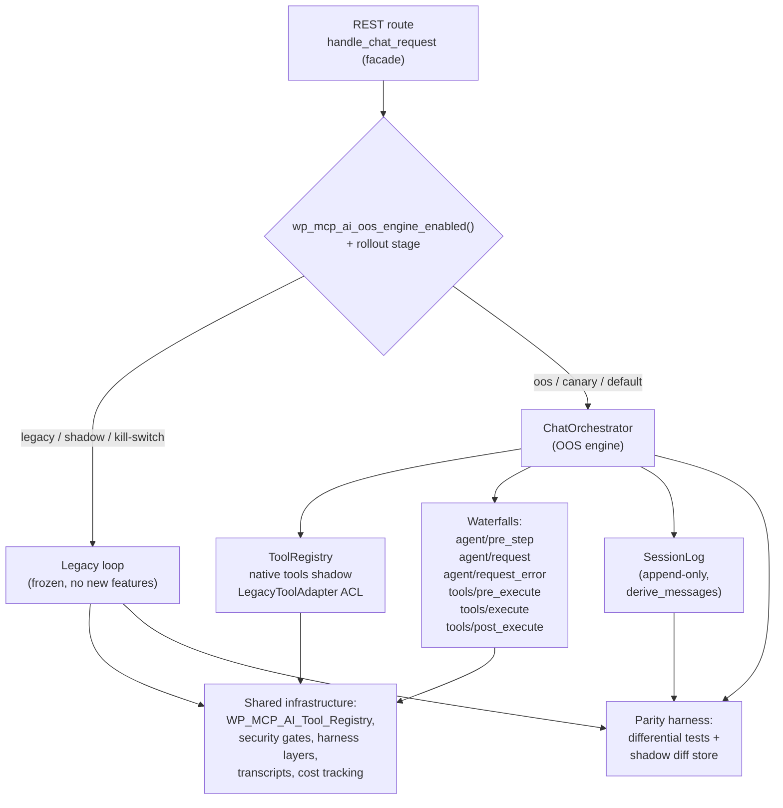

# Proposal: OOS Orchestration Runtime — Gap Closure, Consolidation, and DeepSeek-Harness-Inspired Enhancements

**Based on:** `docs/project/proposals/ai-orchestration-services-lib-core-migration-plan.md`, `docs/project/proposals/legacy-php-service-inventory-lib-core-gap.md`, `docs/project/proposals/WAVE-1-IMPLEMENTATION-PLAN.md` through `WAVE-3-IMPLEMENTATION-PLAN.md`
**Date:** 2026-08-16
**Status:** Proposed — pending product decision on OOS engine promotion (see §2.1)
**Target release:** phased across v1.2.x–v1.4.x (see §7 Phase table)
**External reference reviewed:** [deepseek-ai/deepseek-harness](https://github.com/deepseek-ai/deepseek-harness) (`docs/architecture.md`, `docs/cordis-primer.md`, `docs/subsystems/core.md`, `docs/subsystems/tools.md`, `AGENTS.md`), retrieved 2026-08-16

---

## 1. Executive Summary

NV oOS runs **two parallel chat execution loops**:

| Loop | Location | Status |
|---|---|---|
| **Legacy WP-side loop** | `includes/class-wp-mcp-ai-rest.php` → `handle_chat_request()` / `handle_chat_request_with_streaming()` | Production default; owns all accumulated production logic (cost accumulation, TPM budget management, harness-layer filters, transcripts, caching) |
| **OOS engine** | `lib/core/src/Application/Chat/ChatOrchestrator.php`, routed via `handle_chat_request_oos()` | Opt-in (`enable_oos_engine` setting, `WP_MCP_AI_OOS_ENGINE` constant, `X-WP-MCP-AI-Engine: oos` header, `?engine=oos`); missing most production logic |

The divergence is compounding: every production fix lands in the legacy loop, and the OOS engine — despite ~50 domain contracts, 20+ provider clients, and a full WordPress adapter layer — remains a research vehicle.

This proposal covers two objectives in one plan:

1. **Close the verified gap** between the two loops using industry-standard migration practice (Strangler Fig facade routing, shadow→canary→default rollout, differential/metamorphic parity testing) so the OOS engine can safely become the production path and the legacy loop can be **phased out**.
2. **Adopt the high-value ideas from deepseek-harness (dsh)** — typed dispatch modes (emit/waterfall/serial), decision-typed loop extension points, an event-sourced session log, a tool pipeline with monotonic guards, scoped registries, and replay testing — as the *foundations* the consolidation builds on, while explicitly rejecting the parts that don't fit PHP/WordPress (Cordis runtime itself, TypeScript declaration merging, per-file 100% coverage gates).

**Sequencing principle:** consolidate first (Phases 0–4), enhance after (Phase 5). The dsh-inspired pieces that are *prerequisites* for safe promotion (dispatch modes, tool pipeline, session log) land in Phases 0–3; the value-adds (scoped presets, agent steering, replay tests) land post-consolidation in Phase 5.

**Impact on existing sites:** zero change to the default legacy path. Every phase is flag-gated; the legacy loop remains the fallback until Phase 6 deletion, which is gated on production parity data, not on code completion.

---

## 2. Background & Current State (verified 2026-08-16)

### 2.1 The promotion decision (blocking)

This plan is worth executing **if and only if** the OOS engine is intended to become the production path. If the legacy loop is to remain authoritative indefinitely, Phases 1–4 are wasted effort; only the no-regret items (§2.6) should proceed, re-targeted at the legacy path.

**Recommendation: promote.** Rationale: the lib/core investment (50+ contracts, adapters, provider clients) is stranded while the flag defaults off; the legacy loop grows monthly (~1,000+ lines of cost/streaming logic not present in OOS); and the Pro multi-agent features (`spawn_agent`, `includes/agents` roles, Workflow Builder) need the scoped-registration model the OOS core provides.

### 2.2 Routing and flag mechanics (verified)

- `handle_chat_request()` delegates to `handle_chat_request_oos()` when `wp_mcp_ai_oos_engine_enabled()` returns true (`includes/class-wp-mcp-ai-rest.php` L3089–3091).
- `wp_mcp_ai_oos_engine_enabled()` checks, in order: admin setting `enable_oos_engine` → `WP_MCP_AI_OOS_ENGINE` constant → `X-WP-MCP-AI-Engine: oos` header → `?engine=oos` (`includes/bootstrap/oos-bridge.php` L459–482).
- Base wp.org builds **exclude `lib/core/` entirely** — the bridge adapter skips loading when the lib directory is absent (`includes/bridge/bridge-init.php` L39–43). Therefore all lib/core changes are invisible to base distribution builds.

### 2.3 Verified gap list (legacy loop vs OOS engine)

#### G1. Tool surface — the hard blocker

The OOS `ToolRegistry` (`oos-bridge.php` L153–430) registers only the ~200 migrated `Nvoos\Core\Tool\*` / `Nvoos\WordPress\Tool\*` implementations. There is **no adapter wrapping `WP_MCP_AI_Tool_Registry`** (~1,500 tools including all Pro toolkits, MCP servers, and harness tools). `ChatOrchestrator::buildAllowedTools()` silently drops any assistant-configured slug that isn't migrated — an assistant using WooCommerce, JetEngine, CRM, workflow, or harness tools gets a reduced or empty toolset with no warning.

#### G2. Harness layers & security gates bypassed (or crash)

Harness Layers A–J subscribe to hooks/filters only the legacy loop fires:

| Hook | Consumer | Legacy | OOS |
|---|---|---|---|
| `wp_mcp_ai_resolved_system_prompt` | Prompt Injector (cues), Guardrails instructions, Necessity Gate instructions | ✅ (rest.php L3261) | ❌ raw prompt injected (`handle_chat_request_oos` L12796–12815) |
| `wp_mcp_ai_pre_chat_message` | Guardrails message screening | ✅ (L3160) | ❌ |
| `wp_mcp_ai_before_tool_execute` | **Necessity Gate (Layer J)** | ✅ | ❌ |
| `wp_mcp_ai_pre_response_render` | Output Guardrail, Citation Verifier | ✅ | ❌ |
| `wp_mcp_ai_cost_calculated` | Trace capture, cost tracking | ✅ (L4068) | ❌ — the `CostCalculated` domain event exists but `ChatOrchestrator` never dispatches it |
| `wp_mcp_ai_agentic_iteration_complete` / `wp_mcp_ai_agentic_loop_completed` | PSO optimiser, observers | ✅ (L3854, L3936) | ❌ — domain events dispatched but not mapped to WP hooks (bridge maps only 4 events, `oos-bridge.php` L102–118) |

**Destructive-ops gate breaks OOS requests:** the gate throws `WP_MCP_AI_Destructive_Confirmation_Required` from `wp_mcp_ai_before_tool_execution` (`class-wp-mcp-ai-rest.php` L6076, L12003). The bridge fires that hook from the OOS `BeforeToolExecution` event, but `ChatOrchestrator` doesn't catch it — it bubbles into the generic `catch (\Exception)` in `handle_chat_request_oos()` (L12950) → HTTP 500 instead of a confirmation pause.

#### G3. Tool capability enforcement miswired

`Nvoos\Core\Application\Tool\ToolRegistry::execute()` checks `$context['auth_provider']`, but `ChatOrchestrator` never injects one. With `auth_provider` absent, `! $context['auth_provider'] ?? null?->userCan(...)` evaluates to `true`, so **any migrated tool declaring a `required_capability` denies all authenticated users** (over-denial).

#### G4. Cost & token accounting lost

- **Agentic cost accumulation:** legacy merges a per-iteration accumulator into the final cost (L3987–4007); OOS `CostCalculator` reads only the final response — intermediate iterations' usage is discarded.
- **TPM budget management:** legacy runs preflight validation, model auto-switch with provider sync, truncation, and max_tokens capping (L3718–3780; streaming L4760–4810). `ChatOrchestrator` has setters for token budget, rate limiter, and compressors, but **`oos-bridge.php` never calls them** (L432–442) — all optional collaborators are `null` in production.
- **Usage persistence:** legacy calls `WP_MCP_AI_Logger::log_chat_interaction()` (L3938) and writes usage records; OOS does neither.
- **Response caching:** legacy caches final responses (L3476); OOS has none.

#### G5. Transcripts & streaming parity

- Non-streaming OOS branch records **no transcript** (recording exists only in the streaming branch, L12927–12937).
- OOS streaming lacks per-iteration cost events and WP-mapped iteration hooks.
- Team requests (`unified_team_*`) are explicitly delegated back to `handle_unified_team_request()` (L12739–12741) — acceptable short-term; the legacy loop remains load-bearing for multi-agent.

### 2.4 Industry research grounding

| Pattern | Source | Applied in |
|---|---|---|
| **Strangler Fig** — incremental replacement behind a façade; old system runs until fully enveloped; the strangler only grows, the host must not | [Microsoft Azure Architecture Center](https://learn.microsoft.com/en-us/azure/architecture/patterns/strangler-fig), [Thoughtworks](https://www.thoughtworks.com/en-us/insights/articles/embracing-strangler-fig-pattern-legacy-modernization-part-one) | Phase 4 rollout; §4.2 "legacy freeze" rule |
| **Staged LLM rollout: shadow → canary → A/B → full** — shadow validates parity/safety with zero user exposure; canary validates safety; A/B validates quality; production response stays authoritative during shadow | [futureagi.com](https://futureagi.com/blog/llm-eval-shadow-traffic-canary-2026/), [llmapireliability.com](https://llmapireliability.com/posts/shadow-test-llm-fallbacks-before-user-traffic/), [tianpan.co](https://tianpan.co/blog/2026-04-09-llm-gradual-rollout-shadow-canary-ab-testing) | Phase 4 gates |
| **Differential + metamorphic testing** — run both implementations, flag output discrepancies; relation-based oracles where exact outputs don't exist | [arXiv 2607.28271 — Deterministic Validation of Legacy Code Migration](https://arxiv.org/html/2607.28271), [ASE'20 TestMC](https://www.researchgate.net/publication/348827909_TestMC_testing_model_counters_using_differential_and_metamorphic_testing) | Phase 2/3 parity suite, §6 |
| **Pre/post-LLM guardrails with corrective feedback** — screen pre-LLM; on violation, feed targeted correction back to the model, retry, re-validate; never surface raw failure | [Arthur AI](https://www.arthur.ai/blog/best-practices-for-building-agents-guardrails), [Datadog](https://www.datadoghq.com/blog/llm-guardrails-best-practices/) | Phase 2 output-side gates |
| **No retries on non-idempotent tools** — timeout/retry only where double execution is safe | [r/LangChain runtime guardrails discussion](https://www.reddit.com/r/LangChain/comments/1rcn3yn/what_runtime_guardrails_actually_work_for/) | Phase 1 retry policy (reuses existing `compute_tool_scopes()` read/write annotations) |
| **Per-run, per-iteration, per-model cost attribution** — O(n²) token growth in agentic loops; budget and kill-switch controls | [Braintrust](https://www.braintrust.dev/articles/how-to-track-llm-costs-2026), [TrueFoundry](https://www.truefoundry.com/blog/llm-cost-attribution-agentic-cicd) | Phase 3 cost accumulator + shadow budget ceiling |

### 2.5 DeepSeek Harness (dsh) review — what we adopt, what we reject

dsh is an orchestration runtime on Cordis: everything is a plugin; the session log is the single source of truth ("model-visible ⟺ logged"); the loop exposes decision-typed waterfalls; tool execution runs through a monotonic policy pipeline; registrations are scoped and reversible; cancellation is first-class.

**Adopted (mapped into phases):**

| dsh idea | dsh mechanism | Our phase |
|---|---|---|
| Typed dispatch modes | `emit` / `waterfall` (with `next()`, short-circuit) / `serial` | Phase 0 (R0) |
| Cooperative cancellation | `AbortSignal` threaded through pre-step → request → stream → tool | Phase 0 (R0) |
| Decision-typed loop extension points | `agent/pre-step` (reject\|enter), `agent/request` (replace config), `agent/request-error` (retry), `agent/turn-stopping` (serial, data decides) | Phase 2 (R2) |
| Tool policy pipeline | `tools/pre-execute` (allow/deny/ask) → monotonic deny-only guards → `tools/execute` around-dispatch (timeout/retry) → `tools/post-execute` (accept/replace/block with corrective feedback) → frozen `tools/result` | Phase 1 (R3) |
| Event-sourced session log | Append-only typed entries; model history *derived* (`deriveMessages()`); fork/resume/replay from one stream; versioned format | Phase 3 (R1) |
| Canonical tool output contract | Output JSON Schema + pure `render()`; canonical value execution-local; structured failures | Phase 1 (R3) |
| Scoped registries + presets-as-composition | Per-agent tool shadowing; allow/deny restriction intersection; child agents bind to parent's exact composition generation (`composeFrom`) | Phase 5 (R4) |
| Replay testing | Keyless snapshot replay of session logs (adapted to PHPUnit golden transcripts) | Phase 5 (R6) |
| Fail-loud configuration | Validate at load; misconfiguration never silently skipped | Phase 1 |

**Rejected (with reasons):**

| dsh idea | Why not |
|---|---|
| Cordis plugin runtime (plugins as rows with spatiotemporal composition) | JS runtime paradigm; WordPress request lifecycle is not a long-lived service host. We port the *concepts* (layered composition, disposers) onto the existing assistant-config + tool-preset system |
| TypeScript declaration merging / branded IDs | No PHP equivalent; use open tag-keyed maps + value-object ID classes |
| Per-file 100% coverage gate | Inappropriate for a 1,500-tool legacy plugin; snapshot transcript tests instead |
| Node-style async/cancellation | PHP has no cooperative concurrency; a `CancellationToken` checked at loop/tool boundaries is the analogue (matches dsh's own "cannot hard-kill same-process code" caveat) |

### 2.6 No-regret items (proceed even if promotion is declined)

If the promotion decision (§2.1) is "no", execute only these, re-targeted at the legacy path where noted:

1. Tool policy as decisions + monotonic guards (Phase 1 core) — replaces the exception-throwing gate side-channel on both paths.
2. Fail-loud tool schema validation at registration (Phase 1).
3. Cancellation checks at loop boundaries (Phase 0, both loops).
4. Golden-transcript replay tests seeded from the existing `includes/harness` trace capture/store (Phase 5 R6, legacy path).

---

## 3. Goals

1. **G1 closure:** 100% of assistant tool configs resolve on the OOS path; zero silent drops.
2. **G2 closure:** every harness-layer filter and security gate produces equivalent decisions on both paths (verified by differential tests, not by inspection).
3. **G3 closure:** capability checks behave identically on both paths.
4. **G4 closure:** cost/usage/token-budget behavior matches legacy within tolerance on identical inputs.
5. **G5 closure:** transcripts, interaction logging, and streaming parity on both branches.
6. **Safe promotion:** OOS becomes default via staged rollout (shadow → canary → default) with a legacy kill switch.
7. **Legacy deletion:** the two loop methods are removed after production parity data meets the kill criteria (§8), leaving one chat path.
8. **dsh-inspired runtime upgrades** (R0–R6) delivered as foundations for the consolidation, then as post-consolidation enhancements.

## 4. Non-Goals

- Migrating all ~1,500 legacy tools to native `Nvoos\Core\Tool` implementations (an adapter layer wraps them; migration is opportunistic, following the existing "validated variant replaces non-validated" pattern).
- Reimplementing multi-agent team orchestration inside `ChatOrchestrator` (team requests keep delegating to the existing unified-team handler; revisit post-consolidation).
- Porting Cordis itself or any JS runtime.
- Changing the REST surface (routes, auth, `permissions_check`, guest tokens, validator) — all shared infrastructure stays.
- Real-time (WebSocket) chat; SSE remains the streaming transport.

---

## 5. Design Overview

Key structural decisions:

- **`handle_chat_request()` is the Strangler Fig façade.** It already routes; Phase 4 extends it with rollout-stage awareness (shadow mode executes both loops, serves legacy).
- **The bridge becomes the composition root.** All OOS wiring (setters, hook mappings, adapter registration) lives in `includes/bootstrap/oos-bridge.php` — the legacy loop remains untouched.
- **Legacy freeze (Strangler Fig rule).** From Phase 2 onward, new runtime features land only in the OOS path; the legacy loop receives only bug fixes. The strangler envelops; the host doesn't grow.
- **The security gates move to typed decisions, not exceptions.** Both paths converge on the same gate implementations; the legacy exception classes remain for back-compat but stop being the enforcement mechanism on the OOS path.

---

## 6. Testing Strategy

| Layer | Mechanism | Phase |
|---|---|---|
| **Unit** | `lib/core/tests/Unit/` (existing PHPUnit/PHPStan setup) for new core classes: dispatch modes, CancellationToken, SessionLog, ToolRegistry pipeline | 0, 1, 3 |
| **Differential parity (new `tests/parity/`)** | Shared fixture corpus (requests + recorded provider responses) executed against both loops; assertions on: hook surface + order, gate decision *classes* (allow/deny/ask — metamorphic relation, not text equality), tool schema payloads, cost/usage records | 1–3 |
| **Golden transcript replay** | Record session logs; replay through the loop with a recording provider stub (no network); assert turn boundaries, tool-call ordering, abort paths, compaction | 5 (R6) |
| **Production shadow diffs** | `wp_mcp_ai_oos_shadow_run` log events + `wp mcp-ai oos parity report/diff` CLI; the live parity signal during rollout | 4 |
| **Eval-suite A/B** | Existing Layer G eval scheduler scores OOS vs legacy per assistant — the *quality* gate (A/B), distinct from shadow's *safety/parity* gate | 4.3 |
| **CI** | `composer run parity` (new script) on every push once Phase 2 lands; existing `ci:all` unchanged | 2+ |

**Hard rule for shadow mode (Phase 4.1):** write-class tools must **not execute twice**. The shadow runner partitions tool calls using the existing `compute_tool_scopes()` read/write annotations — reads execute live against the OOS engine, writes replay the legacy result. This is a design requirement, not an option.

---

## 7. Implementation Plan

### Phase 0 — Foundations: bridge wiring fixes + dispatch modes + cancellation (Base, ~1 week)

**Closes:** G3, G4 (partial), G5 (partial), destructive-gate crash | **dsh:** R0

| # | Action | Files |
|---|---|---|
| 0.1 | Call the five existing setters in the bridge factory: `setTokenBudgetManager()`, `setRateLimiter()`, `setSemanticCompressor()`, `setDataBudgetTracker()`, `setContextCompressor()` using `wp_mcp_ai_oos_*()` bridge functions | `includes/bootstrap/oos-bridge.php` |
| 0.2 | Inject `AuthProvider` into tool-execution context in both `handleChat` and `handleChatStreaming` (fixes capability over-denial, G3) | `lib/core/src/Application/Chat/ChatOrchestrator.php` |
| 0.3 | Per-iteration cost accumulator; dispatch `CostCalculated` on loop end; map it → `wp_mcp_ai_cost_calculated` in the bridge | `ChatOrchestrator.php`, `oos-bridge.php` |
| 0.4 | Map `AgenticIterationComplete` / `AgenticLoopCompleted` → `wp_mcp_ai_agentic_iteration_complete` / `wp_mcp_ai_agentic_loop_completed` | `oos-bridge.php` |
| 0.5 | Record transcripts + `log_chat_interaction` in the non-streaming OOS branch (G5) | `includes/class-wp-mcp-ai-rest.php` |
| 0.6 | Wrap `BeforeToolExecution` listener dispatch in `ToolRegistry::execute()` with a `\Throwable` catch → normalize to structured tool error (destructive confirmation becomes a tool-level message, not a 500) | `lib/core/src/Application/Tool/ToolRegistry.php` |
| 0.7 | **R0a — Typed dispatch modes:** extend `EventDispatcherInterface` with `waterfall( string $name, object $event, callable $next ): object` and `serial()`; `Decision` value-object convention (`RejectDecision`, `EnterDecision`, `RetryDecision`, `AllowDecision`, `DenyDecision`, `AskDecision`, `ReplaceDecision`, `BlockDecision`); WP adapter implements waterfalls via `apply_filters` chains where `$next` is the tail closure | `lib/core/src/Domain/Contract/EventDispatcherInterface.php`, `lib/core/src/Domain/Event/`, `lib/wordpress-adapter/src/Adapter/EventDispatcher.php` |
| 0.8 | **R0b — CancellationToken:** `Nvoos\Core\Domain\ValueObject\CancellationToken` (`isCancelled()`, `reason()`, `throwIfCancelled()`, `withTimeout()`, child linking); `ChatOrchestrator` checks before each provider call, each streamed chunk, and each tool call; SSE disconnect cancels the token in the WP handler | `lib/core/src/Domain/ValueObject/CancellationToken.php`, `ChatOrchestrator.php` |

**Acceptance:** identical hook surface fires on both paths for the same logical request (unit tests assert dispatch order + payload equivalence); capability checks behave identically; destructive confirmation returns a confirmation message on OOS. Zero behavioral change on the legacy path.

### Phase 1 — Tool-surface parity (ACL) + tool pipeline (Base, ~2 weeks)

**Closes:** G1, partial G2 (gate *surface*) | **dsh:** R3

| # | Action | Files |
|---|---|---|
| 1.1 | **`LegacyToolAdapter implements ToolInterface`** — wraps any `WP_MCP_AI_Tool_Base`: slug/description/parameters from `get_definition()`; `getRequiredCapability()` declared (registry enforces via injected AuthProvider; legacy `execute()` self-checks — consistent `userCan` semantics); `execute()` delegates and normalizes canonical envelope ↔ OOS error shapes | `lib/wordpress-adapter/src/Tool/LegacyToolAdapter.php` (new) |
| 1.2 | **Lazy registration** in the bridge: on construction, iterate `WP_MCP_AI_Tool_Registry::get_tools()` and register adapters for any slug not natively registered; native tools shadow legacy automatically | `includes/bootstrap/oos-bridge.php` |
| 1.3 | **Fail-loud unresolved-slug audit:** `buildAllowedTools()` logs `oos_unresolved_tool` admin-visible notices per unresolved slug instead of silent drops | `ChatOrchestrator.php` |
| 1.4 | **Schema-parity test:** fixture assistant with mixed slugs — `buildAllowedTools()` equals legacy `build_tools_payload()` (diff-normalized) | `tests/parity/` |
| 1.5 | **R3a — Tool pipeline:** `tools/pre_execute` waterfall (allow/deny/ask) → monotonic `ToolGuard` chain (deny-only, global or per-assistant, ordering cannot un-deny) → `tools/execute` around-dispatch wrappers (timeout, retry, metrics) → body → `tools/post_execute` (accept/replace-content/block-with-feedback) → frozen result for observers. Keep `BeforeToolExecution`/`AfterToolExecution` events firing for back-compat | `lib/core/src/Application/Tool/ToolRegistry.php`, `lib/core/src/Domain/Contract/ToolGuard.php` (new) |
| 1.6 | **R3b — Optional tool metadata:** `get_timeout_ms()`; `is_concurrency_safe()` (opt-in; default sequential); `concludes_turn` on results; retry eligibility derived from existing `compute_tool_scopes()` read/write annotations — **never retry write-class tools** (industry idempotency rule) | `lib/core/src/Domain/Contract/ToolInterface.php` |
| 1.7 | **R3c — Canonical output contract:** optional `ToolOutputContract` (output JSON Schema + pure `render()` projector); registry validates body value; canonical value execution-local (never logged); structured error codes (`unknown_tool`, `invalid_args`, `invalid_output`) | `lib/core/src/Domain/Contract/`, `ToolRegistry.php` |
| 1.8 | **Fail-loud schema validation** at bootstrap: every registered tool's JSON Schema subset validated; malformed schemas log admin-visible errors instead of shipping to providers | `oos-bridge.php`, `lib/core/src/Application/Tool/` |

**Acceptance:** 100% assistant tool configs resolve on OOS (parity test green, zero unresolved slugs in fixtures); retry policy demonstrably excludes write tools.

### Phase 2 — Security-gate parity via typed waterfalls (Base, ~2 weeks)

**Closes:** G2 | **dsh:** R2, R3 (guards applied)

| # | Action | Files |
|---|---|---|
| 2.1 | **Prompt assembly parity (cheap):** `handle_chat_request_oos` applies `wp_mcp_ai_resolved_system_prompt` exactly like the legacy path — closes Prompt Injector / Guardrails-instructions / Necessity-instructions gap immediately | `includes/class-wp-mcp-ai-rest.php` |
| 2.2 | **R2 — Loop waterfalls:** `agent/pre_step` (reject\|enter — hosts Guardrails screening), `agent/request` (replace frozen call config — hosts model-switch/TPM policy), `agent/request_error` (retry\|terminal — hosts loop-level recovery), `agent/turn_stopping` (serial; data decides — listeners steer, loop re-reads inbox). Legacy `wp_mcp_ai_chat_options` filter still applied for back-compat | `ChatOrchestrator.php`, `lib/core/src/Domain/Event/` |
| 2.3 | **Gate migrations (decision-typed, corrective-feedback pattern):** Necessity Gate → `deny` guard; Destructive-ops gate → `ask` (confirmation); Approval gate → `ask`; Output Guardrail + Citation Verifier → response-level `block-with-feedback` (flagged issue fed back to model, retry, re-validate — never surfaced raw) | `lib/wordpress-adapter/src/Policy/` (new), rewire `includes/agents/` + `includes/harness/` subscribers behind the same implementations |
| 2.4 | **Differential parity suite:** corpus of representative requests (write ops, destructive ops, PII-laden messages, jailbreak-style prompts, citation-heavy responses) asserting **decision-class parity** across paths (metamorphic relation; exact text need not match) | `tests/parity/` |
| 2.5 | **Legacy freeze begins:** new runtime features land in OOS only; legacy loop receives bug fixes only | (process rule) |

**Acceptance:** security tests pass on both paths; destructive confirmation yields a confirmation message (not 500) on OOS; no gate bypassable by listener ordering; differential suite green.

### Phase 3 — Session log + telemetry/cost/behavior parity (Base, ~2–3 weeks)

**Closes:** G4, G5 (remaining) | **dsh:** R1

| # | Action | Files |
|---|---|---|
| 3.1 | **R1 — Event-sourced session log:** `Nvoos\Core\Application\Session\SessionLog` — append-only typed entries (`turn_started`, `step_started`, `user_message`, `assistant_chunk` raw for replay fidelity, `assistant_message`, `tool_call`, `tool_result`, `steering_message`, `turn_ended` with reason: `completed`/`iteration_limit`/`aborted`/`compact`); monotonic `seq`; `LOG_FORMAT_VERSION`; `derive_messages()` projection — model history always built from the log. **Model-visible ⟺ logged invariant** as dev-mode assertion + replay test | `lib/core/src/Application/Session/` (new) |
| 3.2 | **Persistence seam:** `SessionLogStoreInterface`; WP adapter on top of existing `TranscriptStore` + JSONL-in-uploads fallback (avoids `wp_options` bloat) | `lib/wordpress-adapter/src/Adapter/` |
| 3.3 | **Flag-gated rollout:** `wp_mcp_ai_enable_session_log` (default **off**; on = OOS loop writes the log; legacy path untouched). `ChatOrchestrator` writes the log and derives history from it when enabled | `ChatOrchestrator.php`, `oos-bridge.php` |
| 3.4 | **TPM budget parity:** preflight `validate_tpm_limit` in OOS handler with model auto-switch (provider sync via `WP_MCP_AI_Model_Config`) + truncation fallback, matching legacy L3718–3780; wire `TokenBudgetManager` setter (done in 0.1) for tool-definition capping | `includes/class-wp-mcp-ai-rest.php` |
| 3.5 | **Usage persistence + caching parity:** `log_chat_interaction` + usage-tracker writes in both branches; response caching with legacy-compatible cache keys in `handle_chat_request_oos` | `includes/class-wp-mcp-ai-rest.php` |
| 3.6 | **Shadow instrumentation:** `wp_mcp_ai_oos_shadow_run` log event carrying per-run diffs (tool-call success rate, iteration count, latency, cost delta); shadow store (option-backed, capped) | `includes/` new small class + WP-CLI command (`wp mcp-ai oos parity report|diff`) |

**Acceptance:** identical recorded provider responses → equal cost/usage records (float tolerance) on both paths; TPM behaviors (cap/switch/truncate) match; session log replay reproduces model history byte-for-byte in tests.

### Phase 4 — Staged rollout (Strangler Fig facade, ~1 week code + 2–3 release cycles gated on data)

**Closes:** promotion | **dsh:** — (industry rollout practice)

| Gate | Mechanism | Serve | Duration | Exit criteria |
|---|---|---|---|---|
| **4.1 Shadow** | `wp_mcp_ai_oos_shadow_enabled` + sampling rate (5% → 100%); both loops run; legacy result served; OOS result + diff logged. Write tools replay legacy results (never double-execute) | Legacy | 1–2 releases | tool-success Δ < 1%; gate-decision parity 100%; cost Δ < 5%; latency ≤ 2×; shadow budget ceiling honored (auto-suspend over `cost_ceiling_usd`) |
| **4.2 Canary** | Per-assistant opt-in: `_wp_mcp_ai_engine = 'oos'` meta; internal/test assistants first, then opt-in customers | OOS (opted-in) | 1 release | no severity-1/2 incidents; unresolved-slug count = 0 |
| **4.3 Default flip** | `enable_oos_engine` default on; legacy retained behind `wp_mcp_ai_force_legacy_chat` filter (kill switch); rehearsed rollback drill in staging before flip; A/B evidence from eval suite (Layer G) that OOS ≥ legacy on quality | OOS | 1 release | kill-switch exercised; support volume normal |
| **4.4 Delete** | Remove legacy loop bodies + streaming twin; delete dual-path tests; single chat path | OOS | — | §8 kill criteria all met |

### Phase 5 — Post-consolidation dsh enhancements (Base core + Pro, ~4–6 weeks)

**dsh:** R4, R5, R6 | Only after Phase 4.2 (canary proves the runtime in production)

| # | Action | Placement |
|---|---|---|
| 5.1 | **R4 — Scoped registries:** `ToolRegistry::createScope()` views with per-scope shadowing + `ToolRestriction` (allow/deny sets intersecting across the scope chain; scope-local registrations exempt); loop resolves schemas + dispatch through the agent scope | Base (`lib/core`) |
| 5.2 | **R4 — Agent presets as composition (Pro):** generalize the Pro tool-preset system into a full composition (tools + prompt sections + guards + provider route) mounted per session; child agents (`spawn_agent`, `includes/agents` roles) **bind** to the parent's exact generation (`composeFrom` semantics — fixes the correctness gap where a child could get a different toolset than its parent's history was produced under) | Pro (`addons/pro`) |
| 5.3 | **R4 — Effective-composition view:** admin/Site Health dump of any assistant's resolved composition (tools after restriction intersection, prompt sections, guards) — the `--dump-config` equivalent for debugging 1,500-tool configs | Pro (admin) |
| 5.4 | **R5 — Agent handles & steering (Pro):** `AgentHandle` with `followup`/`steer`/`inject` (next-turn/next-step inbox), `cancel($cause, keepInbox)`, `whenIdle()`, status events — powers user steering of scheduled runs, Paper Store/memory injection without a new turn, and client cancellation with abort reason recorded in the log. Backed by the Phase 3 session log; requires Action Scheduler plumbing for cross-request state | Pro |
| 5.5 | **R5 — Plan mode as logged state (Pro):** `todo_write` tool with durable log entries; plan/approval UI in chat client rendering from the log (replay-safe, dsh's design) | Pro |
| 5.6 | **R6 — Compaction seam:** formalize `ContextCompressionInterface` + `SemanticCompressorInterface` behind a `CompactionProvider` with per-session trigger policy; compaction recorded in the log (`turn_ended: compact`) so resumed sessions know history was summarized | Base (`lib/core`) |
| 5.7 | **R6 — Golden transcript replay:** PHPUnit replay of stored session logs through the loop with recording provider stub; snapshot tests for turn boundaries, tool ordering, aborts, compaction; `composer run parity` wired into CI | Base (`lib/core/tests`, `tests/parity`) |
| 5.8 | **R6 — Telemetry single-path:** audit logger / OTel subscribers consume `tool_result` + turn events from the log instead of re-wrapping the loop | Base |

### Phase 6 — Deletion & cleanup (1 week code + docs)

- Delete `handle_chat_request` / `handle_chat_request_with_streaming` loop bodies and orphaned helpers (`maybe_compact_agentic_context`, `preflight_tpm_check` duplicates, legacy cost accumulator).
- Consolidate harness hooks onto OOS waterfalls; remove dual-path hook mappings from the bridge; retire shadow instrumentation.
- Update `.context/` files, `docs/llm-harness.md` (new "Orchestration Runtime" section distinct from Layers A–H), folder READMEs per convention; archive this proposal as complete.

---

## 8. Kill Criteria — when legacy deletion is safe

1. Every assistant's configured tool slugs resolve on OOS (adapter covers 100%; zero `oos_unresolved_tool` notices in fixtures).
2. Gate-decision parity = 100% on the differential corpus for ≥ 1 release.
3. Cost/usage metrics within tolerance across the full shadow window.
4. No severity-1/2 incidents attributable to the OOS path during canary.
5. Kill-switch rehearsal executed in staging; rollback documented.
6. Eval-suite A/B: OOS ≥ legacy on quality per assistant.
7. Multi-agent team orchestration either runs on OOS or is formally declared a separate Pro path (today's explicit delegation acceptable).

---

## 9. Risks & Mitigations

| Risk | Mitigation |
|---|---|
| Shadow mode doubles API cost during rollout | 5% sampling start; per-assistant `cost_ceiling_usd` enforced on shadow runs; auto-suspend over ceiling |
| **Write-tool double execution in shadow** (destructive tools running twice) | Hard rule (§6): write-class calls replay legacy results; reads execute live; partitioned via `compute_tool_scopes()` |
| Gate behavior drift before canary | Differential suite in CI + shadow diffs flag gate mismatches in production logs |
| R1 (session log) refactors the OOS hot path | Flag-gated (`wp_mcp_ai_enable_session_log`, default off); dual-path until replay tests prove log-derived history equals legacy `$messages` assembly; legacy path remains the fallback |
| Legacy loop accumulates features during multi-release rollout | Legacy freeze from Phase 2.5 (Strangler Fig rule) |
| PHP has no hard cancellation | `CancellationToken` is cooperative; SSE chunk boundaries give frequent checkpoints; matches dsh's own limitation |
| ~1,500-tool output-contract adoption | Optional contract; only ~20 tools adopt initially; adapter defaults are lossless |

## 10. Placement Summary (Base vs Pro)

| Scope | Phase 0 | Phase 1 | Phase 2 | Phase 3 | Phase 4 | Phase 5 | Phase 6 |
|---|---|---|---|---|---|---|---|
| Base `lib/core` + adapter | ✅ all | ✅ all | ✅ all | ✅ all | ✅ shadow + CLI | ✅ 5.1, 5.6–5.8 | ✅ |
| Base `includes/` | bridge, rest | bridge | rest | rest, CLI | facade | — | delete loop |
| Pro `addons/pro/` | — | — | gate re-wiring shared | — | — | ✅ 5.2–5.5 | — |

Base wp.org distribution builds exclude `lib/core/` — all core changes are invisible to them by construction.

## 11. Effort Estimate

| Phase | Code effort | Gate |
|---|---|---|
| 0 Foundations | ~1 week | unit + hook-parity tests |
| 1 Tool surface + pipeline | ~2 weeks | schema-parity test, retry-idempotency audit |
| 2 Security-gate parity | ~2 weeks | differential suite green |
| 3 Session log + telemetry | ~2–3 weeks | replay test, cost-parity test |
| 4 Staged rollout | ~1 week code | 2–3 release cycles on production parity data |
| 5 dsh enhancements | ~4–6 weeks | post-canary start |
| 6 Deletion & cleanup | ~1 week | kill criteria (§8) |

**Total:** ~13–16 weeks of code across phases 0–3 + 5, plus rollout calendar time in Phase 4; Phases 0–3 can overlap 0→(1,2)→3 per dependency (dispatch modes power waterfalls; the log powers replay and steering).

---

## Appendix A — Hook parity mapping (target end-state)

| WP hook | Legacy fires | OOS mechanism (target) |
|---|---|---|
| `wp_mcp_ai_before_chat_request` | ✅ | bridge-mapped `BeforeChatRequest` (exists) |
| `wp_mcp_ai_after_chat_response` | ✅ | bridge-mapped `AfterChatResponse` (exists) |
| `wp_mcp_ai_before_tool_execution` | ✅ | bridge-mapped `BeforeToolExecution` + `tools/pre_execute` waterfall |
| `wp_mcp_ai_after_tool_execution` | ✅ | bridge-mapped `AfterToolExecution` + frozen `tools/result` |
| `wp_mcp_ai_resolved_system_prompt` | ✅ | applied in OOS handler (2.1) |
| `wp_mcp_ai_pre_chat_message` | ✅ | `agent/pre_step` waterfall (2.2) |
| `wp_mcp_ai_before_tool_execute` | ✅ | `ToolGuard` / `ask` decisions (2.3) |
| `wp_mcp_ai_pre_response_render` | ✅ | `block-with-feedback` post-policy (2.3) |
| `wp_mcp_ai_cost_calculated` | ✅ | `CostCalculated` dispatch + accumulator (0.3) |
| `wp_mcp_ai_agentic_iteration_complete` | ✅ | bridge-mapped (0.4) |
| `wp_mcp_ai_agentic_loop_completed` | ✅ | bridge-mapped (0.4) |
| `wp_mcp_ai_chat_options` (filter) | ✅ | applied in OOS handler for back-compat; superseded by `agent/request` waterfall |

## Appendix B — What this proposal deliberately does not change

- REST routes, auth methods (nonce / credential bearer / Auth0 / guest token), and `permissions_check` — shared by both paths.
- The tool canonical envelope (`success` + `message`/`data` or `WP_Error`) and PHPCS sniffs.
- `includes/harness` Layers A–H architecture (they gain a new home on the OOS waterfalls, but their contracts are unchanged).
- Pro toolkits, MCP servers, Workflow Builder, Schedule Manager, CRM/health toolkits — they ride the adapter (Phase 1) without modification.

## Appendix C — Implementation status (tracked on PR #5881)

| # | Action | Status | Notes |
|---|---|---|---|
| 0.x | Foundations: collaborators, cancellation, dispatch, cost, auth | ✅ merged (Phase 0) | commit `73fd456` |
| 1.x | Tool surface: `LegacyToolAdapter` ACL, R3 pipeline, fail-loud slug audit | ✅ merged (Phase 1) | commit `c879ef6` |
| 2.x | Security parity: harness filters bridged, R2 waterfalls | ✅ merged (Phase 2) | commit `5c8eff9` |
| 3.x | Session log: event-sourced `SessionLog` + `deriveMessages()` + JSONL store | ✅ merged (Phase 3) | commit `27f16a6` |
| 4.x | Staged rollout: shadow runner, canary routing, `wp mcp-ai oos parity` CLI | ✅ merged (Phase 4) | commit `0334feb` |
| 5.1 | R4 Scoped registries (`ToolScope`, `ToolRestriction`) | ✅ merged (Phase 5 Base) | commit `87bce1a`; seed-universe branch for non-enumerable resolvers added during the Pro pass |
| 5.2 | R4 Agent presets as composition (Pro) | ✅ delivered | `addons/pro/includes/composition/` — `WP_MCP_AI_Pro_Composition_Service::compose()` / `compose_from()` (composeFrom semantics), `WP_MCP_AI_Pro_Legacy_Tool_Resolver`; flag-gated module `oos_composition`; the delegation wiring step (team orchestrator consuming `wp_mcp_ai_pro_compose_from_overrides`) remains for the Phase 4.2 canary |
| 5.3 | R4 Effective-composition view (Pro admin) | ✅ delivered | `wp mcp-ai composition dump <id> [--json]` + `verify <id> [--against=<gen>]`; the `to_array()` dump is the Site Health/admin surface payload |
| 5.4 | R5 Agent handles & steering (Pro) | ⏸ deferred | Requires Action Scheduler cross-request state + a concrete steering UX; no consumer yet. Design unchanged — revisit after canary proves the runtime |
| 5.5 | R5 Plan mode as logged state (Pro) | ⏸ deferred | Same cross-request-state dependency as 5.4; session-log durability (Phase 3) is the prerequisite and is already in place |
| 5.6 | R6 Compaction seam | ✅ merged (Phase 5 Base) | `CompactionProvider` + logged `context_compacted` entries; replay roundtrip test |
| 5.7 | R6 Golden transcript replay | ✅ merged (Phase 5 Base) | export/rebuild/derive roundtrip; `composer run parity` wiring tracked in Phase 4 |
| 5.8 | R6 Telemetry single-path | ✅ delivered | `SessionTelemetry` tap + `SessionTelemetryBridge` fan appended log entries out via `wp_mcp_ai_session_log_event`; `WP_MCP_AI_Session_Log_Observer` projects tool_result/turn events onto the metric collector; the audit logger consumes the same stream (both flag-gated, default off). tool_result entries enriched with outcome/duration/user/assistant; turn boundaries carry assistant/user ids. Phase 6 cleanup pairs the legacy-hook observers' retirement with loop deletion |

**Pro-pass discoveries (this slice):**

1. `ToolScope` could not enumerate generic `ToolResolverInterface` parents — the Pro legacy-tool resolver wraps the WP-side registry, which is non-enumerable. Fixed with a backward-compatible `$seed_slugs` constructor branch (+ core test).
2. `lib/wordpress-adapter/src/Tool/CreateAssistantTool.php` declared its `ErrorFactoryInterface` type relative to its namespace — a fatal type error that broke the entire OOS orchestrator pre-warm on PHP 8.3 (`Nvoos\WordPress\Tool\Nvoos\Core\Domain\Contract\ErrorFactoryInterface`). Pre-existing on `alpha-working`; fixed here because the OOS path cannot boot without it.
3. Registered array metas (`_wp_mcp_ai_tools`, `type: array`) read back as arrays, serialized strings, or JSON strings depending on environment; `normalize_slugs()` accepts all three shapes.
