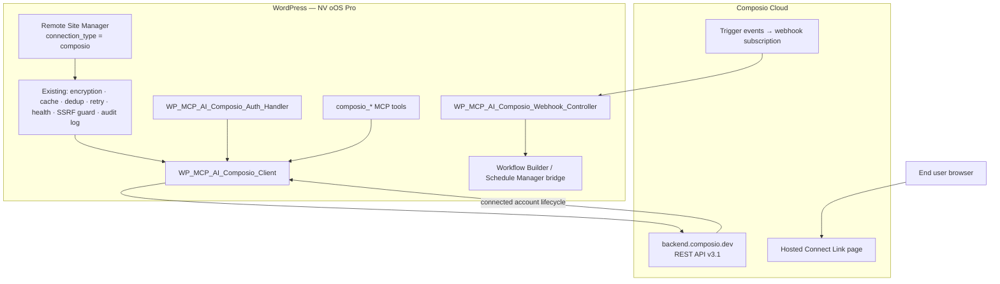
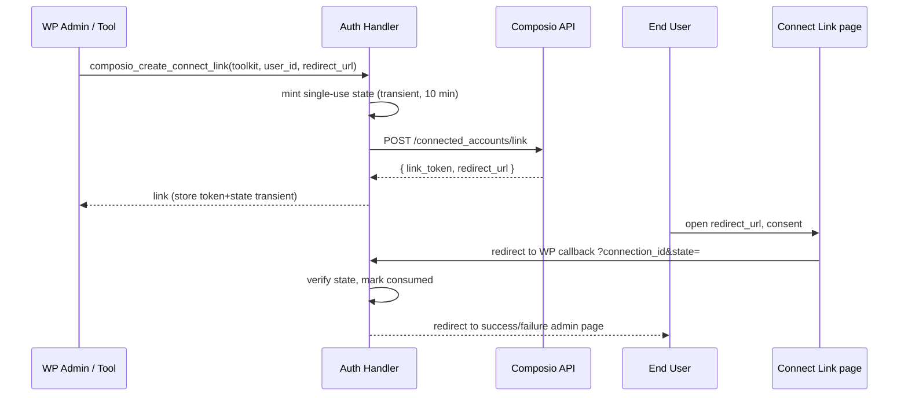
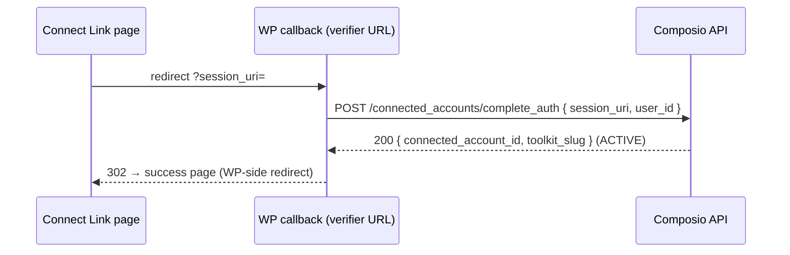

# Composio Connect Integration — Implementation Plan

**Date:** 2026-08-17
**Status:** 🔮 PENDING
**Distribution:** Pro addon (`addons/pro/`) — zero Base changes
**Target:** NV oOS Pro (post-1.1.x), phased rollout
**Companion:** [`030-composio-connect-integration-proposal.md`](./030-composio-connect-integration-proposal.md)

## Table of Contents

1. [Scope, Non-Goals & Assumptions](#1-scope-non-goals--assumptions)
2. [Industry Standards Alignment](#2-industry-standards-alignment)
3. [Architecture Design](#3-architecture-design)
4. [Phase 1 — Connection Type + PHP API Client](#4-phase-1--connection-type--php-api-client)
5. [Phase 2 — Connect Links & Connected Accounts Management](#5-phase-2--connect-links--connected-accounts-management)
6. [Phase 3 — Composio MCP Tools](#6-phase-3--composio-mcp-tools)
7. [Phase 4 — Triggers & Webhooks](#7-phase-4--triggers--webhooks)
8. [Phase 5 — Assistant UX, Docs & Release](#8-phase-5--assistant-ux-docs--release)
9. [Testing Strategy](#9-testing-strategy)
10. [Deployment & Documentation Deliverables](#10-deployment--documentation-deliverables)
11. [File Manifest](#11-file-manifest)
12. [Risks & Mitigations](#12-risks--mitigations)
13. [Definition of Done](#13-definition-of-done)

---

## 1. Scope, Non-Goals & Assumptions

### In scope

- New `composio` remote connection type in the Pro Remote Site Manager.
- PHP REST client for Composio API **v3.1** (`https://backend.composio.dev`, `x-api-key` auth).
- Composio Connect Link flow (hosted per-user OAuth) with callback identity verification support.
- Connected-accounts admin panel (list, status, revoke, per-user mapping).
- Six MCP tools: `composio_list_tools`, `composio_get_tool_schema`, `composio_list_connected_accounts`, `composio_create_connect_link`, `composio_execute_tool`, `composio_manage_triggers`.
- Webhook receiver for `composio.trigger.message` (V3), `composio.connected_account.expired`, `composio.trigger.disabled`.
- Tests, folder READMEs, user guide, tool reference updates, i18n.

### Non-goals (explicitly deferred)

- Composio Sessions / hosted-MCP-client mode (Labs "Tool Router") — revisit post-MVP as an upgrade path.
- `POST /api/v3.1/tools/execute/proxy` (requires a scoped `proxy_execute` API key) — document only.
- Custom OAuth app auth configs (`POST /api/v3.1/auth_configs`) — Composio-managed auth only.
- Base-plugin changes of any kind.

### Assumptions

- Site operators hold a Composio project API key (`ak_...`).
- MVP identity model is `admin_shared` (site-wide connected accounts); `per_wp_user` ships gated behind a setting. *(Pending decision #1 in the proposal.)*
- Webhook receiver runs on a publicly reachable HTTPS site (same requirement as existing chat-channel webhooks).

---

## 2. Industry Standards Alignment

### 2.1 Tool aggregator as the canonical agent-integration pattern

Composio (and comparable tool aggregators) are now the industry-standard integration path for agent platforms: one API key, per-user managed OAuth, unified tool schemas, event triggers. This plan follows Composio's **current recommended** surfaces rather than legacy ones: Connect Links (`/connected_accounts/link`) instead of the deprecated direct `POST /connected_accounts` (retired for Composio-managed OAuth starting 2026-05-08 for new orgs / 2026-07-03 for all orgs), and the v3.1 API instead of v2 actions/entities.

### 2.2 Secret-handling posture (wp-security-secrets)

- Only two secrets stored in WordPress: the Composio project API key and the webhook signing secret. Both encrypted at rest via the existing `WP_MCP_AI_Pro_Remote_Site_Manager::encrypt_value()` (AES-256-CBC keyed off `AUTH_SALT`).
- Secrets are masked in the admin UI (existing masked-placeholder pattern), excluded from REST responses by default (redaction), never written to logs, and never exposed to browser JS.
- Recommend a **scoped** Composio API key in docs (no `proxy_execute` scope) per least-privilege.

### 2.3 OAuth flow hardening (per Composio callback identity verification)

- Connect Link creation binds a single-use, transient-stored `state` token to the initiating WP user; the callback validates it (CSRF defense).
- If the Composio project enables **callback identity verification**, the WP callback redeems the `session_uri` via `POST /api/v3.1/connected_accounts/complete_auth` with the signed-in `user_id`. This defeats OAuth session fixation (attacker-copied authorization URLs).
- `session_uri` is single-use with a 10-minute TTL — the handler treats repeat calls as fatal errors and restarts the flow.

### 2.4 Webhook security (mirrors existing chat-channel hardening)

- `POST /wp-json/mcp-ai/v1/webhooks/composio/{connection_id}` is unauthenticated but **signature-gated**: HMAC verification of the Composio signing secret with `hash_equals()`, mirroring the Discord Ed25519 / Teams HMAC verification already in the plugin.
- Replay/duplicate protection: dedupe by event ID in a short TTL transient; idempotent handlers.
- Load-guard rate limiting on the public endpoint (existing `includes/security/` load guard).

### 2.5 Tool authoring rules (Unix Theory P0–P6)

All six tools obey the canonical envelope (success array or `WP_Error`; never `array( 'success' => false, ... )`), the two-gate sanitisation rule (sanitize `$arguments[...]` at entry, escape every value at exit), and declare `required_capability`. The custom PHPCS sniffs `WPMCPAI.Tools.CanonicalReturnEnvelope` and `WPMCPAI.Tools.SanitizeAtEntry` must pass.

---

## 3. Architecture Design

### 3.1 System Context



### 3.2 Connection Record Data Model

Stored in the existing `wp_mcp_ai_pro_remote_sites` option (one array entry). New meta keys:

| Meta key | Type | Notes |
|---|---|---|
| `connection_type` | string | `composio` |
| `name` | string | Admin label |
| `url` | string | Auto-set to `https://backend.composio.dev` (overridable, pinned to HTTPS allowlist) |
| `api_key` | string (encrypted) | Composio project API key `ak_...`; `_api_key_encrypted` flag handled by existing save logic |
| `auth_type` | string | Always `custom_header` internally (client sets `x-api-key`); hidden from UI |
| `webhook_secret` | string (encrypted) | Signing secret from `POST /api/v3.1/webhook_subscriptions` |
| `webhook_subscription_id` | string | For lifecycle (rotate/delete) |
| `default_user_mode` | enum | `admin_shared` \| `per_wp_user` |
| `default_user_id` | string | Composio `user_id` used in `admin_shared` mode (default: `nvoos-{site_id}-admin`) |
| `toolkit_allowlist` | array | Optional toolkit slugs exposed to assistants; empty = all |
| `enabled` | bool | Existing enable/disable switch |
| `cache_ttl` | int | Existing per-connection TTL (GET caching) |

**Transient caches (per connection):** `wp_mcp_ai_composio_accounts_{id}` (5 min), `wp_mcp_ai_composio_tools_{id}` (24 h), `wp_mcp_ai_composio_triggers_{id}` (1 h). Invalidated on save/test/account change.

### 3.3 Composio API Surface Mapping (v3.1, pinned)

Base: `https://backend.composio.dev`. All calls: `x-api-key` header, JSON bodies, `Accept: application/json`.

| Purpose | Method & path | Client method |
|---|---|---|
| Test / project info | `GET /api/v3.1/tools/enum` | `test_connection()` |
| List connected accounts | `GET /api/v3.1/connected_accounts` (`?user_id=&status=&toolkit=`) | `list_connected_accounts()` |
| Get account | `GET /api/v3.1/connected_accounts/{nanoid}` | `get_connected_account()` |
| Create Connect Link | `POST /api/v3.1/connected_accounts/link` (`toolkit`, `auth_config_id` OR `auth_scheme`, `user_id`, `redirect_url`, `callback_url`, `verify_callback_url`) | `create_connect_link()` |
| Redeem verifier session | `POST /api/v3.1/connected_accounts/complete_auth` (`session_uri`, `user_id`) | `complete_auth()` |
| Update account | `PATCH /api/v3.1/connected_accounts/{nanoid}` | `update_connected_account()` |
| Enable/disable account | `PATCH /api/v3.1/connected_accounts/{nanoid}/status` | `set_connected_account_status()` |
| Revoke at provider | `POST /api/v3.1/connected_accounts/{nanoid}/revoke` | `revoke_connected_account()` |
| Delete account | `DELETE /api/v3.1/connected_accounts/{nanoid}` | `delete_connected_account()` |
| List tools | `GET /api/v3.1/tools` (`?toolkits=&search=&page=&limit=`) | `list_tools()` |
| Tool schema | `GET /api/v3.1/tools/{tool_slug}` | `get_tool_schema()` |
| Execute tool | `POST /api/v3.1/tools/execute/{tool_slug}` (`connected_account_id`, `arguments`, `toolkit_versions=latest`) | `execute_tool()` |
| NL → tool inputs | `POST /api/v3.1/tools/execute/{tool_slug}/input` | `generate_tool_inputs()` |
| List trigger types | `GET /api/v3.1/triggers/types` (`?toolkit=`) | `list_trigger_types()` |
| Active triggers | `GET /api/v3.1/triggers/active` | `list_active_triggers()` |
| Upsert trigger | `POST /api/v3.1/trigger_instances/{trigger_slug}/upsert` (`connected_account_id` or `user_id`, `trigger_config`) | `upsert_trigger()` |
| Enable/disable trigger | `PATCH /api/v3.1/trigger_instances/{trigger_id}` (`status`) | `set_trigger_status()` |
| Delete trigger | `DELETE /api/v3.1/trigger_instances/{trigger_id}` | `delete_trigger()` |
| Create webhook subscription | `POST /api/v3.1/webhook_subscriptions` (`url`, `event_types`, `version=3`) | `create_webhook_subscription()` |
| List/get/update/delete subscription | `GET|PATCH|DELETE /api/v3.1/webhook_subscriptions[/{id}]` | `get|update|delete_webhook_subscription()` |
| Rotate secret | `POST /api/v3.1/webhook_subscriptions/{id}/rotate` *(confirm exact path in Phase 0)* | `rotate_webhook_secret()` |

**Rate limiting:** respect HTTP `429` + `Retry-After`; transient-backed cooldown (default 60 s). Log `X-RateLimit-*` headers into the existing health metrics record.

### 3.4 Connect Link Auth Flows

**Flow A — simple (no verifier):**



**Flow B — with callback identity verification (recommended when enabled):**



Rules: `session_uri` single-use/10-min; mismatch `user_id` → `400`/`FAILED` → surface error; any other error → keep connection pending and show "restart link" action. A `callback_url` set at link creation is ignored when the verifier is active.

### 3.5 Webhook & Trigger Flow

```mermaid
flowchart LR
    EV[Provider event<br/>e.g. gmail.message.new] --> CX[Composio]
    CX -->|POST trigger payload + signature| WH[WP webhook controller<br/>/mcp-ai/v1/webhooks/composio/{id}]
    WH --> V{verify HMAC<br/>hash_equals}
    V -->|fail| R[410 Gone + audit]
    V -->|ok| D{dedupe by event id}
    D -->|duplicate| OK[200 ok]
    D -->|new| S[switch on event type]
    S -->|composio.trigger.message| WFB[Workflow Builder / Schedule Manager bridge]
    S -->|connected_account.expired| RE[mark stale + regen Connect Link + notify admin]
    S -->|trigger.disabled| AD[admin notice + audit]
    WFB --> OK
```

### 3.6 MCP Tool Contract

All tools: slug prefix `composio_`, definitions via `get_definition()` with JSON-Schema `parameters`, `execute( $arguments, $context )` returning canonical envelope (`array( 'success' => true, ... )` or `WP_Error`). Connection resolution: explicit `connection_id` argument, else the first enabled `composio` connection. Read-class tools (`list_tools`, `get_tool_schema`) require `edit_posts`; state-changing tools require `manage_options`. `composio_execute_tool` routes write-class Composio actions (slug prefixes `DELETE_`, `UPDATE_`, `CREATE_`, `SEND_`, `POST_`, …) through the plugin's existing destructive-ops gate (verify exact gate class in `includes/security/` during implementation) and records executions in the audit log.

---

## 4. Phase 1 — Connection Type + PHP API Client

**Goal:** Create, validate, test, and store a `composio` connection; all Composio HTTP lives behind one client class.
**Target release:** Pro v-next minor. **Estimated effort:** 2–3 days.

### Task 1.1 — Create `addons/pro/includes/composio/` folder + README.md

**Files:**
- `addons/pro/includes/composio/README.md` — folder purpose, public surface table (client, auth handler, webhook controller), neighbors, `.context/` files to load (conventions, security-checklist, pro-vs-base, wp-rest-api skill).
- Required by the folder-README convention (`composer run docs:check-folder-readmes`).

**Acceptance:** `composer run docs:check-folder-readmes` passes.

### Task 1.2 — Implement `WP_MCP_AI_Composio_Client`

**File:** `addons/pro/includes/composio/class-wp-mcp-ai-composio-client.php` (new, ~450 lines)
**Class:** `WP_MCP_AI_Composio_Client`

**Design rationale:** One class owns the base URL, API-version pin, header assembly, and error normalization. It wraps `wp_remote_request()` directly (the Remote Site Manager's `make_request()` builds URLs for WordPress-style REST sites; Composio's absolute `/api/v3.1/...` paths and header auth differ enough that a dedicated client is cleaner — but it reuses the same `WP_MCP_AI_Cache_Helper` and health-metric helpers).

**Methods:**

| Method | Signature | Description |
|---|---|---|
| `__construct` | `(array $connection): void` | Decrypts `api_key` lazily; keeps `base_url`; sets `user-agent` header |
| `request` | `(string $method, string $path, array $params = array(), array $body = array()): array\|WP_Error` | Core transport: URL assembly, `x-api-key` header, 30 s timeout, JSON encode/decode, error normalization, 429 cooldown |
| `test_connection` | `(): array\|WP_Error` | `GET /api/v3.1/tools/enum`; returns `{ ok, project, tools_count, rate_limit }` |
| `list_connected_accounts` | `(array $filters = array()): array\|WP_Error` | `GET /api/v3.1/connected_accounts` with `user_id`/`status`/`toolkit` filters; caches 5 min |
| `get_connected_account` | `(string $account_id): array\|WP_Error` | Single account detail |
| `create_connect_link` | `(string $toolkit, string $user_id, string $redirect_url, array $opts = array()): array\|WP_Error` | `POST /api/v3.1/connected_accounts/link`; returns `{ link_token, redirect_url }` |
| `complete_auth` | `(string $session_uri, string $user_id): array\|WP_Error` | Verifier redemption; returns `{ connected_account_id, toolkit_slug }` |
| `update_connected_account` | `(string $account_id, array $patch): array\|WP_Error` | PATCH (alias, labels) |
| `set_connected_account_status` | `(string $account_id, string $status): array\|WP_Error` | `active` \| `inactive` |
| `revoke_connected_account` | `(string $account_id): array\|WP_Error` | Provider-side revoke |
| `delete_connected_account` | `(string $account_id): array\|WP_Error` | Soft delete (optionally `?revoke_on_delete=true`) |
| `list_tools` | `(array $filters = array()): array\|WP_Error` | `GET /api/v3.1/tools`; caches 24 h; pagination via `page`/`limit` |
| `get_tool_schema` | `(string $tool_slug): array\|WP_Error` | Input/output schema |
| `execute_tool` | `(string $tool_slug, string $account_id, array $arguments): array\|WP_Error` | `POST /api/v3.1/tools/execute/{slug}` with `toolkit_versions=latest` |
| `generate_tool_inputs` | `(string $tool_slug, string $text): array\|WP_Error` | NL → structured args |
| `list_trigger_types` | `(array $filters = array()): array\|WP_Error` | Trigger catalog |
| `list_active_triggers` | `(): array\|WP_Error` | Active instances |
| `upsert_trigger` | `(string $trigger_slug, array $config): array\|WP_Error` | Create/re-enable trigger |
| `set_trigger_status` | `(string $trigger_id, string $status): array\|WP_Error` | enable/disable |
| `delete_trigger` | `(string $trigger_id): array\|WP_Error` | Delete instance |
| `create_webhook_subscription` | `(string $url, array $event_types): array\|WP_Error` | Returns `{ id, signing_secret }` |
| `get_webhook_subscription` | `(): array\|WP_Error` | Current subscription (one per project) |
| `update_webhook_subscription` | `(string $id, array $patch): array\|WP_Error` | Event-type filters |
| `delete_webhook_subscription` | `(string $id): array\|WP_Error` | Remove |
| `rotate_webhook_secret` | `(string $id): array\|WP_Error` | New signing secret |
| `verify_webhook_signature` | `(string $raw_body, string $signature, string $secret): bool` | `hash_equals( hash_hmac( 'sha256', $raw_body, $secret ), $signature )` — constant-time |

**Error normalization:** map non-2xx to `WP_Error( 'wp_mcp_ai_composio_http_{code}', ... )` with Composio's `message` field; wrap transport failures with actionable guidance (extend the existing `get_curl_error_guidance()` pattern).

**Acceptance:** Unit tests mock `wp_remote_request` and assert header assembly (`x-api-key`, `Authorization` absent), URL pinning, JSON encoding, 429 handling, and signature verification vectors.

### Task 1.3 — Register `composio` in the Remote Site Manager

**Files (edit):**
- `addons/pro/includes/admin/class-wp-mcp-ai-pro-remote-sites-admin.php`
  - `render_edit_form()`: add `<option value="composio">Composio Connect (AI Tool Aggregator)</option>` to the `connection_type` select (grouped with `mesh_peer` / `generic` under "Federation / API").
  - Add a Composio-only fieldset rendered when `composio` is selected: `api_key` (password field, masked placeholder when editing encrypted values), `base_url` (advanced toggle, default `https://backend.composio.dev`), `default_user_mode` select, `toolkit_allowlist` (comma-separated), webhook status readout + "Provision webhook" button (Phase 4 wires it).
  - Add `toggleComposioFields()` to the inline JS toggling (pattern of `toggleAuthFields` / `toggleShopifyApiMode`).
- `addons/pro/includes/class-wp-mcp-ai-pro-remote-site-manager.php`
  - `save_connection()`: nothing new needed for `api_key` (existing preserve/encrypt logic covers it) — verify `_api_key_encrypted` preservation works for this type; add preserve logic for `webhook_secret` and `webhook_subscription_id`.
  - `validate_connection_data()`: add branch — `composio` requires non-empty `api_key`; `base_url` must be HTTPS and in allowlist; `default_user_mode` in enum.
  - `is_restricted_host()`: treat `backend.composio.dev` (and any verified regional host) as allowed regardless of IP range, since the validation host check applies to external-site connection types.
  - `test_connection()`: add `test_composio_connection( $connection )` method (pattern of `test_printful_connection()`): instantiate client, call `test_connection()`, return `{ success, message, details }`.

**Acceptance:** Save flow stores an encrypted `api_key`; edit form shows masked placeholder; validation errors fire for missing key / non-HTTPS base URL; Test Connection renders tool-enum stats.

### Task 1.4 — Update the connection registry doc

**File (edit):** `addons/pro/includes/admin/README-REMOTE-CONNECTIONS.md`
- Registry table row: `composio` | Composio Connect (AI Tool Aggregator) | Federation | `#7e57c2` (or distinct badge color).
- Credential fields table per §3.2.
- Note: `auth_type` internal-only; webhook lifecycle summary.

### Task 1.5 — Tests

**Files:**
- `addons/pro/tests/test-composio-client.php` (new) — mocked `wp_remote_request` covering every client method + signature vectors + 429 path.
- Extend `addons/pro/tests/test-remote-site-manager.php` — save/validate/test for `composio` type (missing key, bad base URL, valid save round-trip with encryption).
- Extend `addons/pro/tests/test-remote-sites-admin.php` — dropdown contains the option; fieldset renders only for `composio`.

**Run:** `vendor/bin/phpunit addons/pro/tests/test-composio-client.php` + existing remote-site suites; `composer run lint`.

---

## 5. Phase 2 — Connect Links & Connected Accounts Management

**Goal:** Admins (and later assistants) can mint Connect Links, users complete them, and the connection panel reflects live connected accounts.
**Estimated effort:** 2–3 days.

### Task 2.1 — Implement `WP_MCP_AI_Composio_Auth_Handler`

**File:** `addons/pro/includes/composio/class-wp-mcp-ai-composio-auth-handler.php` (new, ~300 lines)

**Methods:**

| Method | Signature | Description |
|---|---|---|
| `create_link_for_user` | `(string $connection_id, string $toolkit, int $wp_user_id = 0, string $redirect_url = ''): array\|WP_Error` | Resolves `user_id` per mode (`admin_shared` → `default_user_id`; `per_wp_user` → `wp-{ID}`), mints `state` transient (10 min, single-use), calls client `create_connect_link()`, stores `link_token`+`state` transient; returns `{ url, state }` |
| `handle_callback` | `(string $connection_id): void` | Reads `state` + `session_uri` (+ optional `connected_account_id`/`toolkit` in simple mode), validates state (`get_transient` + delete = single-use), redeems `complete_auth()` when `session_uri` present, flushes account cache, redirects to Remote Sites page with `composio_linked=1|0` |
| `verify_user_id` | `(int $wp_user_id): string` | Maps WP user → Composio `user_id` deterministically |
| `register_routes` | `(): void` | Hooks `admin_post_wp_mcp_ai_composio_callback` (or `?page=wp-mcp-ai-remote-sites&composio_callback=...` param matching the existing OAuth-handler pattern in `handle_actions()`) |

**Security rules:** state is `wp_generate_password( 32, false )`, transient-bound to the connection + WP user, single-use; `user_id` string is validated against the allowed charset; all output escaped; nonce checks on the initiating admin action.

**Acceptance:** happy-path link→callback→account appears in panel; replayed state is rejected; expired state (TTL) restarts flow with clear message.

### Task 2.2 — Connected Accounts admin panel

**File (edit):** `addons/pro/includes/admin/class-wp-mcp-ai-pro-remote-sites-admin.php`
- In the `composio` fieldset (edit mode only): a "Connected Accounts" section listing cached `list_connected_accounts()` results — toolkit, alias, status pill, provider account ID, `user_id`, created date, actions: `Refresh`, `Disable/Enable`, `Revoke`, `Delete` (each an admin-post action with nonce, pattern of existing `handle_actions()`).
- "Connect an app" row: toolkit select (from cached `list_tools()` toolkit facets) + "Create Connect Link" button → opens the returned URL in a new tab and shows the pending link.
- AJAX refresh (`admin-ajax` or `mcp-ai-pro/v1` endpoint) with `manage_options` permission; flushes the 5-min cache.

**Acceptance:** panel renders from cache offline; every action is nonce-gated and updates via the client; secrets never rendered.

### Task 2.3 — `per_wp_user` mode plumbing

- User-meta mapping `wp_mcp_ai_composio_user_id` (per connection) for overrides.
- `composio_list_connected_accounts` tool scopes by current user's `user_id` in `per_wp_user` mode; `admin_shared` returns all.
- Gated behind `default_user_mode` setting (UI hint: "per-user requires each user to complete their own Connect Link").

### Task 2.4 — Expiry & reconnect handling (Phase 4 prep)

- On `composio.connected_account.expired` (webhook) or `status` = `FAILED`/`EXPIRED` in list: mark row, surface admin notice, expose "Resend Connect Link" action that re-runs `create_link_for_user()`.

### Task 2.5 — Tests

**Files:**
- `addons/pro/tests/test-composio-auth-handler.php` (new) — state mint/consume/replay, `user_id` mapping, callback branches (simple + verifier), nonce enforcement.
- Extend admin tests for the accounts panel action handlers.

---

## 6. Phase 3 — Composio MCP Tools

**Goal:** Assistants discover and use Composio tools through the standard NV oOS tool registry.
**Estimated effort:** 2 days.

### Task 3.1 — Tool classes

**Folder:** `addons/pro/includes/tools/composio/` (+ `README.md` per convention)

| File | Class | Slug | Capability | Notes |
|---|---|---|---|---|
| `class-wp-mcp-ai-tool-composio-list-tools.php` | `WP_MCP_AI_Tool_Composio_List_Tools` | `composio_list_tools` | `edit_posts` | `search` (natural-language use-case query passed to `search` param), `toolkit`, `page` args; returns slug+name+description; 24 h cache |
| `class-wp-mcp-ai-tool-composio-get-tool-schema.php` | `WP_MCP_AI_Tool_Composio_Get_Tool_Schema` | `composio_get_tool_schema` | `edit_posts` | `tool_slug` arg (SCREAMING_SNAKE validated); returns input/output schema |
| `class-wp-mcp-ai-tool-composio-list-connected-accounts.php` | `WP_MCP_AI_Tool_Composio_List_Connected_Accounts` | `composio_list_connected_accounts` | `manage_options` | `toolkit`/`status` filters; scoped by `user_id` in `per_wp_user` mode |
| `class-wp-mcp-ai-tool-composio-create-connect-link.php` | `WP_MCP_AI_Tool_Composio_Create_Connect_Link` | `composio_create_connect_link` | `manage_options` | `toolkit`, `wp_user_id` args; returns one-time URL; audits |
| `class-wp-mcp-ai-tool-composio-execute-tool.php` | `WP_MCP_AI_Tool_Composio_Execute_Tool` | `composio_execute_tool` | `manage_options` | `tool_slug`, `connected_account_id` (or auto-resolve first active for toolkit/user), `arguments` object; destructive-op gate for write-class actions; audit + cost-tracker hook |
| `class-wp-mcp-ai-tool-composio-manage-triggers.php` | `WP_MCP_AI_Tool_Composio_Manage_Triggers` | `composio_manage_triggers` | `manage_options` | `action` ∈ `list_types\|list_active\|upsert\|disable\|enable\|delete`; `trigger_slug`, `connected_account_id`, `trigger_config` args |

**Common helper** (static, in client or a `WP_MCP_AI_Composio_Tool_Helper`): resolve connection (`connection_id` arg → first enabled `composio` connection), build client, enforce toolkit allowlist (if set, filter `list_tools` and reject executes outside it).

**Envelope rules:** every `execute()` returns `array( 'success' => true, ... )` or `WP_Error`; all inputs sanitized at entry (`sanitize_text_field`, `absint`, `rest_sanitize_*`); all echoed values escaped at exit. `composio_execute_tool` returns `{ success, data, log_id?, account, tool }` — never raw credentials.

### Task 3.2 — Registration

**File:** `addons/pro/includes/composio/composio-tools-init.php` (new) — mirrors `paper-store-pro-init.php`:

```php
$registry = WP_MCP_AI_Tool_Registry::get_instance();
$registry->register_tool( 'WP_MCP_AI_Tool_Composio_List_Tools' );
// ... remaining five
```

Hook from the Pro addon bootstrap (existing `plugins_loaded`/init wiring used by paper-store).

**Acceptance:** tools appear in the live registry count; tool count delta = +6.

### Task 3.3 — Docs & tests

- `docs/tool-reference.md`: six new entries (description, params, examples).
- `addons/pro/tests/test-composio-tools.php` (new): parameter sanitisation, capability checks (`current_user_can` mocked), connection-resolution fallback, destructive-gate routing for `composio_execute_tool`, canonical-envelope assertions for every tool (PHPCS sniffs must pass).

---

## 7. Phase 4 — Triggers & Webhooks

**Goal:** Composio events reach WordPress safely and drive workflows.
**Estimated effort:** 2–3 days.

### Task 4.1 — `WP_MCP_AI_Composio_Webhook_Controller`

**File:** `addons/pro/includes/composio/class-wp-mcp-ai-composio-webhook-controller.php` (new, ~250 lines)

**Route:** `register_rest_route( 'mcp-ai/v1', '/webhooks/composio/(?P<connection_id>[a-z0-9-]+)', ... )` — mirrors chat-channel webhook namespace (`/wp-json/mcp-ai/v1/webhooks/{channel}[/{id}]`).

**Method:** `POST` only. `permission_callback`: `__return_true` is **not** used blindly — the callback is signature-gated (mirrors Teams/Discord): look up the connection by `connection_id`, require `enabled`, fetch `webhook_secret` (decrypted), verify raw-body HMAC with `hash_equals()`. On failure: `410` + audit log entry (never leak which part failed).

**Handler pipeline:**
1. Read raw body via `$request->get_body()` (never re-encoded).
2. Verify signature header (confirm Composio's header name — e.g. `X-Composio-Signature` — during Phase 0; support rotation fallback).
3. Parse JSON; extract `event` + `id`/`event_id`.
4. Dedupe: transient `wp_mcp_ai_composio_evt_{id}` (1 h); duplicate → `200` early.
5. Dispatch:
   - `composio.trigger.message` (V3 payload shape) → `do_action( 'wp_mcp_ai_composio_trigger', $connection, $payload )`; built-in bridge (§4.2).
   - `composio.connected_account.expired` → mark stale (transient), flush account cache, admin notice via existing notice helper, audit.
   - `composio.trigger.disabled` → admin notice + audit.
   - Unknown events → log + `200` (Composio retries non-2xx; ack known-but-unhandled to avoid loops).
6. Respond `200` immediately after persisting the work item (heavy handling via `wp_schedule_single_event` if > 5 s work).

**Load-guard:** reuse existing request/load guard helpers for the public route; per-connection rate cap.

### Task 4.2 — Workflow Builder / Schedule Manager bridge

**File:** `addons/pro/includes/composio/class-wp-mcp-ai-composio-trigger-bridge.php` (new, ~150 lines)
- Registers the `wp_mcp_ai_composio_trigger` hook subscriber.
- Maps `{toolkit}.{event}` to existing automation surfaces: Pro Workflow Builder trigger inputs and Pro Schedule Manager one-off schedule creation (pattern: `toolkitcpt`/schedule APIs documented in the pro-workflow-builder / pro-schedule-manager skills).
- Ships a default mapping table for popular triggers (e.g., `gmail.message.new` → "run assistant X with payload"; `slack.message.received` → route to assigned assistant) — pluggable via filter `wp_mcp_ai_composio_trigger_handlers`.

### Task 4.3 — Webhook subscription lifecycle in the connection UI

- "Provision webhook" button → `create_webhook_subscription( home_url( '/wp-json/mcp-ai/v1/webhooks/composio/' . $id ), [ 'composio.trigger.message', 'composio.connected_account.expired', 'composio.trigger.disabled' ] )`; store `id` + encrypted `signing_secret`.
- "Rotate secret" action → client method → re-encrypt.
- Deactivation/delete of the connection → best-effort `delete_webhook_subscription()` (never blocks deletion on failure).

### Task 4.4 — Tests

**File:** `addons/pro/tests/test-composio-webhook-controller.php` (new)
- Valid signature accepted; tampered body rejected (410); missing/disabled connection rejected; unknown connection 404; duplicate event id deduped; each event type dispatches the correct hook; V3 payload parsed.
- Fixture: precomputed HMAC vectors for a known secret.
- Multisite check: per-site connection lookup unaffected.

---

## 8. Phase 5 — Assistant UX, Docs & Release

**Estimated effort:** 1–2 days.

### Task 5.1 — Assistant metabox surface

- `WP_MCP_AI_Pro_Metabox_Remote_Connections` (edit): when a `composio` connection is assigned, render the cached connected-account count + toolkit badges; link to Remote Site Manager.

### Task 5.2 — End-user documentation

- New `docs/composio-connect.md`: overview, getting an API key, creating the connection, connecting first app, per-user mode, triggers, FAQ, security model (where tokens live), EU note, scoped-key recommendation.
- `docs/REMOTE_CONNECTIONS_GUIDE.md`: add Composio section (cross-link).
- `docs/tool-reference.md`: six tool entries (Task 3.3).
- `docs/QUICK_REFERENCE.md` / `docs/DOCUMENTATION_INDEX.md`: add entry (follow the index conventions).

### Task 5.3 — i18n & release hygiene

- All new strings use `mcp-ai-wpoos-pro` text domain, `esc_html__/esc_attr__` where applicable, `/* translators: */` comments for placeholders (`wp-i18n-audit` skill).
- `composer run pot` to refresh `languages/`.
- Changelog entries (Pro addon readme/changelog file per repo convention).

### Task 5.4 — Final validation

- `composer run lint`, `composer run lint:compat`, `vendor/bin/phpunit` (composio + remote-site suites), `composer run docs:check-folder-readmes`, `npm run lint:js` (admin JS touches).
- Manual QA script: create connection → test → link a Gmail account → run `composio_execute_tool` (read-only action) → provision webhook → trigger a test event → observe workflow bridge.

---

## 9. Testing Strategy

### 9.1 Unit tests (PHPUnit)

- Client: every method against mocked `wp_remote_request`; URL/header/body assertions; error normalization; 429 cooldown; signature vectors.
- Auth handler: state lifecycle, `user_id` mapping, both callback flows, nonce enforcement.
- Tools: sanitisation, capability enforcement, connection resolution, envelope shape, destructive-gate routing.
- Webhook: signature pass/fail, dedupe, event dispatch, disabled/missing connection, multisite.

### 9.2 Integration tests

- Real-API gated behind `WP_MCP_AI_COMPOSIO_TEST_KEY` env/option (skipped in CI): `test_connection`, link creation (mocked redirect), account listing, one read-only execute.
- PHPUnit group `@group composio-live` so CI stays hermetic.

### 9.3 Manual QA

- Full Phase 5.4 script, plus: Base-mode check (define `WP_MCP_AI_BASE_VERSION` true → no composio surface), multisite sub-site isolation, and browser console check for zero secret leakage.

---

## 10. Deployment & Documentation Deliverables

- **Deployment:** Pro-only; no activation/deactivation hooks beyond webhook best-effort cleanup; no schema changes (option array + transients only).
- **Feature flags:** none required; `per_wp_user` is a per-connection setting.
- **Rollback:** deleting the connection removes the option entry; webhook subscription deleted best-effort; tools disappear with the Pro addon.
- **Docs:** §5.2 list + folder READMEs + registry table + proposal pair (this document).

---

## 11. File Manifest

### New files

| File | Purpose |
|---|---|
| `addons/pro/includes/composio/README.md` | Folder context (convention) |
| `addons/pro/includes/composio/class-wp-mcp-ai-composio-client.php` | API client (Phase 1) |
| `addons/pro/includes/composio/class-wp-mcp-ai-composio-auth-handler.php` | Connect Link flow (Phase 2) |
| `addons/pro/includes/composio/class-wp-mcp-ai-composio-webhook-controller.php` | Webhook receiver (Phase 4) |
| `addons/pro/includes/composio/class-wp-mcp-ai-composio-trigger-bridge.php` | Trigger → workflow bridge (Phase 4) |
| `addons/pro/includes/composio/composio-tools-init.php` | Tool registration (Phase 3) |
| `addons/pro/includes/tools/composio/README.md` | Tools folder context |
| `addons/pro/includes/tools/composio/class-wp-mcp-ai-tool-composio-*.php` × 6 | The six MCP tools (Phase 3) |
| `addons/pro/tests/test-composio-client.php` | Client unit tests |
| `addons/pro/tests/test-composio-auth-handler.php` | Auth flow tests |
| `addons/pro/tests/test-composio-tools.php` | Tool tests |
| `addons/pro/tests/test-composio-webhook-controller.php` | Webhook tests |
| `docs/composio-connect.md` | End-user guide |

### Edited files

| File | Change |
|---|---|
| `addons/pro/includes/admin/class-wp-mcp-ai-pro-remote-sites-admin.php` | Dropdown option, fieldset, JS toggle, account panel, action handlers |
| `addons/pro/includes/class-wp-mcp-ai-pro-remote-site-manager.php` | Validation branch, `test_composio_connection()`, webhook-secret preservation, `is_restricted_host()` |
| `addons/pro/includes/admin/README-REMOTE-CONNECTIONS.md` | Registry row + credential table |
| `addons/pro/includes/admin/class-wp-mcp-ai-pro-metabox-remote-connections.php` | Connected-app badges (Phase 5) |
| `addons/pro/tests/test-remote-site-manager.php`, `test-remote-sites-admin.php` | Extended coverage |
| `docs/REMOTE_CONNECTIONS_GUIDE.md`, `docs/tool-reference.md`, `docs/DOCUMENTATION_INDEX.md`, `docs/QUICK_REFERENCE.md` | Documentation entries |
| `languages/*` | Refreshed `.pot` |

---

## 12. Risks & Mitigations

| # | Risk | Impact | Mitigation |
|---|---|---|---|
| R1 | Composio API version/deprecation churn | High | Pin v3.1 constant; Connect Links only; watch `Deprecation`/`Sunset` headers; all HTTP isolated in one client class; Phase 0 validates endpoint paths |
| R2 | Cost/quota overrun by agents | Medium | Toolkit allowlist, tool-catalog caching, execution capability gating, rate-limit header surfacing, concurrency guard reuse |
| R3 | Webhook signature format changes | Medium | Signature verification isolated in `verify_webhook_signature()`; support dual-header names during transition; rotation action |
| R4 | Session fixation via copied links | Medium | Single-use state + `complete_auth` verifier support by default when project enables it |
| R5 | Vendor lock-in | Low | Aggregator hidden behind Remote Site Manager abstraction; swap = new connection type |
| R6 | Per-user identity mapping UX complexity | Medium | `admin_shared` default; `per_wp_user` gated and documented |
| R7 | Public webhook endpoint abuse | Medium | HMAC gate, load guard, event-ID dedupe, audit logging, per-connection disable |

---

## 13. Definition of Done

- [ ] All six tools registered, canonical-envelope + two-gate sanitisation verified by PHPCS sniffs.
- [ ] `composio` connection: save (encrypted), validate, test, edit (masked secrets), delete.
- [ ] Connect Link flow completes end-to-end in both simple and verifier modes.
- [ ] Webhook receiver verifies signatures, dedupes, dispatches all three event types; subscription lifecycle (provision/rotate/delete) works.
- [ ] Unit suites green (`composer run lint` + PHPUnit incl. new files); live integration test passed once manually.
- [ ] Folder READMEs present (`composer run docs:check-folder-readmes`); user guide + tool reference published.
- [ ] Base-mode and multisite spot checks pass; no secrets in logs, REST responses, or browser JS.
- [ ] Proposal status updated to ✅ IMPLEMENTED (or per-phase status notes) in this directory's README.
