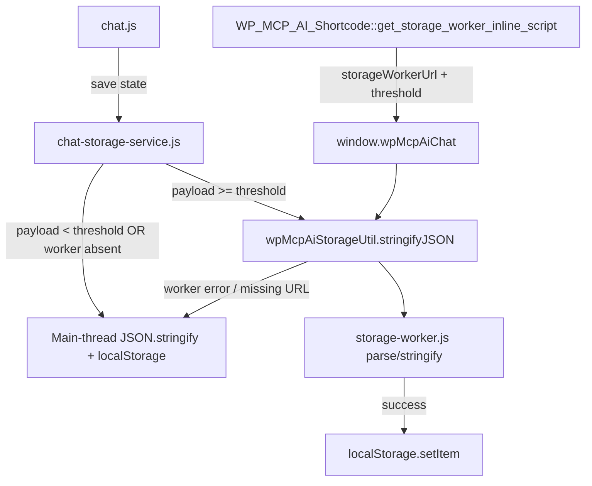

# 032 — Chat Web Worker Wiring — Implementation Plan

- **Status:** Ready for implementation
- **Date:** 2026-08-21
- **Last updated:** 2026-08-22 (added addon impact assessment, §5)
- **Scope:** Core plugin chat frontend (no addon code changes required; addon impact assessed in §5)
- **Related:** `chat-client-typescript-migration-implementation-plan.md`, `WEB-LLM-IMPLEMENTATION-PHASE-1.md`, `docs/features/performance/performance-improvements.md`

---

## 1. Problem Statement

An investigation into whether the chat frontend offloads heavy work revealed three
verified gaps. The **Docker media worker sidecar** (`addons/media-worker/`, port
3100) is *not* one of them — it is server-side infrastructure consumed via the PHP
trait `WP_MCP_AI_Media_Worker_Client`, and browser code never calls it. That
separation is correct and must not change.

| # | Finding | Evidence |
|---|---------|----------|
| 1 | The browser **storage worker chain is dead code**. `assets/js/storage-util.js` (+ TS source `assets/js/src/services/storage-util.ts`), `assets/js/storage-worker.js`, and `tests/js/storage-util.test.js` all exist, but no PHP enqueues the util, no PHP sets `storageWorkerUrl`, and no JS consumer references `window.wpMcpAiStorageUtil`. | Zero PHP references to `storage-util`/`storageWorkerUrl`; grep of `assets/js/chat.js` and `chat-storage-service.js` for `wpMcpAiStorageUtil` returns nothing. |
| 2 | **Conversation JSON serialisation runs on the main thread.** `assets/js/chat-storage-service.js` (bundled into `chat-bundle.js`) does raw `JSON.stringify`/`JSON.parse` in `saveConversationToStorage()`, `loadConversationFromStorage()`, and `cleanupOldStorageEntries()`. For long conversations (>10 KB) this blocks the main thread. | Read of `chat-storage-service.js` and `dist/storage.js`. |
| 3 | **The LLM Web Worker manager is loaded but never used, with a URL bug.** `includes/class-wp-mcp-ai-webworker-enqueue.php` conditionally enqueues `llm-worker-manager.js` and localizes `wpMcpAiWebWorker.workerUrl`, but the manager reads `window.wpMcpAiChat?.pluginUrl` — a key that exists in **no** `wpMcpAiChat` localization — and ignores the provided `workerUrl`. No JS instantiates `WP_MCP_AI_LLM_Worker_Manager`. | `assets/js/llm-worker-manager.js` L88–92; full key lists of `WP_MCP_AI_Shortcode::register_assets()` / `apply_script_localization()`. |

The repo already documents "Web Worker Integration (Already Implemented)"
(`docs/features/performance/performance-improvements.md`) — the wiring simply never
landed. This plan completes it.

---

## 2. Goals & Non-Goals

### Goals

1. Wire the existing storage worker so large conversation writes leave the main
   thread, with a synchronous main-thread fallback that is byte-for-byte identical
   to today's behaviour when the worker is unavailable.
2. Fix the LLM worker URL bug so the manager is at least correct and usable for the
   planned WebLLM Phase 4 work.
3. Make the offload tunable and instantly kill-switchable via a filter — no new
   settings UI, no new autoloaded options.

### Non-Goals (explicitly out of scope)

- ❌ No browser → media worker (port 3100) calls; tokens stay server-side.
- ❌ No changes to the stored conversation data format (worker is transparent).
- ❌ No changes to voice/VAD worker path (already wired and working).
- ❌ No async migration of `loadConversationFromStorage()` in this plan (see D1).
- ❌ No deletion of the LLM worker chain (WebLLM roadmap expects it — see D2).

---

## 3. Decisions

| ID | Decision | Rationale |
|----|----------|-----------|
| **D1** | Offload **writes only** in Phase 1: `saveConversationToStorage()` routes `JSON.stringify` through `wpMcpAiStorageUtil.stringifyJSON()` when payload ≥ threshold. `loadConversationFromStorage()` and `cleanupOldStorageEntries()` stay synchronous main-thread parses. | `JSON.parse` is ~3–5× faster than `stringify`; the save path is the jank source. `loadConversationFromStorage()` has synchronous callers (e.g. `memory-drawer.ts` `readTranscript()`); converting it to async ripples across the codebase. A `loadConversationFromStorageAsync()` can follow in a later PR if profiling justifies it. |
| **D2** | **Keep** the LLM worker chain (fix the URL bug, do not delete). The WebLLM roadmap (Phases 4–8) explicitly reserves Web Workers, and the compliance history shows the chain was deliberately kept code-present (not Pro-gated). | Deleting would conflict with the embedded-addon roadmap and `docs/operations/compliance/WORDPRESS_ORG_COMPLIANCE_*.md`. |
| **D3** | Reuse the existing **inline-script augmentation pattern** (`get_chat_memory_endpoints_inline_script()`) instead of editing the six `wpMcpAiChat` localization arrays. | The memory-endpoints snippet already augments `wpMcpAiChat` after every localization surface (shortcode, block, Elementor, embedded client, admin pages). A single `get_storage_worker_inline_script()` keeps the change to two call sites and survives later `wp_localize_script()` overwrites, exactly as the memory endpoints do. |
| **D4** | Threshold comes from config (`wpMcpAiChat.storageWorkerThreshold`, PHP filter `wp_mcp_ai_storage_worker_threshold`, default **10,000** chars). `0` disables offload entirely. | Matches the util's existing `WORKER_THRESHOLD = 10000` constant; gives a filter-based kill switch without new options. |
| **D5** | The **unload flush path always writes synchronously on the main thread.** | A worker write queued during `pagehide`/`beforeunload` may never complete. Data safety beats jank on unload. |

---

## 4. Target Architecture



- Worker file: `assets/js/storage-worker.js` (only `parse`/`stringify` actions;
  protocol `{ id, action, data }` → `{ id, success, result|error }`).
- Util: `assets/js/storage-util.js` exposes `window.wpMcpAiStorageUtil`
  (`parseJSON`, `stringifyJSON`, `cleanup`) with internal main-thread fallback.
- CSP check: the admin CSP (`includes/security/class-wp-mcp-ai-csp-headers.php`)
  has no `worker-src`, so `default-src 'self'` applies — same-origin worker files
  under the plugin URL are permitted. Verified in QA anyway.

---

## 5. Addon Impact Assessment

### 5.1 addons/embedded — no code changes required

Verified against `addons/embedded/` (`class-nvoos-embedded.php`, `assets/js/*`,
`tests/php/*`):

- **Reuses the core chat bundle.** The addon registers
  `wp-mcp-ai-embedded-llm-client` and adds it as a dependency of the core
  `wp-mcp-ai-chat` script (asserted by
  `test-embedded-provider-elementor-editor-block.php`,
  `test-multiple-widgets-embedded-provider.php`, and
  `test-embedded-provider-profession-fix.php`). Conversation persistence on
  embedded-provider chat surfaces therefore flows through the core
  `chat-storage-service.js` — Phase 1 covers embedded assistants automatically.
- **No storage-worker references.** Zero matches in `addons/embedded/assets/js/`
  for `storageWorkerUrl`, `wpMcpAiStorageUtil`, or `wpMcpAiChatStorage`.
- **Its own worker is unaffected.** `stt-whisper-cpp-worker.js` (STT) is spawned
  with a config URL + local fallback; the transformers/WebLLM clients spawn no
  workers of their own.
- **Embedded tests are unaffected by the augmentation** (they read
  `wp_scripts->get_data( SCRIPT_HANDLE, 'data' )`, not `'after'` inline scripts),
  but one new assertion is added in Phase 1 (Step 1.6) to pin the behaviour:
  an embedded-provider assistant must receive the same `storageWorkerUrl` /
  `storageWorkerThreshold` config.
- **WebLLM settings page untouched.** `wp_mcp_ai_enable_web_workers` continues to
  gate the core LLM worker manager; Phase 2's fix consumes the existing
  `wpMcpAiWebWorker.workerUrl` config.
- **Elementor-editor behaviour preserved.** The embedded client is already
  blocked in the Elementor editor; the core editor-path early return in
  `register_assets()` is unchanged.

### 5.2 addons/pro — verification only

The only Pro surface that localizes `wpMcpAiChat` is
`addons/pro/includes/metaboxes/class-wp-mcp-ai-project-management-ai-assistant-metabox.php`
(`ensure_chat_localization()`). No edits needed: the core `'after'` augmentation
survives the later localization, and a QA row covers it (§7 matrix).

---

## 6. Implementation Steps

### Phase 1 — Wire the Storage Worker

#### Step 1.1 — PHP: storage-worker inline augmentation

**File:** `includes/class-wp-mcp-ai-shortcode.php`

Add a static method mirroring `get_chat_memory_endpoints_inline_script()`:

```php
/**
 * Build an inline JS snippet that augments the localized `wpMcpAiChat`
 * object with the storage-worker URL and threshold.
 *
 * Mirrors get_chat_memory_endpoints_inline_script(): appended after every
 * wp_localize_script( SCRIPT_HANDLE, 'wpMcpAiChat', ... ) call so the
 * storage-util.js service can spawn the worker on every chat surface.
 *
 * @since 1.1.62
 *
 * @return string Inline JS snippet ready for wp_add_inline_script.
 */
public static function get_storage_worker_inline_script() {
    $threshold = (int) apply_filters( 'wp_mcp_ai_storage_worker_threshold', 10000 );
    $threshold = max( 0, $threshold );

    $worker_url = plugins_url( 'assets/js/storage-worker.js', WP_MCP_AI_FILE );

    $json = wp_json_encode(
        array(
            'storageWorkerUrl'       => esc_url_raw( $worker_url ),
            'storageWorkerThreshold' => $threshold,
        )
    );
    if ( false === $json ) {
        return '';
    }

    return 'window.wpMcpAiChat = window.wpMcpAiChat || {};'
        . 'if ( window.wpMcpAiChat.storageWorkerUrl === undefined ) {'
        . 'Object.assign( window.wpMcpAiChat, ' . $json . ' ); }';
}
```

Notes:

- No user gate — guest chat surfaces also benefit (unlike memory endpoints).
- `Object.assign` guard avoids clobbering keys another agent may have set.
- No new user input, no i18n strings, no new options. WPCS: escaping handled by
  `esc_url_raw()` + `wp_json_encode()`.
- There is **no** `storage-worker.min.js` (only `.js` + an orphaned map) — reference
  the plain file. If a minified build is added later, switch via the existing
  `resolve_js_asset_path()` pattern.

#### Step 1.2 — PHP: attach the snippet at the two established call sites

1. `WP_MCP_AI_Shortcode::localize_user_dependent_data()` (hooked to `'wp'`, covers
   shortcode, block, Elementor, embedded client). Add immediately after the existing
   memory-endpoints `wp_add_inline_script` call (~L416):

   ```php
   // Inject the storage-worker config (no user gate; benefits guests too).
   $storage_worker = self::get_storage_worker_inline_script();
   if ( '' !== $storage_worker ) {
       wp_add_inline_script( self::SCRIPT_HANDLE, $storage_worker, 'after' );
   }
   ```

2. `includes/admin/class-wp-mcp-ai-admin-test-page-base.php` →
   `enqueue_chat_assets()` — add the same two lines next to the existing
   memory-endpoints block (~L260).

   The remaining admin surfaces (`admin-multi-agent-dashboard.php`,
   `admin-build-assistant-page.php`, the Pro metabox `ensure_chat_localization()`)
   need **no edits**: the `'wp'` hook fires on admin pages too, and the `'after'`
   inline script executes after their later `wp_localize_script()` calls, so the
   augmentation is never stripped. This mirrors how the memory endpoints already
   behave on those pages. (Verify all three in QA, Step 1.7.)

#### Step 1.3 — JS: bundle the util into the chat bundle

**File:** `assets/js/chat-bundle.js`

Add an import **before** the storage-service import (import order matters):

```js
// Storage worker util (JSON offload helper) — must load before
// chat-storage-service, which consumes window.wpMcpAiStorageUtil.
import './storage-util.js';
```

**File:** `esbuild.config.js`

Add `'assets/js/storage-util.js'` to the `bundledFiles` array (~L591) so the build
size report accounts for it. No entry-point changes — the existing
`assets/js/chat-bundle.js → dist/chat-bundle.js` build carries the import for the
TS-build output path automatically.

#### Step 1.4 — JS: route large writes through the worker

**File:** `assets/js/chat-storage-service.js` (primary) and
`assets/js/src/services/storage.ts` (TS parity, same logic)

Modify `saveConversationToStorage()`:

- Read `threshold = ( window.wpMcpAiChat && window.wpMcpAiChat.storageWorkerThreshold ) || 10000;`
- If `threshold <= 0`, no util, or `JSON.stringify( payload ).length < threshold` →
  behave exactly as today (synchronous main-thread write, including the existing
  quota-exceeded cleanup retry).
- Otherwise: call `wpMcpAiStorageUtil.stringifyJSON( payload )`. On resolve, perform
  `localStorage.setItem( key, serialised )` inside the **same** try/catch /
  quota-retry logic currently used (extract it into a small `writeSerialised()`
  helper so both paths share the retry code). Return
  `{ success: true, offloaded: true }` from the public function (callers already
  treat the debounced return as fire-and-forget). On util rejection (worker error,
  missing URL), the util already falls back to a main-thread `JSON.stringify`, so
  the promise chain still resolves — no extra error path needed beyond logging.
- **Unload flush rule (D5):** when called with `options.immediate === true` from a
  `pagehide`/`beforeunload` handler, bypass the worker and write synchronously. The
  existing `immediate` flag is the hook for this; add an explicit comment.

Reference implementation shape:

```js
function performWrite( key, serialised ) {
    try {
        window.localStorage.setItem( key, serialised );
        return { success: true };
    } catch ( err ) {
        // Existing quota-exceeded cleanup retry preserved here.
        ...
    }
}
```

No changes to `loadConversationFromStorage()` or `cleanupOldStorageEntries()` in
this phase (D1).

#### Step 1.5 — JS: docblock touch-ups

- `assets/js/chat-bundle.js` header: add "Storage Worker Util (JSON offload)" to
  the bundle inventory list.
- `assets/js/storage-worker.js` and `assets/js/storage-util.js`: add a one-line
  `@since 1.1.62` note that the chain is now wired via
  `wpMcpAiChat.storageWorkerUrl` (doc-only, no behaviour change).

#### Step 1.6 — Tests

**Jest** (`tests/js/`, conventions per `tests/js/README.md`):

1. Extend `tests/js/storage-util.test.js`:
   - threshold boundary: below → main thread, at/above → `postMessage` dispatched.
   - worker round-trip: mocked worker replies with parsed/stringified result.
   - worker rejection → fallback path resolves with main-thread result.
   - `storageWorkerUrl` undefined → warning + main-thread fallback.
2. New `tests/js/storage-worker-wiring.test.js` (or extend an existing
   storage-service test): mock `window.wpMcpAiStorageUtil` and assert
   `saveConversationToStorage()` calls `stringifyJSON` only when payload ≥
   threshold and threshold > 0; assert `immediate`-unload path never calls the
   util.

**PHPUnit:**

3. New assertions (pattern from
   `addons/embedded/tests/php/test-embedded-client-knowledge-tools.php`, which
   parses the localized config): after rendering the shortcode, the printed
   `wpMcpAiChat` augmentation contains `storageWorkerUrl` (same-origin plugin URL)
   and `storageWorkerThreshold` = default 10000; with the
   `wp_mcp_ai_storage_worker_threshold` filter returning `0`, the snippet still
   prints (service reads 0 → offload disabled).

#### Step 1.7 — Manual QA

- Shortcode page + admin Test Assistant page: open a conversation, seed >10 KB of
  history, save; DevTools → Console shows no "Storage worker URL not configured";
  Performance panel shows the large `JSON.stringify` running in the worker thread.
- Block the worker (DevTools → Sources → worker URL 404, or temporarily
  `Object.defineProperty(window, 'Worker', ...)`): behaviour identical to today,
  console clean.
- Unload during a debounced save: reload → conversation intact.
- Admin CSP check: no CSP violations reported for the worker script.

### Phase 2 — Fix the LLM Worker URL Bug

**File:** `assets/js/llm-worker-manager.js`, `getWorkerUrl()` (L88–92):

```js
getWorkerUrl() {
    // Prefer the URL provided by WP_MCP_AI_WebWorker_Enqueue
    // (wpMcpAiWebWorker.workerUrl); fall back to pluginUrl.
    const webWorkerCfg = window.wpMcpAiWebWorker || {};
    if ( webWorkerCfg.workerUrl ) {
        return webWorkerCfg.workerUrl;
    }
    const pluginUrl = ( window.wpMcpAiChat && window.wpMcpAiChat.pluginUrl ) || webWorkerCfg.pluginUrl || '';
    if ( pluginUrl ) {
        return pluginUrl + 'assets/js/workers/llm-worker.js';
    }
    console.error( '[NV oOS Worker Manager] No worker URL configured; cannot create LLM worker' );
    return '';
}
```

Optional hardening (same PR, small): in `createWorker()`, throw a descriptive
error instead of `new Worker( '' )` when `getWorkerUrl()` returns empty.

No PHP changes needed — `wpMcpAiWebWorker.workerUrl` is already localized by
`includes/class-wp-mcp-ai-webworker-enqueue.php`. No deletion; the chain remains
available for WebLLM Phase 4 (D2).

### Phase 3 — Docs, Changelog, Build

1. **Docs:** update `docs/features/performance/performance-improvements.md` — the
   "Web Worker Integration (Already Implemented)" section gains a short "Wiring"
   subsection: URL source, threshold filter, fallback semantics, and the explicit
   note that the Docker media worker is server-side only and never called by the
   browser.
2. **Changelog:** entry under the next version (repo convention, e.g. `[1.1.62]`):
   "Changed — Chat storage worker wired (`wp_mcp_ai_storage_worker_threshold`
   filter, main-thread fallback)" and "Fixed — LLM worker manager now reads
   `wpMcpAiWebWorker.workerUrl`".
3. **Build:** `npm run build` — confirm `chat-bundle.min.js` grows only by the
   util's size (~2 KB pre-min) and the esbuild report lists the updated
   `bundledFiles` count.

---

## 7. Validation Matrix

| Layer | Command / check |
|-------|-----------------|
| JS lint | `npm run lint:js` (edited files) |
| TS lint + types | `npm run lint:ts`, `npm run typecheck` |
| Jest | `npm test -- tests/js/storage-util.test.js tests/js/storage-worker-wiring.test.js` |
| Build | `npm run build` |
| PHP lint | `composer run lint` |
| PHP compat | `composer run lint:compat` |
| PHPUnit | `composer run test` (targeted: shortcode/localization tests first) |
| Embedded addon | PHPUnit `addons/embedded/tests/php/test-embedded-*`; manual embedded-provider assistant page (Section 6, Step 1.7 checklist) |
| Manual | Section 6, Step 1.7 checklist |

---

## 8. Acceptance Criteria

- [ ] `window.wpMcpAiChat.storageWorkerUrl` + `storageWorkerThreshold` present on
      shortcode, block, Elementor, embedded client, admin test/build/dashboard
      pages, and the Pro metabox modal (verified via console, all six surfaces).
- [ ] Worker receives `stringify` messages for ≥10 KB conversations (DevTools
      worker inspector or console instrumentation).
- [ ] Worker blocked / unsupported / URL missing → behaviour identical to today,
      zero console errors.
- [ ] Unload flush always persists (D5 verified in QA).
- [ ] `wp_mcp_ai_storage_worker_threshold` filter set to `0` disables offload.
- [ ] `llm-worker-manager.js` `getWorkerUrl()` prefers `wpMcpAiWebWorker.workerUrl`
      and fails loudly when neither source exists.
- [ ] Embedded-provider assistant chat page receives the same
      `storageWorkerUrl` config and offloads writes identically (no addon code
      changes; verified per §5.1).
- [ ] All validation-matrix commands pass.
- [ ] Docs + CHANGELOG updated.

---

## 9. Risks & Mitigations

| # | Risk | Probability | Impact | Mitigation |
|---|------|-------------|--------|------------|
| R1 | Worker write lost on page unload (async write + unload race) | Medium | High | D5: unload flush writes synchronously; debounced saves still complete in normal navigation. |
| R2 | CSP blocks worker on some hosting/CDN setups | Low | Medium | `default-src 'self'` covers same-origin plugin files; util falls back to main thread on any worker failure. |
| R3 | Quota-exceeded retry logic diverges between sync/async paths | Medium | Medium | Extract shared `performWrite()` helper (Step 1.4); quota retry exercised in Jest. |
| R4 | Other agent concurrently edits chat bundle / esbuild list | Low | Low | Per repo rules: check `git log` + `AGENTS.md` before starting; scope is 3 JS files + 2 PHP files, all in core chat surface. |
| R5 | `storageWorkerThreshold` drift between PHP default and util constant | Low | Low | Single source of truth = PHP filter → config; service reads config, falls back to 10000. |
| R6 | Bundle size growth | Low | Low | ~2 KB pre-minification; verified in build report. |

---

## 10. Rollout & Rollback

- **Default on, degrade to today's behaviour** when the worker is absent — no
  feature flag required.
- **Kill switch:** `add_filter( 'wp_mcp_ai_storage_worker_threshold', '__return_zero' );`
  restores 100% main-thread behaviour without a code deploy.
- **Rollback:** each phase is independently revertible; Phase 1's PHP/JS changes
  are additive (no data-format changes), so a git revert leaves stored
  conversations untouched.

---

## 11. PR Breakdown & Sequencing

1. **PR A — Storage worker wiring (Phase 1).** Files:
   `includes/class-wp-mcp-ai-shortcode.php`,
   `includes/admin/class-wp-mcp-ai-admin-test-page-base.php`,
   `assets/js/chat-bundle.js`, `esbuild.config.js`,
   `assets/js/chat-storage-service.js`, `assets/js/src/services/storage.ts`,
   tests (Jest + PHPUnit, incl. the embedded-provider assertion from Step 1.6).
   Regression-run `addons/embedded/tests/php/test-embedded-*` and the
   `addons/pro` chat-metabox tests. Independent of PR B.
2. **PR B — LLM worker URL fix (Phase 2).** Files:
   `assets/js/llm-worker-manager.js`. Independent of PR A.
3. **PR C — Docs + changelog (Phase 3).** Depends on A and B.

Before starting each PR: check `git log` for overlapping agent work, read
`includes/README.md` (PHP folder convention) and the repo security checklist
(`.context/security-checklist.md` — no new input/sanitisation surface is
introduced here).

---

## 12. Definition of Done

All acceptance criteria in §8 pass, the validation matrix in §7 is green, PRs
A–C are merged, and the documented "Web Worker Integration (Already Implemented)"
claim in `docs/features/performance/performance-improvements.md` finally matches
reality.
