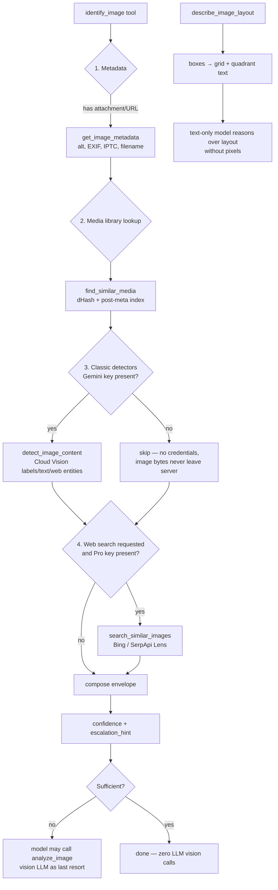

# Proposal 043: Non-LLM Image Identification Pipeline

**Status:** Proposed
**Phase:** 0 — Design & Sequencing
**Target:** Deterministic, cheap-first image understanding (metadata → hash lookup → classic detectors → visual web search) as an alternative to sending pixels to a vision LLM.

---

## 1. Problem

Every "what is on this image?" request currently routes to a vision LLM (`analyze_image`) or a vision-provider OCR call (`extract_image_text`), which costs tokens, adds latency, and produces non-deterministic output. Most image questions are answerable with cheaper, deterministic signals — WordPress metadata, perceptual-hash lookups in the media library, classic (non-LLM) detection APIs, and reverse-image web search — and only a minority genuinely need a vision model.

## 2. Research Synthesis

The cheapest-first escalation ladder below is the documented best practice in the LLM-vs-classic extraction literature ([Vellum](https://www.vellum.ai/blog/document-data-extraction-llms-vs-ocrs), [Parsli](https://parsli.co/blog/llm-ocr-vs-traditional-ocr)): OCR/detection first, escalate to a vision LLM only on low confidence.

| Rung | Method | Cost | Deterministic? |
|---|---|---|---|
| 1 | WordPress metadata (alt / title / caption / EXIF / IPTC / filename) | Free | Yes |
| 2 | Perceptual-hash lookup against the media library | Free | Yes |
| 3 | Classic detectors (labels, OCR text, logos, landmarks, faces, web entities) | ~Free | Yes |
| 4 | Reverse-image web search (Bing Visual Search, Google Lens via SerpApi) | Per-query | Yes |
| 5 | Vision LLM (`analyze_image`) | Most expensive | No — only when rungs 1–4 are insufficient |

Two research findings drive the design:

1. **"Model knows the layout" is a real technique.** Either (a) describe a *known* template layout to the model as text ("logo top-right, body text left 70%"), or (b) convert detector bounding boxes into a text layout description (the text-mode analogue of Set-of-Mark prompting, arXiv:2310.11441). A text-only model can then reason about image structure without receiving a single pixel.
2. **npm packages belong in the media-worker sidecar, not the plugin.** `addons/media-worker/` already ships tesseract.js OCR (`POST /api/ocr/recognize`) and sharp; new npm-based work (e.g. sharp pHash) should extend the worker, while the plugin keeps pure-PHP fallbacks.

## 3. What Already Exists

| Capability | Location | Status |
|---|---|---|
| LLM image analysis | `includes/tools/class-wp-mcp-ai-tool-analyze-image.php` | ✅ exists — the thing we route around |
| LLM OCR | `includes/tools/class-wp-mcp-ai-tool-extract-image-text.php` | ✅ exists (OpenAI/Anthropic/Gemini/vLLM) |
| Classic object localization (boxes) | `includes/tools/class-wp-mcp-ai-tool-vision-object-localization.php` (Google Cloud Vision `OBJECT_LOCALIZATION`) | ✅ exists |
| Catalog visual search | `includes/tools/class-wp-mcp-ai-tool-vision-product-search.php` | ✅ exists |
| Detector pipeline (OWLv2/Ollama + optional VLM) | `addons/pro/includes/tools/vision-analysis/` (`analyze_image_objects`) | ✅ exists |
| Classic OCR (tesseract.js worker → system tesseract) | `addons/pro/includes/services/class-wp-mcp-ai-ocr-service.php` (`provider => 'tesseract'`) + worker `routes/ocr.js` | ✅ exists, **not exposed as a tool** |
| Metadata-first tool | — | ❌ missing |
| pHash media lookup | — | ❌ missing |
| Layout-text composer | — | ❌ missing |
| Escalation orchestrator | — | ❌ missing |
| Reverse-image web search | — | ❌ missing |

## 4. Architecture

## 5. Design Decisions

### D1 — New tool, not an extension, for classic Cloud Vision features
`vision_object_localization` has a tested contract (single `OBJECT_LOCALIZATION` feature). Folder convention is one tool per responsibility. **Add `detect_image_content`** (labels, text, web entities, logos, landmarks, faces, safe search) and extract a shared `WP_MCP_AI_Cloud_Vision_Client` service so both tools share key resolution and error handling. `vision_object_localization` keeps its exact behavior; its existing tests stay green.

### D2 — Classic OCR is a Pro tool wrapping the existing service
`WP_MCP_AI_OCR_Service` already implements worker-tesseract.js-first → system-tesseract fallback. Add **`ocr_image_classic`** (Pro) that pins `provider => 'tesseract'` and never touches a VLM. No new npm packages required. Pro placement follows `.context/pro-vs-base.md` (worker routing lives in Pro services).

### D3 — pHash via pure-PHP dHash, not npm
GD-based 64-bit dHash (~60 lines, PHP 7.4-safe) needs no binary and no sidecar, and is wp.org-safe. Hashes persist as attachment post meta (`_wp_mcp_ai_image_dhash`), computed lazily with an optional cron backfill. A worker sharp-pHash route is recorded as a later enhancement, not built now.

### D4 — Metadata tool is pure WordPress
`get_image_metadata` aggregates alt/title/caption/description, `wp_read_image_metadata()` EXIF, `getimagesize()` IPTC-ish info, dimensions, filename, and URL. Base, free, deterministic.

### D5 — Layout composer implements the "model knows the layout" idea
`describe_image_layout` accepts the JSON box array already produced by `vision_object_localization` / `analyze_image_objects` (or runs object localization itself when the Gemini key is configured) and emits a deterministic text description: dimensions, 3×3 grid quadrant per object, relative size, and overlap notes. This is the text-mode Set-of-Mark analogue; text-only models can consume it with zero vision tokens.

### D6 — `identify_image` orchestrates the ladder, never calls a vision LLM
Runs rungs 1–4 cheap-first with graceful degradation: a missing key or skipped web search is reported as `skipped` with a reason, never an error. Returns a composite envelope with a confidence score and an `escalation_hint` telling the model whether to fall back to `analyze_image`. Web search is **opt-in per call** (`include_web_search`, default `false`) because it sends image bytes to a third party.

### D7 — Reverse-image search is Pro (paid third-party API)
`search_similar_images` uses the official Bing Visual Search API, with SerpApi Google Lens as an alternative provider (Google Lens has no official API). Keys live in Pro settings; per `.context/pro-vs-base.md`, paid third-party APIs are Pro.

## 6. Base vs Pro Placement

| Deliverable | Distribution | Rationale |
|---|---|---|
| `get_image_metadata` | Base | Pure WordPress |
| `find_similar_media` (dHash) | Base | Pure PHP + GD, no external calls |
| `describe_image_layout` | Base | Pure text transform; optional Cloud Vision step degrades without a key |
| `identify_image` | Base | Orchestrates Base tools; external steps are key-gated |
| `detect_image_content` | Base | Reuses the existing Cloud Vision key pattern (like `vision_object_localization`) |
| `ocr_image_classic` | Pro | Wraps Pro OCR service + worker routing |
| `search_similar_images` | Pro | Paid third-party APIs (Bing/SerpApi) |

## 7. Security & wp.org Compliance

- **Credentials short-circuit:** every external step mirrors the existing `wp_mcp_ai_vision_missing_api_key` pattern — user image data must never leave the server without a configured key; missing keys are `skipped`, not errors, inside `identify_image` and hard errors only in direct external tools.
- **SSRF guard:** any URL the plugin fetches server-side passes `WP_MCP_AI_URL_Guard` (`includes/security/class-wp-mcp-ai-url-guard.php`).
- **Capability:** `edit_posts` default with per-tool `wp_mcp_ai_{slug}_required_capability` filters, consistent with existing vision tools.
- **Privacy:** tool descriptions and guidance explicitly state when bytes are sent to Google/Bing/SerpApi.
- **Canonical envelope:** success array or `WP_Error` — enforced by the `WPMCPAI.Tools.CanonicalReturnEnvelope` sniff; two-gate sanitisation (`SanitizeAtEntry`).
- **PHP 7.4:** no enums/union types; GD usage guarded with `function_exists( 'imagecreatetruecolor' )` fallback.

## 8. Success Metrics

1. ≥ 80% of `identify_image` calls resolve without a vision-LLM fallback in the Docker test environment.
2. All new tools have dedicated PHPUnit coverage; no regression in the existing `test-vision-tools.php` suite.
3. `composer run lint`, `lint:compat`, and the CI PHPUnit workflow stay green.
4. Deterministic outputs: identical input twice → identical envelope (except explicit web-search results).

## 9. Open Questions

- Should `identify_image` include the layout summary by default, or only when objects are detected? (Default: include when rung 3 produced boxes.)
- Cron backfill for the dHash index: reuse `wp_mcp_ai_daily` or a new schedule? (Proposal: reuse `wp_mcp_ai_daily`, cap 100 attachments per run.)
- Bing vs SerpApi default: proposal defaults to Bing when only one key is present; SerpApi only when explicitly selected.

## 10. References

- [`docs/project/proposals/043-non-llm-image-identification-implementation-plan.md`](./043-non-llm-image-identification-implementation-plan.md) — phased checklist
- `.context/tool-registry.md`, `.context/pro-vs-base.md`, `.context/media-worker.md`, `.context/security-checklist.md`
- Set-of-Mark prompting: arXiv:2310.11441
- LLM vs classic extraction: Vellum "Document Data Extraction in 2026", Parsli "LLM OCR vs Traditional OCR"
