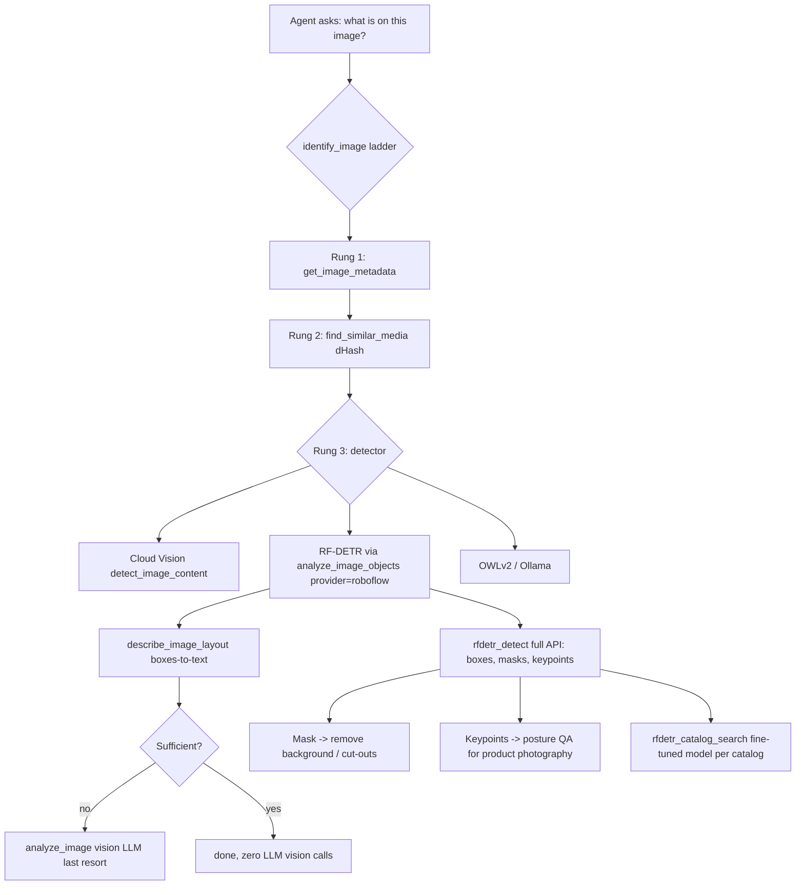

# Proposal 049: RF-DETR Cognition Enhancement

**Status:** Proposed
**Phase:** 0 — Design & Sequencing
**Branch:** `proposal/rf-detr-cognition-enhancement` (from `alpha-working` @ v1.1.89, `2adcdc7a6d`)
**Target:** Upgrade the plugin's vision cognition (perception) layer with a self-hostable, Apache-2.0, state-of-the-art detector — RF-DETR — adding closed-vocabulary detection, instance-segmentation masks, and person keypoints to the existing cheap-first ladder without displacing any current provider.

---

## 1. Problem

The plugin's vision cognition stack answers "what is on this image?" through four routes today:

| Route | Tool | Cost | Deterministic? | Vocab |
|---|---|---|---|---|
| Vision LLM | `analyze_image` / VLM modes of `analyze_image_objects` | High (tokens) | No | Open |
| Cloud Vision (managed) | `detect_image_content`, `vision_object_localization` | Per-query + Google key | Yes | Open |
| HF OWLv2 (hosted) / Ollama (local) | `analyze_image_objects` `provider=huggingface|ollama` | Hosted key or local GPU | Yes | Open (text-prompted) |
| Classic OCR / metadata / dHash | ladder rungs 1–2, `ocr_image_classic` | Free | Yes | — |

What is missing:

1. **No self-hostable SOTA detector.** Ollama vision models exist, but no Ollama pipeline matches a dedicated detection transformer for box accuracy and latency. HuggingFace OWLv2 is open-vocabulary but hosted-only in the current wiring and slower/less accurate on COCO-class content. Cloud Vision is accurate but is a managed Google service — bytes leave the server.
2. **No instance segmentation masks or keypoints.** Every existing detector returns boxes only. Masks (background removal, object cut-outs for the design stack) and pose keypoints (product-photography QA, apparel) are unsupported.
3. **No closed-vocabulary high-precision option.** Open-vocabulary models hallucinate plausible-but-wrong classes; a COCO-80 or fine-tuned closed model is the industry-standard "precision rung" for inventory/catalog counting.
4. **No catalog-specific recognition.** WooCommerce product recognition (detect "this SKU's bottle shape" vs competitor packaging) needs a fine-tunable detector deployable through one HTTP API — RF-DETR's design target (RF100-VL few-shot domain transfer).

## 2. Research Synthesis

### 2.1 Industry standards for agent vision cognition

The 2025–2026 multimodal-agent literature converges on a three-layer pattern that this plugin already half-implements ([GetStream — Multimodal AI Agent Architecture](https://getstream.io/blog/multimodal-ai-agent-architecture/), [Multi-Modal AI Agents in Production](https://niteagent.com/blog/multi-modal-ai-agents-production-2026/), [MoClaw routing guide](https://unifuncs.com/s/H1lPNIuX), [AI Agent Systems survey](https://arxiv.org/html/2601.01743v1)):

1. **Perception layer** — dedicated CV models handle precision tasks (detection, OCR, layout); general VLMs handle synthesis only.
2. **Routing layer** — route by task economics: cheaper/faster/deterministic models for simple or precision work; stronger models reserved for reasoning and judgment. "Route precision tasks to a specialized CV model instead of expecting the multimodal model to catch everything" is the cited standard practice.
3. **Reasoning/fusion layer** — one reasoning model consumes structured perception output (boxes, counts, masks, layout text) and fuses it into the response.

NV oOS already encodes layers 2–3 (Proposal 043's ladder, `identify_image` escalation hints, `describe_image_layout` as the text-mode Set-of-Mark analogue). The gap is layer 1 depth: the perception layer needs a deterministic, self-hostable, high-accuracy detector. RF-DETR is the current best-in-class fit for that slot.

### 2.2 RF-DETR facts ([roboflow/rf-detr](https://github.com/roboflow/rf-detr), [ICLR 2026 paper, arXiv:2511.09554](https://arxiv.org/abs/2511.09554))

- **Architecture:** Real-time detection transformer on a DINOv2 backbone, built from LW-DETR + Deformable DETR. DINOv2 features are the source of its strong few-shot domain adaptability (tops RF100-VL).
- **Capabilities in one API:** object detection, instance segmentation, keypoint detection (preview).
- **Benchmarks (COCO val2017, SAB-measured, TensorRT FP16 T4):**

| Alias | AP50 | AP50:95 | Latency | Params | License |
|---|---|---|---|---|---|
| `rfdetr-nano` | 67.6 | 48.4 | 2.3 ms | 30.5 M | Apache 2.0 |
| `rfdetr-small` | 72.1 | 53.0 | 3.5 ms | 32.1 M | Apache 2.0 |
| `rfdetr-medium` | 73.6 | 54.7 | 4.4 ms | 33.7 M | Apache 2.0 |
| `rfdetr-large` | 75.1 | 56.5 | 6.8 ms | 33.9 M | Apache 2.0 |
| `rfdetr-xlarge` △ | 77.4 | 58.6 | 11.5 ms | 126.4 M | PML 1.0 |
| `rfdetr-2xlarge` △ | 78.5 | 60.1 | 17.2 ms | 126.9 M | PML 1.0 |
| `rfdetr-seg-*` (N–2XL) | 63.0–73.1 | 40.3–49.9 | 3.4–21.8 ms | 33.6–38.6 M | Apache 2.0 |
| `rfdetr-keypoint-preview` | — | 71.8 (OKS) | 9.7 ms | 126.4 M | Apache 2.0 |

- **Versus incumbents (all rows measured in the same SAB harness):** RF-DETR-S (72.1 AP50) beats YOLO11-L (64.9) and D-FINE-L (74.9 at 7.5 ms vs RF-DETR-S 3.5 ms is comparable accuracy at ~2× lower latency). RF-DETR is the **first real-time detection transformer past 60 AP50:95** (2XL). RF-DETR-Seg-2XL (49.9 mask mAP) doubles YOLOv11-XL-Seg (40.1).
- **Licensing is the decisive differentiator vs YOLO:** YOLO11/YOLO26 are AGPL-3.0 — distribution-hostile for a GPL plugin ecosystem that wants user-hosted inference recipes. RF-DETR Nano→Large, all Seg sizes, and the keypoint preview are **Apache 2.0**; only XL/2XL (`rfdetr_plus`) are PML 1.0. → Default exposure must be Apache-only; PML sizes opt-in.
- **Deployment surface (uniform HTTP API):** `POST /infer/{model_id}` against (a) Roboflow Inference self-hosted Docker (`http://<host>:9001`), (b) the Serverless Cloud API (`https://serverless.roboflow.com`), or (c) a dedicated deployment — identical contract, so the plugin needs one client for all three trust tiers.
- **Fine-tuning:** the DINOv2 backbone transfers with few examples (RF100-VL results); training via the Roboflow platform (incl. NAS), the Colab fine-tune notebook, or local `pip install rfdetr`. Fine-tuned checkpoints deploy through the same Inference API — no second integration.

### 2.3 Where RF-DETR fits NV oOS

## 3. What Already Exists

| Capability | Location | Status |
|---|---|---|
| Cheap-first ladder + orchestrator | `includes/tools/class-wp-mcp-ai-tool-identify-image.php` | ✅ exists (Proposal 043 shipped) |
| Box→text layout composer | `includes/tools/class-wp-mcp-ai-tool-describe-image-layout.php` | ✅ exists — consumes any detector's box JSON |
| Detector tool with provider enum | `addons/pro/includes/tools/vision-analysis/class-wp-mcp-ai-tool-analyze-image-objects.php` (`provider: auto|huggingface|ollama|openai|anthropic|gemini`) | ✅ exists — new provider is an enum extension |
| Count normalizer (detector owns the count) | `addons/pro/includes/tools/vision-analysis/class-wp-mcp-ai-vision-count-normalizer.php` | ✅ exists |
| Provider service pattern (fail-closed key, endpoint URL, payload cap) | `addons/pro/includes/services/class-wp-mcp-ai-hf-vision-inference-service.php` | ✅ exists — the template for the new service |
| Pro vision settings (`va_*` keys) | `addons/pro/includes/admin/class-wp-mcp-ai-vision-analysis-settings.php` | ✅ exists — new keys slot in |
| Sidecar philosophy | `addons/media-worker/` (Node) + Roboflow Inference (Python, Docker) | ✅ exists — RF-DETR's server IS the sidecar |
| Roboflow/RF-DETR client | — | ❌ missing (greenfield; zero repo references) |
| Masks / keypoints / catalog detection | — | ❌ missing |

## 4. Design Decisions

### D1 — One Pro service `WP_MCP_AI_Roboflow_Inference_Service` (mirror the HF vision service)
`addons/pro/includes/services/class-wp-mcp-ai-roboflow-inference-service.php`. Public surface:
- `infer( string $image_base64, string $model_id, float $confidence = 0.5, float $iou = 0.5, array $extra = array() )` → canonical result array or `WP_Error`
- `get_api_key()` — `va_roboflow_api_key` with `WP_MCP_AI_Credential_Resolver` fallback (same pattern as `WP_MCP_AI_HF_Vision_Inference_Service::get_api_key()`)
- `get_api_url()` — `va_roboflow_api_url`, default `https://serverless.roboflow.com`, self-host `http://<host>:9001` supported
- Normalizes the `{predictions: [{x, y, width, height, confidence, class, class_id, detection_id, points[] (masks), keypoints[]}]}` response into the plugin's `{label, confidence, box:[x1,y1,x2,y2], mask?, keypoints?}` shape — provider JSON never leaks into tool output
- `MAX_PAYLOAD_BYTES` cap + downscale guidance, reusing the vision-analysis conventions
- Class-name map for the 80 COCO classes (Apache checkpoints) + `class_name` passthrough for fine-tuned models

### D2 — `roboflow` becomes a detection provider inside `analyze_image_objects` (no new slug)
Extend the `provider` enum with `roboflow`; extend the per-toolkit settings with `va_roboflow_api_key`, `va_roboflow_api_url`, `va_roboflow_model` (default `rfdetr-small`). The **detector owns the count** invariant is untouched: RF-DETR boxes flow through `WP_MCP_AI_Vision_Count_Normalizer` exactly like OWLv2 boxes. Zero new tool surface, one new provider — lowest-friction adoption for existing assistants.

### D3 — New tool `rfdetr_detect` for the full API (Pro, vision-analysis toolkit)
Boxes alone fit the count contract; masks and keypoints do not. One tool, three `task`s (`detect` | `segment` | `keypoints`) because all three hit the same endpoint and alias family:
- `detect` → `{label, confidence, box}` list (COCO or fine-tuned classes)
- `segment` → boxes + mask polygons (normalized points) — first mask-capable tool in the stack
- `keypoints` → person keypoints `{class, x, y, confidence}` per instance (17 COCO skeleton names)
- Params: image source (reuses `WP_MCP_AI_Tool_Image_Base`), `model_id` override, `confidence`, `iou`, `max_results`
- Capability `edit_posts` + `wp_mcp_ai_{slug}_required_capability` filter; category `vision`

### D4 — New tool `rfdetr_catalog_search` for fine-tuned models (Pro, e-commerce toolkit scope)
Detects catalog-specific objects (brand packaging, SKU-specific products) via a fine-tuned model. `va_roboflow_catalog_model` holds the model reference. Two resolution modes: model alias (`rfdetr-*` style) or `workspace/project/version` path for Roboflow-platform-trained models. Output: ranked detections with class names from the checkpoint — the structured signal WooCommerce assistants need for "is product X in this photo, and where?".

### D5 — Three trust tiers, one client, explicit privacy labels
| Tier | `va_roboflow_api_url` | Privacy posture |
|---|---|---|
| Self-hosted | `http(s)://<host>:9001` | bytes stay on-premises — the recommended default for production |
| Dedicated | customer's deployment URL | bytes go to the customer's single-tenant Roboflow deployment |
| Serverless | `https://serverless.roboflow.com` | bytes go to Roboflow's hosted API (needs `va_roboflow_api_key`) |

Tool descriptions state which tier is active. Self-host without an API key must work (Inference server does not require one locally) — this is the privacy story that Cloud Vision cannot offer.

### D6 — SSRF guard on the configured endpoint + HTTPS rule
`va_roboflow_api_url` passes `WP_MCP_AI_URL_Guard::validate()` on every request. Non-loopback endpoints must be HTTPS (clear HTTP only for `localhost`/`127.0.0.1`/RFC-1918 ranges, where the Inference server is standard). The API key is sent as an `Authorization` header (serverless/dedicated) and omitted entirely for self-host.

### D7 — Ladder integration without disturbing Proposal 043 contracts
- `identify_image` rung 3: when `roboflow` is configured, RF-DETR becomes an eligible detector (documented as an alternative to the Cloud Vision rung; default order unchanged). **`identify_image` still never calls a vision LLM.**
- `describe_image_layout` consumes RF-DETR boxes as-is — box JSON is already detector-agnostic (normalized `[x1,y1,x2,y2]`).

### D8 — Masks feed the existing media pipeline; keypoints feed photography QA
- `rfdetr_detect` `task=segment` mask polygons are convertible to GD mask canvases → power a later `remove_background` enhancement in the Pro image-production toolkit (recorded as follow-on, not built here).
- Keypoints enable deterministic "subject centered? limb crop? product visibility?" checks — the perception input for `design-product-photography`-style workflows.

### D9 — License gating (Apache-only by default)
Default model lists expose Apache 2.0 aliases only (`rfdetr-nano|small|medium|large`, `rfdetr-seg-*`, `rfdetr-keypoint-preview`). XL/2XL (PML 1.0 via `rfdetr_plus`) require an explicit admin toggle that displays the PML notice. YOLO remains out of scope for this proposal precisely because AGPL blocks redistribution of user-facing recipes.

### D10 — No Python in the plugin
RF-DETR runs in the Roboflow Inference Docker container — the Python sidecar, consistent with the media-worker rule ("npm packages belong in the worker, pure-PHP fallbacks in the plugin"). The plugin ships only the HTTP client + docs recipe (`docs/` deployment guide with a `docker compose` snippet).

## 5. Base vs Pro Placement

| Deliverable | Distribution | Rationale |
|---|---|---|
| `WP_MCP_AI_Roboflow_Inference_Service` | Pro | API-backed provider service; `.context/pro-vs-base.md` (paid third-party APIs + sidecar bridges are Pro) |
| `roboflow` provider in `analyze_image_objects` | Pro | extends an existing Pro tool |
| `rfdetr_detect` | Pro | vision-analysis toolkit |
| `rfdetr_catalog_search` | Pro | paid fine-tuned model path; e-commerce toolkit |
| `va_*` settings + admin UI | Pro | vision-analysis settings already Pro |
| `identify_image` rung-3 source wiring | Base (1 file, additive) | the ladder itself is Base; the new source only activates when the Pro service is present and configured — **no key, no behavior change** |
| Deployment guide (Docker compose) | Docs (Base repo) | docs are shared |

Why the detector stays Pro while the ladder stays Base: Base must remain sidecar-free and credential-free (wp.org rules + `pro-vs-base.md`). RF-DETR requires either a Roboflow key (serverless) or a Python Docker sidecar (self-host) — both are Pro-tier runtime responsibilities. The single Base-file change (rung 3) is capability-gated, key-gated, and behavior-neutral when the Pro addon is absent.

### 5.1 Ecosystem port (base+pro → Content Graph Pro)

The repo ships two Pro distribution surfaces, and this proposal covers both:

1. **Pro addon** (`addons/pro/includes/`) — the monolith Pro runtime this proposal primarily targets.
2. **Standalone Content Graph Pro addon** (`plugins/nvoos-content-graph-pro/src/`) — receives **byte-identical ports** of every Pro file per the ecosystem port loop (`.agents/skills/mcp-ai-wpoos-ecosystem-port/SKILL.md`; tracker `docs/project/ecosystem-port-tracker.md`).

Current port state: the vision-analysis toolkit is **not yet ported** (`src/tools/` has no `vision-analysis/`; neither `WP_MCP_AI_HF_Vision_Inference_Service` nor the toolkit tools exist under `src/`). It slots into **Wave F3 (pro-media)** of `docs/project/plans/base-pro-ecosystem-port-plan.md`; `rfdetr_catalog_search` slots into **Wave F2 (e-commerce)**; the new service follows the F7 service-bridge pattern.

Port implications for RF-DETR:

| Cluster | Source (monolith) | Destination (CG Pro) | Wave |
|---|---|---|---|
| Vision-analysis toolkit + RF-DETR service | `addons/pro/includes/tools/vision-analysis/*` + `addons/pro/includes/services/class-wp-mcp-ai-roboflow-inference-service.php` | `src/tools/vision-analysis/*` + `src/services/` | F3 |
| E-commerce slice | `addons/pro/includes/tools/ecommerce/class-wp-mcp-ai-tool-rfdetr-catalog-search.php` | `src/tools/ecommerce/` | F2 |

Port rules that apply (from the skill, no exceptions):

- **Byte-identical bodies** with only the documented transforms: port-note header, `declare(strict_types=1);`, text-domain swap `mcp-ai-wpoos-pro` → `nvoos-content-graph-pro`, path swaps `WP_MCP_AI_PRO_PATH . 'includes/` → `NVOOS_CONTENT_GRAPH_PRO_PATH . 'src/`.
- **Standalone-only wiring**: slim `src/tools/vision-analysis/init.php` with the full-body `! defined( 'WP_MCP_AI_PATH' )` guard; tool filter `wp_mcp_ai_pro_register_vision_analysis_tools( $tools )` on `wp_mcp_ai_pro_tools`; ecosystem registration via `WP_MCP_AI_Pro_Tool_Adapter` + the AI addon's `GraphToolAdapter`; a `toolkit_vision_analysis` module in `WP_MCP_AI_Pro_Module_Registry::define_modules()`; the entry-autoloader subtree probe in `nvoos-content-graph-pro.php`.
- **Settings seam**: `va_roboflow_*` keys are read from the `wp_mcp_ai_settings` option directly in standalone mode (same seam as other ported settings consumers) — no admin-screen port in the first cluster.
- **Monolith-only, does not port**: the `identify_image` rung-3 change (Base tool; standalone CG installs have no `identify_image` — they surface RF-DETR through `analyze_image_objects`, `rfdetr_detect`, and `rfdetr_catalog_search` directly). Documented as a deviation in the cluster PR.
- **D-NOBASE honored**: the port cluster changes nothing under `includes/`; the ladder wiring ships in the base+pro repo first and the port only consumes the Pro files.
- **Roboflow Inference server stays external** (Python Docker sidecar, like the media worker) — only the PHP bridge ports; the deployment guide ships in docs.

## 6. Security & wp.org Compliance

- **Credentials fail closed:** missing `va_roboflow_api_key` for serverless → `WP_Error` (`wp_mcp_ai_roboflow_missing_api_key`) in direct tools, `skipped`+reason inside any orchestrator — mirrored from `wp_mcp_ai_vision_missing_api_key`. Self-host + no key is a valid configuration (no auth on local Inference).
- **SSRF:** configured API URL passes `WP_MCP_AI_URL_Guard::validate()`; DNS-rebinding hardening documented in tests.
- **HTTPS enforcement** for all non-loopback endpoints (see D6).
- **Payload discipline:** `MAX_PAYLOAD_BYTES` cap (5 MB, matching HF service); oversized images downscaled before upload; base64 scrubbed from logs (two-gate sanitisation).
- **Capability:** `edit_posts` default + per-tool filter — same as all vision tools.
- **Canonical envelope:** success array or `WP_Error` (never `array('success'=>false, ...)`); `WPMCPAI.Tools.CanonicalReturnEnvelope` + `SanitizeAtEntry` sniffs stay green.
- **PHP:** Pro tier is PHP 8.1+ (vision-analysis README); no enums; strict types consistent with folder conventions.
- **Licensing hygiene:** Apache-2.0 aliases only by default; PML gated behind explicit consent (D9). No AGPL code or weights referenced in shipped artifacts.

## 7. Success Metrics

1. `analyze_image_objects` with `provider=roboflow` returns correct COCO-class counts for the existing vision-analysis fixtures with 0 VLM calls; count math still owned by the normalizer (existing tests green).
2. `rfdetr_detect` returns boxes/masks/keypoints matching a recorded Inference-server response fixture (contract test with `pre_http_request` spies — no live server needed in CI).
3. All new tools have PHPUnit coverage; `composer run lint`, `lint:compat`, CI PHPUnit, and `docs:check-folder-readmes` stay green.
4. Self-host tier passes the "no API key configured" path end-to-end in Docker (plugin ↔ Inference container on the compose network).
5. Deterministic outputs: same image twice → identical structured results (unlike VLM passes).

## 8. Open Questions

- Default COCO class-name map: ship the 80-class list in the service (deterministic, offline) vs fetch from the server? (Proposal: ship the static map; fine-tuned models always use `class_name` from the response.)
- Mask format in `rfdetr_detect` output: normalized polygon points vs encoded mask bitmask (PNG base64)? (Proposal: polygon points — JSON-friendly, compact, and GD-convertible; bitmask recorded as follow-on.)
- Should `identify_image` gain an explicit `detector` param (`cloud_vision` | `roboflow` | `auto`) or stay auto-only? (Proposal: `auto` first; explicit param only if telemetry shows rung-selection mistakes.)
- Catalog search rate limiting: reuse the Pro rate-limiter contract or a per-model cache? (Proposal: per-model transient cache, 5-min TTL, keyed by model + dHash.)

## 9. References

- [`049-rf-detr-cognition-enhancement-implementation-plan.md`](./049-rf-detr-cognition-enhancement-implementation-plan.md) — phased checklist
- [`043-non-llm-image-identification.md`](./043-non-llm-image-identification.md) — ladder design it extends
- [`035-agentic-engineering-paper-review-enhancement-plan.md`](./035-agentic-engineering-paper-review-enhancement-plan.md) — perception/routing patterns
- `.context/image-identification.md`, `.context/pro-vs-base.md`, `.context/security-checklist.md`, `.context/tool-registry.md`
- [roboflow/rf-detr](https://github.com/roboflow/rf-detr) (Apache 2.0, ICLR 2026, arXiv:2511.09554)
- [RF-DETR docs — Roboflow](https://docs.roboflow.com/models/supported-models/rf-detr)
- [Roboflow Inference server](https://inference.roboflow.com/) (self-hosted Docker, port 9001)
- Multimodal agent architecture: GetStream, NiteAgent, MoClaw, arXiv:2601.01743
