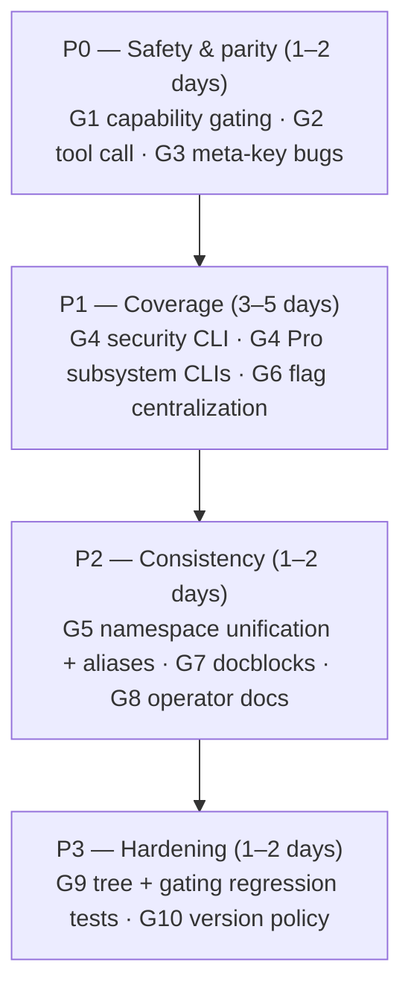

# WP-CLI Gap Analysis — NV oOS Plugin (2026-10)

**Status:** Analysis (input to Proposal 050)
**Author:** AI Agent Review (2026-10-02)
**Scope:** Base (`includes/cli/` + `includes/class-wp-mcp-ai-cli-command.php`), Pro (`addons/pro/includes/cli/` + integration CLIs), all addons
**Predecessor:** [Proposal 005 — WP-CLI Infrastructure Hardening](./005-wp-cli-infrastructure-hardening.md) (2026-06-26)

---

## 1. Executive Summary

The plugin's WP-CLI surface has grown from 33 subcommands (audited in Proposal 005) to **~70 subcommands across 25 command classes plus 4 top-level integration CLIs**, tracking the explosion of new subsystems (Media Studio, assistant portability, Pro toolkits, addons, security infrastructure). The growth has outpaced the hardening conventions: **the legacy dispatcher and the fleet-operator credential CLI have zero capability gating**, there is **no one-shot tool execution command** (the single biggest operability gap), several assistant commands have **CLI ≠ runtime data-fidelity bugs**, and **10+ major subsystems have no CLI at all**.

This document catalogues 10 gap clusters (G1–G10) with file-level evidence, scores them against researched WP-CLI industry standards, and feeds a phased remediation proposal ([050-wp-cli-hardening-proposal.md](./050-wp-cli-hardening-proposal.md)).

---

## 2. Methodology

1. **Surface inventory** — enumerated every `WP_CLI::add_command()` call, read both CLI folder READMEs (`includes/cli/README.md`, `addons/pro/includes/cli/README.md`), the legacy dispatcher docblocks, and the folder conventions.
2. **Parity comparison** — diffed the CLI tree against the plugin's sibling surfaces: REST routes (`mcp-ai/v1`, `mcp-ai-pro/v1`, `mcp-ai-core/v1`), admin UI, MCP tools (~1,648), and the Pro CPT/CCT subsystems.
3. **Standards research** — reviewed the WP-CLI [Commands Cookbook](https://make.wordpress.org/cli/handbook/guides/commands-cookbook/), [Documentation Standards](https://make.wordpress.org/cli/handbook/references/documentation-standards/), [WordPress VIP WP-CLI guidance](https://docs.wpvip.com/vip-cli/wp-cli-with-vip-cli/write-custom-wp-cli-commands/), and the flagship plugin CLIs ([WooCommerce WC-CLI](https://developer.woocommerce.com/docs/wc-cli/cli-overview/), WP Rocket, Jetpack) as the industry baseline.
4. **Evidence verification** — each finding below is grounded in a specific file/registration or in the plugin's own operational skills (which document verified quirks).

---

## 3. Current CLI Surface (verified 2026-10-02)

### 3.1 Base — `includes/cli/` (modern, convention-compliant)

| Command | Subcommands |
|---|---|
| `wp mcp-ai assistant` | `list`, `get`, `create`, `delete`, `update`, `import`, `export` |
| `wp mcp-ai approval` | `list`, `approve`, `reject` |
| `wp mcp-ai bulk` | `audit`, `cleanup-artifacts`, `dispatch`, `retry-failed`, `status` |
| `wp mcp-ai chat` | `__invoke` (one-shot, `--stream`, `--assistant-id`, `--model`, `--provider`) |
| `wp mcp-ai content` | `auto-categorize` |
| `wp mcp-ai credential` | `list`, `issue`, `revoke` (gated `manage_options`) |
| `wp mcp-ai cron` | `list`, `run`, `delete`, `clear` (gated `manage_options`) |
| `wp mcp-ai dlq` | `list`, `stats`, `retry`, `delete`, `dismiss`, `purge`, `clear` |
| `wp mcp-ai harness` | semantic search/tracing |
| `wp mcp-ai log` | `errors`, `activity`, `clear`, `prune` |
| `wp mcp-ai measurement` | `run`, `alert_check`, `list_runs` |
| `wp mcp-ai memory` | `recall`, `store`, `forget`, `stats`, `audit` |
| `wp mcp-ai oos parity` | `report`, `diff` |
| `wp mcp-ai provider` | `list`, `test`, `models` |
| `wp mcp-ai restrictions` | `list`, `lift`, `add` (gated `manage_options`) |
| `wp mcp-ai settings` | `get`, `set`, `reset` (gated `manage_options`) |
| `wp mcp-ai sla` | `status`, `tune`, `analyze`, `enable`, `disable` |
| `wp mcp-ai slash` | `execute`, `list`, `help` |
| `wp mcp-ai thread` | `list`, `get`, `delete`, `compact` |
| `wp mcp-ai tool` | `list`, `enable`, `disable` (gated; `--yes` on disable) |
| `wp mcp-ai transcript` | `mine`/`list`, `status`, `cancel` |
| `wp mcp-ai conversation-import` | `detect`, `import`, `status`, `delete` (JetEngine-gated) |

### 3.2 Base — legacy dispatcher `includes/class-wp-mcp-ai-cli-command.php`

| Command | Subcommands | Notes |
|---|---|---|
| `wp mcp-ai` | `status`, `cleanup-cct`, `remote` | root class, no capability gating |
| `wp mcp-ai plugins` | `list`, `activate`, `deactivate` | no capability gating |
| `wp mcp-ai queue` | `stats`, `process`, `clear`, `retry`, `show` | no capability gating |
| `wp mcp-ai token` | `migrate-providers` | no capability gating |
| `wp mcp-ai rabbitmq` | `status`, `test-connection`, `setup`, `list-queues`, `send-test-message`, `worker` | no capability gating |
| `wp mcp-ai stdio` | `__invoke` (MCP stdio server) | — |
| `wp mcp-ai health` | `__invoke` | only command with `@when after_wp_load` |
| `wp mcp-ai cache` | `clear` | no capability gating |
| `wp mcp-ai version` | `__invoke` | — |

### 3.3 Pro — `addons/pro/includes/cli/` + integration CLIs

| Command | Subcommands |
|---|---|
| `wp mcp-ai connection` | `list`, `create`, `get`, `delete`, `test` (`--porcelain` on create) |
| `wp mcp-ai project` | `list`, `create`, `get`, `update`, `delete` |
| `wp mcp-ai task` | `list`, `create`, `get`, `update`, `delete`, `complete`, `dependencies` |
| `wp mcp-ai mcp-server` | `list`, `get`, `enable`, `disable`, `tools`, `token-generate`, `token-list`, `token-revoke` |
| `wp mcp-ai toolkit` | `list`, `enable`, `disable` |
| `wp mcp-ai pro status` | `__invoke` |
| `wp mcp calendar` / `wp mcp place` | (namespace inconsistency — see G5) |
| `wp mcp-ai composition` | OOS engine composition |

### 3.4 Top-level integration CLIs (outside the `mcp-ai` tree)

| Command | Subcommands | Source |
|---|---|---|
| `wp ezuite` | `status`, `trigger`, `clear-cache`, `test-connection`, `low-stock-report`, `sync-log` | `addons/pro/includes/class-wp-mcp-ai-ezuite-cli.php` |
| `wp flowhub` | `status`, `trigger`, `clear-cache`, `test-connection`, `compliance-report`, `low-stock-report`, `sync-log` | `addons/pro/includes/class-wp-mcp-ai-flowhub-cli.php` |
| `wp shopify-sync` | `status`, `trigger`, `clear-cache`, `register-webhooks`, `unregister-webhooks`, `cost-report`, `list-connections`, `sync-log` | `addons/pro/includes/class-wp-mcp-ai-shopify-sync-cli.php` |
| `wp profession` | `seed-orchestration`, `orchestration-stats` | `includes/class-wp-mcp-ai-cli-command.php` |
| `wp nvoos-docs` | `rebuild`, `status`, `reset`, `fix-links` | `addons/docs-hub/includes/class-nvoos-docs-hub-cli.php` |
| `wp mcp-ai operator` | `create`, `list`, `revoke`, `config` | `addons/fleet-operator/includes/class-wp-mcp-ai-operator-cli.php` |

---

## 4. Industry Standards Baseline

Researched from primary sources; this is the yardstick for the gaps below.

| # | Standard | Source |
|---|---|---|
| S1 | "WP-CLI's goal is to offer a complete alternative to the WordPress admin; **for any action you might want to perform in the WordPress admin, there should be an equivalent WP-CLI command**" | [WP-CLI Handbook](https://make.wordpress.org/cli/handbook/) |
| S2 | Commands must have "a very specific scope, **clearly reflected in the command's name**"; register one class per command tree, load conditionally on `defined('WP_CLI') && WP_CLI` | [Commands Cookbook](https://make.wordpress.org/cli/handbook/guides/commands-cookbook/) |
| S3 | PHPDoc: shortdesc **<50 chars**, active present tense; `## OPTIONS` with `---` default/options blocks; `## EXAMPLES` with **≥2 examples** (basic + advanced); **class-level `## EXAMPLES`** annotation; `@subcommand`, `@alias`, `@when after_wp_load` | [Documentation Standards](https://make.wordpress.org/cli/handbook/references/documentation-standards/) |
| S4 | Standard flag vocabulary: `--format` (table/json/yaml/csv/ids/count), `--fields`, `--porcelain` (ID-only output for scripting), `--yes`, `--dry-run`, `--user` | Cookbook + VIP + WooCommerce |
| S5 | **Capability checks inside commands** — "commands should check the capability of the current user before performing privileged operations"; WP-CLI runs in the context of a real WP user (system/root or `--user=<id>`), so CLI is not an auth bypass | [VIP](https://docs.wpvip.com/vip-cli/wp-cli-with-vip-cli/write-custom-wp-cli-commands/) + plugin's own `includes/cli/README.md` |
| S6 | Consistent output via `WP_CLI::log/success/warning/error`; `WP_CLI::error()` exits non-zero; `WP_CLI::confirm()` for destructive ops with `--yes` bypass | Cookbook + Documentation Standards |
| S7 | CRUD verb vocabulary per entity: `list|get|create|update|delete` (WooCommerce: `wp wc customer list --fields=id,name --format=csv`, `create --porcelain`) | [WooCommerce WC-CLI](https://developer.woocommerce.com/docs/wc-cli/cli-overview/) |
| S8 | Test through the same interface users use (Behat/feature specs or a bootstrapped PHPUnit that asserts stdout) | Cookbook |
| S9 | Output message standards: capital start, trailing period, quoted slugs/keys | Documentation Standards |

---

## 5. Gap Findings

### 🔴 G1 — No capability gating in the legacy dispatcher and fleet-operator CLI (Critical)

**Evidence:** `grep` for `manage_options|current_user_can|require_capability` across `includes/class-wp-mcp-ai-cli-command.php` (1,830 lines: `status`, `cleanup-cct`, `remote`, `plugins`, `queue`, `token`, `rabbitmq`, `stdio`, `cache`, `version`) and `addons/fleet-operator/includes/class-wp-mcp-ai-operator-cli.php` returns **zero matches**. Mutating commands affected:

- `wp mcp-ai cleanup-cct` — deletes orphaned CCT items
- `wp mcp-ai plugins activate|deactivate` — mutates active plugin state
- `wp mcp-ai queue clear|retry|process` — clears/replays the job queue (`clear` confirms interactively but never checks capability)
- `wp mcp-ai token migrate-providers` — rewrites token options
- `wp mcp-ai rabbitmq setup|worker` — creates exchanges/queues
- `wp mcp-ai cache clear` — flushes object cache
- `wp mcp-ai operator create|list|revoke` — **issues and revokes API credentials with zero capability check**

This violates the plugin's own `includes/cli/README.md` convention ("Mutating subcommands MUST call `require_capability('manage_options')`") and standard S5. `includes/cli/` commands gate correctly; the legacy dispatcher predates the convention and was never migrated.

**Fix:** port the 6 dispatcher command classes onto `WP_MCP_AI_CLI_Base_Command` (which provides `require_capability()`) and add `require_capability('manage_options')` to every mutating method; gate `mcp-ai operator` on `manage_options`.

### 🔴 G2 — No one-shot tool execution command (Critical)

**Evidence:** the tool registry has `execute()`, REST has `POST /mcp-ai/v1/tools`, MCP has `tools/call`, and `mcp-ai stdio` serves an MCP stdio server — but `grep` for a `tool call`/`tool run` registration finds nothing.

**Impact:** operators cannot run a single tool from the CLI to debug a tool, validate a registry change, or script a maintenance action. Every agent workflow today routes through chat or curl. This is the largest single parity hole against standard S1 (the REST `POST /tools` endpoint has no CLI equivalent).

**Fix:** add `wp mcp-ai tool call <slug> [--args='<json>'] [--assistant-id=<id>] [--format=json]`, gated by the tool's own `required_capability` (not blanket `manage_options`), outputting the canonical success envelope or `WP_Error` shape.

### 🔴 G3 — CLI ≠ runtime data-fidelity bugs (Critical, user-verified)

Evidence: the `design-ai-assistant-admin` skill's "Common Mistakes" table documents three verified defects:

1. **`assistant create --model=X` has no runtime effect** — it writes legacy meta key `mcp_ai_model`, while the runtime reads `_wp_mcp_ai_model`. The CLI accepts a flag that silently does nothing.
2. **`assistant get <id>` is unusable for audits** — it collects only `mcp_ai_*`-prefixed meta and misses `_wp_mcp_ai_*` (tools, provider, model, system prompt, roles, skills, memory files).
3. **No tool-assignment command** — the admin UI assigns tools to assistants; the CLI cannot (`assistant create/update` have no `--tools` flag). Operators fall back to `wp post meta update`/`wp eval`, which have a documented serialize-vs-string trap (`_wp_mcp_ai_tools` stored as string breaks `is_array()` checks).

Also: `assistant update` accepts `--model` with the same wrong-key defect.

**Fix:** route `assistant create|update|get` through the same meta-key mapping used by `WP_MCP_AI_Assistant_Portability` (the portability engine already handles `_wp_mcp_ai_*` correctly — PR #6628); add `--tools=<csv>` to `assistant create|update` and an `assistant tools` subcommand (list/add/remove) mirroring the admin UI.

### 🟠 G4 — 11 subsystems have zero CLI coverage (High)

Admin/REST/MCP exist but no CLI (violates standard S1):

| Subsystem | Evidence | Parity today |
|---|---|---|
| Security infrastructure (posture scoring w/ 21 signals, audit logger, destructive-ops gate, API-key store, cost tracker, CSP, load guard) | `includes/security/` — no `WP_CLI` references; `health` covers only API-key presence + tool counts | Admin + Site Health only |
| CRM (`lead`, `deal`, `company`, `contact`, `customer`, `crm-activity`, `support-ticket` CPTs) | no `add_command` | Admin + tools + REST |
| Security ops (`incident`, `maintenance` CPTs) | REST `mcp-ai-pro/v1/incidents|maintenance` only | REST + admin |
| Pro Schedule Manager (7 MCP tools) | no `add_command` | MCP tools + admin |
| Workflow Builder (DAG engine, execution history) | no `add_command` | Admin SPA + AJAX |
| Vault (encrypted storage) | `addons/pro/includes/vault/` — no CLI | MCP tools + admin |
| Communications (`channel-contacts`, `channel-messages`) | no `add_command` | MCP tools + admin |
| Remote Sites / mesh peers | only `mcp-ai connection` (partial; no peer/mesh verbs) | Admin + tools |
| Media Studio (fashion stack, IPTC/C2PA, marketplace pipeline, batch jobs — the 5 most recent commits) | no CLI | Admin + tools |
| Model catalog (discovery cron + admin suggestion review) | no CLI to trigger discovery or review/apply suggestions | Cron + admin |
| Elementor MCP connections / MCP Apps | no CLI | Admin + REST + slash-command |

**Fix:** Phase B of the proposal adds `security` (posture/audit/gate) in Base and `crm`, `schedule`, `workflow`, `vault`, `remote-site`, `communication`, `media-studio`, `model` in Pro, reusing the existing data-store/repository layer (same pattern as Pro `project`/`task`).

### 🟠 G5 — Command-tree naming inconsistency (High)

- `mcp calendar` / `mcp place` vs the rest of the `mcp-ai` tree (verified registration strings in `addons/pro/includes/cli/class-wp-mcp-ai-pro-cli-calendar-command.php` and `-place-command.php`).
- Four integration CLIs (`ezuite`, `flowhub`, `shopify-sync`, `profession`) float outside `mcp-ai`, so `wp help mcp-ai` cannot discover them (violates standard S2).
- Mixed registration styles: `ezuite`/`flowhub`/`shopify-sync` use per-method `WP_CLI::add_command('ezuite status', array($class, 'method'))` (loses class-level help, `@alias`, and default-action behavior) while everything else registers a class.
- Overlapping verbs: `mcp-ai status` (env summary), `mcp-ai health` (diagnostics), `mcp-ai pro status` (Pro summary).

**Fix:** canonical namespace `mcp-ai <noun> <verb>` (addons may keep `nvoos <addon>`); keep legacy names working via `@alias` for one release cycle; converge integration CLIs onto class-based registration under their toolkit noun (e.g. `mcp-ai ezsuite status` with `ezuite` aliased).

### 🟠 G6 — Standard flag support gaps (High)

- **`--fields` unsupported anywhere in `includes/cli/`** — every `format_items()` call hardcodes columns (standard S4; WooCommerce makes `--fields` first-class). Verified by grep: zero `--fields` matches.
- **`--format` allowlists disagree:** root `status`/`remote` allow only `table|json|yaml`; base `get_format()` allows `table|json|yaml|csv|ids`; `count` is missing everywhere.
- **`--porcelain` inconsistent:** present on `assistant create/export`, `credential issue`, Pro `connection/project/task create`; absent from other creates and from `operator create`.
- **`--yes` bug in base class:** `WP_MCP_AI_CLI_Base_Command::confirm()` never prompts — it returns `true` for `--yes` and silently `false` otherwise (`includes/cli/class-wp-mcp-ai-cli-base-command.php` L239–243). Any subcommand routed through it silently no-ops in interactive sessions instead of prompting per standard S6.
- `--dry-run` present in `bulk` and a few others; missing from most mutations (`settings set`, `restrictions add`, `cron delete`, etc.).

**Fix:** centralize flag handling in the base class: add `--fields` + `--field` parsing (plumb into `format_output()`), a single `--format` allowlist (`table|json|yaml|csv|ids|count`), fix `confirm()` to call `WP_CLI::confirm()` when not `--yes`, and roll `--porcelain` into every create verb via a base helper.

### 🟡 G7 — Docblock/help-quality gaps (Medium)

- **`@when after_wp_load` missing** on nearly every command in the legacy dispatcher — only `health` has it (verified: 12 `@subcommand` tags, 1 `@when`). The folder README declares this a MUST. (Note: WP-CLI ignores `@when` for plugin-loaded commands in practice — see Cookbook — but the docblock standard S3 and the plugin's own convention both require it, and it matters for `wp help` fidelity and future `before_wp_load` refactors.)
- **No class-level `## EXAMPLES`** on most command classes (`WP_MCP_AI_CLI_OOS_Parity_Command` is the good in-repo model).
- **No curated root overview** — bare `wp mcp-ai` renders auto-generated help with no class annotation describing the tree.
- Several commands have **zero or one `## EXAMPLES`** (standard S3 requires ≥2); e.g. fleet-operator `list`, Pro `status`.

### 🟡 G8 — Discovery & documentation drift (Medium)

- `includes/cli/README.md` links to `docs/guides/operator/wp-cli.md` "(if present)" — **the file does not exist**; there is no operator-facing CLI reference anywhere in `docs/`.
- Root `README.md` WP-CLI table lists 7 commands and documents `wp mcp-ai slash-command list` — the registered command is `wp mcp-ai slash list` (verified registration). Stale and wrong.
- Real-world quirks (G3) live in agent skills, not in `wp help` — knowledge scatter.

**Fix:** create `docs/guides/operator/wp-cli.md` as the single operator reference generated from the code (see proposal D5); fix the root README table.

### 🟢 G9 — Test coverage gaps (Medium)

- Cookbook standard S8 recommends testing through the user-facing interface. Coverage today: `tests/test-wp-cli-tool.php` + `tests/test-wp-cli-new-commands.php` (bootstrapped WP-CLI), Pro CLI tests are **metadata-only, no WP-CLI bootstrap** (`addons/pro/tests/test-wp-cli-pro-commands.php`).
- **No command-tree regression test** — nothing asserts the full `wp mcp-ai …` tree, so load-order regressions (cf. PR #6585 "Guard Pro WP-CLI loading against base load order") can silently drop commands.
- No tests for docblock/help rendering, `--format` validation, `--yes`/`--porcelain` behavior, or capability gating (G1 would have been caught by one).
- Known test-env landmine: the "WP_CLI stub constant leak" recurring root cause (documented in the test-suite skill).

### 🟢 G10 — Versioning & deprecation policy (Low)

- No declared minimum WP-CLI version (several helpers used — `WP_CLI::add_hook`, `get_flag_value` — require modern WP-CLI 2.x).
- No `@alias`/deprecation mechanism for legacy names (`mcp calendar` → `mcp-ai calendar`; `slash-command` docs → `slash`), and no CLI changelog section.

---

## 6. Prioritized Roadmap

| Priority | Gaps | Rationale |
|---|---|---|
| **P0** | G1, G2, G3 | Security exposure + silently-wrong CLI behavior + the single most-requested operator verb |
| **P1** | G4, G6 | Closes the admin-parity holes for the subsystems that grew since Proposal 005; makes output scriptable |
| **P2** | G5, G7, G8 | Naming/doc consistency — cheap, high discoverability payoff; must precede any new commands landing |
| **P3** | G9, G10 | Regression protection + forward-compat policy |

Full remediation plan, design decisions, and acceptance criteria: see [050-wp-cli-hardening-proposal.md](./050-wp-cli-hardening-proposal.md).

---

## 7. References

- [WP-CLI Commands Cookbook](https://make.wordpress.org/cli/handbook/guides/commands-cookbook/)
- [WP-CLI Documentation Standards](https://make.wordpress.org/cli/handbook/references/documentation-standards/)
- [WordPress VIP — Write custom WP-CLI commands](https://docs.wpvip.com/vip-cli/wp-cli-with-vip-cli/write-custom-wp-cli-commands/)
- [WooCommerce WC-CLI Overview](https://developer.woocommerce.com/docs/wc-cli/cli-overview/)
- In-repo: [`includes/cli/README.md`](../../../includes/cli/README.md), [`addons/pro/includes/cli/README.md`](../../../addons/pro/includes/cli/README.md), [`005-wp-cli-infrastructure-hardening.md`](./005-wp-cli-infrastructure-hardening.md), [`design-ai-assistant-admin` skill](../../../.agents/skills/design-ai-assistant-admin/SKILL.md)
