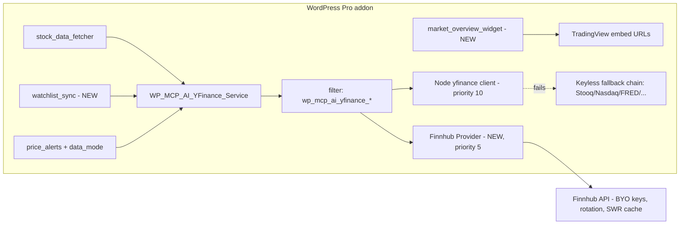

# OpenStock Financial Toolkit Integration — Implementation Plan

**Proposal:** [`051-openstock-financial-toolkit-integration.md`](./051-openstock-financial-toolkit-integration.md)
**Status:** ⏳ ACTIVE — Phases B1–B3 implemented 2026-10-02
**Branch:** `proposal/openstock-financial-toolkit` (from `alpha-working`)
**Target:** NV oOS Pro v1.1.x (Pro addon only; no Base changes)

---

## 0. Recommendation (from the proposal)

**Rebuild as capability parity, not UI parity.** Do not ship the OpenStock sidecar (Phase A) or the AGPL bridge fork (Phase C) now. Deliver OpenStock-level *capability* natively: Finnhub as an optional primary market-data provider (B1), TradingView widget embeds + per-user watchlists (B2), and alert/cron parity (B3). OpenStock code never enters the repository (AGPL-3.0 vs GPL/Proprietary — proposal §4).

## 1. Scope of this plan

| Phase | Deliverable | Status |
|---|---|---|
| B1 | `WP_MCP_AI_Finnhub_Provider` service + filter wiring + settings UI | ✅ implemented |
| B2 | `watchlist_sync` + `market_overview_widget` tools | ✅ implemented |
| B3 | `price_alerts` `data_mode` parity + `openstock-market-analyst` blueprint + docs | ✅ implemented |
| B4 | Media-worker `market` route module (multi-tenant deployments) | ⏳ deferred (needs worker v3.4.0 demand) |
| A / C | OpenStock sidecar embed / MongoDB bridge | ⏳ deferred (opt-in fallback only) |

## 2. Architecture



**Key design decision — filter-seam insertion.** The Node yfinance client hooks the `wp_mcp_ai_yfinance_current_price|price_history|search_ticker|batch_prices` filters at priority 10 and passes through any non-`false` result ("If already handled by another filter, return it" — `npm-integration-filters.php`). The Finnhub provider hooks the same filters at **priority 5**, so:

- Finnhub enabled + success → Finnhub payload wins, Node client untouched.
- Finnhub disabled / failure / rate-limited → returns `false`, Node microservice runs, existing keyless fallback chain + SWR stale-serving are completely unaffected.
- Zero changes to `WP_MCP_AI_YFinance_Service` dispatch; one additive filter (`wp_mcp_ai_yfinance_cache_ttl`) lets `realtime` mode shorten the shared cache TTL.

## 3. File manifest

### New files

| File | Purpose |
|---|---|
| `addons/pro/includes/services/class-wp-mcp-ai-finnhub-provider.php` | Finnhub API client: quote/history/search/batch/profile/news, key rotation, SWR transients, filter registration |
| `addons/pro/includes/tools/financial-planning/class-wp-mcp-ai-tool-watchlist-sync.php` | Per-user watchlist CRUD + bulk quotes (user-meta storage) |
| `addons/pro/includes/tools/financial-planning/class-wp-mcp-ai-tool-market-overview-widget.php` | TradingView embed URLs (chart/heatmap/quotes/timeline/screener) + top-movers summary |
| `addons/pro/includes/tools/financial-planning/examples/openstock-market-analyst.json` | Assistant blueprint preset |
| `addons/pro/tests/test-finnhub-provider.php` | Provider unit tests (seam-driven) |
| `addons/pro/tests/test-watchlist-sync.php` | Watchlist tool tests |

### Modified files

| File | Change |
|---|---|
| `addons/pro/includes/services/class-wp-mcp-ai-yfinance-service.php` | Add `wp_mcp_ai_yfinance_cache_ttl` filter in `get_cache_ttl()` (1 line) |
| `addons/pro/includes/tools/financial-planning/init.php` | Require + register Finnhub provider filters |
| `addons/pro/includes/admin/class-wp-mcp-ai-financial-planner-cpt-settings-page.php` | "Market Data Providers" section: `finnhub_api_keys` (masked), `finnhub_data_mode` (cached/realtime); sanitize + tools-list additions |
| `addons/pro/includes/tools/financial-planning/class-wp-mcp-ai-tool-price-alerts.php` | `data_mode`-aware cron interval + re-arm window |
| `addons/pro/includes/tools/financial-planning/examples/class-wp-mcp-ai-tool-import-financial-planning-blueprint.php` | Register `openstock-market-analyst` slug |
| `addons/pro/includes/tools/financial-planning/TOOL_INDEX.md` | Document 2 new tools + data_mode |
| `addons/pro/includes/tools/financial-planning/README.md` | Counts + new tools |
| `docs/project/proposals/051-openstock-financial-toolkit-integration.md` | Final Recommendation section + link to this plan |

> **Mirror note:** `plugins/nvoos-content-graph-pro/src/services/class-wp-mcp-ai-yfinance-service.php` is a byte-identical ecosystem mirror. Per the port track rules, mirrors are updated in dedicated port sessions — this plan modifies only the `addons/pro/` originals and flags the mirror as needing a future Wave sync.

## 4. Phase detail

### B1 — Finnhub provider

- **Storage:** `wp_mcp_ai_financial_planner_settings['finnhub_api_keys']` (primary, explicitly sanitized in the toolkit's own `sanitize_settings()`) with fallback read from `wp_mcp_ai_settings` (filter/constant escape hatch). Keys never rendered back to the browser (masked `••••` display), never logged.
- **Rotation:** comma-separated key list; on 401/403/429 rotate to the next key and retry once per request; 60 req/min/key documented in the settings help text.
- **Endpoints:** `/quote` (incl. multi-symbol batch), `/stock/candle` (resolution D, `period_to_days()`), `/search`, `/stock/profile2`, `/company-news`.
- **Caching:** transients with SWR — fresh TTL 900 s (`cached` mode) / 60 s (`realtime` mode), stale copy 7 days, `from_cache`/`stale` markers mirroring the yfinance service conventions. Reuses the `wp_mcp_ai_market_data_http_response` filter seam for tests.
- **Normalized shapes** (match the Stooq/Node-client family):
  - quote → `{ symbol, current_price, open, high, low, prev_close, change, change_percent, date, currency, source: 'finnhub', delayed: true }`
  - history → `{ symbol, period, interval: '1d', count, data: [ {date,open,high,low,close,volume} ], source: 'finnhub' }`
  - search → plain array of `{ symbol, description, type }`
  - batch → `{ data: { SYM: { current_price, change, change_percent, source } }, source: 'finnhub' }`
- **Disclaimer discipline:** payloads carry `delayed: true`; tools keep the existing EDUCATIONAL-ONLY envelope strings.

### B2 — watchlist_sync + market_overview_widget

- `watchlist_sync` — user-meta `wp_mcp_ai_fin_watchlist`; actions `list|add|remove|bulk_quote`; unique-symbol constraint (OpenStock parity, proposal §5.5); `bulk_quote` routes through `WP_MCP_AI_YFinance_Service::get_batch_prices()` so Finnhub benefits automatically.
- `market_overview_widget` — actions `widget` (build TradingView embed URLs: chart, heatmap, quotes, timeline, screener for a validated symbol) and `summary` (top-movers via batch quotes over the user's watchlist or a curated default set). URLs built server-side, escaped with `esc_url_raw` at build and `esc_url` at output; `is_valid_symbol()` guard on every symbol.

### B3 — price_alerts data_mode + blueprint

- `data_mode` read from the provider: `realtime` → cron interval `hourly`, re-arm window 1 h; `cached`/unset → existing `daily` behavior. `maybe_schedule_cron()` clears and reschedules when the stored interval changes; `already_triggered_today()` compares against the mode's window.
- `openstock-market-analyst.json` — assistant blueprint: watchlist, quotes, news, indicators, screener, overview widgets; educational-disclaimer system prompt; registered in `BLUEPRINT_SLUGS`.

## 5. Conventions honored

- Canonical envelope (`success` array / `WP_Error`), two-gate sanitization (P0–P6, PHPCS sniffs), `edit_posts` capability gate, `is_available()` gated on `enable_financial_planner_toolkit`, `get_usage_guidance()` on every tool, ABSPATH guards, i18n via `mcp-ai-wpoos-pro`, PHPDoc `@since 1.1.x`.
- Testability: all HTTP via the existing filter seam; no live network calls in tests.

## 6. Validation

```bash
composer run lint                        # PHPCS (WPCS + custom sniffs)
vendor/bin/phpunit addons/pro/tests/test-finnhub-provider.php
vendor/bin/phpunit addons/pro/tests/test-watchlist-sync.php
vendor/bin/phpunit addons/pro/tests/test-financial-resilience.php   # no regressions
vendor/bin/phpunit tests/test-financial-tools.php                   # if present
```

## 7. Deferred (per proposal decision points)

- **B4** media-worker `market` route module — when worker v3.4.0 multi-tenant demand justifies it.
- **Phase A** OpenStock sidecar embed — opt-in fallback only; deployment doc to be written when requested.
- **Phase C** AGPL bridge fork — only on demonstrated watchlist-sync demand.
- Mirror sync of the yfinance service to `plugins/nvoos-content-graph-pro` via the ecosystem-port track.
