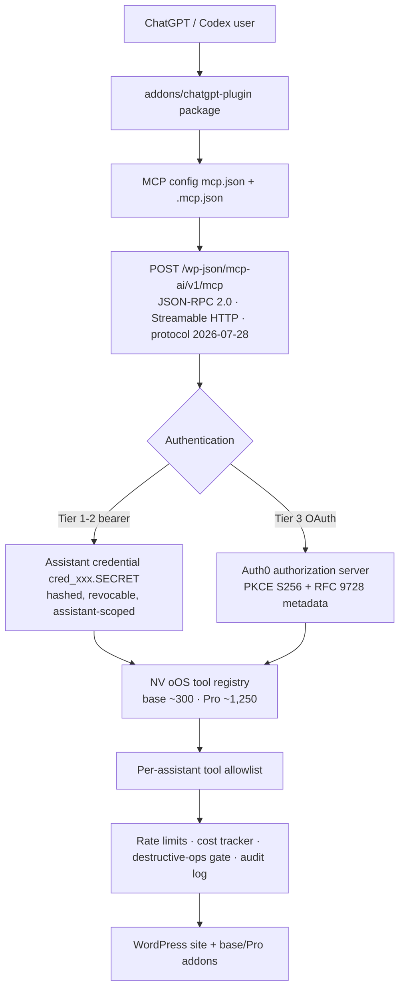

# ChatGPT Plugin Addon — NV oOS Site Bridge (Proposal)

**Date:** 2026-10-03
**Status:** 🔮 PENDING
**Estimated Effort:** ~1 day (shipped scaffold) + 2–4 days (Tier 1–2 hardening) + 5–8 days (base+pro Tier 3 changes) + 2–4 days (public submission)
**Priority:** MEDIUM
**Related:** [`053-chatgpt-plugin-addon-research.md`](./053-chatgpt-plugin-addon-research.md)

## Executive Summary

This proposal adds a new addon, **`addons/chatgpt-plugin/`**, that packages
NV oOS as an installable **ChatGPT / Codex plugin**. The plugin ships its own
MCP configuration (`mcp.json` / `.mcp.json`) pointing at a site's native MCP
bridge (`POST /wp-json/mcp-ai/v1/mcp`), three skills (site operations,
content studio, commerce desk), a local marketplace entry, and packaging
scripts — so any NV oOS site (base or base+pro) can be operated from ChatGPT
Work, the ChatGPT desktop app, Codex CLI, or the Agents API with the site's
existing assistant-scoped credentials.

The research (see the companion document) shows the OpenAI plugin system has
stabilized around a portable manifest format plus a `.codex-plugin`
compatibility overlay, and that **published ChatGPT plugins require OAuth 2.1
authorization-code + PKCE** — machine-to-machine client-credentials tokens
are no longer accepted. The addon therefore ships a three-tier rollout:
Tiers 1–2 (local, team) work **today** with zero site changes via
`bearer_token_env_var` + `cred_xxx.SECRET`; Tier 3 (public ChatGPT plugin)
requires a small, additive set of base+pro changes (RFC 9728 protected
resource metadata, `WWW-Authenticate` challenges, per-tool
`securitySchemes`, a profile tool) with Auth0 — already integrated — as the
authorization server.

The scaffold for the addon folder is already in place under
[`addons/chatgpt-plugin/`](../../../addons/chatgpt-plugin/); this proposal
covers its completion, the companion site changes, and the publishing path.

Like the other addons, the folder will sync to a standalone mirror repo
(**`nvdigitalsolutions/nvoos-chatgpt-plugin`**) via a subtree-split workflow,
so the scaffold is mirror-ready: self-contained (`LICENSE`, `CHANGELOG.md`,
in-addon CI), dependency-free (Node built-ins only — no lockfile in the
mirror), with tracked placeholder MCP configs and CI gates against stamped
URLs or manifest drift. The mirror doubles as the Git-backed marketplace
distribution source (`codex plugin marketplace add
nvdigitalsolutions/nvoos-chatgpt-plugin`).

## Problem Statement

1. **No packaged distribution.** NV oOS exposes a fully capable MCP endpoint,
   but ChatGPT/Codex users must hand-configure connectors, copy URLs, and
   manage tokens with no skills, no marketplace entry, and no consistent
   tool policy. Every site reinvents the same setup.
2. **Outdated ChatGPT guidance.** The current docs
   (`remote-client-setup.md`, `mcp-server-authentication.md`) instruct
   ChatGPT connectors to use Auth0 **client-credentials** tokens. OpenAI's
   plugin program no longer accepts machine-to-machine grants — the guidance
   is broken for anyone following it today.
3. **Missing resource-server contract.** For a public plugin that exposes
   user data and write tools, ChatGPT requires the MCP authorization spec:
   the site must serve `/.well-known/oauth-protected-resource`, answer 401s
   with `WWW-Authenticate` challenges, declare per-tool `securitySchemes`,
   and provide a profile tool. None of this exists on the MCP endpoint yet.
4. **Skills gap.** The repo has 61 coding-time agent skills but zero
   *end-user* ChatGPT/Codex skills that teach the model how to operate a
   connected NV oOS site safely (read-first, confirm destructive calls).

## Proposed Solution

### 1. The addon folder (shipped scaffold — `addons/chatgpt-plugin/`)

```
addons/chatgpt-plugin/
├── plugin.json                  # Portable Agent Plugins manifest + extensions.com.openai interface
├── .codex-plugin/plugin.json    # Legacy compatibility overlay (skills + mcpServers pointers)
├── mcp.json                     # Portable MCP config → site /wp-json/mcp-ai/v1/mcp (placeholder URL)
├── .mcp.json                    # Legacy plugin-format MCP config (placeholder URL)
├── skills/
│   ├── site-operations/SKILL.md
│   ├── content-studio/SKILL.md
│   └── commerce-desk/SKILL.md
├── marketplace.json             # Local marketplace entry (ChatGPT desktop / Codex CLI)
├── bin/
│   ├── stamp-site.mjs           # Stamps the real site URL into the MCP configs (local, uncommitted)
│   ├── package-plugin.mjs       # Builds the ZIP for Agents API environment.plugins (POSIX + Windows)
│   └── validate.mjs             # Dependency-free CI gate (JSON, lockstep, skills, marketplace)
├── .github/workflows/ci.yml     # Mirror-repo CI (syncs with the folder; Node built-ins only)
├── CHANGELOG.md                 # Version history for the mirror
├── LICENSE                      # GPL-3.0-or-later (copied from monorepo root so the mirror is licensed)
├── assets/                      # icon.png, logo.png, screenshots (Tier 3)
├── README.md                    # Connection matrix, sync model, security, submission checklist
└── .gitignore                   # dist/, .env*, node_modules/ — MCP configs stay TRACKED
```

Key properties:

- **Its own MCP configuration** — `mcp.json`/`.mcp.json` target
  `https://SITE/wp-json/mcp-ai/v1/mcp` (Streamable HTTP), stamped per-site
  via `bin/stamp-site.mjs`. The placeholder versions are tracked (so the
  synced mirror always ships valid configs); stamping rewrites in place and
  always shows in `git status`, and `bin/validate.mjs` fails CI if a stamped
  URL is committed.
- **Dual manifest generation** — portable format is canonical; the
  `.codex-plugin` overlay keeps legacy clients (and the `@plugin-creator`
  scaffold convention) working.
- **Skills encode safety** — read-first tool choice, confirmation before
  destructive calls, tool-list discovery instead of assuming Pro tools
  exist, source citation. These map to the site's own Unix-theory tool
  rules and destructive-ops gate.

### 2. Three-tier connection strategy

| Tier | Audience | Auth | Site changes |
|---|---|---|---|
| 1 — Local / personal | Codex CLI, ChatGPT desktop (developer mode), Agents API sandboxes | `NVOOS_MCP_TOKEN` env var → `bearer_token_env_var` with an assistant credential `cred_xxx.SECRET` | **none (works today)** |
| 2 — Team / workspace | ChatGPT workspace members | Same bearer model per user, or workspace-published plugin with per-user linking | none for bearer model |
| 3 — Public ChatGPT plugin | Any ChatGPT user | OAuth 2.1 authorization-code + PKCE via Auth0 | Phase 2 additions (below) |

### 3. base+pro companion changes (Tier 3 only, additive)

- **`/.well-known/oauth-protected-resource`** (RFC 9728) served by the
  plugin (rewrite or REST fallback, mirroring the Pro `/.well-known/mcp`
  pattern), advertising the configured Auth0 tenant as
  `authorization_servers` with scopes.
- **`WWW-Authenticate` challenges** on unauthenticated MCP requests
  (`Bearer resource_metadata="…", scope="…"`) and
  `_meta["mcp/www_authenticate"]` on tool-call auth failures so ChatGPT
  surfaces its linking UI.
- **Per-tool `securitySchemes`** in `tools/list` — read-only base tools
  `noauth` (guest-tier, where the site allows guests), everything else
  `oauth2` with scopes; built on the existing `build_tool_annotations()`.
- **Profile tool** (`nvoos_get_profile`) marked
  `_meta["openai/profile"]: true` with an opaque, stable ID — enables
  multi-account labels and workspace domain restrictions.
- **Auth0 authorization-code validation** — the existing JWKS
  `iss`/`aud`/scope validation covers most of it; add `resource`-echo
  enforcement and docs.
- **Docs corrections** — replace the client-credentials ChatGPT guidance in
  `remote-client-setup.md` and `mcp-server-authentication.md` with the
  three-tier matrix.

### 4. Repo sync & distribution (mirror repo)

Like the other addons, `addons/chatgpt-plugin/` will sync to a standalone
mirror via a root workflow — **`sync-chatgpt-plugin.yml`**, the same
subtree-split pattern as `sync-mcp-wordpress-gateway.yml`:

```
monorepo PR (addons/chatgpt-plugin/**)
  → merge to main/alpha-working
  → git subtree split --prefix=addons/chatgpt-plugin
  → force-push main on nvdigitalsolutions/nvoos-chatgpt-plugin
  → mirror CI (.github/workflows/ci.yml inside the folder)
```

Sync consequences baked into the scaffold:

| Concern | Handling |
|---|---|
| Mirror self-containment | `LICENSE`, `CHANGELOG.md`, `.github/workflows/ci.yml`, and dependency-free `bin/` scripts all live inside the folder (Node built-ins only — the mirror never needs `npm install` or a lockfile) |
| Config presence in mirror | `mcp.json` / `.mcp.json` are **tracked** with the `YOUR-SITE.DOMAIN` placeholder; `bin/validate.mjs` fails any commit that stamps a production URL |
| Version lockstep | `plugin.json` and `.codex-plugin/plugin.json` share `name` + `version`; `bin/validate.mjs` enforces it in CI; bumps go through the monorepo, never the mirror |
| Metadata URLs | `homepage` / `websiteURL` point at the mirror repo, not monorepo tree paths (validated) |
| Monorepo-only doc links | The addon README references the proposal docs with a monorepo-only note (same precedent as the gateway's README linking into `docs/operations/`) |
| Distribution | The mirror enables **Git-backed marketplace installs**: `codex plugin marketplace add nvdigitalsolutions/nvoos-chatgpt-plugin` (marketplace entries support `source: "git-subdir"` + `url` + `ref`) |

**Setup required (not yet done):** create the mirror repo, add the
`CHATGPT_PLUGIN_REPO_TOKEN` PAT secret, and add the sync workflow to
`.github/workflows/` (spec in §Implementation Plan, Phase 1).

### Architecture



## Benefits

- **Zero-friction adoption:** users install one plugin; the site's own
  security model does the rest (assistant scoping, tool allowlists, cost and
  rate controls, audit logging).
- **First-party presence on ChatGPT/Codex:** a marketplace + (optionally)
  public directory entry positions NV oOS alongside Figma/Notion-class MCP
  integrations.
- **Safe-by-default skills:** the packaged skills teach read-first,
  confirm-before-write behavior, reducing destructive-call risk from
  frontier models.
- **Reuses existing assets:** the MCP endpoint, protocol negotiation,
  assistant credentials, Auth0 integration, and tool annotations already
  exist; the addon is distribution and polish, not new backend machinery.
- **Corrects broken documentation** that currently sends ChatGPT users down
  an unsupported auth path.

## Implementation Plan

### Phase 0 — Scaffold (shipped with this proposal)
- `addons/chatgpt-plugin/` manifests, MCP configs, skills, marketplace,
  `bin/` scripts (incl. `validate.mjs`), in-addon CI, `CHANGELOG.md`,
  `LICENSE`, README, `.gitignore` — mirror-ready and self-contained.

### Phase 1 — Sync setup + Tier 1–2 hardening (2–4 days)
- [ ] Create the mirror repo `nvdigitalsolutions/nvoos-chatgpt-plugin` and
      add the `CHATGPT_PLUGIN_REPO_TOKEN` PAT secret.
- [ ] Add `.github/workflows/sync-chatgpt-plugin.yml` (subtree split of
      `addons/chatgpt-plugin` → force-push mirror `main`, path-filtered on
      `main`/`alpha-working` — identical to
      `sync-mcp-wordpress-gateway.yml`).
- [ ] Verify the mirror CI runs `bin/validate.mjs` + packaging smoke test
      green on the first synced commit.
- [ ] End-to-end smoke test: stamp → `bearer_token_env_var` → `tools/list`
      → a read tool call → a draft-creating write call against a test site.
- [ ] Register the local marketplace entry in ChatGPT desktop / Codex and
      test the Git-backed install from the mirror
      (`codex plugin marketplace add nvdigitalsolutions/nvoos-chatgpt-plugin`).
- [ ] Correct the two outdated docs (Tier 1–2 sections only).

### Phase 2 — base+pro OAuth resource-server support (5–8 days)
- [ ] RFC 9728 well-known endpoint + `WWW-Authenticate` challenges (REST
      + rewrite route).
- [ ] Per-tool `securitySchemes` emission in `tools/list` (extend
      `build_tool_annotations()`; PHPUnit coverage).
- [ ] `nvoos_get_profile` tool with `_meta["openai/profile"]` + output schema.
- [ ] Auth0 authorization-code validation hardening (`resource`/`aud` echo,
      scope enforcement) + tests in `tests/security/`.
- [ ] Update `docs/reference/api/mcp-server-authentication.md` and
      `remote-client-setup.md` with the full matrix.

### Phase 3 — Public submission (2–4 days + review loop)
- [ ] Assets (icon/logo/screenshots), privacy/terms URLs, localization,
      test prompts + responses per the review requirements.
- [ ] Submit via the plugin portal; triage reviewer findings (repo has a
      wp.org-review loop to pattern-match on).

## Effort Estimation

| Phase | Effort | Dependency |
|---|---|---|
| 0 — Scaffold | 1 day | none (done) |
| 1 — Sync setup + Tier 1–2 hardening | 2–4 days | mirror repo + PAT secret; test site with published assistant |
| 2 — base+pro Tier 3 | 5–8 days | none (all base; Auth0 for integration tests) |
| 3 — Public submission | 2–4 days + review loop | Phases 1–2 |

## Success Metrics

- **Tier 1:** plugin installs via `codex plugin marketplace add
  ./addons/chatgpt-plugin`; `tools/list` returns the assistant's enabled
  tools; a content-studio flow drafts and publishes a post end-to-end.
- **Tier 2:** a workspace member installs the published plugin and runs the
  site-operations skill against their own linked credential.
- **Tier 3:** ChatGPT linking UI appears (protected-resource metadata +
  challenge verified); an OAuth-linked session completes a tool call; the
  profile tool returns a stable ID across reconnects.
- **Docs:** zero remaining references to client-credentials ChatGPT
  connectors.
- **Sync:** mirror repo CI green on every sync; `codex plugin marketplace
  add nvdigitalsolutions/nvoos-chatgpt-plugin` installs the plugin from the
  mirror; no commit can introduce a stamped URL or manifest version drift.

## Risks & Mitigations

| Risk | Mitigation |
|---|---|
| Plugin manifest formats still in transition | Ship both portable and `.codex-plugin` formats; CI-validate against the published schemas |
| OpenAI review latency for public listing | Tier 2 (workspace publishing) delivers value without the public directory |
| ~1,500-tool surface overwhelms the model | Skills constrain tool choice; per-assistant allowlists are the primary boundary |
| ChatGPT rejects/limits anonymous `noauth` tools | Default writes to `oauth2`; `noauth` only for read-only tools where guests are enabled |
| WAF/CDN interference with Streamable HTTP | Document the `text/event-stream` + path exceptions (already in troubleshooting docs) |
| Token leakage through plugin archives | Stamped configs show in `git status` and fail `bin/validate.mjs`; secrets are env-var only by design |
| Direct commits to the mirror repo drift from the monorepo | Documented rule + force-push sync overwrites; version bumps only via monorepo PRs (gateway precedent) |
| Mirror CI breaks on a bad sync | CI lives inside the addon folder and is exercised by the monorepo PR before merge; dependency-free so no lockfile drift |
| `plugin.json` ↔ `.codex-plugin/plugin.json` version drift | `bin/validate.mjs` enforces name/version lockstep in both monorepo and mirror CI |

## Open Questions

1. Naming: keep `nvoos-site-bridge` as the plugin `name` (kebab-case,
   stable identity) vs a more marketing-oriented name before any public
   submission?
2. Should the marketplace entry live at the repo root
   (`.agents/plugins/marketplace.json`, per OpenAI convention) in addition
   to the self-contained `addons/chatgpt-plugin/marketplace.json`? The root
   location requires `../`-style paths from the marketplace root, which
   OpenAI's path rules discourage.
3. Which scopes should the Tier 3 consent screen request
   (e.g. `site:read`, `content:write`, `store:manage`), and do they map
   1:1 to the existing assistant capability model?
4. Is a public directory listing in scope for Q4, or is workspace-only
   distribution the target for now?
5. Mirror repo naming: `nvoos-chatgpt-plugin` (proposed) vs a name that
   matches the plugin slug `nvoos-site-bridge`?
6. Sync target branch: force-push to mirror `main` on both monorepo
   `main` and `alpha-working` (gateway pattern), or gate the alpha channel
   to a separate mirror branch?

## Decision Required

1. **Approve the addon** (`addons/chatgpt-plugin/`) as a new repo addon
   (new category: portable agent plugin package, to be listed in
   `docs/project/ADDON_INVENTORY.md`).
2. **Approve the sync setup** — create the mirror repo, the
   `CHATGPT_PLUGIN_REPO_TOKEN` secret, and `sync-chatgpt-plugin.yml`
   (Open Question 5 for the final mirror name).
3. **Approve Phase 2 scope** — the base+pro OAuth resource-server changes —
   versus shipping Tiers 1–2 only and deferring public distribution.
4. **Name and marketplace placement** (Open Questions 1–2) before any
   public submission.
