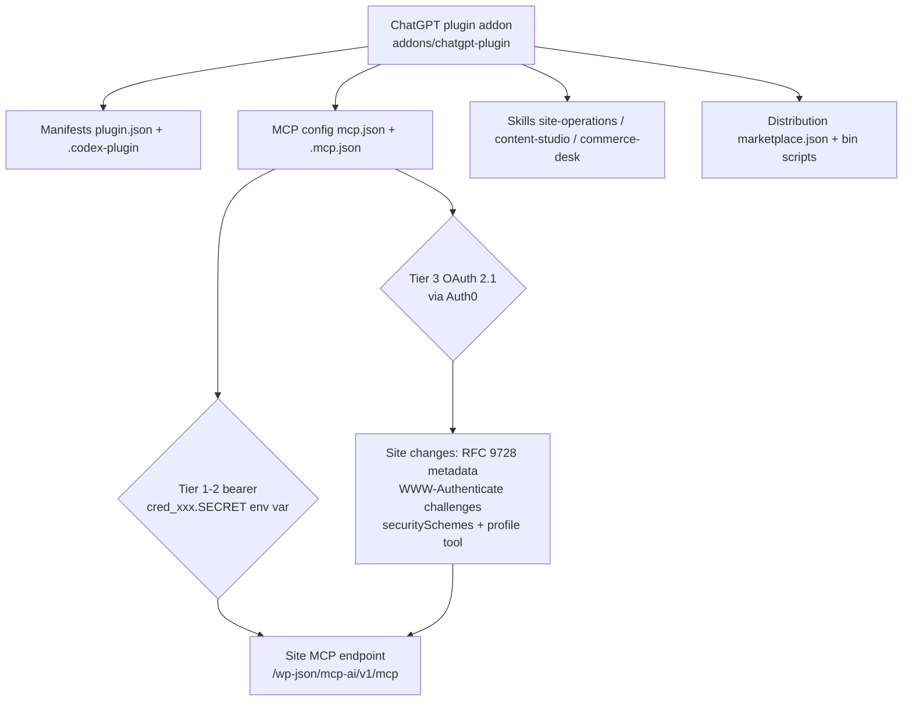

# ChatGPT Plugin Addon — Research & Industry Standards

**Date:** 2026-10-03
**Status:** 🔮 PENDING (research foundation for the addon proposal)
**Related:** [`053-chatgpt-plugin-addon-proposal.md`](./053-chatgpt-plugin-addon-proposal.md)

This document captures the external research behind the proposed
`addons/chatgpt-plugin/` addon: the OpenAI ChatGPT/Codex plugin system as it
exists today, the MCP authentication requirements that govern how a plugin
connects to this project's site-side MCP bridge, and the industry best
practices distilled from OpenAI's own documentation, the MCP specification,
and the existing patterns in this repository.

---

## 1. What a "ChatGPT plugin" is today

OpenAI ships one plugin system across ChatGPT, Codex (CLI/desktop/cloud), and
the Agents API. A plugin is a folder that packages **skills**, **MCP
configuration**, or both, and is distributed as files (self-hosted
sandboxes), a ZIP (OpenAI-hosted sessions), a local/repo marketplace, or a
public directory listing.

The Agents API guide ([`tools/plugins`][oai-plugins]) and the ChatGPT
"Package your plugin" guide ([`plugins/build/plugins`][oai-package]) define
two coexisting manifest generations:

### 1.1 Portable Agent Plugins format (current)

| File | Role |
|---|---|
| `plugin.json` (root) | Identity + metadata, `$schema: https://agent-plugins.org/schemas/1.0.0/plugin.schema.json`, kebab-case `name`, semver `version`, `description`, `author`, `license`, `keywords` |
| `mcp.json` (root) | MCP servers, `$schema: https://agent-plugins.org/schemas/1.0.0/mcp.schema.json`, entries `{ "type": "streamable-http", "url": ... }` |
| `skills/` (root, auto-discovered) | `<skill-name>/SKILL.md` with YAML frontmatter `name` + `description` |
| `extensions.com.openai` | OpenAI-only overlay: `interface` (displayName, shortDescription, longDescription, developerName, category, capabilities, websiteURL, privacyPolicyURL, termsOfServiceURL, defaultPrompt, brandColor, composerIcon, logo, screenshots), `apps` (registered MCP server mappings in `.app.json`), `hooks` |

When `extensions.com.openai` is present as an object it *replaces* the
`.codex-plugin/plugin.json` overlay (they are not merged).

### 1.2 Legacy `.codex-plugin` format (compatibility fallback)

```json
{ "name": "...", "version": "1.0.0", "description": "...",
  "skills": "./skills/", "mcpServers": "./.mcp.json" }
```

`.mcp.json` uses a *plugin-specific* MCP format (`type: "http"` +
`url`) that differs from `agent.tools` and from the portable
`streamable-http` format. Paths must start with `./`, stay inside the plugin
root, and contain no `..` components.

**Best practice:** ship both formats — portable `plugin.json`/`mcp.json` as
the canonical pair plus a thin `.codex-plugin/plugin.json` +
`.mcp.json` overlay for legacy clients. This is what the addon scaffold does.

### 1.3 Distribution surfaces

| Surface | Mechanism | Auth for MCP |
|---|---|---|
| Agents API, self-hosted sandbox | copy folder into workspace, list root in `environment.capability_directories` | `bearer_token_env_var` (HTTP) or stdio `env_vars` |
| Agents API, OpenAI-hosted sandbox | one ZIP per plugin in `environment.plugins` (name/description must match manifest); reusable via `environment_template_id` | same |
| Codex CLI / ChatGPT desktop (local) | `marketplace.json` at `$REPO_ROOT/.agents/plugins/` or `~/.agents/plugins/`; `codex plugin marketplace add` (supports local paths and **Git-backed sources**: `source: "git-subdir"` with `url` + `path` + `ref`); entries carry `policy.installation` (AVAILABLE / INSTALLED_BY_DEFAULT / NOT_AVAILABLE) and `policy.authentication` | developer-mode connection or marketplace install |
| ChatGPT workspace (private) | admin publishes a local plugin to workspace roles | OAuth 2.1 linking |
| Public plugin directory | submission portal ([`plugins/deploy/submission`][oai-submission], [`app-review`][oai-review]) | OAuth 2.1 mandatory for user data/writes |

Reference implementations: [openai/plugins](https://github.com/openai/plugins)
(Figma, Notion, build-web-apps).

---

## 2. Authentication requirements — the critical constraint

### 2.1 The matrix

| Client surface | Supported auth for plugin MCP servers |
|---|---|
| Agents API (self-hosted / OpenAI-hosted) | `bearer_token_env_var` — env var value sent as `Authorization: Bearer`. Literal headers allowed (`http_headers`); `env_http_headers` is **not** supported. |
| Codex CLI / desktop | Same bearer-token model via config (`bearer_token_env_var`), plus stored OAuth for `chatgpt` origin. |
| **ChatGPT published plugins** | **OAuth 2.1 authorization-code + PKCE only.** No machine-to-machine grants (client credentials, service accounts, JWT bearer assertions), no custom API keys, no customer-provided mTLS certs. |

Source: [`plugins/build/auth`][oai-auth] — "Authenticate your users".

**Direct consequence for this repo:** the existing guidance that ChatGPT
connectors use Auth0 **client-credentials** tokens
(`docs/getting-started/installation-setup/remote-client-setup.md`,
`docs/reference/api/mcp-server-authentication.md`) is incompatible with the
current ChatGPT plugin program and must be updated. ChatGPT *users* link via
interactive OAuth; the site's `cred_xxx.SECRET` assistant credentials remain
valid for Codex, Agents API sandboxes, and developer-mode local connections.

### 2.2 MCP authorization spec (what the site must implement for Tier 3)

The OAuth path is governed by the [MCP authorization specification
2025-11-25][mcp-auth] (superseded 2026-07-28 — both live in ChatGPT's
docs). Requirements in plain language:

1. **Protected resource metadata (RFC 9728).** The MCP server must serve
   `GET /.well-known/oauth-protected-resource` (or advertise the URL in a
   `WWW-Authenticate` header on `401` responses) returning `resource`,
   `authorization_servers[]`, optional `scopes_supported`,
   `resource_documentation`.
2. **401 challenges.** Unauthenticated requests must be answered with
   `WWW-Authenticate: Bearer resource_metadata="https://...", scope="..."`.
3. **Authorization server discovery (RFC 8414 / OIDC).** The IdP must publish
   `/.well-known/oauth-authorization-server` or
   `/.well-known/openid-configuration` with correct `issuer`,
   `authorization_endpoint`, `token_endpoint`,
   `code_challenge_methods_supported` including `S256`,
   `token_endpoint_auth_methods_supported`, optional `registration_endpoint`.
4. **PKCE S256** authorization-code exchange, `resource` parameter echoed
   through authorize + token requests and bound into the token's `aud`.
5. **RFC 9207 issuer identification** (`authorization_response_iss_parameter_supported: true`,
   exact `iss` echo in every auth response) → ChatGPT uses the stable redirect
   `https://chatgpt.com/connector_platform_oauth_redirect`.
6. **Client registration:** CIMD preferred (`client_id_metadata_document_supported: true`;
   token-endpoint methods `none` or `private_key_jwt` with OpenAI's public
   JWKS), DCR via `registration_endpoint` as fallback. OpenAI serves its CIMD
   document at `https://chatgpt.com/oauth/client.json` (stable) or
   `https://chatgpt.com/oauth/{callback_id}/client.json`.
7. **Token verification on the resource server:** signature via JWKS,
   `iss`/`aud`/`exp`/`nbf`, scopes, replay considerations — ChatGPT performs
   none of these for you.
8. **Transport-level client identification:** OpenAI-managed mTLS client cert
   (leaf SAN `mtls.prod.connectors.openai.com`, chained to the published
   OpenAI Connectors intermediate CA) and published egress IP ranges for
   allowlisting.

### 2.3 Tool-level metadata ChatGPT consumes

- **Per-tool `securitySchemes`** (`noauth` / `oauth2` with scopes) declare
  which tools can run anonymously and which require linking. Omitting the
  array inherits the server default — ChatGPT recommends per-tool
  declarations. The linking UI only appears when the server publishes
  protected-resource metadata **and** a failing call returns
  `_meta["mcp/www_authenticate"]` with `error` + `error_description`.
- **Profile tool** (`_meta["openai/profile"]: true` + `outputSchema`
  with a stable opaque string `id`) enables multi-account support and
  workspace domain restrictions (which additionally require OIDC `openid` +
  `email` scopes and a UserInfo endpoint).

### 2.4 Review & submission requirements

The public submission portal requires at minimum: plugin name, logo,
description, company and privacy-policy URLs, MCP and tool information, test
prompts and responses, and localization info
([`plugins/deploy/app-review`][oai-review]). Remote MCP endpoints must be
public HTTPS; bundled stdio servers need deployment justification.

---

## 3. What the site already supports (inventory)

| Capability | Status | Evidence |
|---|---|---|
| MCP endpoint over REST | ✅ | `POST /wp-json/mcp-ai/v1/mcp`, JSON-RPC 2.0, Streamable HTTP + SSE — `includes/rest/class-wp-mcp-ai-rest-mcp-controller.php` |
| Protocol versions | ✅ | `2026-07-28`, `2025-06-18`, `2025-03-26`, `2024-11-05` — `includes/class-wp-mcp-ai-rest-mcp-methods.php::get_supported_protocol_versions()`; ChatGPT/Codex negotiate 2026-07-28 |
| Bearer auth | ✅ | Assistant credentials (`cred_xxx.SECRET`, hashed, revocable, assistant-scoped), Auth0 bearer (JWKS `iss`/`aud`/scope validation), nonce, guest tokens, mesh keys |
| Tool annotations | ✅ | `build_tool_annotations()` emits `readOnlyHint` / `destructiveHint` / `openWorldHint` into `tools/list` |
| Per-assistant tool gating | ✅ | Assistant editor allowlists; MCP Apps flow (Test Connection → Discover Tools → enable per tool) |
| `/.well-known/mcp` discovery doc | ✅ (Pro) | Toolkit MCP servers discovery document |
| OAuth 2.1 *client* (PKCE S256 + DCR) | ✅ | `WP_MCP_AI_MCP_App_OAuth_Client` — but this makes the plugin an OAuth **client** of other MCP servers, not a resource server |
| OAuth *resource server* metadata | ❌ | No RFC 9728 `/.well-known/oauth-protected-resource`; no `WWW-Authenticate` challenge on the MCP endpoint |
| Per-tool `securitySchemes` in `tools/list` | ❌ | Not emitted |
| Profile tool (`_meta["openai/profile"]`) | ❌ | Not present |
| Auth0 as authorization server (authorization-code) | ⚠️ partial | Auth0 token *validation* exists; the plugin does not orchestrate the interactive flow, but Auth0 natively provides discovery/CIMD/PKCE/iss-echo |

---

## 4. Gap analysis → what the addon must own vs what base+pro must add



- **The addon owns** the packaging: manifests, MCP config (its own
  configuration pointing at the site bridge), skills, marketplace entry,
  stamp/package scripts, and submission assets.
- **base+pro owns** the Tier 3 server-side contract: protected-resource
  metadata, 401 challenges, `securitySchemes` emission, profile tool, and the
  docs corrections. These are additive — Tiers 1–2 work today with zero site
  changes.

---

## 5. Distilled best practices (industry standards applied here)

1. **Dual-format manifests.** Publish portable `plugin.json` + `mcp.json`
   *and* the `.codex-plugin` overlay; the plugin program is in transition
   (portable format is current, legacy is still supported).
2. **Secrets out of the package.** OpenAI is explicit: keep secrets out of
   plugin files and archives; `bearer_token_env_var` / `env_vars` only.
   Aligns with the repo rule that `cred_` secrets are shown once and stored
   hashed.
3. **Least privilege at three layers** (repo pattern + OpenAI guidance):
   per-assistant tool gating (site) → skill-level guidance (plugin) →
   `MCP_TOOLS_ALLOW/DENY`-style policy where a gateway exists.
4. **Prefer an established IdP.** OpenAI strongly recommends Auth0 (or
   similar) over hand-rolled OAuth; the site already integrates Auth0, making
   it the natural authorization server for Tier 3.
5. **Noauth/oauth2 split per tool.** Declare read-only base tools as `noauth`
   (guest-accessible) and writes as `oauth2` so the consent screen is
   accurate — mirroring the plugin's existing guest-token boundary.
6. **Transport hardening.** HTTPS mandatory; WAF exceptions for
   `/wp-json/mcp-ai/v1/mcp` + `text/event-stream`; optionally OpenAI egress
   IP allowlisting and mTLS client-cert validation for public deployments.
7. **Negotiate, don't assume.** The site already negotiates protocol
   versions 2024-11-05 → 2026-07-28; ChatGPT-compatible clients land on
   2026-07-28 automatically — no site work needed there.
8. **Submission hygiene.** Placeholder privacy/terms URLs, missing logo,
   unlocalized copy, and unverifiable test prompts are the common review
   blockers ([`app-review`][oai-review]); fill them before Tier 3 submission.
9. **Version-pin and CI-gate the package** (repo pattern from
   `mcp-wordpress-gateway`): validate manifests against the published JSON
   schemas and block commits that break skill frontmatter or path rules.

---

## 6. References

| Ref | Source |
|---|---|
| [oai-plugins] | OpenAI Agents API — Plugins guide: https://developers.openai.com/api/docs/guides/agents-api/tools/plugins |
| [oai-package] | OpenAI — Package your plugin (portable + legacy manifests, marketplaces, structure): https://developers.openai.com/plugins/build/plugins |
| [oai-auth] | OpenAI — Plugin authentication (OAuth 2.1, CIMD/DCR, mTLS, profile tool): https://developers.openai.com/plugins/build/auth |
| [oai-submission] | OpenAI — Submit plugins: https://developers.openai.com/plugins/deploy/submission |
| [oai-review] | OpenAI — Remote MCP server review requirements: https://developers.openai.com/plugins/deploy/app-review |
| [mcp-auth] | MCP Authorization Specification 2025-11-25: https://modelcontextprotocol.io/specification/2025-11-25/basic/authorization |
| [rfc8414] | RFC 8414 — OAuth 2.0 Authorization Server Metadata |
| [rfc9728] | RFC 9728 — OAuth 2.0 Protected Resource Metadata |
| [rfc9207] | RFC 9207 — OAuth 2.0 Authorization Server Issuer Identification |
| [rfc7591] | RFC 7591 — OAuth 2.0 Dynamic Client Registration |
| [rfc7636] | RFC 7636 — Proof Key for Code Exchange (PKCE) |
| [openai-plugins] | Reference plugin implementations (Figma, Notion): https://github.com/openai/plugins |
| [openai-mcpkit] | OpenAI MCPKit incl. Auth0 configuration guide: https://github.com/openai/openai-mcpkit |
| [auth0-mcp] | Auth0 — Securing MCP servers: https://auth0.com/ai/docs/mcp/intro/overview |
| [mcp-inspector] | MCP Inspector (OAuth flow debugging): https://modelcontextprotocol.io/docs/tools/inspector |

### In-repo references

- `docs/getting-started/installation-setup/remote-client-setup.md` — current
  (outdated) ChatGPT connector guidance.
- `docs/reference/api/mcp-server-authentication.md` — auth surface inventory.
- `addons/mcp-wordpress-gateway/` — the repo's existing Node MCP gateway
  pattern (multi-site, policy-filtered tools) — complementary, not replaced.
- `.agents/skills/mcp-ai-wpoos-plugin/SKILL.md` — operational guide for the
  plugin's MCP bridge.
