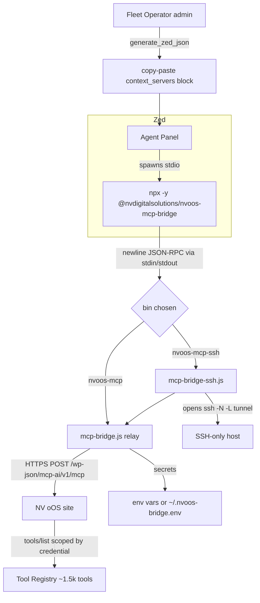

# NV oOS MCP Bridge as npx Package — Comprehensive Implementation Plan

**Date:** 2026-10-05
**Status:** 🔮 PENDING
**Estimated Effort:** 3–5 dev-days (Phases 0–5) + 1–2 dev-days (optional Phase 6)
**Priority:** MEDIUM
**Related:** [024-hermes-agent-fleet-operator-implementation-plan.md](./024-hermes-agent-fleet-operator-implementation-plan.md), [053-chatgpt-plugin-addon-implementation-plan.md](./053-chatgpt-plugin-addon-implementation-plan.md), [pro-toolkit-mcp-servers-expansion-plan.md](./pro-toolkit-mcp-servers-expansion-plan.md), `bin/README.md`, `.zed/README.md`

---

## Executive Summary

Any NV oOS site already speaks MCP (JSON-RPC 2.0 over HTTP POST at `/wp-json/mcp-ai/v1/mcp`), and this repo already ships the missing transport piece: `bin/mcp-bridge.js`, a dependency-free **stdio ↔ HTTP relay** that Zed (and any stdio MCP client) can spawn. The one remaining friction is distribution: today a developer must have this repository checked out to use the bridge (`"path": "node", "args": ["bin/mcp-bridge.js"]`).

This plan packages that relay as **`@nvdigitalsolutions/nvoos-mcp-bridge`** on the **public npm registry**, so any machine can connect any MCP client to any NV oOS site with zero repo checkout:

```jsonc
"nv-oos-local": {
  "source": "custom",
  "command": {
    "path": "npx",
    "args": ["-y", "@nvdigitalsolutions/nvoos-mcp-bridge"],
    "env": {
      "MCP_AI_BASE_URL": "https://your-site/wp-json/mcp-ai/v1/mcp",
      "MCP_AI_TOKEN":    "cred_xxxxx.SECRET"
    }
  }
}
```

The plan also includes the **operator enhancement**: the Fleet Operator admin screen gains a "Zed" config generator alongside the existing Hermes YAML, so a site admin creates an operator credential and receives a copy-paste `context_servers` block (`npx`-based, SSH variant included) in the same one-time result — completing the "create operator → paste config → talk to the site" loop for editor-based agents, not just Hermes.

---

## Problem Statement

**Current state.**

1. `bin/mcp-bridge.js` (and `bin/mcp-bridge-ssh.js` for SSH-only sites) work and are documented, but they are only usable from inside this repository checkout.
2. `.zed/settings.json` offers a generic third-party npx fallback (`@modelcontextprotocol/server-http`), which we don't own, can't test against our endpoint guarantees, and doesn't cover SSH-only sites, the `Host`-header override, or the `~/.nvoos-bridge.env` secret-file convention.
3. The existing npm publishing pipeline (`npm-publish-alpha.yml`) targets **GitHub Packages** (`npm.pkg.github.com`), which requires a per-user `.npmrc` + auth token — invisible friction that breaks the core promise of `npx -y` "just works".
4. The Fleet Operator generates Hermes `config.yaml`/`.env` only. Editors (Zed, VS Code) and desktop clients (Claude Desktop, Cursor, Codex) are a growing share of the operator audience and get no first-class config.
5. `bin/mcp-bridge-ssh.js` imports `./utils/env-file.js`, so a publishable package must vendor more than one file — an easy thing to get wrong by hand.

**Goal state.** `npx -y @nvdigitalsolutions/nvoos-mcp-bridge` from any machine: (a) relays a stdio MCP client to an NV oOS site over HTTPS, (b) tunnels SSH-only sites, (c) reads secrets from env or `~/.nvoos-bridge.env`, and (d) is offered by the Fleet Operator admin as a generated Zed snippet. The package is zero-dependency, byte-synced with `bin/`, and published with npm provenance.

---

## Goals & Non-Goals

### Goals

1. **Publishable package** — `packages/nvoos-mcp-bridge/` with two bins (`nvoos-mcp`, `nvoos-mcp-ssh`), zero runtime dependencies, `engines.node >= 18` (repo `.nvmrc` = 20.18.0).
2. **Public npm registry** — `npx -y` works with no `.npmrc`, no login. Scoped package needs `--access public`.
3. **Single source of truth** — `bin/*.js` stays canonical; a sync step copies the three files byte-identically into the package; CI fails on drift (same discipline as the base→Pro ecosystem port).
4. **Operator enhancement** — `WP_MCP_AI_Operator_Config_Generator` gains a Zed `context_servers` generator (plain + SSH variants); the admin one-time result and the "How to wire" docs show it alongside Hermes YAML. Backwards compatible.
5. **Proven behavior** — unit tests against an in-process fake MCP endpoint (existing `bin/test-mcp-bridge-ssh.js` pattern), plus a Docker E2E against a real site (`docker compose up -d`) and a protocol check with the official MCP Inspector.

### Non-Goals

- **No SDK rewrite in v1.** The proven relay stays dependency-free. An optional Phase 6 spike can evaluate an `@modelcontextprotocol/sdk` streamable-HTTP client, but only if it demonstrates a user-visible win.
- **No changes to the plugin MCP endpoint** (`/wp-json/mcp-ai/v1/mcp`) — the package is transport-only.
- **No Zed extension in core phases.** A `zed-mcp-extension` wrapper (the pattern GitHub MCP / Context7 use) is documented as Phase 6 stretch.
- **No assistant-credential issuance changes.** The package consumes existing `cred_*` / `op_*` tokens.

---

## Research Findings (industry standards)

### A. Zed MCP configuration surface (verified against zed.dev docs + ecosystem guides)

- Zed calls MCP servers **context servers**; config lives in `settings.json` under `context_servers`. A custom server **must** set `"source": "custom"` or Zed skips it ([zed.dev/docs/ai/mcp](https://zed.dev/docs/ai/mcp); claudemarket.ai/mcp/clients/zed).
- Command shape is `{ "command": { "path": "npx", "args": ["-y", "pkg"], "env": {...} } }`; `env` is the standard place for secrets (mcpfind.org Zed guide). `"enabled": true` is supported.
- Real-world npx patterns pin the channel: `"args": ["-y", "@playwright/mcp@latest"]` (loomal.ai), `["-y", "mcp-remote@latest", "<url>"]` (Neon guide). Conclusion: we document `@nvdigitalsolutions/nvoos-mcp-bridge@latest`.
- Zed also has an **MCP extension** mechanism (`extension.toml` → `context_server_command`), used by GitHub MCP and Context7. This is the official distribution path for polished Zed MCP servers; noted as Phase 6.

### B. MCP transport & security standards (modelcontextprotocol.io)

- The dominant pattern for remote HTTP servers on stdio-only clients is a **local relay process** — e.g. `mcp-remote` with `--header "Authorization: Bearer …"` and `--transport http-only` (simplescraper.io guide). Our relay occupies exactly this niche, purpose-built for NV oOS: credential-token env convention, `Host`-header override for canonical-redirect sites, SSH tunneling.
- MCP Authorization spec: bearer tokens **must** go in the `Authorization` header on every request and **must never** appear in the URL/query string (modelcontextprotocol.io/specification/2025-11-25/basic/authorization). `bin/mcp-bridge.js` already complies (header-only, per-request).
- Stdio transport best practice: **stdout carries only MCP messages; all logging goes to stderr** (modelcontextprotocol.io/llms-full.txt). Both bridge scripts already comply — keep this invariant in the package.
- Recommended conformance test: the official **MCP Inspector** (`npx @modelcontextprotocol/inspector`), which can attach to a stdio server (modelcontextprotocol.io cheat sheets). Use it in Phase 0/2 validation.

### C. npm CLI package publishing best practices (dev.to, freeCodeCamp, Sentry, npm docs)

- Scoped packages must publish with `npm publish --access public` to be npx-installable without auth.
- Required hygiene: `bin` map pointing at `#!/usr/bin/env node` files, `engines` (we use `>=18`), `files` allowlist so the tarball ships only `bin/`-derived files + `README.md` + `LICENSE`, and a `LICENSE` file inside the package (npm auto-detect won't find the repo-root one otherwise).
- Zero-dependency is the recommended posture for tiny CLIs: smaller supply-chain surface and near-instant `npx` startup (dev.to "Zero-Dependency npm Package in 2026").
- **Registry conflict found in-repo:** `npm-publish-alpha.yml` publishes to GitHub Packages (`registry-url: https://npm.pkg.github.com`), which requires consumer `.npmrc` + PAT. `bin/publish-npm-packages.sh` however publishes to the public registry. → This plan publishes `nvoos-mcp-bridge` **publicly** (option A below) because `npx -y` is the entire point.

### D. Existing repo conventions to honor

- `packages/` currently hosts browser-side ESM libraries with `adapt-for-npm.js` build scripts (packages/README.md). This package is a **Node CLI** — a new pattern within `packages/`, documented as such.
- Repo discipline for ported code is **byte-identity + a verifier** (ecosystem-port skill, `bin/port-cluster.sh`). Mirror that: `sync-from-bin` + CI drift check.
- Proposals follow `NNN-slug-implementation-plan.md` with Date/Status/Effort/Priority/Related header, phases, checklists (see 024, 053).

---

## Design Decisions

| # | Decision | Rationale |
|---|----------|-----------|
| D1 | Package name `@nvdigitalsolutions/nvoos-mcp-bridge`, bins `nvoos-mcp` + `nvoos-mcp-ssh` | Matches existing scope; two verbs = two entries |
| D2 | Publish to **public npm registry** | `npx -y` must work with zero config; GitHub Packages breaks that |
| D3 | Keep the zero-dep relay; no SDK in v1 | Proven against the endpoint; zero supply chain; SDK adds no user-visible win yet |
| D4 | `bin/` stays canonical; package vendors byte-identical copies via sync script; CI verifies | Single source of truth; prevents silent fork |
| D5 | Env-var config surface only (`MCP_AI_*` + `MCP_AI_ENV_FILE`), same as today | No new config grammar; secrets never in args (visible in process lists) |
| D6 | Generator returns **both** Zed JSON and the existing Hermes YAML from the same call | Zero behavior change for Hermes users; additive `zed` key |
| D7 | Ship `LICENSE` (GPL-3.0-or-later to match repo, or MIT per packages/) inside the tarball | npm won't infer license files from a parent repo |

Open question for the PR: **license** — existing `packages/*` are MIT, but the bridge files live under the repo's GPL-3.0-or-later. Plan defaults to **GPL-3.0-or-later** for the bridge package (it derives from repo code); confirm with maintainers before publish.

---

## Architecture



**Data flow (v1, unchanged from today):** the relay reads one JSON-RPC object per stdin line, POSTs it with `Authorization: Bearer <MCP_AI_TOKEN>`, writes the HTTP response back as one stdout line. Notifications get no response; stdin EOF drains in-flight requests. `nvoos-mcp-ssh` first starts `ssh -N -L 127.0.0.1:<free-port>:<remote>:<port>` with `ExitOnForwardFailure=yes` + `BatchMode=yes`, waits for the forward to accept connections, then spawns the relay against `http://127.0.0.1:<port>/wp-json/mcp-ai/v1/mcp`, and tears the tunnel down on relay exit / SIGINT / hard kill (stdin-EOF contract with `ssh`).

---

## Phased Implementation Plan

### Phase 0 — Baseline & environment verification (0.5 day)

- [x] Run existing bridge tests: `node bin/test-mcp-bridge-ssh.js` — **verified 2026-10-05 on this branch: 8/8 pass**, but see the flake finding below.
- [ ] **Flake finding (pre-existing):** the `notifications get no stdout response…` test failed once in 4 runs (10 s `waitForLine` timeout, runner then hung with an orphaned child). Re-runs pass. Hypothesis: a Windows timing race when the notification and `tools/list` are pipelined through the in-process fake-ssh. Action: re-run 5× in a row before trusting CI; if reproducible, fix the harness race (or the relay's ordering) in Phase 2 — the publish pipeline must not be gated on a flaky gate.
- [ ] Bring up Docker site: `docker compose up -d` (http://localhost:8000) per `MAINTAINER_MAP.md`.
- [ ] Create an assistant credential on the Docker site (WP-CLI or admin) and handshake the endpoint with curl: `initialize`, `tools/list`.
- [ ] Protocol smoke test with the official Inspector against the repo bridge:
      `npx @modelcontextprotocol/inspector node bin/mcp-bridge.js` (with `MCP_AI_BASE_URL`/`MCP_AI_TOKEN` exported).
- [ ] Record findings (any protocol-enum friction, e.g. missing `ping` handling) — the relay is a pass-through, so endpoint behavior is the source of truth; anything found here becomes an endpoint-side issue, not a package hack.

### Phase 1 — Scaffold the package (0.5–1 day)

New files under `packages/nvoos-mcp-bridge/`:

- [ ] `package.json` — `name`, `version: 0.1.0-alpha.1`, `bin: { "nvoos-mcp": "bin/mcp-bridge.js", "nvoos-mcp-ssh": "bin/mcp-bridge-ssh.js" }`, `engines.node: ">=18"`, `files: ["bin/", "README.md", "LICENSE"]`, scripts `sync`, `test`, `pack:dry-run`.
- [ ] `sync-from-bin.js` (or `.sh`) — copies `../../bin/mcp-bridge.js`, `../../bin/mcp-bridge-ssh.js`, `../../bin/utils/env-file.js` into `packages/nvoos-mcp-bridge/bin/` (+ `bin/utils/`), then asserts byte-identity (`crypto.createHash('sha256')`), fails with a diff hint on drift.
- [ ] `bin/mcp-bridge.js`, `bin/mcp-bridge-ssh.js`, `bin/utils/env-file.js` — synced copies (do not hand-edit).
- [ ] `README.md` — env-var reference table, Zed / Claude Desktop / Cursor / Codex snippets (`npx -y …@latest`), SSH variant, secret-file convention, Windows note (`cmd /c npx` wrapper per MCP servers repo guidance).
- [ ] `LICENSE` — GPL-3.0-or-later (pending D7 decision).
- [ ] Update `packages/README.md` — new "Tier 7 — Tooling (Node CLI)" section documenting the new pattern.

### Phase 2 — Package tests (0.5–1 day)

- [ ] `test/relay.test.js` — `node:test` suite reusing the fake-endpoint pattern from `bin/test-mcp-bridge-ssh.js`: handshake roundtrip, notification suppression, parse-error response, HTTP error → `-32603`, stdin-EOF drain, `MCP_AI_HOST_HEADER` pass-through, empty-body → `result: {}`.
- [ ] `test/ssh.test.js` — tunnel startup/teardown with the in-process fake ssh; env-file loading (`MCP_AI_ENV_FILE` pointing at a temp file, process env wins).
- [ ] `test/sync.test.js` — asserts package `bin/` copies are byte-identical to repo `bin/` sources (runs in CI; also as `npm run sync -- --check`).
- [ ] Docker E2E (manual or CI-optional): with the Docker site up, spawn the packaged bin as a child process and complete `initialize` + `tools/list` + one safe tool call using an operator credential.

### Phase 3 — Publishing pipeline (0.5–1 day)

- [ ] New workflow `.github/workflows/npm-publish-nvoos-mcp-bridge.yml`:
  - Triggers: `push` tag `v*-mcpbridge-*` (or `v*.*.*-mcpbridge.*`) + `workflow_dispatch` (version + dry_run inputs).
  - Steps: checkout → setup-node 20 → `npm run sync -- --check` (drift gate) → `npm pack --dry-run` → `npm publish --access public --provenance` to `registry.npmjs.org` with `NPM_TOKEN` secret.
  - Publish both `alpha` and `latest` dist-tags from the same run (`--tag alpha`; a release tag promotes to `latest`).
- [ ] Keep the existing GitHub-Packages workflow untouched; document the two pipelines in `packages/README.md` (public npm = npx-consumable; GitHub Packages = internal consumers).
- [ ] Extend `bin/publish-npm-packages.sh` with an optional `--mcp-bridge` flag or a sibling `bin/publish-mcp-bridge.sh` (public registry, `--access public`).
- [ ] Repository prerequisites to flag for maintainers: `NPM_TOKEN` (automation token) secret on the repo; confirm the `@nvdigitalsolutions` scope is claimed on npmjs.com.

### Phase 4 — Fleet Operator enhancement (1 day)

**Generator** (`addons/fleet-operator/includes/class-wp-mcp-ai-operator-config-generator.php`):

- [ ] `public static function generate_zed_json( $label, $site_url, $token, $allowlist = array(), $ssh = false )` → returns pretty-printed JSON string:
  - server key: `slugify($label)`; `source: "custom"`;
  - command: `{ "path": "npx", "args": ["-y", "@nvdigitalsolutions/nvoos-mcp-bridge@latest"] }` (SSH variant uses `nvoos-mcp-ssh` bin + `MCP_AI_SSH_*` env).
  - `env`: `MCP_AI_BASE_URL` + `MCP_AI_TOKEN` (SSH: `MCP_AI_SSH_USER/HOST/PORT` + token); token written literally (shown once, same trust model as the existing YAML result).
  - Use `wp_json_encode( $obj, JSON_PRETTY_PRINT | JSON_UNESCAPED_SLASHES )` — never hand-built string concat.
- [ ] `public static function generate_claude_json(...)` (small, same data, `mcpServers` shape) — cheap win, same call path. Optional if time-boxed.
- [ ] Keep `generate_for_site()` unchanged; new methods are additive. Add `'zed' => …` (+ optional `'claude' => …`) to the transient result.

**Admin** (`class-wp-mcp-ai-operator-admin.php`):

- [ ] Render a third `<pre>` in the one-time result: "Add to Zed (settings.json → context_servers):".
- [ ] New "How to wire Zed / VS Code" section: 3 steps (create operator → paste block → reload Agent Panel / restart).
- [ ] Update the page intro copy to mention Zed alongside Hermes.

**Tests** (`addons/fleet-operator/tests/` — follow the repo's existing PHPUnit conventions):

- [ ] `test-config-generator-zed.php`: shape assertions (`source`, `command.path`, `args`, env keys), slugify/env-var naming, escaping of special characters in URLs, SSH variant env keys, empty-allowlist doesn't alter output (allowlist is server-side).
- [ ] Admin transient shape test: created operator result contains `zed` key (existing admin test pattern if present).

### Phase 5 — Docs & repo wiring (0.5 day)

- [ ] `.zed/settings.json`: replace Option A comment with the npx template (keep `node bin/…` as a commented dev alternative); note `@latest` pinning and the secret store / `~/.nvoos-bridge.env` options.
- [ ] `.zed/README.md`: update the MCP section (three template blocks → npx-first).
- [ ] `bin/README.md`: add a "Published package" callout at the top of the MCP Bridge section linking to npm; state that `bin/` remains the canonical source.
- [ ] `packages/README.md` + new `packages/nvoos-mcp-bridge/README.md` (already in Phase 1) cross-linked.
- [ ] `CHANGELOG.md` + `readme.txt` mention (repo convention for user-facing changes).
- [ ] `docs/project/proposals/README.md` / RELATED_PROPOSALS_INDEX.md: register 054.

### Phase 6 — Optional stretch (1–2 days)

- [ ] **Zed extension** `extensions/nvoos-mcp/` (or a new repo): `extension.toml` exposing `context_server_command` → the npx command; lets users install "NV oOS MCP" from the Zed extension gallery (pattern: GitHub MCP, Context7).
- [ ] **SDK v2 spike**: `@modelcontextprotocol/sdk` streamable-HTTP client variant behind a `--transport streamable` flag, kept out of the default path until it beats the relay on a measured axis (e.g. SSE streaming of long tool results).
- [ ] Claude Desktop / Cursor / Codex config generators in the operator admin (Claude JSON already cheap in Phase 4).

---

## Testing & Validation Strategy

| Layer | Tooling | What it proves |
|-------|---------|----------------|
| Relay unit | `node:test` + in-process fake endpoint | Framing, notifications, error mapping, EOF drain |
| SSH unit | `node:test` + fake ssh (existing pattern) | Tunnel lifecycle, orphan-free teardown |
| Sync gate | `sync-from-bin.js --check` in CI | No drift between `bin/` and package |
| Package shape | `npm pack --dry-run` | `files` allowlist, bins, LICENSE present |
| Protocol conformance | MCP Inspector against the packaged bin | Real MCP client handshake + tools/list |
| E2E | Docker (`docker compose up -d`) + operator credential | Full path: npx bin → site → scoped tools/list → safe tool call |
| PHP | PHPUnit (fleet-operator suite) | Generator shapes, admin transient, escaping |
| Lint | `composer run lint` (phpcs), ESLint for JS per repo standards | Style gates |

## Security Review Checklist

- [ ] No secrets in the package (all tokens via env / `~/.nvoos-bridge.env`; env file perms guidance in README: `chmod 600`).
- [ ] Token never in URLs or process args; `Authorization` header only (MCP spec compliance).
- [ ] `rejectUnauthorized` stays enabled except the existing `.local` dev exception; document it.
- [ ] SSH: key-auth only, `BatchMode=yes`, `StrictHostKeyChecking=accept-new` unchanged; no password support.
- [ ] Operator-generated JSON is escaped with `wp_json_encode`/`esc_html` at output; token shown once (existing transient pattern, unchanged expiry).
- [ ] npm publish uses a scoped automation token + `--provenance`; no human credentials in CI.
- [ ] Supply chain: zero runtime dependencies means the only trust root is our own repo + npm registry.

## Risks & Mitigations

| Risk | Likelihood | Mitigation |
|------|-----------|------------|
| Public npm name/scope not yet claimed | Med | Verify + claim `@nvdigitalsolutions` on npmjs.com (maintainer task in Phase 3) |
| `npx` caches an old alpha forever | Med | Document `@latest` pinning; push release tags through the same workflow |
| Drift between `bin/` and package copies | Med | CI sync-check gate; sync script is the only editor of package `bin/` |
| Notification-test flake blocks CI | Low-Med | Observed 1/4 on Windows; fix harness race before wiring into publish pipeline (Phase 0 finding) |
| Endpoint protocol quirks surface via npx users | Low | Phase 0 Inspector run; relay stays pass-through; quirks fixed endpoint-side |
| License mismatch (MIT packages vs GPL repo) | Low | Resolve D7 before first publish; document in package README |
| Windows `npx` quirks in Zed | Low | Document `cmd /c npx` wrapper (MCP servers repo guidance); SSH variant already Windows-hardened |

---

## Rollout & Verification

1. Merge PR → tag `v0.1.0-alpha.1-mcpbridge` → workflow publishes `@nvdigitalsolutions/nvoos-mcp-bridge@0.1.0-alpha.1` (tag `alpha`).
2. Verify on a clean machine: `npx -y @nvdigitalsolutions/nvoos-mcp-bridge@latest` with env vars → Inspector handshake → `tools/list`.
3. Operator admin smoke test on a staging site: create operator → copy Zed block → connect from Zed → confirm allowlist scoping (`tools/list` only returns allowed tools).
4. Promote: release tag → `latest` dist-tag → update `.zed/settings.json` template and docs to `@latest`.

---

## File Manifest

```
packages/nvoos-mcp-bridge/           ← NEW
├── package.json
├── LICENSE
├── README.md
├── sync-from-bin.js
├── bin/
│   ├── mcp-bridge.js                (synced from bin/mcp-bridge.js)
│   ├── mcp-bridge-ssh.js            (synced from bin/mcp-bridge-ssh.js)
│   └── utils/env-file.js            (synced from bin/utils/env-file.js)
└── test/
    ├── relay.test.js                ← NEW
    ├── ssh.test.js                  ← NEW
    └── sync.test.js                 ← NEW

.github/workflows/npm-publish-nvoos-mcp-bridge.yml   ← NEW
bin/publish-mcp-bridge.sh (or flag in publish-npm-packages.sh)  ← NEW
bin/README.md                       ← UPDATE (callout + canonical-source note)
.zed/settings.json                  ← UPDATE (npx-first templates)
.zed/README.md                      ← UPDATE (MCP section)
packages/README.md                  ← UPDATE (Tier 7 + registry split docs)
addons/fleet-operator/includes/class-wp-mcp-ai-operator-config-generator.php  ← UPDATE (+zed/claude)
addons/fleet-operator/includes/class-wp-mcp-ai-operator-admin.php             ← UPDATE (Zed section)
addons/fleet-operator/tests/test-config-generator-zed.php                     ← NEW
docs/project/proposals/README.md, RELATED_PROPOSALS_INDEX.md                  ← UPDATE (register 054)
CHANGELOG.md, readme.txt            ← UPDATE (user-facing note)
```
