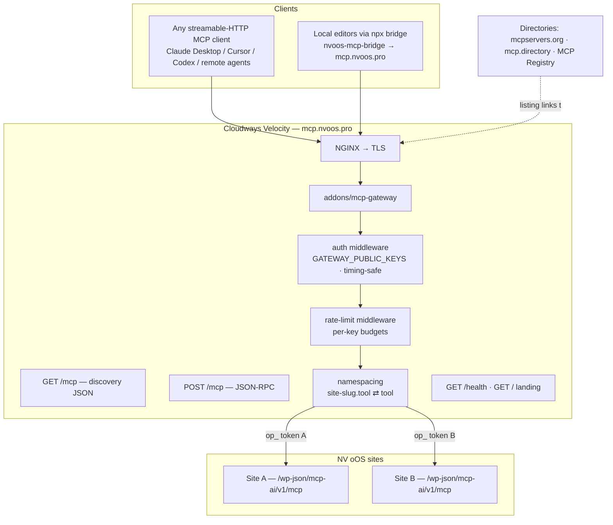

# NV oOS MCP Gateway — Public Fleet MCP Endpoint on Cloudways Velocity (Proposal)

**Date:** 2026-10-05
**Status:** 🔮 PENDING
**Estimated Effort:** 2–4 dev-days (Phases 0–6) + ~1 day directory submissions/review cycles
**Priority:** MEDIUM
**Related:** [054-nvoos-mcp-bridge-npx-implementation-plan.md](./054-nvoos-mcp-bridge-npx-implementation-plan.md), [024-hermes-agent-fleet-operator-implementation-plan.md](./024-hermes-agent-fleet-operator-implementation-plan.md), [026-media-worker-multi-tenancy-sidecar-proposal.md](./026-media-worker-multi-tenancy-sidecar-proposal.md), [media-worker-sidecar-proposal.md](./media-worker-sidecar-proposal.md), `docs/operations/deployment/media-worker-velocity-setup.md`, `addons/media-worker/` (pattern donor)

---

## Executive Summary

Every NV oOS site already **is** a full MCP server — the plugin exposes
streamable HTTP (MCP protocol 2026-07-28, verified live 2026-10-05: GET
discovery + JSON-RPC POST + optional SSE) at `/wp-json/mcp-ai/v1/mcp`. The
054 package made the **client side** trivial (`npx -y
@nvdigitalsolutions/nvoos-mcp-bridge`). What remains is the **server side**:
one branded, public, fleet-scoped endpoint at `https://mcp.nvoos.pro` that
can be submitted to MCP directories (mcpservers.org, mcp.directory, the
official MCP Registry) as a live public MCP server.

This proposal defines **`addons/mcp-gateway`** — a self-contained Node
service modeled 1:1 on the proven `addons/media-worker` anatomy (Express +
helmet + express-rate-limit, `src/middleware/` + `src/routes/`, env-only
config, `node --test` suites, Dockerfile, one-way subtree mirror to a
standalone repo, Velocity deployment guide). The gateway is an **MCP
aggregating proxy**: it accepts MCP clients over streamable HTTP, enforces
public API-key auth, and forwards `initialize` / `tools/list` / `tools/call`
to one or more NV oOS sites using Fleet Operator (`op_`) credentials, with
industry-standard **tool-name namespacing** (`<site-slug>.<tool>`) so the
fleet surface is unambiguous and collisions are impossible.

Security is the product: mandatory key auth (401 without), per-key site
bindings, fail-closed attribution, per-key rate limits, audit logging, and
upstream tokens that never leave the gateway process.

---

## Problem Statement

**Current state.**

1. A public NV oOS site can already be listed as a public MCP — but that
   exposes one site's identity, one site's tool surface, and a WordPress
   domain as the "product". No fleet view, no branded entry point.
2. Cloudways Velocity is Node-only, so there is no way to put WordPress
   itself on Velocity; a gateway service is the natural fit for
   `mcp.nvoos.pro`.
3. The npx bridge (054) is a **client-side stdio shim** — it cannot be
   hosted; a hosted public endpoint needs a **server** implementation of
   streamable HTTP.
4. The MCP spec does not define aggregation semantics (tool naming across
   multiple upstream servers is the gateway's responsibility); without a
   gateway, connecting one client to N sites means N servers, N tokens, and
   token-heavy `tools/list` payloads.
5. There is no first-class "here is the public NV oOS MCP" landing page,
   listing, or demo key for directory reviewers.

**Goal state.** `https://mcp.nvoos.pro/mcp` is a directory-grade public MCP
server: streamable HTTP with GET discovery, key-authenticated, rate-limited,
backed by one or more NV oOS sites whose tools appear namespaced
(`my-site.create_post`). An admin configures it with env vars only (Velocity
dashboard), the repo subtree-mirrors to `nvdigitalsolutions/nvoos-mcp-gateway`,
and the listing (mcpservers.org + mcp.directory + official MCP Registry)
shows a landing page, example config, and a read-only demo key.

---

## Goals & Non-Goals

### Goals

1. **Media-worker-style service** — `addons/mcp-gateway/` with the same
   anatomy, auth, rate-limiting, test, Docker, mirror, and Velocity
   deployment patterns as `addons/media-worker`.
2. **MCP aggregating proxy** — streamable HTTP `GET /mcp` (discovery) and
   `POST /mcp` (JSON-RPC 2.0); proxies `initialize`, `tools/list`,
   `tools/call`, `resources/*`, `prompts/*` to upstream NV oOS sites.
3. **Tool namespacing** — `tools/list` returns `<site-slug>.<tool>` (slug
   from config); `tools/call` reverse-maps before forwarding. Collisions
   become impossible by construction (industry standard: AgentGateway,
   mcp-proxy, Gravitee).
4. **Public-key auth** — `GATEWAY_PUBLIC_KEYS` maps a public API key to one
   or more site bindings; timing-safe comparison; `AUTH_MODE=strict`;
   two-step rotation (`GATEWAY_PUBLIC_KEYS_PREVIOUS`).
5. **Fail-closed multi-tenancy** — a key that maps to no site, or a site
   whose upstream token is missing, is rejected; upstream `op_` tokens never
   appear in any response or log line.
6. **Observability & landing** — `GET /health` (no auth, minimal data), `GET /`
   landing page for directory reviewers, structured request/audit logging.
7. **Directory readiness** — listing assets: description, logo, example
   client config (Claude Desktop + Zed + the 054 npx bridge), demo key with
   a read-only toolset, uptime monitoring.

### Non-Goals

- **No OAuth 2.1 in v1.** Static API keys are acceptable for listings today
  (documented clearly); the MCP Authorization spec (RFC 8414 discovery +
  dynamic client registration) is the Phase 6+ upgrade path.
- **No tool-per-key allowlist rewrite in the gateway** — scoping is
  delegated to upstream Fleet Operator allowlists (already server-side
  enforced); the gateway config only binds keys → sites.
- **No plugin changes.** The plugin's existing `/mcp` endpoint is the only
  upstream contract.
- **No central hub/repository of sites** — site bindings are env vars, the
  same "no management UI" stance as the media worker.
- **No load balancing/HA in v1** — one Velocity app; scale-out later if the
  listing brings traffic.

---

## Research Findings (industry standards)

### A. MCP gateway / aggregation patterns (Q1 2026 ecosystem)

- The spec does **not** define aggregation; tool-name collision handling is
  the gateway's responsibility, "usually by prefixing tool names with the
  source service's identifier" (Jaeger, Medium, Aug 2026).
- Surveyed gateway tools: AgentGateway (Linux Foundation, v1.0, `prefix +
  server name`, reject-duplicates mode), mcp-proxy (lightweight aggregation
  + tool filtering), Supergateway (transport bridge), Gravitee (enterprise
  proxy, namespacing), Bifrost (proxy with explicit-tool-execution default).
  None combines fleet namespacing + per-key site binding + zero-ops
  self-hosted deployment out of the box — the space this gateway fills
  (heyitworks.tech Q1 2026 survey).
- Official MCP roadmap (2026-03-05, "Enterprise Readiness") explicitly
  tracks "gateway and proxy patterns" — building one today follows the
  ecosystem's direction rather than fighting it (mnemoverse.com).
- Tool-schema inflation is the real cost gateway-less: a dozen servers can
  exhaust context before the first message; namespacing + per-key site
  binding keeps `tools/list` lean (Codex knowledge base, May 2026).

### B. Protocol & auth standards (modelcontextprotocol.io)

- Remote servers in 2026 are almost always **Streamable HTTP** (roxyapi.com);
  our upstream plugin endpoint speaks MCP protocol 2026-07-28 with GET
  discovery — verified live on the Docker dev site 2026-10-05.
- The July 2026 spec revision introduced **stateless transport** — ideal
  for a proxy: no server-side session state required between JSON-RPC calls
  (descope.com spec tracker).
- Authorization: bearer tokens must be in the `Authorization` header on
  every request, never in URLs/query strings; OAuth 2.1 with RFC 8414
  discovery + RFC 7591 dynamic client registration is the spec path — and
  the known tripwire for proxies (confused-deputy risk with static client
  IDs, per getmaxim.ai). Conclusion: **static API keys now, OAuth later**,
  and if/when OAuth lands, per-client dynamic registration with explicit
  consent.
- Stdio-vs-HTTP best practice: stdout/stderr hygiene is irrelevant to the
  gateway (HTTP server), but structured request logging must never echo
  tokens (modelcontextprotocol.io/llms-full.txt).

### C. Directory & registry submission requirements

- **mcpservers.org** — free-form web submission at `/submit` (~3 min); feeds
  `wong2/awesome-mcp-servers` (they no longer accept PRs directly).
- **mcp.directory** — auto-pulls metadata from the GitHub repo (a public
  repo is mandatory; hosted closed-source servers are shut out).
- **Official MCP Registry** — registry.modelcontextprotocol.io, with a
  public API (`/v0/servers`) and submission flow; lists server + restrictions.
- **pulsemcp.com / others** — web-form submissions.
- Common listing requirements (roxyapi.com 2026 guide): public endpoint,
  transport (streamable HTTP), auth method clearly stated (API key → which
  header), example copy-paste config, homepage/landing page, docs. Paid
  tiers exist for badges/placement; the listing itself is free.

### D. Cloudways Velocity deployment (repo-verified)

- Velocity = managed Node hosting: git-based deploys, NGINX + PM2, managed
  backups, dashboard env vars — exactly what the media worker uses
  (`docs/operations/deployment/media-worker-velocity-setup.md`).
- Node 22 recommended (media-worker's floor is `>=22.12.0`), `PORT` injected
  by the platform, `TRUST_PROXY=1` for rate limiting behind NGINX.
- Custom domains (e.g. `mcp.nvoos.pro`) + managed TLS are supported; deploy
  is a git push of the standalone mirror repo.
- The Cloudways API tooling used in this project covers the classic server
  platform; Velocity provisioning/deploys go through Velocity's own git
  integration (documented, not automatable from this repo).

### E. Repo conventions to honor (verified in-repo)

- `addons/media-worker/` anatomy: `src/index.js` + `src/middleware/` (auth,
  rate-limit, log) + `src/routes/` + `src/utils/`, `node --test` suites
  colocated (`*.test.js`), `Dockerfile`, `.dockerignore`, own `.github/`,
  env-only config, version in `package.json` (currently 3.4.0).
- One-way subtree mirror to a standalone repo
  (`nvdigitalsolutions/mcp-ai-wpoos-media-worker`) — the gateway mirrors to
  `nvdigitalsolutions/nvoos-mcp-gateway`.
- Proposals pair `NNN-…-proposal.md` + `NNN-…-implementation-plan.md`
  (024, 053); numbering continues at **055**.

---

## Design Decisions

| # | Decision | Rationale |
|---|----------|-----------|
| D1 | New addon `addons/mcp-gateway/`, media-worker anatomy | Proven deployment shape; zero new operational patterns |
| D2 | Express + helmet + express-rate-limit (same majors as media-worker) | Consistency; Velocity-proven; rate-limit middlewares are the boring choice |
| D3 | Node `>=22.12.0` | Matches media-worker; Node 22 is Velocity's documented choice |
| D4 | Stateless streamable HTTP (no sessions, no SSE in v1) | July-2026 spec revision makes stateless first-class; a proxy adds nothing by holding state |
| D5 | Tool namespacing `<site-slug>.<tool>` with reverse-map on `tools/call` | Industry standard; collisions impossible; upstream unchanged |
| D6 | `GATEWAY_PUBLIC_KEYS` env map: `key=slug[,slug…]`; site config via `NVOOS_SITE_<slug>_URL`/`_TOKEN` | Env-only, Velocity-dashboard friendly (media-worker `SITE_TOKENS` precedent) |
| D7 | Public keys are gateway-local, short (e.g. `nvoos_live_…`); upstream uses `op_` operator tokens | Separation of concerns: revoking a public key never touches site credentials |
| D8 | Fail-closed: unknown key → 401; key bound to unknown/untokenized site → 503 with structured error | Matches media-worker multi-tenant fail-closed rule |
| D9 | Mirror repo `nvdigitalsolutions/nvoos-mcp-gateway`, branch `main` | Same one-way subtree discipline as media-worker |
| D10 | API-key auth in v1; OAuth 2.1 (RFC 8414 + RFC 7591 dynamic registration) documented as Phase 6+ | Spec-correct path without blocking the listing; avoids the static-client-ID confused-deputy trap |

---

## Architecture

**Request flow (tools/call):** client POSTs `{"method":"tools/call","params":{"name":"site-a.create_post",…}}` with `Authorization: Bearer <public key>` → auth resolves key → site bindings → namespacer strips `site-a.` → gateway forwards the original JSON-RPC to Site A's `/mcp` with `Authorization: Bearer <op_ token>` → response mapped back to the client unchanged (tool names inside results are also un-prefixed where the upstream echoes them).

**Request flow (tools/list):** gateway fans out to each site bound to the key, merges result arrays, prefixes each tool name with the site slug, and returns one list. Failures of a single upstream degrade to a per-site `_meta` error entry instead of failing the whole list (graceful degradation, media-worker capability-matrix precedent).

---

## Security & Threat Model

| # | Threat | Mitigation |
|---|--------|-----------|
| T1 | Unauthenticated abuse of a public endpoint | `AUTH_MODE=strict`: 401 without a valid key; keys are ≥32-char random |
| T2 | Key leak → full fleet access | Per-key site bindings; two-step rotation (`_PREVIOUS` overlap window); keys never logged |
| T3 | SSRF via upstream URL config | Site URLs are env-config only (admin-set, not client-set); no client-supplied URLs in v1 |
| T4 | Tool-name smuggling (client sends un-prefixed name to bypass namespacing) | Un-prefixed names are rejected unless the key is bound to exactly one site (single-site mode = passthrough) |
| T5 | Upstream token exfiltration via logs/errors | Tokens redacted from all log lines; upstream `Authorization` headers never returned |
| T6 | One noisy/broken site degrades the fleet | Per-key + per-site rate budgets; per-site timeouts; health endpoint surfaces degraded bindings |
| T7 | Tool-schema token inflation | Per-key site bindings keep `tools/list` to the bound sites only; namespacing keeps names unique |

---

## Risks & Mitigations

| Risk | Likelihood | Mitigation |
|------|-----------|------------|
| Directory reviewers reject API-key-only auth | Low | Docs state auth clearly; OAuth 2.1 is the documented upgrade (Phase 6+) |
| `tools/list` fan-out latency for multi-site keys | Med | Parallel fan-out with per-site timeout; single-site keys (the demo key) stay fast |
| Velocity restart cadence / PM2 cluster state | Low | Gateway is stateless by design (D4) |
| Mirror-repo drift from monorepo | Low | Same subtree-sync discipline + CI gate as media-worker |
| Public listing attracts scanner traffic | High (certain) | Rate limits, structured 401/429 responses, minimal unauthenticated surface (`/health` + landing only) |

---

## Open Questions (resolve in PR)

1. **Demo key scope** — read-only operator on which site? Proposal: a dedicated low-traffic site or the main public site with a `read` operator allowlist.
2. **`mcp.nvoos.pro` DNS** — A record vs CNAME to the Velocity app hostname (Velocity docs favor its own domain flow).
3. **Official MCP Registry** — submission requires review cycles; list after mcpservers.org + mcp.directory are live.
4. **License** — follow media-worker (repo license) rather than the MIT packages/.

---

## Deliverables Summary

- `addons/mcp-gateway/` — full service (mirror of this table is the implementation plan)
- `055-nvoos-mcp-gateway-implementation-plan.md` — phased plan (this doc's sibling)
- Standalone mirror repo `nvdigitalsolutions/nvoos-mcp-gateway`
- `docs/operations/deployment/mcp-gateway-velocity-setup.md`
- Directory listings: mcpservers.org, mcp.directory, pulsemcp, official MCP Registry (after review)
- Landing page at `mcp.nvoos.pro/` with example configs (Zed, Claude Desktop, Cursor, npx bridge)
