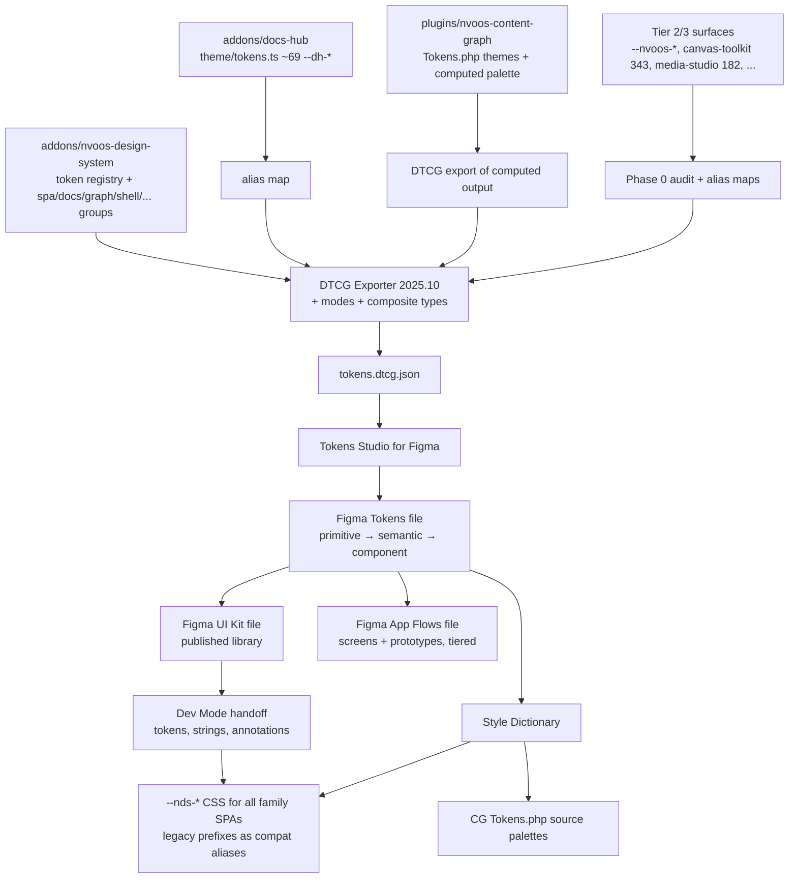
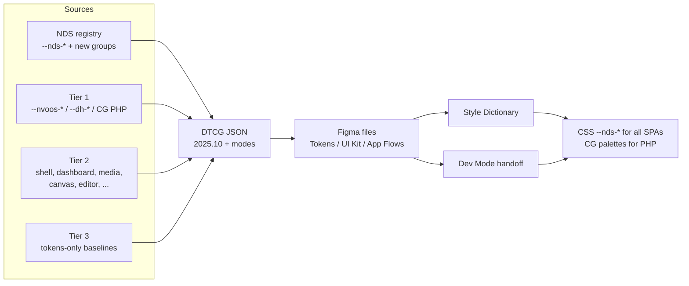

# NV oOS SPA Tool/Toolkit Family — Figma Design File Proposal

**Status:** Proposed
**Proposal ID:** 057
**Date:** 2026-10-06
**Related:** [033-pro-spa-v2-shortcode-proposal.md](033-pro-spa-v2-shortcode-proposal.md), [047-nvoos-design-system-addon-proposal.md](047-nvoos-design-system-addon-proposal.md), [047-nvoos-design-system-research.md](047-nvoos-design-system-research.md), [chat-spa-v2-parity-plan.md](chat-spa-v2-parity-plan.md), [docs-hub-broken-link-repair-proposal.md](docs-hub-broken-link-repair-proposal.md), [058-nvoos-design-system-dtcg-token-import-proposal.md](058-nvoos-design-system-dtcg-token-import-proposal.md), `docs/addons/toolkit-spa-blueprint.md`

---

## Executive Summary

NV oOS ships **~20 front-end SPA surfaces** across `addons/` and `plugins/` — the Pro SPA v2 chat/toolkit app, the Pro SPA v1 and legacy Chat SPA, Docs Hub (live on wp.org), Content Graph (in wp.org review), plus the React family (toolkit-shell, cloudways-dashboard, media-studio, canvas-toolkit, document-editor, schedule-anything-spa, librechat, funiq-bridge, graphify) and specialized surfaces (page-agent, algorave, comic-reader, cornerstone3d, canvas, fantasy-football, saas-controller, embedded, Telegram mini-app templates). All were built code-first: there is **no visual source of truth anywhere**, and a 2026-10-06 audit found **a token layer per surface** — ~85 `--nvoos-*` variables (Pro SPA v2), ~69 typed `--dh-*` constants (Docs Hub), 343 custom properties in canvas-toolkit, 182 in media-studio, 33 in document-editor, a PHP `Tokens` engine with per-theme contrast correction (Content Graph), and the ~70-token `--nds-*` registry of `addons/nvoos-design-system` — none of which consume each other.

The worst offender — and after a 2026-10-06 review, promoted to **Tier 1** — is **Funiq Bridge** (`addons/funiq-bridge`): a proprietary, standalone client e-commerce admin CMS ("Funiq CMS") that replicates the Payload CMS admin inside WordPress for the Funiq storefront PWA. Its entire visual layer is a **19-line SCSS file plus hardcoded hex values and magic numbers inline in TSX** (`#1e1e1e` sidebar, `#f0f0f1` main, `#007cba` active nav), hybridized with `@wordpress/components` and wp-admin table classes. It is the only family member that is a client product, the only one with a *reference visual language to replicate* (Payload), and the most ad-hoc styling in the family.

This proposal creates a **three-file Figma design system for the entire SPA toolkit family**, built on the industry standards researched in this document (W3C DTCG 2025.10, primitive → semantic → component variables, published component library with modes, Dev-Mode handoff, agentic-UX patterns). The Figma file becomes the federation point for every surface's token layer, the visual contract for the chat trust layer, the docs-browser reading surface, the graph canvas language, the toolkit-shell's generic list/table patterns — and the bridge to the DTCG exporter the design-system addon already ships.

Because several family members are shipped or in wp.org review, the file is built **as-built-first**: the first milestone documents today's pixels as a baseline, then evolves them through a tiered wave plan (Wave A = flagship surfaces in full; Wave B = the React family via shared primitives; Wave C = niche surfaces as token + screenshot baselines).

**Decision required:** approve the 3-file architecture, the federated variable model, the surface registry with tiering, the as-built-first sequencing, and the wave-based build plan (Phase 0 audit + Waves A–C).

---

## Problem Statement

### 1. No design source of truth — anywhere in a ~20-surface family

- **Pro SPA v2** — `addons/pro/assets/spa-v2/src/styles/main.css` is a single ~4,700-line file. The only abstraction is a theme block of 11 variables (`--nvoos-bg`, `--nvoos-primary`, …) duplicated three times (light, dark, `prefers-color-scheme` auto). Everything else — radii, spacing, font sizes, elevations, state colors — is hardcoded per component.
- **Docs Hub** — better disciplined (~69 `--dh-*` tokens via a typed `theme/tokens.ts`, 1,065-line `main.css`), but the tokens are product-local, undocumented visually, and disconnected from the rest of the family.
- **Content Graph** — colors do not even live in CSS. A PHP `Tokens` class (`src/Visual/Tokens.php`) computes themes, a 14-type node palette, edge-family colors, and per-theme contrast correction at render time, injected into Cytoscape via JS. The visual language of the graph (node shapes, icons, edge styles, legend, tooltip) exists only as PHP arrays and inline styles.
- **The rest of the family repeats the pattern** (see the Surface Registry below): canvas-toolkit ships 343 custom properties, media-studio 182, document-editor 33, cloudways-dashboard 18, comic-reader 13 — each a private, undocumented palette.
- **Funiq Bridge is the extreme case**: a client-facing admin CMS whose styling is 19 lines of SCSS and inline `style={{...}}` hex values in TSX (Layout, Sidebar, ListView). It has no tokens, no themes, no design documentation — yet it must *look like* a Payload CMS admin because it fronts the Funiq PWA, which was built against Payload's visual language. Every pixel is an unversioned guess at that language.

### 2. A token layer per surface — the federation problem

`--nds-*` (registry) is consumed by email/web integrations, but **not by a single SPA**. Each surface reinvents surfaces, text, borders, status colors, and spacing under its own prefix (`--nvoos-*`, `--dh-*`, CG's PHP themes, canvas-toolkit's 343 props, …). Changing a brand accent means editing every surface. This is exactly the drift the design-tokens industry standardized to prevent (research §2) — and the reason the Surface Registry (§below) is a first-class deliverable of this proposal: you cannot federate what you have not inventoried.

### 3. Agentic surfaces are the product's trust layer, and they are undocumented

The Pro SPA's most consequential UI is not the chat bubbles — it is the trust/control layer: `HitlApprovalBar`, `ToolShortcutsDrawer`, `TasksDrawer`, `DelegationNotice`, `WorkflowTracker`, `DiffReviewPanel`, `CheckpointBar`, `UsageBadges`, `CapabilityFlagBadges`. These encode the "observable, interruptible, reversible" agentic-UX contract (research §6). They exist only as code.

### 4. Handoff is archaeology

No component inventory, no state matrix, no naming alignment between React components and CSS blocks across a family of ~20 codebases. External reviewers (wp.org for Docs Hub and Content Graph, design collaborators) have no visual reference. Content Graph's accessibility story (its contrast engine enforces WCAG 3:1 non-text contrast) is invisible — a strength that cannot be communicated or stress-tested visually.

## SPA Surface Registry (complete family)

Audited 2026-10-06 across `addons/` and `plugins/`. Token-layer counts come from a CSS/TS custom-property sweep (dist + src, node_modules excluded). "Audit pending" cells are Phase 0 work.

### A. Front-end surfaces (in scope)

| # | Surface | Path | Stack | Token layer today | Tier | Figma treatment |
|---|---|---|---|---|---|---|
| 1 | **Pro SPA v2** | `addons/pro/assets/spa-v2` | React | ~85 `--nvoos-*` (light/dark/auto) | **1** | Full patterns + flows (detailed below) |
| 2 | **Docs Hub** | `addons/docs-hub` | React | ~69 `--dh-*` (typed `theme/tokens.ts`) | **1** | Full patterns + flows |
| 3 | **Content Graph** | `plugins/nvoos-content-graph` | PHP + vanilla JS | PHP `Tokens` engine (computed, contrast-corrected) | **1** | Full patterns + flows |
| 4 | Pro SPA v1 | `addons/pro/assets/spa` | React (legacy) | 3 vars | 2 | As-built archive only (parity plan → v2) |
| 5 | Chat SPA (legacy) | `addons/chat-spa` | React (legacy) | audit pending | 2 | As-built archive; reuses chat patterns |
| 6 | **Toolkit Shell** | `addons/toolkit-shell` | React, manifest-driven | audit pending | 2 | Generic list/table patterns — **multiplier for every `spa-manifests/*.json` surface** |
| 7 | Cloudways Dashboard | `addons/cloudways-dashboard` | React | ~18 | 2 | Shared primitives + dashboard patterns |
| 8 | Media Studio | `addons/media-studio` | React | ~182 JS-injected + 6 CSS | 2 | Shared primitives + media/fashion patterns |
| 9 | Canvas Toolkit | `addons/canvas-toolkit` | React (diagramming) | ~343 (dist) | 2 | Shared primitives + diagram patterns |
| 10 | Document Editor | `addons/document-editor` | React | ~33 | 2 | Shared primitives + editor patterns |
| 11 | Schedule Anything SPA | `addons/schedule-anything-spa` | React | audit pending | 2 | Shared primitives + calendar/list patterns |
| 12 | LibreChat | `addons/librechat` | React | audit pending | 2 | Reuses chat patterns |
| 13 | Funiq Bridge | `addons/funiq-bridge` | React admin panel (Payload replica) | 19-line SCSS + inline TSX hex | **1** | Full patterns + flows (client product — see §D below) |
| 14 | Graphify | `addons/graphify` | PHP + assets | audit pending | 2 | Reuses graph patterns (CG sibling) |
| 15 | Page Agent | `addons/page-agent` | JS overlay | ~20 (bundle) | 3 | Tokens only + as-built shots |
| 16 | Canvas (graphics API) | `addons/canvas` (+ `assets/canvas`) | Cairo-backed | audit pending | 3 | Tokens only + as-built shots |
| 17 | Cornerstone3D | `addons/cornerstone3d` | 3D viewer | audit pending | 3 | Tokens only + as-built shots |
| 18 | Algorave | `addons/algorave` | browser audio | audit pending | 3 | Tokens only + as-built shots |
| 19 | Fantasy Football | `addons/fantasy-football` | data integration | audit pending | 3 | Tokens only + as-built shots |
| 20 | Comic Reader | `addons/comic-reader` | React | ~13 | 3 | Tokens only + as-built shots |
| 21 | SaaS Controller | `addons/saas-controller` | operator toolkit | audit pending | 3 | Tokens only + as-built shots |
| 22 | Embedded | `addons/embedded` | embed helper | — | 3 | Documented as infrastructure |
| 23 | Telegram Mini-App templates | `addons/pro/build/tma-*` | mini-app CSS | 15–20 each | 3 | Tokens only (as-built) |

### B. Excluded (backend/services, no user-facing UI)

`cloud-worker`, `mcp-gateway`, `mcp-wordpress-gateway`, `media-worker`, `tenant-router` (Cloudflare Worker), `dietpi-proxy`, `fleet-operator` (backend operator), `pro/package.json` (build orchestration root). These are consciously out of the Figma scope; their config surfaces (if any) inherit admin primitives only.

### C. Tiering rules

- **Tier 1 — flagship**: primary user-facing surfaces, shipped or in wp.org review, **or client products** → full component patterns + state matrices + interactive prototypes.
- **Tier 2 — active family**: the React toolkit family → federated tokens + shared primitives + surface-specific pattern pages (entry screens, key states, empty/error); full component sets promoted on demand. Legacy members (Pro SPA v1, Chat SPA) are recorded **as-built in Archive only** — no pattern investment in deprecating surfaces.
- **Tier 3 — niche/specialized**: tokens only + as-built screenshot baselines; patterns promoted on demand when a surface becomes primary.

### D. Adjacent token pipelines (also Phase 0 inputs)

- The Pro toolkit's `extract_site_design_from_mockups` tool (`addons/pro/includes/site-creator-toolkit/`) already extracts design tokens from mockups — its output should target the same registry, making it a third source (with Figma and DTCG JSON) for 058's import flow.
- The Toolkit Shell's manifest system (`addons/pro/config/spa-manifests/<slug>.json`, blueprint in `docs/addons/toolkit-spa-blueprint.md`) means **one generic list/table pattern set covers N toolkit surfaces at once** — the highest-leverage Tier 2 investment.

---

## Industry Research: Best Practices & Standards

Sources are listed in full at the end of this document.

### 1. Figma file organization standards

Industry consensus (Figma's best-practices guide, zeroheight, Figma community reference files) for a product-level system:

- **Split by change cadence, not by artifact type.** Tokens change rarely; components change sometimes; screens/flows change constantly. Each gets its own file so publishing, versioning, and review stay cheap.
- **One page per concern, ordered left → right** (Cover → Foundations → Components → Patterns → Flows → Archive).
- **Separate file for draft/exploration work** — WIP never lives in the published library.
- **On-canvas organization by flow**: product/section separation with explicit notes and consistent spacing.
- **Cover page with status, owner, version, and changelog.**
- **Retrofit pattern (as-built-first)**: when design files are introduced after products ship, document the shipped state as a frozen baseline before proposing change — prevents "design file says X, product says Y" confusion during migration.

### 2. Design tokens: W3C DTCG 2025.10 (stable)

- The Design Tokens Community Group published the first stable spec **2025-10-28** (version 2025.10), backed by 40+ orgs (Adobe, Figma, Google, Microsoft, Shopify, Salesforce).
- Reference implementations: **Style Dictionary, Tokens Studio, Terrazzo**; Figma, Penpot, Sketch consume the format. Token files now move between tools **without custom parsers**.
- This repo already has a DTCG exporter (`addons/nvoos-design-system/includes/class-nvoos-nds-dtcg-exporter.php`). Known gaps against 2025.10 must be closed for the sync pipeline (see Proposed Solution → Sync pipeline): no mode export, incomplete type map (`size`/`spacing` flattened to `dimension`, no `border`, `borderRadius`, `typography` composites).
- **Tokens are the contract between design and code** — named decisions, not raw values. Content Graph's PHP token class and Docs Hub's typed constants are already 90% of a token pipeline; they are missing only the exchange format.

### 3. Figma variables architecture (primitive → semantic → component)

The 2025/2026 playbooks (Design Systems Collective, Figma resource library, Nisslmüller 2025) agree on three layers:

| Layer | Example | Owner | Changes |
|---|---|---|---|
| **Primitive** | `color/blue/500`, `space/4` | token curator | rarely |
| **Semantic** | `surface/raised`, `text/secondary`, `status/danger` | design-system team | with product needs |
| **Component** | `button/bg-primary-hover`, `chat/bubble-user-bg` | component authors | with component work |

Rules: components **never** reference primitives directly; semantic tokens alias primitives; component tokens alias semantic tokens. Modes (`light`, `dark`, `high-contrast`) live on collections; extended collections align Figma with DTCG for export. In a multi-product family, semantic tokens are shared; **product-prefixed component tokens** (`chat/*`, `docs/*`, `graph/*`) live below them.

### 4. Component library structure

- **Components first, patterns second.** Primitives (button, input, badge, tooltip, dialog) are one atomic layer; composite/domain components (message bubble, tool-call block, callout, graph node) reference them.
- **One component per state family, not per screenshot.** Variants (not separate frames) for size, state, and density; component properties for visibility toggles.
- **Auto layout everywhere** for realistic content growth — critical for chat (unbounded token counts/tool results), docs (arbitrary markdown depth), and graphs (node degree scaling).
- **Test components in all modes.** Visual bugs hide in alt themes; every component gets light/dark/high-contrast checks.
- **String tokens for ARIA labels and helper text**, exportable as JSON for dev handoff.

### 5. Handoff and code sync

- Figma Dev Mode + variables: engineers read tokens, spacing, and strings from the library, not from screenshots.
- **Sync pipeline**: DTCG JSON → Tokens Studio → Figma variables; reverse via Figma REST API → Style Dictionary → CSS/PHP. Prevents the four-token-fork drift.
- The "7 habits" checklist (atomize.tools): tokens first, one cross-discipline naming convention, a code-sync pipeline, a named governance owner.

### 6. Agentic UX patterns (the chat trust layer)

2026 agentic-UX literature (Smashing Magazine, Zylos Research, Agentic Design, aiuxplayground) converges on three properties the Pro SPA already implements in code and must codify visually:

- **Observable**: streamed reasoning and tool calls build trust; plans/evidence/assumption logs beat "thinking…" black boxes. → tool blocks, `WorkflowTracker`, `CheckpointBar`, annotation chips.
- **Interruptible**: visible running state with stop affordances; chat while the agent works. → stop button, `TasksDrawer` retry/dismiss, mid-task redirect.
- **Reversible**: approvals with consequences stated, diff review before destructive apply, receipts and traces. → `HitlApprovalBar`, `DiffReviewPanel`, `DelegationNotice`, `UsageBadges`.

Additionally: **stream tool calls even when results are simple** (Zylos); avoid approval fatigue by showing consequence and context on the approval card (Smashing); progress indicators need baseline + consequence + path (alitajer).

### 7. Accessibility standards

- **WCAG 2.2 AA is the build target** (adopted in proposal 047 research; EAA legal driver).
- Content Graph already enforces **SC 1.4.11 non-text contrast (3:1)** at render time via its PHP contrast engine — the Figma file must mirror this so palette changes can be pre-validated in design before hitting PHP.
- Docs Hub ships dark mode; Pro SPA ships dark/auto; none ship high-contrast or reduced-motion variants beyond Content Graph's motion check (`theme.motionAllowed()`).
- Figma-side requirements: AA contrast pairs validated in all modes, focus-visible states on every interactive component, reduced-motion variants, string tokens for aria-labels.

---

## Tier 1 Surface Inventory (from code)

Source of truth verified 2026-10-06.

### A. Pro SPA v2 — `addons/pro/assets/spa-v2/src/` (React chat/toolkit)

| Area | Source | Key surfaces |
|---|---|---|
| Layout | `components/layout/` | `Layout`, `ChatSidebar` (threads, tabs, assistant select, media tab, vector-store status), `RightPanel` (assistant/model), `StatusBar` (connection states, indicators) |
| Chat | `features/chat/` | `ChatPage`, `AgentPanel` (messages, composer, toolbar, attachments), `MessageView` (user/assistant, streaming indicator, markdown, code blocks w/ copy, tool blocks, annotations), `SlashCommandsDrawer`, `ToolShortcutsDrawer`, `SuggestedPrompts` |
| Shared | `components/shared/` | `CommandPalette` + `CommandAutocomplete`, `KeyboardShortcutsHelp`, `MemoryDrawer` (importance levels, scope, audit), `OkfDrawer`, `TasksDrawer` (jobs: running/completed/failed, progress, batch), `HitlApprovalBar` (approve/deny cards), `DelegationNotice`, `WorkflowTracker` (step states), `CheckpointBar`, `DiffReviewPanel`, `ModelComparisonView`, `JobCard`, `Toast`, `UsageBadges` (tokens/cost), `CapabilityFlagBadges` (read-only/write/pro/async…), `VectorStoreIndicator`, `CollaborativePresence`, `AudioRecorderButton`, `SpeechButton` |
| Tools | `features/tools/` | `ToolsPage` (search/filter/sort, capability badges, descriptions) |
| Assistants | `features/assistants/` | list, create/edit form modal, delete confirm |
| Settings | `features/settings/` | settings form (fields, toggles, visibility, save/reset) |
| Workflows / Analytics | `features/workflows/`, `features/analytics/` | coming-soon placeholders |
| Embedded | `features/embedded/` | front-end embed mode (guest, theme, height) |
| Media | `components/media/` + sidebar media tab | grid/list views, selection, insert, counts |

Theming: 11 `--nvoos-*` variables × light/dark/auto (`main.css` L9–47). Everything else hardcoded.

### B. Docs Hub — `addons/docs-hub/src/` (React docs browser, wp.org live)

| Area | Source | Key surfaces |
|---|---|---|
| Theme | `theme/tokens.ts` | ~45 typed `--dh-*` constants (surfaces, text, borders, accents, callouts, spacing/layout, typography, shadows, transition) |
| Components | `src/components/` | `Sidebar` (nav tree), `SearchBox` + search overlay, `Breadcrumbs`, `RightTOC` (in-page TOC), `ContentArea` (prose), `Callout` (note/tip/warning/danger), `CodeBlock`, `PrevNext` (pager), `PageFooter` |
| Routes | `src/routes/` | `DocPage`, `NotFound` |
| Styles | `src/styles/main.css` | ~1,065 lines; light + dark tokens; three-column grid (sidebar \| content \| TOC); responsive overrides |

Strengths: scoped root (`.nvoos-docs-hub-root`), documented CSS architecture, typed token constants. Gaps: no visual doc, tokens disconnected from the family, no high-contrast mode.

### C. Content Graph — `plugins/nvoos-content-graph/` (PHP + vanilla JS, Cytoscape canvas)

| Area | Source | Key surfaces |
|---|---|---|
| Visual tokens | `src/Visual/Tokens.php` | `themes()` (dark/light: canvas, surface, node_label, edge × 4 families, selection, accent, muted), `type_palette()` (14 node types), `icon_catalog()`, `edge_families()`, `shape_map()`, `visual_defaults()`, `presets()`, WCAG contrast engine (`relative_luminance`, `contrast_ratio`, `ensure_contrast` @ 3:1, `contrast_report`) |
| Frontend | `assets/js/content-graph-frontend.js` + `content-graph-theme.js` | Cytoscape embed: nodes (color/size by degree, shape, icon), edges (family color, bezier, arrows), legend, hover tooltip (label/type/connections), zoom cluster, loading/error states, reduced-motion gate |
| Admin | `assets/js/content-graph-admin.js`, `src/Admin/Sections/` | Settings page with 10 sections: General, Appearance, Display, Build, Sources (CPTs/CCTs/External), Embeddings, Remote; commerce gated |
| Styles | `assets/css/` (199 + 889 lines) | No CSS custom properties — colors injected PHP→JS at render |

Distinctive: tokens are **computed, not declared** (per-theme contrast correction). The Figma file must capture the resulting visual language, not just the raw palette.

### D. Funiq Bridge — `addons/funiq-bridge/src/` (React admin CMS, Payload replica, proprietary client product)

| Area | Source | Key surfaces |
|---|---|---|
| Shell | `components/Layout.tsx`, `components/Sidebar.tsx` | Fixed 220px dark sidebar (`#1e1e1e`) + light main (`#f0f0f1`); nav buttons with `#007cba` active state — **all inline `style={{…}}` hex values** |
| Lists | `components/ListView.tsx` | Paginated `wp-list-table widefat striped` tables, Add button, Edit/Delete actions, `confirm()` delete, empty state, page pager — hybrid of wp-admin classes + inline styles |
| Forms | `components/EditForm.tsx` (191 lines) + `components/fields/` (7 fields) | Text, Textarea, Number, Checkbox, Date, Relationship, ImageUpload (WP media modal); collection-config-driven |
| Config | `src/config/collections.ts` | 7 collections (Products, Categories, Brands, Colors, Statuses, Promotions, Promocodes) + banner/carousel globals; column + field schemas |
| Styles | `src/styles/admin.scss` | **19 lines**: root margin hack + `.funiq-image-preview` (border `#ddd`, radius 4px). Everything else: inline styles or `@wordpress/components` defaults |
| API surface | `includes/` (PHP) | Payload-compatible REST `/wp-json/funiq/v1/*` with `{docs, totalDocs, limit, totalPages, page, hasNextPage, hasPrevPage}` pagination; `manage_funiq` capability |
| Distribution | pre-compiled `build/index.js` | Standalone (no NV oOS required), proprietary license, WP 6.7+/PHP 8.1+, 1 dependency (`@tanstack/react-query`) |

Why Tier 1: it is the only **client product** in the family, the only surface whose design must match an external reference language (Payload CMS admin — the PWA the bridge serves was built against Payload), and the family's most ad-hoc styling. The Figma file's job here is double: freeze the as-built Payload imitation, then upgrade it to a documented Funiq visual language expressed through family tokens.

---

## Proposed Solution

### 1. File architecture (3 files, one family)

```
NV oOS — SPA Toolkit · Tokens        ← variables only (federated collections + modes)
NV oOS — SPA Toolkit · UI Kit        ← published library (primitives + per-family pattern sets)
NV oOS — SPA Toolkit · App Flows     ← per-surface screens, prototypes, annotations (tiered)
```

Rationale (research §1): change-cadence separation, clean publishing boundaries, exploration kept out of the library. Both library files publish with semantic versioning; App Flows never publishes. **As-built-first**: the first milestone freezes today's pixels for every surface in the registry as a baseline (Tier 1 detailed, Tier 2 screens, Tier 3 screenshots); evolution happens from there. The registry (§above) is the scope-of-work contract: nothing outside it enters the files without a registry update.

### 2. Tokens file — federated variable model

**Collections (one per token group; modes = light / dark / high-contrast):**

| Collection | Federates | Notes |
|---|---|---|
| `primitives/color` | NDS `colors` + CG `type_palette` hues | raw ramps (blue/50…900, neutral/0…900, status + node-type hues) |
| `primitives/space` | NDS `spacing` | 4px base scale |
| `primitives/radius` | NDS `borders` | `none/sm/md/lg/full` |
| `primitives/type` | NDS `typography` + Docs Hub font sizes | families, size scale, line-heights |
| `primitives/shadow` | NDS `shadows` + `--dh-shadow-*` | elevation 0–3 |
| `semantic/surface` | `--nvoos-bg*`, `--dh-bg-*`, CG canvas/surface | new; shared across products |
| `semantic/text` | `--nvoos-text*`, `--dh-text-*`, CG node_label/label | new |
| `semantic/border` | `--nvoos-border`, `--dh-border-*`, CG border | new |
| `semantic/status` | `--nvoos-danger/success/warning`, CG contrast-corrected hues | new |
| `component/chat/*` | `--nvoos-*` specifics | bubble bg, tool-chip states, code-block bg, HITL accents |
| `component/docs/*` | `--dh-callout-*`, `--dh-active-sidebar-*`, `--dh-bg-code` | callout variants, code theme, sidebar active |
| `component/graph/*` | CG `themes()` + `type_palette()` + edge families | node-type colors (14), edge family × 4, selection, legend |
| `component/shell/*` | toolkit-shell manifest views | generic list/table tokens — reused by every manifest surface |
| `component/canvas/*` | canvas-toolkit + canvas | diagram/canvas tokens (subset of its 343) |
| `component/media/*` | media-studio | studio/fashion-mode tokens (subset of its 182) |
| `component/editor/*` | document-editor | editor chrome tokens |
| `component/ops/*` | cloudways-dashboard, saas-controller | operator/dashboard tokens |
| `component/funiq/*` | Funiq Bridge (new — none exist today) | admin CMS tokens: sidebar, list/table, form fields, Payload-derived palette |

**Federation rules:**

1. Semantic tokens alias NDS `--nds-*` values wherever an equivalent exists; surface-specific values are added to the NDS registry as new groups (`spa`, `docs`, `graph`, `shell`, `canvas`, `media`, `editor`, `ops`, `funiq`) so web, email, and every SPA share one source. Registry coverage is per the Surface Registry, tier by tier — Tier 2/3 surfaces may start with a *mapped subset* (their most-used values) rather than a full port.
2. Legacy surface variables (`--nvoos-*`, `--dh-*`, …) become alias compatibility layers during bridge PRs, then are deprecated.
3. **Content Graph stays PHP-computed**: the Figma file documents the *effective* palette per theme (post-`ensure_contrast()`), and the PHP engine gains a DTCG export of its computed output so the round-trip stays honest. Figma contrast plugins pre-validate palette proposals before they reach PHP.
4. **String tokens** for aria-labels/helper text (research §3), exported as JSON for the family's codebases.

### 3. UI Kit file — component inventory (as-built-first, then evolved)

**Pages:** Cover → Foundations (color, type, spacing, iconography) → Primitives → Chat Patterns → Trust & Control Patterns → Docs-Browser Patterns → Graph Patterns → Admin CMS Patterns (Funiq) → Toolkit-Shell Patterns → Tier-2 Family Patterns (dashboard/media/diagram/editor/calendar) → Product Admin Patterns → Archive.

Pattern-set coverage is wave-scoped (see Implementation Waves): Tier 1 sets are built fully (state matrices + variants); Tier 2 sets start as **generic shared patterns** (the toolkit-shell list/table set covers every manifest surface at once) plus per-surface entry screens; Tier 3 contributes nothing to the library until promoted.

**Admin CMS Patterns (Funiq, ~10):** AdminShell (dark sidebar + light main), CollectionSidebar (active/expanded), CollectionList (wp-table hybrid: header, row actions, empty state, pager), EditForm (field grid + save/cancel), field primitives ×7 (Text, Textarea, Number, Checkbox, Date, Relationship, ImageUpload/media-modal), GlobalEditor (banner/carousel), DeleteConfirm (replacing the raw `confirm()`), plus a **Payload Reference page** documenting the Payload admin visual language the bridge imitates (D13).

**Primitives (~14):** Button (size/variant/danger/disabled), IconButton, Input, Textarea, Select, Toggle/Switch, Checkbox, Badge, Chip, Tooltip, Dialog/Modal, Drawer, Toast, Tabs, Spinner/Skeleton, ProgressBar, EmptyState.

**Chat patterns (~12):** MessageBubble (user/assistant × streaming/complete), MarkdownBlock (code block w/ copy, tables, headings), ToolCallBlock (pending/running/success/error + raw/truncated/attachments/chart/iframe variants), AnnotationChip (thinking/memory/generating), SuggestedPrompts, Composer (toolbar: attach/audio/speech/stop), CommandPalette + autocomplete, SlashCommandsDrawer, ToolShortcutsDrawer, AttachmentChip/Strip, StreamingIndicator, MessageActions.

**Trust & control patterns (~11):** HitlApprovalCard (approve/deny, args, reason, consequence copy), TasksDrawer (tabs, item states, progress, batch, retry/dismiss), DelegationNotice (complete/error), WorkflowTracker (step states), CheckpointBar, DiffReviewPanel, UsageBadges (tokens/cost), CapabilityFlagBadges (10+ types), VectorStoreIndicator, CollaborativePresence, MemoryDrawer (importance low→critical, scope chips, audit), KeyboardShortcutsHelp, ModelComparisonView.

**Docs-browser patterns (~10):** SidebarNav (active/expanded states), Breadcrumbs, Callout × 4 variants, CodeBlock (light/dark code theme), RightTOC (anchor + active), PrevNext, SearchBox + SearchOverlay (results, empty, no-match), PageFooter, DocPage prose layout, NotFound.

**Graph patterns (~10):** GraphCanvas, Node × 14 type variants (color + shape + icon), Edge styles × 4 families (solid/dashed per relation, arrows), Legend, NodeTooltip (quick-info), ZoomCluster, GraphLoading/GraphError/GraphEmpty, ReducedMotion state, EmbedCard (frontend embed shell), AdminSection (settings-section shell reused by 10 CG sections).

Every component: variants per state matrix, auto layout, all modes tested, focus-visible, reduced-motion variant where animated.

### 4. App Flows file — screens & prototypes (per product)

One page group per surface family (Chat, Docs, Graph, Shell, Media, Editor, Dashboard, …), tiered:

- **Tier 1** gets entry screens, key states (loading/empty/error), and five flagship interactive prototypes:

1. **Guarded tool-call flow** (Pro SPA) — message → streamed plan → tool chip (running) → HITL approval (consequence copy) → approve → diff review → success receipt + cost badges.
2. **Background job flow** (Pro SPA) — workflow trigger → task drawer (running + progress) → interrupt → retry/dismiss → delegation notice.
3. **Docs reading & search flow** (Docs Hub) — sidebar drill-down → DocPage prose → in-page TOC follow → search overlay → result jump → prev/next pager.
4. **Graph explore & embed flow** (Content Graph) — embed load → node hover tooltip → legend reference → node click → zoom cluster; plus the admin Appearance panel showing palette presets.
5. **Funiq CMS collection flow** (Funiq Bridge) — sidebar → collection list → create/edit form (media picker, relationship fields) → save → delete confirm — captured as-built (Payload imitation) first, then as the documented Funiq language.

- **Tier 2** gets as-built screens + one representative flow each (e.g. toolkit-shell manifest list → detail; media-studio picker → generate → review).
- **Tier 3** gets frozen screenshot baselines + token mapping notes only.

### 5. Handoff & sync pipeline



**Exporter gaps to close (verified in code):** the NDS DTCG exporter emits `group → id → { $type, $value }` with **no mode support** and an incomplete `type_map` (no `border`, `borderRadius`, `typography` composites; `spacing`/`size` flattened to `dimension`). Phase 0 adds `$extensions.mode` and 2025.10 composite types. Content Graph's `Tokens.php` gains a small export method (computed per-theme output, since raw palettes lie about what renders).

### 6. Governance & versioning

- **Named owner** (single design-system owner per research §5).
- Semantic versioning on both published files; changelog on cover page; Archive page for deprecations (never delete).
- Contribution rules: new screens in App Flows only; promotion to UI Kit requires review (variants complete, all modes, a11y pass).
- **wp.org constraint**: Docs Hub is live and Content Graph is in review — visual changes land only after the as-built baseline is frozen and any review-loop fixes are reflected in the file (file stays in sync with what ships).

---

## Architecture

The family's per-surface token layers federate through one DTCG-shaped pipeline into the three Figma files, and back into code via Style Dictionary and the PHP engines:



---

## Implementation Waves

### Phase 0 — Family token audit & exporter groundwork (Week 1, all tiers)
1. Complete the Surface Registry: resolve every "audit pending" cell (per-surface token inventory + stack + status). Commit the completed registry as the scope-of-work contract.
2. Add `spa`/`docs`/`graph`/`shell`/`canvas`/`media`/`editor`/`ops`/`funiq` groups + mode support + composite types to the NDS registry and DTCG exporter.
3. Add a computed-palette DTCG export to Content Graph's `Tokens.php`; alias-map Docs Hub's `--dh-*` constants into the registry.
4. Produce one reference `tokens.dtcg.json` covering Tier 1; verify Tokens Studio import.

### Wave A — Tier 1 flagship surfaces (Weeks 1–6)
5. Build the Tokens file collections (primitives + semantic + component groups).
6. Freeze the **as-built baseline**: replicate today's light/dark values exactly for Pro SPA v2, Docs Hub, and Content Graph — and for Funiq Bridge, capture the shipped Payload imitation as a frozen baseline.
7. Bridge PRs (zero visual diff): Pro SPA consumes `--nds-*` with `--nvoos-*` deprecated aliases; Docs Hub `--dh-*` becomes aliases of the same variables; CG keeps PHP as source but syncs from the DTCG JSON; **Funiq Bridge extracts its inline TSX styles into CSS consuming `--nds-*`/`component/funiq/*`** — its first real token layer.
8. UI Kit: primitives (14) → chat patterns (12) → trust & control patterns (11) → docs-browser (10) + graph (10) + admin CMS patterns (10, Funiq) → publish v1.0.0.
9. App Flows: per-surface pages + the five flagship prototypes (incl. the Funiq CMS collection flow).

### Wave B — Tier 2 React family (Weeks 6–10)
10. Federate Tier 2 tokens (mapped subsets first); bridge PRs per surface on their own release cadence.
11. Build the **Toolkit Shell generic patterns first** (list/table/detail/form) — one set covers every `spa-manifests/*.json` surface (highest-leverage Tier 2 investment).
12. Per-surface pattern pages: cloudways-dashboard, media-studio, canvas-toolkit, document-editor, schedule-anything-spa, librechat, graphify.
13. Record Pro SPA v1 and legacy Chat SPA **as-built in Archive only** (parity plan deprecates toward v2).

### Wave C — Tier 3 baselines (ongoing, low effort)
14. Frozen screenshot baselines + token mapping notes for comic-reader, cornerstone3d, algorave, page-agent, fantasy-football, canvas, saas-controller, embedded, TMA templates.
15. Promotion path: any Tier 3 surface becoming primary gets a Wave B-style pattern page.

### Governance (alongside Wave A, enforced from then on)
16. Cover pages, changelogs, contribution guide, archive policy; named owner.
17. Docs: link Figma files from each surface's README; note the wp.org sync constraint; update the registry in this proposal whenever a surface is added or retired.

---

## Key Design Decisions

| # | Decision | Rationale |
|---|---|---|
| D1 | Three files, not one | Change-cadence separation; publishing cost (research §1) |
| D2 | Semantic + component layers over primitives; components never alias primitives | 2025/2026 variables best practice (research §3) |
| D3 | One registry with `spa`/`docs`/`graph`/`shell`/`canvas`/`media`/`editor`/`ops`/`funiq` groups; every surface's token layer folds in | One source of truth; kills the per-surface forks identified in Problem Statement §2 |
| D4 | Legacy prefixes (`--nvoos-*`, `--dh-*`, …) kept as deprecated aliases during bridges | Zero visual-regression migration |
| D5 | Trust-layer patterns get the same rigor as chat bubbles | They are the product's agentic contract (research §6) |
| D6 | WIP stays in App Flows; promotion to UI Kit requires review | Library hygiene (research §1) |
| D7 | DTCG 2025.10 as the exchange format; exporter fixed in-repo | Spec stable since 2025-10-28; exporter already exists |
| D8 | Content Graph stays PHP-computed; Figma documents effective (post-contrast) output and pre-validates proposals | CG's `ensure_contrast()` is a feature, not a bug — the file must not pretend otherwise |
| D9 | As-built-first: freeze today's pixels before any visual change | Several surfaces are shipped/in review; prevents spec/drift confusion (research §1 retrofit) |
| D10 | Tiered waves (A/B/C) instead of one monolithic build | A ~20-surface family cannot be designed in one pass; tiers bound effort by user-facing importance |
| D11 | Legacy surfaces (Pro SPA v1, Chat SPA) are Archive-only in the file | Parity plan deprecates them toward v2; no pattern investment in retiring surfaces |
| D12 | Toolkit Shell generic patterns are built before any single Tier-2 surface | One list/table/detail/form set covers every `spa-manifests` surface — the highest-leverage Tier-2 work |
| D13 | Funiq CMS keeps the **Payload-derived visual language** (client PWA consistency), expressed through family tokens — not the NV oOS language, not raw Payload copies | The bridge fronts a PWA built against Payload; switching visual languages would break client brand continuity. The Payload Reference page documents the language; tokens make it maintainable |

---

## Risks & Mitigations

| Risk | Likelihood | Mitigation |
|---|---|---|
| Token migration causes visual drift in any family surface | Medium | Alias-based bridges; pixel-diff screenshots in review; legacy vars retained until cleanup |
| Figma library rots without an enforcing owner | High | Named owner + promotion gate + cover-page versioning (research §5) |
| CG palette divergence: Figma shows raw palettes, PHP renders contrast-corrected colors | High | D8 — export computed output; contrast pre-validation in Figma mirrors the PHP engine |
| Tokens Studio round-trip loses data (modes/composites) | Medium | Phase 0 exporter hardening + round-trip test before any CSS/PHP change |
| wp.org review loop forces Docs Hub/CG changes that desync the Figma file | Medium | Sync constraint in governance; as-built baseline re-frozen per release |
| HITL/approval pattern spec conflicts with future agentic-UX research | Low | Patterns documented as v1 with observable/interruptible/reversible principles, not pixel dogma |
| **Funiq is proprietary/client-facing** — Funiq-specific patterns must not leak into public docs/assets | Medium | `component/funiq/*` tokens + Funiq pattern pages stay in the internal Figma file; public exports (DTCG/docs) ship only the neutral subset |
| Payload lookalike drifts from the real Payload admin as Payload evolves | Low | Payload Reference page pins the replicated version; D13 keeps Funiq's language self-owned rather than chasing Payload upstream |
| **Scope creep**: 23 surfaces × full fidelity = never ships | High | Registry is the contract; Tier 2/3 get mapped subsets + baselines, not full component sets (D10–D12) |

---

## Success Metrics

- **100%** of the Surface Registry (23 surfaces) covered: every surface federated, consciously excluded, or baselined — with zero "audit pending" cells after Phase 0.
- **100%** of hardcoded Tier 1 values mapped to a federated token within 2 releases; Tier 2 mapped subsets ≥ 80% of most-used values.
- **1** published UI Kit with **≥67 Wave A components** (14 primitives + 12 chat + 11 trust + 10 docs + 10 graph + 10 admin CMS/Funiq) + **Wave B generic toolkit patterns** (list/table/detail/form/calendar/media/editor/diagram) covering all manifest surfaces at v1.1.0.
- **3 modes** (light/dark/high-contrast) validated per component; AA contrast passes in all; CG non-text ≥ 3:1 preserved.
- **5** Tier 1 interactive prototypes (tool-call, background job, docs reading/search, graph explore/embed, Funiq CMS collection flow) + ≥1 representative flow per Tier 2 surface.
- **1** lossless DTCG round-trip: registry + Tier 1 sources → JSON → Tokens Studio → Figma → Style Dictionary → CSS/PHP, automated.
- **0** unreviewed visual changes merged into any family surface after Wave A (promotion gate).

---

## Open Questions

1. **Team workspace placement** — dedicated "NV oOS Design" team vs. existing team? (Affects Figma plan/billing.)
2. **Iconography source** — Docs Hub uses inline SVG; CG embeds a 14-type icon catalog as data URIs; Pro SPA mixes emoji/SVG; 10+ more surfaces each have their own glyphs. Do we unify on one icon set (e.g., Lucide) or document each surface's glyphs as-is?
3. **High-contrast mode scope** — full `forced-colors` (Windows) emulation, or a WCAG-AA "high-contrast" token mode only?
4. **Who is the named owner?** (Governance requires a human.)
5. **Legacy surfaces** (Pro SPA v1, Chat SPA) — Archive-only per D11 confirmed, or does Chat SPA (still shipped for base plugin users) need an as-built screen baseline beyond the archive?
6. **Content Graph commerce gating** — document gated admin surfaces in the file, or keep them out until released?
7. **AI-assisted build** — use the repo's own image/design tooling (Gemini) for cover art/placeholder assets, or keep the file asset-free?
8. **Toolkit Shell manifest count** — how many `spa-manifests/*.json` surfaces exist today, and are any Tier 1-worthy? (Determines whether Wave B shell patterns are "one set" or "one set + exceptions".)
9. **Tier 3 exceptions** — cornerstone3d (medical) and page-agent (public-facing overlay) touch non-admin users; do they need component treatment before other Tier 3 surfaces?
10. **Funiq brand direction** — does the client want the Payload admin look preserved (D13 default), an explicit Funiq-branded evolution, or parity with the Funiq PWA's upcoming design refresh? (Needs a client decision before the Funiq pattern set is finalized.)

---

## Future Work: User-Facing "Import My Figma Design" (proposed follow-up 058)

**Clarification of scope:** this proposal does **not** give end users an
"import a Figma file" button, and one caveat is non-negotiable: a raw `.fig`
file can never be imported anywhere outside Figma — the format is proprietary
and unparseable. What *can* cross the design/code boundary is **tokens**
(DTCG JSON). The pipeline above makes that boundary standard, which turns a
user-facing import feature from impossible into a mirror image of machinery
that already half-exists:

- **Today:** the NDS addon exports tokens → DTCG JSON (`DTCG_Exporter`) and
  imports **email templates only** (`class-nvoos-nds-tool-import-email-template.php`).
  End users theme via the admin Tokens page (editor + 3 presets). No Figma
  anywhere in that loop.
- **Follow-up 058** (now drafted: [058-nvoos-design-system-dtcg-token-import-proposal.md](058-nvoos-design-system-dtcg-token-import-proposal.md)) **adds:** a token importer as the mirror of the exporter.
  User flow: export variables from Figma via Tokens Studio (free) or the
  Variables REST API → DTCG JSON → paste/upload into **Settings → Design
  System → Tokens → Import** (or MCP tool `nds_import_design_tokens`,
  admin-gated, matching the existing 8-tool pattern) → validate against the
  registry schema → update option → regenerate `--nds-*` CSS. After this
  proposal's Wave A bridge PRs the Tier 1 SPAs restyle automatically from that
  single import, and each Wave B bridge extends the reach to the rest of the
  23-surface family.
- **Hard limits to state up front:** import restyles *tokens* (colors, type,
  spacing, radii, shadows) — it cannot turn Figma components or layouts into
  React/JS automatically; that remains a Dev-Mode handoff activity. Content
  Graph keeps its contrast correction (D8): imported palettes run through
  `ensure_contrast()` at render, so a bad palette degrades to accessible,
  not to broken.

Recommended sequencing: ship this proposal's Phase 0 audit + Wave A bridge
PRs first — a token importer is useless until surfaces consume the registry
it writes to.

---

## Decision Required

1. Approve the 3-file architecture (Tokens / UI Kit / App Flows) covering the full 23-surface registry.
2. Approve the federated variable model (primitive → semantic → `component/{chat,docs,graph,shell,canvas,media,editor,ops,funiq}`; modes = light/dark/high-contrast) and the NDS registry as the single source with the new groups.
3. Approve the tiering (Wave A flagship / Wave B React family / Wave C baselines), the as-built-first sequencing, and the Phase 0 family token audit as the first deliverable.
4. Name the governance owner and answer open questions 1–2 and 8 before Wave A starts.

---

## Sources

**Figma organization & systems**
- Figma — Team, folder, and file organization: https://www.figma.com/best-practices/team-file-organization/
- Figma — Best practices hub: https://www.figma.com/best-practices/
- zeroheight — How to organize your Figma files for your design system: https://zeroheight.com/blog/how-to-organize-your-figma-files-for-your-design-system/
- Figma Community — Design system structure for teams, projects and files: https://www.figma.com/community/file/985175703891677674/
- Figma Community — File structure best practice guide: https://www.figma.com/community/file/1004041613962064465/

**Design tokens (DTCG)**
- W3C Design Tokens Community Group: https://www.w3.org/community/design-tokens/
- DTCG — Design Tokens specification first stable version (2025-10-28): https://www.w3.org/community/design-tokens/2025/10/28/design-tokens-specification-reaches-first-stable-version/
- CODERCOPS — Design Tokens in 2026: The W3C Format, Explained: https://blog.codercops.com/blog/design-tokens-2026-w3c-format-guide
- Figma Resource Library — Design Tokens: How to Sync Design and Code: https://www.figma.com/resource-library/design-tokens/
- atomize.tools — Figma Design Tokens: Complete Guide to Variables & DTCG: https://atomize.tools/blog/figma-design-tokens-guide/

**Variables & system architecture**
- Design Systems Collective — Design System Mastery with Figma Variables (2025/2026 playbook): https://www.designsystemscollective.com/design-system-mastery-with-figma-variables-the-2025-2026-best-practice-playbook-da0500ca0e66
- Nisslmüller — Structuring and Splitting Large-Scale Figma Design Systems (2025): https://medium.com/@claus.nisslmueller/structuring-and-splitting-large-scale-figma-design-systems-a-2025-master-guide-for-scalable-c1c3a7dabb0e
- Ramachandran — Shape to System: A Practical Figma File Structure (2026): https://www.designsystemscollective.com/shape-to-system-a-practical-figma-file-structure-for-building-a-design-system-from-scratch-63e1f1b72369
- Hanin — Multi-Brand Systems and Figma's Extended Collections (2025): https://medium.com/@dimiganin/preparing-for-the-design-tokens-era-multi-brand-systems-and-figmas-extended-collections-9fd35ccd06df
- atomize.tools — 7 Figma Design System Best Practices for 2026: https://atomize.tools/blog/figma-design-system-best-practices/

**Handoff & sync**
- Boldare — Figma to code: how to stay in sync at scale: https://www.boldare.com/blog/figma-to-code-design-development-sync/
- Figma Learn — Write design system guidelines for Make kits: https://developers.figma.com/docs/code/write-design-system-guidelines/

**Agentic UX patterns**
- Smashing Magazine — Designing For Agentic AI: Practical UX Patterns (2026-02): https://www.smashingmagazine.com/2026/02/designing-agentic-ai-practical-ux-patterns/
- Zylos Research — Agentic UX: Frontend Design Patterns for AI Agents (2026-05): https://zylos.ai/research/2026-05-28-agentic-ux-frontend-design-patterns-ai-agents/
- Agentic Design — Chat Interface Patterns (CIP): https://agentic-design.ai/patterns/ui-ux-patterns/chat-interface-patterns
- aiuxplayground — AI UX Patterns: https://aiuxplayground.com/patterns
- alitajer — Agentic UX Patterns: A Practical Guide: https://alitajer.com/blog/agentic-ux-patterns
- AYDesign — AI agent UX design patterns founders should know in 2026: https://www.aydesign.ai/blog/ai-agent-ux-design-patterns-2026

**Accessibility** — WCAG 2.2 AA build target and EAA driver are established in [047-nvoos-design-system-research.md](047-nvoos-design-system-research.md) §1; Content Graph's SC 1.4.11 enforcement is verified in `plugins/nvoos-content-graph/src/Visual/Tokens.php` (in-repo source). No new external sources introduced here.

---

**Note:** This is a complex visual-specification deliverable for a large enterprise plugin. When in doubt, the surface registry in this document, the SPA sources (`addons/pro/assets/spa-v2/`, `addons/docs-hub/src/`, `plugins/nvoos-content-graph/src/`, …), and the token registry (`addons/nvoos-design-system/includes/`) are authoritative over this document.
