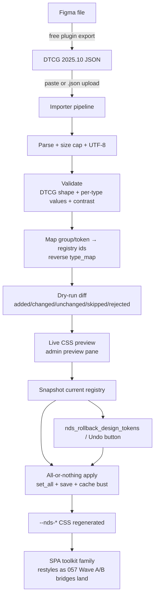

# NV oOS Design System — DTCG Token Import ("Import My Figma Design") Proposal

**Status:** Proposed
**Proposal ID:** 058
**Date:** 2026-10-06
**Depends on:** [057-spa-toolkit-figma-design-file-proposal.md](057-spa-toolkit-figma-design-file-proposal.md) (Phase 0 audit + Wave A bridge work)
**Related:** [047-nvoos-design-system-addon-proposal.md](047-nvoos-design-system-addon-proposal.md), [047-nvoos-design-system-research.md](047-nvoos-design-system-research.md)

---

## Executive Summary

The NV oOS Design System addon can **export** design tokens as W3C DTCG 2025.10 JSON (`class-nvoos-nds-dtcg-exporter.php`), and can **import email templates** from JSON — but it cannot **import tokens**. That asymmetry is the only thing standing between an end user and "import my Figma design": today a site owner can bring a Figma-generated palette into WordPress only by hand-typing ~70 token values into the admin Tokens page.

This proposal adds the mirror image: a **transactional DTCG token importer** — validation → dry-run diff → live preview → all-or-nothing apply → one-click undo — exposed on the admin Tokens page and as MCP tools (`nds_import_design_tokens`, `nds_rollback_design_tokens`), mirroring the addon's existing export/preset flows. Because proposal 057's Wave A bridges make the Tier 1 SPAs (Pro SPA v2, Docs Hub, Content Graph) consume the registry — and Wave B extends that to the wider 23-surface family — one import restyles web, email, and every bridged SPA surface from a single JSON file.

**Deliberate scope boundary (researched):** the plugin imports **DTCG JSON, not Figma files**. A `.fig` file is proprietary and unparseable; Figma's REST API returns raw variables, not DTCG JSON (research §3.1). The industry-standard user path is a free Figma plugin (Tokens Studio, TokensBrücke, Design Token Exporter) exporting DTCG JSON, which is exactly the format this importer consumes. A direct Figma-API pull is explicitly deferred as opt-in future work — it would mean storing a Figma personal access token in WordPress, a secret the plugin should not hold by default.

**Decision required:** approve the transactional import pipeline, the admin + MCP surfaces, and the ~3-week phased plan (Phase 0–3).

---

## Problem Statement

### 1. The export/import asymmetry

The addon ships a DTCG exporter, an email-template importer (`nds_import_email_template`), presets, and a manual token editor — but no token-level import. The bridge from Figma to WordPress exists in one direction only (out). For users without the base plugin or coding skills, adopting a designer's palette is manual data entry.

### 2. Figma-native import is not the right shape

Direct `.fig` parsing is impossible (proprietary format, no public parser). Figma's Variables REST API returns raw variable structures, **not** DTCG JSON — teams routinely write mapping scripts (research §3.1). A plugin that speaks to the Figma API directly would additionally need to store a personal access token in WordPress — a new secret-management liability the plugin has deliberately avoided outside its existing API-key store pattern.

### 3. Import without safety is worse than no import

Token values are injected into generated CSS on every page. A naive importer that writes arbitrary strings into the registry is a CSS-injection vector. The import must validate values per type (hex colors, dimensions, allowlisted font names), cap size, and reject unknowns — the same discipline the tool system's two-gate rule enforces.

### 4. Users cannot see or undo what they are applying

The existing preset flow replaces the token set wholesale with a notice and no preview. For an arbitrary external JSON file, the industry floor (research §3.4) is: validate, preview the diff, apply all-or-nothing, and offer rollback. None of that exists today.

---

## Industry Research: Best Practices & Standards

Sources are listed in full at the end of this document.

### 3.1 How design tokens leave Figma today

- **Figma's REST API does not expose DTCG export.** `GET /v1/files/:file_key/variables/local` (auth: `X-FIGMA-TOKEN`) returns raw variable data; teams write small mapping scripts to produce DTCG JSON (r/FigmaDesign, zeroheight export-paths guide, `@tfk-samf/figma-to-dtcg` npm package exists precisely because the mapping is non-trivial).
- **The standard end-user path is a free Figma plugin** that exports DTCG 2025.10 JSON directly:
  - **Tokens Studio** — the de-facto token manager (sync-to-repo features are paid; manual JSON export is free).
  - **TokensBrücke** — free plugin + CLI, converts Figma variables/styles to DTCG JSON **and imports tokens back into Figma** (useful for our round-trip story).
  - **Design Token Exporter** — free plugin, W3C DTCG-compliant JSON.
  - **Design Tokens Manager** — exports variables to JSON per mode, per the Design Tokens Format Module.
- zeroheight's "Exporting design tokens from Figma" guide names the same four paths: native API, Tokens Studio, third-party sync tools, Style Dictionary.

**Conclusion for this proposal:** the plugin's import surface should accept **DTCG JSON** (paste or `.json` upload) — the artifact every free export path produces. Figma stays upstream of the file.

### 3.2 Why not build a Figma API client into WordPress

- **Secret custody**: a Figma personal access token grants access to the user's entire Figma account; storing it in WP options duplicates the API-key-store machinery for a marginal convenience.
- **Mapping burden**: the API returns raw variables; the plugin would have to re-implement the DTCG mapping that free plugins already do better inside Figma (where modes, collections, and variable scopes are visible).
- **Plugin review risk**: wp.org review and the repo's own security checklist penalize new credential surfaces without a strong need.
- **Sequencing**: proposal 057 already positions Figma as a *design-time* tool synced via Tokens Studio. The user-facing import path should consume its output format, not its API.

If demand appears, a "pull from Figma" mode can later reuse the existing API-key-store pattern as opt-in; it is out of scope here.

### 3.3 DTCG 2025.10 validation standards

- The stable spec (2025.10, published 2025-10-28) is normative: `$type`, `$value`, `$description`, `$extensions`, and reference syntax (`{group.token}`) with name rules per the Format module.
- A validation ecosystem exists and is the reference for this importer's checks:
  - **dtcg-validator** (dembrandt) — validates against Format, Color, and Resolver modules.
  - **`@styleframe/dtcg`** — spec-conformant parser, validator, and serializer.
  - **Style Dictionary 4** — first-class DTCG support with better error handling and composite expansion (2025.10 full support still landing in v5 — a reminder that the ecosystem is young; importers must be tolerant).
  - Zero-dependency CLI validators against the final 2025.10 report are available.
- **Practical guidance from ecosystem maturity**: accept a *reasonable superset* — tolerate unknown `$extensions`, skip-but-report unknown groups rather than failing the whole file, and never let a parse error write anything.

### 3.4 Import UX standards: transactional import

The consistent 2025/2026 pattern for bulk imports (multiple independent sources, e.g. TinyPhi AssetFlow, EASA Digital Logbook specs): **every import is a transaction with a preview step and a full undo; it must never partially apply.** Specifically:

- **Dry-run validation** with per-item results (valid / changed / duplicate / rejected + reason).
- **Preview** of what will change before commit.
- **All-or-nothing apply** — one invalid row after preview means nothing is written.
- **Rollback guidance** — a stored snapshot and a one-click undo.
- **Double-apply refusal** — the same snapshot cannot be applied twice.

This maps cleanly onto the repo's own established patterns: the email-template importer's "import as **draft**, audit and activate separately" principle, and the admin page's existing preview pane + preset apply flow.

### 3.5 Security standards (repo conventions)

- Admin surface: `manage_options` gate + nonce (mirrors `maybe_handle_post` in the existing admin page).
- MCP tool: `manage_options` + `pro`/`admin-surface` capability flags + canonical return envelope + two-gate sanitisation (mirrors `nds_import_email_template`).
- JSON handling: `json_decode( ..., true )` to associative arrays only (no object injection), hard size caps, UTF-8 validation before processing.
- **Per-type value validation is the CSS-injection control**: colors as `#rgb`/`#rrggbb`/`#rrggbbaa` (or DTCG color object), dimensions as numeric+unit, font families against an allowlist — unknown shapes are rejected with a report entry, never coerced into CSS.
- Uploads: size-capped `.json` only, content sniffed via parse (extension is not authority); no server-side storage beyond the snapshot option.

---

## Proposed Solution

### 1. Scope

**In:** DTCG 2025.10 JSON (paste or upload) → validated, mapped, previewed, and transactionally applied to the NDS registry → CSS regenerated → SPA toolkit family surfaces restyle as their 057 bridges land (Wave A first, then Wave B).

**Out:** `.fig` parsing, direct Figma API pulls (future opt-in), component/layout import, generating React/CSS code from Figma (Dev-Mode handoff remains a human/designer activity), email-template JSON (already exists).

### 2. Import pipeline (single code path, both surfaces)

```
parse → validate → map → dry-run diff → preview → snapshot → apply → undo-able
```

| Stage | What happens | Failure behavior |
|---|---|---|
| **Parse** | `json_decode(…, true)`; size cap (e.g. 512 KB); UTF-8 scrub | Hard fail, nothing written |
| **Validate** | DTCG shape checks (token objects, `$value` present, `$type` in known set); per-type value validation; color contrast pre-check against WCAG pairs | Per-token rejection with reason; file continues |
| **Map** | DTCG hierarchical `group/token` → registry flat ids using the exporter's `type_map` in reverse; unknown groups → report (policy: skip by default, importable into a `custom` group with an explicit flag) | Per-token skip with reason |
| **Dry-run diff** | Compare against current registry: added / changed / unchanged / skipped / rejected | — |
| **Preview** | Live CSS preview via the existing preview pane; before/after per token | User cancels or proceeds |
| **Snapshot** | Copy current registry values into a snapshot option (e.g. `nvoos_nds_token_snapshot`, single slot, timestamped) | — |
| **Apply** | All-or-nothing `registry->set_all( $mapped )` + `save()` + CSS cache bust (mirrors `handle_save_tokens`) | On any unexpected error: restore snapshot, report, write nothing |
| **Undo** | Restore snapshot option → registry → CSS | Available until the next import/save replaces the snapshot |

Reference resolution: DTCG `{group.token}` references are resolved against the *imported + existing* registry before apply; unresolved references reject the referencing token (reported).

### 3. Surfaces

**Admin — Settings → Design System → Tokens → Import section** (new postbox, mirrors `render_export_section`):

- Paste textarea + `.json` file picker (both feed the same pipeline).
- "Validate & Preview" button → diff table (token, current value, imported value, status chip) + live CSS preview.
- "Apply Import" (enabled only after a clean dry-run) + "Undo Import" (visible while a snapshot exists).
- Notices via `add_settings_error` (reuses `render_notices`).

**MCP tools** (mirror `nds_import_email_template` contract):

| Tool | Purpose |
|---|---|
| `nds_import_design_tokens` | Args: `json` (DTCG payload, maxLength ~200 KB), `dry_run` (bool, default `true` — matches "draft-first" philosophy), `allow_custom_groups` (bool). Returns: diff report (`added`/`changed`/`unchanged`/`skipped`/`rejected` with reasons) on dry-run; on apply returns applied counts + `rollback_id`. |
| `nds_rollback_design_tokens` | Args: `rollback_id` (or "latest"). Restores the snapshot; refuses double-apply. |

Both: `manage_options`, flags `pro`/`admin-surface`, canonical envelope (`WP_Error` on failure), two-gate sanitisation. Tool descriptions state plainly that the input must be **DTCG JSON exported from a Figma token plugin**, with a pointer to the docs walkthrough.

### 4. Docs & user guidance

- `docs/user-guides/` (or addon docs): "Bring your Figma design into NV oOS" — a 3-step walkthrough per export path (Tokens Studio free export; TokensBrücke; Design Token Exporter), what imports (tokens) vs. what doesn't (layouts/components), and the undo story.
- Update the addon README's feature table + the 057 proposal's Future Work section to "implemented" once shipped.

---

## Architecture



---

## Implementation Phases

### Phase 0 — Registry & exporter symmetry (Week 1)
1. Add mode awareness + snapshot utility (`save_snapshot()` / `restore_snapshot()`) to `Token_Registry`.
2. Make the DTCG exporter's `type_map` public/reusable so the importer inverts it (single mapping definition — exporter and importer cannot drift).
3. Add per-type value validators (color/dimension/font/shadow/duration/string) with unit tests.

### Phase 1 — Importer core (Weeks 1–2)
4. `NV_oOS_Design_System_DTCG_Importer` class: parse → validate → map → diff → apply/rollback, all-or-nothing semantics.
5. Reference resolution (`{group.token}`) + unknown-group policy (skip + report; `allow_custom_groups` flag).
6. Contrast pre-check report (WCAG AA pairs) surfaced in the diff, warnings not blocks.
7. PHPUnit: valid file, invalid JSON, oversized, per-type rejections, unresolved refs, partial-failure rollback, double-apply refusal.

### Phase 2 — Surfaces (Week 2–3)
8. Admin Import postbox (paste + upload + diff table + preview + apply/undo), wired into `maybe_handle_post` with nonce + `manage_options`.
9. MCP tools `nds_import_design_tokens` / `nds_rollback_design_tokens` (canonical envelope, two-gate rule, flags).
10. Tests for both surfaces (capability denial, nonce failure, dry-run default, undo).

### Phase 3 — Docs & release (Week 3)
11. "Bring your Figma design into NV oOS" walkthrough (Tokens Studio / TokensBrücke / Design Token Exporter).
12. Addon README + changelog; verify against the 057 bridge PRs so the end-to-end story (import → SPA restyle) is demonstrated on a test site.

---

## Key Design Decisions

| # | Decision | Rationale |
|---|---|---|
| D1 | Import DTCG JSON, not Figma files or the Figma API | `.fig` unparseable; API returns raw variables (research §3.1); no new secret custody (§3.2) |
| D2 | Transactional: dry-run → preview → snapshot → all-or-nothing apply → undo | Industry floor for bulk imports (§3.4); mirrors repo's draft-first ethos |
| D3 | One `type_map` shared by exporter and importer | Symmetry prevents drift between out and in |
| D4 | Per-type value validation as the CSS-injection control; unknowns rejected, never coerced | Tokens land in generated CSS on every page (§Problem 3, §3.5) |
| D5 | Dry-run is the MCP tool default (`dry_run: true`) | Matches "import as draft, audit separately" philosophy; a bot cannot restyle a site by accident |
| D6 | Unknown groups: skip + report by default, opt-in `custom` group | Ecosystem is young (SD v5 still landing 2025.10); tolerant import, strict apply (§3.3) |
| D7 | Snapshot = single slot, timestamped, double-apply refused | Simple, auditable, matches transactional spec (§3.4) |
| D8 | Figma-API pull deferred to opt-in future work | Would reuse the API-key store, not the default path (§3.2) |

---

## Risks & Mitigations

| Risk | Likelihood | Mitigation |
|---|---|---|
| Malformed/hostile JSON reaches registry | Medium | Parse/size/UTF-8 gates; per-type validators; all-or-nothing apply; `manage_options` + nonce everywhere |
| Imported palette breaks contrast/a11y | Medium | Contrast pre-check warnings in the diff; Content Graph's render-time `ensure_contrast()` still corrects graphs; a11y tokens untouched unless explicitly in file |
| Ecosystem tolerance mismatch (files from different plugins differ subtly) | Medium | Tolerant parse + per-token reporting (D6); docs name the tested export paths |
| User applies, regrets, has no snapshot | Low | Snapshot taken on every apply; undo surfaced in admin + tool; snapshots survive until next apply |
| Mode data lost (light/dark in one file) | Medium | Phase 0 mode awareness; per-mode import options or merge policy documented in Phase 1 |
| SPA restyle invisible pre-057 bridges | Certain until bridges land | Proposal explicitly depends on 057 Phase 0 + Wave A; Phase 3 demo runs against bridged builds |

---

## Success Metrics

- **1** shared pipeline: admin UI and MCP tool invoke the same importer (no divergent behavior).
- **100%** of imported values are type-validated before any write; zero unvalidated strings reach CSS.
- **0** partial applies: any mid-apply failure restores the snapshot (covered by tests).
- **≥90%** of a reference DTCG file (exported from each of the 3 named Figma plugins) imports with ≤10% skipped tokens.
- **2** MCP tools shipped with dry-run default and rollback; docs walkthrough published.
- Import → restyle demonstrated end-to-end on a test site with the 057 bridge PRs applied.

---

## Open Questions

1. **Snapshot policy** — one slot (latest) vs. a small ring buffer (last 5)? One slot is simpler; a ring adds undo history UI.
2. **Mode import granularity** — import light+dark from one file as a pair, or require per-mode files (Design Tokens Manager exports per-mode JSONs)?
3. **Token rename vs. map** — if a file uses `surface/bg` and the registry uses `bg-primary`, do we ship an alias table for common naming schemes, or require exact group/token names?
4. **Rollback scope** — undo restores tokens only, or also settings toggles changed in the same session?
5. **Should `nds_import_design_tokens` accept a Paper Store record reference** (like the email importer does), so tokens can move site-to-site via the existing proxy?
6. **Upload size cap value** — 512 KB proposed; large enough for multi-mode files, small enough to be safe?

---

## Decision Required

1. Approve the transactional DTCG import pipeline and the DTCG-JSON-only scope (D1, no Figma API client).
2. Approve the surfaces: admin Import postbox + `nds_import_design_tokens` / `nds_rollback_design_tokens` with dry-run default.
3. Approve the Phase 0–3 plan (~3 weeks) and its dependency on proposal 057's Phase 0 + Wave A bridge work.
4. Answer open questions 1–3 before Phase 1 starts.

---

## Sources

**Figma token export paths**
- zeroheight — Exporting design tokens from Figma: formats, tools and workflows: https://zeroheight.com/learn/exporting-design-tokens-from-figma-formats-tools-and-workflows/
- r/FigmaDesign — Exporting variables as DTCG JSON (API returns raw variables, teams map manually): https://www.reddit.com/r/FigmaDesign/comments/1rrc2du/exporting_variables_as_dtcg_json/
- TokensBrücke (free Figma plugin + CLI, DTCG 2025.10 export/import): https://github.com/tokens-bruecke/figma-plugin
- Design Token Exporter (free Figma plugin, DTCG JSON): https://www.figma.com/community/plugin/1590704268871516927/design-token-exporter
- Design Tokens Manager (free plugin; per-mode JSON export per the Format Module): https://www.figma.com/community/plugin/1263743870981744253/design-tokens-manager
- @tfk-samf/figma-to-dtcg (API-response → DTCG mapping): https://www.npmjs.com/package/@tfk-samf/figma-to-dtcg

**DTCG validation ecosystem**
- Design Tokens Format Module 2025.10 (normative spec): https://www.designtokens.org/tr/drafts/format/
- dembrandt/dtcg-validator (Format/Color/Resolver validation): https://github.com/dembrandt/dtcg-validator
- @styleframe/dtcg (parser/validator/serializer): https://www.styleframe.dev/docs/getting-started/integrations/dtcg
- Style Dictionary — DTCG support status (v4 first-class, 2025.10 completing in v5): https://styledictionary.com/info/dtcg/
- design-tokens/community-group discussion #312 (zero-dependency 2025.10 CLI validator): https://github.com/design-tokens/community-group/discussions/312

**Import UX standards**
- TinyPhi/AssetFlow — transactional bulk import spec (preview, all-or-nothing, rollback, double-apply refusal): https://github.com/TinyPhi/AssetFlow/issues/120
- Decades-Design/EASA-Digital-Logbook — "every import is a transaction with a preview step and a full undo": https://github.com/Decades-Design/EASA-Digital-Logbook/issues/73
- Trellis Frontend — import pipeline with dry-run validation and rollback guidance: https://github.com/TRELLIS-STELLAR/Trellis-frontend/issues/37

**In-repo patterns** (authoritative over any external source)
- `addons/nvoos-design-system/includes/class-nvoos-nds-dtcg-exporter.php` — export side + `type_map`
- `addons/nvoos-design-system/includes/tools/class-nvoos-nds-tool-import-email-template.php` — tool contract to mirror
- `addons/nvoos-design-system/includes/admin/class-nvoos-nds-admin-page.php` — nonce/capability pattern, export section, preview pane, preset apply
- `plugins/nvoos-content-graph/src/Visual/Tokens.php` — contrast engine reused for pre-checks

---

**Note:** When in doubt, the DTCG 2025.10 spec and the addon source under `addons/nvoos-design-system/` are authoritative over this document.
