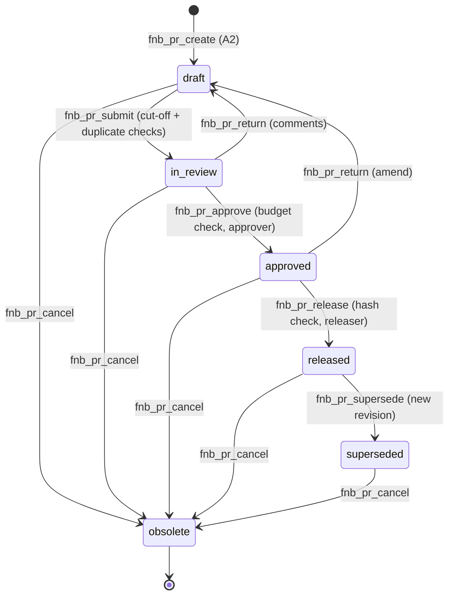

# Appendix A — Purchase-Request Approval Lifecycle (QMS-style)

**Date:** 2026-10-08
**Status:** 🔮 PENDING — design appendix to `062-food-beverage-management-pro-toolkit-proposal.md`
**Phase:** Post-demo (ACT tier). The demo itself stops at R-04 with `Status: Draft`.

> This appendix defines the **submit → approve → release** lifecycle for
> purchase requests, reusing the existing QMS engine shipped by the
> document-generation toolkit (`addons/pro/includes/qms/`). It is written as a
> spec for Phase 9+ work, not a Phase 1–8 deliverable.

---

## A1. Purpose & Relationship to the Demo

The spec's permission sheet keeps "Place supplier order" **off, needs approval**,
and A2-07 says purchase requests are always `Status: Draft`. The demo therefore
only exercises the *draft* state. This appendix defines what happens after the
demo, when a client enables the ACT tier: drafts graduate through an audited,
segregated-duties approval workflow before anything can reach a supplier —
directly implementing the spec's "needs approval" intent and giving the CEO the
audit trail promised in open question 8.

| Spec anchor | Appendix mapping |
|---|---|
| R-04 Purchase request (A2) | `fnb_pr_create` produces the R-04 layout as a `draft` doc record |
| A2-05 (lead time / cut-off check) | submit-time precondition |
| A2-06 (over-ordering flag) | submit-time warning (non-blocking) |
| A3-04 (duplicate-invoice scan) | approve-time duplicate-open-PR check |
| M-20 (budget variance) | approve-time budget-line check |
| Tools & permissions → "Place supplier order: Off, needs approval" | `fnb_pr_release` is ACT-tier, capability-gated, default off |
| Open question 8 (audit log to CEO) | every transition audited; `fnb_pr_audit` viewer |

## A2. Reuse of the QMS Engine (no new state machine)

The document-generation toolkit already ships a generic controlled-document
engine. Purchase requests are modelled as QMS controlled documents of kind
`purchase-request` — no parallel workflow code:

| Component | Existing | F&B usage |
|---|---|---|
| Record CPT | `mcp_ai_doc_record` (`WP_MCP_AI_QMS_Doc_Record_CPT`) | one record per purchase request |
| Statuses | `draft`, `in_review`, `approved`, `released`, `superseded`, `obsolete` | reused verbatim |
| Transition engine | `WP_MCP_AI_QMS_Workflow::transition()` (validation + audit + hooks + content-hash recompute at approved/released) | reused; F&B preconditions layered via the preconditions hook |
| Document kind | taxonomy `mcp_ai_qms_doc_type` | term `purchase-request` |
| Capability | `manage_qms` (default: administrator, editor; filterable via `wp_mcp_ai_qms_capability_roles`) | reused; F&B adds approver/releaser lists as meta |
| Audit | `WP_MCP_AI_QMS_Audit_Log` | every transition logged; surfaced by `fnb_pr_audit` |
| Signing | `qms_sign_document` | optional co-sign by finance for large POs |

## A3. State Machine

The transition matrix is the QMS matrix unchanged — F&B only adds per-transition
preconditions (§A5) and role lists, matching the QMS engine's existing
approver-list precondition design.

## A4. Record Fields (doc-record meta)

| Meta key | Source | Notes |
|---|---|---|
| `fnb_pr_supplier_id` | table 4 | required at draft |
| `fnb_pr_lines` | tables 3/5/9 | JSON line items: ingredient, pack, qty, unit price, line total |
| `fnb_pr_total` | sum of lines | recomputed by tool, never trusted from the model |
| `fnb_pr_order_by` / `fnb_pr_needed_by` | supplier cut-off + M-12/13 | A2-05 gate |
| `fnb_pr_budget_line` | table 15 | approve-time M-20 check |
| `fnb_pr_approver` / `fnb_pr_releaser` | user IDs | filled on transition; creator cannot approve own PR |
| `fnb_pr_po_number` | format `PR-YYYYMM-###` | assigned at release |

Line-item immutability: the QMS content hash is recomputed at `approved` /
`released`, so any edit after approval breaks the release precondition and
forces a return to draft — approval covers exactly what gets released.

## A5. Preconditions per Transition

| Transition | Blocking checks | Non-blocking flags |
|---|---|---|
| draft → in_review | every line has supplier + pack + unit price; `order_by` respects the supplier's cut-off and delivery days (A2-05); no open PR for the same supplier+ingredient inside the lead-time window; total > 0 | days-of-cover vs shelf-life (A2-06); stock already at/above minimum level |
| in_review → approved | approver has `manage_qms`; approver ≠ creator; budget line exists for the category | total pushes the budget line over M-20 budget (warn, allow) |
| approved → released | releaser has `manage_qms`; content hash matches the approved hash; `fnb_pr_total` ≤ configured auto-approval threshold or finance co-sign present | — |
| any → obsolete | canceller has `manage_qms`; reason text required (audited) | — |

## A6. Tools

| Tool | Transition | Capability | Demo tier |
|---|---|---|---|
| `fnb_pr_create` | '' → draft | `manage_qms` (A2 drafts) | DRAFT (demo: R-04 output) |
| `fnb_pr_submit` | draft → in_review | `manage_qms` | ACT — off |
| `fnb_pr_return` | in_review/approved → draft (+comments) | `manage_qms` | ACT — off |
| `fnb_pr_approve` | in_review → approved | `manage_qms` + approver list | ACT — off |
| `fnb_pr_release` | approved → released (+assign PO number) | `manage_qms` + releaser list | ACT — off |
| `fnb_pr_supersede` | released → superseded (+new draft revision) | `manage_qms` | ACT — off |
| `fnb_pr_cancel` | * → obsolete | `manage_qms` | ACT — off |
| `fnb_pr_list` | — | read | READ |
| `fnb_pr_audit` | — | read | READ |

All tools follow the canonical envelope + two-gate sanitisation rules; every
transition goes through `WP_MCP_AI_QMS_Workflow::transition()` so the audit
trail and hooks fire uniformly.

## A7. Scheduling & Reminders

- Cut-off reminders: Pro Schedule Manager entries per supplier's order cut-off
  (e.g. "Thursday 17:00 — Southern Wine and Spirits cut-off") that check for
  open `in_review`/`approved` PRs and remind the approver via the draft-note
  channel.
- Weekly open-PR summary: Monday run listing every PR not `released`/`obsolete`
  with age and total, appended to R-06/R-11 context.
- Released POs: when a client later enables supplier delivery (out of scope),
  the released record is the canonical source for the send step — nothing sends
  in the demo or Phase 9.

## A8. Test Plan (Phase 9+)

Under `tests/pro/tools/food-beverage/`:

1. **Transition matrix** — full QMS matrix exercised for `purchase-request`
   records (mirrors existing QMS workflow tests).
2. **Preconditions** — cut-off violation blocked at submit; missing budget line
   blocked at approve; hash mismatch blocked at release; over-ordering flags
   non-blocking.
3. **Segregation of duties** — creator cannot approve own PR; approver cannot
   release without releaser capability.
4. **Freeze semantics** — line edits after approval invalidate the hash and
   force draft.
5. **Audit completeness** — every transition produces an audit event with
   before/after status, actor and totals.

## A9. Non-Goals

- No supplier API/email send (release only assigns a PO number + generates the
  R-04 sheet in Drafts).
- No multi-level PO hierarchy, no goods-receipt/invoice matching in Phase 9.
- No custom roles beyond the `manage_qms` capability mapping + approver/releaser
  meta lists.

## A10. Open Questions for Vijay

1. Auto-approval threshold: POs below which LKR value skip the finance co-sign?
2. Should release auto-create an accrual entry in the expense ledger (table 14),
   or wait for goods receipt?
3. PO numbering scheme (`PR-YYYYMM-###`) and whether superseded POs keep their
   original number with a revision suffix.
4. Who is the releaser for the club: CEO only, or head chef for sub-threshold
   kitchen orders?
