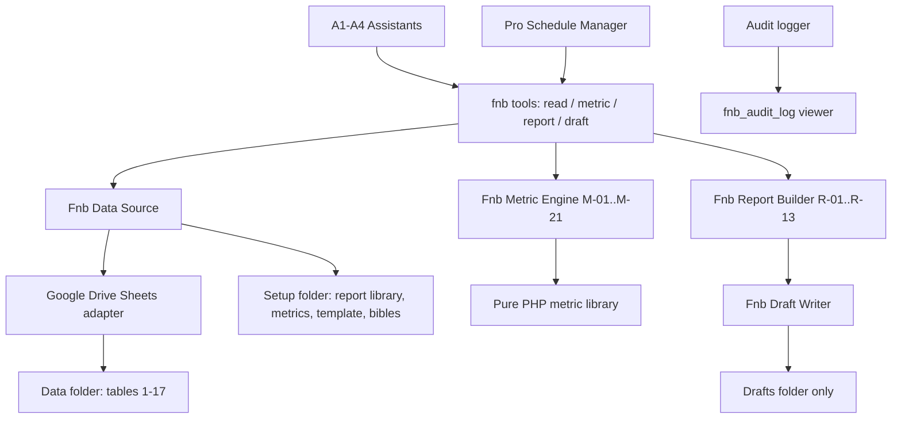

# Proposal: Food & Beverage Management Pro Toolkit

**Date:** 2026-10-08
**Status:** 🔮 PENDING
**Estimated Effort:** 30–40 hours (Phases 0–8, incl. demo dry-run)
**Priority:** HIGH (CEO demo date: Thursday 8 October 2026)

> Scope: ship a complete **Food & Beverage Management Pro Toolkit** in the NV oOS
> plugin (`addons/pro/includes/tools/food-beverage/`) that turns the
> `Surf_Club_Midigama_-_Assistant_Task_Spec.xlsx` demo — four assistants (A1
> Manager, A2 Kitchen & Bar Stock, A3 Financial, A4 Content) over 17 Google
> Drive data tables, 21 metrics, 13 reports — into a repeatable, industry-standard
> F&B management product, not a one-off demo. All demo rules (G-01…G-12, A*-01…),
> metric definitions (M-01…M-21), report layouts (R-01…R-13) and the
> default-deny permission model are codified in the toolkit so the same
> configuration can be re-sold to any restaurant/bar/beach-club operator.

> Related in-repo work: `051-openstock-financial-toolkit-integration.md`
> (financial tooling precedent), `google-workspace` toolkit (Drive client),
> `orchestration` toolkit (Pro Schedule Manager), `design-document-generation`
> skill (doc output), `mcp-ai-wpoos-toolkit-audit` skill (per-toolkit hardening
> loop — four recurring failure classes to avoid).

---

## 1. Executive Summary

Surf Club Midigama (restaurant, bar and beach club; LKR; chalets excluded) needs a
CEO-facing demo of AI assistants that **read, analyse and draft — never send,
order or change records**. The spec describes 4 assistants, 12 global rules, 21
per-assistant rules, 13 reports, 30 example questions, 21 metrics, 17 data tables
and a 3-tier permission model.

The plan: build a dedicated **F&B Pro Toolkit** containing

1. a **Google Drive data-access layer** (read the 17 data tables + 4 setup
   artifacts as structured tables),
2. a **deterministic metric engine** implementing M-01…M-21 exactly as defined
   (all calculations in PHP — no model maths, per G-02),
3. **report generators** R-01…R-13 that emit the Report-library layouts,
4. a **draft writer** that saves Google Docs/Sheets into the Drafts folder only,
5. **four pre-configured assistant packs** (A1–A4) with instruction sets and
   tool allowlists, and
6. **scheduling + audit visibility** for the recurring reports.

The design anchors every metric and rule to researched industry standards
(food cost 28–35%, beverage cost 18–24%, labour 25–35%, prime cost 55–65%,
inventory variance <3%, PAR levels, menu engineering), so the toolkit doubles as
an industry-benchmark product beyond the demo.

**Outcome:** the Surf Club demo runs end-to-end from the spec with zero invented
figures; every answer cites source tables; and the toolkit ships as a reusable
Pro toolkit with tests, docs and an audit trail.

---

## 2. Problem Statement

1. **The demo depends on capabilities that do not exist yet.** NV oOS assistants
   cannot read a Google Drive folder of Sheets as queryable tables, cannot run
   the 21 spec metrics deterministically, and cannot create a Google Doc/Sheet in
   a fixed folder (open questions 1–3 in the spec).
2. **The permission model is the whole pitch.** "Read, analyse and draft. No
   sending, ordering or changing records" is the CEO's trust story. A generic
   assistant with 1,650 tools cannot be demoed safely; the toolkit must ship a
   per-assistant allowlist with write tools default-off (open question 4).
3. **Figures must match across assistants.** A1, A2 and A3 must produce identical
   numbers (A1-04). That is only achievable if metrics are code, not model
   arithmetic. The `math` toolkit alone cannot guarantee this.
4. **Reports must be repeatable, not one-shot prompts.** R-01…R-13 have defined
   layouts, triggers and approvers; scheduled Monday/Thursday/daily runs (open
   question 6) require the Pro Schedule Manager, and HOD-editable report layouts
   require runtime reading of the Report library (open question 5).
5. **No F&B domain toolkit exists.** The ~60 existing Pro toolkits cover finance,
   CRM, healthcare, ecommerce — none cover recipe costing, stock variance, waste
   analytics, PAR/days-of-cover, or menu engineering. Each new client in this
   vertical would otherwise be hand-built.

---

## 3. Research: Industry Standards & Best Practices

Web research (2026-10-08) grounding the toolkit's metrics and thresholds.

### 3.1 Cost benchmarks (percent of revenue)

| Area | Industry standard | Source |
|---|---|---|
| Food cost % | **28–35%** typical; pizza 22–28%, fast food 25–30%, casual dining 28–35%, fine dining 30–38% | VantaInsights; Cucinovo |
| Beverage cost % | **18–24%** of beverage sales (widely referenced norm for bar-led concepts) | bar-cost norms; Surf Club runs food + bar + beach-club mix |
| Labour cost % | **25–35%** for full-service | RestaurantInventoryTools 2026 |
| Prime cost (F&B + labour) | **55–65%** of revenue; full-service 58–65%, QSR 55–60% | WhippleWood; RestaurantInventoryTools; Stockcount |

Surf Club mapping: M-04 food cost %, M-05 beverage cost %, M-10 labour cost %
already exist in the spec — the toolkit should *flag* results outside these
bands (manager brief ranking, R-08 commentary) without hard-coding them as
targets, since the spec's budget tables are the source of truth for variance.

### 3.2 Inventory control

- **COGS on usage, not purchases:** Beginning Inventory + Purchases − Ending
  Inventory (RestaurantLaunchpad). The spec encodes this as M-15 (stock used) and
  G-06/G-07/A3-03 — matching the industry rule to value F&B cost on consumption.
- **Inventory variance:** keep under **~3% per category**; variance =
  theoretical usage (recipes × sales) vs actual usage (MarketMan; Supy). Spec:
  M-16 expected use, M-17 unexplained variance, A2-03, R-05.
- **Days on hand:** perishables **2–4 days**, dry goods **1–2 weeks**
  (GoFoodService). Spec A2-06: flag over-ordering where days of cover exceed
  shelf life, or 14 days for long-life items — same principle, per-item instead
  of category.
- **PAR levels:** PAR = (Average Daily Usage × Lead Time) + Safety Stock
  (Square). Spec M-12/M-13 (expected covers → expected portions) + A2-05
  (lead time / order cut-off) are the demand side of PAR; the toolkit's weekend
  planner computes the full PAR shortfall per ingredient.
- **FIFO** (oldest first) and consistent weekly stocktakes at the same
  day/time (NetSuite) — the toolkit's stock-used maths assumes the spec's weekly
  count cadence (table 9).

### 3.3 Waste

- Spoilage is **21% of hospitality food waste** in the UK (Access Group);
  waste tracking by item + logged reason is the standard control (waste sheet
  per NetSuite). Spec: table 10, M-18 waste %, R-05, and the strict rule A2-08
  "report waste reasons as logged — do not assume reasons that are not logged".

### 3.4 Menu engineering (Kasavana & Smith matrix)

- Classify dishes by **popularity** (share of category sales) × **profitability**
  (contribution margin = price − ingredient cost): **Stars** (protect/promote),
  **Plowhorses** (re-price or re-engineer), **Puzzles** (reposition), **Dogs**
  (remove or rework) (Toast; meez; Loaded).
- Spec M-21 (dish margin) + R-01 top/bottom 5 + R-07 margin report are the raw
  inputs. The toolkit adds the quadrant classification as the standard
  "what to do with it" layer — this is the single industry framework the spec
  implies but does not name, and it makes R-07 materially more useful.

### 3.5 Reporting cadence

- Daily trading snapshot, weekly P&L/stocktake, monthly close + investor pack
  are the standard operator rhythm. Spec triggers match exactly: R-01 daily
  08:00, R-02/R-05/R-06/R-13 Monday, R-03 Thursday 09:00, R-07…R-10 monthly 3rd,
  R-12 monthly 5th.

---

## 4. Surf Club Spec Analysis (all worksheets)

### 4.1 Overview sheet → constraints

- Scope: restaurant, bar and beach club only; **chalets excluded** → data filter
  per table (`type`/`source` columns) applied by the data layer.
- Currency: **LKR, excluding the 10% service charge** → G-10; metric engine
  strips service charge before revenue maths (M-01).
- Data period 1 Jul–7 Oct 2026; headline comparison **Sep vs Aug**; weekend plan
  for **9–11 Oct 2026** → default periods in metric tools, overridable.
- Default access: read + analyse + draft only (see §5.6).

### 4.2 Assistants sheet → four assistant packs

| ID | Assistant | Reads | Writes | Example trigger |
|---|---|---|---|---|
| A1 | Manager | all tables, report library, metrics | Drafts only | "What needs my attention this week?" |
| A2 | Kitchen & bar stock | menu, recipes, ingredients, suppliers, prices, sales, covers, purchases, stock, waste, bookings | Drafts only | "What do we need for the weekend, and what are we buying too much of?" |
| A3 | Financial | all tables, metrics, investor template | Drafts only | "Revenue +10% but opex +18%. What caused the difference?" |
| A4 | Content | character bibles, asset log, menu, bookings, A2 findings | Drafts only | "Give me a Sanda post for the tamarind cocktail." |

### 4.3 Instructions sheet → codified rules

- **G-01…G-12** (global): no invented figures; tool-based calculation; cite
  figures/records; answer-first plain language; uncertainty labelled; stock
  bought ≠ used; month-incurred ≠ date-paid; use Metric definitions sheet only;
  follow Report library layouts; LKR ex-service; demo-assumption disclosure;
  drafts only.
- **Per-assistant rules** (A1-01…A4-05) → embedded in each assistant's system
  prompt pack; the metric engine enforces the calculable ones (A1-04 shared
  maths, A2-01…A2-06 stock logic, A3-01…A3-04 financial logic, A4-01…A4-05
  content rules).

### 4.4 Reports sheet → 13 report generators (R-01…R-13)

Layouts, sections, metrics and source tables taken verbatim from the sheet.
Output targets: Google Doc or Sheet in Drafts; approver column becomes the
`approver` field on the draft title.

### 4.5 Questions sheet → acceptance test matrix

All 20 questions (A1×5, A2×6, A3×8, A4×3… per sheet: A1×5, A2×6, A3×8, A4×3)
become the demo test script. Each question lists the tables + metrics required —
the toolkit must answer each with only those inputs (see implementation plan
test phase).

### 4.6 Metrics sheet → metric engine contract (M-01…M-21)

| ID | Metric | Industry anchor |
|---|---|---|
| M-01 | Revenue (units × menu price, ex service) | §3.1 |
| M-02 | Covers (lunch + dinner + bar-only) | covers KPI |
| M-03 | Average spend per cover | covers KPI |
| M-04 | Food cost % (food used × avg price ÷ food revenue) | 28–35% band |
| M-05 | Beverage cost % (beverage used × avg price ÷ beverage revenue) | 18–24% band |
| M-06 | Cost per cover (total opex ÷ covers) | §3.1 |
| M-07 | Volume effect (Δ cost from cover count) | variance split |
| M-08 | Per-cover effect (total change − volume) | variance split |
| M-09 | Overtime per 100 covers | labour KPI |
| M-10 | Labour cost % (payroll ÷ revenue) | 25–35% band |
| M-11 | Electricity per cover (kWh ÷ covers) | utility KPI |
| M-12 | Expected covers (4-week same-weekday avg + groups ≥15) | demand forecast |
| M-13 | Expected portions (covers × dish share) | PAR demand |
| M-14 | Days of cover (stock ÷ 14-day avg daily use) | §3.2 |
| M-15 | Stock used (opening + bought − closing) | COGS-on-usage |
| M-16 | Expected use (units sold × recipe qty) | theoretical usage |
| M-17 | Unexplained variance (used − expected − logged waste) | <3% target |
| M-18 | Waste % (logged waste ÷ stock used) | §3.3 |
| M-19 | Price change impact ((new − old) × qty at new) | supplier watch |
| M-20 | Budget variance (actual − budget) | P&L |
| M-21 | Dish margin (price − recipe cost at current prices) | menu engineering |

Plus one extension: **menu-engineering quadrant** (Stars/Plowhorses/Puzzles/Dogs)
computed from M-21 + popularity share (§3.4).

### 4.7 Tools & permissions sheet → 3-tier model

| Tier | Tools | Default |
|---|---|---|
| READ | read Drive data, calculation | On for A1–A4 |
| DRAFT | save draft (Docs/Sheets into Drafts folder only) | On for A1–A4 |
| ACT | send message, place supplier order, change records, send investor report, generate image, post to social | **Off, needs approval** (none in demo) |

MCP access: expose A1–A4 to Claude/ChatGPT with read + draft tools only
(optional demo feature).

### 4.8 Data tables sheet → data model

17 data tables (Menu items, Recipes, Ingredients, Suppliers, Supplier prices,
Daily sales, Daily covers, Purchases, Stock counts, Waste log, Payroll,
Timesheets, Utilities, Expense ledger, Budgets, Bookings, Asset log) + 4 setup
artifacts (Report library, Metric definitions, Investor pack template, Character
bibles). One-row semantics and key columns per the sheet; the data layer exposes
each table by ID (1…17) with typed columns so tools reference tables by ID, not
sheet name (the spec warns "table and column names may change").

### 4.9 Open questions sheet → resolutions

| # | Question | Resolution |
|---|---|---|
| 1 | Read Google Sheets in Drive: existing or new tool? | **New**: `fnb_read_table` / `fnb_search_table` on top of the existing `google-workspace` `Google_Drive_Client`; Sheets exported to tabular rows with caching. |
| 2 | Which calculation tool? | **New metric engine** (deterministic PHP) — `fnb_calculate_metric` + composite tools; `math` toolkit excluded from demo allowlists. |
| 3 | Create Google Doc/Sheet in a set Drive folder? | **New**: `fnb_save_draft` / `fnb_create_sheet` scoped to the configured Drafts folder ID (Drive API create-in-folder). |
| 4 | Per-tool on/off per assistant, write tools off by default? | **Yes**: assistant tool allowlists (existing per-assistant tool config) + capability checks in every tool; ACT-tier tools ship `required_capability` = `manage_options` and disabled in demo packs. |
| 5 | Report library / Metrics sheets at runtime or pasted into instructions? | **Runtime read** via `fnb_read_table` from the "Assistant setup" folder → HODs can edit report layouts without code changes; instructions only carry a pointer + the G-rules. |
| 6 | Scheduled Monday brief / Thursday weekend plan? | **Yes**: Pro Schedule Manager (`orchestration` toolkit `create-pro-schedule`) for R-01 (daily 08:00), R-02 (Mon 08:00), R-03 (Thu 09:00), R-05 (Mon), R-13 (Mon). |
| 7 | Expose the four assistants as MCP server to Claude/ChatGPT? | **Yes**: existing MCP bridge with per-assistant tool subset (read + draft only). |
| 8 | Audit log of tool calls visible to CEO? | **Yes**: existing audit logger already records; add read-only `fnb_audit_log` viewer tool for the CEO assistant. |
| 9 | Which model, what cost per question? | DeepSeek (low cost) for analysis; Jev for decisions; cost estimates in implementation plan §7. |
| 10 | A4 image API later, or prompts only? | **Prompts only** for the demo (A4-05); `image-production` toolkit wiring deferred, flagged as Phase 8 optional. |

### 4.10 Demo data workbook (`Surf_Club_Midigama_-_Demo_Data.xlsx`)

The dummy data is now available and materially strengthens the plan. 20 sheets,
with an as-of date of 2026-10-07 (close of business) and explicit demo-assumption
disclosures. Highlights that shape the design:

- **`Check totals` — a built-in test oracle.** Month totals for Jul/Aug/Sep with
  change, volume effect, per-cover effect, Sep budget and variance precomputed
  (covers 1919/2263/2441; total revenue 14,673,250 / 17,256,950 / 18,906,800;
  food cost % 25.45/25.42/26.88; beverage cost % 27.50/27.36/28.15; cost per
  cover 3,988/3,749/4,092; opex % 52.2/49.2/52.8). **The metric engine must
  reproduce these values exactly** — they replace hand-computed golden values
  in the test plan and give the demo a verifiable "our maths matches the
  workbook" claim.
- **`Assumptions` — the G-11 constants sheet.** Electricity 42 LKR/kWh + 3,000
  fixed, water 160 LKR/m³ + 1,500 fixed, LPG 11,200/cylinder, EPF 12%, ETF 3%,
  casual day rate 4,000, per-department overtime rates, service charge excluded.
  Read at runtime and cited in outputs ("demo assumption").
- **Narrative hooks already baked into the data:** Sep maintenance 438,000 vs
  61,000 in Aug (+6.2×) — the driver of the "revenue +10% but opex +18%" story
  (A3); waste value +44% Sep vs Aug; overtime hours per 100 covers 14.6 → 20.4;
  casual shifts 4 → 16 → 56; prawn price series 4,200 → 4,650 → 5,100 (M-19
  example); Sep kitchen headcount 9 vs budget 10.
- **Industry-band signals visible in the data:** food cost % (25.4–26.9) sits
  *below* the 28–35% band (healthy), beverage cost % (27.4–28.1) sits *above*
  the 18–24% bar norm — exactly the kind of benchmark flag the toolkit surfaces
  in R-02/R-08 without overriding the budget-based variance (M-20).
- **Time-series joins required:** Supplier prices keyed by `Effective from`
  (price-as-of-date logic for M-19/M-21); expense ledger carries `For month`,
  `Invoice date` and `Paid date` (G-07 split); bookings include a 28-guest group
  on Sat 2026-10-10 (M-12 group trigger) and day-bed sessions.
- **Precomputed columns vs recomputation:** several sheets ship derived columns
  (Menu: recipe cost/margin/cost %; Stock counts: used/expected/waste/
  unexplained; Utilities: kWh per cover; `Sales by period` pivot). Per G-02/G-08
  the toolkit **recomputes from raw tables** and treats the precomputed columns
  as cross-check data for tests — never as runtime sources.
- **Sheet-name → table-ID mapping** (spec Data tables vs workbook) is captured
  in the implementation plan; the data layer resolves by table ID with the
  workbook sheet names as the demo mapping (tolerant to renames).
- **Setup-folder artifacts** (Report library, Metric definitions, investor
  template, character bibles) are *not* in this workbook — they stay in the
  Drive "Assistant setup" folder per the spec; the Asset log evidences the two
  deities (Rella, Sanda) for A4's character bibles.

---

## 5. Toolkit Design

### 5.1 Placement & naming

- Folder: `addons/pro/includes/tools/food-beverage/`
- Slugs: `fnb_*` (avoids collisions; matches one-slug-per-toolkit convention)
- Classes: `class-wp-mcp-ai-tool-fnb-*.php` (dominant Pro convention, as in
  `financial-planning`); services: `class-wp-mcp-ai-fnb-data-source.php`,
  `class-wp-mcp-ai-fnb-metrics.php`, `class-wp-mcp-ai-fnb-report-builder.php`,
  `class-wp-mcp-ai-fnb-draft-writer.php`.
- Ship the toolkit folder with `init.php`, `README.md`, `TOOLS_LIST.txt`,
  `TOOL_INDEX.md` per toolkit conventions.

### 5.2 Architecture

All four assistants share one data source, one metric engine and one report
builder → A1-04 (identical figures) holds by construction.

### 5.3 Data-access layer

- `WP_MCP_AI_Fnb_Data_Source` with a `Fnb_Table_Reader` interface and three
  adapters implementing it:
  1. `Google_Sheets_Reader` — the demo adapter (Drive folder).
  2. `CPT_Reader` — native WordPress CPT storage (§5.8), WP_Query + meta.
  3. `CCT_Reader` — JetEngine CCT storage (§5.8), for reference tables.
  The metric engine and report builder are storage-agnostic; adapters translate
  spec table IDs to row arrays, so switching a table's backing store is a
  settings change, not a code change.
- Tables addressed by spec ID (1…17) + setup names; column-name drift tolerated
  by mapping key columns with fallbacks and warning on missing required columns.
- Caching: per-table transients (5 min) keyed by sheet revision; metrics for a
  fixed period are computed from cached snapshots so consecutive calls agree.
- Every returned row carries its source table + row reference for G-03 citations.

### 5.4 Metric engine

- `WP_MCP_AI_Fnb_Metrics` — one pure method per M-id, formulas transcribed
  verbatim from the Metrics sheet (G-08). Key implementation notes from the
  demo data: price joins are **as-of-date** (Supplier prices `Effective from`);
  expense month-incurred vs date-paid are separate axes (G-07); unit tests
  assert each metric against the precomputed `Check totals` sheet values
  (exact match within rounding tolerance, e.g. ±1 LKR on sums).
- Tool surface:
  - `fnb_calculate_metric` (metric_id, period, group_by optional) — generic.
  - Composite tools: `fnb_compare_periods` (M-01…M-11 MoM), `fnb_variance_split`
    (M-07/M-08), `fnb_stock_used` (M-15), `fnb_expected_use` (M-16),
    `fnb_stock_variance` (M-17), `fnb_waste_analysis` (M-18),
    `fnb_days_of_cover` (M-14), `fnb_weekend_demand` (M-12/M-13 + shortfall vs
    stock + order-by dates per supplier lead time/cut-off), `fnb_price_change_impact`
    (M-19), `fnb_budget_variance` (M-20), `fnb_dish_margin` (M-21 + quadrant),
    `fnb_duplicate_invoice_scan` (A3-04), `fnb_labour_analysis` (M-09/M-10),
    `fnb_utilities_per_cover` (M-11).

### 5.5 Report builder & draft writer

- `fnb_generate_report` (report_id R-01…R-13, period) → structured sections in the
  Report-library layout, all figures via the metric engine.
- `fnb_save_draft` (content → Google Doc, or tabular → Google Sheet) and
  `fnb_list_drafts`; Drafts-folder-only enforced in the writer (folder ID from
  toolkit settings; refusal + explanation otherwise). Draft title convention:
  `[R-xx] <title> — <period> — Draft — for <approver>`.

### 5.6 Permissions & safety (the demo's trust story)

- Every `fnb_*` tool declares `required_capability`; ACT-tier tools require
  `manage_options` and are absent from demo allowlists.
- Assistant packs ship as JSON configs (importable): system-prompt pack with the
  applicable G-rules + A-rules, tool allowlist (READ + DRAFT tier only), and the
  Drafts-folder setting.
- Canonical envelope + two-gate sanitisation per project rules; no unguarded
  shell calls; string/array-safe parsing of Sheets responses (the four failure
  classes from the toolkit-audit skill are the checklist).

### 5.7 Scheduling, MCP exposure, audit

- Pro Schedule Manager entries: R-01 daily 08:00, R-02 Mon 08:00, R-03 Thu 09:00,
  R-05 Mon, R-13 Mon — each runs the assistant's `fnb_generate_report` +
  `fnb_save_draft` chain and logs to the audit trail.
- MCP: the four assistants exposed via the existing bridge with their allowlists
  (read + draft only) for Claude/ChatGPT (open question 7).
- `fnb_audit_log`: read-only viewer (date range, tool, assistant) for the CEO.

### 5.8 Native storage layer (CPT/CCT) — post-demo product path

The demo reads Google Drive Sheets only, but the toolkit must work for clients
without Drive. Two in-repo precedents define the pattern:

- **Vitals toolkit** (`healthcare/vitals/class-wp-mcp-ai-healthcare-vital-log-cpt.php`):
  promotes measurements to a first-class CPT (`mcp_ai_hc_vital_log`) — `public`/
  `show_ui`/`show_in_rest` all false, `map_meta_cap`, registered on `init`
  priority 12 behind a sub-toolkit toggle, before/after hooks, coexisting with
  legacy JetEngine CCT storage, plus an `import_vitals` tool to ingest external data.
- **Document-generation toolkit**: central CPT class (`mcp_ai_doc_tpl`) loaded
  from toolkit `init.php`, JetEngine meta fields via
  `WP_MCP_AI_JetEngine_Meta_Helper::register_cpt_fields()`, and a QMS
  approval lifecycle (create → submit → approve → release → sign → obsolete,
  with audit trail) — the model for future purchase-request approval.

Applying that split to the 17 tables:

| Storage | Tables | Rationale (mirrors vitals) |
|---|---|---|
| **CPTs (event/measurement logs)** | Daily sales (6), Stock counts (9), Waste log (10), Purchases (8), Bookings (16) | append-only operational logs; WP_Query by date/ID, hooks, REST, scheduling — the F&B analog of vital-log measurements |
| **JetEngine CCTs (reference/static)** | Menu items (1), Recipes (2), Ingredients (3), Suppliers (4), Supplier prices (5), Payroll (11), Timesheets (12), Utilities (13), Expense ledger (14), Budgets (15), Asset log (17) | content-type-shaped, admin-editable, relationship fields (recipe → ingredient) — the analog of CCT-backed reference data |
| **Settings/options** | Assumptions constants, folder IDs, model prefs | mirrors healthcare settings options |

- CPT slugs: `mcp_ai_fnb_sale`, `mcp_ai_fnb_stock_count`, `mcp_ai_fnb_waste`,
  `mcp_ai_fnb_purchase`, `mcp_ai_fnb_booking` — same hidden/toggle-gated
  registration pattern as `mcp_ai_hc_vital_log`, each in a
  `class-wp-mcp-ai-fnb-<type>-cpt.php` file.
- **Import bridge:** `fnb_import_table(table_id, source)` (Sheet → CPT/CCT),
  modelled on the vitals `import_vitals` and document-generation
  `excel-data-import` tools. It is ACT-tier (off by default, needs approval) per
  the spec's "Change records" row.
- **Future approval flow:** purchase requests as controlled documents with a QMS-style
  lifecycle (draft → submit → approve → release) reusing the document-generation
  QMS pattern; fully specified in
  [`062-fnb-purchase-request-approval-appendix.md`](./062-fnb-purchase-request-approval-appendix.md)
  (Appendix A); explicitly out of scope for the demo.
- Adapters in §5.3 mean the demo is Sheets-backed while product deployments can
  be CPT/CCT-backed with zero metric/report changes.

---

## 6. Out of Scope (anti-gold-plating)

- No POS/ERP integrations, no WhatsApp/email sending, no supplier ordering, no
  record editing (per spec: ACT tier off).
- No image generation in the demo; A4 returns prompts only.
- No native WordPress data tables in Phase 1 — Google Sheets adapter only, with
  the CPT/CCT native storage layer (§5.8) and import bridge designed but built
  post-demo.
- No chalet (accommodation) scope.

---

## 7. Risks & Mitigations

| Risk | Mitigation |
|---|---|
| Dummy data drift ("table and column names may change") | Table-ID addressing + column mapping with warnings; golden-value tests regenerated from the final dataset |
| Google auth for assistants (service account scoping) | Use existing `google-workspace` connection machinery; Drafts-folder-only scope on the credential |
| Demo date pressure | Phases ordered by demo critical path (data → metrics → reports → assistants); scheduling + MCP are demo-optional |
| Model arithmetic drift | All figures from the metric engine; instructions forbid mental maths (G-02) |
| Per-question cost surprise | DeepSeek default; cost table in implementation plan; caching cuts repeated reads |
| "Assumption" disclosure (G-11) | Recipes/costs/budgets/suppliers flagged as demo assumptions in a shared constants sheet read by the assistants |

## 8. Success Criteria (demo acceptance)

1. All 20 Questions-sheet questions answered with correct figures and cited tables.
2. R-01…R-13 each reproducible via `fnb_generate_report` and matching the spec layouts.
3. Zero write/ACT tool invocations in the demo audit log.
4. A1, A2 and A3 agree on any shared figure (A1-04).
5. Weekend plan (R-03) producible for 9–11 Oct with order-by dates per supplier cut-offs.
6. PHPUnit suite green — including **oracle tests reproducing every `Check
   totals` row** (revenue, cost %, volume/per-cover effects, cost per cover,
   budget variance) within ±1 LKR tolerance; phpcs (both standards) clean;
   audit-skill checklist passed.

## 9. Open Items for Vijay

1. Approve the **menu-engineering quadrant** as the one industry extension beyond the spec.
2. Confirm the Google Drive folder structure + service-account scoping approach for the demo.
3. Confirm DeepSeek as the demo model (cost table in the implementation plan).
4. Decide whether MCP exposure (open question 7) is in the demo or after it.
