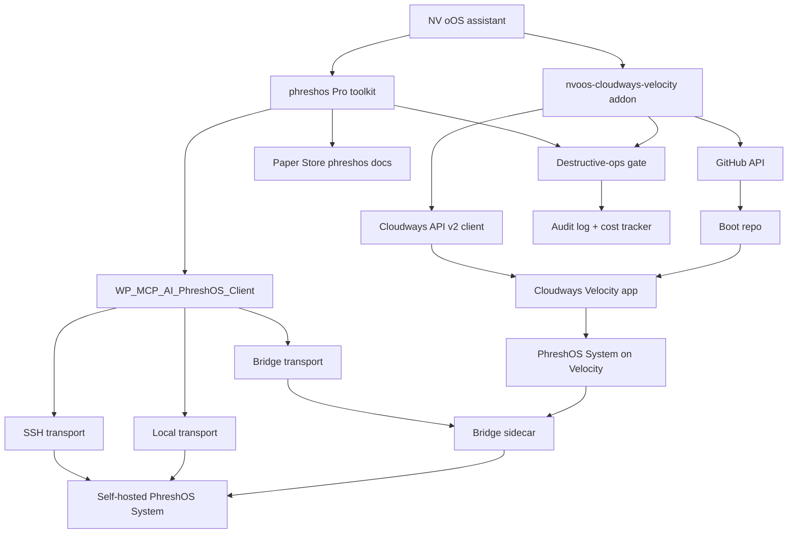

# Proposal: PhreshOS Pro Toolkit + Cloudways Velocity Addon

**Date:** 2026-10-09
**Status:** 🔮 PENDING
**Estimated Effort:** 10–15 working days across two tracks (see §8)
**Priority:** MEDIUM
**Related:** [`063-phreshos-cloudways-velocity-research.md`](./063-phreshos-cloudways-velocity-research.md) (research appendix) · [`062-food-beverage-management-pro-toolkit-proposal.md`](./062-food-beverage-management-pro-toolkit-proposal.md) (Pro toolkit precedent) · [`053-chatgpt-plugin-addon-proposal.md`](./053-chatgpt-plugin-addon-proposal.md) (addon/mirror-repo precedent) · [`055-nvoos-mcp-gateway-proposal.md`](./055-nvoos-mcp-gateway-proposal.md) (bridge-service precedent)

> Scope: ship two coordinated surfaces that make NV oOS a first-class operator of
> [PhreshOS](https://phreshos.com/docs/) — a self-hosted, web-native "operating
> system" for software Programs (System service + browser Desktop, Node 24+,
> `@phreshos/*` SDKs, permission model) — both locally and in the cloud:
>
> 1. **Track A — `phreshos` Pro toolkit** (`addons/pro/includes/tools/phreshos/`):
>    read/inspect + guarded lifecycle tools that manage a PhreshOS System from
>    WordPress (programs, processes, logs, stores, permissions, updates) over
>    three configurable transports (SSH CLI, HTTP bridge, local CLI), plus a
>    PhreshOS knowledge base ingested from `phreshos.com/docs`.
> 2. **Track B — `nvoos-cloudways-velocity` addon** (`plugins/nvoos-cloudways-velocity/`):
>    a standalone WordPress plugin that wraps the Cloudways API v2 to provision,
>    deploy, and operate Node.js apps on **Cloudways Velocity** (managed Node.js
>    hosting, GA 2026-09-10), including a one-shot "Deploy PhreshOS to Velocity"
>    starter flow that hosts the System + Desktop in the cloud and pairs it with
>    the Track A toolkit via the HTTP bridge.

> Related in-repo work: `wp-cli` toolkit (guarded passthrough precedent),
> `ssh`/exec service patterns (transport precedent), `security` (API key store,
> destructive-ops gate), `paper-store` toolkit (docs ingestion), `mcp-ai-wpoos-toolkit-creation`
> skill (the 7-surface registration checklist this build follows), `mcp-ai-wpoos-wporg-submission`
> skill (standalone-plugin disclosure rules), `mcp-ai-wpoos-toolkit-audit` skill
> (pre-PR hardening scan).

---

## 1. Executive Summary

PhreshOS is a young but coherent platform: a self-hosted System service that
keeps user Programs running, stores their data, and gates what each Program may
reach (network, files, shell) behind owner-granted permissions, exposed through
a browser Desktop. It explicitly targets agents: *"An agent works with the same
Programs through the System's APIs, at the same time as you use them on the
Desktop."* NV oOS has no way to operate it today.

Cloudways Velocity is Cloudways' managed Node.js hosting (GA 2026-09-10, flat
pricing from $20/mo, Git-based deployment, Express/Fastify/Next.js and other
presets, persistent processes for long-running backends) with a new **Cloudways
API v2** surface. PhreshOS's System is a Node.js service, which makes Velocity
the natural cloud home for it — but there is no WordPress- or assistant-friendly
tooling for either product.

This proposal adds both halves:

- **Track A** builds a `phreshos` Pro toolkit following the food-beverage
  playbook: a transport-agnostic `WP_MCP_AI_PhreshOS_Client` service (SSH CLI →
  HTTP bridge → local CLI), ~18 tools split into read-only inspect tools and
  destructive-gate-protected lifecycle tools, schedule + workflow presets, and
  the full seven-surface registration. The PhreshOS docs are ingested into a
  Paper Store `phreshos` knowledge collection plus a bundled reference guide so
  assistants can answer PhreshOS questions and generate Program code (Server /
  Client / store / permissions) from the docs.
- **Track B** ships `plugins/nvoos-cloudways-velocity/`, a standalone plugin
  with a Cloudways API v2 client (credential store integration), Velocity app
  lifecycle + deploy/env/domain/backup/service tools, and a **PhreshOS starter
  flow**: scaffold a System boot repo → push via GitHub API → create Velocity
  app with env vars (`PHRESHOS_HOST=0.0.0.0`, `PHRESHOS_PORT`, `PHRESHOS_HOME`)
  → deploy → health-check → hand back the Desktop URL + bridge token that Track
  A consumes. The plugin follows the nvoos-content-graph standalone conventions
  (wp.org-track, External Services disclosure, zero-HTTP tests).

Outcome: an assistant can provision, deploy, and operate a PhreshOS System in
the cloud from WordPress, then manage its Programs — or operate an existing
self-hosted System over SSH — using the same toolkit, with every write path
gated, audited, and allowlisted.

---

## 2. Problem Statement

1. **No PhreshOS surface in NV oOS.** PhreshOS Programs are built and operated
   entirely from `phresh` CLI and the Desktop. There is no toolkit, no docs
   corpus, and no assistant integration, so NV oOS cannot operate a PhreshOS
   System (list programs, tail logs, read stores, grant permissions, install
   programs) or generate PhreshOS Program code from its docs.
2. **Hosting PhreshOS is manual today.** The System must be installed per-user
   on a machine (`phresh system install`, `launchd`/`systemd --user`). The docs
   anticipate containers and reverse proxies (`PHRESHOS_HOST=0.0.0.0`) but
   provide no deploy pipeline. Agencies hosting client Programs need a managed
   path — Cloudways Velocity fits (Node.js-first, persistent, Git-deploy) but
   has no WordPress-native control plane in this ecosystem.
3. **Cloudways Velocity has no first-party WordPress/assistant tooling.** The
   console is click-driven; API v2 is new (early access) and undocumented in
   this repo. Repeatable deploy/ops (env rotation, deploy triggers, backup
   checks, service restarts) can't be scripted from NV oOS today.
4. **Safety story is everything.** PhreshOS grants Programs shell/network/file
   reach; Velocity apps hold production tokens. A generic assistant with ~1,650
   tools cannot be pointed at either. Both surfaces must ship default-deny
   write tools, capability flags, and audit visibility — the same discipline as
   the F&B toolkit's permission model.
5. **Knowledge drift.** PhreshOS is pre-1.0 (0.1.x, release "Sprout"); its API
   moves fast. Hand-written prompts about PhreshOS go stale; a versioned,
   ingestable docs corpus is required.

---

## 3. Research Summary

Full findings in [`063-phreshos-cloudways-velocity-research.md`](./063-phreshos-cloudways-velocity-research.md).
Key facts the design is anchored to:

| Fact | Value | Consequence for design |
|---|---|---|
| PhreshOS System | user-level background service; keeps Programs running; permission gate for network/files/shell | Toolkit must be transport-pluggable (SSH for self-hosted, HTTP bridge for cloud) |
| SDKs | `@phreshos/core`, `client`, `server`, `node`, `cli`, `react`, `react-ui` | The HTTP bridge is a ~50-line `@phreshos/node` `System.connect()` sidecar — no protocol invention |
| Concepts | handles, reads-are-current, subscribe/wait/events, 10 s deadlines, failures reject with `Error` | Tools must return fresh reads and surface deadline errors verbatim; no caching assumptions |
| CLI surface | `phresh system about/status/start/stop/update/install`, `phresh create/dev/install` | SSH transport can be built as an allowlisted `phresh` passthrough (wp-cli toolkit precedent) |
| Env config | `PHRESHOS_HOME`, `PHRESHOS_HOST`, `PHRESHOS_PORT` (4300–4399) | Velocity deploy is Twelve-Factor: all config via env vars; data dir on persistent storage |
| Windows | System installs/runs; some Programs don't work (macOS/Linux primary) | Document macOS/Linux as Tier-1; Windows best-effort |
| Cloudways Velocity | managed Node.js, GA 2026-09-10, from $20/mo, Git-based deploy, auto framework detection, Node 22 LTS, PM2/NGINX/Redis services, auto-deploy on push | GitOps deploy pipeline is the product model — the addon orchestrates Git + API, not servers |
| Cloudways API v2 | new; expanded apps/security/billing/integrations endpoints; Velocity included | Client must be version-tolerant; fall back to console-guided flows where an endpoint is missing |
| Industry standards | least-privilege capability scoping, Twelve-Factor config, GitOps deploys, idempotent lifecycle ops, wp.org External Services disclosure | Encoded as design rules §4.6 |

---

## 4. Proposed Solution

### 4.1 Track A — `phreshos` Pro toolkit

Folder: `addons/pro/includes/tools/phreshos/` (layout per the toolkit-creation
playbook):

```
addons/pro/includes/tools/phreshos/
├── init.php                                  # requires services; settings-defaults filter
├── README.md                                 # purpose / tiers / transports / conventions
├── TOOLS_LIST.txt
├── class-wp-mcp-ai-phreshos-settings.php     # wp_mcp_ai_phreshos_settings option wrapper
├── class-wp-mcp-ai-phreshos-transport.php    # transport interface (one structure per file)
├── class-wp-mcp-ai-phreshos-ssh-transport.php    # SSH CLI: allowlisted `phresh` passthrough
├── class-wp-mcp-ai-phreshos-bridge-transport.php # HTTP JSON-RPC bridge (Velocity-hosted sidecar)
├── class-wp-mcp-ai-phreshos-local-transport.php  # local CLI (same host as WordPress)
├── class-wp-mcp-ai-phreshos-client.php       # façade: routing, response normalisation, timeouts
├── class-wp-mcp-ai-phreshos-docs.php         # bundled docs corpus + Paper Store sync helper
├── class-wp-mcp-ai-phreshos-tool-base.php    # abstract base: guard(), transport resolution
├── class-wp-mcp-ai-tool-phreshos-*.php       # one file per tool
└── tests/
    ├── fixtures/*.json                       # canned System responses per transport
    ├── smoke-run.php                         # standalone stub harness
    └── test-*.php                            # WP_UnitTestCase suite
```

**Transports** (settings-driven, one active at a time):

| Transport | When | Auth | Notes |
|---|---|---|---|
| `ssh` | self-hosted System (macOS/Linux box) | SSH key, no passwords | allowlisted `phresh` subcommands only; `--json` output parsed array-safely (audit skill rule) |
| `bridge` | Velocity-hosted or LAN System | shared secret over HTTPS | calls the bundled sidecar (see §4.4); primary path for Track B pairing |
| `local` | WordPress and System on same machine | none | dev/test only; capability-gated |

**Tools (~18, slugs `phreshos_*`):**

Read / inspect (capability `read`, flags `pro, read-only, cacheable, local-only, idempotent`):

1. `phreshos_system_about` — version, release name, startedAt, service status
2. `phreshos_system_status` — whether the service runs
3. `phreshos_program_list` — installed Programs (names, state)
4. `phreshos_program_processes` — running Processes for a Program
5. `phreshos_log_tail` — tail System logs with level/time filters
6. `phreshos_store_get` — read a value from a Program's store
7. `phreshos_store_list` — list a Program's store keys
8. `phreshos_desktop_info` — Desktop address, owner sign-in state
9. `phreshos_permission_list` — granted/requested permissions per Program
10. `phreshos_endpoint_ask` — `ask()` a Program endpoint (question/answer contract)

Write / lifecycle (capability `manage_options`, routed through the
**destructive-ops gate**, default-deny per assistant):

11. `phreshos_program_create` — scaffold a Program (`phresh create`)
12. `phreshos_program_install` / 13. `phreshos_program_start` /
    14. `phreshos_program_stop` / 15. `phreshos_program_remove`
16. `phreshos_system_start` / 17. `phreshos_system_stop` /
    18. `phreshos_system_update`
19. `phreshos_store_set` — write a small value to a Program store
20. `phreshos_permission_grant` — grant a permission an owner approved
    (never self-approves: tool requires an explicit `owner_approved` flag +
    audit entry)
21. `phreshos_cli_run` — allowlisted `phresh` passthrough (subcommand
    allowlist in settings; mirrors the wp-cli toolkit's guard model)

Every tool: canonical envelope (success array or `WP_Error`), two-gate
sanitisation, `{@inheritdoc}` docblocks, and a `get_usage_guidance()` block.
`phreshos_endpoint_ask` and read tools expose the 10-second deadline semantics
as a `timeout_seconds` parameter.

**Docs ingestion (Phase 1):** crawl `phreshos.com/docs/` (quick start, concepts,
program, desktop, system incl. permissions/data/logs/files/network/shell,
installation, SDKs, CLI reference) into:

- a Paper Store `phreshos` collection (one record per doc page, tagged
  `phreshos`, `version:<release>`, source URL, fetched date) — refreshable via
  a weekly schedule preset;
- a bundled markdown reference (`addons/pro/includes/tools/phreshos/docs/`)
  shipped with the toolkit so assistants answer from tracked, versioned text
  (docs-hub pattern: docs travel with the code);
- a `phreshos_generate_program` helper tool (read-only) that drafts Server /
  Client / store / permission code from the bundled docs — drafts only, never
  writes to the System.

**Registration — all seven surfaces** (per the toolkit-creation skill): central
registry block in `addons/pro/mcp-ai-wpoos-pro.php`, admin Tools section
checkbox (`enable_phreshos_toolkit`, default false), Pro settings status map,
WP-CLI toolkit + status commands, schedule presets (daily health check;
weekly log digest; weekly docs re-crawl), workflow presets ("PhreshOS incident
triage": system_status → log_tail → program_processes → summarise; "Weekly
PhreshOS digest"), and SA Toolkit Manager flags.

### 4.2 Track B — `nvoos-cloudways-velocity` addon

Standalone plugin at `plugins/nvoos-cloudways-velocity/` following the
nvoos-content-graph conventions (own namespace, wp.org-track, standalone REST +
optional MCP-bridge tools when the base plugin is present):

```
plugins/nvoos-cloudways-velocity/
├── nvoos-cloudways-velocity.php              # bootstrap (wp-plugin-bootstrap conventions)
├── includes/
│   ├── class-nvoos-cwv-config.php            # constants: API base, timeout, user-agent
│   ├── class-nvoos-cwv-client.php            # API v2 client: auth, retries, error envelope
│   ├── class-nvoos-cwv-credential-store.php  # key storage via WP_MCP_AI_* key store when present, else wp_options + wp_crypt()/DB hashing
│   ├── class-nvoos-cwv-app-service.php       # app lifecycle, deploy, env, domains, backups, services
│   ├── class-nvoos-cwv-phreshos-starter.php  # the PhreshOS starter flow (scaffold → repo → app → env → deploy → verify)
│   ├── class-nvoos-cwv-rest-controller.php   # /wp-json/nvoos-cwv/v1/* with permission_callbacks
│   ├── class-nvoos-cwv-tools.php             # MCP-bridge tool registrations (optional, when NV oOS present)
│   └── class-nvoos-cwv-github.php            # thin GitHub REST client (repo scaffold + push)
├── templates/phreshos-system/                # the boot repo template (Express preset)
├── assets/ (css/js for the admin deploy wizard)
├── readme.txt / WPORG-REVIEW-COMMERCE-NOTES.md / .wordpress-org/
├── tests/                                    # zero-HTTP tests: fixture-driven client/service tests
└── README.md
```

Tools (exposed through the MCP bridge when NV oOS is active, plus standalone
REST for plugin-only sites):

Read: `cwv_app_list`, `cwv_app_get`, `cwv_deployment_list`, `cwv_env_var_list`,
`cwv_backup_list`, `cwv_service_list`, `cwv_logs_fetch`, `cwv_health_check`.
Write (destructive-gate + `manage_options`): `cwv_app_create`, `cwv_app_delete`,
`cwv_deploy`, `cwv_env_var_set`, `cwv_domain_add`, `cwv_backup_create`,
`cwv_service_restart`, `cwv_phreshos_deploy`.

`cwv_phreshos_deploy` is the headline flow (idempotent, resumable):

1. scaffold/validate the boot repo from `templates/phreshos-system/` (Express
   preset: a `system.js` entry that boots PhreshOS System + Desktop HTTP
   listener; `package.json` pins Node 22 LTS and `@phreshos/*`);
2. create/push the GitHub repo (user-scoped PAT or connected GitHub app);
3. create the Velocity app (framework preset `Express`, entry file
   `system.js`, root dir `/`);
4. set env vars: `PHRESHOS_HOST=0.0.0.0`, `PHRESHOS_PORT` (velocity-assigned),
   `PHRESHOS_HOME=/persistent/phreshos`, plus the bridge secret (generated,
   stored in the credential store, never logged);
5. trigger deploy, poll to ready, health-check the Desktop listener;
6. return the Desktop URL + bridge endpoint + token for Track A's `bridge`
   transport.

The admin wizard mirrors this flow step-by-step with progress + logs, and the
plugin stores per-site connection records (site → app_id → bridge secret) so
the `phreshos` toolkit can resolve "manage the PhreshOS on app X" to a
transport automatically.

### 4.3 Bridge sidecar (shared by both tracks)

A tiny repo (shipped in `plugins/nvoos-cloudways-velocity/templates/phreshos-bridge/`
and reusable standalone):

```
System.connect() (@phreshos/node)
  → JSON-RPC over HTTP (subset: about/status/programs/processes/logs/store/ask/grant)
  → shared-secret auth, request caps, audit line per call
```

This is the piece that makes a Velocity-hosted PhreshOS remotely operable
without SSH and without exposing the Desktop publicly. It is deliberately
small (~1 file, no framework) so it survives Cloudways' dependency and build
pipeline constraints.

### 4.4 Security posture (both tracks)

- **Default-deny writes.** All lifecycle tools require `manage_options`, sit
  behind the destructive-ops gate, and are off by default in per-assistant
  allowlists. `phreshos_permission_grant` requires an explicit
  `owner_approved` argument and writes an audit record — the toolkit never
  silently escalates a Program's permissions.
- **Secrets.** Cloudways API keys and bridge tokens go through the existing
  API-key store (or an encrypted option fallback in the standalone plugin);
  SSH uses keys, never passwords; nothing is logged (audit-logger redaction).
- **Transport hygiene.** SSH: allowlisted subcommands, output parsed
  array-safely (never string-assumed), no shell interpolation. Bridge: HTTPS +
  shared secret, per-request caps, timeouts. Both obey the four-failure-class
  rules from the toolkit-audit skill.
- **wp.org compliance.** The standalone plugin discloses the Cloudways +
  GitHub external services in readme.txt and
  `WPORG-REVIEW-COMMERCE-NOTES.md` (js.stripe.com-style precedent), with
  zero-HTTP tests so the plugin check gate stays green.
- **Cost guardrails.** Velocity billing is the user's Cloudways account; the
  addon surfaces plan/app counts before create and logs every billable
  operation through the existing cost tracker where present.

### 4.5 Architecture



### 4.6 Design rules (from industry standards)

1. **Twelve-Factor config** — every Velocity deploy configures via env vars
   only (`PHRESHOS_*`); no secrets in the repo template.
2. **GitOps deploys** — deployable state = the Git repo + branch; the addon
   orchestrates Git, never edits files on servers.
3. **Least-privilege capability scoping** — mirror PhreshOS's own
   owner-granted permission model in the toolkit's default-deny write tier.
4. **Idempotent lifecycle ops** — start/stop/deploy/health-check are safe to
   retry and return current state (reads-are-current semantics).
5. **Observability** — every tool pair has a read counterpart; schedule
   presets ship health + digest runs; failures surface the upstream `Error`
   message verbatim.
6. **Docs-as-code** — PhreshOS knowledge ships with the toolkit and is
   versioned against the release (`about.version`), refreshed on schedule.

---

## 5. Benefits

- **First-class PhreshOS operation.** Assistants can manage Programs, logs,
  stores, and permissions on self-hosted and cloud Systems with the same tool
  set — a capability no other WordPress integration offers.
- **Cloud-native PhreshOS in one command.** `cwv_phreshos_deploy` turns
  "host my PhreshOS" from a manual `launchd`/`systemd` ritual into a
  resumable, health-checked GitOps deploy on managed Node.js hosting.
- **Reusable Velocity control plane.** The addon's API v2 client and tool set
  work for any Node.js app (Express, Fastify, Next.js, n8n…), not just
  PhreshOS — a general "Cloudways Velocity JS" operations surface.
- **Assistants that know PhreshOS.** The ingested docs corpus + code-drafting
  helper turns NV oOS into a PhreshOS development assistant (Program
  scaffolding, permission design, event/ask patterns) grounded in versioned
  docs rather than stale training data.
- **Safety by construction.** Default-deny writes, destructive gate, audit
  trail, and secret hygiene match the repo's security-first posture and the
  Unix-theory tool rules.
- **Ecosystem fit.** Follows the food-beverage toolkit playbook (7 surfaces,
  smoke harness, oracle testing) and the nvoos-content-graph standalone
  conventions — low novelty, high reuse.

---

## 6. Implementation Plan

### Phase 0 — Docs & scaffold (this proposal, done)

Proposal + research doc + boot-repo and bridge templates spec'd.

### Phase 1 — Track A: toolkit core + SSH transport + read tools (2–3 days)

Settings class, transport interface, SSH + local transports, client façade,
read tools (1–10), tool base, docs crawler + Paper Store seeding, bundled
reference. Fixtures + smoke harness for the read path.

### Phase 2 — Track A: write tools + guards + presets (2–3 days)

Lifecycle tools (11–21) behind the destructive gate; `phreshos_cli_run`
allowlist; `phreshos_generate_program`; the seven registration surfaces
(registry, admin section, status map, WP-CLI ×2, schedule + workflow presets,
SA manager). Docker PHPUnit green.

### Phase 3 — Bridge sidecar + Track A bridge transport (2 days)

`templates/phreshos-bridge/` Node sidecar (JSON-RPC subset, secret auth, caps,
audit), `phreshos-bridge-transport`, integration fixtures, localhost
end-to-end smoke test.

### Phase 4 — Track B: addon scaffold + API v2 client + app tools (3–4 days)

`plugins/nvoos-cloudways-velocity/` scaffold; credential store; client with
fixture-driven zero-HTTP tests; read tools + write tools + REST controller +
admin wizard (app lifecycle first, PhreshOS starter stubbed).

### Phase 5 — Track B: PhreshOS starter flow + pairing (2–3 days)

Boot-repo template + GitHub integration + `cwv_phreshos_deploy` end-to-end;
connection records; Track A `bridge` auto-resolution; dry-run mode (all
billable steps simulated) for demos; wp.org submission pack
(readme, disclosure notes, listing assets).

### Phase 6 — Validation & hardening (2 days)

phpcs both standards; smoke harness; Docker PHPUnit; the
toolkit-audit four-failure-class scan; destructive-gate test coverage; preset
sanity load (preset files silently exit without `ABSPATH` — stub and assert);
docs update (`docs/tool-reference.md`, folder READMEs, proposals README status).

---

## 7. Success Metrics

- **Coverage:** ≥20 `phreshos` tools + ≥14 `cwv_*` tools registered and
  discoverable across all seven surfaces; `wp mcp-ai pro toolkit status`
  shows both.
- **Correctness:** smoke harness reproduces fixture transcripts for every
  tool; bridge round-trip passes end-to-end against a local System install;
  Docker PHPUnit green.
- **Safety:** 0 write tools reachable without `manage_options` + destructive
  gate; permission-grant tool refuses without `owner_approved`; audit log
  records every lifecycle call (tested).
- **Deploy:** `cwv_phreshos_deploy` completes scaffold → repo → app → env →
  deploy → health-check against a real Velocity account in the pilot, and the
  same flow runs to completion in dry-run mode with zero billable calls.
- **Knowledge:** Paper Store `phreshos` collection ≥ 20 records, each
  versioned and source-linked; weekly re-crawl preset active.
- **Quality gates:** phpcs clean (WordPress + Pro standards), plugin check
  green for the standalone plugin, no toolkit-audit findings.

---

## 8. Effort Estimation

| Track | Work | Estimate |
|---|---|---|
| A | toolkit core, transports, 21 tools, docs ingestion, presets, tests | 6–8 days |
| B | standalone plugin, API v2 client, 14 tools, starter flow, wizard, wp.org pack | 7–9 days |
| Shared | bridge sidecar, validation, hardening, docs | 2–3 days |
| **Total** | | **10–15 working days** (parallelisable: Tracks A and B are independent until Phase 5) |

Dependencies: a Cloudways Velocity account for the Phase 5 pilot (flat pricing
from $20/mo), a GitHub token for the starter flow, and — if API v2 access is
early-access gated — one waiting item on the v2 rollout (console-guided
fallback paths documented).

---

## 9. Risks & Mitigations

| Risk | Impact | Mitigation |
|---|---|---|
| PhreshOS pre-1.0 API churn | tools drift | docs corpus + fixtures version-pinned to `about.version`; weekly re-crawl preset; transport isolates CLI shape changes |
| Windows host limitations | some Programs fail | macOS/Linux documented as Tier-1; Windows best-effort with surfaced warnings |
| Cloudways API v2 early access / schema gaps | client brittle | version-tolerant client, error-envelope passthrough, console-guided fallback steps; contribute upstream feedback |
| Velocity persistent-volume behaviour for `PHRESHOS_HOME` | data loss on redeploy | Phase 5 pilot verifies persistence model first; starter flow documents volume choice; backups tool surfaces snapshot state |
| Secret sprawl (API keys, bridge tokens, GitHub PATs) | exposure | existing key store / encrypted options, redaction in audit logger, no logging, rotation tool guidance |
| Shell-transport misuse | exec fatal on disabled hosts | allowlisted passthrough, `is_exec`/`exec` capability guards, bridge as the safe default on managed hosting |
| Billing surprise (Velocity plan) | cost | pre-create plan/app-count check, dry-run mode, cost tracker integration |

---

## 10. Open Questions

1. **Velocity persistence:** does `PHRESHOS_HOME` data survive redeploys, or
   must the starter flow attach/choose persistent storage? (Verify in Phase 5
   pilot.)
2. **API v2 access:** is the Velocity app lifecycle exposed on the public v2
   endpoints today, or early-access gated? Which scopes does the token need?
3. **GitHub integration:** user PAT vs GitHub App — repo-scoped PAT is the v1;
   a connected-app flow is the nicer follow-up.
4. **Bridge exposure:** should the bridge live behind Velocity's domain with
   basic-auth/secret only, or also support IP allowlists? (Secret-only for v1.)
5. **Docs licensing:** confirm `phreshos.com/docs` content can be mirrored
   into the Paper Store corpus with attribution (record source URLs regardless).
6. **Toolkit vs addon tool namespaces:** keep `phreshos_*` and `cwv_*`
   separate even when the addon is active (proposed) — confirm no merge into
   one namespace.
7. **Windows Tier:** is any Windows support (scheduled-task transport) worth a
   stretch goal, or macOS/Linux-only for 1.0?
8. **Node runtime:** Velocity's documented runtimes list Node 22 LTS, while
   PhreshOS requires ≥ 24.15. Confirm the highest selectable runtime on the
   pilot plan; if < 24.15, decide between a pinned-runtime fallback and a
   documented blocker.

---

## 11. Decision Required

1. **Approve both tracks** (phreshos toolkit + nvoos-cloudways-velocity addon)
   with the phase order above — or prioritise one track (recommended: Track A
   first, it has no external billing dependencies).
2. **Approve the default-deny security model** for lifecycle tools and the
   `owner_approved` requirement on `phreshos_permission_grant`.
3. **Approve the Cloudways Velocity pilot** (one paid account, from $20/mo)
   for Phase 5 end-to-end validation.
4. **Approve the mirror-repo / wp.org path** for the standalone plugin
   (nvoos-content-graph precedent) vs shipping it monorepo-only initially.
5. **Confirm the docs-ingestion scope** (public docs pages only; no private
   PhreshOS materials).
