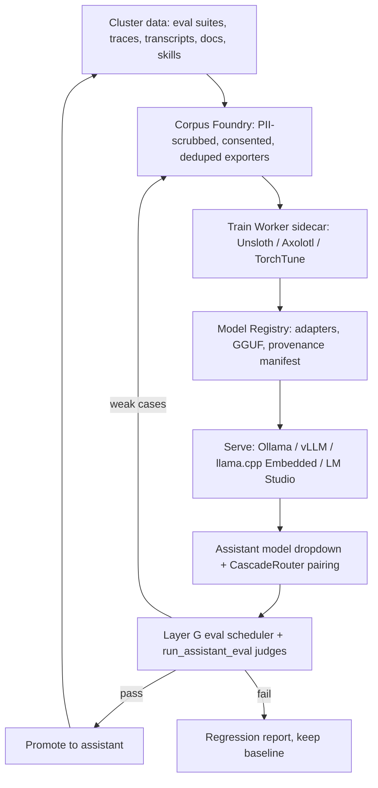

# Proposal 067 — Cluster Fine-Tuning & Model Foundry

**Status:** 🔮 PENDING
**Date:** 2026-10-11
**Priority:** MEDIUM (HIGH once Phase 0 bake-off passes)
**Estimated Effort:** 6 phases, ~4–6 weeks across a 2-agent pod
**Scope:** Pro addon (`addons/pro/`) + a new Python **train-worker** sidecar. Base plugin gains read-side registry seams only. `lib/core` untouched (provider contracts reused as-is).
**Related:** Proposal 056 (harness: eval judges, cascade routing, session distiller) · `docs/features/llm-harness.md` (Layers A–H) · `mcp-ai-wpoos-assistant-portability` skill (bundle format v1) · `mcp-ai-wpoos-updates` skill (Track B — model catalog) · `mcp-ai-wpoos-spa-ui` skill (sidecar/SPA conventions) · Embedded addon (llama.cpp GGUF client) · Media Worker (sidecar precedent)
**Inspiration:** [Spheron — Axolotl vs Unsloth vs TorchTune (2026)](https://www.spheron.network/blog/axolotl-vs-unsloth-vs-torchtune/) — reviewed 2026-10-11.

---

## Executive Summary

The NV oOS cluster — base plugin, Pro addon, 30 addons, 4 standalone wp.org
plugins, the `lib/core` engine, and their sidecars — is already a
**self-generating fine-tuning data factory**. It accumulates eval suites
(Layer G), harness traces, session transcripts, docs-hub corpora, bundled
skills, and OKF knowledge. Today the only training-facing output is the Pro
Layer-H exporter (`export_fine_tune_curriculum` → OpenAI chat JSONL). There is
no trajectory/preference exporter, no training-job orchestration, no registry
for trained artifacts, no serving path for them, and no eval-gated promotion.

This proposal turns the cluster into a **Model Foundry**: a closed loop that
distils each plugin's and each assistant's accumulated data into small,
specialised models (LoRA/QLoRA adapters, GRPO reasoning runs, fine-tuned
embedding models, GGUF quantisations), serves them through the provider system
the cluster already owns (Ollama, vLLM, LM Studio, the Embedded addon's
llama.cpp client), and gates every promotion behind the existing Layer-G eval
harness with regression detection. The 2026 framework landscape reviewed in
the source article (Unsloth for single-GPU speed, Axolotl for YAML-driven
multi-GPU production, TorchTune for PyTorch-native control, LLaMA-Factory for
zero-code UI) maps cleanly onto the cluster: **Unsloth is the default trainer,
Axolotl is the scale-out tier, TorchTune is the extensibility tier, and the
cluster's own eval harness is the neutral referee** for every claim made about
any of them.

## Problem Statement

1. **Assistants run on frontier generalists.** Every assistant in the cluster
   pays frontier-model cost and latency for work a small, plugin-specialised
   model could do — exactly the situation Proposal 056's cascade routing
   (P1) was built for, but there are no *specialised models* to put on the
   cheap tier. Cascade routing currently degrades to "cheap generalist →
   frontier generalist".
2. **The cluster's data is stranded.** Layer G runs eval suites daily and
   stores trends; the harness trace store mines tool chains; session
   distiller emits canonical memory events; docs-hub ships a full markdown
   wiki per plugin. Layer H exports a *static curriculum* (input/expected
   pairs) but ignores the richest signals: multi-turn tool-calling
   trajectories, preference pairs (chosen/rejected), and per-plugin domain
   prose. None of it reaches a trainer.
3. **There is no artifact lifecycle.** If a site owner trains an adapter
   externally today, there is no place to register it, no assistant UI to
   select it, no catalog entry, no way to eval it against the assistant's own
   suites, and no way to roll it back. Fine-tuning is a manual act outside
   the product.
4. **Multi-plugin proliferation multiplies the gap.** The cluster is growing
   (design-system wp.org submission next, #6811; CG platform 2.0.0). Every
   new plugin ships tools, docs, and skills that its assistants must re-learn
   from context on every request. Small per-plugin adapters would amortise
   that "training" once instead of paying context-window cost forever.

## Source Review — the 2026 Fine-Tuning Landscape

The article is Spheron vendor content (GPU rental); its benchmark numbers are
self-run and marketing-flavoured. They are adopted here as **directional
priors only** — Proposal 056's Layer G + `run_assistant_eval` is precisely the
instrumentation that turns every framework claim into a verifiable
experiment on *our* suites, on *our* hardware.

### The five shifts that matter (per the article)

| # | Shift | Why it matters to the NV oOS cluster |
|---|---|---|
| 1 | **GRPO / reasoning training on consumer hardware** (DeepSeek-R1 lineage; ~5 GB VRAM on Unsloth) | Reasoning-style assistants (analyst, QA, security audit) can be tuned on a 4090, on-prem, without shipping customer data to a cloud trainer |
| 2 | **Multimodal as baseline** (Axolotl: Qwen2-VL, LLaMA-Vision, Pixtral) | Pro vision toolkits (RF-DETR catalogs, product photography, OCR) could get tuned vision-language models instead of prompt-only routing |
| 3 | **MoE became practical** (Qwen3 30B-A3B at 17.5 GB, ~12× Unsloth speedup) | Cheap, high-quality serving tier for cascade routing without a 70B dense model |
| 4 | **Quantization-aware training (QAT)** (Axolotl; 5× better post-quantization perplexity) | GGUF 4-bit artifacts for the Embedded addon's llama.cpp path stop being a quality cliff |
| 5 | **Embedding / retrieval fine-tuning** (Unsloth: BAAI/bge, matryoshka) | Graphify's embeddings table + `semantic_content_search` can be tuned on site content, keeping the retriever aligned with the fine-tuned LLM |

### Framework comparison (distilled)

| Framework | Speed / VRAM | Scale | Model coverage | Best fit in this proposal |
|---|---|---|---|---|
| **Unsloth** | 2–5× faster; 70% less VRAM; GRPO at ~5 GB; MoE 12×; dynamic 4-bit better than BnB | OSS: single-GPU only (Pro = multi-GPU) | 150+ models incl. embedding models | **Default trainer**: per-assistant / per-plugin LoRA, GRPO, QAT → GGUF for Embedded/Ollama |
| **Axolotl** | baseline single-GPU; FSDP2/DeepSpeed multi-GPU, multi-node | Production teams; YAML configs; QAT, GRPO, reward modeling, Liger kernels | 100+ models + multimodal | **Scale-out tier**: cluster-wide runs, multimodal vision toolkits; YAML co-located in each plugin's repo |
| **TorchTune** | 1.2× with `torch.compile`; FSDP2 native | PyTorch-native; DoRA (−8% VRAM vs QLoRA); stable PPO | Meta models (fewer recipes) | **Extensibility tier**: custom training loops; teams extending the trainer itself |
| **LLaMA-Factory** | 1–2× via Unsloth backend; DeepSpeed | Web UI, zero-code; low-level control limited | 100+ models | **Beginner tier** for site owners; consumes our exported corpora unchanged |

### Portability rules (taken verbatim as design constraints)

- **Checkpoints interoperate** across all four (HF transformers format) — a
  Unsloth-trained LoRA loads in Axolotl and vice versa. Our registry must
  therefore store the *adapter* + a *config manifest*, never a
  framework-locked blob.
- **Preprocess once, outside the framework.** Export clean tokenized-ready
  datasets (HF `datasets` / plain JSONL) from the Corpus Foundry; every
  trainer consumes the same artifacts. This is the repo's existing
  Layer-H philosophy generalised.
- **Config migration is the friction.** YAML (Axolotl) ↔ Python (Unsloth) ↔
  config objects (TorchTune). Our train-worker owns translation so WordPress
  never sees it.

## Proposed Solution — the Model Foundry

Five subsystems, reusing existing seams wherever possible.

### A. Corpus Foundry (Pro, PHP — data out)

New Pro exporters alongside Layer H, governed by the same conventions
(`manage_options`, per-case caps, skip-reason transparency, uploads-dir
guards, PII scrub via `WP_MCP_AI_PII_Filter`):

| Exporter | Source | Corpus shape | Trainer technique |
|---|---|---|---|
| `export_fine_tune_curriculum` (exists) | Layer G eval suites | chat JSONL (system/user/assistant) | SFT |
| `export_trajectory_corpus` (new) | Harness trace store | multi-turn JSONL incl. `tool_calls`/`tool` messages | tool-calling SFT |
| `export_preference_pairs` (new) | Eval-judged runs + user-rated transcripts (opt-in) | chosen/rejected pairs | DPO / GRPO |
| `export_plugin_docs_corpus` (new) | Docs-hub markdown per plugin | text documents with provenance | domain adaptation / continued SFT |
| `export_embedding_training_set` (new, Phase 6) | Graphify graph + site content pairs | query/document positives + hard negatives | embedding fine-tune (bge / matryoshka) |

Governance requirements baked into every exporter: **consent meta** (only
opt-in assistants/sessions), **PII scrub** at export time, **dedup**
(near-duplicate hashing), and a **provenance manifest** written beside the
corpus (sources, counts, hashes, consent scope, export date). Corpus output
is the contract — trainer-agnostic, per the article's portability rules.

### B. Train Worker (new Python sidecar — training)

A media-worker-style sidecar (Docker, token-auth, SSRF-guarded, REST job API)
that shells out to the frameworks. It is **not** a new MCP server; it is a
job service the Pro addon drives.

- **Stages:** `prepare` (dataset validation, tokenization) → `train` →
  `eval` (runs the assistant's Layer-G suites against the candidate via the
  existing eval runner) → `export` (LoRA adapter + merged weights + GGUF via
  llama.cpp quantisation, optional QAT).
- **Backends:** local NVIDIA GPU (Unsloth single-GPU default), remote GPU
  rental (any OpenAI-compatible scheduler; the article's Spheron/A100-H100
  tiers map to our size table below), or CPU-only tiny models.
- **Framework selection per job:** `unsloth` (default), `axolotl` (YAML
  config; multi-GPU FSDP2), `torchtune` (custom loops), `llama-factory`
  (headless mode for the beginner-tier UI).
- **Configs live in the repo.** One `training/<plugin-or-assistant>.yaml`
  per tuning target, version-controlled beside the plugin code — this is the
  Axolotl/YAML culture the article praises, and it makes "how was this model
  trained" a PR-reviewable artifact.

### C. Model Registry + Serving (Pro + base seams — artifacts in)

- **Registry:** a `mcp_ai_model` custom post type (or Pro table — decide in
  Phase 0) storing: base model, adapter file + checksum, framework + config
  manifest, training date, corpus provenance hash, eval score at promotion.
- **Serving:** zero new provider code. The candidate is served via
  (a) Ollama (`ollama create` from GGUF — provider already exists),
  (b) vLLM (OpenAI-compatible endpoint — already supported),
  (c) the Embedded addon's `WP_MCP_AI_Embedded_Client` (llama.cpp GGUF,
  local), or (d) LM Studio. The **Model Catalog** (v2026.10.03, monthly
  Track-B refresh) gains a "Site-local fine-tuned" section listing registry
  entries, and the assistant edit screen's model dropdown reads it.
- **Cascade pairing:** the promoted model becomes the default cheap tier for
  that assistant; Proposal 056's `CascadeRouter` escalates to the frontier
  model on judge-verified failures. This is where the article's MoE/QLoRA
  efficiency claims turn into measurable cost/latency wins on `WP_MCP_AI_Cost_Tracker`.

### D. Eval Gate + Promotion (Pro — the loop closes)

No trained artifact is promotable without passing the assistant's own
`harness_profile.evals_enabled` suites:

1. Train worker exports the candidate adapter.
2. Layer-G `WP_MCP_AI_Harness_Eval_Scheduler` runs the suites against it
   (generator seam already exists via `wp_mcp_ai_harness_eval_generator`).
3. `run_assistant_eval` trajectory judges score tool selection / tool use /
   response quality against the current baseline.
4. **Promote** only if: no regression below the suite's regression-detector
   threshold AND at least one metric improves. Otherwise **keep baseline**
   and emit a regression report.
5. Weak/low-confidence cases from failed runs feed back into the Corpus
   Foundry (closing the flywheel — the article's "data preprocessing once"
   rule becomes a loop instead of a one-shot).

### E. Automation + Fleet Sharing (Pro + cluster)

- **Pro Schedule Manager presets:** nightly corpus refresh, weekly train,
  weekly eval — so a site self-improves on a calendar.
- **Pro Workflow Builder preset:** `corpus → train → eval → promote`
  DAG (10 node types already cover tool-call chaining).
- **WP-CLI:** `wp mcp-ai model-foundry corpus|train|promote|rollback …`.
- **Fleet sharing:** extend the assistant-portability bundle (v1) with a
  v2 **model artifact section** (adapter + config manifest + provenance
  hash) so a cluster of sites can train once and share "trained plugins" —
  with the same credential-redaction discipline as v1. Optional later:
  a central NV oOS model registry (the nvoos.pro fleet already has the
  gateway/monitoring backbone to host one).

## Hardware Tier Mapping (from the article, applied to cluster sizes)

| Tier | Hardware | What it buys the cluster |
|---|---|---|
| Starter | RTX 4090 24 GB | Per-assistant QLoRA ≤20B; GRPO reasoning runs at ~5 GB; embedding fine-tunes; all on-prem |
| Serious | A100 40 GB | QLoRA ≤34B; multi-assistant batching; local multimodal 7B |
| Production | A100 80 GB / H100 80 GB | 70B QLoRA (2.8–4.2 h); full FT ≤13B; Axolotl FSDP2 multi-GPU cluster-wide runs |
| Fleet | 8× H100 | Cluster-wide full fine-tune; reward-model training; multimodal production |

## Placement Decisions

| Component | Ships in | Rationale |
|---|---|---|
| Corpus Foundry exporters | Pro addon | Layer H precedent; `manage_options`; uploads-dir writes; proprietary license OK |
| Train worker | New sidecar (GPL/MIT) | Python cannot run in PHP; media-worker subtree-split precedent |
| Registry read seams | Base | Assistant UI + catalog read path must work without Pro (Pro owns writes) |
| Serving | Existing providers | Zero new provider code (Ollama/vLLM/LM Studio/Embedded already exist) |
| wp.org standalone plugins (content-graph, docs-hub, …) | **Consume only** | Trainer client and registry writes stay out of wp.org plugins — avoids commerce/external-service disclosure problems; they only *select* a registered model |

## Implementation Plan

| Phase | Work | Effort | Exit criteria |
|---|---|---|---|
| **0 — Bake-off** | Decision record; run one identical fine-tune (Qwen3 4B-class QLoRA) through Unsloth, Axolotl, TorchTune; score all three against the same Layer-G suites | 3–4 d | ADR committed; framework matrix validated on our harness; cost/VRAM table for our GPU tier |
| **1 — Corpus Foundry** | `export_trajectory_corpus`, `export_preference_pairs`, `export_plugin_docs_corpus`; provenance manifest; PII-scrub + consent gates; PHPUnit suites per exporter | 4–5 d | All exporters pass hardening suites; manifests verified |
| **2 — Train Worker** | Sidecar scaffold (media-worker pattern), job API, Unsloth backend, Axolotl YAML backend, GGUF export stage | 6–10 d | End-to-end: exported corpus → adapter + GGUF on a local GPU |
| **3 — Registry + Serving** | `mcp_ai_model` registry, catalog "site-local" section, assistant dropdown, Ollama/Embedded wiring, rollback | 5–8 d | A trained model is selectable on an assistant and answers chat |
| **4 — Eval Gate** | Layer-G candidate runs, regression detector wiring, promote/keep logic, `run_assistant_eval` integration | 3–5 d | Promotion impossible without a passing suite run |
| **5 — Automation + Fleet** | Schedule + workflow presets, WP-CLI commands, portability bundle v2 artifact section | 4–6 d | Nightly train/eval loop runs unattended on a test site |
| **6 — Stretch** | Embedding fine-tune (Graphify), multimodal (vision toolkits), GRPO reasoning profiles, fleet model registry | 5–10 d | Scoped by Phase-0 findings |

## Success Metrics

1. **Quality:** promoted models ≥ baseline on ≥1 Layer-G metric with zero
   regression-threshold violations (measured by the existing regression
   detector).
2. **Cost/latency:** cascade-paired assistants show measurable
   `WP_MCP_AI_Cost_Tracker` savings (target: ≥40% of requests answered on the
   cheap tier with judge-confirmed parity).
3. **Data governance:** 100% of exported corpora carry consent + PII-scrub +
   provenance manifests (asserted in PHPUnit, like the Layer-H suite).
4. **Artifact lifecycle:** every promoted model has an auditable
   train→eval→promote trail and a one-click rollback.
5. **Cluster leverage:** ≥2 addons ship a repo-committed training YAML and a
   bundled corpus recipe within the quarter.

## Risks, Compliance & Licensing

| Risk | Mitigation |
|---|---|
| Customer data in corpora | Consent flags per assistant/session; `WP_MCP_AI_PII_Filter::scrub()` at export; provenance manifest records consent scope |
| wp.org guideline exposure | Trainer client + registry writes live in Pro addon + sidecar only; standalone plugins consume a read-only model dropdown |
| Vendor bias in source article | All benchmarks re-run on our Layer-G suites in Phase 0; no Spheron dependency assumed (any GPU rental works) |
| GPU cost runaway | `WP_MCP_AI_Budget_Enforcement_Service` gets a training-spend cap; schedule presets default off |
| License compatibility | Unsloth/Axolotl Apache-2.0, TorchTune BSD-3 — permissive; sidecar keeps them out of the GPL plugin's dependency graph |
| Model supply chain | Registry stores checksums + provenance hash; promotion requires a passing eval (no blind model drops) |
| Framework churn (the article warns checkpoints drift) | Registry stores adapters + config manifests (HF format) — re-export, not re-train, when frameworks move |

## Decision Required

1. Approve the Model Foundry concept and Phase 0 bake-off (GPU budget:
   one rented 4090/A100 for ~3 days, or an on-prem GPU).
2. Confirm placement: Pro-owned writes + Python sidecar; base gains read-only
   registry seams; wp.org plugins consume only.
3. Approve `mcp_ai_model` as a new CPT (base) vs Pro-table (Phase 0 ADR will
   recommend one).
4. Approve extending the assistant-portability bundle to v2 (model artifact
   section) as the fleet-sharing vehicle.

## Open Questions

- Should Phase 0 also benchmark an **MoE base** (Qwen3 30B-A3B) as the
  cascade cheap tier instead of per-assistant adapters? The article's 12×
  claim makes this competitive with adapter maintenance cost.
- Does the fleet want a **central model registry** (nvoos.pro) in Phase 6, or
  is bundle-based peer sharing sufficient?
- Should `export_preference_pairs` source user-rated transcripts (chat UI
  already has thumbs up/down), and if so, is the consent default opt-in or
  opt-out?
