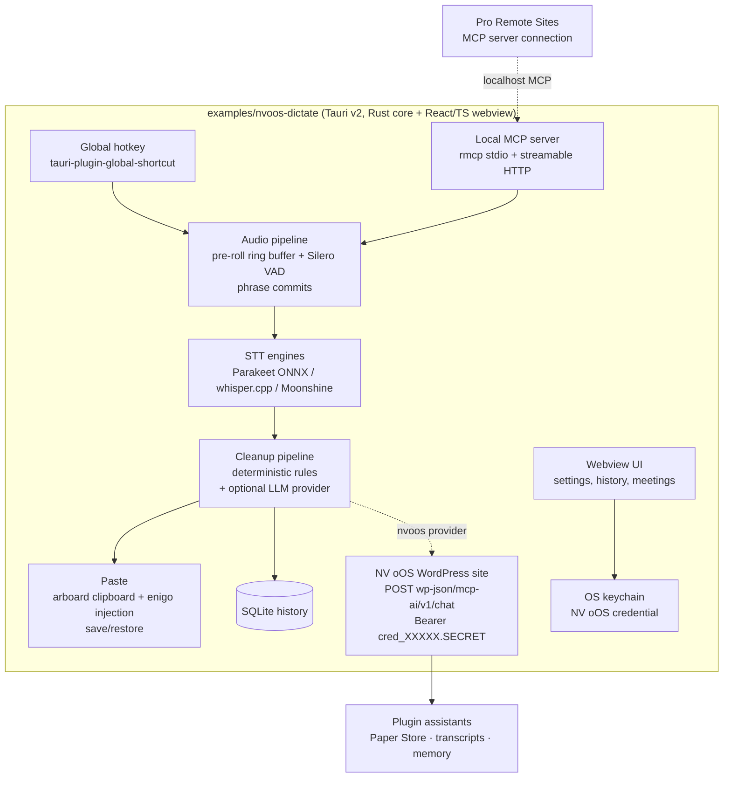

# Proposal 067 — NV oOS Dictation & Meeting Companion (Tauri Desktop App)

**Status:** Draft for discussion
**Date:** 2026-10-11
**Related:** `examples/nvoos-pro-spa-vite` (standalone app precedent), `.agents/skills/mcp-ai-wpoos-content-graph-spa` (headless REST auth contract), `.agents/skills/mcp-ai-wpoos-spa-ui` (repo front-end conventions), `addons/embedded` (existing STT abilities), `docs/project/proposals/067-tauri-dictation-companion-app-implementation-plan.md` (implementation plan)

## Context

The repo ships the AI server side (assistants, chat REST, MCP bridge, Paper
Store) but no system-level input surface: nothing lets a user dictate into
*any* Windows application and get text pasted back, nor capture and transcribe
a meeting outside the browser chat. The macOS-only Resonant Community Edition
(`tohmsc/resonant-community`) defines the target UX — hold a hotkey, speak,
release, paste; local speech recognition; a deterministic on-device cleanup
pipeline; optional hosted AI enrichment; optional local HTTP API + MCP
registration — and this proposal describes the NV oOS equivalent: an in-repo
**Tauri v2 companion app** (`examples/nvoos-dictate`), Windows-first, with
Linux and macOS as later phases, and the NV oOS plugin as its optional AI
enrichment backend.

## Goals

1. **Push-to-talk dictation** — hold a global hotkey, speak, release; cleaned
   text is pasted into the focused app. Works everywhere (editors, terminals,
   browsers, mail clients).
2. **Local-first speech recognition** — STT runs on-device; audio never
   leaves the machine for plain dictation.
3. **Deterministic cleanup on-device** — punctuation, casing, filler removal,
   number/date formatting, custom vocabulary — no LLM required.
4. **Optional AI cleanup/enrichment via NV oOS** — the transcript (text only)
   goes to a configured WordPress site's assistant for LLM polishing, exactly
   the way Resonant's hosted enrichment works but user-owned.
5. **Meeting transcription** — explicit-record meetings with system-audio
   capture, transcript archiving to the plugin.
6. **Bidirectional plugin integration** — the app is an MCP *client* of the
   plugin (REST with assistant credentials) and can expose a local MCP
   *server* so plugin assistants can trigger dictation/transcription.
7. **Local history** — searchable, exportable transcript archive.

## Non-goals (for this proposal)

- Wake-word / always-on listening (push-to-talk or explicit record only).
- Cloud-hosted NV oOS infrastructure — the plugin site the user points at is
  the backend; no new service.
- Speaker diarization in v1 (see Risks).
- Mobile clients (the repo's embedded/SPA surfaces already cover browser).

---

## Industry research summary

### Desktop dictation UX standards

The category benchmark pair is Wispr Flow (cloud STT + strong AI correction
layer) and Superwhisper (local Whisper models, optional cloud). Independent
2026 comparisons establish the conventions this app should match:

- **Latency budget:** ~1–2 s from key-release to pasted text; measured as
  end-of-utterance → last character on screen ([LumeVoice benchmark
  methodology](https://lumevoice.com/blog/top-9-wispr-flow-alternatives/)).
- **Cleanup layer is the differentiator:** raw Whisper output is accurate but
  unpolished; the "AI correction layer" (filler removal, punctuation,
  grammar) is what makes output paste-ready
  ([get-whisper.com comparison](https://get-whisper.com/blog/whisper-vs-superwhisper-vs-wispr-flow),
  [Superwhisper vs Wispr Flow](https://superwhisper.com/vs/wispr-flow)).
- **Local-first is a market requirement:** HIPAA/SOC-2-bound users choose
  local models precisely because audio never leaves the device
  ([voicedash comparison](https://voicedash.ai/wispr-flow-vs-superwhisper/)).
- **Privacy defaults:** push-to-talk (no always-on mic), clipboard
  save/restore, no telemetry, per-app formatting preferences (dictto,
  murmur, Superwhisper all converge on these).

### Speech recognition engines

| Engine | Latency profile | Languages | License | Runtime | Notes |
|---|---|---|---|---|---|
| **Parakeet TDT 0.6B v3** | ~380 ms for 5 s audio (int8 CPU) | ~30+ | CC-BY-4.0 | sherpa-onnx (Apache-2.0) | Best accuracy/latency for English dictation; ~600 MB weights ([NVIDIA card](https://huggingface.co/nvidia/parakeet-tdt-0.6b-v3), [license summary](https://whisper.remskill.com/blog/parakeet-model)) |
| **Moonshine v2 (streaming)** | Tiny 50 ms, Small 148 ms, Medium 258 ms | English | MIT | Moonshine ONNX | Streaming encoder caches state — sub-200 ms live preview; lowest hallucination risk ([arXiv 2602.12241](https://arxiv.org/html/2602.12241v1)) |
| **Whisper (large-v3-turbo / distil)** | Seconds, grows with clip length | 100+ | MIT (weights) | whisper.cpp (MIT) | Multilingual fallback; turbo is the de-facto default ([Northflank STT guide](https://northflank.com/blog/best-open-source-speech-to-text-stt-model-in-2026-benchmarks)) |
| **Faster-whisper** (Python) | ~3 s for 5 s audio (small.en) | 100+ | MIT | Python/CTranslate2 | Convenient but a separate Python runtime — rejected for a Rust app |

Two in-the-wild data points validate the Parakeet-on-CPU default:
[murmur's benchmark](https://github.com/1ch1n/murmur) (5 s dictation: 381 ms
int8 CPU vs 2975 ms faster-whisper) and Resonant's own 2026 model guidance
([onresonant.com](https://www.onresonant.com/resources/local-stt-models-2026)).

**Recommendation:** default engine = Parakeet TDT v3 int8 via sherpa-onnx
(Windows CPU/GPU); fallback = whisper.cpp (multilingual users); optional
experimental = Moonshine v2 streaming for live partial preview. All three are
Rust-loadable ONNX/GGML — no Python sidecar.

### Push-to-talk infrastructure precedents

- **cjpais/Handy** — the proven open-source Windows offline STT app: low-level
  keyboard hook, overlay bubble, tray, VAD + Parakeet pipeline
  ([repo](https://github.com/cjpais/Handy)). It already solved the hardest
  Windows-specific pieces this app needs.
- **augusto-dmh/fala** — MIT Tauri 2 + Rust fork of Handy, phase-planned
  exactly like ours (dictation Windows → meetings → Linux Wayland); stores
  API keys in Windows Credential Manager; uses `arboard` + `enigo` for
  clipboard-restore paste ([repo](https://github.com/augusto-dmh/fala),
  [PTT paste PR #57](https://github.com/augusto-dmh/fala/pull/57)).
- **2KSpeak** — demonstrates suppressing the held modifier keys while PTT is
  active so Ctrl/Win shortcuts don't fire during dictation
  ([repo](https://github.com/Tjw256/2KSpeak)).
- **murmur** — the pre-roll ring buffer (mic always open, ~300 ms pre-roll so
  the first syllable isn't cut) and streaming phrase commits (VAD commits
  finished phrases while the key is still held) are the two latency tricks to
  copy ([repo](https://github.com/1ch1n/murmur)).
- **dictto** — documents the unsigned-installer SmartScreen reality and the
  SignPath Foundation route for free code signing
  ([repo](https://github.com/dictto-app/dictto)).

### Meeting / system-audio capture

- Windows: WASAPI loopback is fully in-process — `cpal` ≥ 0.18 sets
  `AUDCLNT_STREAMFLAGS_LOOPBACK`; modern builds can use **process loopback**
  (`AUDIOCLIENT_ACTIVATION_TYPE_PROCESS_LOOPBACK`,
  `PROCESS_LOOPBACK_MODE_EXCLUDE_TARGET_PROCESS_TREE`) to capture a call's
  other side without the app's own output
  ([steno PR #175](https://github.com/NicolaiSchmid/steno/pull/175),
  [meet-ai-app PR #112](https://github.com/shantanujumde/meet-ai-app/pull/112)).
- Precedent: **pathorsAI/parley** is a Tauri + Rust + whisper.cpp meeting
  transcriber adding exactly this WASAPI loopback source
  ([PR #453](https://github.com/pathorsAI/parley/pull/453)).
- macOS is the outlier: system-audio capture requires a thin helper process
  (the documented pattern is a small Swift sidecar feeding PCM to the Rust
  core — [dev.to writeup](https://dev.to/baurzhan_zhetenov_442c4cd/how-i-capture-system-audio-and-transcribe-it-locally-with-no-server-in-the-loop-tauri-rust--4a0n)).
  This is why macOS is a later phase.
- Consent: recording a meeting requires explicit user action (a visible
  "Record" control), and many jurisdictions require participant notification —
  the app must show an ongoing recording indicator and ship consent guidance.

### MCP integration standards

- The official Rust SDK is **`rmcp`** (`modelcontextprotocol/rust-sdk`);
  **stdio transport** is the standard way to run a *local* MCP server spawned
  by clients like Claude Desktop/Cursor; streamable HTTP serves network
  clients ([rust-sdk](https://github.com/modelcontextprotocol/rust-sdk),
  [Rustify guide](https://rustify.rs/articles/rust-for-mcp-model-context-protocol-servers-2026)).
- The NV oOS Pro plugin already connects to remote MCP servers via Remote
  Sites ("MCP Server" connection type) — a localhost streamable-HTTP server
  in the app plugs in without plugin changes (see
  `.agents/skills/design-elementor-mcp-connection` for the Remote Sites
  connection surface).
- Client side: the app talks to the plugin over plain REST with an assistant
  credential — the same bearer contract the content-graph SPA uses
  (`.agents/skills/mcp-ai-wpoos-content-graph-spa` → "REST + auth contract").
  No MCP client library needed for the primary path; `rmcp` is only needed
  for the server half.

### Credential storage & secrets

- Industry standard for desktop apps: **OS credential store** — Windows
  Credential Manager / macOS Keychain / Linux Secret Service — via the
  `keyring` crate, or Tauri plugins
  (`tauri-plugin-secure-keystore`, `tauri-kit-credentials`)
  ([docs.rs](https://docs.rs/tauri-plugin-keyring-store),
  [Reddit guidance](https://www.reddit.com/r/rust/comments/1ia29hp/safest_way_to_store_api_keys_for_production_tauri/)).
- Anti-pattern to avoid: murmur's plaintext `~/.murmur/config.json` for API
  keys. NV oOS assistant credentials (`cred_XXXXX.SECRET`) are bearer
  secrets — they must live in the OS keychain, never in app data files.

### Tauri v2 security baseline

Official guidance ([security](https://v2.tauri.app/security/),
[CSP](https://v2.tauri.app/security/csp/),
[capabilities](https://v2.tauri.app/security/capabilities/)):

- **Capabilities are window-scoped by label** — the overlay bubble and the
  settings window get different, minimal permission sets; the webview is a
  trust boundary and every IPC command must validate its inputs.
- **CSP must be set** — `csp: null` is the common audit finding (e.g.
  [forge-ops #254](https://github.com/techmefr/forge-ops/issues/254)): a
  strict CSP plus a narrowly-scoped `http` plugin scope (only the configured
  NV oOS site origin) confines XSS blast radius.
- **No `shell` plugin, no remote content, no eval** in the webview; all
  network I/O from the Rust core (which is not subject to CORS), not from the
  webview.

---

## Proposed architecture



### Repo placement & workspace

```
examples/nvoos-dictate/
├── src-tauri/                 # Rust core (the security boundary)
│   ├── capabilities/          # window-scoped permissions (overlay vs main)
│   ├── src/
│   │   ├── audio/             # capture, pre-roll ring buffer, VAD
│   │   ├── stt/               # engine trait + parakeet/whisper/moonshine impls
│   │   ├── cleanup/           # deterministic rules + provider trait
│   │   ├── providers/         # nvoos / openai-compatible / disabled
│   │   ├── nvoos/             # REST client (credential auth), archive sync
│   │   ├── mcp/               # rmcp tool server (stdio + HTTP)
│   │   ├── paste/             # clipboard save/restore + injection
│   │   ├── meetings/          # loopback capture, recorder, webhooks
│   │   └── storage/           # SQLite (rusqlite), migrations
│   └── tauri.conf.json
├── src/                       # React + TS webview (repo SPA conventions)
├── tests/                     # Rust integration tests + golden fixtures
└── bench/                     # STT latency harness (transcribe_file-style)
```

Front end follows the repo's React + TS conventions from
`mcp-ai-wpoos-spa-ui` (no new framework); it is deliberately thin — all
sensitive logic lives in the Rust core.

### Component decisions

**1. Global hotkey & paste.** `tauri-plugin-global-shortcut` for registration;
on Windows, wrap with the Handy/fala low-level-hook pattern so the held
modifier keys are suppressed while speaking (prevents Ctrl/Win shortcut
leakage — 2KSpeak technique). Paste via clipboard-set + `enigo` keystroke
with **clipboard save/restore**. UX contract: hold = record, release = paste,
double-tap = hands-free toggle, `Esc` = cancel, hold-Shift-on-release = raw
transcript passthrough (skip cleanup — the murmur convention, essential for
code dictation).

**2. Audio pipeline.** Mic stream stays open with a ~300 ms pre-roll ring
buffer (first syllable is never lost); Silero VAD commits finished phrases to
the STT engine while the key is still held, so a 30 s ramble lands as fast as
a 3 s one (murmur's streaming-commit trick).

**3. STT engines.** Trait `SttEngine` with three impls; selectable per
language need: Parakeet TDT v3 int8 (default, English-first), whisper.cpp
(multilingual), Moonshine v2 (streaming preview). Models download on first
use with explicit size notice (Resonant convention); cached under app data.
Engines are loaded once and kept resident — per-utterance model reload is the
classic latency killer (murmur's architecture note).

**4. Cleanup pipeline (two-stage).**

- **Stage 1 — deterministic (on-device, always):** punctuation/casing
  restoration, filler removal (`um`, `uh`, `like`), number/date/datetime
  normalization, custom vocabulary substitution (dictionary entries also
  biased into the STT prompt — murmur pattern), per-app formatting profiles
  (chat apps: no trailing period; code editors: identifier preservation).
  Rules are a pure, golden-tested Rust module — this is the piece that must
  never depend on network or an LLM.
- **Stage 2 — optional LLM polish (provider trait):**
  | Provider | When | What is sent |
  |---|---|---|
  | `disabled` | default | nothing |
  | `nvoos` | NV oOS site configured | transcript text + target-app category → `POST {site}/wp-json/mcp-ai/v1/chat` with assistant credential; response replaces Stage-1 output |
  | `openai-compatible` | other backends (OpenAI, Ollama endpoint) | transcript text only |

  Provider failures must **never block the paste**: Stage-1 text lands
  immediately; the LLM pass is fire-and-forget with clipboard swap only if it
  completes fast (murmur: "paste happens regardless of LLM latency").

**5. NV oOS plugin integration (primary backend).**

- **Auth:** assistant credential (`Authorization: Bearer cred_XXXXX.SECRET`)
  stored in the OS keychain; validated against the site on setup. Same
  contract as `nvoos-content-graph/v1` (definitive 401 on bad credentials).
- **Enrichment:** chat endpoint above. Site URL allowlist in settings; the
  Rust HTTP client (reqwest) restricts calls to the configured origin —
  aligns with the Tauri `http` plugin scope if the webview ever needs it.
- **Archive:** finished transcripts → `/mcp-ai/v1/chat-transcripts` or Pro
  Paper Store via `paper_store_write` (searchable, taggable, per-site);
  dictation history syncs one-way, never deletes.
- **Fallback STT:** the plugin's existing `nvoos-embedded/transcribe-audio`
  ability (base64 WAV) as a documented remote-STT option for machines that
  can't run local models.
- **Reverse direction:** the app's local `rmcp` MCP server exposes
  `dictate`, `transcribe_meeting`, `get_dictation_history`,
  `get_dictionary`; streamable HTTP on localhost for the plugin's Pro Remote
  Sites "MCP Server" connections, stdio for desktop AI clients. Remote Sites
  needs the `localhost` host allowlisted (per the elementor-MCP connection
  skill's allowlist notes).

**6. Meeting transcription.** Explicit "Record" action only; mic + system
audio: on Windows WASAPI loopback in-process (process-loopback where
available, fall back to endpoint loopback), macOS later via the Swift
sidecar. Recording indicator + consent notice; transcripts saved to SQLite
and optionally pushed to the plugin (webhook-style POST with the assistant
credential; HMAC signing is unnecessary for user-configured private sites —
the bearer credential is the authentication). File mode (drop any
m4a/mp3/wav) reuses the same engine for voice memos.

**7. History & storage.** SQLite via `rusqlite` — transcripts, timestamps,
target app, engine, e2e latency (per-utterance `e2e_ms` so regressions are
visible — murmur's observability trick). Search + export (.txt/.json/.md).
No audio retention by default.

**8. Security & privacy baseline (table-driven, enforced in CI).**

| Area | Standard |
|---|---|
| Capabilities | window-label-scoped; overlay window gets hotkey+clipboard only; main window adds settings; no `shell`, no remote content |
| CSP | strict (`default-src 'self'`; no `null`); remote `connect-src` only for the configured NV oOS origin |
| Secrets | NV oOS credential in OS keychain (Windows Credential Manager); never in config files or logs |
| Network | Rust-core reqwest, allowlisted origins; webview does no network I/O |
| Audio | push-to-talk / explicit record only; no audio saved without user opt-in |
| Telemetry | none by default (Resonant's safety-defaults posture) |
| Updates | `tauri-plugin-updater` with signed artifacts (minisign), static update feeds |

**9. i18n & a11y.** `tauri-plugin-i18n`; UI strings in the repo's
`languages/`-style po-adjacent workflow; full keyboard operation of the
settings/history UI; the overlay is non-focus-stealing (WA_ShowWithoutActivating
equivalent) and DPI-aware (murmur's widget notes).

**10. Distribution & updates.** NSIS installer + MSI for Windows; SmartScreen
notice documented (dictto precedent; SignPath for free signing); later
AppImage/deb for Linux and a signed .app for macOS.

---

## Phasing

| Phase | Scope | Exit criteria |
|---|---|---|
| **P0 — Windows dictation MVP** | Hotkey, audio pipeline, Parakeet STT, deterministic cleanup, paste, SQLite history, settings UI | 20/20 golden cleanup tests; e2e latency < 1.5 s median on reference machine; CI builds NSIS artifact |
| **P1 — NV oOS integration** | `nvoos` cleanup provider, credential keychain, archive sync, fallback STT | Integration tests against Docker WP (`wordpress_test` pattern from the test-suite skill); credential 401 path tested |
| **P2 — Meetings** | Explicit-record loopback capture, meeting transcript UI, plugin push | Windows loopback capture verified against a real call; consent UX reviewed |
| **P3 — Local MCP server** | `rmcp` stdio + streamable HTTP, Remote Sites recipe doc | Plugin assistant calls `dictate` end-to-end via Remote Sites |
| **P4 — Linux** | Wayland/X11 hotkey + global-shortcut paths, AppImage | Parity with P0 on X11; Wayland documented gaps |
| **P5 — macOS** | Swift audio sidecar, Keychain, signed .app | Parity with P1 |

## Testing strategy

- **Cleanup pipeline:** pure Rust + golden fixtures (raw → expected), the
  highest-value test surface; no LLM in unit tests.
- **REST client:** PHPUnit-style integration via the Docker WP recipe from
  `mcp-ai-wpoos-test-suite` (the app's Rust tests shell out to a test site, or
  use a recorded-cassette mode for CI without WordPress).
- **STT latency:** `bench/` harness mirroring Handy/fala's `transcribe_file`
  example — WER + e2e_ms on a fixed corpus, asserted in CI with generous
  tolerances.
- **UI:** Playwright against the webview dev server (repo already uses
  Playwright tooling in `.playwright-mcp/`).

## Licensing

- App code: **MIT** (consistent with `examples/`, Vibe, fala, Resonant CE).
- Weights: Parakeet **CC-BY-4.0**, Whisper **MIT**, Moonshine **MIT** —
  all redistributable with attribution; download-at-first-run avoids
  bundling ~600 MB.
- Runtimes: sherpa-onnx (Apache-2.0), whisper.cpp (MIT), Silero VAD
  (MIT for the ONNX model), rmcp (MIT).
- **Avoid:** pyannote (AGPL/commercial) for diarization — defer diarization
  or use an MIT alternative.

## Risks & mitigations

| Risk | Mitigation |
|---|---|
| Model download size (~600 MB Parakeet) | Whisper tiny/base fallback; explicit download consent + size notice |
| Latency variance on low-end CPUs | Streaming phrase commits; Moonshine v2 path; `e2e_ms` telemetry in history |
| Wayland global hotkeys restricted | Phase P4; X11 first; document portal/shortcut-inhibitor limits |
| macOS system audio needs sidecar | Phase P5; the dev.to pattern is proven |
| Code-signing cost (SmartScreen) | SignPath Foundation free signing (dictto precedent); SHA-256 checksums in releases |
| Credential leakage | OS keychain only; CI secret-scan rule (repo already runs gitleaks configs) |
| AGPL contamination | No AGPL deps (faster-whisper, pyannote excluded); dependency `cargo deny` licenses in CI |
| Drift from plugin REST contract | Integration tests against Docker WP; pin the REST contract doc in the app README |

## Effort estimate

| Phase | Estimate |
|---|---|
| P0 Windows MVP | 3–5 days (hotkey/audio/paste = 2, STT = 1, cleanup = 1–2) |
| P1 NV oOS integration | 2–3 days |
| P2 Meetings | 2–3 days |
| P3 MCP server | 1–2 days |
| P4 Linux | 2–4 days |
| P5 macOS | 3–5 days (sidecar + signing) |

## Open decision points

1. **Repo location:** `examples/nvoos-dictate` (recommended) vs a separate
   repo with a submodule — in-repo matches the standalone-SPA precedent and
   keeps the REST contract in one place.
2. **Default STT:** Parakeet (English-first, fastest) vs whisper.cpp
   (multilingual from day one, slower) — propose Parakeet default +
   whisper fallback as above.
3. **Overlay UI:** minimalist always-on-top capsule (murmur style) vs
   nothing-but-tray (dictto style) for P0.
4. **Cleanup provider ordering:** does the `nvoos` provider replace Stage-1
   output or post-process it? (Proposal: Stage-1 always first; LLM pass
   refines.)
5. **Meeting audio retention:** default off (Resonant posture) vs opt-in
   retention for archive — needs a decision before P2.

## Sources

- Tauri security: https://v2.tauri.app/security/ · https://v2.tauri.app/security/csp/ · https://v2.tauri.app/security/capabilities/
- Tauri global shortcut plugin: https://v2.tauri.app/plugin/global-shortcut/
- rmcp (official Rust MCP SDK): https://github.com/modelcontextprotocol/rust-sdk
- Parakeet TDT 0.6B v3: https://huggingface.co/nvidia/parakeet-tdt-0.6b-v3
- Moonshine v2: https://arxiv.org/html/2602.12241v1
- STT model landscape: https://northflank.com/blog/best-open-source-speech-to-text-stt-model-in-2026-benchmarks
- Dictation comparisons: https://superwhisper.com/vs/wispr-flow · https://lumevoice.com/blog/top-9-wispr-flow-alternatives/ · https://voicedash.ai/wispr-flow-vs-superwhisper/
- Handy: https://github.com/cjpais/Handy · Fala: https://github.com/augusto-dmh/fala · 2KSpeak: https://github.com/Tjw256/2KSpeak
- Murmur (latency/cleanup patterns): https://github.com/1ch1n/murmur
- dictto (SmartScreen/signing): https://github.com/dictto-app/dictto
- WASAPI loopback precedents: https://github.com/NicolaiSchmid/steno/pull/175 · https://github.com/pathorsAI/parley/pull/453
- macOS system-audio sidecar pattern: https://dev.to/baurzhan_zhetenov_442c4cd/how-i-capture-system-audio-and-transcribe-it-locally-with-no-server-in-the-loop-tauri-rust--4a0n
- Keyring: https://docs.rs/keyring/latest/keyring/ · https://docs.rs/tauri-plugin-secure-keystore
- Resonant Community Edition (reference UX): https://github.com/tohmsc/resonant-community
