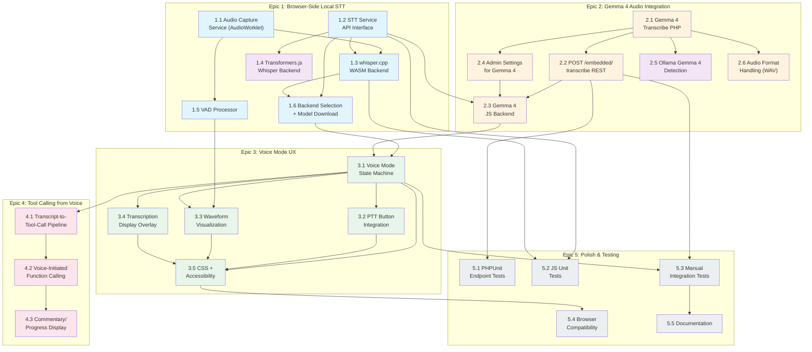

# Local Voice Embedded — Comprehensive Implementation Plan

**Status:** 📋 Implementation Plan
**Created:** June 28, 2026
**Depends on:** LOCAL-VOICE-EMBEDDED-PROPOSAL.md
**PR:** TBD

---

## Table of Contents

1. [Architecture Overview](#1-architecture-overview)
2. [Epics & Stories](#2-epics--stories)
3. [File Inventory — Create / Modify / Delete](#3-file-inventory--create--modify--delete)
4. [Detailed Implementation Tasks](#4-detailed-implementation-tasks)
5. [Database & Settings Changes](#5-database--settings-changes)
6. [REST API Specification](#6-rest-api-specification)
7. [JavaScript Module Architecture](#7-javascript-module-architecture)
8. [Testing Strategy](#8-testing-strategy)
9. [8-Week Rollout Plan](#9-8-week-rollout-plan)
10. [Story Sequencing Diagram](#10-story-sequencing-diagram)
11. [Risk Register](#11-risk-register)

---

## 1. Architecture Overview

### 1.1 Target Architecture

```
┌──────────────────────────────────────────────────────────────────────┐
│                           BROWSER                                     │
│                                                                        │
│  ┌──────────────────┐  ┌─────────────────────┐  ┌──────────────────┐ │
│  │ Chat UI          │  │ Voice Mode          │  │ Embedded /       │ │
│  │ (chat.js)        │  │ Integration         │  │ WebLLM Client    │ │
│  │                  │  │ (voice-mode-        │  │ (embedded-llm-   │ │
│  │                  │  │  embedded.js)       │  │  client.js)      │ │
│  └────────┬─────────┘  └──────────┬──────────┘  └────────┬─────────┘ │
│           │                       │                       │           │
│           │      ┌────────────────┴──────────────┐        │           │
│           │      │  STT Service API               │        │           │
│           │      │  (stt-service-api.js)          │        │           │
│           │      └─────┬──────────────┬───────────┘        │           │
│           │            │              │                    │           │
│           │   ┌────────┘              └────────┐           │           │
│           │   ▼                                ▼           ▼           │
│  ┌────────┴──────────────┐  ┌──────────────────────┐  ┌────────────┐ │
│  │ whisper.cpp WASM      │  │ Gemma 4 Server       │  │ Transfo-   │ │
│  │ Backend               │  │ Backend              │  │ rmers.js   │ │
│  │ (stt-whisper-cpp-     │  │ (stt-gemma4-         │  │ Backend    │ │
│  │  backend.js)          │  │  backend.js)         │  │            │ │
│  │         │             │  │         │            │  │            │ │
│  │  ┌──────┴──────┐      │  │  POST /mcp-ai/v1/   │  └────────────┘ │
│  │  │ whisper.cpp │      │  │  embedded/transcribe│                 │
│  │  │ WASM Worker │      │  │         │           │                 │
│  │  │ (stt-       │      │  └─────────┼───────────┘                 │
│  │  │  whisper-   │      │            │                             │
│  │  │  cpp-       │      │            │                             │
│  │  │  worker.js) │      │            │                             │
│  │  └─────────────┘      │            │                             │
│  └───────────────────────┘            │                             │
│           │                           │                             │
│  ┌────────┴───────────────┐           │                             │
│  │ AudioCaptureService    │           │                             │
│  │ (audio-capture-        │           │                             │
│  │  service.js)           │           │                             │
│  │  • AudioWorklet        │           │                             │
│  │  • STTVADProcessor     │           │                             │
│  │    (stt-vad-           │           │                             │
│  │     processor.js)      │           │                             │
│  └────────────────────────┘           │                             │
└───────────────────────────────────────┼─────────────────────────────┘
                                        │
                         POST /mcp-ai/v1/embedded/transcribe
                                        │
┌───────────────────────────────────────┼─────────────────────────────┐
│                  WORDPRESS BACKEND (PHP)                             │
│                                       ▼                              │
│  ┌───────────────────────────────────────────────────────────────┐  │
│  │              WP_MCP_AI_Embedded_Transcribe                     │  │
│  │              (addons/embedded/includes/embedded/)             │  │
│  │  • Ollama multimodal API integration                          │  │
│  │  • WAV conversion (PCM16 → WAV)                               │  │
│  │  • Audio chunk buffering                                      │  │
│  └───────────────────────────────────────────────────────────────┘  │
│                                                                      │
│  ┌───────────────────────────────────────────────────────────────┐  │
│  │  Existing Infrastructure                                       │  │
│  │  • WP_MCP_AI_Embedded_Client (llama.cpp/Ollama)                │  │
│  │  • WP_MCP_AI_REST_Chat_Controller (config endpoints)           │  │
│  │  • NV_oOS_Embedded (addon bootstrap, script registration)      │  │
│  │  • WP_MCP_AI_WebLLM_Settings_Page (admin settings pattern)     │  │
│  └───────────────────────────────────────────────────────────────┘  │
└──────────────────────────────────────────────────────────────────────┘
```

### 1.2 Integration Points with Existing Code

| Existing Component | How Voice Embedded Integrates |
|---|---|
| `chat-voice-mode-integration.js` | Add `MODE_EMBEDDED` constant; delegate to `voice-mode-embedded.js` when embedded provider is active |
| `NV_oOS_Embedded::register_embedded_scripts()` | Register 6 new voice scripts (STT service API, backends, worker, VAD, audio capture, voice mode UI) |
| `NV_oOS_Embedded::enqueue_embedded_scripts()` | Conditionally enqueue voice scripts when `enable_voice_mode` setting is on |
| `WP_MCP_AI_WebLLM_Settings_Page` | Add "Voice &amp; STT" settings section with 6 new fields |
| `WP_MCP_AI_REST_Chat_Controller` | New `POST /embedded/transcribe` and `GET /embedded/stt/config` routes in `register_routes()` |
| `WP_MCP_AI_Embedded_Client` | Reuse Ollama connectivity, model detection, GGUF listing for Gemma 4 audio models |
| `webllm-loader.js` | Add STT model loading support via `stt-model-ready` event |
| `embedded-llm-client.js` | Add `injectVoiceTranscript()` method for voice → text pipeline injection |

### 1.3 Design Decisions

| Decision | Rationale |
|---|---|
| **STT runs in Web Workers** | WASM/WebGPU inference must stay off the main thread to keep the UI responsive during transcription |
| **AudioWorklet for capture** | Real-time audio thread with guaranteed scheduling; avoids main-thread jank from `getUserMedia` polling |
| **Three backends, one interface** | Each backend (whisper.cpp WASM, Transformers.js, Gemma 4 server) implements the same `STTServiceAPI` contract → consumers don't care which backend is active |
| **Server-side Gemma 4 only** | No browser-side Gemma 4 WebGPU runtime exists yet (April 2025 model); server-assisted via Ollama REST |
| **Settings in `nvoos_embedded_settings`** | Follows existing pattern in `NV_oOS_Embedded::OPTION_KEY`; keeps embedded addon settings self-contained |
| **Transcribe endpoint on chat controller** | Reuses existing auth, permission, and REST namespace (`mcp-ai/v1`); avoids a separate controller for 2 endpoints |
| **No new database tables** | All configuration is option-based; no query-cache invalidation or schema migration needed |

---

## 2. Epics & Stories

### Epic 1: Browser-Side Local STT (6 stories)

**Goal:** Pluggable, on-device speech-to-text with zero API keys and no cloud dependency.

| # | Story | Files | Effort | Depends On |
|---|-------|-------|--------|------------|
| 1.1 | **Audio capture service with AudioWorklet** | `audio-capture-service.js` (new) | M | — |
| 1.2 | **STT service API interface contract** | `stt-service-api.js` (new) | S | — |
| 1.3 | **whisper.cpp WASM Web Worker backend** | `stt-whisper-cpp-worker.js` (new), `stt-whisper-cpp-backend.js` (new) | L | 1.1, 1.2 |
| 1.4 | **Transformers.js Whisper backend** | `stt-transformers-backend.js` (new) | M | 1.1, 1.2 |
| 1.5 | **Voice Activity Detection (VAD)** | `stt-vad-processor.js` (new) | S | 1.1 |
| 1.6 | **STT backend selection and model downloading** | `webllm-loader.js` (modify), `stt-service-api.js` (modify) | M | 1.2, 1.3 |

### Epic 2: Gemma 4 Audio Integration (6 stories)

**Goal:** Server-assisted STT via Ollama-hosted Gemma 4 for users who want higher accuracy or don't want browser-side model downloads.

| # | Story | Files | Effort | Depends On |
|---|-------|-------|--------|------------|
| 2.1 | **Gemma 4 transcribe PHP class** | `class-wp-mcp-ai-embedded-transcribe.php` (new) | M | — |
| 2.2 | **POST /embedded/transcribe REST endpoint** | `class-wp-mcp-ai-rest-chat-controller.php` (modify) | M | 2.1 |
| 2.3 | **Gemma 4 JS backend (browser-side REST calls)** | `stt-gemma4-backend.js` (new) | M | 1.2, 2.2 |
| 2.4 | **Admin settings for Gemma 4 audio** | `class-wp-mcp-ai-webllm-settings-page.php` (modify) | S | 2.1 |
| 2.5 | **Ollama/vLLM Gemma 4 detection in provider diagnostics** | `class-wp-mcp-ai-embedded-transcribe.php` (modify) | S | 2.1 |
| 2.6 | **Gemma 4 audio format handling** | `class-wp-mcp-ai-embedded-transcribe.php` (modify) | M | 2.1 |

### Epic 3: Voice Mode UX — PR #5479 Parity (5 stories)

**Goal:** Full voice UI for embedded assistants that matches the cloud voice experience.

| # | Story | Files | Effort | Depends On |
|---|-------|-------|--------|------------|
| 3.1 | **Voice mode state machine for embedded** | `voice-mode-embedded.js` (new) | L | 1.2, 1.3 |
| 3.2 | **Push-to-Talk button integration** | `voice-mode-embedded.js` (modify) | S | 3.1 |
| 3.3 | **Waveform visualization** | `voice-mode-embedded.js` (modify) | M | 3.1, 1.5 |
| 3.4 | **Transcription display overlay** | `voice-mode-embedded.js` (modify) | S | 3.1 |
| 3.5 | **Voice mode CSS and accessibility** | `voice-embedded.css` (new) | M | 3.1–3.4 |

### Epic 4: Tool Calling from Voice (3 stories)

**Goal:** Transcript-to-tool-call pipeline enables voice-initiated function calling via WebLLM.

| # | Story | Files | Effort | Depends On |
|---|-------|-------|--------|------------|
| 4.1 | **Transcript-to-tool-call pipeline** | `embedded-llm-client.js` (modify) | M | 1.6, 3.1 |
| 4.2 | **Voice-initiated function calling via WebLLM** | `webllm-function-calling-client.js` (modify) | M | 4.1 |
| 4.3 | **Commentary/progress during voice tool execution** | `voice-mode-embedded.js` (modify) | S | 4.1, 4.2 |

### Epic 5: Polish, Documentation & Testing (5 stories)

**Goal:** Production-quality tests, docs, and cross-browser validation.

| # | Story | Files | Effort | Depends On |
|---|-------|-------|--------|------------|
| 5.1 | **PHPUnit tests for transcribe endpoint** | `test-embedded-transcribe-endpoint.php` (new) | M | 2.2 |
| 5.2 | **JS unit tests for STT service and worker** | `stt-service-api.test.js` (new), `stt-whisper-cpp-worker.test.js` (new) | M | 1.2, 1.3 |
| 5.3 | **Manual integration test plan** | `LOCAL-VOICE-EMBEDDED-IMPLEMENTATION-PLAN.md` (this doc, §8.3) | S | All Epics 1–4 |
| 5.4 | **Browser compatibility testing matrix** | `LOCAL-VOICE-EMBEDDED-IMPLEMENTATION-PLAN.md` (this doc, §8.4) | M | All Epics 1–4 |
| 5.5 | **Documentation** | New docs in `docs/features/`, `README.md` updates | M | All Epics 1–4 |

---

## 3. File Inventory — Create / Modify / Delete

### 3.1 New Files (13)

| # | File Path | Purpose | Tier | Story |
|---|-----------|---------|------|-------|
| 1 | `addons/embedded/assets/js/stt-service-api.js` | Abstract STT service interface contract (JS) — mirrors `interface-wp-mcp-ai-voice-provider.php` pattern | Base | 1.2 |
| 2 | `addons/embedded/assets/js/stt-whisper-cpp-worker.js` | Web Worker loading whisper.cpp WASM from CDN; receives `Float32Array` audio via `postMessage`; returns transcription text | Base | 1.3 |
| 3 | `addons/embedded/assets/js/stt-whisper-cpp-backend.js` | Browser-side wrapper implementing STT service API; manages whisper.cpp Worker lifecycle (init, transcribe, dispose) | Base | 1.3 |
| 4 | `addons/embedded/assets/js/stt-gemma4-backend.js` | Browser client implementing STT service API; sends audio to `POST /embedded/transcribe` REST endpoint | Addon | 2.3 |
| 5 | `addons/embedded/assets/js/stt-transformers-backend.js` | Transformers.js Whisper backend implementing STT service API; WebGPU-accelerated, WASM fallback | Base | 1.4 |
| 6 | `addons/embedded/assets/js/voice-mode-embedded.js` | Voice mode UI state machine for embedded assistants — mirrors `chat-voice-mode-integration.js` patterns (modes, PTT, waveform, transcription overlay) | Addon | 3.1 |
| 7 | `addons/embedded/assets/js/audio-capture-service.js` | AudioWorklet-based microphone capture; 16kHz mono PCM output; feeds STT pipeline | Base | 1.1 |
| 8 | `addons/embedded/assets/js/stt-vad-processor.js` | Simple energy-based Voice Activity Detection; computes RMS on audio chunks; emits `speech-start`/`speech-end` events | Base | 1.5 |
| 9 | `addons/embedded/assets/css/voice-embedded.css` | Voice UI styles (status bar, PTT button, waveform, transcription overlay, mode toggle) | Addon | 3.5 |
| 10 | `addons/embedded/includes/embedded/class-wp-mcp-ai-embedded-transcribe.php` | Server-side Gemma 4 transcribe handler: WAV conversion, Ollama multimodal API calls, model availability check | Addon | 2.1 |
| 11 | `addons/embedded/tests/php/test-embedded-transcribe-endpoint.php` | PHPUnit tests for transcribe endpoint: auth, validation, success/error responses, capability checks | Addon | 5.1 |
| 12 | `addons/embedded/tests/js/stt-service-api.test.js` | JS unit tests for STT service API contract, backend registration, selection logic | Addon | 5.2 |
| 13 | `addons/embedded/tests/js/stt-whisper-cpp-worker.test.js` | JS unit tests for whisper.cpp worker: message protocol, error handling, teardown | Addon | 5.2 |

### 3.2 Modified Files (8)

| # | File Path | Change Summary | Scope | Story |
|---|-----------|---------------|-------|-------|
| 1 | `addons/embedded/includes/class-nvoos-embedded.php` | Register 6 new voice scripts in `register_embedded_scripts()`; conditionally enqueue in `enqueue_embedded_scripts()`; add `get_stt_config()` filter for `wp_mcp_ai_embedded_client_config` | ~80 lines | 1.6, 2.2, 3.1 |
| 2 | `addons/embedded/includes/admin/class-wp-mcp-ai-webllm-settings-page.php` | Add "Voice &amp; STT" settings section with 6 fields: `stt_backend`, `stt_model`, `enable_voice_mode`, `vad_threshold`, `gemma4_audio_endpoint`, `gemma4_audio_model` | ~100 lines | 2.4 |
| 3 | `addons/embedded/nvoos-embedded.php` | Load new `class-wp-mcp-ai-embedded-transcribe.php` | ~5 lines | 2.1 |
| 4 | `addons/embedded/assets/js/embedded-llm-client.js` | Add `injectVoiceTranscript(text)` method for voice → text pipeline injection | ~30 lines | 4.1 |
| 5 | `includes/admin/class-wp-mcp-ai-admin-settings-base.php` | Add voice STT backend setting defaults in `get_default_settings()` | ~10 lines | 2.4 |
| 6 | `assets/js/chat-voice-mode-integration.js` | Add `MODE_EMBEDDED` constant; delegate to `voice-mode-embedded.js` when embedded provider is active; add embedded voice mode to `cycleMode()` | ~40 lines | 3.1 |
| 7 | `includes/rest/class-wp-mcp-ai-rest-chat-controller.php` | Register `POST /embedded/transcribe` and `GET /embedded/stt/config` routes in `register_routes()`; add `handle_embedded_transcribe()` and `handle_stt_config()` methods | ~120 lines | 2.2 |
| 8 | `addons/embedded/assets/js/webllm-loader.js` | Add STT model loading support: `stt-model-ready` event dispatch after whisper.cpp WASM download | ~30 lines | 1.6 |

### 3.3 Deleted Files

None. All existing paths and functionality are preserved; voice embedded is purely additive.

---

## 4. Detailed Implementation Tasks

### 4.1 Epic 1 — Browser-Side Local STT

#### Story 1.1: Audio capture service with AudioWorklet

**File:** `addons/embedded/assets/js/audio-capture-service.js` (new)

```javascript
// AudioCaptureService — global singleton exposed as window.NVoOSAudioCapture.

/**
 * @typedef {Object} AudioCaptureConfig
 * @property {number} sampleRate - Target sample rate (default: 16000)
 * @property {number} channelCount - Number of channels (default: 1, mono)
 * @property {number} chunkDurationMs - Audio chunk duration in ms (default: 100)
 * @property {Function} onChunk - Callback receiving Float32Array chunk
 * @property {Function} onError - Callback receiving Error
 * @property {Function} onStateChange - Callback receiving 'idle'|'capturing'|'error'
 */

const AudioCaptureService = {
  audioContext: null,
  mediaStream: null,
  workletNode: null,
  state: 'idle',
  chunkBuffer: new Float32Array(0),

  /**
   * @param {AudioCaptureConfig} config
   * @returns {Promise<void>}
   */
  async start(config) {
    // 1. navigator.mediaDevices.getUserMedia({ audio: { sampleRate: 16000, channelCount: 1 } })
    // 2. Create AudioContext at 16000 Hz
    // 3. audioContext.audioWorklet.addModule('stt-vad-processor.js')
    // 4. Create AudioWorkletNode('stt-vad-processor')
    // 5. Connect MediaStreamSource → AudioWorkletNode
    // 6. workletNode.port.onmessage = handle audio chunks + VAD events
    // 7. Fire config.onChunk with Float32Array every config.chunkDurationMs
    // 8. Handle VAD events: 'speech-start', 'speech-end'
  },

  /**
   * @returns {Promise<void>}
   */
  async stop() {
    // 1. Disconnect workletNode
    // 2. Stop media tracks
    // 3. Close audioContext
    // 4. Reset buffer, state = 'idle'
  },

  /**
   * @returns {'idle'|'capturing'|'error'}
   */
  getState() { return this.state; },

  /**
   * @returns {boolean}
   */
  static isSupported() {
    // Check: MediaDevices API, AudioContext, AudioWorklet support
    return !!(navigator.mediaDevices?.getUserMedia && window.AudioContext);
  }
};
```

**Implementation checklist:**
- [ ] `getUserMedia` with `{ audio: { sampleRate: 16000, channelCount: 1, echoCancellation: true, noiseSuppression: true } }`
- [ ] `AudioContext` created with `sampleRate: 16000`
- [ ] `audioWorklet.addModule()` loads processor from the same embedded JS directory
- [ ] Downsampling logic if browser returns a different sample rate
- [ ] `onChunk` fires every ~100ms with accumulated `Float32Array`
- [ ] `onError` fires on permission denial, device not found, context suspension
- [ ] State transitions: `idle` → `capturing` → `idle`; `idle` → `error`
- [ ] Cleanup on `stop()`: tracks stopped, context closed, worklet disconnected
- [ ] Browser detection: graceful message instead of crash on unsupported browsers
- [ ] Fallback to `ScriptProcessorNode` if AudioWorklet unavailable (Safari < 14.1), with deprecation warning

#### Story 1.2: STT service API interface contract

**File:** `addons/embedded/assets/js/stt-service-api.js` (new)

```javascript
// STT Service API — all STT backends implement this contract.

/**
 * @typedef {Object} STTConfig
 * @property {string} model - Model identifier (e.g. 'tiny.en')
 * @property {string} language - ISO 639-1 language code (default: 'en')
 * @property {number} vadThreshold - VAD sensitivity 0.0-1.0 (default: 0.3)
 * @property {number} sampleRate - Audio sample rate (default: 16000)
 * @property {Function} onProgress - Callback(percent) for model download
 */

/**
 * @typedef {Object} STTResult
 * @property {string} text - Transcribed text
 * @property {boolean} isFinal - True for final result
 * @property {number} confidence - 0.0-1.0
 * @property {number} latencyMs - Processing latency
 */

const STTServiceAPI = {
  /**
   * Backend registry: slug → { factory, label, requiresServer, requiresWebGPU }
   */
  _backends: {},

  /** Active backend instance. */
  _active: null,

  /** Active backend slug. */
  _activeSlug: null,

  /**
   * Register a backend.
   * @param {string} slug
   * @param {Object} factory - { create: () => STTBackendInstance }
   */
  registerBackend(slug, factory) {},

  /**
   * Initialize the active backend.
   * @param {string} slug - Backend slug to activate
   * @param {STTConfig} config
   * @returns {Promise<void>}
   */
  async initialize(slug, config) {},

  /**
   * Transcribe a complete audio buffer.
   * @param {Float32Array} audioBuffer - 16kHz mono PCM
   * @returns {Promise<STTResult>}
   */
  async transcribe(audioBuffer) {},

  /**
   * Start streaming transcription.
   * @returns {AsyncIterator<STTResult>}
   */
  streamStart() {},

  /**
   * Push audio chunk for streaming.
   * @param {Float32Array} chunk
   */
  pushAudio(chunk) {},

  /**
   * Signal end of audio stream.
   * @returns {Promise<STTResult>}
   */
  async streamEnd() {},

  /**
   * Check if a backend is available.
   * @param {string} slug
   * @returns {Promise<boolean>}
   */
  async isAvailable(slug) {},

  /**
   * Get list of available backend slugs.
   * @returns {Promise<string[]>}
   */
  async getAvailableBackends() {},

  /**
   * Release resources for active backend.
   * @returns {Promise<void>}
   */
  async dispose() {}
};

// Each backend instance must implement:
//   async initialize(config) → void
//   async transcribe(audioBuffer) → STTResult
//   async streamStart() → AsyncIterator<STTResult>
//   pushAudio(chunk) → void
//   async streamEnd() → STTResult
//   async isAvailable() → boolean
//   getLatency() → number
//   async dispose() → void
```

**Implementation checklist:**
- [ ] `registerBackend` stores factory under slug; emits warning on duplicate registration
- [ ] `initialize` calls `backend.initialize(config)`; manages `_active` and `_activeSlug`
- [ ] `transcribe` delegates to `_active.transcribe(audioBuffer)`
- [ ] `streamStart` / `pushAudio` / `streamEnd` delegate to active backend
- [ ] `isAvailable` queries specific backend's `isAvailable()`
- [ ] `getAvailableBackends` iterates registry, filters by `isAvailable()`, returns slugs
- [ ] `dispose` calls `_active.dispose()` and nulls `_active`
- [ ] All methods throw if no active backend is set
- [ ] Expose as `window.NVoOSSTTService`

#### Story 1.3: whisper.cpp WASM Web Worker backend

**File:** `addons/embedded/assets/js/stt-whisper-cpp-worker.js` (new)

```javascript
// Web Worker — loads whisper.cpp WASM from CDN, handles transcription.

let whisperModule = null;
let whisperContext = null;

self.onmessage = async function (event) {
  const { type, payload } = event.data;
  switch (type) {
    case 'init':
      // 1. importScripts or fetch whisper.cpp WASM from CDN
      // 2. Instantiate whisper.cpp module
      // 3. Create whisper context with model path
      // 4. self.postMessage({ type: 'ready' })
      break;
    case 'transcribe':
      // 1. Run whisper_full() with audio buffer
      // 2. Extract text segments
      // 3. self.postMessage({ type: 'result', payload: { text, confidence, latencyMs } })
      break;
    case 'stream_start':
      // Begin streaming context
      break;
    case 'stream_chunk':
      // Process partial audio
      break;
    case 'stream_end':
      // Finalize and return result
      break;
    case 'dispose':
      // 1. whisper_free(context)
      // 2. self.close()
      break;
  }
};

self.onerror = function (error) {
  self.postMessage({ type: 'error', payload: { message: error.message } });
};
```

**File:** `addons/embedded/assets/js/stt-whisper-cpp-backend.js` (new)

```javascript
// Browser-side wrapper implementing STT service API for whisper.cpp WASM.

const WhisperCppBackend = {
  worker: null,
  config: null,
  ready: false,

  async initialize(config) {
    // 1. Create Worker from stt-whisper-cpp-worker.js
    // 2. Set up message handler for 'ready', 'result', 'error'
    // 3. Post 'init' with model path, language, sample rate
    // 4. Wait for 'ready' response
  },

  async transcribe(audioBuffer) {
    // Send audio + wait for result
  },

  async isAvailable() {
    // Check: WebAssembly support, SharedArrayBuffer (optional), Worker support
    return (typeof WebAssembly === 'object' && typeof Worker === 'function');
  },

  async dispose() {
    // Post 'dispose' to worker; terminate
  }
};
```

**Implementation checklist:**
- [ ] Worker script loads whisper.cpp WASM from CDN (jsDelivr unpkg, version-pinned URL)
- [ ] CDN URL pattern: `https://cdn.jsdelivr.net/npm/whisper.cpp@X.Y.Z/dist/whisper.wasm`
- [ ] Worker message protocol: `{ type: 'init'|'transcribe'|'stream_start'|'stream_chunk'|'stream_end'|'dispose', payload }`
- [ ] Model download progress relayed via `postMessage({ type: 'progress', payload: { percent } })`
- [ ] Model path uses IndexedDB cache (first download from CDN, then serve from cache)
- [ ] Fallback: `tiny.en` model (~75 MB) loaded by default; user can select `base.en` (~142 MB) in admin
- [ ] Worker handles `SharedArrayBuffer` for zero-copy audio transfer; falls back to structured cloning
- [ ] Proper error handling: CDN failure, WASM compilation error, OOM, invalid audio format
- [ ] Teardown: `whisper_free()`, `self.close()` on dispose
- [ ] Benchmark: target < 500ms for 3-second utterance on modern CPU

#### Story 1.4: Transformers.js Whisper backend

**File:** `addons/embedded/assets/js/stt-transformers-backend.js` (new)

**Implementation checklist:**
- [ ] Implements STT service API identically to whisper.cpp backend
- [ ] Uses existing `transformers-tasks-client.js` CDN source; extends pipeline registry with `automatic-speech-recognition` task
- [ ] Creates Web Worker for non-blocking inference (separate Worker scope prevents pipeline cache conflicts)
- [ ] WebGPU acceleration when available (Chrome 113+, Edge 113+); automatic WASM fallback
- [ ] Models loaded from Hugging Face CDN; same model selection as whisper.cpp (`whisper-tiny`, `whisper-base`, `whisper-small`)
- [ ] `isAvailable()` checks: WebGPU support OR WASM SIMD support
- [ ] Shared CDN cache with existing transformers.js models (avoids duplicate downloads)
- [ ] Reports availability as `{ available: false, reason: 'WebGPU not available' }` to STT config endpoint

#### Story 1.5: Voice Activity Detection (VAD)

**File:** `addons/embedded/assets/js/stt-vad-processor.js` (new)

```javascript
// AudioWorkletProcessor — energy-based VAD.

class STTVADProcessor extends AudioWorkletProcessor {
  constructor(options) {
    super();
    this.threshold = options.processorOptions?.threshold || 0.3;
    this.silenceDurationMs = options.processorOptions?.silenceDurationMs || 800;
    // RMS energy tracking
    this.isSpeaking = false;
    this.silenceStart = 0;
  }

  process(inputs, outputs, parameters) {
    const input = inputs[0];
    if (!input?.length) return true;
    const channel = input[0];
    // 1. Compute RMS energy: sqrt(mean(x²))
    // 2. RMS > threshold → speaking; RMS ≤ threshold → silence
    // 3. Speaking → silence transition after silenceDurationMs → post 'speech-end'
    // 4. Silence → speaking transition → post 'speech-start'
    // 5. Pass through audio always (VAD only controls events, not audio muting)
    return true; // Keep processor alive
  }
}

registerProcessor('stt-vad-processor', STTVADProcessor);
```

**Implementation checklist:**
- [ ] Energy-based RMS computation per audio chunk (128–256 samples per process call)
- [ ] Hysteresis: 3 consecutive frames below threshold before `speech-end` to avoid flickering
- [ ] Silence duration customizable via `silenceDurationMs` (default 800ms)
- [ ] Posts messages to main thread: `{ type: 'speech-start' }`, `{ type: 'speech-end' }`, `{ type: 'audio-chunk', payload: Float32Array }`
- [ ] Works entirely in AudioWorklet thread; no main-thread polling
- [ ] Configurable `vadThreshold` (0.0–1.0) from admin settings; passed via `processorOptions`
- [ ] Noise floor calibration: first 500ms of capture used to establish baseline noise level

#### Story 1.6: STT backend selection and model downloading

**Files modified:** `webllm-loader.js`, `stt-service-api.js`

**Implementation checklist:**
- [ ] `webllm-loader.js` extended with `loadSTTModel()` function
- [ ] Model download progress events: `stt-model-download-progress` with `{ percent, backend, model }`
- [ ] `stt-model-ready` event dispatched when model fully loaded into Worker
- [ ] `stt-model-error` event dispatched on download failure with `{ error, suggestions }`
- [ ] `STTServiceAPI.initialize(slug, config)` orchestrates backend selection flow:
  1. Check `isAvailable(slug)`
  2. If unavailable, try next preferred backend
  3. If available, call `backend.initialize(config)` and wait for model download
  4. Fire progress events
- [ ] Backend selection priority from `nvoos_embedded_settings.stt_backend`
- [ ] Fallback chain: whisper_wasm → gemma4_server → transformers_whisper → none (error)
- [ ] Never silently fall back to a different backend than what the user configured; show explicit notification

### 4.2 Epic 2 — Gemma 4 Audio Integration

#### Story 2.1: Gemma 4 transcribe PHP class

**File:** `addons/embedded/includes/embedded/class-wp-mcp-ai-embedded-transcribe.php` (new)

```php
/**
 * Server-side Gemma 4 audio transcription handler.
 *
 * Accepts PCM16 audio data, converts to WAV, and sends to Ollama
 * multimodal API with a Gemma 4 E2B/E4B model.
 *
 * @package NV_oOS_Embedded
 * @since   0.2.0
 */
class WP_MCP_AI_Embedded_Transcribe {

    const DEFAULT_MODEL = 'gemma4:12b';
    const MAX_AUDIO_BYTES = 5 * 1024 * 1024; // 5 MB
    const DEFAULT_TIMEOUT = 30; // seconds

    /**
     * Transcribe audio using Gemma 4 via Ollama multimodal API.
     *
     * @param string $base64_audio Base64-encoded PCM16 audio data.
     * @param array  $options      Optional overrides (model, language, timeout).
     * @return array|WP_Error      Transcription result or error.
     */
    public function transcribe( $base64_audio, $options = array() ) {
        $model    = $options['model'] ?? self::DEFAULT_MODEL;
        $language = $options['language'] ?? 'en';
        $timeout  = absint( $options['timeout'] ?? self::DEFAULT_TIMEOUT );

        // 1. Validate input: base64 decode, check size
        // 2. Convert PCM16 to WAV format (44-byte header + data)
        // 3. Call Ollama /api/chat with multimodal audio input
        //    {
        //      "model": "gemma4:12b",
        //      "messages": [{
        //        "role": "user",
        //        "content": "Transcribe this audio to text. Return only the transcription.",
        //        "images": ["<base64-wav>"]
        //      }],
        //      "stream": false
        //    }
        // 4. Parse response, extract transcription text
        // 5. Return { success, text, confidence, latency_ms }
    }

    /**
     * Check if a Gemma 4 model is available via Ollama.
     *
     * @param string $model Model slug to check.
     * @return bool
     */
    public function is_model_available( $model = '' ) {}

    /**
     * Convert raw PCM16 samples to a WAV byte string.
     *
     * @param string $pcm_data Raw PCM16 bytes.
     * @param int    $sample_rate Sample rate in Hz.
     * @return string WAV file bytes.
     */
    private function pcm_to_wav( $pcm_data, $sample_rate = 16000 ) {}
}
```

**Implementation checklist:**
- [ ] WAV conversion: 44-byte RIFF header + PCM16 data (chunk size, byte rate calculated from `sample_rate`)
- [ ] Ollama endpoint URL from `nvoos_embedded_settings.gemma4_audio_endpoint` (default `http://localhost:11434`)
- [ ] HTTP request via `wp_remote_post()` with `timeout` parameter
- [ ] `is_model_available()` queries Ollama `/api/tags` and checks for gemma4 model presence
- [ ] Max audio size enforcement: rejects audio > 5 MB with `WP_Error('audio_too_large')`
- [ ] Language code appended to transcription system prompt (e.g., "Transcribe to English")
- [ ] Timing: `microtime(true)` before/after to measure `latency_ms`
- [ ] Error taxonomy: `model_not_found`, `ollama_unreachable`, `audio_decode_error`, `transcription_failed`, `audio_too_large`, `timeout`

#### Story 2.2: POST /embedded/transcribe REST endpoint

**File modified:** `includes/rest/class-wp-mcp-ai-rest-chat-controller.php`

**New routes in `register_routes()`:**

```php
// POST /embedded/transcribe — Server-assisted STT via Gemma 4.
register_rest_route(
    self::REST_NAMESPACE,
    '/embedded/transcribe',
    array(
        'methods'             => WP_REST_Server::CREATABLE,
        'permission_callback' => array( $this, 'permissions_check' ),
        'callback'            => array( $this, 'handle_embedded_transcribe' ),
        'args'                => array(
            'audio'        => array(
                'description'       => __( 'Base64-encoded WAV or PCM16 audio data.', 'mcp-ai-wpoos' ),
                'type'              => 'string',
                'required'          => true,
                'sanitize_callback' => function ( $value ) { return $value; }, // Raw base64, validate in handler.
            ),
            'model'        => array(
                'description'       => __( 'Gemma 4 model to use for transcription.', 'mcp-ai-wpoos' ),
                'type'              => 'string',
                'required'          => false,
                'sanitize_callback' => 'sanitize_text_field',
                'default'           => 'gemma4:12b',
            ),
            'language'     => array(
                'description'       => __( 'ISO 639-1 language code.', 'mcp-ai-wpoos' ),
                'type'              => 'string',
                'required'          => false,
                'sanitize_callback' => 'sanitize_text_field',
                'default'           => 'en',
            ),
            'assistant_id' => array(
                'description'       => __( 'Assistant ID for context.', 'mcp-ai-wpoos' ),
                'type'              => 'integer',
                'required'          => false,
                'sanitize_callback' => 'absint',
            ),
        ),
    )
);

// GET /embedded/stt/config — STT configuration for browser client.
register_rest_route(
    self::REST_NAMESPACE,
    '/embedded/stt/config',
    array(
        'methods'             => WP_REST_Server::READABLE,
        'permission_callback' => array( $this, 'permissions_check' ),
        'callback'            => array( $this, 'handle_stt_config' ),
    )
);
```

**Implementation checklist:**
- [ ] `handle_embedded_transcribe()`:
  - [ ] Validate audio is valid base64 and under 5 MB
  - [ ] Check capability: `current_user_can( 'edit_posts' )` minimum
  - [ ] Instantiate `WP_MCP_AI_Embedded_Transcribe`
  - [ ] Call `transcribe()` with decoded options
  - [ ] Return `rest_ensure_response()` with success/error envelope
- [ ] `handle_stt_config()`:
  - [ ] Return available backends with availability flags
  - [ ] Include models, default model, license info per backend
  - [ ] Return active backend from settings
- [ ] Both routes use existing `permissions_check()` (nonce, bearer token, guest token)
- [ ] Rate limiting: track transcribe requests per user per minute (leverage existing rate limiter)

#### Story 2.3: Gemma 4 JS backend (browser-side REST calls)

**File:** `addons/embedded/assets/js/stt-gemma4-backend.js` (new)

**Implementation checklist:**
- [ ] Implements STT service API identically to whisper.cpp backend
- [ ] `initialize(config)`: validates endpoint reachable via `GET /embedded/stt/config`
- [ ] `transcribe(audioBuffer)`: converts Float32Array → base64 WAV, POSTs to `/embedded/transcribe`
- [ ] Includes `X-WP-Nonce` header for same-origin auth
- [ ] Includes `assistant_id` from config in request body
- [ ] Handles network errors, HTTP errors, server errors with typed error codes
- [ ] `isAvailable()`: checks if `gemma4_server` backend is configured (non-empty `gemma4_audio_endpoint` option)
- [ ] `getLatency()`: returns `latency_ms` from last server response; falls back to network RTT estimate
- [ ] Streaming mode: `streamStart()` fetches config; `pushAudio()` accumulates; `streamEnd()` sends single POST (server-side Gemma 4 doesn't support true streaming yet)
- [ ] Displays "Using server-assisted STT" in the status bar

#### Story 2.4: Admin settings for Gemma 4 audio

**File modified:** `addons/embedded/includes/admin/class-wp-mcp-ai-webllm-settings-page.php`

**New settings section:** "Voice &amp; Speech-to-Text"

**New settings fields:**

| Field Key | Type | Default | Render Method |
|---|---|---|---|
| `stt_backend` | `string` (select) | `whisper_cpp_wasm` | `render_stt_backend_field()` — radio/select: whisper_cpp_wasm, gemma4_server, transformers_whisper |
| `stt_model` | `string` (select) | `tiny.en` | `render_stt_model_field()` — select: tiny.en, base.en, small.en |
| `enable_voice_mode` | `bool` (checkbox) | `false` | `render_enable_voice_mode_field()` |
| `vad_threshold` | `float` (range) | `0.3` | `render_vad_threshold_field()` — range slider 0.0–1.0, step 0.05 |
| `gemma4_audio_endpoint` | `string` (url) | `''` | `render_gemma4_audio_endpoint_field()` — text input, placeholder `http://localhost:11434` |
| `gemma4_audio_model` | `string` (select) | `gemma4:12b` | `render_gemma4_audio_model_field()` — select: gemma4:12b, gemma4:9b, gemma4:27b |

**`get_default_settings()` additions:**
```php
'stt_backend'           => 'whisper_cpp_wasm',
'stt_model'             => 'tiny.en',
'enable_voice_mode'     => false,
'vad_threshold'         => 0.3,
'gemma4_audio_endpoint' => '',
'gemma4_audio_model'    => 'gemma4:12b',
```

**`sanitize_settings()` additions:**
```php
$sanitized['stt_backend']           = sanitize_text_field( $input['stt_backend'] ?? 'whisper_cpp_wasm' );
$sanitized['stt_model']             = sanitize_text_field( $input['stt_model'] ?? 'tiny.en' );
$sanitized['enable_voice_mode']     = ! empty( $input['enable_voice_mode'] );
$sanitized['vad_threshold']         = (float) max( 0.0, min( 1.0, (float) ( $input['vad_threshold'] ?? 0.3 ) ) );
$sanitized['gemma4_audio_endpoint'] = esc_url_raw( $input['gemma4_audio_endpoint'] ?? '' );
$sanitized['gemma4_audio_model']    = sanitize_text_field( $input['gemma4_audio_model'] ?? 'gemma4:12b' );

// Validate STT backend enum.
$allowed_backends = array( 'whisper_cpp_wasm', 'gemma4_server', 'transformers_whisper' );
if ( ! in_array( $sanitized['stt_backend'], $allowed_backends, true ) ) {
    $sanitized['stt_backend'] = 'whisper_cpp_wasm';
}

// Validate STT model enum.
$allowed_models = array( 'tiny.en', 'base.en', 'small.en', 'medium.en' );
if ( ! in_array( $sanitized['stt_model'], $allowed_models, true ) ) {
    $sanitized['stt_model'] = 'tiny.en';
}
```

**Implementation checklist:**
- [ ] New `add_settings_section( 'webllm_voice_stt', 'Voice & Speech-to-Text', ...)` in `register_settings()`
- [ ] Each field registered via `add_settings_field()` with render method
- [ ] Settings section renders only when Embedded provider is configured as a model source
- [ ] `stt_backend` radio buttons with descriptions: "whisper.cpp WASM — runs entirely in your browser (MIT, ~75MB)", "Gemma 4 Server — server-assisted via Ollama (self-hosted)", "Transformers.js Whisper — WebGPU accelerated (Apache 2.0)"
- [ ] `stt_model` select conditionally shows relevant models per backend:
  - whisper_wasm: tiny.en, base.en, small.en, medium.en
  - transformers_whisper: whisper-tiny, whisper-base, whisper-small
  - gemma4_server: gemma4:9b, gemma4:12b, gemma4:27b
- [ ] `gemma4_audio_endpoint` only visible when `stt_backend` is `gemma4_server` (JS toggle)
- [ ] `gemma4_audio_model` only visible when `stt_backend` is `gemma4_server` (JS toggle)
- [ ] "Test Connection" button for `gemma4_audio_endpoint` — AJAX call to `/mcp-ai/v1/embedded/stt/config`
- [ ] Inline description for `vad_threshold`: "Lower values make VAD more sensitive (0.1 = whisper detection); higher values require louder speech (0.7 = noisy environments)"

#### Story 2.5: Ollama/vLLM Gemma 4 detection in provider diagnostics

**File modified:** `class-wp-mcp-ai-embedded-transcribe.php`

**Implementation checklist:**
- [ ] `is_model_available()` queries Ollama `/api/tags` endpoint
- [ ] Parses JSON response, checks for model slug in `models[].name`
- [ ] Caches result in a transient (`nvoos_embedded_gemma4_models`, 5-minute TTL) to avoid per-request polling
- [ ] Admin notice: shows warning when `gemma4_server` backend is selected but model not found
- [ ] Provider diagnostics integration: adds Gemma 4 availability to the existing provider health check
- [ ] `GET /embedded/stt/config` response includes `gemma4_server.available` based on this check

#### Story 2.6: Gemma 4 audio format handling (WAV conversion, chunking)

**File modified:** `class-wp-mcp-ai-embedded-transcribe.php`

**Implementation checklist:**
- [ ] `pcm_to_wav()`: constructs valid WAV header
  - [ ] "RIFF" chunk descriptor
  - [ ] "fmt " sub-chunk: PCM format (1), 1 channel, sample_rate, byte_rate, block_align, bits_per_sample (16)
  - [ ] "data" sub-chunk: raw PCM bytes
- [ ] Accepts both raw PCM16 and pre-encoded WAV (detect WAV header "RIFF" magic bytes; skip header construction if present)
- [ ] Audio resampling: if source is not 16kHz mono, resample to 16kHz using linear interpolation
- [ ] Chunking for large audio: if audio > 2 MB, split into 30-second segments, transcribe each, concatenate results
- [ ] Silence padding: add 200ms of silence at start/end to prevent clipping

### 4.3 Epic 3 — Voice Mode UX

#### Story 3.1: Voice mode state machine for embedded

**File:** `addons/embedded/assets/js/voice-mode-embedded.js` (new)

This file mirrors `chat-voice-mode-integration.js` but is specialized for the embedded/WebLLM context. It shares the same mode system but uses local STT instead of cloud STT.

**State machine:**

```
MODE_TEXT ──→ MODE_EMBEDDED (local STT active)
MODE_EMBEDDED ──→ MODE_TEXT (voice off)
```

**Implementation checklist:**
- [ ] Expose as `window.NVoOSVoiceModeEmbedded` (follows `wpMcpAiVoiceMode` pattern)
- [ ] `init(instanceKey, state, container, options)` — mirrors `chat-voice-mode-integration.js:init()`
- [ ] Modes: `MODE_TEXT = 'off'`, `MODE_EMBEDDED = 'embedded'`
- [ ] On `MODE_EMBEDDED` entry:
  1. Call `STTServiceAPI.initialize(activeBackend, config)`
  2. Start `AudioCaptureService`
  3. Enable VAD
  4. Show PTT button, waveform, status bar
- [ ] On `MODE_TEXT` entry:
  1. Stop AudioCaptureService
  2. Dispose STTServiceAPI
  3. Hide voice UI elements
- [ ] `cycleMode()` toggles between MODE_TEXT and MODE_EMBEDDED
- [ ] `setMode(mode, silent)` updates UI, container class, toggle button
- [ ] `bindEvents()`: mode toggle click, PTT mousedown/mouseup/touch, end call click
- [ ] Status bar: shows backend name + model, recording state, processing state

#### Story 3.2: Push-to-Talk button integration

**Implementation checklist:**
- [ ] PTT button HTML: `<button class="wp-mcp-ai-chat__voice-ptt wp-mcp-ai-chat__voice-ptt--embedded">Hold to Talk</button>`
- [ ] `mousedown` / `touchstart`: `AudioCaptureService.start()` → start VAD → begin buffering audio
- [ ] `mouseup` / `touchend` / `mouseleave`: `AudioCaptureService.stop()` → flush buffer → `STTServiceAPI.transcribe()` → inject transcript into chat input
- [ ] Visual feedback: button background changes during recording (`--recording` class), shows animation
- [ ] Keyboard shortcut: `Ctrl+Space` or `Alt+V` toggles PTT (configurable)
- [ ] ARIA: `aria-pressed="true/false"`, `aria-label="Hold to talk (Ctrl+Space)"`
- [ ] Mobile support: `touchstart`/`touchend` with `e.preventDefault()` to prevent zoom

#### Story 3.3: Waveform visualization

**Implementation checklist:**
- [ ] Canvas-based waveform: `<canvas>` element 400×48 pixels
- [ ] Uses `requestAnimationFrame` loop at ~30fps
- [ ] Draws RMS amplitude as vertical bars (bar count = 60, color = accent CSS variable)
- [ ] Audio data sourced from `AudioCaptureService` VAD processor's amplitude output
- [ ] Smoothing: exponential moving average (α = 0.3) between frames to avoid jitter
- [ ] Visual states: idle (flat line), recording (animated bars), processing (pulsing dots)
- [ ] Performance: canvas cleared and redrawn each frame; bar count kept at 60 to stay under 1ms paint
- [ ] Matches `chat-voice-mode-integration.js` waveform style for visual consistency

#### Story 3.4: Transcription display overlay

**Implementation checklist:**
- [ ] Transcription div: `<div class="wp-mcp-ai-chat__voice-transcription" aria-live="polite">`
- [ ] Shows interim text during streaming STT with `class="wp-mcp-ai-chat__voice-transcription--interim"`
- [ ] Shows final text after transcription completes with `class="wp-mcp-ai-chat__voice-transcription--final"`
- [ ] Auto-scrolls to bottom as new text arrives
- [ ] Final transcription auto-injects into chat input field
- [ ] Shows confidence indicator: colored dot (green ≥ 0.8, yellow ≥ 0.5, red < 0.5)
- [ ] Clear button: dismisses transcription overlay without injecting into chat
- [ ] Matches `chat-voice-mode-integration.js` DOM structure for shared CSS

#### Story 3.5: Voice mode CSS and accessibility

**File:** `addons/embedded/assets/css/voice-embedded.css` (new)

**Implementation checklist:**
- [ ] `.wp-mcp-ai-chat__voice-status` — flexbox row, background: `var(--nv-oos-surface)`, border-radius 8px
- [ ] `.wp-mcp-ai-chat__voice-status-dot` — 8px circle, green (idle), yellow (processing), red (error), pulsing (listening)
- [ ] `.wp-mcp-ai-chat__voice-ptt` — large centered button (min 48×48 touch target), rounded, blue accent
- [ ] `.wp-mcp-ai-chat__voice-ptt--recording` — red background, pulsing animation
- [ ] `.wp-mcp-ai-chat__voice-waveform` — container for canvas, full width
- [ ] `.wp-mcp-ai-chat__voice-transcription` — overlay at bottom of chat container, semi-transparent background
- [ ] `.wp-mcp-ai-chat__voice-mode-toggle` — icon button with mode label
- [ ] Focus indicators: visible `:focus-visible` outlines for all interactive elements
- [ ] Dark mode support: uses `prefers-color-scheme: dark` media query + WordPress admin color scheme variables
- [ ] High contrast mode: respects `prefers-contrast: high` and `forced-colors: active`
- [ ] Reduced motion: respects `prefers-reduced-motion: reduce` — disables pulse/waveform animations
- [ ] Screen reader: all buttons have `aria-label`; status changes use `aria-live="polite"` regions
- [ ] RTL support: `[dir="rtl"]` selectors for Arabic/Hebrew layouts

### 4.4 Epic 4 — Tool Calling from Voice

#### Story 4.1: Transcript-to-tool-call pipeline

**File modified:** `addons/embedded/assets/js/embedded-llm-client.js`

**New method:** `injectVoiceTranscript(text)`

```javascript
injectVoiceTranscript: function(text) {
    // 1. Append transcript as user message to the chat conversation
    // 2. Trigger LLM response generation via existing createChatCompletion flow
    // 3. If the LLM responds with a tool call, WebLLM function calling handles it
    //    via the existing webllm-function-calling-client.js pipeline
}
```

**Implementation checklist:**
- [ ] `injectVoiceTranscript` adds a message object `{ role: 'user', content: text }` to the active conversation
- [ ] Calls existing `createChatCompletion()` with updated messages array
- [ ] Respects `max_tools` setting from admin (Story 2.4)
- [ ] Logs voice transcript injection event for debugging (if console logging enabled)
- [ ] Handles edge case: injection during an active LLM response → queues transcript for after current response

#### Story 4.2: Voice-initiated function calling via WebLLM

**File modified:** `webllm-function-calling-client.js`

**Implementation checklist:**
- [ ] Voice-initiated messages treated identically to typed messages in the function calling pipeline
- [ ] System prompt augmentation for voice context: appends `"The user is speaking via voice. Respond conversationally and concisely."`
- [ ] Tool call results rendered in chat UI with same formatting as text-initiated calls
- [ ] If a tool requires user confirmation, voice UX shows confirmation prompt with TTS feedback option
- [ ] No changes to the tool adapter or tool execution; voice feeds text into the same pipeline

#### Story 4.3: Commentary/progress during voice tool execution

**File modified:** `voice-mode-embedded.js`

**Implementation checklist:**
- [ ] Commentary phase: after transcription, the LLM generates a brief commentary (1–2 sentences) before executing tools
- [ ] Commentary displayed in transcription overlay with 💬 prefix
- [ ] Tool execution progress: status bar updates with tool name (e.g., "Running: get_current_weather…")
- [ ] Tool completion: status bar shows ✅ checkmark + tool name briefly, then returns to ready state
- [ ] If multiple tools called, progress cycles through each tool name
- [ ] Matches PR #5479 commentary UX pattern for visual consistency

### 4.5 Epic 5 — Polish, Documentation & Testing

#### Story 5.1: PHPUnit tests for transcribe endpoint

**File:** `addons/embedded/tests/php/test-embedded-transcribe-endpoint.php` (new)

**Test cases:**
- [ ] `test_transcribe_endpoint_requires_authentication` — 401 without nonce/token
- [ ] `test_transcribe_endpoint_requires_capability` — subscriber cannot transcribe
- [ ] `test_transcribe_endpoint_rejects_missing_audio` — 400 when audio param missing
- [ ] `test_transcribe_endpoint_rejects_oversized_audio` — 413 when audio > 5 MB
- [ ] `test_transcribe_endpoint_rejects_invalid_base64` — 400 for non-base64 audio
- [ ] `test_transcribe_endpoint_success_with_valid_audio` — mock Ollama response, verify 200 with transcription
- [ ] `test_transcribe_endpoint_handles_ollama_unreachable` — mock timeout, verify 502
- [ ] `test_transcribe_endpoint_handles_model_not_found` — mock 404 from Ollama, verify 400
- [ ] `test_stt_config_endpoint_returns_correct_backends` — verify response structure
- [ ] `test_stt_config_endpoint_shows_gemma4_unavailable_when_not_configured` — verify `available: false`
- [ ] `test_pcm_to_wav_conversion` — verify WAV header bytes, correct sample rate, correct data length

#### Story 5.2: JS unit tests for STT service and worker

**Files:** `addons/embedded/tests/js/stt-service-api.test.js`, `addons/embedded/tests/js/stt-whisper-cpp-worker.test.js` (new)

**Test cases (stt-service-api.test.js):**
- [ ] `test_registerBackend_stores_factory`
- [ ] `test_registerBackend_rejects_duplicate_slug`
- [ ] `test_initialize_activates_backend`
- [ ] `test_transcribe_delegates_to_active_backend`
- [ ] `test_transcribe_throws_if_no_active_backend`
- [ ] `test_isAvailable_returns_false_for_unavailable_backend`
- [ ] `test_getAvailableBackends_returns_only_available`
- [ ] `test_dispose_cleans_up_active_backend`
- [ ] `test_backend_selection_fallback_chain`

**Test cases (stt-whisper-cpp-worker.test.js):**
- [ ] `test_worker_responds_to_init_with_ready`
- [ ] `test_worker_responds_to_transcribe_with_result`
- [ ] `test_worker_handles_invalid_audio_format`
- [ ] `test_worker_handles_dispose_then_self_close`
- [ ] `test_worker_reports_download_progress`
- [ ] `test_worker_reports_download_error`

#### Story 5.3: Manual integration test plan

See §8.3 for the detailed manual test plan.

#### Story 5.4: Browser compatibility testing matrix

See §8.4 for the comprehensive browser matrix.

#### Story 5.5: Documentation

**New documentation files:**
- [ ] `docs/features/local-voice-embedded.md` — User-facing feature doc: what it is, how to enable, which backends, troubleshooting
- [ ] `docs/developer/voice-embedded-architecture.md` — Developer architecture doc: STT service API, Worker protocol, backend contract
- [ ] `docs/admin-guides/voice-stt-settings.md` — Admin guide: each setting explained, recommended configurations

**Updates to existing documentation:**
- [ ] `README.md` — Add "Local Voice" to feature list
- [ ] `docs/DOCUMENTATION_INDEX.md` — Add new doc entries
- [ ] `docs/QUICK_REFERENCE.md` — Add voice STT quick reference section
- [ ] Addon `readme.txt` — Update with voice feature description, requirements, changelog entry

---

## 5. Database & Settings Changes

### 5.1 Settings Option: `nvoos_embedded_settings`

All voice settings are stored in the existing `nvoos_embedded_settings` WordPress option. No new database tables, no schema migrations.

**New keys added to `nvoos_embedded_settings`:**

| Key | Type | Default | Description |
|---|---|---|---|
| `stt_backend` | `string` | `whisper_cpp_wasm` | Active STT backend. Enum: `whisper_cpp_wasm`, `gemma4_server`, `transformers_whisper` |
| `stt_model` | `string` | `tiny.en` | Whisper model variant. Context-dependent: whisper.cpp uses `tiny.en`/`base.en`/`small.en`/`medium.en`; Transformers.js uses `whisper-tiny`/`whisper-base`/`whisper-small`; Gemma 4 uses `gemma4:9b`/`gemma4:12b`/`gemma4:27b` |
| `enable_voice_mode` | `bool` | `false` | Master toggle for embedded voice features. Off by default; users opt in. |
| `vad_threshold` | `float` | `0.3` | Voice Activity Detection sensitivity (0.0–1.0). Lower = more sensitive. |
| `gemma4_audio_endpoint` | `string` | `''` | Ollama/vLLM base URL for Gemma 4 audio transcription (e.g., `http://localhost:11434`) |
| `gemma4_audio_model` | `string` | `gemma4:12b` | Gemma 4 model variant for audio transcription |

### 5.2 Settings Option: `wp_mcp_ai_settings`

**No new keys** added to the base plugin option. The embedded addon's STT settings are self-contained in `nvoos_embedded_settings`. The base plugin's `voice_mode` and `voice_provider` settings remain unchanged and govern only cloud voice modes.

### 5.3 Transient: `nvoos_embedded_gemma4_models`

- **Purpose:** Cache Gemma 4 model availability check result (5-minute TTL)
- **Value:** `array( 'models' => array( 'gemma4:12b', ... ), 'checked_at' => timestamp )`
- **Invalidation:** Automatic via TTL; deleted on settings save when `gemma4_audio_endpoint` changes

### 5.4 Backward Compatibility

- Existing `nvoos_embedded_settings` arrays without the new keys will fall back to defaults via `get_default_settings()` merge
- No existing functionality is affected; voice features are gated behind `enable_voice_mode = true`
- The `wp_mcp_ai_settings` option is unchanged
- Transcribe endpoint returns 404 if embedded addon is not active (route not registered)

---

## 6. REST API Specification

### 6.1 `POST /mcp-ai/v1/embedded/transcribe`

Server-assisted speech-to-text via Gemma 4 (Ollama).

**Authentication:** All existing auth methods supported (nonce, bearer token, guest token). Minimum capability: `edit_posts`.

**Request:**
```json
{
  "audio": "<base64-encoded WAV or PCM16 audio>",
  "model": "gemma4:12b",
  "language": "en",
  "assistant_id": 42
}
```

| Parameter | Type | Required | Default | Description |
|---|---|---|---|---|
| `audio` | `string` | Yes | — | Base64-encoded audio data. Accepts WAV (with RIFF header) or raw PCM16. Max 5 MB. |
| `model` | `string` | No | `gemma4:12b` | Gemma 4 model variant. Must be available in configured Ollama instance. |
| `language` | `string` | No | `en` | ISO 639-1 language code for transcription. |
| `assistant_id` | `int` | No | `0` | Assistant ID for context (logged for analytics). |

**Response (200 OK):**
```json
{
  "success": true,
  "text": "transcribed text here",
  "confidence": 0.94,
  "latency_ms": 320
}
```

| Field | Type | Description |
|---|---|---|
| `success` | `bool` | Always `true` for 200 responses. |
| `text` | `string` | Transcribed text. |
| `confidence` | `float` | Confidence score 0.0–1.0 (estimated from raw output). |
| `latency_ms` | `int` | Processing latency in milliseconds (PHP-side wall-clock time). |

**Error Responses:**

| HTTP Status | Code | Message |
|---|---|---|
| `400` | `missing_audio` | Audio parameter is required. |
| `400` | `invalid_audio` | Audio data is not valid base64. |
| `400` | `audio_too_large` | Audio exceeds maximum size of 5 MB. |
| `400` | `model_not_found` | Requested model is not available in Ollama. |
| `401` | `rest_forbidden` | Authentication required. |
| `403` | `rest_forbidden` | Insufficient permissions. |
| `502` | `ollama_unreachable` | Cannot reach Ollama endpoint. Check endpoint URL and server status. |
| `504` | `transcription_timeout` | Transcription timed out after 30 seconds. Try shorter audio. |
| `500` | `transcription_failed` | Unexpected transcription error. Check logs. |

### 6.2 `GET /mcp-ai/v1/embedded/stt/config`

Returns available STT backends, their configurations, and the active backend.

**Authentication:** Same as transcribe endpoint. Minimum capability: `edit_posts`.

**Response (200 OK):**
```json
{
  "success": true,
  "backends": {
    "whisper_cpp_wasm": {
      "available": true,
      "models": ["tiny.en", "base.en", "small.en", "medium.en"],
      "default_model": "tiny.en",
      "license": "MIT",
      "description": "Browser-side STT using whisper.cpp WebAssembly. Audio never leaves your device."
    },
    "transformers_whisper": {
      "available": false,
      "reason": "WebGPU not available in this browser",
      "models": ["whisper-tiny", "whisper-base", "whisper-small"],
      "default_model": "whisper-tiny",
      "license": "Apache-2.0",
      "description": "WebGPU-accelerated STT using Hugging Face Transformers.js."
    },
    "gemma4_server": {
      "available": true,
      "models": ["gemma4:9b", "gemma4:12b", "gemma4:27b"],
      "default_model": "gemma4:12b",
      "license": "Gemma",
      "description": "Server-assisted STT via self-hosted Gemma 4 model."
    }
  },
  "active_backend": "whisper_cpp_wasm",
  "settings": {
    "enable_voice_mode": false,
    "vad_threshold": 0.3,
    "stt_model": "tiny.en"
  }
}
```

### 6.3 Route Registration

Both routes are registered in `WP_MCP_AI_REST_Chat_Controller::register_routes()`, conditioned on:

```php
if ( class_exists( 'WP_MCP_AI_Embedded_Transcribe' ) ) {
    // Register /embedded/transcribe and /embedded/stt/config
}
```

This ensures the routes only exist when the embedded addon is active and its transcribe class is loaded.

---

## 7. JavaScript Module Architecture

### 7.1 Dependency Graph

```
┌─────────────────────────────────────────────────────────────────┐
│  chat-voice-mode-integration.js (MODIFIED)                       │
│  • Adds MODE_EMBEDDED                                            │
│  • Delegates to voice-mode-embedded.js                          │
└───────────────────────────┬─────────────────────────────────────┘
                            │ imports/creates
                            ▼
┌─────────────────────────────────────────────────────────────────┐
│  voice-mode-embedded.js (NEW)                                    │
│  • State machine (MODE_TEXT, MODE_EMBEDDED)                      │
│  • PTT, waveform, transcription UI                               │
│  • Uses STTServiceAPI, AudioCaptureService                       │
└───────┬───────────────────┬───────────────────┬─────────────────┘
        │ uses              │ uses              │ uses
        ▼                   ▼                   ▼
┌───────────────┐  ┌─────────────────┐  ┌──────────────────────┐
│ STT Service   │  │ Audio Capture   │  │ embedded-llm-client  │
│ API           │  │ Service         │  │ (MODIFIED)           │
│ (NEW)         │  │ (NEW)           │  │ • injectVoiceTrans-  │
│               │  │                 │  │   cript()            │
│ • Backend     │  │ • AudioWorklet  │  └──────────────────────┘
│   registry    │  │ • getUserMedia  │
│ • init/       │  │ • VAD events    │
│   transcribe/ │  └────────┬────────┘
│   dispose     │           │ creates
└───┬───┬───┬───┘           ▼
    │   │   │       ┌─────────────────┐
    │   │   │       │ STT VAD         │
    │   │   │       │ Processor (NEW) │
    │   │   │       │ • AudioWorklet  │
    │   │   │       │ • RMS energy    │
    │   │   │       └─────────────────┘
    │   │   │
    ▼   ▼   ▼
┌──────────┐ ┌──────────────────┐ ┌──────────────────────┐
│ whisper  │ │ Gemma 4 Backend  │ │ Transformers Backend │
│ cpp      │ │ (NEW)            │ │ (NEW)                │
│ Backend  │ │                  │ │                      │
│ (NEW)    │ │ • fetch() to     │ │ • Web Worker         │
│          │ │   REST endpoint  │ │ • WebGPU pipeline    │
│ • Worker │ │ • base64 encode  │ └──────────────────────┘
│   mgmt   │ └──────────────────┘
│ • post-  │
│   Message│
└────┬─────┘
     │ creates
     ▼
┌──────────────────────┐
│ whisper.cpp Worker   │
│ (NEW)                │
│ • WASM loading       │
│ • whisper_full()     │
│ • CDN model fetch    │
└──────────────────────┘
```

### 7.2 Script Registration Order

In `NV_oOS_Embedded::register_embedded_scripts()`:

```php
// 1. STT service API (no deps).
wp_register_script( 'stt-service-api', ... );

// 2. Audio capture service (no deps).
wp_register_script( 'audio-capture-service', ... );

// 3. STT backends (depend on stt-service-api).
wp_register_script( 'stt-whisper-cpp-backend', ..., array( 'stt-service-api' ) );
wp_register_script( 'stt-gemma4-backend', ..., array( 'stt-service-api' ) );
wp_register_script( 'stt-transformers-backend', ..., array( 'stt-service-api' ) );

// 4. Voice mode embedded (depends on stt-service-api, audio-capture-service).
wp_register_script( 'voice-mode-embedded', ..., array( 'stt-service-api', 'audio-capture-service' ) );

// 5. CSS.
wp_register_style( 'voice-embedded', ..., array(), NVOOS_EMBEDDED_VERSION );
```

### 7.3 Enqueue Flow

In `NV_oOS_Embedded::enqueue_embedded_scripts()`:

```php
if ( $needs_embedded && ! empty( $settings['enable_voice_mode'] ) ) {
    wp_enqueue_script( 'stt-service-api' );
    wp_enqueue_script( 'audio-capture-service' );

    // Enqueue active backend only (determined by stt_backend setting).
    $backend = $settings['stt_backend'] ?? 'whisper_cpp_wasm';
    switch ( $backend ) {
        case 'whisper_cpp_wasm':
            wp_enqueue_script( 'stt-whisper-cpp-backend' );
            break;
        case 'gemma4_server':
            wp_enqueue_script( 'stt-gemma4-backend' );
            break;
        case 'transformers_whisper':
            wp_enqueue_script( 'stt-transformers-backend' );
            break;
    }

    wp_enqueue_script( 'voice-mode-embedded' );
    wp_enqueue_style( 'voice-embedded' );

    // Localize STT config for JS.
    wp_localize_script( 'stt-service-api', 'nvoosSttConfig', array(
        'backend'        => $backend,
        'model'          => $settings['stt_model'] ?? 'tiny.en',
        'vadThreshold'   => (float) ( $settings['vad_threshold'] ?? 0.3 ),
        'enableVoiceMode'=> ! empty( $settings['enable_voice_mode'] ),
        'restUrl'        => rest_url( 'mcp-ai/v1' ),
        'nonce'          => wp_create_nonce( 'wp_rest' ),
    ) );
}
```

---

## 8. Testing Strategy

### 8.1 Unit Testing (PHP)

**Framework:** PHPUnit via WordPress test suite (`wp scaffold plugin-tests`)

**Test file:** `addons/embedded/tests/php/test-embedded-transcribe-endpoint.php`

- Run via: `vendor/bin/phpunit addons/embedded/tests/php/`
- Mock Ollama HTTP responses using `WP_HTTP_Requests_Response` or `pre_http_request` filter
- Test auth, validation, success, and error cases (see §4.5 Story 5.1)
- Integration with existing CI: `composer run test`

### 8.2 Unit Testing (JS)

**Framework:** Jest or Mocha + Chai (matches project conventions)

**Test files:**
- `addons/embedded/tests/js/stt-service-api.test.js`
- `addons/embedded/tests/js/stt-whisper-cpp-worker.test.js`

- Mock Web Worker using `jest-worker` or manual mock
- Mock `AudioContext`, `AudioWorklet`, `navigator.mediaDevices` for capture service tests
- Run via: `npm run test:js`

### 8.3 Manual Integration Test Plan

**Setup prerequisites:**
1. WordPress 6.0+ with NV oOS base plugin active
2. NV oOS Embedded addon active
3. An embedded assistant configured with WebLLM provider
4. For Gemma 4 tests: Ollama running with `gemma4:12b` pulled

**Test scenarios:**

| # | Scenario | Steps | Expected Result |
|---|----------|-------|-----------------|
| IT-1 | Enable voice mode | 1. Go to WebLLM Settings → Voice & STT<br>2. Check "Enable Voice Mode"<br>3. Select "whisper.cpp WASM"<br>4. Save | Voice toggle appears in embedded chat UI |
| IT-2 | whisper.cpp WASM transcription | 1. Open embedded chat<br>2. Click PTT button<br>3. Speak a short phrase<br>4. Release PTT | Transcription appears in overlay, auto-injects into chat input |
| IT-3 | VAD auto-stop | 1. Start PTT<br>2. Speak, then stay silent for 1+ second<br>3. VAD auto-stops | Transcription triggers on silence detection; status shows "Processing…" then result |
| IT-4 | Waveform visualization | 1. Start PTT<br>2. Speak at varying volumes | Waveform bars animate in real-time, amplitude correlates with speech volume |
| IT-5 | Mode cycling | 1. Click mode toggle button<br>2. Cycle through modes | Toggle cycles: Text → Embedded Voice → Text; UI updates accordingly |
| IT-6 | Gemma 4 transcription | 1. Select "Gemma 4 Server" backend<br>2. Set endpoint to local Ollama<br>3. Save; open chat; PTT | Transcription returned from server; status shows "Using server-assisted STT" |
| IT-7 | Gemma 4 unreachable | 1. Set endpoint to invalid URL<br>2. PTT | Status shows error: "Cannot reach Gemma 4 server"; falls back to text mode |
| IT-8 | Tool calling from voice | 1. PTT: "What's the weather in London?"<br>2. Wait for transcription → LLM → tool call | Tool runs (weather tool), result displayed in chat, commentary shown in overlay |
| IT-9 | Offline operation (whisper.cpp) | 1. Load page with whisper.cpp active<br>2. Wait for model download<br>3. Disconnect internet<br>4. PTT | Transcription works without internet; no cloud API calls |
| IT-10 | Browser compatibility | Test IT-1 through IT-9 on Chrome, Firefox, Safari, Edge | All scenarios pass on supported browsers |
| IT-11 | Accessibility | 1. Tab through voice controls<br>2. Use screen reader (NVDA/VoiceOver)<br>3. Test keyboard shortcuts | All controls focusable; ARIA labels announced; Ctrl+Space toggles PTT |
| IT-12 | Mobile PTT | 1. Open on mobile Chrome<br>2. Touch-hold PTT button<br>3. Speak<br>4. Release | Transcription triggers correctly; no zoom on touch |

### 8.4 Browser Compatibility Testing Matrix

| Feature | Chrome 90+ | Firefox 90+ | Safari 16.4+ | Edge 90+ | Chrome Android | Safari iOS |
|---------|-----------|------------|-------------|---------|---------------|-----------|
| AudioWorklet | ✅ | ✅ | ✅ | ✅ | ✅ | ✅ (15+) |
| Web Workers | ✅ | ✅ | ✅ | ✅ | ✅ | ✅ |
| WebAssembly SIMD | ✅ | ✅ | ✅ | ✅ | ✅ | ✅ |
| WebGPU | ✅ (113+) | ❌ (nightly) | ❌ | ✅ (113+) | ✅ (limited) | ❌ |
| whisper.cpp WASM | ✅ | ✅ | ✅ | ✅ | ✅ | ✅ |
| Transformers.js WebGPU | ✅ | ❌ | ❌ | ✅ | ⚠️ (limited) | ❌ |
| Transformers.js WASM fallback | ✅ | ✅ | ✅ | ✅ | ✅ | ✅ |
| Gemma 4 Server | ✅ | ✅ | ✅ | ✅ | ✅ | ✅ |
| PTT touch events | ✅ | ✅ | ✅ | ✅ | ✅ | ✅ |
| Waveform canvas | ✅ | ✅ | ✅ | ✅ | ✅ | ✅ |
| Screen reader | ✅ (NVDA) | ✅ (NVDA) | ✅ (VoiceOver) | ✅ (NVDA) | ✅ (TalkBack) | ✅ (VoiceOver) |

**Legend:** ✅ = Full support, ⚠️ = Partial/limited support, ❌ = Not supported

---

## 9. 8-Week Rollout Plan

### Week 1–2: Foundation (Epic 1 Stories 1.1–1.3)
- Audio capture service with AudioWorklet
- STT service API interface contract
- whisper.cpp WASM Web Worker backend
- Basic VAD processor

### Week 3–4: First Voice Path (Epic 1 Stories 1.4–1.6)
- Transformers.js Whisper backend
- VAD completion and tuning
- STT backend selection and model downloading
- End-to-end: audio capture → VAD → whisper.cpp → transcript

### Week 5–6: Gemma 4 + Settings (Epic 2 Stories 2.1–2.6)
- Gemma 4 transcribe PHP class
- REST endpoints: transcribe and STT config
- Gemma 4 JS backend
- Admin settings UI (Voice & STT section)
- Gemma 4 detection and diagnostics
- Audio format handling (WAV conversion, chunking)

### Week 7: Voice UX (Epic 3 Stories 3.1–3.5)
- Voice mode state machine for embedded
- PTT button, waveform, transcription overlay
- Voice mode CSS and accessibility
- Integration with `chat-voice-mode-integration.js` (MODE_EMBEDDED)

### Week 8: Tool Calling + Polish (Epics 4 + 5)
- Transcript-to-tool-call pipeline
- Voice-initiated function calling
- Commentary/progress during tool execution
- PHPUnit tests, JS unit tests
- Manual integration testing
- Browser compatibility validation
- Documentation

### Rollout & Migration Table

| Week | Milestone | Deliverable | Risk Level |
|------|-----------|-------------|------------|
| 1–2 | Foundation | Audio capture + whisper.cpp workers working end-to-end | Medium |
| 3–4 | First Voice Path | PTT → whisper.cpp → transcript appears in console | Medium |
| 5–6 | Gemma 4 + Settings | Admin UI complete; Gemma 4 transcription working via REST | Low |
| 7 | Voice UX | Full voice UI in embedded chat, matching PR #5479 patterns | Medium |
| 8 | Tool Calling + Polish | Voice-initiated tool execution; tests passing; docs complete | Low |

### Migration Notes

- **No migration needed** for existing users. Voice features are opt-in via `enable_voice_mode` setting.
- Users upgrading from a version without voice support will have `enable_voice_mode = false` (default).
- The `nvoos_embedded_settings` option is backward-compatible; missing keys fall back to defaults.
- No database schema changes; no data migration scripts required.
- Existing cloud voice functionality is unchanged; local voice is purely additive.

---

## 10. Story Sequencing Diagram



---

## 11. Risk Register

| # | Risk | Probability | Impact | Mitigation |
|---|------|------------|--------|------------|
| R1 | whisper.cpp WASM binary (~75 MB) causes slow first-load on metered connections | Medium | Medium | Load from CDN with lazy initialization; show model download progress bar; `tiny.en` is only ~75 MB (comparable to a hero image); model cached in IndexedDB for subsequent loads |
| R2 | AudioWorklet not supported in older Safari versions (pre-14.1) | Low | Low | Detect AudioWorklet availability; fall back to `ScriptProcessorNode` with deprecation warning; Safari 14.1+ has full support |
| R3 | Gemma 4 E2B/E4B audio quality degrades with background noise | Medium | Medium | VAD pre-filtering; noise suppression via `getUserMedia` constraints (`echoCancellation`, `noiseSuppression`); user education on microphone placement |
| R4 | Model download failures cause silent fallback to cloud, frustrating privacy-conscious users | Low | High | Explicit "download failed" notification with retry button; never silently fall back to a different backend than what the user configured |
| R5 | Transformers.js Whisper model loading conflicts with existing pipeline cache in `transformers-tasks-client.js` | Low | Medium | Separate Worker scope for Whisper inference; independent pipeline registry; shared CDN cache only (no in-memory collision) |
| R6 | SharedArrayBuffer requirement (for zero-copy AudioWorklet→Worker) requires COOP/COEP headers that break third-party embeds | Medium | High | Detect SAB availability; fall back to structured cloning with `transfer` list when SAB unavailable; COOP/COEP is already required by WebLLM multi-threading |
| R7 | Gemma 4 Ollama endpoint not reachable from the WordPress server | Low | Medium | Health-check endpoint (`GET /embedded/stt/config`); admin notice when configured but unreachable; graceful degradation to browser-side STT |
| R8 | WebLLM and STT models compete for GPU memory (WebGPU) | Low | Medium | Document recommended workflow: load LLM model first, then STT; separate Worker contexts; graceful OOM handling with user-friendly error message |
| R9 | Script registration conflicts with existing embedded scripts registered at same priority | Low | Low | Register voice scripts on the same `wp_mcp_ai_register_embedded_scripts` action with distinct handles; follow existing naming convention |
| R10 | Voice mode UI conflicts with Elementor/third-party page builder CSS | Medium | Low | Use `nv-oos-` prefixed class names with high specificity; test on Elementor, Gutenberg, and classic themes; provide CSS override variables |

---

**Document Version:** 1.0
**Next Steps:** PR creation after review. Phase 1 (Epic 1) can begin immediately upon approval.
