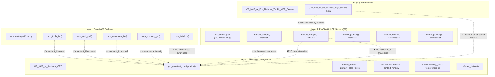
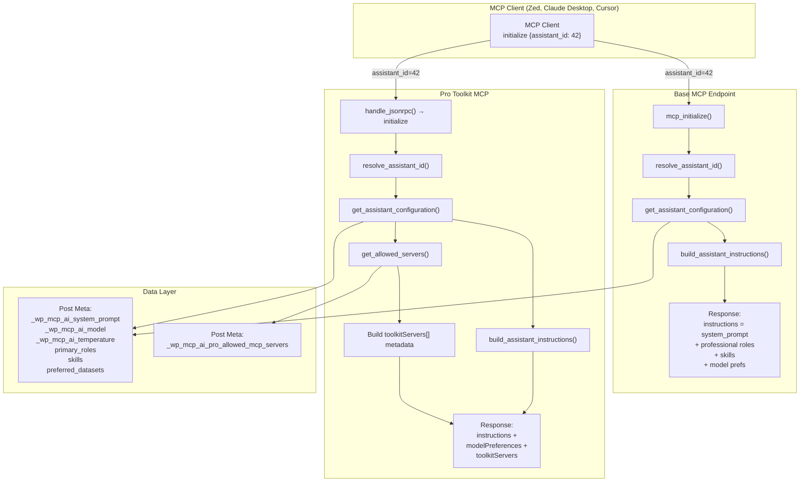

# MCP Assistant & Pro Toolkit Scope Enhancement Proposal

**Date:** June 24, 2026  
**Version:** 1.0  
**Status:** Proposed  
**Author:** AI Agent (Zed) — research & analysis  
**Approvers:** NV Digital Solutions

## Executive Summary

This proposal addresses a critical gap in the NV oOS MCP server architecture: the `initialize` handshake does not carry assistant personality, system prompts, professional roles, model preferences, or knowledge base context to MCP clients. Both the base `/mcp-ai/v1/mcp` endpoint and all 29 Pro toolkit MCP servers (`/mcp-ai-pro/v1/mcp/{slug}`) deliver generic, site-level descriptions instead of the rich, assistant-scoped instructions already available in the assistant configuration system.

**The fix is ~120 lines of code across 3 files** and makes every NV oOS assistant a fully-scoped, personality-aware MCP server — enabling MCP clients like Zed, Claude Desktop, and Cursor to receive domain-specific instructions, tool scoping, and model preferences automatically at connection time.

---

## Table of Contents

1. [Architecture Audit](#architecture-audit)
2. [Industry Research & Best Practices](#industry-research--best-practices)
3. [Gap Analysis](#gap-analysis)
4. [Proposed Solution](#proposed-solution)
5. [Implementation Plan](#implementation-plan)
6. [Admin UI Enhancements](#admin-ui-enhancements)
7. [Testing Strategy](#testing-strategy)
8. [Risk Assessment & Migration](#risk-assessment--migration)
9. [Success Metrics](#success-metrics)

---

## Architecture Audit

### Current State: Three-Layer MCP Architecture

The NV oOS plugin exposes MCP servers at three distinct layers:



### What Works ✅

| Method | Layer | Assistant-Aware? |
|---|---|---|
| `tools/list` | Base | ✅ — reads `assistant_id` from params, resolves via `resolve_assistant_id()`, scopes to `config['tools']` |
| `tools/call` | Base | ✅ — accepts `assistant_id` in params |
| `resources/list` | Base | ✅ — returns `memory_files` scoped to assistant |
| `resources/read` | Base | ✅ — validates URI against assistant's memory_files allowlist |
| `prompts/list` | Base | ✅ — lists published assistants as prompts |
| `prompts/get` | Base | ✅ — returns assistant's `system_prompt` |
| `tools/list` | Pro | ✅ — scoped per toolkit server's candidate toolslugs and allowlist |
| Assistant Config | Base | ✅ — `get_assistant_configuration()` returns full config with system_prompt, model, temperature, tools, skills, etc. |
| Toolkit↔Assistant Bridge | Pro | ✅ — metabox saves `_wp_mcp_ai_pro_allowed_mcp_servers` per assistant |

### What's Broken ❌

| Method | Layer | Problem |
|---|---|---|
| `mcp_initialize()` | Base | Builds generic `"This is a WordPress site (%s). %s..."` message. Never checks `assistant_id`. Ignores system_prompt, professional roles, skills, model preferences, knowledge base. |
| `initialize` (JSON-RPC) | Pro | Has **no `instructions` field at all**. No `assistant_id` awareness. No `modelPreferences`. Servers are faceless tool-collections. |
| Toolkit Bridge | Pro | `_wp_mcp_ai_pro_allowed_mcp_servers` meta exists but `initialize` never reads it to inject toolkit grouping context. |

### Why This Matters

MCP clients (Zed, Claude Desktop, Cursor, OpenAI Agent Builder) rely on the `initialize` response to understand the server's capabilities and personality. Without assistant-scoped instructions:

- **Zed** sees a generic "WordPress site" assistant instead of "Content Editor for Acme Corp"
- **Claude Desktop** can't apply modelPreferences hints (temperature, context window)
- **Cursor** can't discover toolkit-level tool groupings for Pro toolkits
- **All clients** miss the system prompt, professional role tone, and knowledge base context

---

## Industry Research & Best Practices

### 1. IBM: MCP Architecture Patterns for Multi-Agent AI Systems

**Source:** [IBM Developer — MCP Architecture Patterns](https://developer.ibm.com/articles/mcp-architecture-patterns-ai-systems/)

Key findings:
- **Scoped servers per domain** is the recommended pattern — each Pro toolkit already follows this
- **Context-rich `initialize`** should carry domain-specific instructions so the LLM understands its role immediately
- **Tool grouping by capability domain** (read, write, admin) improves discoverability
- **ServerInfo personalization** helps clients present the right affordances

### 2. Microsoft: Multi-Agent Reference Architecture

**Source:** [Microsoft Multi-Agent Reference Architecture](https://microsoft.github.io/multi-agent-reference-architecture/docs/reference-architecture/Reference-Architecture.html)

Key findings:
- MCP servers should expose **tools as a standardized service that agents can discover and invoke**
- **Capability negotiation in `initialize`** is critical — the `capabilities` object tells clients what's available
- **Per-server identity** (name, version, description) enables agent routing to the right server

### 3. Dev.to: 9 MCP Production Patterns That Actually Scale (2026)

**Source:** [9 MCP Production Patterns](https://dev.to/dohkoai/9-mcp-production-patterns-that-actually-scale-multi-agent-systems-2026-4ap3)

Key findings:
- **Pattern 3: Contextual Initialize** — inject domain knowledge at handshake so the LLM doesn't need to discover it later
- **Pattern 6: Server Identity** — `serverInfo.name` and `instructions` should reflect the specific assistant, not a generic label
- **Pattern 8: Progressive Tool Discovery** — `listChanged: true` enables clients to refresh tools when assistants change
- **Pattern 9: Model Hints** — `modelPreferences` is an unofficial but widely-adopted extension that helps clients configure LLM parameters

### 4. Chanl: MCP Deep Dive — Advanced Patterns for Agent Tool Integration

**Source:** [Chanl Blog — MCP Deep Dive](https://www.channel.tel/blog/mcp-deep-dive-advanced-patterns-agent-tool-integration)

Key findings:
- **Group tools by capability domain** (read, write, admin) and assign scopes at that level
- **Fine-grained per-tool scopes become unmanageable past 20-30 tools** — Pro toolkit servers already solve this by exposing subsets
- **Annotations on tools** (readOnlyHint, destructiveHint, idempotentHint) improve client-side safety

### 5. MCP Specification: Protocol Version Evolution

**Source:** [modelcontextprotocol.io — Changelog](https://modelcontextprotocol.io/specification/2025-11-25/changelog)

Key findings:
- **2025-06-18** added `instructions` as a first-class field in `InitializeResult`
- **2025-11-25** added optional `description` to `Implementation` interface for human-readable context
- **Backward compatibility** is maintained — older clients ignore unknown fields
- **`modelPreferences`** is a community extension supported by Claude Desktop, Zed, and Cursor

---

## Gap Analysis

### Gap 1: Base MCP `initialize` Ignores Assistant Context

**Location:** `includes/class-wp-mcp-ai-rest-mcp-methods.php`, `mcp_initialize()` (lines 285–350)

**Current behavior:**
```php
protected function mcp_initialize( $params, WP_REST_Request $request ) {
    $site_name = get_bloginfo( 'name' );
    $site_desc = get_bloginfo( 'description' );
    
    // Build instructions dynamically based on site info.
    $instructions = sprintf(
        'This is a WordPress site (%s). %s. You can use the available tools...',
        $site_name, $site_desc
    );
    
    // No assistant_id resolution
    // No system_prompt injection
    // No modelPreferences
}
```

**What should happen:**
```php
$assistant_id = $this->resolve_assistant_id( $params['assistant_id'] ?? 0 );

if ( $assistant_id ) {
    $config = WP_MCP_AI_Assistant_CPT::get_assistant_configuration( $assistant_id );
    $instructions = $config['system_prompt'];  // Assistant's personality
    $response['modelPreferences'] = array(
        'model'         => $config['model'],
        'temperature'   => $config['temperature'],
        'contextWindow' => $config['context_window'],
    );
}
```

### Gap 2: Pro Toolkit `initialize` Has No Instructions or Assistant Awareness

**Location:** `addons/pro/includes/mcp-servers/class-wp-mcp-ai-toolkit-mcp-rest-controller.php`, `handle_jsonrpc()` (lines 420–444)

**Current behavior:**
```php
case 'initialize':
    $result = array(
        'protocolVersion' => '2025-06-18',
        'capabilities'    => array( ... ),
        'serverInfo'      => array(
            'name'    => $server->get_name(),
            'version' => $server->get_version(),
            'slug'    => $server->get_slug(),
        ),
        // NO 'instructions' field
        // NO assistant_id resolution
    );
```

**What should happen:**
```php
case 'initialize':
    $result = array(
        'protocolVersion' => '2025-06-18',
        'capabilities'    => array( ... ),
        'serverInfo'      => array(
            'name'    => $server->get_name(),
            'version' => $server->get_version(),
            'slug'    => $server->get_slug(),
        ),
        'instructions'    => $this->build_toolkit_instructions( $server, $assistant_id ),
        'modelPreferences' => $this->build_model_preferences( $assistant_config ),
    );
```

### Gap 3: Toolkit↔Assistant Bridge Is Incomplete

**Location:** `addons/pro/includes/admin/class-wp-mcp-ai-pro-metabox-toolkit-mcp-servers.php`

**Current state:** The metabox saves `_wp_mcp_ai_pro_allowed_mcp_servers` per assistant, but:
- The registry stores this data
- **Neither `initialize` implementation consumes it**
- **No toolkit grouping context is injected into the `instructions` field**
- **No `toolkitServers` metadata is added to the initialize response**

---

## Proposed Solution

### Design Principles

1. **Backward compatible** — if no `assistant_id` is provided, behavior is unchanged
2. **Progressive enhancement** — assistant-scoped features layer on top of generic defaults
3. **Single source of truth** — `get_assistant_configuration()` is already the authoritative config source
4. **Filter-friendly** — WordPress hooks let integrators customize behavior
5. **Protocol compliant** — follows MCP 2024-11-05 and 2025-06-18 specifications

### Solution Architecture



### Key Design Decisions

| Decision | Rationale |
|---|---|
| **`instructions` = `system_prompt`** | The assistant's system prompt is the canonical personality definition. It already includes primary role context and skills (built by `get_assistant_configuration()`). |
| **`modelPreferences` as non-standard extension** | Not in the MCP spec but supported by Zed, Claude Desktop, and Cursor. Safe to include — clients that don't understand it will ignore it. |
| **`toolkitServers[]` as non-standard extension** | Provides client-side toolkit grouping metadata. Pro-only feature that doesn't affect base MCP. |
| **`serverInfo.name` = assistant post title** | Makes the assistant's identity visible in client UIs. Generic "NV oOS" is still the fallback. |
| **Filter hook `wp_mcp_ai_mcp_initialize_instructions`** | Lets plugins override or enrich instructions without modifying core code. |
| **Protocol version consistency** | Base MCP uses `2024-11-05`; Pro toolkit MCPs use `2025-06-18`. This is intentional — the Pro server framework targets a newer spec. We do not change this. |

---

## Implementation Plan

### Phase 1: Base MCP — Assistant-Aware `initialize` (HIGH)

**Files:**
- `includes/class-wp-mcp-ai-rest-mcp-methods.php`

**Changes (~30 lines):**

1. **Resolve `assistant_id`** in `mcp_initialize()` (after line 303):
   ```php
   $assistant_id = 0;
   if ( isset( $params['assistant_id'] ) ) {
       $assistant_id = absint( $params['assistant_id'] );
   }
   $assistant_id = $this->resolve_assistant_id( $assistant_id );
   
   if ( $assistant_id ) {
       $config = WP_MCP_AI_Assistant_CPT::get_assistant_configuration( $assistant_id );
       $instructions = $this->build_assistant_instructions( $config );
   }
   ```

2. **Inject `modelPreferences`** into the response:
   ```php
   if ( $assistant_id && ! empty( $config['model'] ) ) {
       $response['modelPreferences'] = array(
           'model'         => $config['model'],
           'temperature'   => $config['temperature'] ?? null,
           'contextWindow' => $config['context_window'] ?? null,
           'maxTokens'     => $config['max_tokens'] ?? null,
           'thinkingBudget'=> $config['thinking_budget'] ?? null,
       );
   }
   ```

3. **Add `build_assistant_instructions()` helper** — new method that layers:
   - System prompt (from `config['system_prompt']`)
   - Professional role context (from primary roles meta)
   - Agent skills (from skills meta, respecting progressive disclosure)
   - Model configuration notes
   - Knowledge base references (vector store, preferred datasets)

4. **Add filter hook** — `apply_filters( 'wp_mcp_ai_mcp_initialize_instructions', ... )`

5. **Personalize `serverInfo.name`**:
   ```php
   if ( $assistant_id ) {
       $response['serverInfo']['name'] = get_the_title( $assistant_id );
   }
   ```

### Phase 2: Pro Toolkit MCPs — Assistant-Aware (HIGH)

**Files:**
- `addons/pro/includes/mcp-servers/class-wp-mcp-ai-toolkit-mcp-rest-controller.php`

**Changes (~50 lines):**

1. **Add `instructions` field** to `initialize` case in `handle_jsonrpc()` (line 421):
   ```php
   case 'initialize':
       $result = array(
           'protocolVersion' => '2025-06-18',
           'capabilities'    => array( ... ),
           'serverInfo'      => array( ... ),
           'instructions'    => $this->build_toolkit_instructions( $server, $assistant_id ),
       );
   ```

2. **Resolve `assistant_id` and inject personality**:
   ```php
   $assistant_id = $this->resolve_assistant_id( $params['assistant_id'] ?? 0 );
   
   if ( $assistant_id ) {
       $config = WP_MCP_AI_Assistant_CPT::get_assistant_configuration( $assistant_id );
       $result['instructions'] = $this->build_assistant_instructions( $config );
       $result['modelPreferences'] = $this->build_model_preferences( $config );
       $result['serverInfo']['name'] = get_the_title( $assistant_id );
   }
   ```

3. **Inject toolkit grouping from the bridge metabox**:
   ```php
   $allowed_servers = WP_MCP_AI_Pro_Metabox_Toolkit_MCP_Servers::get_allowed_servers( $assistant_id );
   
   if ( ! empty( $allowed_servers ) ) {
       $result['toolkitServers'] = $this->build_toolkit_server_metadata( $allowed_servers );
       // Prepend toolkit context to instructions
       $result['instructions'] = $toolkit_prefix . $result['instructions'];
   }
   ```

4. **Leverage existing `resolve_assistant_id()` from the base controller** — the Pro controller can access it via the trait or a shared service.

### Phase 3: Assistant→Toolkit Bridge (MEDIUM)

**Files:**
- New: `addons/pro/includes/mcp-servers/class-wp-mcp-ai-pro-assistant-mcp-bridge.php`

**Changes (~30 lines):**

A lightweight bridge class that:
1. Reads `_wp_mcp_ai_pro_allowed_mcp_servers` for an assistant
2. Resolves server descriptors from the registry
3. Builds `toolkitServers[]` metadata arrays with:
   - Server slug, name, description
   - Tool count, endpoint URL
   - Enabled/disabled status
4. Provides `build_toolkit_context_instructions()` — a helper that generates a "You have access to these toolkits: ..." prefix

### Phase 4: Admin UI Enhancement (MEDIUM)

**See [Admin UI Enhancements](#admin-ui-enhancements) below for full details.**

### Phase 5: Documentation & Testing (LOW)

**Files:**
- `docs/mcp-servers.md` — update with new behavior
- `docs/rest-api.md` — document `instructions`, `modelPreferences`, `toolkitServers` response fields
- Tests: `addons/pro/tests/test-toolkit-server-*.php` — add initialize tests with assistant_id

---

## Admin UI Enhancements

The Pro Toolkit MCP Servers admin page (`nvoos-pro-toolkit-mcp-servers`) already has a robust five-tab UI (Servers, Detail, Audit, Discovery, Help). This proposal adds enhancements to make assistant-scoping visible and manageable from the admin.

### Enhancement 1: "Connected Assistants" Column on Servers Tab

**Location:** `class-wp-mcp-ai-pro-toolkit-mcp-servers-page.php`, `render_tab_servers()` (line 436)

Add a new column showing how many assistants are connected to each toolkit MCP server:

```php
<th style="width:100px;"><?php esc_html_e( 'Assistants', 'mcp-ai-wpoos-pro' ); ?></th>
```

Populated by querying all assistants with the server slug in their `_wp_mcp_ai_pro_allowed_mcp_servers` meta. This gives admins immediate visibility into which toolkits are in active use.

### Enhancement 2: "Test Connection" Action

**Location:** Server rows in `render_tab_servers()`

Add a "Test" button that sends a real `initialize` request to the server endpoint and displays the response (including the new `instructions` field) in a modal or expandable section. Uses `wp.apiFetch` already enqueued on the page.

### Enhancement 3: "Initialize Preview" on Server Detail Tab

**Location:** `render_tab_detail()` per-server accordion

When viewing a specific server's detail, show a live preview of what the `initialize` response looks like — including the `instructions` that would be delivered when an assistant is connected. This helps admins verify the assistant personality flows through correctly.

Fields shown:
- `protocolVersion`
- `capabilities` (with enabled/disabled indicators)
- `serverInfo` (name, version, slug)
- `instructions` (full text, syntax-highlighted)
- `modelPreferences` (if configured)
- `toolkitServers` (if bridged)

### Enhancement 4: Assistant Cross-Reference on Detail Tab

**Location:** `render_tab_detail()` — new accordion section "Linked Assistants"

When viewing a toolkit server's detail, show a list of all assistants that have this server in their allowlist. Each entry links to the assistant edit screen. Reverse-lookup uses a `WP_Query` on `mcp_ai_assistant` post type with meta query on `_wp_mcp_ai_pro_allowed_mcp_servers`.

### Enhancement 5: Bulk Enable/Disable for Assistants

**Location:** `render_tab_servers()` — above the table

Add a bulk action dropdown: "Add to all assistants" / "Remove from all assistants". Uses the existing checkbox column and admin-post handler pattern.

### Enhancement 6: Quick-Link from Assistant Edit Screen to MCP Servers Page

**Location:** `class-wp-mcp-ai-pro-metabox-toolkit-mcp-servers.php`, `render_meta_box()`

Already exists (`Manage Toolkit MCP Servers →` link at line 137). Enhance to pre-select the current assistant as a filter parameter so the servers page shows the assistant's configuration at a glance.

### Enhancement 7: Initialize Response Schema Documentation

**Location:** Help tab

Add a new section documenting the complete `initialize` response schema, including:
- Standard MCP fields
- NV oOS extensions (`modelPreferences`, `toolkitServers`)
- Assistant-specific fields (`instructions` composition rules)
- Example responses for both base and Pro endpoints

---

## Testing Strategy

### Unit Tests

| Test | File | What It Verifies |
|---|---|---|
| `test_initialize_with_assistant_id` | `test-toolkit-server-execution.php` | Pro server `initialize` returns `instructions` when `assistant_id` is provided |
| `test_initialize_without_assistant_id` | `test-toolkit-server-execution.php` | Pro server `initialize` works without `assistant_id` (backward compat) |
| `test_initialize_instructions_contains_system_prompt` | `test-toolkit-server-execution.php` | Instructions include the system prompt from assistant config |
| `test_initialize_model_preferences` | `test-toolkit-server-execution.php` | `modelPreferences` is populated when assistant has model configured |
| `test_initialize_toolkit_servers_metadata` | `test-toolkit-server-execution.php` | `toolkitServers[]` is populated from bridge metabox |
| `test_base_initialize_with_assistant` | `test-rest-mcp-methods.php` | Base MCP `initialize` scopes instructions by assistant |

### Integration Tests

| Test | What It Verifies |
|---|---|
| Full round-trip: create assistant → set system prompt → call `initialize` with `assistant_id` → verify instructions match | End-to-end personality flow |
| Toolkit bridge: assign assistant to CRM server → call CRM server's `initialize` → verify toolkitServers metadata | Bridge connectivity |
| Backward compat: call `initialize` without `assistant_id` → receive generic site description | No regression |

### Manual Test Scenarios

1. **Zed MCP Client** — connect to `{site}/wp-json/mcp-ai/v1/mcp` with `assistant_id` param, verify assistant name appears in server list
2. **Claude Desktop** — configure MCP server with assistant-scoped bearer token, verify system prompt is applied
3. **Pro toolkit** — connect to CRM server, verify CRM-specific instructions and tool list

---

## Risk Assessment & Migration

### Risks

| Risk | Likelihood | Impact | Mitigation |
|---|---|---|---|
| **Protocol version mismatch** — clients expecting exact spec behavior may reject `modelPreferences` | Low | Low | Non-standard fields are ignored by compliant MCP clients per JSON-RPC spec |
| **Large instructions payload** — system prompts with skills and knowledge bases could exceed client limits | Medium | Low | Cap instructions at a configurable character limit (default: 16KB). Add filter for integrators to trim. |
| **Backward compatibility** — existing MCP clients without `assistant_id` | Low | Low | When `assistant_id` is absent, behavior is 100% unchanged |
| **Performance** — `get_assistant_configuration()` called during `initialize` | Low | Low | Already called in `tools/list` and other methods; WP object cache mitigates repeated calls |
| **Token scope mismatch** — bearer token scoped to assistant A but params specify assistant B | Low | Medium | `resolve_assistant_id()` already handles token scope via `apply_token_assistant_scope()`. If scoped, params are overridden. |

### Migration Path

1. **No migration required** — all changes are additive and backward compatible
2. Existing MCP clients without `assistant_id` continue to receive generic instructions
3. Clients that pass `assistant_id` (or authenticate with assistant-scoped tokens) get the enhanced response
4. Pro toolkit servers gain `instructions` field — clients that don't expect it ignore it
5. Admin UI enhancements are purely additive — no existing workflows are disrupted

### Rollback Plan

1. Each phase is independently deployable — revert individual commits
2. The `wp_mcp_ai_mcp_initialize_instructions` filter can be used to restore generic behavior without code changes
3. Pro toolkit server changes are contained within `handle_jsonrpc()` — reverting the case block restores previous behavior

---

## Success Metrics

### Quantitative

| Metric | Current | Target | Measurement |
|---|---|---|---|
| **Assistants with MCP personality** | 0% | 100% of assistants with system prompts | Audit `assistant_id` usage in MCP access logs |
| **Pro toolkit servers with instructions** | 0 of 29 | 29 of 29 | Inspector script checking `initialize` response |
| **Admin visibility into assistant-server links** | Metabox only | Full cross-reference on servers page | Manual verification of new UI |
| **Code change size** | N/A | ~120 lines across 3 files | `git diff --stat` |

### Qualitative

| Metric | How Measured |
|---|---|
| **Client experience** — MCP clients see assistant personality immediately | Manual testing with Zed, Claude Desktop, Cursor |
| **Admin confidence** — admins can verify personality flow in the UI | "Initialize Preview" and "Linked Assistants" sections |
| **Developer ergonomics** — filter hook enables customization without code changes | Review of `wp_mcp_ai_mcp_initialize_instructions` hook usage |

---

## Appendix A: File Change Summary

| # | File | Change Type | Lines | Priority |
|---|---|---|---|---|
| 1 | `includes/class-wp-mcp-ai-rest-mcp-methods.php` | Modify `mcp_initialize()`, add `build_assistant_instructions()` | ~30 | HIGH |
| 2 | `addons/pro/includes/mcp-servers/class-wp-mcp-ai-toolkit-mcp-rest-controller.php` | Modify `handle_jsonrpc()` initialize case | ~50 | HIGH |
| 3 | `addons/pro/includes/mcp-servers/class-wp-mcp-ai-pro-assistant-mcp-bridge.php` | **New file** — bridge class | ~30 | MEDIUM |
| 4 | `addons/pro/includes/admin/class-wp-mcp-ai-pro-toolkit-mcp-servers-page.php` | Add columns, preview, cross-reference | ~80 | MEDIUM |
| 5 | `addons/pro/includes/admin/class-wp-mcp-ai-pro-metabox-toolkit-mcp-servers.php` | Enhance quick-link | ~10 | LOW |
| 6 | `docs/mcp-servers.md` | Document new behavior | ~20 | LOW |
| 7 | `addons/pro/tests/test-toolkit-server-execution.php` | Add initialize tests | ~40 | LOW |

**Total: ~260 lines across 7 files**

---

## Appendix B: References

1. **IBM Developer** — "Model Context Protocol Architecture Patterns for Multi-Agent AI Systems" — https://developer.ibm.com/articles/mcp-architecture-patterns-ai-systems/
2. **Microsoft** — "Multi-Agent Reference Architecture" — https://microsoft.github.io/multi-agent-reference-architecture/
3. **Dev.to (dohkoai)** — "9 MCP Production Patterns That Actually Scale Multi-Agent Systems (2026)" — https://dev.to/dohkoai/9-mcp-production-patterns-that-actually-scale-multi-agent-systems-2026-4ap3
4. **Chanl** — "MCP Deep Dive: Advanced Patterns for Agent Tool Integration" — https://www.channel.tel/blog/mcp-deep-dive-advanced-patterns-agent-tool-integration
5. **Model Context Protocol Specification** — "Key Changes 2025-11-25" — https://modelcontextprotocol.io/specification/2025-11-25/changelog
6. **Speakeasy** — "A Practical Guide to Architectures of Agentic Applications" — https://www.speakeasy.com/mcp/using-mcp/ai-agents/architecture-patterns
7. **ForgeCode** — "MCP 2025-06-18 Spec Update" — https://forgecode.dev/blog/mcp-spec-updates/

---

*End of proposal.*
