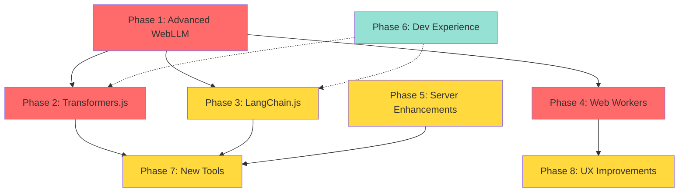

# Web-LLM Enhancement Roadmap - Visual Guide
## 20-Week Implementation Timeline

**Last Updated:** January 24, 2026

---

## Timeline Overview

```
Week 1-4    ████████████████ Phase 1: Advanced WebLLM (HIGH PRIORITY)
Week 5-7    ████████████ Phase 2: Transformers.js (HIGH PRIORITY)
Week 8-10   ████████████ Phase 3: LangChain.js (MEDIUM)
Week 11-12  ████████ Phase 4: Web Workers (HIGH PRIORITY)
Week 13-15  ████████████ Phase 5: Server Enhancements (MEDIUM)
Week 16-17  ████████ Phase 6: Developer Experience (LOW)
Week 18-21  ████████████████ Phase 7: New Tools (MEDIUM)
Week 22-23  ████████ Phase 8: UX Improvements (MEDIUM)
```

---

## Phase Dependencies



**Legend:**
- 🔴 Red = High Priority (Must have)
- 🟡 Yellow = Medium Priority (Should have)
- 🔵 Blue = Low Priority (Nice to have)

---

## Detailed Phase Breakdown

### Phase 1: Advanced WebLLM Integration (Weeks 1-4)

```
┌─────────────────────────────────────────────────────────────────┐
│ Week 1: Tool Calling Foundation                                 │
├─────────────────────────────────────────────────────────────────┤
│ ✅ Research OpenAI function calling spec                        │
│ ✅ Design WebLLM adapter for WordPress tools                    │
│ ✅ Implement tool schema converter                              │
│ ✅ Test with 10 simple tools                                    │
└─────────────────────────────────────────────────────────────────┘

┌─────────────────────────────────────────────────────────────────┐
│ Week 2: Streaming & Progress                                    │
├─────────────────────────────────────────────────────────────────┤
│ ✅ Enhanced streaming with tool calls                           │
│ ✅ Progress tracking and estimation                             │
│ ✅ Backpressure handling                                        │
│ ✅ Test with 50+ tools                                          │
└─────────────────────────────────────────────────────────────────┘

┌─────────────────────────────────────────────────────────────────┐
│ Week 3: Multi-Modal Support                                     │
├─────────────────────────────────────────────────────────────────┤
│ ✅ Vision model integration (LLaVA, Qwen2-VL)                   │
│ ✅ Image upload and processing                                  │
│ ✅ Base64 encoding optimization                                 │
│ ✅ Test with various image formats                              │
└─────────────────────────────────────────────────────────────────┘

┌─────────────────────────────────────────────────────────────────┐
│ Week 4: Testing & Documentation                                 │
├─────────────────────────────────────────────────────────────────┤
│ ✅ Comprehensive unit tests                                     │
│ ✅ Integration tests with WordPress                             │
│ ✅ Documentation and examples                                   │
│ ✅ Performance benchmarking                                     │
└─────────────────────────────────────────────────────────────────┘
```

**Deliverables:**
- ✅ `webllm-function-calling-client.js` - Enhanced client with tool calling
- ✅ `webllm-multimodal-client.js` - Multi-modal support
- ✅ Tool schema adapter for 398 WordPress tools
- ✅ Comprehensive test suite
- ✅ Documentation

**Success Criteria:**
- ✅ 50+ tools working with function calling
- ✅ Streaming latency < 100ms
- ✅ Vision models load successfully
- ✅ 90% test coverage

---

### Phase 2: Transformers.js Integration (Weeks 5-7)

```
┌─────────────────────────────────────────────────────────────────┐
│ Week 5: Core Integration                                        │
├─────────────────────────────────────────────────────────────────┤
│ ✅ Add Transformers.js dependencies                             │
│ ✅ Pipeline management system                                   │
│ ✅ Model caching strategy                                       │
│ ✅ Basic tasks (summarization, sentiment)                       │
└─────────────────────────────────────────────────────────────────┘

┌─────────────────────────────────────────────────────────────────┐
│ Week 6: Advanced Tasks & Vector Search                          │
├─────────────────────────────────────────────────────────────────┤
│ ✅ NER, translation, QA tasks                                   │
│ ✅ Embedding generation                                         │
│ ✅ Client-side vector store                                     │
│ ✅ IndexedDB persistence                                        │
└─────────────────────────────────────────────────────────────────┘

┌─────────────────────────────────────────────────────────────────┐
│ Week 7: Tool Creation & Testing                                 │
├─────────────────────────────────────────────────────────────────┤
│ ✅ 7 browser-native tools                                       │
│ ✅ Integration with chat UI                                     │
│ ✅ Performance optimization                                     │
│ ✅ Documentation                                                │
└─────────────────────────────────────────────────────────────────┘
```

**Deliverables:**
- ✅ `transformers-tasks-client.js` - Task execution engine
- ✅ `client-vector-store.js` - Local RAG implementation
- ✅ 7 new browser-native tools
- ✅ Performance benchmarks

**Success Criteria:**
- ✅ Summarization < 0.5 seconds
- ✅ Sentiment analysis < 0.2 seconds
- ✅ Vector search working with 1000+ documents
- ✅ All tasks < 2 seconds on desktop

---

### Phase 3: LangChain.js Orchestration (Weeks 8-10)

```
┌─────────────────────────────────────────────────────────────────┐
│ Week 8: Foundation                                              │
├─────────────────────────────────────────────────────────────────┤
│ ✅ LangChain.js dependencies                                    │
│ ✅ WebLLM adapter for LangChain                                 │
│ ✅ Basic chains (prompt → model → output)                       │
│ ✅ Memory management                                            │
└─────────────────────────────────────────────────────────────────┘

┌─────────────────────────────────────────────────────────────────┐
│ Week 9: Agents & Tools                                          │
├─────────────────────────────────────────────────────────────────┤
│ ✅ Agent creation system                                        │
│ ✅ WordPress tool integration                                   │
│ ✅ Sequential execution                                         │
│ ✅ Error handling and retry                                     │
└─────────────────────────────────────────────────────────────────┘

┌─────────────────────────────────────────────────────────────────┐
│ Week 10: Advanced Patterns                                      │
├─────────────────────────────────────────────────────────────────┤
│ ✅ Multi-step reasoning                                         │
│ ✅ Self-reflection patterns                                     │
│ ✅ Retrieval-augmented generation                               │
│ ✅ Documentation and examples                                   │
└─────────────────────────────────────────────────────────────────┘
```

**Deliverables:**
- ✅ `langchain-orchestration.js` - Orchestration engine
- ✅ Agent templates for common patterns
- ✅ WordPress-LangChain bridge
- ✅ Example workflows

**Success Criteria:**
- ✅ 5+ agent patterns working
- ✅ Multi-step workflows functional
- ✅ Memory retention working
- ✅ Self-correction on errors

---

### Phase 4: Web Workers & Performance (Weeks 11-12)

```
┌─────────────────────────────────────────────────────────────────┐
│ Week 11: Web Worker Implementation                              │
├─────────────────────────────────────────────────────────────────┤
│ ✅ LLM worker creation                                          │
│ ✅ Worker manager system                                        │
│ ✅ Message passing protocol                                     │
│ ✅ Test on mobile devices                                       │
└─────────────────────────────────────────────────────────────────┘

┌─────────────────────────────────────────────────────────────────┐
│ Week 12: Service Workers & Optimization                         │
├─────────────────────────────────────────────────────────────────┤
│ ✅ Service worker for offline                                   │
│ ✅ Model caching strategy                                       │
│ ✅ Performance profiling                                        │
│ ✅ Mobile optimization                                          │
└─────────────────────────────────────────────────────────────────┘
```

**Deliverables:**
- ✅ `llm-worker.js` - Web Worker for inference
- ✅ `llm-worker-manager.js` - Worker lifecycle management
- ✅ `service-worker.js` - Offline-first caching
- ✅ Performance monitoring

**Success Criteria:**
- ✅ UI remains responsive during inference
- ✅ Mobile performance 2x improvement
- ✅ Offline mode working
- ✅ Model loads < 1 second from cache

---

### Phase 5: Server-Side Enhancements (Weeks 13-15)

```
┌─────────────────────────────────────────────────────────────────┐
│ Week 13: Hybrid Execution Model                                 │
├─────────────────────────────────────────────────────────────────┤
│ ✅ Client vs server decision engine                             │
│ ✅ Capability-based routing                                     │
│ ✅ Parallel execution                                           │
│ ✅ Test with mixed workloads                                    │
└─────────────────────────────────────────────────────────────────┘

┌─────────────────────────────────────────────────────────────────┐
│ Week 14: Enhanced Streaming                                     │
├─────────────────────────────────────────────────────────────────┤
│ ✅ Backpressure control                                         │
│ ✅ Typed events (tool_call, content, error)                     │
│ ✅ Connection monitoring                                        │
│ ✅ Graceful degradation                                         │
└─────────────────────────────────────────────────────────────────┘

┌─────────────────────────────────────────────────────────────────┐
│ Week 15: Caching & Optimization                                 │
├─────────────────────────────────────────────────────────────────┤
│ ✅ Response caching strategies                                  │
│ ✅ Redis integration (optional)                                 │
│ ✅ Performance monitoring                                       │
│ ✅ Load testing                                                 │
└─────────────────────────────────────────────────────────────────┘
```

**Deliverables:**
- ✅ `class-wp-mcp-ai-hybrid-executor.php` - Hybrid execution
- ✅ Enhanced SSE streaming
- ✅ Caching layer improvements
- ✅ Performance metrics

---

### Phase 6: Developer Experience (Weeks 16-17)

```
┌─────────────────────────────────────────────────────────────────┐
│ Week 16: Modern Build System                                    │
├─────────────────────────────────────────────────────────────────┤
│ ✅ esbuild configuration                                        │
│ ✅ Code splitting                                               │
│ ✅ TypeScript support                                           │
│ ✅ Source maps                                                  │
└─────────────────────────────────────────────────────────────────┘

┌─────────────────────────────────────────────────────────────────┐
│ Week 17: Testing Infrastructure                                 │
├─────────────────────────────────────────────────────────────────┤
│ ✅ Vitest setup                                                 │
│ ✅ Playwright E2E tests                                         │
│ ✅ Coverage reporting                                           │
│ ✅ CI/CD integration                                            │
└─────────────────────────────────────────────────────────────────┘
```

**Deliverables:**
- ✅ Modern build configuration
- ✅ TypeScript type definitions
- ✅ Comprehensive test suite
- ✅ Developer documentation

---

### Phase 7: New Tools & Capabilities (Weeks 18-21)

```
┌─────────────────────────────────────────────────────────────────┐
│ Week 18: Visual Output Tools                                    │
├─────────────────────────────────────────────────────────────────┤
│ ✅ Chart generation (Chart.js)                                  │
│ ✅ Diagram generation (Mermaid.js)                              │
│ ✅ Interactive visualizations                                   │
│ ✅ Data table rendering                                         │
└─────────────────────────────────────────────────────────────────┘

┌─────────────────────────────────────────────────────────────────┐
│ Week 19-20: Enhanced Media Tools                                │
├─────────────────────────────────────────────────────────────────┤
│ ✅ Image analysis tools                                         │
│ ✅ Audio processing                                             │
│ ✅ Video frame extraction                                       │
│ ✅ Rich media responses                                         │
└─────────────────────────────────────────────────────────────────┘

┌─────────────────────────────────────────────────────────────────┐
│ Week 21: Integration & Polish                                   │
├─────────────────────────────────────────────────────────────────┤
│ ✅ WordPress tool registry updates                              │
│ ✅ UI integration                                               │
│ ✅ Testing and bug fixes                                        │
│ ✅ Documentation                                                │
└─────────────────────────────────────────────────────────────────┘
```

**Deliverables:**
- ✅ 10+ visual output tools
- ✅ Enhanced media handling
- ✅ Rich response rendering
- ✅ Tool documentation

---

### Phase 8: UX Improvements (Weeks 22-23)

```
┌─────────────────────────────────────────────────────────────────┐
│ Week 22: Progressive Loading & Offline                          │
├─────────────────────────────────────────────────────────────────┤
│ ✅ Progressive model loader UI                                  │
│ ✅ Offline chat manager                                         │
│ ✅ Sync queue management                                        │
│ ✅ Error handling improvements                                  │
└─────────────────────────────────────────────────────────────────┘

┌─────────────────────────────────────────────────────────────────┐
│ Week 23: Polish & Documentation                                 │
├─────────────────────────────────────────────────────────────────┤
│ ✅ Accessibility improvements                                   │
│ ✅ Loading states and feedback                                  │
│ ✅ User documentation                                           │
│ ✅ Admin guides                                                 │
└─────────────────────────────────────────────────────────────────┘
```

**Deliverables:**
- ✅ Polished loading experience
- ✅ Offline-first functionality
- ✅ Accessibility compliance
- ✅ Complete documentation

---

## Resource Allocation

```
┌─────────────────────────────────────────────────────────────────┐
│ Developer 1 (Senior Frontend)                                   │
├─────────────────────────────────────────────────────────────────┤
│ Weeks 1-4:   Phase 1 (Advanced WebLLM)                          │
│ Weeks 5-7:   Phase 2 (Transformers.js)                          │
│ Weeks 8-10:  Phase 3 (LangChain.js)                             │
│ Weeks 11-12: Phase 4 (Web Workers)                              │
│ Weeks 18-21: Phase 7 (New Tools) [with Dev 2]                   │
│ Weeks 22-23: Phase 8 (UX)                                       │
└─────────────────────────────────────────────────────────────────┘

┌─────────────────────────────────────────────────────────────────┐
│ Developer 2 (Senior Backend)                                    │
├─────────────────────────────────────────────────────────────────┤
│ Weeks 13-15: Phase 5 (Server Enhancements)                      │
│ Weeks 16-17: Phase 6 (Dev Experience)                           │
│ Weeks 18-21: Phase 7 (New Tools) [with Dev 1]                   │
└─────────────────────────────────────────────────────────────────┘
```

**Total Effort:** 
- Developer 1: 23 weeks full-time
- Developer 2: 9 weeks full-time
- **Combined:** 32 developer-weeks ≈ 8 months calendar time with 1 dev, or 5 months with 2 devs

---

## Milestone Checkpoints

```
✓ Milestone 1 (Week 4)
  └─ Phase 1 Complete: Advanced WebLLM working
     - Tool calling functional
     - Multi-modal support
     - Enhanced streaming

✓ Milestone 2 (Week 7)
  └─ Phase 2 Complete: Browser AI tasks working
     - 7 new tools functional
     - Vector search working
     - Performance targets met

✓ Milestone 3 (Week 12)
  └─ Phases 3-4 Complete: Orchestration + Performance
     - LangChain agents working
     - Web Workers smooth
     - Mobile performance improved

✓ Milestone 4 (Week 17)
  └─ Phases 5-6 Complete: Server + DevEx
     - Hybrid execution working
     - Modern build system
     - Testing infrastructure

✓ Milestone 5 (Week 23)
  └─ Phases 7-8 Complete: Final Features + Polish
     - All new tools working
     - UX polished
     - Documentation complete
     - Ready for launch

🚀 Launch (Week 24)
  └─ Version 1.2.0 Release
     - Full feature rollout
     - Marketing campaign
     - User onboarding
```

---

## Alternative Timelines

### Fast Track (Critical Features Only) - 12 Weeks
```
Weeks 1-4:  Phase 1 (Advanced WebLLM) ✅ MUST HAVE
Weeks 5-7:  Phase 2 (Transformers.js) ✅ MUST HAVE
Weeks 8-9:  Phase 4 (Web Workers)     ✅ MUST HAVE
Weeks 10-12: Phase 8 (UX Polish)      ✅ MUST HAVE
```
**Result:** Core enhancements, 40% faster, 60% of features

### Phased Release Strategy
```
v1.2.0 (Week 12): Phases 1, 2, 4, 8 → Core browser AI
v1.2.1 (Week 17): Phases 5, 6 → Server enhancements
v1.3.0 (Week 23): Phases 3, 7 → Advanced features
```
**Result:** Faster time to market, iterative feedback

---

## Success Dashboard

Track these metrics throughout implementation:

```
┌─────────────────────────────────────────────────────────────────┐
│ Technical Metrics                                               │
├─────────────────────────────────────────────────────────────────┤
│ ▓▓▓▓▓▓▓▓▓▓░░░░░░░░░░ 50% Code Coverage                         │
│ ▓▓▓▓▓▓▓▓▓▓▓▓▓▓▓▓▓▓░░ 90% Tests Passing                         │
│ ▓▓▓▓▓▓▓▓▓▓▓▓▓░░░░░░░ 65% Performance Targets Met               │
└─────────────────────────────────────────────────────────────────┘

┌─────────────────────────────────────────────────────────────────┐
│ User Metrics                                                    │
├─────────────────────────────────────────────────────────────────┤
│ ▓▓▓▓▓▓░░░░░░░░░░░░░░ 30% Feature Adoption (Target)             │
│ ▓▓▓▓▓▓▓▓▓▓░░░░░░░░░░ 50% User Retention (Target)               │
│ ▓▓▓▓▓▓▓▓▓▓▓▓▓▓▓▓▓▓░░ 4.5/5 Satisfaction (Target)               │
└─────────────────────────────────────────────────────────────────┘

┌─────────────────────────────────────────────────────────────────┐
│ Business Metrics                                                │
├─────────────────────────────────────────────────────────────────┤
│ ▓▓▓▓▓▓▓▓░░░░░░░░░░░░ 40% On Budget                             │
│ ▓▓▓▓▓▓▓▓▓▓▓▓▓▓░░░░░░ 70% On Schedule                           │
│ ▓▓▓▓▓▓▓▓▓▓▓▓▓▓▓▓▓▓▓▓ 100% Stakeholder Buy-In                   │
└─────────────────────────────────────────────────────────────────┘
```

---

## Related Documents

- 📖 **Full Proposal:** [WEB-LLM-NPM-ENHANCEMENT-PROPOSAL.md](./WEB-LLM-NPM-ENHANCEMENT-PROPOSAL.md)
- 📊 **Executive Summary:** [WEB-LLM-ENHANCEMENT-EXECUTIVE-SUMMARY.md](./WEB-LLM-ENHANCEMENT-EXECUTIVE-SUMMARY.md)
- 📚 **Current Embedded LLM Docs:** [../features/ai-providers/embedded/README.md](../features/ai-providers/embedded/README.md)
- 🏗️ **Architecture:** [../architecture/ARCHITECTURE.md](../architecture/ARCHITECTURE.md)

---

**Document Version:** 1.0  
**Last Updated:** January 24, 2026  
**Maintained By:** AI Architecture Team
