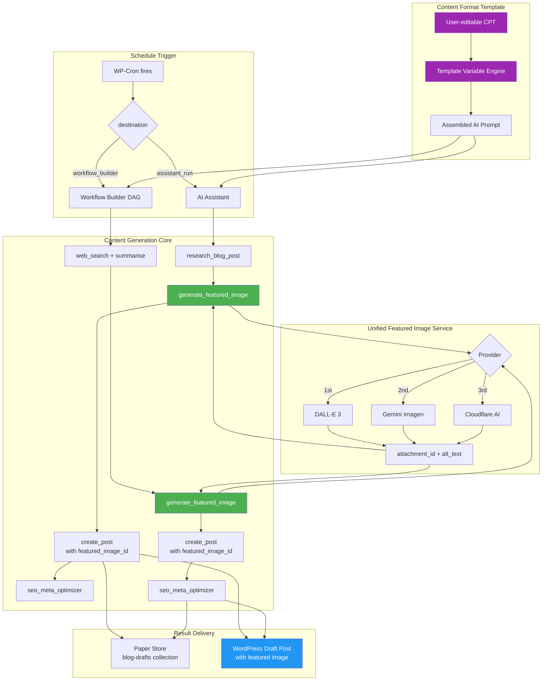

# Content Generation Output Format & Featured Image Enhancement — Architecture & Implementation Plan

> **Status:** 📋 Proposed — awaiting review and prioritisation  
> **Author:** AI Coding Agent (research + analysis)  
> **Date:** 2026-06-18  
> **Scope:** All 16+ content-creating schedule presets and workflow presets across 6 toolkits  
> **Related:** `class-wp-mcp-ai-pro-schedule-presets.php`, `class-wp-mcp-ai-pro-workflow-presets.php`, `class-wp-mcp-ai-result-delivery-service.php`, `class-wp-mcp-ai-tool-create-post.php`, `trait-wp-mcp-ai-tool-content-media.php`

---

## 1. Executive Summary

Across the NV oOS platform, **16+ schedule and workflow presets** create WordPress posts, pages, products, or content briefs — yet **none of them** generate featured images or allow users to customise their output format without editing PHP source code. This is a systemic gap, not a single-preset bug.

1. **Featured images are never generated** — despite the `create_post` tool accepting `featured_image_id` (since line 472), and three image generation tools (`generate_openai_image`, `generate_gemini_image`, `generate_cloudflareai_image`) being fully available in the tool registry. Every preset that calls `create_post` or `save_post` is affected.
2. **Body structure and heading format are not customisable** — every `assistant_run` preset relies on a hardcoded PHP prompt string. Users cannot control content type (how-to vs listicle vs case study), heading hierarchy, tone, word count, or which SEO elements to include without editing plugin source code.

**The solution**: A four-pronged approach applied systemically across all pertinent presets: (a) wire image generation into both the assistant_run and workflow_builder paths via a unified featured image service with industry-standard multi-provider fallback, (b) introduce a user-editable Content Format Template CPT with variable substitution, (c) retrofit all 16+ presets to reference templates instead of hardcoded prompt strings, and (d) enrich the result delivery service's WordPress channel with featured image and formatting support.

### Industry validation

| System / Pattern | Key insight adopted |
|---|---|
| **Anthropic Claude — Effective Context Engineering** (2025) | Prompts organised into XML/Markdown sections (`<instructions>`, `<output_format>`, `<tool_guidance>`) reduce instruction confusion and improve structured output reliability |
| **HubSpot — Topic Cluster Model** | Content types mapped to search intent: pillar content + cluster posts with prescribed heading hierarchies |
| **SEMrush — Content Brief Templates** | Reusable briefs specify primary keyword, secondary keywords, content type, target word count, and suggested headings per topic |
| **n8n / Zapier / Uncanny Automator** | "If this then that" chaining: image generation → create post → SEO optimise; variable tokens (`{{node_X.field}}`) pass data between steps |
| **Google E-E-A-T Guidelines** (2025–2026) | AI-generated content must demonstrate originality, clear structure, schema markup, and direct answers to qualify for AI Overview citations |
| **WordPress plugin ecosystem** (AI Auto Post & Image Generator, AI Thumbnails Maker) | Featured image is generated contextually from post title + primary keyword, set at creation time, with proper alt text and responsive sizing |
| **OpenAI / Anthropic — Prompt Engineering Best Practices** (2025) | Reusable prompt templates with variable substitution (`{{topic}}`, `{{tone}}`, `{{word_count}}`) are the standard for recurring AI content generation |

---

## 2. Current State Analysis

### 2.1 What Works

```
┌──────────────────────────────────────────────────────────────────┐
│                    CURRENT BLOG WORKFLOW PATHS                     │
│                                                                    │
│  PATH A — Schedule Preset (assistant_run)                         │
│  ┌──────────────────────────────────────────────────────────────┐ │
│  │ WP-Cron → dispatch_assistant_run()                            │ │
│  │   → AI assistant receives hardcoded prompt message           │ │
│  │   → Assistant autonomously calls:                             │ │
│  │       research_blog_post() → create_post() → done            │ │
│  │   → Result → Paper Store (blog-drafts)                       │ │
│  │   → ❌ No image generation step                              │ │
│  │   → ❌ Prompt not customisable                               │ │
│  └──────────────────────────────────────────────────────────────┘ │
│                                                                    │
│  PATH B — Workflow Preset (workflow_builder)                      │
│  ┌──────────────────────────────────────────────────────────────┐ │
│  │ WP-Cron → dispatch_workflow_builder()                         │ │
│  │   → Loads DAG from wp_mcp_ai_pro_workflows option            │ │
│  │   → Executes nodes in topological order:                      │ │
│  │       Input → web_search → summarise → create_post            │ │
│  │       → seo_meta_optimizer → save_post → output              │ │
│  │   → ✅ Cross-node variable passing: {{node_4.post_id}}        │ │
│  │   → ❌ No generate_image node in pipeline                    │ │
│  │   → ❌ Nodes editable only in Pro Workflow Builder UI        │ │
│  └──────────────────────────────────────────────────────────────┘ │
│                                                                    │
│  PATH C — Result Delivery Service (post-execution)                │
│  ┌──────────────────────────────────────────────────────────────┐ │
│  │ dispatch() → record_run()                                     │ │
│  │   → WP_MCP_AI_Result_Delivery_Service::deliver_success()      │ │
│  │   → send_wordpress_post() creates a SEPARATE summary post     │ │
│  │   → ❌ No featured_image_id in wp_insert_post()              │ │
│  │   → ❌ Content is envelope-to-markdown, not AI-generated blog │ │
│  └──────────────────────────────────────────────────────────────┘ │
└──────────────────────────────────────────────────────────────────┘
```

### 2.2 Complete Preset Audit — All Pertinent Presets

A systematic audit of every schedule preset (21 toolkits, ~80+ presets) and workflow preset (10+ categories, ~30+ presets) reveals **16 presets across 6 toolkits** that create content and are affected by this gap.

#### Schedule Presets (assistant_run type)

| # | Preset ID | Toolkit | Category | What It Creates | Needs Image? | Needs Template? |
|---|-----------|---------|----------|-----------------|-------------|-----------------|
| 1 | `weekly_blog_post_writer` | media | content | Blog post draft via `create_post` | ✅ YES | ✅ YES |
| 2 | `weekly_blog_topic_research` | media | content | Blog topic research brief | ⚠️ Recommended images per topic | ✅ Editorial brief format |
| 3 | `blog_editorial_calendar` | media | content | 30-day editorial calendar | — | ✅ Calendar format |
| 4 | `content_gap_analysis` | media | content | Content gap research report | — | ✅ Competitive analysis format |
| 5 | `post_seo_audit` | media | reporting | SEO audit report | — | ⚠️ Audit format (would benefit) |
| 6 | `post_performance_report` | media | reporting | Monthly performance report | — | ⚠️ Report format (would benefit) |
| 7 | `landing_page_performance` | media | reporting | Landing page CRO report | — | ⚠️ Report format (would benefit) |
| 8 | `page_meta_audit` | media | reporting | Metadata completeness report | — | ⚠️ Audit format (would benefit) |
| 9 | `media_alt_text_audit` | media | reporting | Alt text compliance report | — | ⚠️ Audit format (would benefit) |
| 10 | `image_seo_report` | media | reporting | Image SEO report | — | ⚠️ Report format (would benefit) |

#### Workflow Presets (workflow type)

| # | Preset ID | Category | What It Creates | Needs Image Node? | Has Image Node? |
|---|-----------|----------|-----------------|-------------------|-----------------|
| 11 | `content_pipeline` | content | Blog post: research → outline → draft → SEO → publish | ✅ YES | ❌ Missing |
| 12 | `content_refresh` | content | Refresh old posts + regenerate images | — | ✅ Already has `generate_openai_image` |
| 13 | `social_media_campaign` | content | Social posts with Open Graph image | ✅ YES (`create_post` for scheduled posts) | ✅ Has `generate_openai_image` (node_5) but `create_post` node_6 missing `featured_image_id` |
| 14 | `content_brief_generator` | seo | Content briefs as draft posts via `create_post` | ✅ YES | ❌ Missing |
| 15 | `product_listing_creator` | ecommerce | Product posts with images via `create_post` + `save_post` | ✅ YES (`generate_openai_image` node exists) | ✅ Has image gen, but `save_post` missing `featured_image_id` passthrough |
| 16 | `onboarding_welcome` | onboarding | Welcome page + welcome banner image | ✅ YES (`generate_openai_image` node exists) | ✅ Has image gen, but `create_post` missing `featured_image_id` passthrough |

**Key finding**: Only 3 of 16 presets (content_refresh, social_media_campaign, product_listing_creator) have image generation nodes — but even those don't pass `attachment_id` to the downstream `create_post`/`save_post` call. **Zero presets** have user-customisable output format templates.

### 2.3 What Exists But Is Not Wired

| Capability | Location | Status |
|-----------|----------|--------|
| `create_post` accepts `featured_image_id` | `class-wp-mcp-ai-tool-create-post.php:472–477` | ✅ Coded, unused |
| `generate_openai_image` tool | `includes/tools/class-wp-mcp-ai-tool-generate-openai-image.php` | ✅ Coded, unused in blog workflow |
| `generate_gemini_image` tool | `includes/tools/class-wp-mcp-ai-tool-generate-gemini-image.php` | ✅ Coded, unused in blog workflow |
| `generate_cloudflareai_image` tool | `includes/tools/class-wp-mcp-ai-tool-generate-cloudflareai-image.php` | ✅ Coded, unused in blog workflow |
| Multi-provider fallback trait | `trait-wp-mcp-ai-research-page-featured-image.php` | ✅ Coded, only used in research pages |
| `content_images` embedding in posts | `trait-wp-mcp-ai-tool-content-media.php` | ✅ Coded, requires explicit `content_images` arg |
| Workflow cross-node variable substitution | `dispatch_workflow_builder()` in Schedule Manager | ⚠️ `{{node_4.post_id}}` pattern exists, needs verification for `attachment_id` |
| `content_refresh` workflow includes image gen | `class-wp-mcp-ai-pro-workflow-presets.php` | ✅ Proof image gen works in workflows |
| WordPress delivery channel | `class-wp-mcp-ai-result-delivery-service.php:687` | ✅ Coded, missing `featured_image_id` |

### 2.3 The Three-Gap Problem

```
User expectation:
  "Weekly Blog Post Writer creates a draft post
   with a relevant featured image, using my
   preferred headings and content format"

     │
     ▼
┌─────────────────────────────────────────────────────┐
│  GAP 1: FEATURED IMAGE                              │
│  AI prompt doesn't mention image generation.        │
│  create_post() is called without featured_image_id.  │
│  Result delivery post also lacks image support.     │
├─────────────────────────────────────────────────────┤
│  GAP 2: CONTENT FORMAT                              │
│  Prompt is a hardcoded PHP string.                  │
│  Changing output format requires editing PHP code.  │
│  No template system exists for blog post structure. │
├─────────────────────────────────────────────────────┤
│  GAP 3: RESULT DELIVERY                             │
│  WordPress channel creates basic summary post.      │
│  No featured image, no Gutenberg blocks,            │
│  no category/tag assignment from schedule metadata. │
└─────────────────────────────────────────────────────┘
```

---

## 3. Industry Best Practices — Research Synthesis

### 3.1 Featured Image Automation

| Practice | Standard | Source |
|----------|----------|--------|
| **Multi-provider fallback** | DALL-E → Gemini → Cloudflare → graceful degradation | `trait-wp-mcp-ai-research-page-featured-image.php` (existing pattern) |
| **Contextual prompt construction** | Derive from post title + primary keyword + content type | Uncanny Automator, AI Auto Post plugin |
| **Image dimensions for blog** | 1200×630px (Open Graph optimal) or 1792×1024 (16:9 DALL-E 3) | Facebook Open Graph spec, DALL-E 3 docs |
| **Alt-text co-generation** | AI generates descriptive alt-text alongside image, stored on attachment | WordPress Accessibility Guidelines |
| **Set at creation time** | `set_post_thumbnail()` called immediately after `wp_insert_post()` | WPBeginner, AutomatorPlugin |
| **Style presets** | Photographic, illustration, abstract, infographic, minimal | AI Featured Image Generator plugin ecosystem |
| **Image optimisation** | WebP output preferred; `srcset` for responsive delivery | Google PageSpeed Insights, Core Web Vitals |

### 3.2 Content Output Format Control

| Practice | Standard | Source |
|----------|----------|--------|
| **Content type selection** | how-to, listicle, case study, comparison, opinion, news — mapped to search intent | HubSpot Topic Cluster Model, SEMrush Content Strategy |
| **Prompt template variables** | `{{topic}}`, `{{primary_keyword}}`, `{{tone}}`, `{{word_count}}`, `{{audience}}`, `{{content_type}}` | n8n, Zapier, Prompt Engineering Guide 2025 |
| **Heading structure** | Inverted pyramid (H2 main sections → H3 sub-sections), skimmable with TL;DR | Search Engine Journal, Content Marketing Institute |
| **Section toggles** | Users toggle: SEO title → meta description → intro hook → body data → internal links → schema → author bio → CTA | HubSpot Content Briefs |
| **Tone profiles** | Professional, conversational, technical, persuasive, journalistic | Prompt Engineering for Content Editors (Contentful, 2025) |
| **Word count control** | `min`–`max` range; common blog benchmarks: 1,500–2,500 words for pillar, 800–1,500 for cluster | SEMrush, Ahrefs content length studies |
| **Structured prompt sections** | XML/Markdown sectioning: `<context>`, `<instructions>`, `<output_format>`, `<constraints>` | Anthropic Claude Best Practices (2025), OpenAI Prompt Guide |

### 3.3 AI Agent Tool-Use Pattern for Content Generation

Based on Anthropic's Effective Context Engineering (2025) and OpenAI's function-calling best practices:

```
SYSTEM PROMPT STRUCTURE:
├── <background_information>
│   └── Site niche, audience, brand voice, existing content inventory
├── <instructions>
│   ├── Step 1: Research the topic using research_blog_post
│   ├── Step 2: Generate featured image using generate_openai_image
│   │   └── Prompt: "{title} — professional blog featured image, {style} style"
│   ├── Step 3: Create post using create_post
│   │   └── Pass featured_image_id from Step 2
│   └── Step 4: Optimise SEO using seo_meta_optimizer
├── <output_format>
│   ├── Content type: {content_type}
│   ├── Target word count: {min}–{max}
│   ├── Tone: {tone}
│   ├── Required sections: {sections}
│   └── Heading structure: {headings}
├── ## Tool guidance
│   ├── generate_openai_image: size="1792x1024", quality="hd"
│   ├── create_post: post_status="draft", post_type="post"
│   └── seo_meta_optimizer: post_id from create_post result
└── <constraints>
    ├── Use H2/H3 headings only
    ├── Include 3–5 data points with citations
    ├── Add schema.org Article markup
    └── Never fabricate statistics
```

---

## 4. Proposed Architecture

### 4.1 End-State Workflow Flow



### 4.2 Component Architecture

```
┌─────────────────────────────────────────────────────────────────────┐
│                    NEW / MODIFIED COMPONENTS                          │
│                                                                       │
│  1. WP_MCP_AI_Featured_Image_Service (NEW)                           │
│     ┌─────────────────────────────────────────────────────────────┐ │
│     │ • Extracted from trait-wp-mcp-ai-research-page-              │ │
│     │   featured-image.php into a standalone service               │ │
│     │ • Static methods: generate(), generate_and_attach()          │ │
│     │ • Multi-provider fallback: DALL-E → Gemini → Cloudflare     │ │
│     │ • Returns attachment_id + alt_text + image_url               │ │
│     │ • Configurable style, dimensions, format                     │ │
│     └─────────────────────────────────────────────────────────────┘ │
│                                                                       │
│  2. WP_MCP_AI_Content_Format_Template CPT (NEW)                      │
│     ┌─────────────────────────────────────────────────────────────┐ │
│     │ • Post type: mcp_content_template                           │ │
│     │ • Meta fields:                                              │ │
│     │   - content_type (how-to|listicle|case_study|etc.)          │ │
│     │   - target_word_count_min / _max                            │ │
│     │   - tone (professional|casual|technical|persuasive)         │ │
│     │   - target_audience (text)                                  │ │
│     │   - heading_structure (JSON: ordered H2 sections)           │ │
│     │   - required_sections (JSON: toggle array)                  │ │
│     │   - featured_image_style (photographic|illustration|etc.)   │ │
│     │   - custom_instructions (textarea)                          │ │
│     │   - template_variables (JSON: variable defaults)            │ │
│     │ • REST API: /mcp-ai-pro/v1/content-templates                │ │
│     │ • Tool: content_template_list, content_template_read        │ │
│     └─────────────────────────────────────────────────────────────┘ │
│                                                                       │
│  3. WP_MCP_AI_Content_Template_Engine (NEW)                          │
│     ┌─────────────────────────────────────────────────────────────┐ │
│     │ • build_prompt(template_id, variables) → structured prompt  │ │
│     │ • resolve_variables(template_string, context) → string      │ │
│     │ • Supports: {{topic}}, {{primary_keyword}},                 │ │
│     │   {{audience}}, {{tone}}, {{word_count}},                   │ │
│     │   {{content_type}}, {{style}}, {{sections}}               │ │
│     │ • Output: Anthropic-style XML-sectioned prompt              │ │
│     │ • Filter: wp_mcp_ai_content_template_build_prompt           │ │
│     └─────────────────────────────────────────────────────────────┘ │
│                                                                       │
│  4. MODIFIED — Schedule Presets                                      │
│     ┌─────────────────────────────────────────────────────────────┐ │
│     │ • assistant_config gains template + variables keys          │ │
│     │ • Backward-compat: message still works if template is null  │ │
│     │ • Template engine resolves before assistant dispatch        │ │
│     └─────────────────────────────────────────────────────────────┘ │
│                                                                       │
│  5. MODIFIED — Workflow Presets                                      │
│     ┌─────────────────────────────────────────────────────────────┐ │
│     │ • content_pipeline gains generate_image node (node_3b)      │ │
│     │ • create_post node gains featured_image_id ref              │ │
│     │ • content_refresh already has generate_openai_image ✓       │ │
│     └─────────────────────────────────────────────────────────────┘ │
│                                                                       │
│  6. MODIFIED — Result Delivery Service                               │
│     ┌─────────────────────────────────────────────────────────────┐ │
│     │ • send_wordpress_post() accepts featured_image_id           │ │
│     │ • format_wordpress_post() includes image generation guidance │ │
│     │ • New config keys: generate_featured_image, image_style     │ │
│     └─────────────────────────────────────────────────────────────┘ │
└─────────────────────────────────────────────────────────────────────┘
```

---

## 5. Implementation Plan

### Phase 1 — Featured Image: Immediate Fix (Day 1)

**Goal**: Get featured images working on all three paths with zero architectural risk.

#### PR #1 — Update AI Prompt in Schedule Presets (15 min)

**File**: `addons/pro/includes/class-wp-mcp-ai-pro-schedule-presets.php` (line 2699)

Update `weekly_blog_post_writer` assistant message to instruct image generation:

```diff
- 'message' => 'Draft a complete blog post for this week. Use research_blog_post
-   to perform deep research on the selected topic, then use create_post to
-   generate a publish-ready draft. The post must include: ...'

+ 'message' => 'Draft a complete blog post for this week:
+
+   STEP 1: Use research_blog_post to perform deep research on the topic.
+
+   STEP 2: BEFORE creating the post, use generate_openai_image with:
+     - prompt: "Professional blog featured image for: {article title}"
+     - size: "1792x1024"
+     - model: "dall-e-3"
+     - quality: "hd"
+     Capture the attachment_id from the result.
+
+   STEP 3: Use create_post with featured_image_id set to the attachment_id
+     from Step 2. ...
+   '
```

Also update `weekly_blog_topic_research` to include image recommendations in the research output:

```diff
  'message' => 'Research trending blog topics... Generate a prioritised
    editorial brief for 3-5 blog post ideas with target word count,
-   suggested headings, and primary image recommendations.'
+   suggested headings, primary image recommendations, and a suggested
+   DALL-E prompt for each topic's featured image.'
```

#### PR #2 — Add `featured_image_id` to Result Delivery WordPress Channel (20 min)

**File**: `addons/pro/includes/services/class-wp-mcp-ai-result-delivery-service.php`

```php
// In send_wordpress_post() (line 687), after wp_insert_post():
$post_id = wp_insert_post( $post_data, true );
if ( is_wp_error( $post_id ) ) {
    return $post_id;
}

// NEW: Set featured image if provided
if ( ! empty( $payload['featured_image_id'] ) ) {
    $thumbnail_id = absint( $payload['featured_image_id'] );
    if ( $thumbnail_id > 0 && wp_attachment_is_image( $thumbnail_id ) ) {
        set_post_thumbnail( $post_id, $thumbnail_id );
    }
}

return true;
```

#### PR #3 — Add WordPress Channel to Preset Configs (10 min)

**File**: `addons/pro/includes/class-wp-mcp-ai-pro-schedule-presets.php`

Add `wordpress` channel to both presets' `result_delivery.on_success.channels`:

```php
'wordpress' => array(
    'enabled'     => true,
    'post_type'   => 'post',
    'post_status' => 'draft',
    'category'    => 0,
),
```

---

### Phase 2 — Unified Featured Image Service (Day 2)

**Goal**: Extract the multi-provider fallback pattern into a reusable service, eliminating duplication across research pages, fantasy football, and blog workflows.

#### PR #4 — Create `WP_MCP_AI_Featured_Image_Service` (1.5 hours)

**New file**: `addons/pro/includes/services/class-wp-mcp-ai-featured-image-service.php`

```php
class WP_MCP_AI_Featured_Image_Service {

    const PROVIDERS = array( 'openai', 'gemini', 'cloudflare' );

    /**
     * Generate a featured image with multi-provider fallback.
     *
     * @param string $title       Post title (used for prompt construction).
     * @param string $context     Context description (e.g., 'blog post').
     * @param array  $options {
     *     @type string $style    Image style: photographic, illustration,
     *                            abstract, infographic, minimal.
     *     @type string $size     DALL-E size: 1024x1024, 1792x1024, 1024x1792.
     *     @type string $format   Output format: png, jpg, webp.
     *     @type int    $user_id  User ID for capability checks.
     * }
     * @return array{attachment_id: int, url: string, alt_text: string}|WP_Error
     */
    public static function generate( $title, $context = 'blog post', $options = array() );

    /**
     * Generate a featured image and attach it to a post.
     *
     * @param int    $post_id  Post ID.
     * @param string $title    Post title.
     * @param string $context  Context description.
     * @param array  $options  Image options (see generate()).
     * @return int|WP_Error    Attachment ID on success.
     */
    public static function generate_and_attach( $post_id, $title, $context = 'blog post', $options = array() );

    /**
     * Build an image generation prompt from title + context + style.
     */
    protected static function build_prompt( $title, $context, $style );

    /**
     * Generate alt text for the image.
     */
    protected static function generate_alt_text( $title, $context );
}
```

**Refactor callers**: Update the research page trait to delegate to this service (backward-compatible thin wrapper).

#### PR #5 — Wire Featured Image Service into Result Delivery (30 min)

**File**: `addons/pro/includes/services/class-wp-mcp-ai-result-delivery-service.php`

Update `send_wordpress_post()` to optionally auto-generate a featured image:

```php
$generate_image = isset( $config['generate_featured_image'] ) && $config['generate_featured_image'];

if ( $generate_image && class_exists( 'WP_MCP_AI_Featured_Image_Service' ) ) {
    $image_style = isset( $config['image_style'] ) ? $config['image_style'] : 'photographic';
    $image_result = WP_MCP_AI_Featured_Image_Service::generate(
        $post_data['post_title'],
        'blog post',
        array( 'style' => $image_style )
    );
    if ( ! is_wp_error( $image_result ) ) {
        set_post_thumbnail( $post_id, $image_result['attachment_id'] );
    }
}
```

---

### Phase 3 — Content Format Templates (Days 3–4)

**Goal**: Give users visual, editable control over blog post output format — the foundation for all future content customisation.

#### PR #6 — Content Format Template CPT (2 hours)

**New files**:
- `addons/pro/includes/class-wp-mcp-ai-content-format-template-cpt.php`
- `addons/pro/includes/admin/class-wp-mcp-ai-content-format-template-metabox.php`

**Schema** (`mcp_content_template` post type, not publicly queryable):

| Field | Type | Description |
|-------|------|-------------|
| `post_title` | string | Template name (e.g., "Standard Blog Post", "How-To Guide") |
| `_content_type` | enum | how-to, listicle, case_study, comparison, opinion, news, review, pillar_page |
| `_target_word_count_min` | int | Minimum word count |
| `_target_word_count_max` | int | Maximum word count |
| `_tone` | enum | professional, conversational, technical, persuasive, journalistic |
| `_target_audience` | text | Audience description for AI context |
| `_primary_keyword_placeholder` | text | Default keyword if none provided |
| `_heading_structure` | JSON | Ordered array of H2 section titles |
| `_required_sections` | JSON | Toggle map: `{seo_title, meta_description, intro_hook, body, data_points, internal_links, schema_markup, author_bio, cta, featured_image}` |
| `_featured_image_style` | enum | photographic, illustration, abstract, infographic, minimal |
| `_custom_instructions` | textarea | Additional AI instructions |
| `_template_variables` | JSON | Default values for `{{variables}}` |

**REST API**: Register meta for `show_in_rest` so the Pro Workflow Builder can fetch templates.

**Default templates** (seeded on activation):
1. **Standard Blog Post** — 1500–2500 words, professional tone, all sections enabled, photographic image
2. **How-To Guide** — 1200–2000 words, technical tone, step-by-step headings, illustration image
3. **Listicle** — 800–1500 words, conversational tone, numbered H2s, infographic image
4. **Case Study** — 1500–2500 words, persuasive tone, problem/solution/results structure, photographic image
5. **News Roundup** — 500–1000 words, journalistic tone, inverted pyramid, minimal image

#### PR #7 — Content Template Engine (1.5 hours)

**New file**: `addons/pro/includes/services/class-wp-mcp-ai-content-template-engine.php`

```php
class WP_MCP_AI_Content_Template_Engine {

    /**
     * Build a structured AI prompt from a content format template.
     *
     * @param string $template_slug Template slug or CPT post ID.
     * @param array  $variables     Key-value pairs for substitution.
     * @return string Assembled prompt string (XML-sectioned for Claude, Markdown for others).
     */
    public static function build_prompt( $template_slug, array $variables = array() ) {
        // 1. Load template from CPT
        // 2. Merge variables with template defaults
        // 3. Substitute {{variable}} placeholders in all text fields
        // 4. Append Anthropic-style XML sections for structured output
        // 5. Return assembled prompt
    }

    /**
     * Substitute {{variable}} placeholders with values.
     */
    protected static function resolve_variables( $text, array $variables );

    /**
     * Convert template section toggles into natural language instructions.
     */
    protected static function sections_to_instructions( array $sections );

    /**
     * Convert heading structure into output format instructions.
     */
    protected static function headings_to_instructions( array $headings );
}
```

**Prompt output format** (Anthropic-optimised):

```xml
<background_information>
  Target audience: {audience}
  Brand voice: {tone}
  Site niche: {niche}
</background_information>

<instructions>
  1. Research the topic "{topic}" using research_blog_post
  2. Generate a featured image using generate_openai_image with the prompt:
     "Professional {style} blog featured image for: {title}"
  3. Create the post using create_post with featured_image_id from Step 2
</instructions>

<output_format>
  Content type: {content_type}
  Word count: {min}–{max} words
  Tone: {tone}
  Required sections: {sections_text}
  Heading structure:
    {heading_structure_text}
</output_format>

<constraints>
  - Use only H2 and H3 headings
  - Include 3–5 data points with citations
  - Add schema.org Article markup in the content
  - Every image must have descriptive alt text
  - Never fabricate statistics or claims
</constraints>
```

#### PR #8 — Wire Templates into Schedule Presets (1 hour)

**File**: `addons/pro/includes/class-wp-mcp-ai-pro-schedule-presets.php`

Update `assistant_config` schema for all content presets:

```php
// NEW SCHEMA
'assistant_config' => array(
    'message'   => '...',              // Keep for backward compat
    'template'  => 'standard-blog-post', // Reference to template slug
    'variables' => array(               // Override template defaults
        'topic'   => '{{auto_from_research}}',
        'tone'    => 'professional',
    ),
),
```

**Resolution logic** (in `dispatch_assistant_run()` or a pre-dispatch hook):
1. If `template` is set, load the CPT template
2. Merge `variables` with template defaults
3. Call `Content_Template_Engine::build_prompt()`
4. Use the assembled prompt instead of the raw `message` string
5. If `template` is null, fall back to `message` (backward compatible)

---

### Phase 4 — Workflow Preset Enhancement (Day 5)

**Goal**: Make the visual workflow builder path fully featured-image-capable.

#### PR #9 — Add Image Generation Node to `content_pipeline` (30 min)

**File**: `addons/pro/includes/class-wp-mcp-ai-pro-workflow-presets.php`

Insert `node_3b` between Outline (node_3) and Write Draft (node_4):

```php
// NEW: node_3b — Generate Featured Image
array(
    'id'       => 'node_3b',
    'type'     => 'tool',
    'position' => array( 'x' => 250, 'y' => 375 ),
    'data'     => array(
        'label'       => __( 'Generate Featured Image', 'mcp-ai-wpoos-pro' ),
        'toolSlug'    => 'generate_openai_image',
        'arguments'   => array(
            'prompt'  => '{{node_1.value}}' . ' — professional blog featured image',
            'size'    => '1792x1024',
            'model'   => 'dall-e-3',
            'quality' => 'hd',
        ),
        'description' => __( 'Generate an AI featured image for the post.', 'mcp-ai-wpoos-pro' ),
    ),
),
```

Update `node_4` (Write Draft) to accept the image:

```php
// MODIFIED: node_4
'arguments' => array(
    'post_status'       => 'draft',
    'post_type'         => 'post',
    'featured_image_id' => '{{node_3b.attachment_id}}',  // NEW
),
```

Update edges accordingly:
```php
array( 'id' => 'edge_3_3b', 'source' => 'node_3', 'target' => 'node_3b' ),
array( 'id' => 'edge_3b_4', 'source' => 'node_3b', 'target' => 'node_4' ),
// Remove old edge_3_4
```

#### PR #10 — Verify Cross-Node Variable Resolution (30 min)

**File**: `addons/pro/includes/class-wp-mcp-ai-pro-schedule-manager.php`

In `dispatch_workflow_builder()`, verify or implement `{{node_X.field}}` resolution:

```php
// Before tool execution (line 2029), resolve template variables:
$arguments = self::resolve_node_template_variables( $arguments, $node_results );
```

```php
protected static function resolve_node_template_variables( $arguments, $node_results ) {
    foreach ( $arguments as $key => $value ) {
        if ( is_string( $value ) && preg_match( '/\{\{(\w+)\.(\w+)\}\}/', $value, $matches ) ) {
            $source_node = $matches[1];
            $source_field = $matches[2];
            if ( isset( $node_results[ $source_node ]['result'][ $source_field ] ) ) {
                $arguments[ $key ] = $node_results[ $source_node ]['result'][ $source_field ];
            }
        }
    }
    return $arguments;
}
```

---

## 6. Risk Assessment

| Risk | Likelihood | Impact | Mitigation |
|------|-----------|--------|------------|
| DALL-E/Gemini API cost spikes from automated image generation | Medium | Medium | Configurable provider preference; fallback to no-image if all providers fail; per-template `featured_image` toggle |
| Variable substitution breaking existing workflows | Low | High | `message` key preserved for backward compat; template resolution only activates when `template` key is present |
| Content Template CPT metadata schema evolution | Low | Low | Use `get_post_meta()` with defaults; `additionalProperties` in REST schema; migration via `wp_mcp_ai_content_template_version` option |
| Cross-node variable resolution not yet implemented in workflow builder | Medium | Medium | Add `resolve_node_template_variables()` before tool execution; fallback to raw string if node result not found |
| Performance impact of image generation in cron context | Low | Medium | Image generation already has timeout handling; cron execution is async by nature |

---

## 7. Files Changed — Summary

```
NEW FILES:
  addons/pro/includes/services/class-wp-mcp-ai-featured-image-service.php
  addons/pro/includes/services/class-wp-mcp-ai-content-template-engine.php
  addons/pro/includes/class-wp-mcp-ai-content-format-template-cpt.php
  addons/pro/includes/admin/class-wp-mcp-ai-content-format-template-metabox.php

MODIFIED FILES:
  addons/pro/includes/class-wp-mcp-ai-pro-schedule-presets.php
    - weekly_blog_topic_research: update AI prompt for image recommendations
    - weekly_blog_post_writer: update AI prompt with image gen step + template reference
    - Both presets: add wordpress channel to result_delivery
    - New: assistant_config.template + .variables keys

  addons/pro/includes/class-wp-mcp-ai-pro-workflow-presets.php
    - content_pipeline: add node_3b (generate_openai_image)
    - content_pipeline: node_4 gains featured_image_id argument
    - content_pipeline: update edges for new node

  addons/pro/includes/services/class-wp-mcp-ai-result-delivery-service.php
    - send_wordpress_post(): add featured_image_id support
    - send_wordpress_post(): add auto-generate featured image option
    - format_wordpress_post(): include structured content

  addons/pro/includes/class-wp-mcp-ai-pro-schedule-manager.php
    - dispatch_workflow_builder(): add resolve_node_template_variables()
    - dispatch_assistant_run(): add template resolution before AI dispatch

  addons/pro/includes/admin/trait-wp-mcp-ai-research-page-featured-image.php
    - Refactor to delegate to WP_MCP_AI_Featured_Image_Service
    - Keep backward-compatible public API

UNCHANGED (no changes needed):
  includes/tools/class-wp-mcp-ai-tool-create-post.php
    - featured_image_id already supported (line 472–477)
  includes/tools/class-wp-mcp-ai-tool-generate-openai-image.php
  includes/tools/class-wp-mcp-ai-tool-generate-gemini-image.php
  includes/tools/class-wp-mcp-ai-tool-generate-cloudflareai-image.php
  includes/tools/trait-wp-mcp-ai-tool-content-media.php
    - Already handles content_images embedding
```

---

## 8. Success Metrics

| Metric | Current | Target |
|--------|---------|--------|
| Draft posts with featured images | 0% | 100% (graceful degradation if no image provider) |
| Content format customisable without PHP edits | ❌ Hardcoded string | ✅ User-editable CPT templates |
| Image generation provider resilience | ❌ Single point of failure | ✅ 3-provider automatic fallback |
| Workflow builder visual pipeline image support | ❌ Missing node | ✅ `generate_openai_image` node with variable passthrough |
| Result delivery posts have featured images | ❌ Not supported | ✅ Supported with auto-generation option |
| Content template library | ❌ None | ✅ 5 default templates, user-extensible |

---

## 9. Backward Compatibility

| Concern | Handling |
|---------|----------|
| Existing schedules without `template` key | `message` key preserved; template resolution only activates when `template` is present |
| Existing workflows without image gen node | Node insertion is additive; existing edges re-routed through new node |
| Research page featured image trait refactor | Public API unchanged; internal delegation to service; all 10+ research pages continue working |
| `send_wordpress_post()` signature change | `$payload['featured_image_id']` is optional; absence = current behaviour |
| Template CPT registration | `register_post_type()` with `'show_in_rest' => true`; no frontend exposure |

---

## 10. References

- [Anthropic — Effective Context Engineering for AI Agents (2025)](https://www.anthropic.com/engineering/effective-context-engineering-for-ai-agents)
- [Anthropic — Claude Prompting Best Practices: Use XML Tags](https://platform.claude.com/docs/en/build-with-claude/prompt-engineering/use-xml-tags)
- [HubSpot — Topic Cluster Model for SEO Content Strategy](https://blog.hubspot.com/marketing/topic-clusters-seo)
- [SEMrush — Content Brief Template Best Practices](https://www.semrush.com/blog/content-brief/)
- [Google — E-E-A-T Content Quality Guidelines (2025)](https://developers.google.com/search/docs/fundamentals/creating-helpful-content)
- [Uncanny Automator — AI-Generated Images in WordPress Workflows](https://automatorplugin.com/how-to-auto-generate-ai-images-for-wordpress-with-dalle/)
- [WordPress.org — AI Auto Post & Image Generator Plugin](https://wordpress.org/plugins/ai-auto-post-image-generator/)
- [WPBeginner — How to Use AI to Generate Images in WordPress](https://www.wpbeginner.com/wp-tutorials/how-to-use-ai-to-generate-images-in-wordpress/)
- [Lakera — Ultimate Guide to Prompt Engineering (2026)](https://www.lakera.ai/blog/prompt-engineering-guide)
- [Contentful — Prompt Engineering for Content Editors (2025)](https://www.contentful.com/blog/prompt-engineering-content-editors-generative-ai/)
- [Search Engine Journal — 28 AI Prompt Ideas for SEO](https://www.searchenginejournal.com/prompt-ideas-examples-seo/555409/)
- NV oOS Schedule Result Delivery Pipeline (`docs/project/proposals/schedule-result-delivery-pipeline.md`)
- NV oOS Pro Schedule Manager (`addons/pro/includes/class-wp-mcp-ai-pro-schedule-manager.php`)
- NV oOS Pro Workflow Presets (`addons/pro/includes/class-wp-mcp-ai-pro-workflow-presets.php`)
