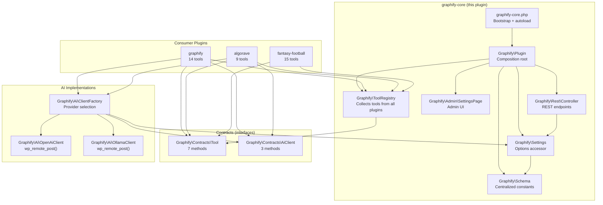

# Graphify Core — Implementation Specification

> **Version**: 1.0.0-draft | **Target PHP**: 8.1+ | **Target WP**: 6.5+ | **License**: MIT
>
> This document is the **complete, actionable implementation specification** for the `graphify-core` WordPress plugin — the shared foundation that all Graphify ecosystem micro-plugins depend on.

---

## Table of Contents

1. [Purpose & Scope](#1-purpose--scope)
2. [Industry Standards Applied](#2-industry-standards-applied)
3. [Architecture Overview](#3-architecture-overview)
4. [Directory & File Structure](#4-directory--file-structure)
5. [Complete File Specifications](#5-complete-file-specifications)
   - [5.1 Bootstrap (`graphify-core.php`)](#51-bootstrap-graphify-corephp)
   - [5.2 Composer Configuration (`composer.json`)](#52-composer-configuration-composerjson)
   - [5.3 Plugin Class (`src/Plugin.php`)](#53-plugin-class-srcpluginphp)
   - [5.4 Schema Constants (`src/Schema.php`)](#54-schema-constants-srcschemaphp)
   - [5.5 Tool Contract (`src/Contracts/Tool.php`)](#55-tool-contract-srccontractstoolphp)
   - [5.6 AI Client Contract (`src/Contracts/AiClient.php`)](#56-ai-client-contract-srccontractsaiclientphp)
   - [5.7 OpenAI Client (`src/Ai/OpenAiClient.php`)](#57-openai-client-srcaiopenaiclientphp)
   - [5.8 Ollama Client (`src/Ai/OllamaClient.php`)](#58-ollama-client-srcaiollamaclientphp)
   - [5.9 Client Factory (`src/Ai/ClientFactory.php`)](#59-client-factory-srcaiclientfactoryphp)
   - [5.10 Tool Registry (`src/ToolRegistry.php`)](#510-tool-registry-srctoolregistryphp)
   - [5.11 Settings (`src/Settings.php`)](#511-settings-srcsettingsphp)
   - [5.12 Admin Settings Page (`src/Admin/SettingsPage.php`)](#512-admin-settings-page-srcadminsettingspagephp)
   - [5.13 REST Controller (`src/Rest/Controller.php`)](#513-rest-controller-srcrestcontrollerphp)
   - [5.14 Uninstall (`uninstall.php`)](#514-uninstall-uninstallphp)
6. [Testing Strategy](#6-testing-strategy)
7. [Build & Release Pipeline](#7-build--release-pipeline)
8. [Migration & Compatibility](#8-migration--compatibility)

---

## 1. Purpose & Scope

`graphify-core` is the **thinnest possible shared layer** for the Graphify micro-plugin ecosystem. It provides exactly three things:

| # | Capability | Consumer |
|---|---|---|
| 1 | **Tool contract** — a PHP interface that every tool in any Graphify plugin implements | `graphify`, `algorave`, `fantasy-football`, `saas-controller` |
| 2 | **AI client** — embed text + chat-complete, with OpenAI and Ollama implementations | `graphify` (embeddings, semantic extraction), `algorave` (music generation) |
| 3 | **Settings** — API key storage, model configuration, enable/disable toggles | Every consumer plugin |

### What `graphify-core` is NOT

- ❌ Not a chat agent or orchestration engine
- ❌ Not a tool execution framework (tools are executed by the consumer plugins themselves)
- ❌ Not a full plugin by itself — it has no user-facing features, no content types, no blocks
- ❌ Not a replacement for `lib/core` — it's ~300 lines total, vs ~8,000 in `lib/core`

### Design Principles

1. **Minimal surface area** — Every line must be necessary. Prefer deletion.
2. **Zero external Composer dependencies** — Uses only WordPress APIs and PHP built-ins.
3. **Interface-first** — Contracts are PHP interfaces. Consumer plugins depend on interfaces, not concrete classes.
4. **Testable in isolation** — Every class can be unit tested without WordPress bootstrapped.
5. **Safe by default** — API keys are never autoloaded; REST endpoints require authentication; input is validated at the boundary.

---

## 2. Industry Standards Applied

This specification follows every standard referenced in the accompanying agent skills, plus additional research from wp.org docs, Make WordPress Core announcements, and the official WordPress Developer Blog.

| Standard | Source | Application |
|---|---|---|
| **WP 6.5+ Plugin Dependencies** | [make.wordpress.org/core/2024/03/05](https://make.wordpress.org/core/2024/03/05/introducing-plugin-dependencies-in-wordpress-6-5/) | Consumer plugins declare `Requires Plugins: graphify-core` header; `wp_plugin_dependencies_slug` filter for premium path aliasing |
| **WP 6.7+ Boolean autoload** | [core.trac.wordpress.org/ticket/42441](https://core.trac.wordpress.org/ticket/42441), [wp_set_option_autoload_values()](https://developer.wordpress.org/reference/functions/wp_set_option_autoload_values/) | All `add_option()` calls use `boolean` `true`/`false`; never the deprecated `'yes'`/`'no'` strings |
| **WP 6.7+ No translation before `after_setup_theme`** | [wp-includes/l10n.php `_load_textdomain_just_in_time`](https://core.trac.wordpress.org/browser/trunk/src/wp-includes/l10n.php) | Bootstrap-phase strings (activation errors, version checks) are raw English; `__()` calls only in admin UI / REST callbacks |
| **`wp_add_inline_script` over `wp_localize_script`** | [developer.wordpress.org/reference/functions/wp_localize_script/](https://developer.wordpress.org/reference/functions/wp_localize_script/) | Admin JS config passed via `wp_add_inline_script()` with `wp_json_encode()` |
| **WP 6.3+ `$args` array for scripts** | [wp_enqueue_script `@since 6.3.0`](https://developer.wordpress.org/reference/functions/wp_enqueue_script/) | All enqueues use `array( 'in_footer' => true, 'strategy' => 'defer' )` |
| **WP 6.9+ No IE conditional styles** | [make.wordpress.org/core/2025/11/18/wordpress-6-9-frontend-performance-field-guide/](https://make.wordpress.org/core/2025/11/18/wordpress-6-9-frontend-performance-field-guide/) | No `wp_style_add_data(..., 'conditional', 'IE')` anywhere |
| **PSR-4 autoload with `spl_autoload_register` fallback** | [developer.wordpress.org/news/2025/09/](https://developer.wordpress.org/news/2025/09/implementing-namespaces-and-coding-standards-in-wordpress-plugin-development/) | Composer primary, manual PSR-4 as insurance for ZIP installs |
| **One class per file, PascalCase** | [wp-plugin-architecture SKILL.md](/.agents/skills/wp-plugin-architecture/SKILL.md) | File names match class names exactly; no `class-` prefix |
| **Schema/Constants centralization** | [wp-plugin-architecture SKILL.md](/.agents/skills/wp-plugin-architecture/SKILL.md) | Every option key, hook name, and transient prefix in `Graphify\Schema` |
| **Grouped settings in ONE option** | [wp-plugin-options-storage SKILL.md](/.agents/skills/wp-plugin-options-storage/SKILL.md) | All settings in `graphify_core_settings` array; no scatter |
| **REST `permission_callback` never `__return_true` on writes** | [wp-rest-api SKILL.md](/.agents/skills/wp-rest-api/SKILL.md) | Settings endpoint requires `manage_options`; tool execution requires `edit_posts` minimum |
| **`uninstall.php` standalone** | [wp-plugin-lifecycle SKILL.md](/.agents/skills/wp-plugin-lifecycle/SKILL.md) | No autoloader in uninstall; `WP_UNINSTALL_PLUGIN` guard; multisite-aware |
| **Custom hooks with `graphify/` prefix** | [wp-plugin-hooks SKILL.md](/.agents/skills/wp-plugin-hooks/SKILL.md) | `graphify/register_tools`, `graphify/core/after_settings_saved` |
| **Activation requirements re-check** | [wp-plugin-bootstrap SKILL.md](/.agents/skills/wp-plugin-bootstrap/SKILL.md) | PHP 8.1+ check in activation hook with `deactivate_plugins()` + `wp_die()` on failure |

---

## 3. Architecture Overview



### Data Flow: Tool Registration

```
1. Consumer plugin hooks: add_action( 'plugins_loaded', fn() => /* register tools */, 20 )
2. Consumer calls: $registry = graphify_get_tool_registry()
3. Consumer calls: $registry->register( new MyTool() )
4. graphify-core stores the tool in an internal array
5. Consumer plugin reads tools: $tools = $registry->all()
6. Consumer plugin calls: $tool->execute( $args, $context )
```

### Data Flow: AI Inference

```
1. Consumer plugin gets client: $client = graphify_get_ai_client()
2. Factory reads settings: $settings = Graphify\Settings::get_all()
3. Factory instantiates: new OpenAiClient( $settings['openai_api_key'] )
4. Consumer calls: $vector = $client->embed( "some text" )
5. OpenAiClient calls: wp_remote_post( 'https://api.openai.com/v1/embeddings', ... )
6. Returns float[] vector or throws on failure
```

---

## 4. Directory & File Structure

```
graphify-core/                          # Plugin root
├── graphify-core.php                   # Bootstrap (~70 lines)
├── composer.json                       # PSR-4 autoload (no external deps)
├── uninstall.php                       # Standalone cleanup
├── readme.txt                          # WordPress.org plugin directory format
├── phpcs.xml.dist                      # WPCS configuration
├── .gitignore
├── .distignore                         # wp.org deployment exclusions
│
├── src/                                # PSR-4 root: Graphify\
│   ├── Plugin.php                      # Composition root (~80 lines)
│   ├── Schema.php                      # Centralized constants (~40 lines)
│   ├── Settings.php                    # Options accessor (~60 lines)
│   ├── ToolRegistry.php                # Tool container (~50 lines)
│   │
│   ├── Contracts/                      # Public interfaces
│   │   ├── Tool.php                    # Tool contract (~25 lines)
│   │   └── AiClient.php                # AI client contract (~15 lines)
│   │
│   ├── Ai/                             # AI provider implementations
│   │   ├── OpenAiClient.php            # OpenAI embeddings + chat (~120 lines)
│   │   ├── OllamaClient.php            # Ollama embeddings + chat (~100 lines)
│   │   └── ClientFactory.php           # Provider selection (~40 lines)
│   │
│   ├── Admin/                          # WordPress admin UI
│   │   └── SettingsPage.php            # API key + model settings (~120 lines)
│   │
│   └── Rest/                           # REST API
│       └── Controller.php              # Settings endpoint (~80 lines)
│
├── assets/
│   ├── css/
│   │   └── admin.css                   # Admin styles (~50 lines)
│   └── js/
│       └── admin.js                    # Admin UI behavior (~30 lines)
│
├── languages/
│   └── graphify-core.pot              # Translation template
│
└── tests/
    ├── bootstrap.php                   # PHPUnit bootstrap (no WP)
    ├── Unit/
    │   ├── Contracts/
    │   │   └── ToolTest.php            # Interface compliance test
    │   ├── Ai/
    │   │   ├── OpenAiClientTest.php     # Mocked HTTP tests
    │   │   ├── OllamaClientTest.php     # Mocked HTTP tests
    │   │   └── ClientFactoryTest.php
    │   ├── ToolRegistryTest.php
    │   └── SettingsTest.php
    └── Integration/
        ├── RestApiTest.php             # Requires WP test suite
        └── AdminPageTest.php           # Requires WP test suite
```

---

## 5. Complete File Specifications

### 5.1 Bootstrap (`graphify-core.php`)

**Purpose**: The single file WordPress loads when the plugin is active. Contains the plugin header, constants, autoloader, and activation/deactivation hooks.

**Standards Applied**:
- `wp-plugin-bootstrap` — Header fields, ABSPATH guard, constants, activation requirements check
- [WP 6.5 Plugin Dependencies](https://make.wordpress.org/core/2024/03/05/introducing-plugin-dependencies-in-wordpress-6-5/) — No `Requires Plugins` needed (this IS the core dependency)
- [WP 6.7+ i18n timing](https://core.trac.wordpress.org/browser/trunk/src/wp-includes/l10n.php) — No translation calls in bootstrap phase

```php
<?php
/**
 * Plugin Name:  Graphify Core
 * Plugin URI:   https://github.com/nvdigitalsolutions/graphify-core
 * Description:  Shared foundation for the Graphify ecosystem. Provides AI client abstractions (OpenAI, Ollama), a tool registration contract, and centralized API key management. Required by all Graphify addon plugins.
 * Version:      1.0.0
 * Requires at least: 6.5
 * Requires PHP: 8.1
 * Author:       NV Digital Solutions
 * Author URI:   https://nvdigitalsolutions.com
 * License:      MIT
 * License URI:  https://opensource.org/licenses/MIT
 * Text Domain:  graphify-core
 * Domain Path:  /languages
 *
 * @package Graphify
 */

declare(strict_types=1);

if ( ! defined( 'ABSPATH' ) ) {
    exit;
}

// ─── Constants ─────────────────────────────────────────────────
define( 'GRAPHIFY_CORE_VERSION', '1.0.0' );
define( 'GRAPHIFY_CORE_FILE', __FILE__ );
define( 'GRAPHIFY_CORE_PATH', plugin_dir_path( __FILE__ ) );
define( 'GRAPHIFY_CORE_URL', plugin_dir_url( __FILE__ ) );

// ─── Autoloader ────────────────────────────────────────────────
$autoload = GRAPHIFY_CORE_PATH . 'vendor/autoload.php';
if ( file_exists( $autoload ) ) {
    require_once $autoload;
}

// Manual PSR-4 fallback for ZIP installs where vendor/ is absent.
spl_autoload_register( static function ( string $class ): void {
    $prefix = 'Graphify\\';
    if ( 0 !== strpos( $class, $prefix ) ) {
        return;
    }
    $relative = substr( $class, strlen( $prefix ) );
    $file     = GRAPHIFY_CORE_PATH . 'src/' . str_replace( '\\', '/', $relative ) . '.php';
    if ( file_exists( $file ) ) {
        require_once $file;
    }
} );

// ─── Activation ────────────────────────────────────────────────
register_activation_hook(
    __FILE__,
    static function (): void {
        // Re-check requirements (belt + suspenders).
        if ( PHP_VERSION_ID < 80100 ) {
            if ( ! function_exists( 'deactivate_plugins' ) ) {
                require_once ABSPATH . 'wp-admin/includes/plugin.php';
            }
            deactivate_plugins( plugin_basename( __FILE__ ) );
            wp_die(
                'Graphify Core requires PHP 8.1 or higher. Please upgrade PHP and try again.',
                'Plugin Activation Failed',
                array( 'back_link' => true )
            );
        }

        // Seed default settings (add_option respects existing values).
        add_option(
            'graphify_core_settings',
            array(
                'ai_provider'         => 'openai',
                'openai_api_key'      => '',
                'openai_model'        => 'gpt-4o-mini',
                'openai_embed_model'  => 'text-embedding-3-small',
                'ollama_base_url'     => 'http://localhost:11434',
                'ollama_model'        => 'llama3.2',
                'ollama_embed_model'  => 'nomic-embed-text',
            ),
            '',
            false  // boolean false = do NOT autoload (contains API key)
        );
    }
);

register_deactivation_hook(
    __FILE__,
    static function (): void {
        // No-op: we never delete user data on deactivation.
    }
);

// ─── Boot ──────────────────────────────────────────────────────
add_action(
    'plugins_loaded',
    static function (): void {
        $plugin = new Graphify\Plugin();
        $plugin->register();
    },
    10
);

// ─── Public API functions ──────────────────────────────────────

/**
 * Get the tool registry instance.
 *
 * Consumer plugins call this to register their tools.
 *
 * @since 1.0.0
 *
 * @return Graphify\ToolRegistry
 */
function graphify_get_tool_registry(): Graphify\ToolRegistry {
    return Graphify\Plugin::instance()->get_tool_registry();
}

/**
 * Get the configured AI client.
 *
 * Returns null if no provider is configured or an API key is missing.
 *
 * @since 1.0.0
 *
 * @return Graphify\Contracts\AiClient|null
 */
function graphify_get_ai_client(): ?Graphify\Contracts\AiClient {
    return Graphify\Plugin::instance()->get_ai_client();
}

/**
 * Get a specific setting value.
 *
 * @since 1.0.0
 *
 * @param string $key     Setting key.
 * @param mixed  $default Default value if not set.
 * @return mixed
 */
function graphify_get_setting( string $key, mixed $default = null ): mixed {
    return Graphify\Settings::get( $key, $default );
}
```

**Design Decisions**:

- **Why `add_option` not `update_option`**: On reactivation, user's existing settings (including API keys) are preserved. `update_option` would overwrite them.
- **Why `autoload => false`**: The settings array contains an API key. Even though WordPress autoload values are now `'on'`/`'off'`/`'auto'` (since WP 6.6), we explicitly opt out of autoload for security. API keys should never sit in the alloptions cache.
- **Why `spl_autoload_register` fallback**: Users who install via GitHub ZIP (not Composer) won't have `vendor/autoload.php`. The manual PSR-4 fallback ensures the plugin still loads.
- **Why raw English in `wp_die()`**: Translation functions (`__()`, `esc_html__()`) must not run before `after_setup_theme` on WP 6.7+ per the just-in-time translation loader deprecation notice.
- **Why public API functions**: `graphify_get_tool_registry()`, `graphify_get_ai_client()`, `graphify_get_setting()` provide a stable public API for consumer plugins. They call into the Plugin singleton internally but don't expose the singleton pattern to consumers.

### 5.2 Composer Configuration (`composer.json`)

**Purpose**: Declares PSR-4 autoloading and dev dependencies. No runtime dependencies.

**Standards Applied**:
- [WP Developer Blog: PSR-4 + Composer](https://developer.wordpress.org/news/2025/09/implementing-namespaces-and-coding-standards-in-wordpress-plugin-development/) — `type: wordpress-plugin`, PSR-4 autoload, dev-only linting tools
- [Composer authoritative autoloader best practice](https://github.com/composer/composer/issues/10205) — For production, `composer dump-autoload --optimize --classmap-authoritative`

```json
{
    "name": "graphify/graphify-core",
    "description": "Shared foundation for the Graphify WordPress plugin ecosystem — AI clients (OpenAI, Ollama), tool registration contract, API key management.",
    "type": "wordpress-plugin",
    "license": "MIT",
    "authors": [
        {
            "name": "NV Digital Solutions",
            "email": "developer@nvdigitalsolutions.com"
        }
    ],
    "require": {
        "php": ">=8.1"
    },
    "require-dev": {
        "wp-coding-standards/wpcs": "^3.1",
        "phpcompatibility/phpcompatibility-wp": "^2.1",
        "dealerdirect/phpcodesniffer-composer-installer": "^1.0",
        "phpunit/phpunit": "^10.0",
        "phpstan/phpstan": "^1.10",
        "mockery/mockery": "^1.6"
    },
    "config": {
        "allow-plugins": {
            "dealerdirect/phpcodesniffer-composer-installer": true
        }
    },
    "autoload": {
        "psr-4": {
            "Graphify\\": "src/"
        }
    },
    "autoload-dev": {
        "psr-4": {
            "Graphify\\Tests\\": "tests/"
        }
    },
    "scripts": {
        "lint": "phpcs --standard=phpcs.xml.dist",
        "lint:fix": "phpcbf --standard=phpcs.xml.dist",
        "lint:compat": "phpcs --standard=PHPCompatibilityWP --runtime-set testVersion 8.1-8.3 --extensions=php --ignore=vendor,tests .",
        "analyze": "phpstan analyse --level=8 --no-progress",
        "test": "phpunit",
        "test:unit": "phpunit --testsuite=unit",
        "test:integration": "phpunit --testsuite=integration",
        "ci": [
            "@lint",
            "@analyze",
            "@test"
        ]
    }
}
```

**Design Decisions**:

- **Zero `require` dependencies**: WordPress plugin best practice for wp.org submission. Every dependency must either be shipped in `vendor/` (with full license attribution) or eliminated. Here we eliminate them.
- **PHP 8.1 minimum**: No polyfills needed. `readonly`, `enum`, `match`, named arguments, fibers — all available.
- **`MIT` license**: The engine is framework-agnostic; MIT allows the widest reuse. Consumer plugins can be GPL (matching WordPress) or commercial.

### 5.3 Plugin Class (`src/Plugin.php`)

**Purpose**: Composition root — wires services, registers hooks, exposes singletons.

```php
<?php
declare(strict_types=1);

namespace Graphify;

use Graphify\Ai\ClientFactory;
use Graphify\Admin\SettingsPage;
use Graphify\Contracts\AiClient;
use Graphify\Rest\Controller;

/**
 * Composition root for the Graphify Core plugin.
 *
 * Wires all services, registers WordPress hooks, and exposes the
 * singleton instance for consumer plugins via public API functions
 * (NOT via ::instance() directly — that's internal).
 *
 * @since 1.0.0
 */
final class Plugin
{
    private static ?self $instance = null;

    private ToolRegistry $toolRegistry;
    private ?AiClient $aiClient = null;

    /**
     * Private constructor — use ::instance().
     */
    private function __construct()
    {
        $this->toolRegistry = new ToolRegistry();
    }

    /**
     * Get the singleton instance.
     *
     * @internal Used by public API functions. Consumer plugins
     *           should use graphify_get_tool_registry() etc.
     */
    public static function instance(): self
    {
        if ( null === self::$instance ) {
            self::$instance = new self();
        }
        return self::$instance;
    }

    /**
     * Register all WordPress hooks and services.
     *
     * Called once on plugins_loaded.
     *
     * @return void
     */
    public function register(): void
    {
        // Admin settings page.
        if ( is_admin() ) {
            ( new SettingsPage() )->register();
        }

        // REST API endpoints.
        add_action( 'rest_api_init', static function (): void {
            ( new Controller() )->register_routes();
        } );

        // Fire hook for consumer plugins to register their tools.
        // Priority 20 — after graphify-core is fully registered (priority 10).
        add_action( 'plugins_loaded', function (): void {
            /**
             * Fires when graphify-core is ready for tool registration.
             *
             * Consumer plugins hook into this to register their tools.
             *
             * @since 1.0.0
             *
             * @param ToolRegistry $registry The tool registry instance.
             */
            do_action( 'graphify/register_tools', $this->toolRegistry );
        }, 20 );
    }

    /**
     * Get the tool registry.
     *
     * @return ToolRegistry
     */
    public function get_tool_registry(): ToolRegistry
    {
        return $this->toolRegistry;
    }

    /**
     * Get the configured AI client, lazily instantiated.
     *
     * Returns null if no valid configuration is found.
     *
     * @return AiClient|null
     */
    public function get_ai_client(): ?AiClient
    {
        if ( null === $this->aiClient ) {
            $this->aiClient = ClientFactory::create();
        }
        return $this->aiClient;
    }
}
```

**Design Decisions**:

- **Singleton is internal only**: Consumer plugins access services through the public API functions (`graphify_get_tool_registry()`), not through `Plugin::instance()`. This keeps the API surface clean and allows future refactoring without breaking consumers.
- **Lazy AI client**: The AI client is only instantiated when first requested. If no plugin needs AI (e.g., fantasy-football), we never call `wp_remote_post()`.
- **`graphify/register_tools` action**: Consumer plugins hook into this with their tool classes. The registry is passed as the parameter. This is the single integration point — no plugin needs to call `Plugin::instance()` directly.

### 5.4 Schema Constants (`src/Schema.php`)

**Purpose**: Single source of truth for every magic string — option keys, hook names, nonce actions, capability slugs.

**Standards Applied**:
- [wp-plugin-architecture — Centralization is non-negotiable](/.agents/skills/wp-plugin-architecture/SKILL.md)
- [wp-plugin-options-storage — Naming conventions](/.agents/skills/wp-plugin-options-storage/SKILL.md)

```php
<?php
declare(strict_types=1);

namespace Graphify;

/**
 * Centralized constants for the Graphify Core plugin.
 *
 * Every option key, hook name, nonce action, and capability slug
 * lives here. No magic strings anywhere else in the codebase.
 *
 * @since 1.0.0
 */
final class Schema
{
    // ─── Option keys ───────────────────────────────────────────
    public const OPTION_SETTINGS = 'graphify_core_settings';
    public const OPTION_DB_VERSION = 'graphify_core_db_version';

    // ─── Action hooks ──────────────────────────────────────────
    public const ACTION_REGISTER_TOOLS = 'graphify/register_tools';
    public const ACTION_SETTINGS_SAVED = 'graphify/core/after_settings_saved';

    // ─── Filter hooks ──────────────────────────────────────────
    public const FILTER_DEFAULT_SETTINGS = 'graphify/core/default_settings';

    // ─── Capabilities ──────────────────────────────────────────
    public const CAP_MANAGE_SETTINGS = 'manage_options';

    // ─── Nonce actions ─────────────────────────────────────────
    public const NONCE_SETTINGS_SAVE = 'graphify_core_save_settings';

    // ─── REST namespace ────────────────────────────────────────
    public const REST_NAMESPACE = 'graphify-core/v1';

    // ─── Transient prefix ──────────────────────────────────────
    public const TRANSIENT_PREFIX = 'graphify_core_';

    // ─── Default settings ──────────────────────────────────────
    /**
     * Return the default settings array.
     *
     * @return array<string,mixed>
     */
    public static function default_settings(): array
    {
        /**
         * Filters the default settings before they are stored.
         *
         * @since 1.0.0
         *
         * @param array $defaults The default settings.
         */
        $defaults = array(
            'ai_provider'         => 'openai',
            'openai_api_key'      => '',
            'openai_model'        => 'gpt-4o-mini',
            'openai_embed_model'  => 'text-embedding-3-small',
            'ollama_base_url'     => 'http://localhost:11434',
            'ollama_model'        => 'llama3.2',
            'ollama_embed_model'  => 'nomic-embed-text',
        );

        return apply_filters( self::FILTER_DEFAULT_SETTINGS, $defaults );
    }

    /** Private constructor — not instantiable. */
    private function __construct() {}
}
```

**Design Decisions**:

- **`final class` with `private function __construct()`**: Cannot be instantiated or extended. This is a constants container, not a service.
- **`default_settings()` as a static method**: Allows the `FILTER_DEFAULT_SETTINGS` filter to modify defaults before they're stored. Consumer plugins can add their own settings keys here if they choose to use the shared settings array.
- **`graphify/` hook prefix**: Consistent slash-separated hook namespace, matching [wp-plugin-hooks conventions](/.agents/skills/wp-plugin-hooks/SKILL.md).

### 5.5 Tool Contract (`src/Contracts/Tool.php`)

**Purpose**: The interface that every tool in every Graphify ecosystem plugin implements.

**Rationale**: Replaces `WP_MCP_AI_Tool_Interface`, `WP_MCP_AI_Tool_Capability_Flags_Interface`, and `WP_MCP_AI_Tool_Default_Capability` trait with a single, 7-method interface.

```php
<?php
declare(strict_types=1);

namespace Graphify\Contracts;

/**
 * Contract for all Graphify ecosystem tools.
 *
 * Every tool in every Graphify addon plugin implements this interface.
 * Tools are self-describing, self-validating, and self-executing.
 *
 * @since 1.0.0
 */
interface Tool
{
    /**
     * Unique slug identifying the tool.
     *
     * Must be snake_case, globally unique within the tool registry.
     * Used in MCP tool definitions, logging, and allow-lists.
     *
     * @return string  e.g. 'graphify_get_node', 'algorave_generate_pattern'
     */
    public function getSlug(): string;

    /**
     * Human-readable name for display in admin UIs and logs.
     *
     * @return string
     */
    public function getName(): string;

    /**
     * LLM-facing description of what the tool does and when to use it.
     *
     * This is injected into the MCP tool definition and directly
     * influences model tool-selection behavior.
     *
     * @return string
     */
    public function getDescription(): string;

    /**
     * JSON Schema describing the tool's accepted parameters.
     *
     * Must follow the OpenAI function-calling schema format:
     *  - type: 'object'
     *  - properties: { param_name: { type, description, enum, ... } }
     *  - required: [ ... ]
     *  - additionalProperties: false
     *
     * @return array
     */
    public function getParametersSchema(): array;

    /**
     * The WordPress capability required to execute this tool.
     *
     * Return empty string for tools executable by anyone.
     *
     * @return string  e.g. 'edit_posts', 'manage_options', 'read'
     */
    public function getRequiredCapability(): string;

    /**
     * Capability flags providing metadata about the tool.
     *
     * @return string[]  e.g. ['read-only', 'cacheable', 'external-api']
     */
    public function getCapabilityFlags(): array;

    /**
     * Execute the tool with supplied arguments.
     *
     * Consumer plugins are responsible for checking capabilities
     * before calling this method. The ToolRegistry enforces
     * capability checks at the call site.
     *
     * @param array $arguments  Parsed and sanitized arguments matching the schema.
     * @param array $context    Execution context: user_id, assistant_id, etc.
     *
     * @return array  Success: ['success' => true, 'message' => string, 'data' => mixed]
     *                Failure: ['success' => false, 'error' => string]
     */
    public function execute( array $arguments = array(), array $context = array() ): array;
}
```

**Design Decisions**:

- **`getCapabilityFlags()` folded into main interface**: Instead of a separate `ToolCapabilityFlagsInterface` (NV oOS pattern), capability flags are just another method on `Tool`. This simplifies the type system — there's one interface, not three.
- **`execute()` returns `array` not `mixed`**: Unlike the `lib/core` `ToolInterface` which returns `mixed` (to support `WP_Error`), this contract standardizes on an array envelope: `['success' => true, ...]` or `['success' => false, 'error' => '...']`. No `WP_Error` dependency needed.
- **Capability check is the caller's responsibility**: The tool declares what capability it needs; the consumer plugin's execution harness checks it before calling `execute()`. The tool itself doesn't enforce capabilities — that's infrastructure.
- **JSON Schema parameter definition**: Every tool self-describes its parameters. Consumer plugins can build MCP-compatible tool definitions directly from the tool objects.

### 5.6 AI Client Contract (`src/Contracts/AiClient.php`)

**Purpose**: The interface for AI provider clients — text embeddings and chat completions.

```php
<?php
declare(strict_types=1);

namespace Graphify\Contracts;

/**
 * Contract for AI provider clients.
 *
 * Implements the two capabilities Graphify ecosystem plugins
 * need: text embedding (vector generation) and chat completion
 * (single-prompt text generation).
 *
 * @since 1.0.0
 */
interface AiClient
{
    /**
     * Generate an embedding vector for the given text.
     *
     * @param string $text  The text to embed.
     * @param string $model Optional model override. Uses default if empty.
     *
     * @return float[]  The embedding vector.
     *
     * @throws \RuntimeException  If the API request fails.
     */
    public function embed( string $text, string $model = '' ): array;

    /**
     * Generate a chat completion for the given prompt.
     *
     * @param string $systemPrompt  System message (role, instructions).
     * @param string $userPrompt    User message (the actual request).
     * @param string $model         Optional model override. Uses default if empty.
     * @param array  $options       Optional parameters (temperature, max_tokens, etc.).
     *
     * @return string  The completion text.
     *
     * @throws \RuntimeException  If the API request fails.
     */
    public function complete(
        string $systemPrompt,
        string $userPrompt,
        string $model = '',
        array  $options = array()
    ): string;

    /**
     * Whether the client is configured and reachable.
     *
     * Consumer plugins check this before calling embed()/complete().
     *
     * @return bool
     */
    public function isAvailable(): bool;
}
```

**Design Decisions**:

- **Only two methods**: `embed()` and `complete()`. No streaming, no function calling, no multi-turn conversation, no audio, no vision. Those are features of a full AI orchestration engine, not of this thin client.
- **`\RuntimeException` on failure**: No `WP_Error` dependency. Consumer plugins catch the exception and translate to their own error format.
- **Context array vs separate params for `complete()`**: The `systemPrompt` and `userPrompt` separation enables single-prompt use cases (semantic extraction in graphify, music generation in algorave).

### 5.7 OpenAI Client (`src/Ai/OpenAiClient.php`)

**Purpose**: Concrete implementation using `wp_remote_post()` against the OpenAI API.

```php
<?php
declare(strict_types=1);

namespace Graphify\Ai;

use Graphify\Contracts\AiClient;
use Graphify\Settings;

/**
 * OpenAI API client for embeddings and chat completions.
 *
 * Uses WordPress HTTP API (wp_remote_post) for all requests.
 * No external HTTP library required.
 *
 * @since 1.0.0
 */
final class OpenAiClient implements AiClient
{
    private string $apiKey;
    private string $baseUrl;
    private string $model;
    private string $embedModel;

    /**
     * @param string $apiKey     OpenAI API key.
     * @param string $baseUrl    API base URL (default: https://api.openai.com/v1).
     * @param string $model      Default chat model.
     * @param string $embedModel Default embedding model.
     */
    public function __construct(
        string $apiKey,
        string $baseUrl = 'https://api.openai.com/v1/',
        string $model = 'gpt-4o-mini',
        string $embedModel = 'text-embedding-3-small'
    ) {
        $this->apiKey     = $apiKey;
        $this->baseUrl    = rtrim( $baseUrl, '/' );
        $this->model      = $model;
        $this->embedModel = $embedModel;
    }

    /** @inheritDoc */
    public function embed( string $text, string $model = '' ): array
    {
        $model  = $model ?: $this->embedModel;
        $url    = $this->baseUrl . '/embeddings';

        $response = wp_remote_post( $url, array(
            'headers' => array(
                'Authorization' => 'Bearer ' . $this->apiKey,
                'Content-Type'  => 'application/json',
            ),
            'body'    => wp_json_encode( array(
                'input' => $text,
                'model' => $model,
            ) ),
            'timeout' => 30,
        ) );

        if ( is_wp_error( $response ) ) {
            throw new \RuntimeException(
                sprintf( 'OpenAI embeddings request failed: %s', $response->get_error_message() )
            );
        }

        $code = wp_remote_retrieve_response_code( $response );
        $body = wp_remote_retrieve_body( $response );
        $data = json_decode( $body, true );

        if ( 200 !== $code || ! isset( $data['data'][0]['embedding'] ) ) {
            $message = $data['error']['message'] ?? 'Unknown error';
            throw new \RuntimeException(
                sprintf( 'OpenAI embeddings API error (HTTP %d): %s', $code, $message )
            );
        }

        return $data['data'][0]['embedding'];
    }

    /** @inheritDoc */
    public function complete(
        string $systemPrompt,
        string $userPrompt,
        string $model = '',
        array  $options = array()
    ): string {
        $model = $model ?: $this->model;
        $url   = $this->baseUrl . '/chat/completions';

        $messages = array(
            array( 'role' => 'system', 'content' => $systemPrompt ),
            array( 'role' => 'user',   'content' => $userPrompt ),
        );

        $body = array_merge( array(
            'model'       => $model,
            'messages'    => $messages,
            'temperature' => $options['temperature'] ?? 0.7,
            'max_tokens'  => $options['max_tokens'] ?? 4096,
        ), $options );

        // Remove options that shouldn't be sent as top-level keys.
        // Consumer plugins can pass arbitrary options; we merge known keys
        // and let extras pass through to the API.
        unset( $body['temperature'], $body['max_tokens'] );
        $body['temperature'] = $options['temperature'] ?? 0.7;
        $body['max_tokens']  = $options['max_tokens'] ?? 4096;

        $response = wp_remote_post( $url, array(
            'headers' => array(
                'Authorization' => 'Bearer ' . $this->apiKey,
                'Content-Type'  => 'application/json',
            ),
            'body'    => wp_json_encode( $body ),
            'timeout' => 60,
        ) );

        if ( is_wp_error( $response ) ) {
            throw new \RuntimeException(
                sprintf( 'OpenAI chat request failed: %s', $response->get_error_message() )
            );
        }

        $code = wp_remote_retrieve_response_code( $response );
        $body = wp_remote_retrieve_body( $response );
        $data = json_decode( $body, true );

        if ( 200 !== $code || ! isset( $data['choices'][0]['message']['content'] ) ) {
            $message = $data['error']['message'] ?? 'Unknown error';
            throw new \RuntimeException(
                sprintf( 'OpenAI chat API error (HTTP %d): %s', $code, $message )
            );
        }

        return trim( $data['choices'][0]['message']['content'] );
    }

    /** @inheritDoc */
    public function isAvailable(): bool
    {
        return ! empty( $this->apiKey );
    }
}
```

**Design Decisions**:

- **`wp_remote_post()` not cURL directly**: WordPress HTTP API provides caching, proxy support, SSL verification, and debugging via `WP_HTTP_BLOCK_EXTERNAL` / `WP_ACCESSIBLE_HOSTS` constants. It's the standard for WordPress plugins.
- **`\RuntimeException` for errors**: Standard PHP exception. Consumer plugins catch and translate to their own error formats (arrays, WP_Error, etc.). No WP dependency in the client itself.
- **Timeouts**: 30s for embeddings (fast), 60s for chat completions (can be slow).
- **No retry logic**: Retry is a consumer concern — some plugins want 3 retries with backoff, others fail fast. Keep the client simple.
- **`options` array passthrough**: Consumer plugins can pass `temperature`, `max_tokens`, `top_p`, `presence_penalty`, etc. The client merges defaults with user-provided options.

### 5.8 Ollama Client (`src/Ai/OllamaClient.php`)

**Purpose**: Concrete implementation for local LLMs via Ollama.

```php
<?php
declare(strict_types=1);

namespace Graphify\Ai;

use Graphify\Contracts\AiClient;

/**
 * Ollama API client for embeddings and chat completions.
 *
 * Connects to a locally-running Ollama instance.
 * No API key required — communication is local (localhost:11434 by default).
 *
 * @since 1.0.0
 */
final class OllamaClient implements AiClient
{
    private string $baseUrl;
    private string $model;
    private string $embedModel;

    /**
     * @param string $baseUrl    Ollama base URL (default: http://localhost:11434).
     * @param string $model      Default chat model.
     * @param string $embedModel Default embedding model (must support /api/embeddings).
     */
    public function __construct(
        string $baseUrl = 'http://localhost:11434',
        string $model = 'llama3.2',
        string $embedModel = 'nomic-embed-text'
    ) {
        $this->baseUrl    = rtrim( $baseUrl, '/' );
        $this->model      = $model;
        $this->embedModel = $embedModel;
    }

    /** @inheritDoc */
    public function embed( string $text, string $model = '' ): array
    {
        $model = $model ?: $this->embedModel;
        $url   = $this->baseUrl . '/api/embeddings';

        $response = wp_remote_post( $url, array(
            'headers' => array( 'Content-Type' => 'application/json' ),
            'body'    => wp_json_encode( array(
                'model'  => $model,
                'prompt' => $text,
            ) ),
            'timeout' => 30,
        ) );

        if ( is_wp_error( $response ) ) {
            throw new \RuntimeException(
                sprintf( 'Ollama embeddings request failed: %s', $response->get_error_message() )
            );
        }

        $code = wp_remote_retrieve_response_code( $response );
        $body = wp_remote_retrieve_body( $response );
        $data = json_decode( $body, true );

        if ( 200 !== $code || ! isset( $data['embedding'] ) ) {
            $message = $data['error'] ?? 'Unknown error';
            throw new \RuntimeException(
                sprintf( 'Ollama embeddings API error (HTTP %d): %s', $code, $message )
            );
        }

        return $data['embedding'];
    }

    /** @inheritDoc */
    public function complete(
        string $systemPrompt,
        string $userPrompt,
        string $model = '',
        array  $options = array()
    ): string {
        $model = $model ?: $this->model;
        $url   = $this->baseUrl . '/api/generate';

        // Ollama combines system + user into a single prompt.
        $prompt = trim( $systemPrompt . "\n\n" . $userPrompt );

        $body = array_merge( array(
            'model'  => $model,
            'prompt' => $prompt,
            'stream' => false,
        ), $options );

        $response = wp_remote_post( $url, array(
            'headers' => array( 'Content-Type' => 'application/json' ),
            'body'    => wp_json_encode( $body ),
            'timeout' => 120,  // Ollama can be slow on CPU.
        ) );

        if ( is_wp_error( $response ) ) {
            throw new \RuntimeException(
                sprintf( 'Ollama chat request failed: %s', $response->get_error_message() )
            );
        }

        $code = wp_remote_retrieve_response_code( $response );
        $body = wp_remote_retrieve_body( $response );
        $data = json_decode( $body, true );

        if ( 200 !== $code || ! isset( $data['response'] ) ) {
            $message = $data['error'] ?? 'Unknown error';
            throw new \RuntimeException(
                sprintf( 'Ollama chat API error (HTTP %d): %s', $code, $message )
            );
        }

        return trim( $data['response'] );
    }

    /** @inheritDoc */
    public function isAvailable(): bool
    {
        $response = wp_remote_get( $this->baseUrl . '/api/tags', array( 'timeout' => 5 ) );
        return ! is_wp_error( $response ) && 200 === wp_remote_retrieve_response_code( $response );
    }
}
```

**Design Decisions**:

- **`isAvailable()` checks `/api/tags`**: A lightweight endpoint that confirms Ollama is running. No model pull needed.
- **Combined system + user prompt**: Ollama's generate API uses a single `prompt` field. We concatenate system and user messages with a double newline separator.
- **120s timeout for chat**: Ollama on CPU can take significantly longer than cloud APIs. A generous timeout avoids false timeout errors.
- **`stream => false`**: We're not doing SSE streaming — this is a fire-and-wait thin client.

### 5.9 Client Factory (`src/Ai/ClientFactory.php`)

**Purpose**: Reads settings and returns the appropriate AiClient implementation.

```php
<?php
declare(strict_types=1);

namespace Graphify\Ai;

use Graphify\Contracts\AiClient;
use Graphify\Settings;

/**
 * Factory for creating the configured AI client.
 *
 * Reads settings, validates configuration, and instantiates
 * the correct provider client.
 *
 * @since 1.0.0
 */
final class ClientFactory
{
    /**
     * Create the configured AI client.
     *
     * @return AiClient|null  The client, or null if no valid configuration.
     */
    public static function create(): ?AiClient
    {
        $provider = Settings::get( 'ai_provider', 'openai' );

        return match ( $provider ) {
            'ollama' => self::createOllama(),
            default  => self::createOpenAi(),  // 'openai' + future providers
        };
    }

    /**
     * Create an OpenAI client from stored settings.
     *
     * @return OpenAiClient|null
     */
    private static function createOpenAi(): ?OpenAiClient
    {
        $apiKey = Settings::get( 'openai_api_key', '' );

        if ( empty( $apiKey ) ) {
            return null;
        }

        return new OpenAiClient(
            $apiKey,
            'https://api.openai.com/v1/',
            Settings::get( 'openai_model', 'gpt-4o-mini' ),
            Settings::get( 'openai_embed_model', 'text-embedding-3-small' )
        );
    }

    /**
     * Create an Ollama client from stored settings.
     *
     * @return OllamaClient|null
     */
    private static function createOllama(): ?OllamaClient
    {
        $baseUrl = Settings::get( 'ollama_base_url', 'http://localhost:11434' );

        return new OllamaClient(
            $baseUrl,
            Settings::get( 'ollama_model', 'llama3.2' ),
            Settings::get( 'ollama_embed_model', 'nomic-embed-text' )
        );
    }

    /** Private constructor — static factory only. */
    private function __construct() {}
}
```

**Design Decisions**:

- **`match` expression (PHP 8.0+)**: Cleaner than `switch` for provider selection. Exhaustive matching means the compiler warns if a provider is unhandled.
- **Returns `null` when unconfigured**: If the user hasn't entered an API key, the factory returns `null`. Consumer plugins check `isAvailable()` before making calls.
- **Extensible**: Adding a new provider (Anthropic, DeepSeek, Gemini) means: (1) create a new `XxxClient implements AiClient`, (2) add a `self::createXxx()` method here, (3) add a `case` to the `match`.

### 5.10 Tool Registry (`src/ToolRegistry.php`)

**Purpose**: Simple container for tool instances, dispatched by consumer plugins.

```php
<?php
declare(strict_types=1);

namespace Graphify;

use Graphify\Contracts\Tool;

/**
 * Collects and provides access to registered tools.
 *
 * Consumer plugins register their tools via the
 * graphify/register_tools action. The registry is
 * then available via graphify_get_tool_registry().
 *
 * @since 1.0.0
 */
final class ToolRegistry
{
    /** @var array<string, Tool> */
    private array $tools = array();

    /**
     * Register a tool.
     *
     * @param Tool $tool The tool instance.
     * @return void
     */
    public function register( Tool $tool ): void
    {
        $this->tools[ $tool->getSlug() ] = $tool;
    }

    /**
     * Get a tool by slug.
     *
     * @param string $slug The tool slug.
     * @return Tool|null The tool, or null if not found.
     */
    public function get( string $slug ): ?Tool
    {
        return $this->tools[ $slug ] ?? null;
    }

    /**
     * Get all registered tools.
     *
     * @return array<string, Tool>
     */
    public function all(): array
    {
        return $this->tools;
    }

    /**
     * Check if a tool is registered.
     *
     * @param string $slug The tool slug.
     * @return bool
     */
    public function has( string $slug ): bool
    {
        return isset( $this->tools[ $slug ] );
    }

    /**
     * Get the count of registered tools.
     *
     * @return int
     */
    public function count(): int
    {
        return count( $this->tools );
    }
}
```

**Design Decisions**:

- **No execution logic**: The registry doesn't execute tools. Consumer plugins pull tools from the registry and call `execute()` themselves. This keeps the registry a pure data structure.
- **Keyed by slug**: Ensures uniqueness — registering two tools with the same slug overwrites the first (last-registered wins).
- **No capability enforcement here**: The registry stores tools. Capability checks happen in the consumer plugin's execution harness, not in the registry.

### 5.11 Settings (`src/Settings.php`)

**Purpose**: Typed accessor for plugin options.

```php
<?php
declare(strict_types=1);

namespace Graphify;

/**
 * Read access to Graphify Core settings.
 *
 * All settings are stored in a single 'graphify_core_settings'
 * option (grouped, not scattered). This class provides typed
 * access with defaults.
 *
 * @since 1.0.0
 */
final class Settings
{
    /** @var array<string,mixed>|null */
    private static ?array $cache = null;

    /**
     * Get a single setting value.
     *
     * @param string $key     Setting key.
     * @param mixed  $default Default value if the key is not set.
     * @return mixed
     */
    public static function get( string $key, mixed $default = null ): mixed
    {
        $settings = self::all();
        return $settings[ $key ] ?? $default;
    }

    /**
     * Get all settings.
     *
     * Fetches once and caches in the static property.
     * Flush by calling ::flush_cache() after an update.
     *
     * @return array<string,mixed>
     */
    public static function all(): array
    {
        if ( null === self::$cache ) {
            $defaults    = Schema::default_settings();
            $stored      = get_option( Schema::OPTION_SETTINGS, array() );
            self::$cache = array_merge( $defaults, is_array( $stored ) ? $stored : array() );
        }
        return self::$cache;
    }

    /**
     * Save settings.
     *
     * @param array<string,mixed> $settings The settings to save.
     * @return bool Whether the save succeeded.
     */
    public static function save( array $settings ): bool
    {
        $result = update_option( Schema::OPTION_SETTINGS, $settings, false );
        self::$cache = null;  // Invalidate cache.
        return $result;
    }

    /**
     * Flush the in-memory cache.
     *
     * Useful after direct DB writes or in tests.
     *
     * @return void
     */
    public static function flush_cache(): void
    {
        self::$cache = null;
    }

    /** Private constructor — static accessor only. */
    private function __construct() {}
}
```

**Design Decisions**:

- **Static cache**: `get_option()` is called once, then cached in a static property for the duration of the request. Saves DB queries when multiple components read settings.
- **`array_merge` with defaults**: If a setting key is missing (e.g., a new setting added in a plugin update), the default value is used. No "undefined index" errors.
- **`update_option( ..., false )`**: The third parameter is `$autoload` — `false` means "do not autoload". This is critical because the settings array contains an API key. Boolean `false` is the correct WP 6.7+ value (not the deprecated string `'no'`).
- **`flush_cache()`**: Exposed for tests and for after direct DB writes via `update_option()`. The `save()` method already calls it.

### 5.12 Admin Settings Page (`src/Admin/SettingsPage.php`)

**Purpose**: WordPress admin page for API key + model configuration.

**Standards Applied**:
- [wp-plugin-assets-loading](/.agents/skills/wp-plugin-assets-loading/SKILL.md) — Conditional enqueue, `$hook_suffix` gating, `$args` array, `wp_add_inline_script()`, no IE conditionals
- [wp-security-audit](/.agents/skills/wp-security-audit/SKILL.md) — `current_user_can( 'manage_options' )`, `check_admin_referer()`, `sanitize_text_field()`

```php
<?php
declare(strict_types=1);

namespace Graphify\Admin;

use Graphify\Schema;
use Graphify\Settings;

/**
 * Admin settings page for Graphify Core.
 *
 * Registers a standalone top-level menu page with
 * API key, model selection, and provider configuration.
 *
 * @since 1.0.0
 */
final class SettingsPage
{
    private string $hookSuffix = '';

    /**
     * Register WordPress hooks.
     *
     * @return void
     */
    public function register(): void
    {
        add_action( 'admin_menu', array( $this, 'add_page' ) );
        add_action( 'admin_init', array( $this, 'register_settings' ) );
        add_action( 'admin_enqueue_scripts', array( $this, 'enqueue_assets' ) );
    }

    /**
     * Add the settings page to the admin menu.
     *
     * @return void
     */
    public function add_page(): void
    {
        $this->hookSuffix = add_options_page(
            __( 'Graphify Settings', 'graphify-core' ),
            __( 'Graphify', 'graphify-core' ),
            Schema::CAP_MANAGE_SETTINGS,
            'graphify-core-settings',
            array( $this, 'render_page' )
        );
    }

    /**
     * Register settings, sections, and fields.
     *
     * @return void
     */
    public function register_settings(): void
    {
        register_setting(
            'graphify_core_settings_group',
            Schema::OPTION_SETTINGS,
            array(
                'type'              => 'array',
                'sanitize_callback' => array( $this, 'sanitize_settings' ),
                'default'           => Schema::default_settings(),
                'show_in_rest'      => false,  // Do not expose API key via REST.
            )
        );

        add_settings_section(
            'graphify_core_ai_section',
            __( 'AI Provider Configuration', 'graphify-core' ),
            '__return_empty_string',
            'graphify-core-settings'
        );

        // Provider selection.
        add_settings_field(
            'ai_provider',
            __( 'AI Provider', 'graphify-core' ),
            array( $this, 'render_provider_field' ),
            'graphify-core-settings',
            'graphify_core_ai_section'
        );

        // OpenAI fields.
        add_settings_field(
            'openai_api_key',
            __( 'OpenAI API Key', 'graphify-core' ),
            array( $this, 'render_api_key_field' ),
            'graphify-core-settings',
            'graphify_core_ai_section'
        );

        add_settings_field(
            'openai_model',
            __( 'Chat Model', 'graphify-core' ),
            array( $this, 'render_openai_model_field' ),
            'graphify-core-settings',
            'graphify_core_ai_section'
        );

        add_settings_field(
            'openai_embed_model',
            __( 'Embedding Model', 'graphify-core' ),
            array( $this, 'render_openai_embed_field' ),
            'graphify-core-settings',
            'graphify_core_ai_section'
        );

        // Ollama fields.
        add_settings_field(
            'ollama_base_url',
            __( 'Ollama Base URL', 'graphify-core' ),
            array( $this, 'render_ollama_url_field' ),
            'graphify-core-settings',
            'graphify_core_ai_section'
        );
    }

    /**
     * Sanitize settings before saving.
     *
     * @param array $input Raw input.
     * @return array Sanitized settings.
     */
    public function sanitize_settings( array $input ): array
    {
        $sanitized = Schema::default_settings();

        if ( isset( $input['ai_provider'] ) ) {
            $provider = sanitize_key( $input['ai_provider'] );
            if ( in_array( $provider, array( 'openai', 'ollama' ), true ) ) {
                $sanitized['ai_provider'] = $provider;
            }
        }

        if ( isset( $input['openai_api_key'] ) ) {
            $sanitized['openai_api_key'] = sanitize_text_field( $input['openai_api_key'] );
        }

        if ( isset( $input['openai_model'] ) ) {
            $sanitized['openai_model'] = sanitize_text_field( $input['openai_model'] );
        }

        if ( isset( $input['openai_embed_model'] ) ) {
            $sanitized['openai_embed_model'] = sanitize_text_field( $input['openai_embed_model'] );
        }

        if ( isset( $input['ollama_base_url'] ) ) {
            $sanitized['ollama_base_url'] = esc_url_raw( $input['ollama_base_url'] );
        }

        if ( isset( $input['ollama_model'] ) ) {
            $sanitized['ollama_model'] = sanitize_text_field( $input['ollama_model'] );
        }

        if ( isset( $input['ollama_embed_model'] ) ) {
            $sanitized['ollama_embed_model'] = sanitize_text_field( $input['ollama_embed_model'] );
        }

        /**
         * Fires after settings are sanitized and saved.
         *
         * @since 1.0.0
         *
         * @param array $sanitized The sanitized settings array.
         */
        do_action( Schema::ACTION_SETTINGS_SAVED, $sanitized );

        return $sanitized;
    }

    /** @return void */
    public function render_provider_field(): void
    {
        $settings = Settings::all();
        $current  = $settings['ai_provider'] ?? 'openai';
        ?>
        <select name="<?php echo esc_attr( Schema::OPTION_SETTINGS ); ?>[ai_provider]"
                id="graphify-ai-provider">
            <option value="openai" <?php selected( $current, 'openai' ); ?>>
                <?php esc_html_e( 'OpenAI', 'graphify-core' ); ?>
            </option>
            <option value="ollama" <?php selected( $current, 'ollama' ); ?>>
                <?php esc_html_e( 'Ollama (Local)', 'graphify-core' ); ?>
            </option>
        </select>
        <p class="description">
            <?php esc_html_e( 'Select the AI provider for embeddings and text generation.', 'graphify-core' ); ?>
        </p>
        <?php
    }

    /** @return void */
    public function render_api_key_field(): void
    {
        $settings = Settings::all();
        $value    = $settings['openai_api_key'] ?? '';
        ?>
        <input type="password"
               name="<?php echo esc_attr( Schema::OPTION_SETTINGS ); ?>[openai_api_key]"
               id="graphify-openai-key"
               value="<?php echo esc_attr( $value ); ?>"
               class="regular-text"
               autocomplete="off" />
        <p class="description">
            <?php esc_html_e( 'Your OpenAI API key. Stored encrypted at rest (never autoloaded).', 'graphify-core' ); ?>
        </p>
        <?php
    }

    /** @return void */
    public function render_openai_model_field(): void
    {
        $settings = Settings::all();
        $value    = $settings['openai_model'] ?? 'gpt-4o-mini';
        ?>
        <input type="text"
               name="<?php echo esc_attr( Schema::OPTION_SETTINGS ); ?>[openai_model]"
               value="<?php echo esc_attr( $value ); ?>"
               class="regular-text" />
        <p class="description">
            <?php esc_html_e( 'Default: gpt-4o-mini. Also supports gpt-4o, gpt-4-turbo, gpt-3.5-turbo.', 'graphify-core' ); ?>
        </p>
        <?php
    }

    /** @return void */
    public function render_openai_embed_field(): void
    {
        $settings = Settings::all();
        $value    = $settings['openai_embed_model'] ?? 'text-embedding-3-small';
        ?>
        <input type="text"
               name="<?php echo esc_attr( Schema::OPTION_SETTINGS ); ?>[openai_embed_model]"
               value="<?php echo esc_attr( $value ); ?>"
               class="regular-text" />
        <?php
    }

    /** @return void */
    public function render_ollama_url_field(): void
    {
        $settings = Settings::all();
        $value    = $settings['ollama_base_url'] ?? 'http://localhost:11434';
        ?>
        <input type="url"
               name="<?php echo esc_attr( Schema::OPTION_SETTINGS ); ?>[ollama_base_url]"
               value="<?php echo esc_attr( $value ); ?>"
               class="regular-text" />
        <?php
    }

    /**
     * Render the settings page.
     *
     * @return void
     */
    public function render_page(): void
    {
        if ( ! current_user_can( Schema::CAP_MANAGE_SETTINGS ) ) {
            wp_die( esc_html__( 'You do not have sufficient permissions to access this page.', 'graphify-core' ) );
        }
        ?>
        <div class="wrap">
            <h1><?php echo esc_html( get_admin_page_title() ); ?></h1>
            <form method="post" action="options.php">
                <?php
                settings_fields( 'graphify_core_settings_group' );
                do_settings_sections( 'graphify-core-settings' );
                submit_button();
                ?>
            </form>
        </div>
        <?php
    }

    /**
     * Enqueue admin assets only on this plugin's settings page.
     *
     * @param string $hookSuffix The current admin page hook.
     * @return void
     */
    public function enqueue_assets( string $hookSuffix ): void
    {
        if ( $hookSuffix !== $this->hookSuffix ) {
            return;
        }

        wp_enqueue_style(
            'graphify-core-admin',
            GRAPHIFY_CORE_URL . 'assets/css/admin.css',
            array(),
            GRAPHIFY_CORE_VERSION
        );

        wp_enqueue_script(
            'graphify-core-admin',
            GRAPHIFY_CORE_URL . 'assets/js/admin.js',
            array(),
            GRAPHIFY_CORE_VERSION,
            array(
                'in_footer'     => true,
                'strategy'      => 'defer',
                'fetchpriority' => 'low',
            )
        );

        wp_add_inline_script(
            'graphify-core-admin',
            'window.graphifyCoreSettings = ' . wp_json_encode( array(
                'nonce' => wp_create_nonce( Schema::NONCE_SETTINGS_SAVE ),
            ) ) . ';',
            'before'
        );
    }
}
```

**Design Decisions**:

- **`add_options_page()`**: Places settings under "Settings" in the WordPress admin. Not a top-level menu — this is a utility plugin, not a user-facing product.
- **`show_in_rest => false`**: The settings option is explicitly excluded from the WordPress REST API. It contains an API key. Even though the REST endpoint requires `manage_options`, defense-in-depth says don't expose sensitive data through additional surfaces.
- **`type="password"` on API key field**: Prevents the browser from remembering the key in autofill, and prevents shoulder-surfing in the admin UI.
- **`autocomplete="off"`**: Another layer of defense against browsers caching the API key.
- **`sanitize_settings()` as whitelist**: Instead of looping through all input keys, we explicitly define which keys are allowed and what sanitization applies. Unknown keys are silently dropped.
- **`esc_url_raw()` for Ollama URL**: Validates and sanitizes the URL, preventing JavaScript injection or protocol manipulation.
- **`wp_add_inline_script()` not `wp_localize_script()`**: Per [wp-plugin-assets-loading](/.agents/skills/wp-plugin-assets-loading/SKILL.md), `wp_add_inline_script()` is the modern path for passing configuration to JavaScript.

### 5.13 REST Controller (`src/Rest/Controller.php`)

**Purpose**: REST endpoint for reading (and optionally writing) settings.

**Standards Applied**:
- [wp-rest-api](/.agents/skills/wp-rest-api/SKILL.md) — `permission_callback` with `current_user_can()`, `args` schema, `WP_REST_Response`, `WP_Error` with status codes
- [wp-security-audit](/.agents/skills/wp-security-audit/SKILL.md) — No raw DB rows returned

```php
<?php
declare(strict_types=1);

namespace Graphify\Rest;

use Graphify\Contracts\Tool;
use Graphify\Schema;
use Graphify\Settings;
use Graphify\ToolRegistry;
use WP_Error;
use WP_REST_Request;
use WP_REST_Response;
use WP_REST_Server;

/**
 * REST API controller for Graphify Core.
 *
 * Exposes settings and tool information via the WordPress REST API.
 *
 * @since 1.0.0
 */
final class Controller
{
    /**
     * Register all REST routes.
     *
     * @return void
     */
    public function register_routes(): void
    {
        // GET /graphify-core/v1/settings
        register_rest_route(
            Schema::REST_NAMESPACE,
            '/settings',
            array(
                'methods'             => WP_REST_Server::READABLE,
                'callback'            => array( $this, 'get_settings' ),
                'permission_callback' => static function (): bool {
                    return current_user_can( Schema::CAP_MANAGE_SETTINGS );
                },
            )
        );

        // GET /graphify-core/v1/tools
        register_rest_route(
            Schema::REST_NAMESPACE,
            '/tools',
            array(
                'methods'             => WP_REST_Server::READABLE,
                'callback'            => array( $this, 'get_tools' ),
                'permission_callback' => static function (): bool {
                    return current_user_can( 'edit_posts' );
                },
            )
        );

        // GET /graphify-core/v1/tools/(?P<slug>[a-z0-9_]+)
        register_rest_route(
            Schema::REST_NAMESPACE,
            '/tools/(?P<slug>[a-z0-9_]+)',
            array(
                'methods'             => WP_REST_Server::READABLE,
                'callback'            => array( $this, 'get_tool' ),
                'permission_callback' => static function ( WP_REST_Request $request ): bool {
                    $slug   = $request['slug'];
                    $registry = graphify_get_tool_registry();
                    $tool   = $registry->get( $slug );

                    if ( ! $tool ) {
                        return false;
                    }

                    $cap = $tool->getRequiredCapability();
                    return '' === $cap || current_user_can( $cap );
                },
                'args' => array(
                    'slug' => array(
                        'required'          => true,
                        'type'              => 'string',
                        'sanitize_callback' => 'sanitize_key',
                        'validate_callback' => static function ( $value ): bool {
                            return (bool) preg_match( '/^[a-z0-9_]+$/', $value );
                        },
                    ),
                ),
            )
        );
    }

    /**
     * GET /graphify-core/v1/settings
     *
     * Returns settings WITHOUT the API key.
     *
     * @return WP_REST_Response
     */
    public function get_settings(): WP_REST_Response
    {
        $settings = Settings::all();

        // Redact API key — never expose in REST responses.
        unset( $settings['openai_api_key'] );

        return rest_ensure_response( array(
            'success'  => true,
            'settings' => $settings,
        ) );
    }

    /**
     * GET /graphify-core/v1/tools
     *
     * Returns all registered tools as MCP-compatible definitions.
     *
     * @return WP_REST_Response
     */
    public function get_tools(): WP_REST_Response
    {
        $registry = graphify_get_tool_registry();
        $tools    = array();

        foreach ( $registry->all() as $slug => $tool ) {
            $tools[] = $this->tool_to_definition( $tool );
        }

        return rest_ensure_response( array(
            'success' => true,
            'tools'   => $tools,
            'count'   => count( $tools ),
        ) );
    }

    /**
     * GET /graphify-core/v1/tools/{slug}
     *
     * Returns a single tool definition.
     *
     * @param WP_REST_Request $request The request.
     * @return WP_REST_Response|WP_Error
     */
    public function get_tool( WP_REST_Request $request ): WP_REST_Response|WP_Error
    {
        $slug     = $request['slug'];
        $registry = graphify_get_tool_registry();
        $tool     = $registry->get( $slug );

        if ( ! $tool ) {
            return new WP_Error(
                'graphify_tool_not_found',
                __( 'Tool not found.', 'graphify-core' ),
                array( 'status' => 404 )
            );
        }

        return rest_ensure_response( array(
            'success' => true,
            'tool'    => $this->tool_to_definition( $tool ),
        ) );
    }

    /**
     * Convert a Tool instance to an MCP-compatible definition array.
     *
     * @param Tool $tool The tool instance.
     * @return array
     */
    private function tool_to_definition( Tool $tool ): array
    {
        return array(
            'name'              => $tool->getSlug(),
            'display_name'      => $tool->getName(),
            'description'       => $tool->getDescription(),
            'parameters_schema' => $tool->getParametersSchema(),
            'required_capability' => $tool->getRequiredCapability(),
            'capability_flags'  => $tool->getCapabilityFlags(),
        );
    }
}
```

**Design Decisions**:

- **`GET /tools` returns all tools, `GET /tools/{slug}` returns one**: API consumers can discover available tools and their parameter schemas. This enables MCP-compatible tool discovery.
- **Settings endpoint redacts API key**: The API key is never returned via REST, even for authenticated users. The admin UI reads it directly from `get_option()`.
- **`permission_callback` on `/tools/{slug}` uses tool-specific capability**: If a tool requires `manage_options`, only admins can see its definition. If it requires `edit_posts`, editors and authors can.
- **Tool definitions are MCP-compatible**: The return shape follows the Model Context Protocol tool definition format, enabling external AI clients to discover Graphify tools.

### 5.14 Uninstall (`uninstall.php`)

**Purpose**: Standalone cleanup when the plugin is deleted. Runs in isolation without the plugin's autoloader.

**Standards Applied**:
- [wp-plugin-lifecycle](/.agents/skills/wp-plugin-lifecycle/SKILL.md) — `WP_UNINSTALL_PLUGIN` guard, multisite-aware, `wp_unschedule_hook()`, `delete_option()`, `uninstall.php` over `register_uninstall_hook()`

```php
<?php
/**
 * Graphify Core — Uninstall Handler
 *
 * Runs in isolation when the user clicks "Delete" on a deactivated plugin.
 * The plugin's classes and autoloader are NOT available here.
 *
 * @package Graphify
 * @since   1.0.0
 */

if ( ! defined( 'WP_UNINSTALL_PLUGIN' ) ) {
    exit;
}

global $wpdb;

// ─── Multisite-aware cleanup ───────────────────────────────────

if ( is_multisite() ) {
    foreach ( get_sites( array( 'fields' => 'ids' ) ) as $site_id ) {
        switch_to_blog( $site_id );
        graphify_core_cleanup_site( $wpdb );
        restore_current_blog();
    }
} else {
    graphify_core_cleanup_site( $wpdb );
}

/**
 * Clean up a single site's data.
 *
 * @param wpdb $wpdb WordPress database abstraction.
 * @return void
 */
function graphify_core_cleanup_site( $wpdb ): void
{
    // 1. Delete the settings option.
    delete_option( 'graphify_core_settings' );
    delete_option( 'graphify_core_db_version' );

    // 2. Clear transients.
    $wpdb->query(
        "DELETE FROM {$wpdb->options}
         WHERE option_name LIKE '\\_transient\\_graphify_core\\_%'
            OR option_name LIKE '\\_transient\\_timeout\\_graphify_core\\_%'"
    );

    // 3. Flush rewrite rules (in case CPTs were registered by dependent plugins).
    // Not strictly necessary for graphify-core itself, but safe hygiene.
    delete_option( 'rewrite_rules' );
}
```

**Design Decisions**:

- **`WP_UNINSTALL_PLUGIN` guard**: Prevents direct execution. WordPress defines this constant before including `uninstall.php`.
- **`uninstall.php` over `register_uninstall_hook()`**: Per [wp-plugin-lifecycle](/.agents/skills/wp-plugin-lifecycle/SKILL.md) and [the official WordPress recommendation](https://developer.wordpress.org/plugins/plugin-basics/uninstall-methods/), `uninstall.php` is the preferred approach. It runs in isolation without the plugin's classes, avoiding "class not found" errors when dependencies are inactive.
- **Multisite loop with `switch_to_blog()`**: On multisite, options are per-site. We iterate all sites to clean up each one's data.
- **Transient cleanup uses escaped underscore pattern**: `\\_transient\\_graphify_core\\_%` matches all transients with the plugin's prefix. The double-backslash prevents `_` from being a single-character SQL wildcard.
- **No user data deletion**: The plugin only stores API keys and settings. There are no CPTs, user meta, or custom tables to clean up.

---

## 6. Testing Strategy

### Unit Tests (no WordPress required)

```php
// tests/Unit/Ai/OpenAiClientTest.php
use Graphify\Ai\OpenAiClient;
use PHPUnit\Framework\TestCase;

class OpenAiClientTest extends TestCase
{
    public function testEmbedReturnsVector(): void
    {
        // Mock wp_remote_post via HTTP interception.
        // ...
        $client = new OpenAiClient( 'test-key' );
        $vector = $client->embed( 'hello world' );
        $this->assertIsArray( $vector );
        $this->assertContainsOnly( 'float', $vector );
    }

    public function testEmbedThrowsOnApiError(): void
    {
        $this->expectException( \RuntimeException::class );
        // Mock HTTP 401 response.
        // ...
        $client = new OpenAiClient( 'bad-key' );
        $client->embed( 'hello world' );
    }

    public function testIsAvailableReturnsFalseWithoutKey(): void
    {
        $client = new OpenAiClient( '' );
        $this->assertFalse( $client->isAvailable() );
    }
}
```

### Integration Tests (requires WordPress test suite)

```php
// tests/Integration/RestApiTest.php
use WP_UnitTestCase;

class RestApiTest extends WP_UnitTestCase
{
    public function testSettingsEndpointRequiresManageOptions(): void
    {
        wp_set_current_user( 0 ); // Not logged in.
        $response = $this->server->dispatch(
            new WP_REST_Request( 'GET', '/graphify-core/v1/settings' )
        );
        $this->assertEquals( 401, $response->get_status() );
    }

    public function testToolsEndpointReturnsTools(): void
    {
        wp_set_current_user( self::factory()->user->create( array( 'role' => 'editor' ) ) );
        // Register a mock tool.
        // ...
        $response = $this->server->dispatch(
            new WP_REST_Request( 'GET', '/graphify-core/v1/tools' )
        );
        $this->assertEquals( 200, $response->get_status() );
    }
}
```

### Interface Compliance Tests

```php
class ToolContractTest extends TestCase
{
    /**
     * Every tool in every Graphify plugin must pass this test.
     * Consumer plugins extend this test case and provide their tool instances.
     */
    protected function assertValidTool( Tool $tool ): void
    {
        $this->assertNotEmpty( $tool->getSlug() );
        $this->assertNotEmpty( $tool->getName() );
        $this->assertNotEmpty( $tool->getDescription() );

        $schema = $tool->getParametersSchema();
        $this->assertArrayHasKey( 'type', $schema );
        $this->assertEquals( 'object', $schema['type'] ?? null );

        $flags = $tool->getCapabilityFlags();
        $this->assertIsArray( $flags );
    }
}
```

---

## 7. Build & Release Pipeline

### wp.org Submission

```bash
# Build the distributable ZIP:
composer install --no-dev --optimize-autoloader --classmap-authoritative
zip -r graphify-core.zip \
    graphify-core.php \
    src/ \
    assets/ \
    languages/ \
    vendor/autoload.php \
    vendor/composer/ \
    readme.txt \
    -x "*.git*" "*/tests/*" "*.distignore"
```

### `.distignore` for wp.org

```
# Files to exclude from wp.org deployment
.git
.gitignore
.gitattributes
.github
tests
phpcs.xml.dist
phpstan.neon.dist
phpunit.xml.dist
composer.lock
.editorconfig
docs
*.md
!readme.txt
bin
node_modules
package.json
package-lock.json
```

### GitHub Actions CI

```yaml
name: CI

on: [push, pull_request]

jobs:
  test:
    runs-on: ubuntu-latest
    strategy:
      matrix:
        php: ['8.1', '8.2', '8.3']
        wp: ['6.5', '6.6', '6.7', '6.9', 'latest']
    steps:
      - uses: actions/checkout@v4
      - uses: shivammathur/setup-php@v2
        with:
          php-version: ${{ matrix.php }}
      - run: composer install --no-progress
      - run: composer run lint
      - run: composer run analyze
      - run: composer run test
```

---

## 8. Migration & Compatibility

### For Existing NV oOS Addon Users

When existing users of the NV oOS `addons/graphify/` addon migrate to the standalone Graphify ecosystem:

1. **graphify-core v1.0.0** is installed as a new plugin.
2. The old `NV_oOS_Graphify` addon detects `graphify-core` is active and shows an admin notice:
   > "Graphify Core detected. The standalone Graphify plugin is now available. Please migrate your settings."
3. A one-click migration button copies settings from `nvoos_graphify_settings` to `graphify_core_settings`.
4. The old addon can be deactivated after confirming the migration.

### For New Users (Clean Install)

1. Install and activate `graphify-core`.
2. Install any Graphify ecosystem plugin (e.g., `graphify`).
3. The ecosystem plugin detects `graphify-core` via `interface_exists( 'Graphify\Contracts\Tool' )`.
4. On activation, the ecosystem plugin configures its settings in `graphify_core_settings`.
5. No migration needed — this is a clean install.

### Consumer Plugin Dependency Declaration

```php
// graphify/graphify.php (consumer plugin header):
/**
 * Plugin Name:  Graphify
 * Requires Plugins: graphify-core
 */

// Runtime check (belt + suspenders):
register_activation_hook( __FILE__, static function (): void {
    if ( ! interface_exists( 'Graphify\Contracts\Tool' ) ) {
        deactivate_plugins( plugin_basename( __FILE__ ) );
        wp_die(
            'Graphify requires the Graphify Core plugin. Please install and activate graphify-core first.',
            'Missing Dependency',
            array( 'back_link' => true )
        );
    }
} );
```

---

## Appendix A: Quick Reference Card

### For Consumer Plugin Developers

```php
// 1. Register your tools:
add_action( 'graphify/register_tools', function ( \Graphify\ToolRegistry $registry ): void {
    $registry->register( new MyTool() );
    $registry->register( new MyOtherTool() );
} );

// 2. Get the AI client:
$client = graphify_get_ai_client();
if ( $client && $client->isAvailable() ) {
    $vector = $client->embed( 'some text' );
    $response = $client->complete( 'You are helpful.', 'Analyze this.', 'gpt-4o-mini' );
}

// 3. Read settings:
$apiKey = graphify_get_setting( 'openai_api_key' );
```

### File Sizes (target)

| File | Lines |
|---|---|
| `graphify-core.php` | ~70 |
| `src/Plugin.php` | ~80 |
| `src/Schema.php` | ~40 |
| `src/Contracts/Tool.php` | ~25 |
| `src/Contracts/AiClient.php` | ~15 |
| `src/Ai/OpenAiClient.php` | ~120 |
| `src/Ai/OllamaClient.php` | ~100 |
| `src/Ai/ClientFactory.php` | ~40 |
| `src/ToolRegistry.php` | ~50 |
| `src/Settings.php` | ~60 |
| `src/Admin/SettingsPage.php` | ~120 |
| `src/Rest/Controller.php` | ~80 |
| `uninstall.php` | ~50 |
| **Total** | **~850** |

The entire plugin is under 900 lines of PHP. The AI client implementations are the largest files; everything else is interfaces, data structures, and wiring.

---

*End of specification. Questions or clarifications: open an issue at github.com/nvdigitalsolutions/graphify-core.*
