# NV oOS Graphify — Implementation Specification

> **Version**: 3.0.0-draft | **Target PHP**: 8.1+ | **Target WP**: 6.5+ | **License**: GPL-3.0-or-later
>
> This document is the **complete, actionable implementation specification** for the `nvoos-graphify` WordPress plugin — the core product in the NV oOS ecosystem. It is a visual knowledge graph that maps WordPress content into an interactive, navigable graph. **It works with zero API keys and is immediately useful upon activation.** Every other NV oOS feature (AI chat, tools, providers, memory, etc.) is an addon that extends this core.
>
> This plugin **absorbs** the existing `addons/graphify/` code and **replaces** `mcp-ai-wpoos.php` as the base plugin.

---

## Table of Contents

1. [The Product](#1-the-product)
2. [Industry Standards Applied](#2-industry-standards-applied)
3. [Architecture Overview](#3-architecture-overview)
4. [Directory & File Structure](#4-directory--file-structure)
5. [Complete File Specifications](#5-complete-file-specifications)
   - [5.1 Bootstrap (`nvoos-graphify.php`)](#51-bootstrap-nvoos-graphifyphp)
   - [5.2 Plugin Class (`src/Plugin.php`)](#52-plugin-class-srcpluginphp)
   - [5.3 Schema Constants (`src/Schema.php`)](#53-schema-constants-srcschemaphp)
   - [5.4 Tool Contract (`src/Contracts/Tool.php`)](#54-tool-contract-srccontractstoolphp)
   - [5.5 Remote Source Contract (`src/Contracts/RemoteSource.php`)](#55-remote-source-contract-srccontractsremotesourcephp)
   - [5.6 Tool Registry (`src/ToolRegistry.php`)](#56-tool-registry-srctoolregistryphp)
   - [5.7 Settings (`src/Settings.php`)](#57-settings-srcsettingsphp)
   - [5.8 Database Layer (`src/Graph/Db.php`)](#58-database-layer-srcgraphdbphp)
   - [5.9 Graph Builder (`src/Graph/Builder.php`)](#59-graph-builder-srcgraphbuilderphp)
   - [5.10 Structural Extractor (`src/Graph/StructuralExtractor.php`)](#510-structural-extractor-srcgraphstructuralextractorphp)
   - [5.11 Graph Analyzer (`src/Graph/Analyzer.php`)](#511-graph-analyzer-srcgraphanalyzerphp)
   - [5.12 Graph Exporter (`src/Graph/Exporter.php`)](#512-graph-exporter-srcgraphexporterphp)
   - [5.13 Content Gap Report (`src/Graph/Report.php`)](#513-content-gap-report-srcgraphreportphp)
   - [5.14 Remote Source Registry (`src/Remote/Registry.php`)](#514-remote-source-registry-srcremoteregistryphp)
   - [5.15 Remote Source Drivers](#515-remote-source-drivers)
   - [5.16 Built-in Tools (`src/Tools/`)](#516-built-in-tools-srctools)
   - [5.17 REST Controller (`src/Rest/Controller.php`)](#517-rest-controller-srcrestcontrollerphp)
   - [5.18 Admin Settings Page (`src/Admin/SettingsPage.php`)](#518-admin-settings-page-srcadminsettingspagephp)
   - [5.19 Graph Explorer Admin Page (`src/Admin/GraphExplorer.php`)](#519-graph-explorer-admin-page-srcadmingraphexplorerphp)
   - [5.20 Frontend Components](#520-frontend-components)
   - [5.21 Uninstall (`uninstall.php`)](#521-uninstall-uninstallphp)
6. [Addon Ecosystem](#6-addon-ecosystem)
7. [Testing Strategy](#7-testing-strategy)
8. [Build & Release Pipeline](#8-build--release-pipeline)
9. [Migration & Compatibility](#9-migration--compatibility)

---

## 1. The Product

### What the user sees when they activate NV oOS Graphify

1. **"Build Graph"** — One click. ~10-30 seconds later, their content appears as a visual graph. **No API keys needed.**
2. **Graph Explorer** — An interactive Cytoscape.js visualization. Nodes are posts/pages/terms/users. Edges are relationships (post→category, post→author, post→linked-page).
3. **Node Details** — Click any node to see its metadata, neighbors, and relationships.
4. **Search** — Search for content by title. Matching nodes highlight.
5. **Content Gaps** — See where your site has thin content. Discover related-topic opportunities.
6. **Export** — Download your graph as JSON, GraphML, CSV, Neo4j-compatible, or Obsidian vault.
7. **Schema.org Injection** — Automatic JSON-LD structured data for SEO.
8. **Related Content Widget** — "You might also like" based on graph proximity.

### What addons add on top (all truly optional)

| Addon | Value | Needs API key? |
|---|---|---|
| **nvoos-graphify-ai-chat** | AI chat assistant — converse with AI, ask it to build graphs, analyze content, generate reports. **Bundles OpenAI + Gemini + Ollama providers internally.** Install one addon and start chatting. | ✅ Yes |
| **nvoos-graphify-ai-tools** | AI-powered content generation, image creation, readability + SEO analysis | ✅ Yes |
| **nvoos-graphify-embeddings** | Vector embeddings, semantic similarity search, RAG retrieval | ✅ Yes |
| **nvoos-graphify-remote** | OAuth broker, field mapper, entity resolver, additional drivers | Varies |
| **nvoos-graphify-pro** | Enterprise SaaS drivers (Jira, Slack, M365, HubSpot, S3, etc.) | Varies |
| **nvoos-graphify-anthropic + 9 more** | Exotic AI providers — Claude, DeepSeek, OpenRouter, HuggingFace, etc. One plugin per provider. Only needed if you want a non-default AI backend. | Varies |

### Design Principles

1. **The core is the product** — NV oOS Graphify is useful immediately upon activation. No addon required. No API key required.
2. **Addons extend, not define** — Addons add vertical features. The core works without them. AI is optional.
3. **One class per file** — PSR-4 autoloaded. File name = class name.
4. **Zero external Composer dependencies** — Uses only WordPress APIs and PHP built-ins.
5. **Contract-first** — Tool and RemoteSource interfaces enable a consistent extension API.
6. **Safe by default** — REST endpoints require authentication. No API keys stored unless user opts into AI addons.

---

## 2. Industry Standards Applied

| Standard | Source | Application |
|---|---|---|
| **WP 6.5+ Plugin Dependencies** | [make.wordpress.org/core/2024/03/05](https://make.wordpress.org/core/2024/03/05/introducing-plugin-dependencies-in-wordpress-6-5/) | Addons declare `Requires Plugins: nvoos-graphify` |
| **WP 6.7+ Boolean autoload** | [core.trac.wordpress.org/ticket/42441](https://core.trac.wordpress.org/ticket/42441) | `add_option(..., false)` — boolean, not `'yes'`/`'no'` strings |
| **WP 6.7+ No translation before `after_setup_theme`** | [wp-includes/l10n.php](https://core.trac.wordpress.org/browser/trunk/src/wp-includes/l10n.php) | Bootstrap strings are raw English |
| **`wp_add_inline_script` over `wp_localize_script`** | [developer.wordpress.org](https://developer.wordpress.org/reference/functions/wp_localize_script/) | Admin JS config via `wp_add_inline_script()` |
| **WP 6.3+ `$args` array for scripts** | [wp_enqueue_script `@since 6.3.0`](https://developer.wordpress.org/reference/functions/wp_enqueue_script/) | `array( 'in_footer' => true, 'strategy' => 'defer' )` |
| **WP 6.9+ No IE conditional styles** | [make.wordpress.org/core](https://make.wordpress.org/core/2025/11/18/) | No `wp_style_add_data(..., 'conditional', 'IE')` |
| **PSR-4 + `spl_autoload_register` fallback** | [developer.wordpress.org/news/2025/09/](https://developer.wordpress.org/news/2025/09/implementing-namespaces-and-coding-standards-in-wordpress-plugin-development/) | Composer primary, manual fallback |
| **One class per file, PascalCase** | [wp-plugin-architecture](/.agents/skills/wp-plugin-architecture/SKILL.md) | File names match class names |
| **Schema/Constants centralization** | [wp-plugin-architecture](/.agents/skills/wp-plugin-architecture/SKILL.md) | Every option key, hook name in `NvoosGraphify\Schema` |
| **Grouped settings in ONE option** | [wp-plugin-options-storage](/.agents/skills/wp-plugin-options-storage/SKILL.md) | All settings in `nvoos_graphify_settings` |
| **REST `permission_callback` never `__return_true` on writes** | [wp-rest-api](/.agents/skills/wp-rest-api/SKILL.md) | Write endpoints require `manage_options` |
| **`uninstall.php` standalone** | [wp-plugin-lifecycle](/.agents/skills/wp-plugin-lifecycle/SKILL.md) | No autoloader; `WP_UNINSTALL_PLUGIN` guard; multisite-aware |
| **Custom hooks with `nvoos_graphify/` prefix** | [wp-plugin-hooks](/.agents/skills/wp-plugin-hooks/SKILL.md) | `nvoos_graphify/register_tools`, `nvoos_graphify/before_build` |
| **Custom tables with `dbDelta` on activation** | [wp-plugin-lifecycle](/.agents/skills/wp-plugin-lifecycle/SKILL.md) | `require_once ABSPATH . 'wp-admin/includes/upgrade.php'` |
| **Activation requirements re-check** | [wp-plugin-bootstrap](/.agents/skills/wp-plugin-bootstrap/SKILL.md) | PHP 8.1+ check + `deactivate_plugins()` + `wp_die()` |

---

## 3. Architecture Overview

```mermaid
graph TD
    subgraph "nvoos-graphify (Core Product ~4,500 lines)"
        BOOT["nvoos-graphify.php<br/>Bootstrap"]
        PLUGIN["NvoosGraphify\Plugin<br/>Composition root"]
        SCHEMA["NvoosGraphify\Schema<br/>Constants"]
        SETTINGS["NvoosGraphify\Settings<br/>Options"]
        REGISTRY["NvoosGraphify\ToolRegistry<br/>Tool container"]
        
        DB["NvoosGraphify\Graph\Db<br/>5 custom tables"]
        BUILDER["NvoosGraphify\Graph\Builder<br/>Node/edge pipeline"]
        EXTRACTOR["NvoosGraphify\Graph\StructuralExtractor<br/>post→term, post→author"]
        ANALYZER["NvoosGraphify\Graph\Analyzer<br/>Community detection"]
        EXPORTER["NvoosGraphify\Graph\Exporter<br/>JSON/GraphML/CSV/Neo4j/Obsidian"]
        REPORT["NvoosGraphify\Graph\Report<br/>Content gaps"]
        
        TOOLS["14 built-in tools<br/>GetNode, QueryGraph, etc."]
        REST["NvoosGraphify\Rest\Controller<br/>REST API"]
        EXPLORER["NvoosGraphify\Admin\GraphExplorer<br/>Cytoscape.js UI"]
        FRONTEND["NvoosGraphify\Frontend\<br/>Shortcode, Block, Schema"]
        MEMORY["NvoosGraphify\Memory\Bridge<br/>Agent memory → graph"]
        
        REMOTE["NvoosGraphify\Remote\<br/>Registry + 7 free drivers"]
    end

    subgraph "Addons (extend the core — all optional)"
        AI_CHAT["nvoos-graphify-ai-chat<br/>AI chat assistant"]
        AI_TOOLS["nvoos-graphify-ai-tools<br/>Content gen, images, analysis"]
        EMBEDDINGS["nvoos-graphify-embeddings<br/>Vector search, RAG"]
        AI_PROVIDERS["Provider addons<br/>OpenAI, Gemini, Ollama, etc."]
        REMOTE_ADDON["nvoos-graphify-remote<br/>More external connectors"]
        PRO_ADDON["nvoos-graphify-pro<br/>Enterprise SaaS drivers"]
    end

    BOOT --> PLUGIN
    PLUGIN --> DB
    PLUGIN --> BUILDER
    PLUGIN --> REGISTRY
    PLUGIN --> REST
    PLUGIN --> EXPLORER
    PLUGIN --> FRONTEND
    PLUGIN --> SETTINGS
    PLUGIN --> MEMORY
    
    TOOLS --> REGISTRY
    BUILDER --> DB
    BUILDER --> EXTRACTOR
    ANALYZER --> DB
    REPORT --> DB
    EXPORTER --> DB
    EXPLORER --> DB
    REST --> DB
    MEMORY --> DB
    
    REMOTE --> DB
    
    AI_CHAT -.->|"nvoos_graphify/register_tools"| REGISTRY
    AI_TOOLS -.->|"nvoos_graphify/register_tools"| REGISTRY
    EMBEDDINGS -.->|"nvoos_graphify/register_tools"| REGISTRY
    PRO_ADDON -.->|"nvoos_graphify/register_tools"| REGISTRY
```



### What the core IS

| Component | Lines | Value |
|---|---|---|
| Graph engine (Db + Builder + Extractor) | ~1,200 | Converts WordPress content into nodes and edges |
| Graph explorer (Cytoscape.js) | ~200 PHP + bundled JS | Interactive visual graph |
| 14 built-in tools | ~800 | Tool contract implementations for graph operations |
| REST API | ~150 | Programmatic access to graph data |
| Frontend (shortcode, block, widget, schema.org) | ~400 | Public-facing features |
| Exporter (5 formats) | ~300 | Download your graph |
| Content gap reports | ~200 | Discover content opportunities |
| Agent memory bridge | ~300 | Connect AI agent memory to the knowledge graph |
| Remote source engine + 7 free drivers | ~600 | Connect to external data |
| Settings + Schema + ToolRegistry | ~250 | Infrastructure |
| **Total** | **~4,400** | A complete, marketable product — **zero API keys required** |

---

## 4. Directory & File Structure

```
nvoos-graphify/
├── nvoos-graphify.php                   # Bootstrap (~80 lines)
├── composer.json                        # PSR-4 autoload
├── uninstall.php                        # Standalone cleanup
├── readme.txt                           # WordPress.org format
├── phpcs.xml.dist                       # WPCS configuration
├── .gitignore
├── .distignore
│
├── src/                                 # PSR-4 root: NvoosGraphify\
│   ├── Plugin.php                       # Composition root (~100 lines)
│   ├── Schema.php                       # Centralized constants (~80 lines)
│   ├── Settings.php                     # Options accessor (~60 lines)
│   ├── ToolRegistry.php                 # Tool container (~50 lines)
│   │
│   ├── Contracts/                       # Public interfaces
│   │   ├── Tool.php                     # Tool contract (~30 lines)
│   │   └── RemoteSource.php             # Remote source contract (~40 lines)
│   │
│   ├── Graph/                           # ★ The graph engine
│   │   ├── Db.php                       # Custom table management (~400 lines)
│   │   ├── Builder.php                  # Node/edge construction (~350 lines)
│   │   ├── StructuralExtractor.php      # Post→term, post→author (~200 lines)
│   │   ├── Analyzer.php                 # Community detection, centrality (~300 lines)
│   │   ├── Exporter.php                 # JSON/GraphML/CSV/Neo4j/Obsidian (~300 lines)
│   │   └── Report.php                   # Content gap analysis (~200 lines)
│   │
│   ├── Remote/                          # Remote source engine
│   │   ├── Registry.php                 # Driver registry (~100 lines)
│   │   ├── Enricher.php                 # Enrichment pipeline (~150 lines)
│   │   ├── HttpClient.php               # SSRF-safe HTTP client (~80 lines)
│   │   ├── Crypto.php                   # AES-256-GCM credential storage (~60 lines)
│   │   ├── StateStore.php               # Sync state persistence (~50 lines)
│   │   └── Drivers/                     # Built-in free drivers
│   │       ├── Wikidata.php             # Wikidata reconciliation (~150 lines)
│   │       ├── GenericRest.php          # Generic REST API (~120 lines)
│   │       ├── RssSitemap.php           # RSS/Atom/Sitemap (~100 lines)
│   │       ├── Sparql.php               # SPARQL 1.1 (~80 lines)
│   │       ├── WooCommerce.php          # WooCommerce products (~120 lines)
│   │       ├── Csv.php                  # CSV files (~60 lines)
│   │       └── Webhook.php              # Webhook receiver (~60 lines)
│   │
│   ├── Memory/                          # Agent memory → graph bridge
│   │   ├── Bridge.php                   # Memory upsert + retrieval (~200 lines)
│   │   └── EmbeddingsOnIngest.php       # Auto-embedding pipeline (activated by embeddings addon) (~100 lines)
│   │
│   ├── Tools/                           # ★ Built-in tools
│   │   ├── AbstractTool.php             # Base class (~60 lines)
│   │   ├── GetNode.php
│   │   ├── QueryGraph.php
│   │   ├── GetNeighbors.php
│   │   ├── BuildGraph.php
│   │   ├── GraphStats.php
│   │   ├── ShortestPath.php
│   │   ├── ContentGaps.php
│   │   ├── GodNodes.php
│   │   ├── SuggestLinks.php
│   │   ├── RetrieveContext.php
│   │   ├── ResolveExternal.php
│   │   ├── ListRemoteSources.php
│   │   ├── SyncRemoteSource.php
│   │   └── GetCommunity.php
│   │
│   ├── Rest/
│   │   └── Controller.php               # REST API endpoints (~150 lines)
│   │
│   ├── Admin/
│   │   ├── SettingsPage.php             # Tabbed settings (~150 lines)
│   │   ├── GraphExplorer.php            # Cytoscape.js admin page (~200 lines)
│   │   └── RemoteAdmin.php              # Remote source management (~120 lines)
│   │
│   └── Frontend/                        # Public-facing features
│       ├── Shortcode.php                # [nvoos_graph] (~80 lines)
│       ├── Block.php                    # Gutenberg block (~50 lines)
│       ├── SchemaOrg.php                # JSON-LD injection (~100 lines)
│       └── RelatedContent.php           # Related content widget (~80 lines)
│
├── assets/
│   ├── css/
│   │   ├── admin.css                    # Admin styles (~80 lines)
│   │   └── frontend.css                 # Frontend styles (~40 lines)
│   ├── js/
│   │   ├── admin.js                     # Graph explorer JS (~200 lines)
│   │   └── frontend.js                  # Frontend JS (~30 lines)
│   └── vendor/
│       └── cytoscape/                   # cytoscape.js + fcose + cose-base + layout-base
│
├── languages/
│   └── nvoos-graphify.pot
│
└── tests/
    ├── bootstrap.php
    ├── Unit/
    │   ├── Graph/DbTest.php
    │   ├── Graph/BuilderTest.php
    │   ├── Graph/AnalyzerTest.php
    │   ├── Graph/ExporterTest.php
    │   ├── Tools/
    │   └── Remote/
    └── Integration/
        ├── RestApiTest.php
        └── LifecycleTest.php
```

**Key difference from previous specs**: The `src/Ai/` directory is removed. AI clients (OpenAI, Gemini, Ollama, etc.) are **addon plugins** that register their own tools and provider clients. The core has zero AI dependencies.

---

## 5. Complete File Specifications

### 5.1 Bootstrap (`nvoos-graphify.php`)

```php
<?php
/**
 * Plugin Name:  NV oOS Graphify
 * Plugin URI:   https://github.com/nvdigitalsolutions/nvoos-graphify
 * Description:  Visual knowledge graph for WordPress. Maps your content into an interactive, navigable graph. See relationships between posts, terms, and authors. Discover content gaps. Export to JSON, GraphML, CSV, Neo4j, or Obsidian. Extend with AI chat, tools, embeddings, and remote data source addons.
 * Version:      1.0.0
 * Requires at least: 6.5
 * Requires PHP: 8.1
 * Author:       NV Digital Solutions
 * Author URI:   https://nvdigitalsolutions.com
 * License:      GPL-3.0-or-later
 * License URI:  https://www.gnu.org/licenses/gpl-3.0.html
 * Text Domain:  nvoos-graphify
 * Domain Path:  /languages
 *
 * @package NvoosGraphify
 */

declare(strict_types=1);

if ( ! defined( 'ABSPATH' ) ) {
    exit;
}

// ─── Constants ─────────────────────────────────────────────────
define( 'NVOOS_GRAPHIFY_VERSION', '1.0.0' );
define( 'NVOOS_GRAPHIFY_FILE', __FILE__ );
define( 'NVOOS_GRAPHIFY_PATH', plugin_dir_path( __FILE__ ) );
define( 'NVOOS_GRAPHIFY_URL', plugin_dir_url( __FILE__ ) );
define( 'NVOOS_GRAPHIFY_DB_VERSION', '1' );

// ─── Autoloader ────────────────────────────────────────────────
$autoload = NVOOS_GRAPHIFY_PATH . 'vendor/autoload.php';
if ( file_exists( $autoload ) ) {
    require_once $autoload;
}

spl_autoload_register( static function ( string $class ): void {
    $prefix = 'NvoosGraphify\\';
    if ( 0 !== strpos( $class, $prefix ) ) {
        return;
    }
    $relative = substr( $class, strlen( $prefix ) );
    $file     = NVOOS_GRAPHIFY_PATH . 'src/' . str_replace( '\\', '/', $relative ) . '.php';
    if ( file_exists( $file ) ) {
        require_once $file;
    }
} );

// ─── Activation ────────────────────────────────────────────────
register_activation_hook( __FILE__, static function (): void {
    if ( PHP_VERSION_ID < 80100 ) {
        deactivate_plugins( plugin_basename( __FILE__ ) );
        wp_die(
            'NV oOS Graphify requires PHP 8.1 or higher.',
            'Plugin Activation Failed',
            array( 'back_link' => true )
        );
    }

    require_once ABSPATH . 'wp-admin/includes/upgrade.php';
    \NvoosGraphify\Graph\Db::install();

    add_option(
        'nvoos_graphify_settings',
        array(
            'enable_graph'        => true,
            'auto_rebuild'        => true,
            'rebuild_schedule'    => 'weekly',
            'post_types'          => array( 'post', 'page' ),
            'include_terms'       => true,
            'include_users'       => true,
            'schema_injection'    => true,
            'related_content'     => true,
        ),
        '',
        false
    );

    // Trigger initial build.
    wp_schedule_single_event( time() + 10, 'nvoos_graphify/initial_build' );
} );

register_deactivation_hook( __FILE__, static function (): void {
    wp_unschedule_hook( 'nvoos_graphify/cron_build' );
    wp_unschedule_hook( 'nvoos_graphify/cron_enrich' );
    wp_unschedule_hook( 'nvoos_graphify/initial_build' );
} );

// ─── Boot ──────────────────────────────────────────────────────
add_action( 'plugins_loaded', static function (): void {
    $plugin = new \NvoosGraphify\Plugin();
    $plugin->register();
}, 10 );

// ─── Public API ────────────────────────────────────────────────

/**
 * Get the tool registry instance.
 *
 * Consumer addons call this to register their tools.
 *
 * @since 1.0.0
 * @return \NvoosGraphify\ToolRegistry
 */
function nvoos_graphify_get_tool_registry(): \NvoosGraphify\ToolRegistry {
    return \NvoosGraphify\Plugin::instance()->getToolRegistry();
}

/**
 * Get a specific setting value.
 *
 * @since 1.0.0
 * @param string $key     Setting key.
 * @param mixed  $default Default value.
 * @return mixed
 */
function nvoos_graphify_get_setting( string $key, mixed $default = null ): mixed {
    return \NvoosGraphify\Settings::get( $key, $default );
}
```

**Key differences from v2 spec**: No AI client API function. No AI settings defaults. Plugin name is `nvoos-graphify`. Constants prefixed `NVOOS_GRAPHIFY_`. Namespace is `NvoosGraphify`.

### 5.2 Plugin Class (`src/Plugin.php`)

```php
<?php
declare(strict_types=1);

namespace NvoosGraphify;

use NvoosGraphify\Admin\GraphExplorer;
use NvoosGraphify\Admin\RemoteAdmin;
use NvoosGraphify\Admin\SettingsPage;
use NvoosGraphify\Frontend\Block;
use NvoosGraphify\Frontend\RelatedContent;
use NvoosGraphify\Frontend\SchemaOrg;
use NvoosGraphify\Frontend\Shortcode;
use NvoosGraphify\Graph\Analyzer;
use NvoosGraphify\Graph\Builder;
use NvoosGraphify\Graph\Db;
use NvoosGraphify\Graph\Exporter;
use NvoosGraphify\Graph\Report;
use NvoosGraphify\Graph\StructuralExtractor;
use NvoosGraphify\Memory\Bridge;
use NvoosGraphify\Memory\EmbeddingsOnIngest;
use NvoosGraphify\Remote\Registry as RemoteRegistry;
use NvoosGraphify\Rest\Controller;

/**
 * Composition root for the NV oOS Graphify plugin.
 *
 * Wires all services, registers WordPress hooks, and exposes
 * singletons for consumer addons via public API functions.
 *
 * @since 1.0.0
 */
final class Plugin
{
    private static ?self $instance = null;

    private ToolRegistry $toolRegistry;
    private RemoteRegistry $remoteRegistry;

    private function __construct()
    {
        $this->toolRegistry   = new ToolRegistry();
        $this->remoteRegistry = new RemoteRegistry();
    }

    public static function instance(): self
    {
        if ( null === self::$instance ) {
            self::$instance = new self();
        }
        return self::$instance;
    }

    public function register(): void
    {
        // Upgrade DB schema if needed on plugins_loaded.
        add_action( 'plugins_loaded', [ $this, 'upgradeDb' ] );

        // Admin UI.
        if ( is_admin() ) {
            $settings = new SettingsPage();
            $settings->register();

            $explorer = new GraphExplorer();
            $explorer->register();

            $remoteAdmin = new RemoteAdmin();
            $remoteAdmin->register();

            add_action( 'admin_notices', [ $this, 'renderAdminNotices' ] );
        }

        // REST API.
        add_action( 'rest_api_init', static function (): void {
            ( new Controller() )->registerRoutes();
        } );

        // Frontend.
        ( new Shortcode() )->register();
        ( new Block() )->register();
        ( new SchemaOrg() )->register();
        ( new RelatedContent() )->register();

        // Cron.
        add_action( 'nvoos_graphify/cron_build', [ $this, 'runScheduledBuild' ] );
        add_action( 'nvoos_graphify/cron_enrich', [ $this, 'runScheduledEnrich' ] );
        add_action( 'nvoos_graphify/initial_build', [ $this, 'runInitialBuild' ] );

        // Auto-rebuild on post save.
        add_action( 'save_post', [ $this, 'onSavePost' ], 20, 3 );

        // Register built-in tools.
        add_action( 'plugins_loaded', function (): void {
            $this->registerBuiltinTools();
        }, 11 );

        // Fire hook for addons to register their tools.
        add_action( 'plugins_loaded', function (): void {
            /**
             * Fires when NV oOS Graphify is ready for tool registration.
             *
             * Consumer addons hook into this to register their tools.
             *
             * @since 1.0.0
             * @param ToolRegistry $registry The tool registry instance.
             */
            do_action( 'nvoos_graphify/register_tools', $this->toolRegistry );
        }, 20 );

        // Register built-in remote source drivers.
        add_action( 'nvoos_graphify/register_remote_sources', function (): void {
            $this->registerBuiltinDrivers();
        } );

        // Memory bridge.
        Bridge::register();
        EmbeddingsOnIngest::register();
    }

    public function upgradeDb(): void
    {
        $installedVer = get_option( 'nvoos_graphify_db_version', '0' );
        if ( NVOOS_GRAPHIFY_DB_VERSION !== $installedVer ) {
            Db::upgrade();
        }
    }

    private function registerBuiltinTools(): void
    {
        $this->toolRegistry->register( new Tools\GetNode() );
        $this->toolRegistry->register( new Tools\QueryGraph() );
        $this->toolRegistry->register( new Tools\GetNeighbors() );
        $this->toolRegistry->register( new Tools\BuildGraph() );
        $this->toolRegistry->register( new Tools\GraphStats() );
        $this->toolRegistry->register( new Tools\ShortestPath() );
        $this->toolRegistry->register( new Tools\ContentGaps() );
        $this->toolRegistry->register( new Tools\GodNodes() );
        $this->toolRegistry->register( new Tools\SuggestLinks() );
        $this->toolRegistry->register( new Tools\RetrieveContext() );
        $this->toolRegistry->register( new Tools\ResolveExternal() );
        $this->toolRegistry->register( new Tools\ListRemoteSources() );
        $this->toolRegistry->register( new Tools\SyncRemoteSource() );
        $this->toolRegistry->register( new Tools\GetCommunity() );
    }

    private function registerBuiltinDrivers(): void
    {
        $this->remoteRegistry->registerDriver( new Remote\Drivers\Wikidata() );
        $this->remoteRegistry->registerDriver( new Remote\Drivers\GenericRest() );
        $this->remoteRegistry->registerDriver( new Remote\Drivers\RssSitemap() );
        $this->remoteRegistry->registerDriver( new Remote\Drivers\Sparql() );
        $this->remoteRegistry->registerDriver( new Remote\Drivers\WooCommerce() );
        $this->remoteRegistry->registerDriver( new Remote\Drivers\Csv() );
        $this->remoteRegistry->registerDriver( new Remote\Drivers\Webhook() );
    }

    public function getToolRegistry(): ToolRegistry
    {
        return $this->toolRegistry;
    }

    public function getRemoteRegistry(): RemoteRegistry
    {
        return $this->remoteRegistry;
    }

    /** @return void */
    public function runScheduledBuild(): void
    {
        $builder = new Builder();
        $builder->build();
    }

    /** @return void */
    public function runScheduledEnrich(): void
    {
        // Enrichment from remote sources.
    }

    /** @return void */
    public function runInitialBuild(): void
    {
        $builder = new Builder();
        $builder->build();
        set_transient( 'nvoos_graphify_build_complete', true, 300 );
    }

    public function renderAdminNotices(): void
    {
        if ( get_transient( 'nvoos_graphify_build_complete' ) ) {
            delete_transient( 'nvoos_graphify_build_complete' );
            printf(
                '<div class="notice notice-success is-dismissible"><p>%s</p></div>',
                esc_html__( 'NV oOS Graphify: Knowledge graph built successfully! View it in the Graph Explorer.', 'nvoos-graphify' )
            );
        }

        if ( ! nvoos_graphify_is_enabled() ) {
            printf(
                '<div class="notice notice-warning"><p>%s</p></div>',
                esc_html__( 'NV oOS Graphify is installed but the graph is not enabled. Go to Settings → NV oOS Graphify to enable it.', 'nvoos-graphify' )
            );
        }
    }

    /** @return void */
    public function onSavePost( int $postId, \WP_Post $post, bool $update ): void
    {
        $settings = Settings::all();
        if ( empty( $settings['auto_rebuild'] ) ) {
            return;
        }
        if ( defined( 'DOING_AUTOSAVE' ) && DOING_AUTOSAVE ) {
            return;
        }
        if ( 'publish' !== $post->post_status ) {
            return;
        }

        $builder = new Builder();
        $builder->buildPost( $post );
    }
}

/**
 * Check whether NV oOS Graphify is enabled.
 *
 * @since 1.0.0
 * @return bool
 */
function nvoos_graphify_is_enabled(): bool
{
    $settings = Settings::all();
    return ! empty( $settings['enable_graph'] );
}
```

### 5.3 Schema Constants (`src/Schema.php`)

```php
<?php
declare(strict_types=1);

namespace NvoosGraphify;

/**
 * Centralized constants for the NV oOS Graphify plugin.
 *
 * Every option key, table name, hook name, nonce action,
 * and capability slug lives here. No magic strings anywhere else.
 *
 * @since 1.0.0
 */
final class Schema
{
    // ─── Option keys ───────────────────────────────────────────
    public const OPTION_SETTINGS   = 'nvoos_graphify_settings';
    public const OPTION_DB_VERSION = 'nvoos_graphify_db_version';

    // ─── Custom tables ─────────────────────────────────────────
    public const TABLE_NODES           = 'nvoos_graphify_nodes';
    public const TABLE_EDGES           = 'nvoos_graphify_edges';
    public const TABLE_META            = 'nvoos_graphify_meta';
    public const TABLE_REMOTE_SOURCES  = 'nvoos_graphify_remote_sources';
    public const TABLE_EMBEDDINGS      = 'nvoos_graphify_embeddings';

    // ─── Action hooks ──────────────────────────────────────────
    public const ACTION_REGISTER_TOOLS          = 'nvoos_graphify/register_tools';
    public const ACTION_REGISTER_REMOTE_SOURCES = 'nvoos_graphify/register_remote_sources';
    public const ACTION_BEFORE_BUILD            = 'nvoos_graphify/before_build';
    public const ACTION_AFTER_BUILD             = 'nvoos_graphify/after_build';
    public const ACTION_SETTINGS_SAVED          = 'nvoos_graphify/after_settings_saved';
    public const ACTION_MEMORY_STORED           = 'nvoos_graphify/memory_stored';

    // ─── Filter hooks ──────────────────────────────────────────
    public const FILTER_DEFAULT_SETTINGS   = 'nvoos_graphify/default_settings';
    public const FILTER_ALLOW_PRIVATE_URLS = 'nvoos_graphify/allow_private_urls';
    public const FILTER_ENRICH_BUDGET      = 'nvoos_graphify/enrich_budget';
    public const FILTER_RAG_CANDIDATES     = 'nvoos_graphify/rag_candidates';

    // ─── Cron hooks ────────────────────────────────────────────
    public const CRON_BUILD  = 'nvoos_graphify/cron_build';
    public const CRON_ENRICH = 'nvoos_graphify/cron_enrich';

    // ─── Capabilities ──────────────────────────────────────────
    public const CAP_MANAGE_GRAPH = 'manage_options';

    // ─── Nonce actions ─────────────────────────────────────────
    public const NONCE_BUILD  = 'nvoos_graphify_build_graph';
    public const NONCE_EXPORT = 'nvoos_graphify_export';

    // ─── REST namespace ────────────────────────────────────────
    public const REST_NAMESPACE = 'nvoos-graphify/v1';

    // ─── Transient prefix ──────────────────────────────────────
    public const TRANSIENT_PREFIX = 'nvoos_graphify_';

    /**
     * Return the default settings array.
     *
     * Note: AI-related settings (API keys, models, providers) are
     * NOT in core defaults. They are registered by the respective
     * AI addon plugins via the `nvoos_graphify/default_settings` filter.
     *
     * @return array<string,mixed>
     */
    public static function defaultSettings(): array
    {
        $defaults = array(
            'enable_graph'        => true,
            'auto_rebuild'        => true,
            'rebuild_schedule'    => 'weekly',
            'post_types'          => array( 'post', 'page' ),
            'include_terms'       => true,
            'include_users'       => true,
            'schema_injection'    => true,
            'related_content'     => true,
        );

        return apply_filters( self::FILTER_DEFAULT_SETTINGS, $defaults );
    }

    /** Private constructor — not instantiable. */
    private function __construct() {}
}
```

**Key difference**: AI settings (API keys, model config, provider selection) are removed from core defaults. AI addons inject their settings via the `nvoos_graphify/default_settings` filter.

### 5.4 Tool Contract (`src/Contracts/Tool.php`)

Unchanged from v2 — the same `Tool` interface with 7 methods: `getSlug()`, `getName()`, `getDescription()`, `getParametersSchema()`, `getRequiredCapability()`, `getCapabilityFlags()`, `execute()`. Namespace: `NvoosGraphify\Contracts`.

### 5.5 Remote Source Contract (`src/Contracts/RemoteSource.php`)

Unchanged from v2 — the same `RemoteSource` interface. Namespace: `NvoosGraphify\Contracts`.

### 5.6 Tool Registry (`src/ToolRegistry.php`)

Unchanged from v2. Registry with `register()`, `get()`, `all()`, `has()`, `count()`. Namespace: `NvoosGraphify`.

### 5.7 Settings (`src/Settings.php`)

Unchanged from v2 — static accessor for the unified `nvoos_graphify_settings` option. Namespace: `NvoosGraphify`.

### 5.8 Database Layer (`src/Graph/Db.php`)

Manages five custom tables:
- `{$wpdb->prefix}nvoos_graphify_nodes` — node_id, label, type, post_id, url, properties JSON, community, metadata
- `{$wpdb->prefix}nvoos_graphify_edges` — source_node_id, target_node_id, relation, weight
- `{$wpdb->prefix}nvoos_graphify_meta` — meta_key, meta_value (schema version, last build time)
- `{$wpdb->prefix}nvoos_graphify_remote_sources` — slug, driver, label, config JSON, enabled, last_sync
- `{$wpdb->prefix}nvoos_graphify_embeddings` — node_id, embedding FLOAT32[], model

Uses `dbDelta()` on activation. All queries use `$wpdb->prepare()`. Provides public static methods: `install()`, `upgrade()`, `getNode()`, `searchNodes()`, `getEdgesForNode()`, `upsertNode()`, `upsertEdge()`, `deleteNode()`, `countNodes()`, `countEdges()`, `getAllNodes()`.

### 5.9 Graph Builder (`src/Graph/Builder.php`)

Unchanged in structure from v2. Full build processes all specified post types through the StructuralExtractor, deduplicates nodes/edges, upserts into graph tables. Incremental build processes a single post on save. Namespace: `NvoosGraphify\Graph`.

### 5.10 Structural Extractor (`src/Graph/StructuralExtractor.php`)

Extracts WordPress structural relationships without AI:
- **Post → Term** edges (categories, tags, custom taxonomies)
- **Post → Author** edges
- **Post → Linked Page** edges (extracts internal links from post content via `wp_extract_urls()`)
- **Term nodes** from all taxonomies of tracked post types
- **User nodes** for all authors/contributors

### 5.11 Graph Analyzer (`src/Graph/Analyzer.php`)

- **Community detection** using Louvain-style algorithm
- **God nodes** — highest degree centrality
- **Graph statistics** — total nodes, edges, average degree, density, diameter
- **Shortest path** — BFS between any two nodes

### 5.12 Graph Exporter (`src/Graph/Exporter.php`)

Five export formats: JSON, GraphML, CSV, Neo4j (Cypher), Obsidian (Markdown with wikilinks).

### 5.13 Content Gap Report (`src/Graph/Report.php`)

Analyzes for: orphan nodes, underlinked nodes, missing categories, content clusters, gap suggestions.

### 5.14 Remote Source Registry (`src/Remote/Registry.php`)

Unchanged — driver registry with `registerDriver()`, `getDriver()`, `allDrivers()`, `listDrivers()`.

### 5.15 Remote Source Drivers

Seven built-in free drivers:

| Driver | Slug | Description |
|---|---|---|
| `Wikidata.php` | `wikidata` | Wikidata entity reconciliation with confidence scoring |
| `GenericRest.php` | `generic-rest` | Generic REST API with dot-notation JSON field mapping |
| `RssSitemap.php` | `rss-sitemap` | RSS/Atom feed and sitemap ingestion |
| `Sparql.php` | `sparql` | SPARQL 1.1 query against any endpoint |
| `WooCommerce.php` | `woocommerce` | WooCommerce product ingestion (self-disables if WC not active) |
| `Csv.php` | `csv` | CSV file import with column-to-field mapping |
| `Webhook.php` | `webhook` | Webhook receiver — creates nodes from incoming JSON |

### 5.16 Built-in Tools (`src/Tools/`)

Fourteen tools, each implementing `NvoosGraphify\Contracts\Tool`. Tool slugs are prefixed `nvoos_graphify_`:

```
nvoos_graphify_get_node         — Retrieve a single node by ID or label
nvoos_graphify_query_graph      — Full-text search across nodes
nvoos_graphify_get_neighbors    — BFS traversal for related nodes
nvoos_graphify_build_graph      — Trigger a full or incremental build
nvoos_graphify_graph_stats      — Node/edge counts, avg degree, communities
nvoos_graphify_shortest_path    — Path between two nodes
nvoos_graphify_content_gaps     — Orphan nodes, underlinked nodes
nvoos_graphify_god_nodes        — Top N nodes by degree centrality
nvoos_graphify_suggest_links    — Suggest internal links between posts
nvoos_graphify_retrieve_context — RAG retrieval (keyword + BFS)
nvoos_graphify_resolve_external — Resolve Wikidata QID/URL to local node
nvoos_graphify_list_remote_sources — List configured remote sources
nvoos_graphify_sync_remote_source  — Trigger manual remote source sync
nvoos_graphify_get_community    — Get nodes in a community group
```

### 5.17 REST Controller (`src/Rest/Controller.php`)

Endpoints at `/wp-json/nvoos-graphify/v1/`:

```
GET    /graph         — Full graph data (nodes + edges)
GET    /nodes         — Paginated node list
GET    /nodes/{id}    — Single node with edges
POST   /build         — Trigger graph build
GET    /search        — Full-text node search
GET    /export        — Export graph (format: json|graphml|csv|neo4j|obsidian)
POST   /retrieve      — RAG context retrieval
GET    /resolve       — Resolve external QID/URL
GET    /sources       — List configured remote sources
POST   /sources       — Create a remote source
DELETE /sources/{slug} — Delete a remote source
POST   /sources/{slug}/sync  — Trigger manual sync
POST   /sources/{slug}/test  — Test source connection
```

All write endpoints require `manage_options`. Read endpoints require `edit_posts`.

### 5.18 Admin Settings Page (`src/Admin/SettingsPage.php`)

Tabbed settings page at **NV oOS → Graphify**:

- **General tab** — Enable/disable graph, auto-rebuild on post save, rebuild schedule, tracked post types, include terms/users, schema.org injection, related content widget
- **Addons tab** — (Placeholder) Lists active graphify addons with their status. Each AI addon registers its own settings sub-section via `nvoos_graphify/admin/register_settings_sections`

### 5.19 Graph Explorer Admin Page (`src/Admin/GraphExplorer.php`)

The visual centerpiece. A top-level admin menu page **NV oOS → Graph Explorer**.

- Injects Cytoscape.js + fcose + cose-base + layout-base from `assets/vendor/`
- Enqueues graph explorer JS which initializes the Cytoscape graph with data from the REST API
- Node colors by type (post=blue, page=green, term=orange, user=purple)
- Click a node → details panel shows metadata, neighbors, edge list
- Search bar for filtering/highlighting nodes by label
- Export buttons for each format

### 5.20 Frontend Components

**Shortcode** (`[nvoos_graph]`): Embeds a mini graph viewer on the frontend.

**Gutenberg Block** (`nvoos-graphify/graph`): Same as shortcode, in block form.

**Schema.org**: Injects `application/ld+json` structured data using graph relationships.

**Related Content Widget**: Appends related posts (discovered via graph proximity) to post content.

### 5.21 Uninstall (`uninstall.php`)

Same pattern as v2 — standalone file with `WP_UNINSTALL_PLUGIN` guard, multisite-aware cleanup. Drops all `nvoos_graphify_*` tables, deletes options, cleans transients, unschedules cron hooks.

---

## 6. Addon Ecosystem

### What ships in the core (this plugin)

```
nvoos-graphify (core product — zero API keys required)
├── ★ Knowledge graph engine (Db, Builder, StructuralExtractor)
├── ★ Cytoscape.js graph explorer (visual UI)
├── ★ 14 built-in tools (graph operations)
├── ★ 5 export formats
├── ★ Content gap reports
├── ★ Remote source engine + 7 free drivers
├── ★ Schema.org injection + related content widget
├── ★ Agent memory bridge
└── Tool registry + settings + REST API + public API functions
```

### Addons (separate plugins — all optional)

| Addon | `Requires Plugins` | Value | Lines |
|---|---|---|---|
| **nvoos-graphify-ai-chat** | `nvoos-graphify` | AI chat assistant — SSE streaming, tool-calling loop, admin chat UI. **Bundles OpenAI + Gemini + Ollama internally.** 2 plugins total for the full experience. | ~3,600 |
| **nvoos-graphify-ai-tools** | `nvoos-graphify`, `nvoos-graphify-ai-chat` | AI-powered content generation, image creation, readability + SEO analysis | ~1,200 |
| **nvoos-graphify-embeddings** | `nvoos-graphify`, `nvoos-graphify-ai-chat` | Float32 vector embeddings, cosine similarity search, RAG retrieval | ~600 |
| **nvoos-graphify-remote** | `nvoos-graphify` | OAuth broker, field mapper, entity resolver, additional drivers | ~800 |
| **nvoos-graphify-pro** | `nvoos-graphify` | Enterprise SaaS drivers (Jira, Slack, M365, HubSpot, S3) | ~2,000 |
| **nvoos-graphify-anthropic + 9 more** | `nvoos-graphify` | Exotic AI provider addons — one per provider. Only if you want Claude/DeepSeek/etc. instead of the bundled defaults. | ~250 each |

**The AI chat addon bundles the 3 most common providers.** Users install 2 plugins (`graphify` + `ai-chat`), enter one API key, and everything works. Exotic providers (Anthropic, DeepSeek, etc.) install as separate addons if needed.

### Example: AI chat addon bootstrap

```php
// nvoos-graphify-ai-chat/nvoos-graphify-ai-chat.php
/**
 * Plugin Name:  NV oOS Graphify — AI Chat
 * Description:  AI chat assistant for your knowledge graph. Converse with AI, ask it to analyze your graph, generate content, and more.
 * Requires Plugins: nvoos-graphify
 * Version:      1.0.0
 */

// Register AI chat tools into the graphify tool registry.
add_action( 'nvoos_graphify/register_tools', function ( \NvoosGraphify\ToolRegistry $registry ): void {
    $registry->register( new \NvoosGraphifyAiChat\Tools\ChatWithGraph() );
    $registry->register( new \NvoosGraphifyAiChat\Tools\AnalyzeGraph() );
    $registry->register( new \NvoosGraphifyAiChat\Tools\GenerateReport() );
} );
```

### Example: Provider addon bootstrap (exotic providers only)

```php
// nvoos-graphify-anthropic/nvoos-graphify-anthropic.php
/**
 * Plugin Name:  NV oOS Graphify — Anthropic Provider
 * Description:  Adds Claude as an AI provider option for NV oOS Graphify's AI chat.
 * Requires Plugins: nvoos-graphify, nvoos-graphify-ai-chat
 * Version:      1.0.0
 */

// Register Claude as an additional provider option in chat settings.
add_filter( 'nvoos_graphify_ai_chat/providers', function ( array $providers ): array {
    $providers['anthropic'] = \NvoosGraphifyAnthropic\AnthropicClient::class;
    return $providers;
} );

// Register Anthropic settings.
add_filter( 'nvoos_graphify/default_settings', function ( array $defaults ): array {
    return array_merge( $defaults, array(
        'anthropic_api_key' => '',
        'anthropic_model'  => 'claude-sonnet-4-20250514',
    ) );
} );
```

---

## 7. Testing Strategy

### Unit Tests

- **DbTest** — Table creation, node/edge CRUD, search queries (mock `$wpdb`)
- **BuilderTest** — Node extraction, deduplication, edge construction (mock WP functions)
- **AnalyzerTest** — Community detection algorithm, centrality calculation
- **ExporterTest** — Each format produces valid output
- **Tool tests** — Each tool's execute() with valid/invalid arguments

### Integration Tests (requires WP test suite)

- **RestApiTest** — Authentication (401 for anonymous, 403 for subscriber, 200 for editor/admin)
- **LifecycleTest** — Activation creates tables, deactivation clears cron, uninstall drops tables
- **GraphExplorerTest** — Admin page renders, Cytoscape assets enqueued, REST data populates graph

### Interface Compliance Tests

Every addon tool can be validated against a shared test case that asserts the Tool contract is correctly implemented.

---

## 8. Build & Release Pipeline

```bash
# Development
composer install
composer run lint
composer run analyze
composer run test

# Production build
composer install --no-dev --optimize-autoloader --classmap-authoritative
zip -r nvoos-graphify.zip nvoos-graphify.php src/ assets/ languages/ vendor/autoload.php vendor/composer/ readme.txt -x "*.git*" "*/tests/*"
```

### `.distignore`

```
.git .gitignore .gitattributes .github tests phpcs.xml.dist phpstan.neon.dist phpunit.xml.dist composer.lock .editorconfig docs *.md !readme.txt bin node_modules package.json package-lock.json
```

### GitHub Actions CI

```yaml
name: CI
on: [push, pull_request]
jobs:
  test:
    runs-on: ubuntu-latest
    strategy:
      matrix:
        php: ['8.1', '8.2', '8.3']
        wp: ['6.5', '6.6', '6.7', '6.9', 'latest']
    steps:
      - uses: actions/checkout@v4
      - uses: shivammathur/setup-php@v2
        with:
          php-version: ${{ matrix.php }}
      - run: composer install --no-progress
      - run: composer run lint
      - run: composer run analyze
      - run: composer run test
```

---

## 9. Migration & Compatibility

### This plugin ABSORBS the existing `addons/graphify/` code

The current `mcp-ai-wpoos.php` monolith has `addons/graphify/` as a sub-plugin (~8,000 lines). Under this new architecture:

1. **`nvoos-graphify` becomes the base plugin** — replacing `mcp-ai-wpoos.php`.
2. **The existing `addons/graphify/` code is absorbed** into `nvoos-graphify`'s `src/` directory.
3. **Everything else from the monolith** (AI chat, ~195 tools, ~13 providers, memory, skills, federation, integrations, etc.) becomes standalone addon plugins that require `nvoos-graphify`.

### Migration path for existing NV oOS users

1. User updates to the new NV oOS Graphify (replaces `mcp-ai-wpoos.php`).
2. On activation, it detects existing `nv_oos_graph_*` tables and migrates them:
   - Renames tables: `nv_oos_graph_nodes` → `nvoos_graphify_nodes`, etc.
   - Copies settings: `nv_oos_graphify_settings` → `nvoos_graphify_settings`.
3. The old `addons/graphify/` directory is removed (absorbed into core).
4. The old `mcp-ai-wpoos.php` base plugin becomes a **meta-plugin** that bundles all addons for backward compatibility. Existing users see zero change — all features still load.
5. New users install only `nvoos-graphify` + the addons they want.

### Legacy hook compatibility

Old hook names (`nv_oos_graphify_*`, `wp_mcp_ai_*`) are aliased via `do_action_deprecated()` / `apply_filters_deprecated()` for one major version.

---

## Appendix A: Quick Reference for Addon Developers

```php
// 1. Register your tools into the graphify tool registry:
add_action( 'nvoos_graphify/register_tools', function ( \NvoosGraphify\ToolRegistry $registry ): void {
    $registry->register( new MyTool() );
} );

// 2. Register your AI provider (exotic providers only — common ones are bundled in ai-chat):
add_filter( 'nvoos_graphify_ai_chat/providers', function ( array $providers ): array {
    $providers['my_provider'] = \MyAddon\MyProvider::class;
    return $providers;
} );

// 3. Add your settings to graphify's unified settings:
add_filter( 'nvoos_graphify/default_settings', function ( array $defaults ): array {
    return array_merge( $defaults, array( 'my_api_key' => '' ) );
} );

// 4. Register a custom remote source driver:
add_action( 'nvoos_graphify/register_remote_sources', function ( $registry ): void {
    $registry->registerDriver( new MyCustomDriver() );
} );
```

### File Sizes (target)

| Component | Lines |
|---|---|
| Bootstrap + Plugin + Schema | ~300 |
| Graph engine (Db, Builder, Extractor) | ~950 |
| Graph features (Analyzer, Exporter, Report) | ~800 |
| 14 tools | ~800 |
| Remote engine + 7 drivers | ~750 |
| REST + Admin + Frontend + Memory | ~650 |
| Contracts + Registry + Settings + uninstall | ~310 |
| **Total** | **~4,560** |
| + Assets (CSS + JS + Cytoscape.js vendor) | ~200 + bundled |

---

*End of specification.*
