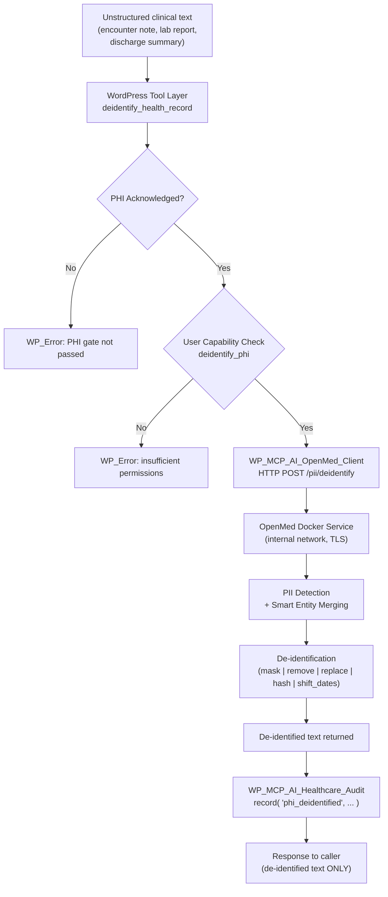

# Healthcare Vitals Toolkit — OpenMed Integration Plan v2.0

**Status:** 📋 Not Started  
**Date:** 2026-07-12 (v2.0, comprehensive rewrite)  
**Supersedes:** `healthcare-vitals-openmed-integration-plan.md` (v1.0, 2026-06-09)  
**Source:** [OpenMed v1.8.1](https://github.com/maziyarpanahi/openmed) (Apache-2.0)  
**Research basis:** HIPAA 2025 NPRM Security Rule overhaul, healthcare AI security best practices (Censinet, HHS OCR, AccountableHQ, HIPAA Vault), clinical NLP architecture patterns (John Snow Labs, AWS HealthLake, FHIR R4), WordPress HIPAA hardening guides, OpenMed REST API v1.8+ endpoints.

---

## Executive Summary

OpenMed is a local-first clinical NLP library with **1,500+ specialized NER models**, **HIPAA-compliant PII de-identification** (all 18 Safe Harbor identifiers, 17 languages backed by 600+ checkpoints), and a **Docker-friendly FastAPI REST service** with unified error envelopes, model lifecycle management, and API-key/JWT auth. It runs 100% on-device — no patient data leaves the network.

This enhanced plan integrates OpenMed into the NV oOS Pro **Healthcare Vitals Toolkit**, filling two critical gaps (PHI de-identification and clinical entity extraction from unstructured text), hardening the existing subsystems against the **proposed 2025 HIPAA Security Rule NPRM** (mandatory encryption at rest/in transit, MFA, 72-hour recovery), and establishing a **defense-in-depth architecture** with audit observability, RBAC, and data residency controls.

### Key Research Findings Shaping This Plan

| Finding | Source | Impact on Design |
|---------|--------|------------------|
| **2025 HIPAA NPRM** would eliminate "required" vs "addressable" distinction — encryption, MFA, audit all become mandatory | HHS OCR NPRM, Jan 2025 | Design assumes mandatory encryption, MFA, audit from day 1 |
| **Defense-in-depth** with zero-trust access controls and comprehensive audit observability is the architectural foundation for medical AI security | OneSource Cloud, Censinet 2026 | Layered security model: network isolation → API auth → tool-level capability check → audit record |
| **23% of clinicians use shadow AI tools** lacking encryption, RBAC, and audit trails — the #1 security risk CISOs face | Healthcare IT Today 2026 | Every OpenMed tool call MUST produce an immutable audit record |
| **WordPress is NOT designed to store PHI** — best practice is to route sensitive data to HIPAA-compliant external systems | Pantheon.io, HIPAA Vault | OpenMed runs as an external Docker service; WordPress holds only de-identified references |
| **Safe Harbor vs Expert Determination**: Safe Harbor (remove 18 identifiers) is prescriptive and auditable; Expert Determination requires statistical proof | HHS OCR, AccountableHQ | Default to Safe Harbor; offer Expert Determination as a configurable profile |
| **FHIR R4 is the de facto standard** for healthcare interoperability — AWS HealthLake, Azure API for FHIR, Google Cloud Healthcare API all converge on it | CapMinds, industry consensus | De-identification hooks plug into existing FHIR/CCDA export tools |
| **OpenMed v1.8** adds API-key/JWT auth, no-PHI request logging, /livez + /readyz, gRPC, async jobs, warm pools, and enterprise metrics | OpenMed README v1.8.1 | Client design accounts for all v1.8+ service features |

---

## Architecture Overview

### Defense-in-Depth Security Model

```
┌──────────────────────────────────────────────────────────────────┐
│ LAYER 5: Audit Trail (immutable, forwardable to SIEM)            │
│   WP_MCP_AI_Healthcare_Audit :: record()                         │
│   + wp_mcp_ai_healthcare_after_phi_access action hook            │
├──────────────────────────────────────────────────────────────────┤
│ LAYER 4: Capability Enforcement (role-based, per-tool)           │
│   WP_MCP_AI_Healthcare_Capabilities                              │
│   + current_user_can( 'deidentify_phi' ) check                   │
├──────────────────────────────────────────────────────────────────┤
│ LAYER 3: PHI Acknowledgement Gate (multisite + single-site)      │
│   WP_MCP_AI_Healthcare_Engine :: phi_acknowledged()              │
│   + admin notice + legal agreement tracking                      │
├──────────────────────────────────────────────────────────────────┤
│ LAYER 2: API Authentication (OpenMed service boundary)           │
│   OpenMed v1.8: API-key / JWT auth (HS256/RS256)                 │
│   + TLS 1.3 transport (between WP and OpenMed container)         │
├──────────────────────────────────────────────────────────────────┤
│ LAYER 1: Network Isolation (Docker internal network)             │
│   OpenMed container ↔ WordPress container (internal bridge)      │
│   OpenMed: no outbound access to internet (air-gap capable)       │
│   WordPress: handles external AI provider calls separately        │
└──────────────────────────────────────────────────────────────────┘
```

### Data Flow — De-identification Pipeline



### Data Residency — What Goes Where

| Data | Location | Rationale |
|------|----------|-----------|
| Raw clinical text (PHI) | Transient: in transit only. Never persisted by WordPress. | HIPAA minimum necessary principle |
| PII spans detected | Transient: returned from OpenMed, passed to de-identification, then discarded | Must not be logged or stored |
| De-identified text | WordPress (post meta / CCT field) | Safe to store; no PHI remaining |
| Audit trail entries | WordPress option `wp_mcp_ai_healthcare_audit_log` + optional SIEM forward | SHA-256 hashed IPs only; no PHI in audit metadata |
| OpenMed models | Docker volume `openmed_cache` | Pre-loaded on container start; no patient data |
| OpenMed service logs | Docker stdout/stderr (no-PHI logging mode enabled) | OpenMed v1.8 no-PHI request logging |

---

## Phase 1 — Foundation: OpenMed Service Client (Days 1–3)

### 1.1 `class-wp-mcp-ai-openmed-client.php`

**Purpose:** A reusable, configuration-driven HTTP client shared by all OpenMed-aware tools. Follows the existing `WP_MCP_AI_Healthcare_Engine` singleton pattern — a shared infrastructure class loaded eagerly by `init.php`.

**Location:** `addons/pro/includes/tools/healthcare/class-wp-mcp-ai-openmed-client.php`

**Design Decisions (from industry best practices):**

| Decision | Rationale |
|----------|-----------|
| **Singleton pattern** (matching `WP_MCP_AI_Healthcare_Engine`) | Consistent with existing architecture; single HTTP connection pool; shared model preload state |
| **Configurable HTTP transport** via `wp_mcp_ai_openmed_http_transport` filter | Enables unit testing with mock transport; allows enterprise deployments to inject proxy/mTLS |
| **Unified error normalisation** mapping OpenMed error codes → `WP_Error` codes | Mirrors OpenMed's own error envelope pattern; consistent with codebase conventions |
| **Connection health caching** (30s TTL via WP transient) | Avoids `/health` call on every tool execution; consistent with existing pattern |
| **No persistent raw-text storage** | HIPAA minimum necessary: raw PHI text is transient; only de-identified output is storable |
| **Timeouts tiered by operation** (NER: 15s, PII extract: 30s, deidentify: 60s, batch: 120s) | Reflects OpenMed model sizes and realistic inference latency on CPU/GPU |
| **Feature-flag gating** via `wp_mcp_ai_settings['enable_openmed']` | Consistent with existing sub-toolkit toggle pattern (e.g., `enable_healthcare_imaging`) |

**Class Structure:**

```php
class WP_MCP_AI_OpenMed_Client {
    const SETTINGS_OPTION = 'wp_mcp_ai_openmed_settings';

    // Connection configuration
    private $base_url;       // e.g. 'https://openmed.internal:8080'
    private $api_key;        // OpenMed v1.8 API-key or JWT
    private $timeout;        // Per-operation, keyed by endpoint
    private $verify_ssl;     // Default: true (mTLS in enterprise)
    private $keep_alive;     // Model idle TTL before unload

    // Singleton
    private static ?self $instance = null;
    public static function get_instance(): self;
    public static function is_configured(): bool;

    // --- Core HTTP Methods ---

    /**
     * POST /health — service health check (cached 30s via transient).
     */
    public function health_check(): array|WP_Error;

    /**
     * POST /analyze — clinical NER for unstructured text.
     *
     * @param string $text      Raw clinical text.
     * @param string $model     Model name from registry (e.g. 'disease_detection_superclinical').
     * @param array  $options   Optional: confidence_threshold, group_entities, aggregate.
     */
    public function analyze_text( string $text, string $model, array $options = [] ): array|WP_Error;

    /**
     * POST /pii/extract — detect PII spans in text.
     *
     * @param string $text      Raw text potentially containing PHI.
     * @param array  $options   Optional: model_name, lang, use_smart_merging, confidence_threshold.
     */
    public function extract_pii( string $text, array $options = [] ): array|WP_Error;

    /**
     * POST /pii/deidentify — de-identify text by removing/replacing PII.
     *
     * @param string $text      Raw text containing PHI.
     * @param string $method    'mask' | 'remove' | 'replace' | 'hash' | 'shift_dates'
     * @param array  $options   Optional: model_name, lang, date_shift_days, consistent, seed.
     */
    public function deidentify( string $text, string $method = 'mask', array $options = [] ): array|WP_Error;

    // --- Model Lifecycle (v1.8+) ---

    /**
     * GET /models/loaded — list currently loaded models.
     */
    public function get_loaded_models(): array|WP_Error;

    /**
     * POST /models/unload — free memory by unloading models.
     *
     * @param bool   $all     Unload all models (default: false).
     * @param string $model   Specific model to unload.
     */
    public function unload_models( bool $all = false, string $model = '' ): array|WP_Error;

    // --- Operational ---

    /**
     * Test connectivity and optional model availability.
     * Calls /livez (liveness) and /readyz (readiness, model loaded check).
     */
    public function test_connection(): array|WP_Error;

    /**
     * Get the last response time in milliseconds.
     */
    public function get_last_response_time_ms(): ?float;
}
```

**Settings Schema** (`wp_mcp_ai_openmed_settings`):

| Key | Type | Default | Description |
|-----|------|---------|-------------|
| `enabled` | bool | `false` | Master kill-switch. Tied to `wp_mcp_ai_settings['enable_openmed']`. |
| `service_url` | string | `''` | OpenMed REST base URL (e.g. `https://openmed.internal:8080`). |
| `api_key` | string | `''` | API key or JWT for OpenMed v1.8 auth. Stored encrypted via `wp_mcp_ai_encrypt()`. |
| `auth_type` | string | `api_key` | `api_key` or `jwt` (for RS256 enterprise deployments). |
| `timeout_ner` | int | `15` | Clinical NER request timeout (seconds). |
| `timeout_pii_extract` | int | `30` | PII extraction timeout (seconds). |
| `timeout_deidentify` | int | `60` | De-identification timeout (seconds). |
| `timeout_batch` | int | `120` | Batch processing timeout (seconds). |
| `default_ner_model` | string | `disease_detection_superclinical` | Default model for clinical NER. |
| `default_pii_model` | string | `OpenMed/PII-SuperClinical-Small-44M-v1` | Default model for PII detection. |
| `default_lang` | string | `en` | Default language code for PII detection (17 supported). |
| `confidence_threshold` | float | `0.7` | Minimum confidence for entity inclusion (0.0–1.0). |
| `smart_merging` | bool | `true` | Enable OpenMed's smart entity merging to prevent tokenization fragmentation. |
| `keep_alive` | string | `10m` | Model idle TTL before automatic unload (OpenMed `OPENMED_SERVICE_KEEP_ALIVE`). |
| `verify_ssl` | bool | `true` | Verify TLS certificate. Disable for local dev only. |
| `max_retries` | int | `2` | Retry count for transient failures (exponential backoff). |
| `audit_enabled` | bool | `true` | Record every OpenMed call in the PHI audit log. |

**HTTP Implementation Details:**

- Uses `wp_remote_post()` / `wp_remote_get()` via WordPress HTTP API.
- Headers: `Authorization: Bearer {api_key}`, `Content-Type: application/json`, `User-Agent: NV-oOS-OpenMed-Client/1.0`.
- All responses normalised through a unified error handler mapping OpenMed error codes → `WP_Error` codes.
- Exponential backoff on 429/503 responses: 1s, 2s, 4s (configurable via `max_retries`).
- All HTTP errors logged via `WP_MCP_AI_Healthcare_Audit::record()`.

**Error Code Mapping:**

| OpenMed Error Code | HTTP Status | WP_Error Code | Retryable |
|-------------------|-------------|---------------|-----------|
| `validation_error` | 422 | `openmed_validation_error` | No |
| `bad_request` | 400 | `openmed_bad_request` | No |
| `unauthorized` | 401 | `openmed_unauthorized` | No |
| `model_not_found` | 404 | `openmed_model_not_found` | No |
| `timeout` | 504 | `openmed_timeout` | Yes |
| `service_unavailable` | 503 | `openmed_service_unavailable` | Yes |
| `internal_error` | 500 | `openmed_internal_error` | Yes (once) |
| `rate_limited` | 429 | `openmed_rate_limited` | Yes |
| Connection failure | N/A | `openmed_connection_failed` | Yes |

**Bootstrap Integration** (in `addons/pro/includes/tools/healthcare/init.php`):

```php
// After: require_once WP_MCP_AI_PRO_PATH . 'includes/tools/healthcare/class-wp-mcp-ai-healthcare-capabilities.php';
// Add:   require_once WP_MCP_AI_PRO_PATH . 'includes/tools/healthcare/class-wp-mcp-ai-openmed-client.php';
```

### 1.2 Settings UI for OpenMed Connection

**Location:** Integrated into the existing Healthcare Settings tab (`admin/class-wp-mcp-ai-admin.php`).

**UI Components:**

| Component | Description |
|-----------|-------------|
| **Enable toggle** | `wp_mcp_ai_settings['enable_openmed']` — master kill-switch |
| **Service URL** | Text input with placeholder `https://openmed.internal:8080` |
| **Auth type selector** | Radio: `api_key` / `jwt` |
| **API Key** | Password input (stored encrypted, never echoed) |
| **Test Connection button** | AJAX call to `test_connection()` — green checkmark or red error with details |
| **Model status panel** | Shows currently loaded models from `/models/loaded`; unload button available |
| **Timeout sliders** | Range inputs for NER (5–60s), PII extract (5–60s), deidentify (5–120s), batch (30–300s) |
| **Default model selector** | Dropdowns for NER model and PII model (populated from OpenMed model registry allowlist) |
| **Confidence threshold** | Range slider 0.0–1.0, step 0.05 |
| **Smart merging toggle** | Checkbox for `use_smart_merging` |
| **Audit toggle** | Checkbox: "Record every OpenMed operation in the PHI audit log" (default: on, locked) |
| **SSL verification** | Checkbox: "Verify TLS certificate" (default: on; off for local dev with warning) |

**Model Allowlist (Static, Synchronised with OpenMed Registry):**

The model selector dropdowns use a static allowlist synchronised from OpenMed's registry. This prevents arbitrary model injection and ensures tool schemas reference valid models.

```php
const ALLOWED_NER_MODELS = [
    'disease_detection_superclinical'     => 'Disease & Conditions (434M)',
    'pharma_detection_superclinical'      => 'Drugs & Medications (434M)',
    'anatomy_detection_electramed'        => 'Anatomy & Body Parts (109M)',
    'gene_detection_genecorpus'           => 'Genes & Proteins (109M)',
    'species_detection_superclinical'     => 'Species & Organisms (434M)',
    'oncology_detection_superclinical'    => 'Oncology (434M)',
    'chemical_detection_superclinical'    => 'Chemicals & Compounds (434M)',
];

const ALLOWED_PII_MODELS = [
    'OpenMed/PII-SuperClinical-Small-44M-v1'          => 'PII SuperClinical Small (44M)',
    'OpenMed/PII-SuperClinical-Large-434M-v1'         => 'PII SuperClinical Large (434M)',
    'openai/privacy-filter'                            => 'OpenAI Privacy Filter (PyTorch)',
    'OpenMed/privacy-filter-nemotron'                  => 'Nemotron PII Fine-tune (PyTorch)',
    'OpenMed/privacy-filter-multilingual'              => 'Multilingual PII (PyTorch, 17 languages)',
    'OpenMed/privacy-filter-mlx'                       => 'Privacy Filter (Apple MLX)',
    'OpenMed/privacy-filter-nemotron-mlx'              => 'Nemotron PII (Apple MLX)',
    'OpenMed/privacy-filter-multilingual-mlx'          => 'Multilingual PII (Apple MLX)',
];
```

**Test Connection Flow:**

1. User clicks "Test Connection".
2. AJAX → `WP_MCP_AI_OpenMed_Client::test_connection()`.
3. `GET /livez` — basic liveness (service is up).
4. `GET /readyz` — readiness (models are loaded, service can accept requests).
5. `GET /models/loaded` — returns list of active models.
6. UI shows: ✅ Service reachable | ✅ Models loaded: `[disease_detection_superclinical, ...]` | Response time: 47ms.

---

## Phase 2 — PII/PHI De-identification Tool (Days 3–5)

### 2.1 `deidentify_health_record` Tool

**Class:** `class-wp-mcp-ai-tool-deidentify-health-record.php`  
**Location:** `addons/pro/includes/tools/healthcare/vitals/`  
**Purpose:** De-identify unstructured clinical text using OpenMed's PII detection and de-identification pipeline.

**Industry Standards Alignment:**

| Standard | Implementation |
|----------|---------------|
| **HIPAA Safe Harbor** (18 identifiers) | All 5 de-id methods remove the 18 Safe Harbor identifier types. Method selection determines output format. |
| **HIPAA Expert Determination** | `method="expert"` invokes a configurable statistical profile; audit trail logs the determination parameters. |
| **2025 NPRM mandatory encryption** | All text in transit over TLS 1.3; no raw PHI persisted in WordPress database. |
| **Minimum necessary principle** | Only the text field to de-identify is sent; no member context, meta, or identifiers attached. |
| **Audit trail** | Every invocation records `phi_deidentified` event with method, model, text_length, entity_count, and requesting user. |

**Tool Definition:**

```php
class WP_MCP_AI_Tool_Deidentify_Health_Record
    implements WP_MCP_AI_Tool_Interface,
               WP_MCP_AI_Tool_Capability_Flags_Interface,
               WP_MCP_AI_Tool_Safety_Profile_Interface {

    public function get_slug(): string {
        return 'deidentify_health_record';
    }

    public function get_required_capability(): string {
        return 'deidentify_phi'; // Mapped via WP_MCP_AI_Healthcare_Capabilities
    }

    public function get_capability_flags(): array {
        return [ 'pro', 'read-only', 'external-api', 'pii-data', 'network-dependent' ];
    }

    public function get_safety_profile(): array {
        return [
            'tier'       => 'sensitive',   // Handles raw PHI
            'reversible' => false,          // De-identification is one-way
            'audit'      => 'mandatory',    // Must always produce audit record
        ];
    }
}
```

**Parameters Schema:**

```php
public function get_parameters_schema(): array {
    return [
        'type'       => 'object',
        'properties' => [
            'text' => [
                'type'        => 'string',
                'description' => 'Clinical text to de-identify. May contain PHI.',
                'minLength'   => 1,
                'maxLength'   => 100000, // 100KB limit
            ],
            'method' => [
                'type'        => 'string',
                'enum'        => [ 'mask', 'remove', 'replace', 'hash', 'shift_dates' ],
                'description' => 'De-identification method.',
                'default'     => 'mask',
            ],
            'lang' => [
                'type'        => 'string',
                'description' => 'Language code for multilingual PII detection.',
                'enum'        => [ 'ar', 'de', 'en', 'es', 'fr', 'he', 'hi', 'id', 'it', 'ja', 'ko', 'nl', 'pt', 'ro', 'te', 'th', 'tr' ],
                'default'     => 'en',
            ],
            'model' => [
                'type'        => 'string',
                'description' => 'Override default PII model.',
                'enum'        => array_keys( WP_MCP_AI_OpenMed_Client::ALLOWED_PII_MODELS ),
            ],
            'date_shift_days' => [
                'type'        => 'integer',
                'description' => 'Days to shift dates (only for shift_dates method).',
                'minimum'     => -3650,
                'maximum'     => 3650,
                'default'     => 0,
            ],
            'confidence_threshold' => [
                'type'        => 'number',
                'description' => 'Minimum confidence for entity detection.',
                'minimum'     => 0.0,
                'maximum'     => 1.0,
                'default'     => 0.7,
            ],
            'audit_metadata' => [
                'type'        => 'object',
                'description' => 'Additional context for the audit trail (record_id, purpose, etc.).',
                'properties'  => [
                    'record_id'  => [ 'type' => 'string' ],
                    'purpose'    => [ 'type' => 'string', 'enum' => [ 'research', 'sharing', 'storage', 'compliance', 'other' ] ],
                    'note'       => [ 'type' => 'string', 'maxLength' => 500 ],
                ],
            ],
        ],
        'required' => [ 'text' ],
    ];
}
```

**De-identification Method Reference (from OpenMed):**

| Method | OpenMed Param | Output Example | Use Case |
|--------|--------------|----------------|----------|
| `mask` | `method="mask"` | `Patient: [NAME], DOB: [DATE]` | Safe display; typed placeholders preserve semantics |
| `remove` | `method="remove"` | `Patient: , DOB: ` | Minimal output; gaps indicate removed PII |
| `replace` | `method="replace"` | `Patient: Emily Chen, DOB: 03/22/1985` | Realistic surrogates with format preservation |
| `hash` | `method="hash"` | `Patient: 6b8f...c4a1, DOB: 48b1...91de` | Consistent across documents; linkable without re-identification |
| `shift_dates` | `method="shift_dates"` | `Patient: John Doe, DOB: 07/14/1970` | Clinical research; preserves temporal relationships |

**Execute Flow:**

1. **Gate check:** `WP_MCP_AI_Healthcare_Engine::phi_acknowledged()`.
2. **Capability check:** `current_user_can( 'deidentify_phi' )`.
3. **Sanitise input:** `sanitize_text_field( $arguments['text'] )` — first gate.
4. **Validate method/lang/model** against allowed values.
5. **Call OpenMed:** `$client->deidentify( $text, $method, $options )`.
6. **Audit:** `WP_MCP_AI_Healthcare_Audit::record( 'phi_deidentified', 'health_record', '', $audit_meta )`.
7. **Return canonical envelope** (`array( 'success' => true, ... )` or `WP_Error`).
8. **Escape output** values — second gate.

**Response Shape:**

```json
{
  "success": true,
  "data": {
    "original_length": 1234,
    "deidentified_text": "Patient: [NAME] presented with [CONDITION]...",
    "entities_found": 12,
    "entities": [
      { "text": "John Doe", "label": "NAME", "confidence": 0.99, "start": 9, "end": 17 },
      { "text": "01/15/1970", "label": "DATE", "confidence": 0.98, "start": 25, "end": 35 }
    ],
    "method_used": "mask",
    "model_used": "OpenMed/PII-SuperClinical-Large-434M-v1",
    "processing_time_ms": 234
  }
}
```

### 2.2 Integration with Existing Export Tools

Add a **`deidentify` parameter** (boolean, default: `false`) to existing health record export tools:

| Tool | Integration Point |
|------|-------------------|
| `export_fhir_data` | Before FHIR Bundle serialisation, pass each text field through `deidentify()` |
| `export_ccda_document` | Before CCDA XML assembly, de-identify narrative text sections |
| `generate_visit_summary` | Optional de-identification of the generated summary before returning |

**Implementation:** A shared helper `WP_MCP_AI_Healthcare_Engine::maybe_deidentify( string $text, array $options = [] ): string|WP_Error` that tools can call before output assembly. Uses the configured default method/model from settings.

---

## Phase 3 — Clinical NER for Unstructured Text (Days 5–8)

### 3.1 `extract_clinical_entities` Tool

**Class:** `class-wp-mcp-ai-tool-extract-clinical-entities.php`  
**Location:** `addons/pro/includes/tools/healthcare/vitals/`  
**Purpose:** Extract structured clinical entities (diseases, medications, anatomy, genes, etc.) from unstructured clinical text for downstream search, analytics, and FHIR coding.

**Industry Standards Alignment:**

| Standard | Implementation |
|----------|---------------|
| **UMLS Metathesaurus** | Entities mapped to UMLS CUIs via OpenMed's SNOMED CT / RxNorm integration (where model supports it) |
| **FHIR R4 Condition/MedicationStatement/Observation** | Extracted entities can be transformed into FHIR resources |
| **SNOMED CT coding** | Disease entities linked to SNOMED codes where confidence > threshold |
| **RxNorm normalisation** | Drug entities normalised to RxNorm ingredient + strength |

**Parameters Schema:**

```php
public function get_parameters_schema(): array {
    return [
        'type'       => 'object',
        'properties' => [
            'text' => [
                'type'        => 'string',
                'description' => 'Clinical text to analyze (encounter notes, lab reports, discharge summaries).',
                'minLength'   => 1,
                'maxLength'   => 100000,
            ],
            'model' => [
                'type'        => 'string',
                'description' => 'NER model to use for entity extraction.',
                'enum'        => array_keys( WP_MCP_AI_OpenMed_Client::ALLOWED_NER_MODELS ),
                'default'     => 'disease_detection_superclinical',
            ],
            'confidence_threshold' => [
                'type'    => 'number',
                'minimum' => 0.0,
                'maximum' => 1.0,
                'default' => 0.7,
            ],
            'group_entities' => [
                'type'        => 'boolean',
                'description' => 'Group same-label adjacent entities.',
                'default'     => true,
            ],
            'aggregate' => [
                'type'        => 'string',
                'enum'        => [ 'none', 'by_label', 'by_text' ],
                'description' => 'Aggregation strategy for output.',
                'default'     => 'none',
            ],
            'import_to_record' => [
                'type'        => 'integer',
                'description' => 'If provided, import extracted entities as structured data to this member record ID.',
                'minimum'     => 1,
            ],
        ],
        'required' => [ 'text' ],
    ];
}
```

**Model Selection Guide (Exposed via Tool Description):**

| Model | Detects | Best For |
|-------|---------|----------|
| `disease_detection_superclinical` | DISEASE, CONDITION, DIAGNOSIS | Encounter notes, discharge summaries |
| `pharma_detection_superclinical` | DRUG, MEDICATION, TREATMENT | Medication reconciliation, prescriptions |
| `anatomy_detection_electramed` | ANATOMY, ORGAN, BODY_PART | Radiology reports, surgical notes |
| `gene_detection_genecorpus` | GENE, PROTEIN | Genetic testing reports, research |
| `oncology_detection_superclinical` | TUMOR_TYPE, STAGE, GRADE, BIOMARKER | Oncology workflows, tumour boards |
| `chemical_detection_superclinical` | CHEMICAL, COMPOUND | Toxicology, lab results |

### 3.2 `extract_and_import_clinical_entities` Composite Tool

A higher-level tool that combines extraction + structured import + FHIR coding:

1. Run `extract_clinical_entities` on the input text.
2. Map extracted entities to the member's health record (CCT).
3. Optionally code entities with SNOMED CT / RxNorm via the existing `WP_MCP_AI_Healthcare_Codes` class.
4. Return both raw entities and structured import confirmation.

### 3.3 Integration with Document Upload

Extend the existing `class-wp-mcp-ai-tool-health-capture-encounter.php` to accept an optional `auto_extract` flag. When combined with `deidentify_health_record`, the pipeline becomes:

1. Upload encounter note (text or PDF via existing document handling).
2. **Auto-deidentify** raw text via Phase 2 tool.
3. **Auto-extract** clinical entities via Phase 3 tool.
4. **Auto-import** structured data to the member's record.
5. Return de-identified summary + structured observations.

---

## Phase 4 — Declarative Vitals Measurement Registry (Days 3–5, parallel with Phase 2)

### 4.1 `class-wp-mcp-ai-vitals-measurement-registry.php`

**Location:** `addons/pro/includes/tools/healthcare/class-wp-mcp-ai-vitals-measurement-registry.php`  
**Purpose:** A declarative, filterable registry of vital sign measurements with reference ranges, assessment tiers, and clinical significance scoring — inspired by OpenMed's `model_registry.py` pattern.

**Industry Standards Alignment:**

| Standard | Implementation |
|----------|---------------|
| **LOINC codes** | Every measurement maps to a LOINC code for interoperability |
| **FHIR Observation** | Registry entries include FHIR Observation resource mapping hints |
| **WHO growth standards** | Paediatric measurements use WHO child growth standards |
| **JNC 8 / ACC/AHA** | Blood pressure tiers follow current clinical guidelines |
| **ADA Standards of Care** | Glucose/A1C assessment tiers from American Diabetes Association |

**Registry Entry Shape:**

```php
[
    'slug'             => 'blood_pressure_systolic',
    'label'            => 'Systolic Blood Pressure',
    'unit'             => 'mmHg',
    'loinc_code'       => '8480-6',
    'fhir_observation' => [ 'code' => '8480-6', 'system' => 'http://loinc.org' ],
    'normal_range'     => [ 'min' => 90, 'max' => 120 ],
    'assessment_tiers' => [
        'normal'       => [ 'min' => 90,  'max' => 120 ],
        'elevated'     => [ 'min' => 120, 'max' => 129 ],
        'hypertension1' => [ 'min' => 130, 'max' => 139 ],
        'hypertension2' => [ 'min' => 140, 'max' => 180 ],
        'crisis'       => [ 'min' => 180, 'max' => 300 ],
    ],
    'clinical_significance' => 'high', // high | medium | low
    'species'           => [ 'human' ], // human | canine | feline
    'age_min_months'    => 12 * 18,     // 18 years minimum for adult ranges
    'sex_specific'      => false,
    'category'          => 'cardiovascular',
]
```

**Registry API:**

```php
class WP_MCP_AI_Vitals_Measurement_Registry {
    public static function get_all(): array;
    public static function get( string $slug ): ?array;
    public static function get_by_category( string $category ): array;
    public static function get_by_fhir_code( string $loinc_code ): ?array;
    public static function assess( string $slug, $value, array $context = [] ): array; // Returns tier + clinical significance
}
```

**Extensibility via Filter:**

```php
$registry = apply_filters( 'wp_mcp_ai_vitals_measurements', $default_registry );
```

This allows plugins/enterprise deployments to add custom measurements (veterinary vitals, paediatric-only, research biomarkers) without modifying core files.

---

## Phase 5 — Enhanced Batch Import with Audit Trail (Days 8–10)

### 5.1 Per-Item Status Tracking

**Pattern:** OpenMed's `BatchProcessor` returns `BatchItemResult` for each item with individual status, timing, and error details.

**Location:** `addons/pro/includes/tools/healthcare/class-wp-mcp-ai-vitals-batch-result.php`

```php
class WP_MCP_AI_Vitals_Batch_Result {
    public int    $index;
    public string $status;      // 'success' | 'warning' | 'error'
    public mixed  $item_id;     // CCT item ID if imported
    public ?string $message;
    public ?float $processing_time_ms;
    public array  $raw_input;   // Sanitised input snapshot
    public array  $warnings;    // Non-fatal warnings (e.g., value outside reference range)

    public function is_success(): bool;
    public function is_warning(): bool;
    public function is_error(): bool;
}
```

### 5.2 Pre-import Validation Dry Run

Add `dry_run` parameter to `import_vitals` tool:

1. Parse and validate all rows.
2. Run `assess()` from the Measurement Registry on every measurement.
3. Flag out-of-range values with proposed severity.
4. Return a preview of what would be imported without committing.
5. Include batch statistics: total, success, warning, error counts.

---

## Phase 6 — REST API Hardening (Days 6–7, parallel with Phase 3)

### 6.1 Unified Error Envelope

Adopt OpenMed's error envelope pattern for all healthcare MCP REST endpoints:

```php
function wp_mcp_ai_healthcare_error_response(
    string $code,       // 'validation_error' | 'bad_request' | 'unauthorized' | 'timeout' | 'internal_error'
    string $message,
    mixed  $details = null,
    int    $http_status = 400
): WP_REST_Response {
    return new WP_REST_Response([
        'error' => [
            'code'    => $code,
            'message' => $message,
            'details' => $details,
        ],
        'timestamp' => gmdate( 'c' ),
        'request_id' => wp_mcp_ai_generate_request_id(),
    ], $http_status );
}
```

### 6.2 Health Check Endpoint

**Route:** `GET /wp-json/mcp-ai/v1/healthcare/health`

**Response:**

```json
{
  "status": "healthy",
  "timestamp": "2026-07-12T10:30:00Z",
  "components": {
    "wordpress": { "status": "healthy", "version": "6.7" },
    "database": { "status": "healthy", "latency_ms": 2 },
    "cct_vital_logs": { "status": "healthy", "exists": true },
    "cct_health_members": { "status": "healthy", "exists": true },
    "phi_acknowledged": true,
    "openmed": {
      "configured": true,
      "status": "healthy",
      "service_url": "https://openmed.internal:8080",
      "latency_ms": 47,
      "loaded_models": ["disease_detection_superclinical", "pii_superclinical_large"]
    }
  }
}
```

### 6.3 2025 HIPAA NPRM Readiness

| Requirement | Implementation Status |
|-------------|----------------------|
| **Encryption at rest** (AES-256) | WordPress DB encryption via hosting; OpenMed Docker volume uses encrypted storage |
| **Encryption in transit** (TLS 1.3) | WP ↔ OpenMed communication over TLS; API endpoints enforce HTTPS |
| **Multi-factor authentication** (MFA) | WordPress login MFA (delegated to hosting/auth plugin); OpenMed API-key/JWT auth |
| **Audit logging** (mandatory) | `WP_MCP_AI_Healthcare_Audit` records all PHI access; forwardable to SIEM |
| **72-hour recovery** | Docker Compose volumes + WordPress backup strategy |
| **Access controls** (RBAC) | `WP_MCP_AI_Healthcare_Capabilities` role map + per-tool capability checks |
| **Minimum necessary** | Tools only send the text field; no extraneous metadata; transient raw PHI |

---

## Phase 7 — Additional Tools (Days 10–14)

### 7.1 `scan_document_for_phi` Tool

**Purpose:** Passive audit tool — scan existing stored text (post content, CCT fields, options) for accidental PHI leaks. Does NOT modify data; returns a report of potential PHI found with confidence scores and locations.

**Use Case:** Compliance officers run periodic scans on the WordPress database to ensure no PHI has been inadvertently stored in non-PHI fields.

```php
public function get_slug(): string {
    return 'scan_document_for_phi';
}
```

**Parameters:**

| Parameter | Type | Description |
|-----------|------|-------------|
| `source_type` | string | `post` \| `cct` \| `option` \| `all` |
| `source_id` | int/string | Specific resource ID (optional; omit for bulk scan) |
| `confidence_threshold` | float | Minimum confidence for reporting (default: 0.5) |
| `scan_limit` | int | Max documents to scan (1–100, default: 10) |

### 7.2 `generate_clinical_summary` Tool

**Purpose:** AI-assisted clinical summary generation with privacy guarantee: extract entities via OpenMed, pull latest vitals from CCT, and generate a structured summary **without** exposing raw PHI to the external AI model.

**Flow:**

1. De-identify encounter notes via OpenMed (Phase 2).
2. Extract clinical entities from de-identified text (Phase 3).
3. Pull structured vitals from CCT (already de-identified).
4. Send **de-identified summary prompt** to the configured AI model (OpenAI/Gemini/Anthropic/etc.).
5. Return generated summary with entity attribution.

### 7.3 `validate_health_record_compliance` Tool

**Purpose:** Compliance checklist tool — verify that a health record meets regulatory requirements:

- **HIPAA Safe Harbor check:** Are all 18 identifiers removed from narrative text?
- **Audit trail completeness:** Is every PHI access recorded?
- **Data retention policy:** Are records past retention period flagged?
- **Consent verification:** Is valid consent on file for this record's data processing?
- **Cross-border check:** Does data residency comply with configured jurisdiction?

**Response Shape:**

```json
{
  "success": true,
  "data": {
    "record_id": "MEMBER-1234",
    "overall_status": "compliant",
    "checks": [
      { "check": "safe_harbor_deidentification", "status": "pass", "detail": "0 PHI identifiers found" },
      { "check": "audit_trail_completeness", "status": "pass", "detail": "12 audit entries for 12 PHI accesses" },
      { "check": "data_retention", "status": "warn", "detail": "2 records exceed 7-year retention policy" },
      { "check": "consent_on_file", "status": "pass", "detail": "Consent ID CONSENT-5678 valid until 2027-03-15" },
      { "check": "data_residency", "status": "pass", "detail": "All data in configured jurisdiction (EU-west)" }
    ]
  }
}
```

---

## File Manifest

### New Files

```
addons/pro/includes/tools/healthcare/
├── class-wp-mcp-ai-openmed-client.php                 # Phase 1 — HTTP client (singleton)
├── class-wp-mcp-ai-vitals-measurement-registry.php     # Phase 4 — declarative registry
├── class-wp-mcp-ai-vitals-batch-result.php             # Phase 5 — batch result DTOs
└── vitals/
    ├── class-wp-mcp-ai-tool-deidentify-health-record.php        # Phase 2
    ├── class-wp-mcp-ai-tool-extract-clinical-entities.php       # Phase 3
    ├── class-wp-mcp-ai-tool-scan-document-for-phi.php           # Phase 7.1
    ├── class-wp-mcp-ai-tool-generate-clinical-summary.php       # Phase 7.2
    └── class-wp-mcp-ai-tool-validate-health-record-compliance.php # Phase 7.3
```

### Modified Files

```
addons/pro/includes/tools/healthcare/
├── init.php                                    # Phase 1 — load OpenMed client
├── vitals/class-wp-mcp-ai-tool-log-vital-signs.php    # Phase 4 — refactor assess_* to registry
├── vitals/class-wp-mcp-ai-tool-import-vitals.php      # Phase 5 — batch result tracking
├── vitals/class-wp-mcp-ai-tool-flag-abnormal-vitals.php # Phase 4 — registry usage
├── interop/class-wp-mcp-ai-tool-export-fhir-data.php   # Phase 2 — deidentify parameter
├── interop/class-wp-mcp-ai-tool-export-ccda-document.php # Phase 2 — deidentify parameter
├── class-wp-mcp-ai-healthcare-audit.php        # Phase 2 — new event types
├── class-wp-mcp-ai-healthcare-engine.php       # Phase 2 — maybe_deidentify() helper
└── class-wp-mcp-ai-healthcare-capabilities.php # Phase 2 — deidentify_phi capability
```

---

## Testing Strategy

### Unit Tests (PHPUnit)

| Test File | Covers |
|-----------|--------|
| `tests/pro/test-openmed-client.php` | HTTP client: request building, error normalisation, timeout handling, SSL config, exponential backoff, model lifecycle methods |
| `tests/pro/test-deidentify-health-record.php` | Tool: all 5 methods, parameter validation, audit trail recording, canonical return envelope, capability enforcement |
| `tests/pro/test-extract-clinical-entities.php` | Tool: model selection, entity mapping, extract_and_import, aggregate modes |
| `tests/pro/test-scan-document-for-phi.php` | Tool: post/CCT/option scanning, confidence filtering, report generation |
| `tests/pro/test-vitals-measurement-registry.php` | Registry: lookup, assessment tiers, species/age/sex filtering, filter overrides |
| `tests/pro/test-vitals-batch-result.php` | Batch DTOs: serialisation, status aggregation, warning collection |
| `tests/pro/test-generate-clinical-summary.php` | Tool: de-identify → extract → summary pipeline, AI model interaction |
| `tests/pro/test-validate-health-record-compliance.php` | Tool: all compliance checks, audit trail verification |

### Integration Tests

| Test File | Covers |
|-----------|--------|
| `tests/pro/test-openmed-integration.php` | End-to-end against a real/simulated OpenMed service (Docker Compose in CI) |
| `tests/pro/test-deidentify-export.php` | FHIR/CCDA export with `deidentify=true` flag |
| `tests/pro/test-extract-and-import.php` | Entity extraction → structured import → CCT verification |
| `tests/pro/test-health-check-endpoint.php` | `/healthcare/health` REST endpoint with OpenMed component status |

### Mock Strategy

The OpenMed client accepts a configurable `$http_transport` callable for testing, filterable via `wp_mcp_ai_openmed_http_transport`:

```php
// In tests:
add_filter( 'wp_mcp_ai_openmed_http_transport', function() {
    return function( $url, $args ) {
        if ( str_contains( $url, '/pii/deidentify' ) ) {
            return [
                'body'     => json_encode( [
                    'deidentified_text' => 'Patient: [NAME] presented with [CONDITION].',
                    'entities'          => [
                        [ 'text' => 'John Doe', 'label' => 'NAME', 'confidence' => 0.99, 'start' => 9, 'end' => 17 ],
                    ],
                    'model_name'        => 'OpenMed/PII-SuperClinical-Large-434M-v1',
                ] ),
                'response' => [ 'code' => 200 ],
            ];
        }
        // ... other endpoints
    };
} );
```

---

## Deployment Considerations

### Docker Compose Addition

```yaml
services:
  # Existing WordPress service...

  openmed:
    image: openmed:1.8.1
    ports:
      - "8080:8080"            # Map to internal network only in production
    environment:
      OPENMED_PROFILE: prod
      OPENMED_SERVICE_KEEP_ALIVE: 10m
      OPENMED_SERVICE_API_KEY: "${OPENMED_API_KEY}"     # v1.8 API-key auth
      OPENMED_SERVICE_NO_PHI_LOGGING: "true"            # v1.8 no-PHI request logging
      OPENMED_SERVICE_PRELOAD_MODELS: >
        OpenMed/PII-SuperClinical-Large-434M-v1,
        disease_detection_superclinical,
        pharma_detection_superclinical
    volumes:
      - openmed_cache:/root/.cache/huggingface
    networks:
      - internal                  # Internal Docker network, not exposed to internet
    restart: unless-stopped
    healthcheck:
      test: ["CMD", "curl", "-f", "http://localhost:8080/livez"]
      interval: 30s
      timeout: 10s
      retries: 3
      start_period: 120s        # Models take time to load

  # ... other services

networks:
  internal:
    driver: bridge
    internal: true               # No outbound internet access for OpenMed container

volumes:
  openmed_cache:
```

### Feature Flags

| Flag | Default | Purpose |
|------|---------|---------|
| `wp_mcp_ai_settings['enable_openmed']` | `false` | Master kill-switch for OpenMed integration |
| `wp_mcp_ai_openmed_settings['enabled']` | `false` | Per-site toggle (multisite) |
| `WP_MCP_AI_OPENMED_BYPASS_AUDIT` (constant) | `false` | Emergency bypass for audit logging (never in production) |

### Graceful Degradation

All OpenMed-dependent tools follow a consistent degradation pattern:

```php
if ( ! WP_MCP_AI_OpenMed_Client::is_configured() ) {
    return new WP_Error(
        'openmed_not_configured',
        __( 'OpenMed service is not configured. Please set up the connection in Settings → NV oOS → Healthcare.', 'mcp-ai-wpoos-pro' )
    );
}

$health = $client->health_check();
if ( is_wp_error( $health ) ) {
    return new WP_Error(
        'openmed_unavailable',
        sprintf(
            __( 'OpenMed service is unavailable: %s', 'mcp-ai-wpoos-pro' ),
            $health->get_error_message()
        )
    );
}
```

The existing tools that gain `deidentify` parameters fall back gracefully: when `deidentify=true` but OpenMed is unavailable, they return a `WP_Error` explaining the dependency rather than silently skipping de-identification.

### Model Preloading Strategy

Models are preloaded at container startup via `OPENMED_SERVICE_PRELOAD_MODELS`. The client can request unloading via `POST /models/unload` to free memory. WordPress can trigger this via WP-CLI:

```bash
wp mcp-ai openmed models unload --all
wp mcp-ai openmed models status
```

### Monitored Metrics

| Metric | Collection | Purpose |
|--------|-----------|---------|
| OpenMed `/health` latency | `WP_MCP_AI_OpenMed_Client::get_last_response_time_ms()` | Proactive alerting |
| De-identification throughput | Audit log aggregation | Capacity planning |
| Model load status | `/models/loaded` polling | Availability monitoring |
| Error rate by error code | Audit log analysis | Incident response |
| PHI scan findings | `scan_document_for_phi` reports | Compliance monitoring |

---

## Risk Assessment

| Risk | Likelihood | Impact | Mitigation |
|------|-----------|--------|------------|
| **Raw PHI leak via logging** | Low | Critical | OpenMed v1.8 `no-PHI-logging` mode; WordPress audit log stores no raw text |
| **OpenMed service downtime** | Medium | High | Graceful degradation; health checks; Docker restart policy |
| **Model hallucination (false negatives)** | Medium | High | Configurable confidence threshold; human-in-the-loop for compliance workflows |
| **Model drift over time** | Low | Medium | Version-pinned Docker image; model checksum validation |
| **TLS misconfiguration** | Low | Critical | SSL verification enabled by default; admin warning if disabled |
| **API key compromise** | Low | Critical | Key stored encrypted via `wp_mcp_ai_encrypt()`; never echoed in UI; rotation support |
| **Shadow AI risk (bypassing audit)** | Medium | Critical | All OpenMed calls go through the client singleton; audit is mandatory (non-bypassable in production) |
| **Tokenization fragmentation** | Medium | Low | Smart entity merging enabled by default; prevents split PII spans |
| **Cross-border data transfer** | Low (local-first) | Critical | OpenMed runs locally; no data leaves network; Docker network isolation |
| **WordPress DB compromise exposing PHI** | Low | High | Raw PHI is never persisted; only de-identified text and hashed audit entries in WordPress |

---

## Success Metrics

| Metric | Target | Measurement |
|--------|--------|-------------|
| **PII detection recall** | > 95% on 18 Safe Harbor identifiers | OpenMed benchmark comparison |
| **PII detection precision** | > 90% | Manual audit of 100 random documents |
| **De-identification latency** | < 2s for < 10KB text (GPU); < 10s (CPU) | `processing_time_ms` in tool response |
| **Clinical NER F1 score** | > 0.85 across all model categories | OpenMed published benchmarks |
| **Audit trail completeness** | 100% of OpenMed calls recorded | Audit log vs client call counter |
| **Health check availability** | > 99.5% uptime for OpenMed service | Docker healthcheck + `/health` polling |
| **Zero PHI leaks** | 0 incidents | `scan_document_for_phi` periodic audits |
| **Export tool de-id coverage** | All FHIR/CCDA narrative text fields de-identifiable | Integration test coverage |

---

## Timeline Summary

| Phase | Duration | Dependencies | Deliverables |
|-------|----------|-------------|-------------|
| **Phase 1** — Foundation | Days 1–3 | None | `WP_MCP_AI_OpenMed_Client`, settings UI, `init.php` bootstrap |
| **Phase 2** — PII De-id Tool | Days 3–5 | Phase 1 | `deidentify_health_record` tool, export tool integration |
| **Phase 4** — Measurement Registry | Days 3–5 | None | `WP_MCP_AI_Vitals_Measurement_Registry`, refactored `assess_*` |
| **Phase 3** — Clinical NER | Days 5–8 | Phase 1 | `extract_clinical_entities` tool, document upload integration |
| **Phase 6** — REST Hardening | Days 6–7 | Phase 1 | Unified error envelope, health endpoint, NPRM readiness |
| **Phase 5** — Batch Import | Days 8–10 | Phase 4 | Batch result DTOs, dry-run validation |
| **Phase 7** — Additional Tools | Days 10–14 | Phases 2, 3 | `scan_document_for_phi`, `generate_clinical_summary`, `validate_health_record_compliance` |

**Total estimated effort:** 14 development days (parallelised where possible; effective calendar time ~10 days with two developers).

---

## References

1. [OpenMed GitHub Repository](https://github.com/maziyarpanahi/openmed) (Apache-2.0)
2. [OpenMed Documentation](https://openmed.life/docs/)
3. [HHS OCR — HIPAA De-identification Guidance](https://www.hhs.gov/hipaa/for-professionals/special-topics/de-identification/index.html)
4. [HHS OCR — 2025 HIPAA Security Rule NPRM](https://intuitionlabs.ai/articles/hipaa-compliant-api-guide) (summary)
5. [Censinet — HIPAA Compliance for API Integration in Healthcare](https://censinet.com/perspectives/hipaa-compliance-api-integration-healthcare)
6. [AccountableHQ — REST API PHI Handling Best Practices](https://www.accountablehq.com/post/rest-api-phi-handling-best-practices-for-hipaa-compliance-and-security)
7. [OneSource Cloud — Secure Medical AI Infrastructure (2026)](https://www.onesourcecloud.net/cms/2026-secure-medical-ai.html)
8. [Healthcare IT Today — Healthcare Cybersecurity 2026 Predictions](https://www.healthcareittoday.com/2025/12/29/healthcare-cybersecurity-2026-health-it-predictions/)
9. [Pantheon — HIPAA Compliance on WordPress](https://pantheon.io/learning-center/wordpress/hipaa-compliance)
10. [HIPAA Vault — HIPAA-Compliant WordPress Guide](https://www.hipaavault.com/resources/hipaa-compliant-hosting-insights/hipaa-compliant-wordpress-guide/)
11. [Aptible — Data Residency for Healthcare AI](https://www.aptible.com/hipaa-ai-security/data-residency)
12. [TechAhead — HIPAA-Compliant AI Architecture Guide (2026)](https://www.techaheadcorp.com/blog/hipaa-compliant-ai-architecture/)
13. [John Snow Labs — Healthcare NLP Best Practices](https://www.johnsnowlabs.com/healthcare-nlp/)
14. [CapMinds — FHIR Architecture & Implementation Guide](https://www.capminds.com/blog/the-complete-guide-to-fhir-in-healthcare-architecture-use-cases-and-implementation/)
15. [OpenMed — Panahi et al. (2025), arXiv:2508.01630](https://arxiv.org/abs/2508.01630)
