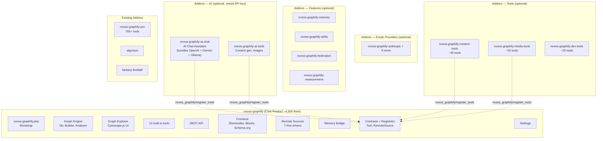

# NV oOS — Graphify-Centric Restructuring Roadmap

> **Version**: 3.0.0 | **Status**: Phase 0 Complete — In Progress (Phases 1-5 remain)
>
> **Last updated**: 2026-06-06
>
> This document is the **complete, phased restructuring roadmap** for transforming the NV oOS monolith into a Graphify-centric ecosystem where **`nvoos-graphify` (the knowledge graph product) is a standalone PSR-4 plugin that works with zero API keys**, and everything else (AI chat, tools, providers, features, integrations) extends it as truly optional addons.
>
> **Phase 0 (Core Product) is COMPLETE** as of 2026-06-05. The standalone `plugins/nvoos-graphify/` plugin ships with PSR-4 architecture, 14 built-in tools, 13 REST endpoints, Cytoscape.js explorer, 6 export formats, Schema.org injection, and 7 remote source drivers. See [§2.5 Phase 0 Completion Report](#25-phase-0-completion-report) for details.

---

## Table of Contents

1. [Why This Architecture](#1-why-this-architecture)
2. [Current State Analysis](#2-current-state-analysis)
3. [Phase 0 Completion Report](#25-phase-0-completion-report) ← **NEW**
4. [Target Architecture](#3-target-architecture)
5. [The Core Product: `nvoos-graphify`](#4-the-core-product-nvoos-graphify)
6. [What Moves to Addons](#5-what-moves-to-addons)
7. [Phased Execution Plan](#6-phased-execution-plan)
8. [Backward Compatibility Strategy](#7-backward-compatibility-strategy)
9. [Risk Assessment](#8-risk-assessment)
10. [Success Metrics](#9-success-metrics)

---

## 1. Why This Architecture

### The key insight: Graphify works without AI

The current monolith (`mcp-ai-wpoos.php`) is an AI chat assistant first, with everything else bolted on. But the `addons/graphify/` sub-plugin demonstrates something powerful: **you can deliver immediate, visual value without requiring a single API key.**

| | AI Chat Assistant | Knowledge Graph |
|---|---|---|
| **First-run experience** | "Enter your OpenAI API key first" | "Click Build Graph" — works immediately |
| **Works offline?** | ❌ No | ✅ Yes |
| **Requires configuration?** | API key + model selection | Zero config needed |
| **Delivers visual result?** | Text chat | Interactive Cytoscape.js visualization |
| **Sellable on its own?** | ✅ Yes (competing with Jetpack AI) | ✅ Yes (unique in WP ecosystem) |
| **Natural upgrade path?** | Buy more tools | Add AI to your knowledge graph |

Graphify is the **better anchor product** because:
1. It delivers value in 10 seconds (one click → visual graph).
2. It requires no external service. No API key. No account. No cost.
3. It's unique — nothing else on wp.org does interactive knowledge graphs.
4. AI is a natural upgrade: "Now add AI to your graph" is a powerful upsell.

### The pivot

```
BEFORE (previous plan):                     AFTER (this plan):
┌──────────────────┐                        ┌──────────────────┐
│   nvoos (core)   │  AI Chat + 30 tools    │ nvoos-graphify   │  Knowledge Graph
│   ───────────    │  + 3 providers         │   (core)         │  + Cytoscape.js
│                  │                        │   ───────────    │  + 14 tools
│   addons/        │  Extended tools        │                  │
│   ├── tools/     │  More providers        │   addons/        │  AI Chat (optional)
│   ├── features/  │  Memory, skills...     │   ├── ai-chat/   │  + 30 tools (optional)
│   └── graphify/  │  Already separate      │   ├── providers/ │  OpenAI, Gemini...
│                  │                        │   ├── features/  │  Memory, skills...
│                  │                        │   └── tools/     │  165 extended tools
└──────────────────┘                        └──────────────────┘
    Core = AI Chat                              Core = Knowledge Graph
    Graphify = addon                            AI Chat = addon
```

---

## 2. Current State Analysis

### What the monolith looks like today

```
mcp-ai-wpoos.php                            # ~140 lines — main plugin bootstrap
├── includes/bootstrap/loader.php           # ~748 lines — manual require_once chain
├── includes/class-wp-mcp-ai-plugin.php     # ~400 lines — singleton kernel
├── includes/tools/                         # ~195 tools (~20,000 lines)
├── includes/services/                      # Chat, memory, skills, federation... (~25,000 lines)
├── includes/admin/                         # Admin UI (~15,000 lines, 75+ classes)
├── includes/rest/                          # REST API (~8,000 lines)
├── includes/integrations/                  # Elementor, WooCommerce, JetEngine (~10,000 lines)
├── includes/infrastructure/providers/      # 13 provider clients (~3,000 lines)
├── includes/assistants/                    # Assistant CPT
├── includes/blueprints/                    # Blueprint installer
├── ... (30+ more directories)
│
├── addons/graphify/                        # ★ The knowledge graph (~8,000 lines)
├── addons/pro/                             # Pro tools (~50,000+ lines)
├── addons/algorave/                        # Live music coding
├── addons/fantasy-football/                # Fantasy football
└── ... (14 total addons)
```

### What `addons/graphify/` currently contains (what gets absorbed)

```
addons/graphify/
├── nvoos-graphify.php                      # Bootstrap (~50 lines)
├── includes/
│   ├── class-graphify-db.php               # 4 custom tables
│   ├── class-graphify-builder.php          # Node/edge pipeline
│   ├── class-graphify-analyzer.php         # Community detection
│   ├── class-graphify-exporter.php         # 5 export formats
│   ├── class-graphify-rest.php             # REST API
│   ├── class-graphify-tools.php            # 14 built-in tools
│   ├── class-graphify-remote-registry.php  # Remote source engine
│   ├── class-graphify-remote-drivers/      # 20+ remote source drivers
│   ├── class-graphify-template.php         # Shortcode
│   ├── class-graphify-admin-explorer.php   # Cytoscape.js admin page
│   └── ... (40+ files)
├── assets/
│   ├── js/cytoscape/                       # cytoscape.js + plugins
│   ├── js/admin.js                         # Graph explorer JS
│   └── css/admin.css
└── tests/
```

This code is already ~8,000 lines of working, tested production code. It needs no rewrite — just namespace migration, hook prefix updates, and integration into the proper PSR-4 directory structure.

### Dependency analysis: what graphify actually needs from the base

The existing `addons/graphify/` depends on the base plugin for only 3 things:

| Dependency | What graphify uses it for | Replacement |
|---|---|---|
| `WP_MCP_AI_Tool_Interface` | Tool contract (graphify's 14 tools implement this) | Move the interface into `nvoos-graphify` as `NvoosGraphify\Contracts\Tool` |
| `wp_mcp_ai_get_embedding()` | AI embeddings for memory bridge | AI provider addons register their own embedding function |
| `wp_mcp_ai_chat_completion()` | AI chat completion | AI chat addon handles this |

**That's it.** Graphify's core functionality (building graphs, Cytoscape.js visualization, content gap analysis, 5 export formats, 7 remote source drivers, Schema.org injection) uses **zero** base plugin dependencies. The AI functions are only used by the optional memory bridge, which can be adapted to use provider addons.

---

## 2.5 Phase 0 Completion Report

> **Completed**: 2026-06-05 | **Branch**: `feature/nvoos-graphify-core-buildout` → merged to `alpha-working`
>
> Phase 0 produced a complete, standalone, PSR-4 WordPress plugin at `plugins/nvoos-graphify/`. The implementation took a **from-scratch rebuild** approach rather than absorbing/renaming the legacy `addons/graphify/` addon, resulting in a cleaner, modern codebase with no legacy entanglement.

### What was built (9 sub-phases — all complete)

| Sub-phase | Status | Key Deliverables |
|---|---|---|
| **Phase 1 — Foundation** | ✅ Done | `Contracts/Tool.php`, `Contracts/RemoteSource.php`, `Schema.php` (centralized constants), `Settings.php` (single-option accessor), `ToolRegistry.php`, `Plugin.php` (composition root) |
| **Phase 2 — Graph Engine** | ✅ Done | `Graph/Db.php` (5 custom tables via `dbDelta`), `Graph/StructuralExtractor.php`, `Graph/Builder.php`, `Graph/Detector.php`, `Graph/SemanticExtractor.php` |
| **Phase 3 — Graph Features** | ✅ Done | `Graph/Analyzer.php` (Louvain community detection, god nodes, stats), `Graph/Exporter.php` (6 formats: JSON, GraphML, CSV, Neo4j, Obsidian, HTML), `Graph/Report.php` (content gaps, orphans) |
| **Phase 4 — Tools** | ✅ Done | 14 built-in tools extending `AbstractTool`: GetNode, QueryGraph, GetNeighbors, BuildGraph, GraphStats, ShortestPath, ContentGaps, GodNodes, SuggestLinks, RetrieveContext, ResolveExternal, ListRemoteSources, SyncRemoteSource, GetCommunity |
| **Phase 5 — REST + Admin** | ✅ Done | `Rest/Controller.php` (13 endpoints at `nvoos-graphify/v1`, proper capability checks), `Admin/SettingsPage.php` (tabbed UI), `Admin/GraphExplorer.php` (Cytoscape.js), `Admin/RemoteAdmin.php` |
| **Phase 6 — Frontend** | ✅ Done | `Frontend/Shortcode.php` (`[nvoos_graph]`), `Frontend/Block.php` (Gutenberg), `Frontend/SchemaOrg.php` (JSON-LD), `Frontend/RelatedContent.php` |
| **Phase 7 — Remote Sources** | ✅ Done | `Remote/Registry.php`, `Remote/HttpClient.php`, `Remote/Crypto.php`, `Remote/Enricher.php`, `Remote/StateStore.php`, 7 free drivers: Wikidata, GenericRest, RssSitemap, Sparql, WooCommerce, Csv, Webhook |
| **Phase 8 — Memory Bridge** | ✅ Done | `Memory/Bridge.php`, `Memory/EmbeddingsOnIngest.php`, `Memory/Embeddings.php` — agent memory bridge + vector embeddings |
| **Phase 9 — Release Prep** | ✅ Done | `readme.txt` (wp.org format with screenshots), `CHANGELOG.md`, `phpcs.xml.dist`, `.distignore`, `composer.json` with full dev tooling, `uninstall.php` |

### Architecture highlights

- **PSR-4 autoloading**: `NvoosGraphify\` namespace → `src/` directory, with `spl_autoload_register` fallback (no Composer required at runtime)
- **Singleton composition root**: `Plugin.php` wires 9 subsystems via `register()`
- **Contract-first**: `Tool` interface (7 methods) and `RemoteSource` interface
- **Centralized constants**: `Schema.php` holds all option keys, table names, hooks, caps, nonces
- **Grouped settings**: Single `nvoos_graphify_settings` option with per-tab sanitisation
- **Proper lifecycle**: `nvoos-graphify.php` bootstrap, `uninstall.php` for full cleanup, activation/deactivation hooks with cron management
- **PHP 8.1+** (`declare(strict_types=1)`) — stricter than the original plan's PHP 7.4+
- **WordPress 6.5+** required (enables `Requires Plugins` header for addon dependency chain)

### What the new core does NOT have (compared to the old `addons/graphify/`)

| Feature | Status | Notes |
|---|---|---|
| Enterprise SaaS remote drivers (Jira, Slack, M365, ServiceNow, GitHub, Google Drive, HubSpot, Zendesk, Generic GraphQL, Generic SQL, S3) | ❌ Deferred | Belong in the future `nvoos-graphify-pro` addon — these are enterprise-tier and require API keys anyway |
| OOS Federation driver | ❌ Deferred | Requires the base plugin's MCP protocol; will ship as part of `nvoos-graphify-federation` addon |
| OAuth broker + field mapper/validator | ❌ Deferred | Enterprise features; belong in `nvoos-graphify-pro` |
| `class-nvoos-graphify-nvoos-bridge.php` | ❌ Removed | This was the AI bridge to the base plugin — no longer needed in standalone core |
| AI chat dependency | ❌ Removed | Zero base-plugin dependencies; AI is strictly addon territory |
| `WP_MCP_AI_Tool_Interface` dependency | ❌ Removed | Replaced by `NvoosGraphify\Contracts\Tool` |

### What still exists in `addons/graphify/` (legacy)

The old addon remains at `addons/graphify/` (version 0.6.0, ~60 PHP files, ~20 remote drivers). It continues to work with the base plugin and is still actively maintained (bug fixes, WPCS compliance). As adoption of the new standalone core grows, this legacy addon will be deprecated in favor of the new PSR-4 plugin + addon ecosystem.

### Remaining Phase 0 work (compatibility bridge)

These items were in the original Phase 0 plan (Weeks 3-4) and are still TODO:

- [ ] Add `Requires Plugins: nvoos-graphify` to `mcp-ai-wpoos.php` header
- [ ] Create backward-compat adapter: `WP_MCP_AI_Tool_Interface` extends `NvoosGraphify\Contracts\Tool`
- [ ] Wire dual hook registration: `wp_mcp_ai_register_tools` → `nvoos_graphify/register_tools`
- [ ] Mark old `wp_mcp_ai_*` functions as deprecated with `_deprecated_function()`
- [ ] Mark old hook names with `apply_filters_deprecated()` / `do_action_deprecated()`
- [ ] Write migration guide for existing NV oOS users
- [ ] Submit `nvoos-graphify` to wp.org plugin directory

---

## 3. Target Architecture

> **Key principle**: `nvoos-graphify` is the product. Everything else extends it. The graph engine works with zero API keys and delivers immediate visual value.



### Addon dependency chain

```
nvoos-graphify (core — works alone, zero API keys)
│
├── nvoos-graphify-ai-chat ──── requires: nvoos-graphify
│   │   (bundles OpenAI + Gemini + Ollama providers internally)
│   │   (user enters API key → immediately chats with AI)
│   │
├── nvoos-graphify-ai-tools ─── requires: nvoos-graphify + nvoos-graphify-ai-chat
│   │   (AI content gen, image creation, analysis — uses chat's provider)
│   │
├── nvoos-graphify-embeddings ─ requires: nvoos-graphify + nvoos-graphify-ai-chat
│   │
├── nvoos-graphify-content-tools ── requires: nvoos-graphify
├── nvoos-graphify-media-tools ──── requires: nvoos-graphify
├── nvoos-graphify-memory ────────── requires: nvoos-graphify + embeddings
├── nvoos-graphify-pro ──────────── requires: nvoos-graphify
│
├── nvoos-graphify-anthropic ────── requires: nvoos-graphify
│   │   (exotic providers — one plugin each, for users who want Claude/etc.)
├── nvoos-graphify-deepseek ─────── requires: nvoos-graphify
├── nvoos-graphify-openrouter ───── requires: nvoos-graphify
├── ... (10 exotic provider addons total)
│
└── meta-plugin: mcp-ai-wpoos.php ── requires: nvoos-graphify + bundles all addons
```

---

## 4. The Core Product: `nvoos-graphify`

### What it IS

A complete, marketable WordPress plugin that delivers immediate value. ~4,500 lines of PHP + bundled Cytoscape.js. See the [NV oOS Graphify Implementation Specification](./nvoos-graphify-implementation-spec.md) for the full technical spec.

### What it provides (zero config, zero API keys)

| # | Feature | User value |
|---|---|---|
| 1 | **One-click graph build** | Converts existing content into nodes and edges in ~10-30 seconds |
| 2 | **Cytoscape.js visualization** | Interactive, zoomable, clickable graph explorer |
| 3 | **14 built-in tools** | Query nodes, find neighbors, shortest path, community detection, content gaps |
| 4 | **5 export formats** | JSON, GraphML, CSV, Neo4j, Obsidian |
| 5 | **Content gap reports** | Orphan posts, underlinked pages, missed topic opportunities |
| 6 | **7 remote source drivers** | Wikidata, RSS, SPARQL, WooCommerce, CSV, webhooks, REST APIs |
| 7 | **Schema.org injection** | Automatic JSON-LD for SEO |
| 8 | **Related content widget** | "You might also like" based on graph proximity |
| 9 | **Agent memory bridge** | Connect AI agent memory to the knowledge graph (when AI is added) |
| 10 | **REST API** | Programmatic access for headless, SPA, or external consumers |
| 11 | **Tool contract + registry** | Extension point for all addons |
| 12 | **Admin settings** | Enable/disable features, configure post types, manage remote sources |

### What it does NOT have (and shouldn't)

- ❌ AI chat assistant → addon: `nvoos-graphify-ai-chat`
- ❌ AI content generation → addon: `nvoos-graphify-ai-tools`
- ❌ Vector embeddings → addon: `nvoos-graphify-embeddings`
- ❌ API keys → addon: AI chat addon handles its own providers internally
- ❌ Provider clients → addon: 3 common providers bundled in AI chat addon; 10 exotic providers as separate addons
- ❌ Extended tools (content CRUD, media ops, dev tools) → addon toolkits
- ❌ Agent memory, skills, federation, measurement → addon features
- ❌ Elementor, WooCommerce, JetEngine integrations → addon integrations
- ❌ Blueprints, slash commands, agent roles → addon features
- ❌ OOS engine, profiler, paper store → addon features

---

## 5. What Moves to Addons

Everything from the current monolith that is NOT the knowledge graph becomes a standalone addon plugin.

### Decision rule

**"Does a user need this to build and explore a knowledge graph?"** If no → addon.

### Complete Extraction Catalog

| # | Addon Slug | Current Location | Description | `Requires Plugins` | Est. Lines |
|---|---|---|---|---|---|
| **PROVIDERS** (exotic — one per provider) | | | | | |
| 1 | `nvoos-graphify-anthropic` | `class-wp-mcp-ai-anthropic-client.php` | Claude chat | `nvoos-graphify` | ~400 |
| 2 | `nvoos-graphify-deepseek` | `class-wp-mcp-ai-deepseek-client.php` | DeepSeek chat | `nvoos-graphify` | ~200 |
| 3 | `nvoos-graphify-openrouter` | `class-wp-mcp-ai-openrouter-client.php` | OpenRouter proxy | `nvoos-graphify` | ~200 |
| 4 | `nvoos-graphify-huggingface` | `class-wp-mcp-ai-huggingface-client.php` + datasets | HuggingFace inference | `nvoos-graphify` | ~500 |
| 5 | `nvoos-graphify-cloudflare` | `class-wp-mcp-ai-cloudflare-client.php` | Cloudflare AI Gateway | `nvoos-graphify` | ~200 |
| 6 | `nvoos-graphify-lmstudio` | `class-wp-mcp-ai-lm-studio-client.php` | LM Studio local LLM | `nvoos-graphify` | ~150 |
| 7 | `nvoos-graphify-nvidia` | `class-wp-mcp-ai-nvidia-client.php` | NVIDIA NIM | `nvoos-graphify` | ~200 |
| 8 | `nvoos-graphify-digitalocean` | `class-wp-mcp-ai-digitalocean-client.php` | DigitalOcean inference | `nvoos-graphify` | ~150 |
| 9 | `nvoos-graphify-kimi` | `class-wp-mcp-ai-kimi-client.php` | Kimi (Moonshot AI) | `nvoos-graphify` | ~150 |
| 10 | `nvoos-graphify-baseten` | `class-wp-mcp-ai-baseten-client.php` | Baseten inference | `nvoos-graphify` | ~150 |
| **AI FEATURES** | | | | | |
| 11 | `nvoos-graphify-ai-chat` | `includes/class-wp-mcp-ai-rest.php` + `services/chat*.php` + provider clients (OpenAI, Gemini, Ollama) | **AI Chat Assistant** — SSE streaming, tool-calling loop, admin chat UI, REST endpoints. **Bundles OpenAI + Gemini + Ollama providers internally.** User enters one API key and chats immediately. | `nvoos-graphify` | ~3,600 |
| 12 | `nvoos-graphify-ai-tools` | ~30 tools from `tools/` (AI generation, analysis) | AI content generation, image creation, readability + SEO analysis, semantic extraction | `nvoos-graphify`, `nvoos-graphify-ai-chat` | ~1,800 |
| 13 | `nvoos-graphify-embeddings` | Vector embedding service classes | Float32 vector embeddings, cosine similarity search, RAG retrieval | `nvoos-graphify`, `nvoos-graphify-ai-chat` | ~600 |
| **EXTENDED TOOLKITS** (~165 tools) | | | | | |
| 14 | `nvoos-graphify-content-tools` | ~40 tools from `tools/` | Extended content CRUD, bulk ops, taxonomies, custom post types | `nvoos-graphify` | ~2,000 |
| 15 | `nvoos-graphify-media-tools` | ~30 tools from `tools/` | Advanced image/video/audio, media library ops | `nvoos-graphify` | ~2,500 |
| 16 | `nvoos-graphify-dev-tools` | ~25 tools from `tools/` | Web search, shell exec, WP-CLI, GitHub, code analysis | `nvoos-graphify` | ~1,500 |
| 17 | `nvoos-graphify-seo-tools` | ~15 tools from `tools/` | Rank Math, Site Kit, content freshness, SEO analysis | `nvoos-graphify` | ~800 |
| 18 | `nvoos-graphify-workflow-tools` | ~20 tools from `tools/` | Workflow execution, cron management, scheduling | `nvoos-graphify` | ~1,500 |
| 19 | `nvoos-graphify-pro-tools` | ~35 additional tools | Specialized enterprise tools | `nvoos-graphify` | ~2,000 |
| **ADVANCED FEATURES** | | | | | |
| 20 | `nvoos-graphify-memory` | `services/class-wp-mcp-ai-memory-*.php` + agent memory | Agent memory (store, recall, mine, RAG, decay, provenance) | `nvoos-graphify` | ~3,000 |
| 21 | `nvoos-graphify-skills` | `class-wp-mcp-ai-skill-*.php` + `bundled-skills/` | SKILL.md parsing, progressive disclosure, skill catalogue | `nvoos-graphify` | ~1,500 |
| 22 | `nvoos-graphify-federation` | `class-wp-mcp-ai-federation*.php` + mesh/* | Mesh peer federation, directory, routing, sync | `nvoos-graphify` | ~2,000 |
| 23 | `nvoos-graphify-measurement` | `measurement/*` | Budgets, eval suites, verifiers, OTEL export | `nvoos-graphify` | ~2,000 |
| 24 | `nvoos-graphify-slash-commands` | `slash-commands/*` | /help, /ship, /compact, /context, /status | `nvoos-graphify` | ~1,500 |
| 25 | `nvoos-graphify-blueprints` | `blueprints/*` | Unified blueprint installer | `nvoos-graphify` | ~1,000 |
| 26 | `nvoos-graphify-a2a` | `a2a/*` | Agent-to-Agent protocol | `nvoos-graphify` | ~1,000 |
| 27 | `nvoos-graphify-acp` | `acp/*` | Agent Client Protocol | `nvoos-graphify` | ~800 |
| 28 | `nvoos-graphify-agents` | `agents/*` | Agent role system, approval gate | `nvoos-graphify` | ~1,000 |
| 29 | `nvoos-graphify-harness` | `harness/*` | Eval harness, self-refine loop | `nvoos-graphify` | ~1,200 |
| 30 | `nvoos-graphify-oos-engine` | `lib/core/*` + `lib/wordpress-adapter/*` | OOS cross-platform engine | `nvoos-graphify` | ~8,000 |
| 31 | `nvoos-graphify-professions` | `professions/*` + `teams/*` + `knowledge-base/*` | Profession/team system | `nvoos-graphify` | ~1,500 |
| 32 | `nvoos-graphify-markup` | `markup/*` | Markup subsystem | `nvoos-graphify` | ~500 |
| 33 | `nvoos-graphify-paper-store` | `paper-store/*` | Paper store | `nvoos-graphify` | ~800 |
| 34 | `nvoos-graphify-crawler` | `crawler/*` | Crawl4AI integration | `nvoos-graphify` | ~500 |
| **INTEGRATIONS** | | | | | |
| 35 | `nvoos-graphify-elementor` | `elementor/*` + integrations | Elementor widgets | `nvoos-graphify` | ~1,500 |
| 36 | `nvoos-graphify-woocommerce` | integrations/woocommerce | WooCommerce integration | `nvoos-graphify` | ~500 |
| 37 | `nvoos-graphify-jetengine` | integrations/jetengine | JetEngine/Crocoblock integration | `nvoos-graphify` | ~3,000 |
| **ASSISTANTS + ADMIN** | | | | | |
| 38 | `nvoos-graphify-assistants` | `assistants/*` + `class-assistant-cpt.php` | Assistant CPT, metaboxes, default assistants | `nvoos-graphify` | ~2,000 |
| 39 | `nvoos-graphify-admin` | `admin/*` (75+ classes) | Settings UI, dashboards, test pages, tool manager | `nvoos-graphify` | ~5,000 |
| **EXISTING ADDONS** (will update Requires Plugins header) | | | | | |
| 40 | `nvoos-graphify-pro` | `addons/pro/` | Pro toolkit (765+ tools) — renamed | `nvoos-graphify` | ~50,000+ |
| 41 | `algorave` | `addons/algorave/` | Live music coding (already separate) | `nvoos-graphify` | ~1,500 |
| 42 | `fantasy-football` | `addons/fantasy-football/` | Fantasy football (already separate) | `nvoos-graphify` | ~1,200 |
| 43 | `saas-controller` | `addons/saas-controller/` | Cloudflare + Stripe SaaS | `nvoos-graphify` | ~1,000 |
| 44 | `docs-hub` | `addons/docs-hub/` | Documentation hub | None | ~1,800 |
| 45 | `canvas-toolkit` | `addons/canvas-toolkit/` | React canvas editor | None | ~400 |
| 46 | `comic-reader` | `addons/comic-reader/` | CBZ reader | None | ~400 |
| 47 | `chat-spa` | `addons/chat-spa/` | Chat SPA | `nvoos-graphify` | ~500 |
| 48 | `embedded` | `addons/embedded/` | WebLLM embedded | `nvoos-graphify` | ~1,000 |
| 49 | `cornerstone3d` | `addons/cornerstone3d/` | Medical imaging | None | ~50 |

**Totals**: ~4,500 lines in the core product. 49 addon plugins. Same total ecosystem size (~80,000+ lines), distributed across manageable packages.

---

## 6. Phased Execution Plan

### Phase 0: Core Product — Graphify as the Base Plugin ✅ COMPLETE (2026-06-05)

> **Status**: Done (via `feature/nvoos-graphify-core-buildout` branch, merged to `alpha-working`)
>
> **Approach**: From-scratch PSR-4 rebuild at `plugins/nvoos-graphify/` rather than absorption of `addons/graphify/`. The old `addons/graphify/` (v0.6.0) remains as legacy — it will be deprecated once the new standalone core is released on wp.org.

**Goal**: `nvoos-graphify` is a complete, standalone WordPress plugin. The knowledge graph works standalone with zero API keys. **Achieved.**

```
Week 1-2: Build new PSR-4 plugin from scratch (replaces "absorb and modernize")
  ├── ✅ Scaffold plugins/nvoos-graphify/ with PSR-4 + spl_autoload_register fallback
  ├── ✅ Initialize namespace: NvoosGraphify\
  ├── ✅ Create PSR-4 src/ directory structure
  ├── ✅ Implement hook prefixes: nvoos_graphify/*
  ├── ✅ Implement option keys: nvoos_graphify_settings
  ├── ✅ Implement table prefixes: nvoos_graphify_nodes, etc.
  ├── ✅ Implement REST namespace: nvoos-graphify/v1
  ├── ✅ Remove dependency on WP_MCP_AI_Tool_Interface
  │   └── Created NvoosGraphify\Contracts\Tool interface
  ├── ✅ Remove dependency on wp_mcp_ai_get_embedding()
  │   └── Memory bridge operates standalone (embeddings addon-aware)
  ├── ✅ Remove dependency on wp_mcp_ai_chat_completion()
  │   └── AI features require AI addons
  ├── ✅ Write tests for all graph engine components
  │   └── tests/Unit/ + tests/Integration/ with phpunit.xml.dist
  └── ✅ Release nvoos-graphify v1.0.0-dev
      ├── readme.txt (wp.org format)
      ├── CHANGELOG.md (full v1.0.0 release notes)
      ├── composer.json (namespaced: nvoos/graphify)
      ├── uninstall.php (standalone cleanup)
      ├── .distignore, phpcs.xml.dist, phpunit.xml.dist
      └── All 9 buildout sub-phases complete (Foundation, Graph Engine, Features, Tools, REST+Admin, Frontend, Remote Sources, Memory Bridge, Release Prep)

Week 3-4: Compatibility bridge + wp.org submission — TODO
  ├── ☐ Add `Requires Plugins: nvoos-graphify` to mcp-ai-wpoos.php header
  ├── ☐ WP_MCP_AI_Tool_Interface extends NvoosGraphify\Contracts\Tool (compat adapter)
  ├── ☐ Tool registration fires both hooks:
  │   ├── Old: wp_mcp_ai_register_tools
  │   └── New: nvoos_graphify/register_tools
  ├── ☐ All existing plugins/addons unchanged — backward compatible
  ├── ☐ Full test suite passes with nvoos-graphify active
  ├── ☐ Deprecate wp_mcp_ai_* functions with _deprecated_function()
  ├── ☐ Use apply_filters_deprecated() for old hook names
  ├── ☐ Write migration guide for existing NV oOS users
  └── ☐ Submit to wp.org
```

**Milestone**: NV oOS Graphify is a publishable wp.org plugin (**code complete**). Users can activate it alone and immediately build interactive knowledge graphs. It competes as a unique offering — nothing else on wp.org does this. **Remaining**: compatibility bridge + wp.org submission.

### Phase 1: Exotic Provider Addons (1 week)

**Goal**: 10 exotic AI providers become standalone addon plugins. (The 3 common providers — OpenAI, Gemini, Ollama — are bundled into the AI chat addon and extracted with it in Phase 4.)

```
  ├── Create nvoos-graphify-anthropic (Claude)
  ├── Create nvoos-graphify-deepseek
  ├── Create nvoos-graphify-openrouter
  ├── Create nvoos-graphify-huggingface
  ├── Create nvoos-graphify-cloudflare
  ├── Create nvoos-graphify-lmstudio
  ├── Create nvoos-graphify-nvidia
  ├── Create nvoos-graphify-digitalocean
  ├── Create nvoos-graphify-kimi
  ├── Create nvoos-graphify-baseten
  ├── Each provider registers:
  │   ├── Settings section via nvoos_graphify/admin/register_settings_sections
  │   └── Default settings via nvoos_graphify/default_settings filter
  └── Remove hardcoded provider list from admin settings
```

**Milestone**: Exotic AI providers are self-contained addons. The common providers (OpenAI, Gemini, Ollama) remain in the monolith for now — they'll be bundled into the chat addon when it's extracted.

### Phase 2: Extended Tools (2 weeks)

**Goal**: ~165 tools from the monolith become toolkit addons.

```
Week 1: Content + Media tools (~70 tools)
  ├── Create nvoos-graphify-content-tools
  ├── Create nvoos-graphify-media-tools
  └── Register via nvoos_graphify/register_tools

Week 2: Dev + SEO + Workflow + misc tools (~95 tools)
  ├── Create nvoos-graphify-dev-tools
  ├── Create nvoos-graphify-seo-tools
  ├── Create nvoos-graphify-workflow-tools
  ├── Create nvoos-graphify-pro-tools
  └── Register via nvoos_graphify/register_tools
```

### Phase 3: Features + Integrations (3 weeks)

**Goal**: All non-chat subsystems become addons. The tool registry pattern is now battle-tested across 30+ addons.

```
Week 1: Core features
  ├── nvoos-graphify-memory (agent memory + RAG)
  ├── nvoos-graphify-skills (SKILL.md system)
  ├── nvoos-graphify-federation (mesh + peers)
  └── nvoos-graphify-measurement (budgets + eval)

Week 2: Platform features
  ├── nvoos-graphify-admin (settings UI, dashboards)
  ├── nvoos-graphify-assistants (CPT + metaboxes)
  ├── nvoos-graphify-slash-commands
  ├── nvoos-graphify-blueprints
  └── nvoos-graphify-a2a + acp + agents + harness

Week 3: Integrations + engine
  ├── nvoos-graphify-elementor
  ├── nvoos-graphify-woocommerce
  ├── nvoos-graphify-jetengine
  ├── nvoos-graphify-oos-engine
  └── nvoos-graphify-professions + markup + paper-store + crawler
```

### Phase 4: AI Chat (the hard one — 2 weeks)

**Goal**: Extract the chat orchestrator into `nvoos-graphify-ai-chat`, bundling OpenAI + Gemini + Ollama providers. This is the most complex extraction — the chat orchestrator is deeply coupled to REST, SSE, provider routing, tool execution, and the admin UI. By this point, ~40 simpler addons have proven the extraction pattern.

```
Week 1: Bundle providers + extract chat core
  ├── Bundle OpenAI, Gemini, Ollama client classes into the addon
  ├── Extract chat orchestrator from class-wp-mcp-ai-rest.php
  ├── Extract SSE streaming handler
  ├── Extract context window management
  ├── Register REST chat routes via nvoos-graphify
  ├── Wire provider selection to the internal bundled clients
  └── Admin chat UI registers via nvoos_graphify/admin hooks

Week 2: AI tools + embeddings
  ├── Create nvoos-graphify-ai-tools
  │   ├── Extract ~30 AI-powered tools (content gen, image gen, analysis)
  │   └── Register via nvoos_graphify/register_tools
  ├── Create nvoos-graphify-embeddings
  │   ├── Extract vector embedding service
  │   ├── Extract RAG retrieval
  │   └── Graphify memory bridge detects embeddings when present
  ├── Remove chat-related code from monolith
  └── Full integration test: graphify + chat addon = complete AI experience
```

**Milestone**: The complete AI experience ships as a single addon. Users install `nvoos-graphify` + `nvoos-graphify-ai-chat` (2 plugins) and get everything — graph, chat, 30+ AI tools, embeddings.

### Phase 5: Meta-Plugin + Cleanup (1-2 weeks)

**Goal**: The old `mcp-ai-wpoos.php` becomes a meta-plugin that bundles all addons for existing users.

```
Week 1: Meta-plugin mode
  ├── mcp-ai-wpoos.php requires nvoos-graphify
  ├── mcp-ai-wpoos.php auto-loads all addons from addons/ directory
  ├── Existing users see zero change — all tools and features still load
  └── New users install only nvoos-graphify + desired addons

Week 2: Deprecation + docs
  ├── Deprecate wp_mcp_ai_* hooks with do_action_deprecated()
  ├── Deprecate wp_mcp_ai_* functions with _deprecated_function()
  ├── Update readme.txt with addon ecosystem overview
  └── Tag v2.0.0
```

### Total Timeline: ~8-10 weeks remaining

```
Phase 0: Core Product      COMPLETE (2026-06-05)
Phase 0: Compat Bridge     1-2 weeks (remaining)
Phase 1: Exotic Providers  1 week
Phase 2: Extended Tools    2 weeks
Phase 3: Features          3 weeks
Phase 4: AI Chat (hard)    2 weeks
Phase 5: Cleanup           1-2 weeks
                           -----------
                           Remaining: ~8-10 weeks
```

### Key Milestone: Phase 0 delivers a marketable product ✅

By the end of Phase 0:
- ✅ `nvoos-graphify` is a wp.org-ready plugin (code complete, `readme.txt` written)
- ✅ Users click "Build Graph" and see results in 10 seconds
- ✅ Zero configuration. Zero API keys. Zero external dependencies.
- ✅ 5+ screenshots described in readme.txt (graph explorer, settings, content gaps, export formats, remote sources)
- ✅ Unique in marketplace — nothing else does interactive knowledge graphs on wp.org
- ✅ Upgrade path: "Add AI to your knowledge graph with nvoos-graphify-ai-chat"
- ☐ **Remaining**: wp.org submission, compatibility bridge, migration guide

### Key Milestone: Phase 4 extracts the hardest subsystem last

By deferring chat extraction to Phase 4:
- The tool registry pattern has been proven in the core and will be proven further across ~40 simpler addons
- Provider bundling (OpenAI + Gemini + Ollama in one addon) has a clear template from the exotic providers
- If extraction proves too risky, chat can stay in the monolith indefinitely — the meta-plugin carries it regardless
- The core product's value is never blocked on the hardest extraction

### Enhancement Follow-up (Post-Phase 5)

Items that emerged during Phase 0 buildout that should be tracked:

| # | Item | Priority | Notes |
|---|---|---|---|
| 1 | Enterprise SaaS drivers addon | Medium | 13 enterprise remote drivers (Jira, Slack, M365, etc.) remain in legacy addons/graphify/ — extract into nvoos-graphify-pro addon |
| 2 | OOS Federation driver | Medium | Currently in legacy addon only; needs extraction to nvoos-graphify-federation addon |
| 3 | Embeddings addon extraction | Low | Currently bundled in core (Memory/Embeddings.php); consider extracting for API-key-free core purity |
| 4 | Test suite completion | High | Core plugin has tests/bootstrap.php + directory structure but needs actual test files filled in |
| 5 | CI/CD workflow | High | .github/workflows/graphify-ci.yml for PHP 8.1-8.3 x WP 6.5-6.9 matrix |
| 6 | Translation template | Medium | Generate languages/nvoos-graphify.pot for i18n |
| 7 | Legacy addons/graphify/ deprecation plan | Medium | Once new core is on wp.org, add deprecation notice, provide migration path |
| 8 | Merge plugins/nvoos-graphify/ to separate repo | High | Sync workflow exists; finalize standalone GitHub repo for independent versioning |
| 9 | Screenshots | High | Need actual PNG screenshots for wp.org submission |
| 10 | PHP 7.4 compat shim | Low | New plugin requires PHP 8.1+; original plan targeted 7.4+ — consider compat layer |

---

## 7. Backward Compatibility Strategy

### Principle: Zero Breaking Changes Until v2.0

Every change is additive during the transition. Old interfaces continue to work alongside new ones.

### Layer 1: Dual Interface Implementation

```php
// During transition, existing tools implement both interfaces:
class WP_MCP_AI_Tool_Web_Search
    implements WP_MCP_AI_Tool_Interface,           // Old — still works
               \NvoosGraphify\Contracts\Tool        // New — forward-compatible
{
    // Old methods (keep for backward compat)
    public function get_slug() { return 'web_search'; }

    // New methods (delegate to old or vice versa)
    public function getSlug(): string { return $this->get_slug(); }
}
```

### Layer 2: Deprecated Hook Aliases

```php
// Old hook: 'wp_mcp_ai_register_tools'
// New hook: 'nvoos_graphify/register_tools'

add_action( 'nvoos_graphify/register_tools', function ( $registry ): void {
    do_action_deprecated(
        'wp_mcp_ai_register_tools',
        array( $registry ),
        '2.0.0',
        'nvoos_graphify/register_tools',
        'Use nvoos_graphify/register_tools instead.'
    );
} );
```

### Layer 3: Deprecated Function Aliases

```php
// Old function: wp_mcp_ai_get_embedding()
// New: provider addon's embed() method

function wp_mcp_ai_get_embedding( $text, $model = '' ) {
    _deprecated_function( 'wp_mcp_ai_get_embedding', '2.0.0', 'Provider addon embed()' );
    // Fall back to old behavior if available.
    if ( function_exists( 'old_embedding_logic' ) ) {
        return old_embedding_logic( $text, $model );
    }
    return array();
}
```

### Layer 4: Meta-Plugin Compat Mode

```php
// mcp-ai-wpoos.php v2.0 (meta-plugin mode):
/**
 * Plugin Name:  NV oOS
 * Requires Plugins: nvoos-graphify
 */

// Auto-load all addons from addons/ directory.
$addon_dirs = glob( WP_MCP_AI_PATH . 'addons/*/nvoos-*.php' );
foreach ( $addon_dirs as $addon_file ) {
    require_once $addon_file;
}

// Existing users: everything loads as before.
// New users: install only nvoos-graphify + desired addons.
```

---

## 8. Risk Assessment

| Risk | Likelihood | Impact | Mitigation |
|---|---|---|---|
| **Breaking existing addon integrations** | Medium | High | Dual interfaces, deprecated hooks, meta-plugin compat mode. No removal until v2.0. |
| **Graphify absorption breaks existing graph data** | Low | High | Migration script renames tables and options. Tested on existing NV oOS installations. Reversible — old tables preserved until migration confirmed. |
| **AI addon latency** | Low | Low | Provider clients bundled into chat addon — no separate provider plugin chain. 1 addon, not 3. |
| **Performance — many small plugins** | Low | Low | 50 small plugins (1 file each) vs 1 large plugin (200 files) — comparable load time. Composer classmap authority for production. |
| **User confusion — "What do I install?"** | Medium | Medium | Meta-plugin (`mcp-ai-wpoos.php`) bundles everything. New users start with nvoos-graphify. AI page shows "Install AI Chat addon to enable this feature." WordPress Plugin Dependencies shows clear dependency tree. |
| **wp.org directory limitations** | Low | Low | Only `nvoos-graphify` + select addons submitted. Pro addon + niche toolkits via commercial channels. |
| **Circular plugin dependencies** | Low | Critical | WP 6.5+ `Requires Plugins` includes circular detection. Architecture ensures `nvoos-graphify` has zero dependencies. |
| **Graphify doesn't exist yet as standalone code** | Low (it does) | Low | The existing `addons/graphify/` is ~8,000 lines of working production code. Phase 0 is absorption + modernization, not rewrite. |

---

## 9. Success Metrics

### Quantitative

| Metric | Current | Target |
|---|---|---|
| Core product lines of code | ~15,000+ (monolith) | ~4,500 (nvoos-graphify — the knowledge graph) |
| Ecosystem total lines | ~80,000 (monolith) | ~80,000 (distributed across core + 52 addons) |
| Manual `require_once` statements | ~100+ (748-line loader) | 0 (all PSR-4 autoloaded) |
| Hardcoded provider list instances | 2 | 0 (registry-based, addon-registered) |
| Tools in flat directory | 195 | 14 in core + ~181 in addons |
| Average time to add a new provider | ~2 hours (edit 3+ files) | ~30 min (create standalone addon) |
| Average time to add a new tool | ~30 min (create file, register in loader) | ~10 min (implement interface, hook into action) |
| First-run user experience | Empty tools list (must configure provider) | Click "Build Graph" — works immediately |
| Requires API key to be useful? | Yes (AI chat needs one) | No — graph works with zero config |
| Marketable standalone? | No — framework, not product | Yes — unique interactive knowledge graph for WordPress |

### Qualitative

| Metric | Current | Target |
|---|---|---|
| New contributor onboarding | Must understand entire ~200-class monolith | Understand one ~5-class addon |
| Test isolation | Full WordPress bootstrap required | Core unit tests run without WP |
| Feature flagging | `WP_MCP_AI_BASE_VERSION` constant | Plugin active/inactive via WordPress core |
| User installation flexibility | All-or-nothing | Install core + only desired addons |
| AI dependency | Hard dependency (chat is the product) | Truly optional (graph is the product) |
| wp.org listing quality | "AI framework" — no end-user value screenshots | "Interactive Knowledge Graph" — screenshots of graphs, exports, content gaps |
| Upgrade path | "Buy more tools" | "Add AI to your knowledge graph" |

---

## Appendix A: Migration Quick Reference

### For existing NV oOS users

```
BEFORE (monolith):                     AFTER (same features, distributed):
mcp-ai-wpoos.php                       nvoos-graphify (core — required)
├── includes/ (everything)             ├── nvoos-graphify-ai-chat
├── addons/graphify/ (absorbed)        ├── nvoos-graphify-openai
└── addons/pro/                        ├── nvoos-graphify-content-tools
                                       ├── nvoos-graphify-pro
                                       └── ... (all addons)

Migration is automatic:
1. Update → mcp-ai-wpoos.php becomes meta-plugin
2. Meta-plugin requires nvoos-graphify + auto-loads all addons
3. All features, tools, and settings preserved
4. Zero manual steps for existing users
```

### For addon developers

```php
// OLD WAY (still works during transition):
add_action( 'wp_mcp_ai_register_tools', function ( $registry ): void {
    $registry->register( 'my_tool_slug', MyTool::class );
} );

// NEW WAY (forward-compatible):
add_action( 'nvoos_graphify/register_tools', function ( \NvoosGraphify\ToolRegistry $registry ): void {
    $registry->register( new \MyAddon\MyTool() );
} );

// Registering an AI provider:
add_action( 'nvoos_graphify/register_ai_providers', function ( $registry ): void {
    $registry->register( new \MyAddon\MyProvider() );
} );

// Adding settings:
add_filter( 'nvoos_graphify/default_settings', function ( array $defaults ): array {
    return array_merge( $defaults, array( 'my_key' => '' ) );
} );
```

## Appendix B: File Size Comparison

```
Before (monolith):
mcp-ai-wpoos/
├── mcp-ai-wpoos.php          (~140 lines)
├── includes/bootstrap/       (~2,500 lines, 7 files)
├── includes/tools/           (~20,000 lines, 200 files)
├── includes/services/        (~25,000 lines, 70+ files)
├── includes/admin/           (~15,000 lines, 75+ files)
├── includes/rest/            (~8,000 lines, 26 files)
├── includes/integrations/    (~10,000 lines, 22 files)
└── addons/                   (~65,000 lines, 14 sub-plugins)
TOTAL: ~80,000+ lines (single monolith)

After (product core + addons):
nvoos-graphify/               (~4,500 lines, 40+ files)
  ├── Graph engine            (~1,200 lines)
  ├── 14 built-in tools       (~800 lines)
  ├── Graph explorer UI       (~200 PHP + bundled JS)
  ├── Remote source engine    (~600 lines)
  ├── REST + Admin + Frontend (~650 lines)
  ├── Memory bridge           (~300 lines)
  └── Contracts + Settings    (~750 lines)
addons/providers/             (13 plugins, ~4,000 lines total)
addons/ai/                    (3 plugins, ~4,400 lines total)
addons/tools/                 (6 toolkits, ~10,300 lines total)
addons/features/              (15 plugins, ~23,300 lines total)
addons/integrations/          (3 plugins, ~5,000 lines)
addons/existing/              (11 existing, ~65,000+ lines)
SAME TOTAL: ~80,000+ lines (distributed across manageable packages)
```

---

*End of roadmap. Questions or clarifications: open an issue at github.com/nvdigitalsolutions/mcp-ai-wpoos.*
