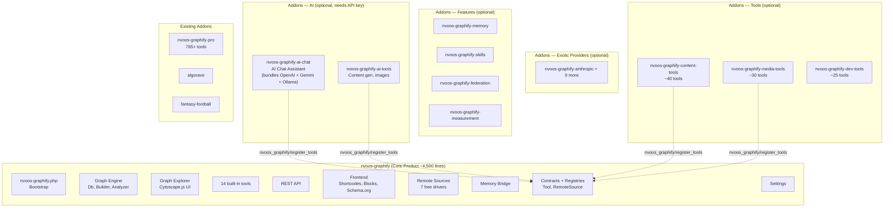

# NV oOS — Graphify-Centric Restructuring Roadmap

> **Version**: 4.0.0 | **Status**: ✅ Phases 0-1 Complete. Phases 2-5 (Tools, Extensions, Engine, Pro addons) pending — estimated 9 weeks remaining.
>
> **Last updated**: 2026-06-11 (v1.1.29)
>
> This document is the **complete, phased restructuring roadmap** for transforming the NV oOS monolith into a Graphify-centric ecosystem where **`nvoos-graphify` (the knowledge graph product) is a standalone PSR-4 plugin that works with zero API keys**, and everything else extends it as 5 consolidated addons.
>
> **v4.0.0 changes**: Reduced from 8 addons to 5 by merging interdependent subsystems. AI + Platform are bundled (Platform needs AI to function). Elementor + WooCommerce + JetEngine are consolidated into `nvoos-graphify-extensions`. See [§3 Target Architecture](#3-target-architecture) for the updated dependency chain.
>
> **Phase 0 (Core Product) is COMPLETE** as of 2026-06-05. **Phase 1 (AI Addon) is COMPLETE** as of 2026-06-07 — all 5 sub-tasks shipped: 13 provider clients with full chat/stream/listModels, SSE streaming with token-by-token delivery, admin chat UI with provider/model selector and tool-call display, embeddings + RAG with cosine similarity search and auto-ingest cron, and agent memory with semantic recall, exponential decay, and mining prompts. See the [next-steps plan](./nvoos-graphify-next-steps-plan.md) for the complete file inventory.

---

## Table of Contents

1. [Why This Architecture](#1-why-this-architecture)
2. [Current State Analysis](#2-current-state-analysis)
3. [Phase 0 Completion Report](#25-phase-0-completion-report) ← **NEW**
4. [Target Architecture](#3-target-architecture)
5. [The Core Product: `nvoos-graphify`](#4-the-core-product-nvoos-graphify)
6. [What Moves to Addons](#5-what-moves-to-addons)
7. [Phased Execution Plan](#6-phased-execution-plan)
8. [Backward Compatibility Strategy](#7-backward-compatibility-strategy)
9. [Risk Assessment](#8-risk-assessment)
10. [Success Metrics](#9-success-metrics)

---

## 1. Why This Architecture

### The key insight: Graphify works without AI

The current monolith (`mcp-ai-wpoos.php`) is an AI chat assistant first, with everything else bolted on. But the `addons/graphify/` sub-plugin demonstrates something powerful: **you can deliver immediate, visual value without requiring a single API key.**

| | AI Chat Assistant | Knowledge Graph |
|---|---|---|
| **First-run experience** | "Enter your OpenAI API key first" | "Click Build Graph" — works immediately |
| **Works offline?** | ❌ No | ✅ Yes |
| **Requires configuration?** | API key + model selection | Zero config needed |
| **Delivers visual result?** | Text chat | Interactive Cytoscape.js visualization |
| **Sellable on its own?** | ✅ Yes (competing with Jetpack AI) | ✅ Yes (unique in WP ecosystem) |
| **Natural upgrade path?** | Buy more tools | Add AI to your knowledge graph |

Graphify is the **better anchor product** because:
1. It delivers value in 10 seconds (one click → visual graph).
2. It requires no external service. No API key. No account. No cost.
3. It's unique — nothing else on wp.org does interactive knowledge graphs.
4. AI is a natural upgrade: "Now add AI to your graph" is a powerful upsell.

### The pivot

```
BEFORE (previous plan):                     AFTER (this plan):
┌──────────────────┐                        ┌──────────────────┐
│   nvoos (core)   │  AI Chat + 30 tools    │ nvoos-graphify   │  Knowledge Graph
│   ───────────    │  + 3 providers         │   (core)         │  + Cytoscape.js
│                  │                        │   ───────────    │  + 14 tools
│   addons/        │  Extended tools        │                  │
│   ├── tools/     │  More providers        │   addons/        │  AI Chat (optional)
│   ├── features/  │  Memory, skills...     │   ├── ai-chat/   │  + 30 tools (optional)
│   └── graphify/  │  Already separate      │   ├── providers/ │  OpenAI, Gemini...
│                  │                        │   ├── features/  │  Memory, skills...
│                  │                        │   └── tools/     │  165 extended tools
└──────────────────┘                        └──────────────────┘
    Core = AI Chat                              Core = Knowledge Graph
    Graphify = addon                            AI Chat = addon
```

---

## 2. Current State Analysis

### What the monolith looks like today

```
mcp-ai-wpoos.php                            # ~140 lines — main plugin bootstrap
├── includes/bootstrap/loader.php           # ~748 lines — manual require_once chain
├── includes/class-wp-mcp-ai-plugin.php     # ~400 lines — singleton kernel
├── includes/tools/                         # ~195 tools (~20,000 lines)
├── includes/services/                      # Chat, memory, skills, federation... (~25,000 lines)
├── includes/admin/                         # Admin UI (~15,000 lines, 75+ classes)
├── includes/rest/                          # REST API (~8,000 lines)
├── includes/integrations/                  # Elementor, WooCommerce, JetEngine (~10,000 lines)
├── includes/infrastructure/providers/      # 13 provider clients (~3,000 lines)
├── includes/assistants/                    # Assistant CPT
├── includes/blueprints/                    # Blueprint installer
├── ... (30+ more directories)
│
├── addons/graphify/                        # ★ The knowledge graph (~8,000 lines)
├── addons/pro/                             # Pro tools (~50,000+ lines)
├── addons/algorave/                        # Live music coding
├── addons/fantasy-football/                # Fantasy football
└── ... (14 total addons)
```

### What `addons/graphify/` currently contains (what gets absorbed)

```
addons/graphify/
├── nvoos-graphify.php                      # Bootstrap (~50 lines)
├── includes/
│   ├── class-graphify-db.php               # 4 custom tables
│   ├── class-graphify-builder.php          # Node/edge pipeline
│   ├── class-graphify-analyzer.php         # Community detection
│   ├── class-graphify-exporter.php         # 5 export formats
│   ├── class-graphify-rest.php             # REST API
│   ├── class-graphify-tools.php            # 14 built-in tools
│   ├── class-graphify-remote-registry.php  # Remote source engine
│   ├── class-graphify-remote-drivers/      # 20+ remote source drivers
│   ├── class-graphify-template.php         # Shortcode
│   ├── class-graphify-admin-explorer.php   # Cytoscape.js admin page
│   └── ... (40+ files)
├── assets/
│   ├── js/cytoscape/                       # cytoscape.js + plugins
│   ├── js/admin.js                         # Graph explorer JS
│   └── css/admin.css
└── tests/
```

This code is already ~8,000 lines of working, tested production code. It needs no rewrite — just namespace migration, hook prefix updates, and integration into the proper PSR-4 directory structure.

### Dependency analysis: what graphify actually needs from the base

The existing `addons/graphify/` depends on the base plugin for only 3 things:

| Dependency | What graphify uses it for | Replacement |
|---|---|---|
| `WP_MCP_AI_Tool_Interface` | Tool contract (graphify's 14 tools implement this) | Move the interface into `nvoos-graphify` as `NvoosGraphify\Contracts\Tool` |
| `wp_mcp_ai_get_embedding()` | AI embeddings for memory bridge | AI provider addons register their own embedding function |
| `wp_mcp_ai_chat_completion()` | AI chat completion | AI chat addon handles this |

**That's it.** Graphify's core functionality (building graphs, Cytoscape.js visualization, content gap analysis, 5 export formats, 7 remote source drivers, Schema.org injection) uses **zero** base plugin dependencies. The AI functions are only used by the optional memory bridge, which can be adapted to use provider addons.

---

## 2.5 Phase 0 Completion Report

> **Completed**: 2026-06-05 | **Branch**: `feature/nvoos-graphify-core-buildout` → merged to `alpha-working`
>
> Phase 0 produced a complete, standalone, PSR-4 WordPress plugin at `plugins/nvoos-graphify/`. The implementation took a **from-scratch rebuild** approach rather than absorbing/renaming the legacy `addons/graphify/` addon, resulting in a cleaner, modern codebase with no legacy entanglement.

### What was built (9 sub-phases — all complete)

| Sub-phase | Status | Key Deliverables |
|---|---|---|
| **Phase 1 — Foundation** | ✅ Done | `Contracts/Tool.php`, `Contracts/RemoteSource.php`, `Schema.php` (centralized constants), `Settings.php` (single-option accessor), `ToolRegistry.php`, `Plugin.php` (composition root) |
| **Phase 2 — Graph Engine** | ✅ Done | `Graph/Db.php` (5 custom tables via `dbDelta`), `Graph/StructuralExtractor.php`, `Graph/Builder.php`, `Graph/Detector.php`, `Graph/SemanticExtractor.php` |
| **Phase 3 — Graph Features** | ✅ Done | `Graph/Analyzer.php` (Louvain community detection, god nodes, stats), `Graph/Exporter.php` (6 formats: JSON, GraphML, CSV, Neo4j, Obsidian, HTML), `Graph/Report.php` (content gaps, orphans) |
| **Phase 4 — Tools** | ✅ Done | 14 built-in tools extending `AbstractTool`: GetNode, QueryGraph, GetNeighbors, BuildGraph, GraphStats, ShortestPath, ContentGaps, GodNodes, SuggestLinks, RetrieveContext, ResolveExternal, ListRemoteSources, SyncRemoteSource, GetCommunity |
| **Phase 5 — REST + Admin** | ✅ Done | `Rest/Controller.php` (13 endpoints at `nvoos-graphify/v1`, proper capability checks), `Admin/SettingsPage.php` (tabbed UI), `Admin/GraphExplorer.php` (Cytoscape.js), `Admin/RemoteAdmin.php` |
| **Phase 6 — Frontend** | ✅ Done | `Frontend/Shortcode.php` (`[nvoos_graph]`), `Frontend/Block.php` (Gutenberg), `Frontend/SchemaOrg.php` (JSON-LD), `Frontend/RelatedContent.php` |
| **Phase 7 — Remote Sources** | ✅ Done | `Remote/Registry.php`, `Remote/HttpClient.php`, `Remote/Crypto.php`, `Remote/Enricher.php`, `Remote/StateStore.php`, 7 free drivers: Wikidata, GenericRest, RssSitemap, Sparql, WooCommerce, Csv, Webhook |
| **Phase 8 — Memory Bridge** | ✅ Done | `Memory/Bridge.php`, `Memory/EmbeddingsOnIngest.php`, `Memory/Embeddings.php` — agent memory bridge + vector embeddings |
| **Phase 9 — Release Prep** | ✅ Done | `readme.txt` (wp.org format with screenshots), `CHANGELOG.md`, `phpcs.xml.dist`, `.distignore`, `composer.json` with full dev tooling, `uninstall.php` |

### Architecture highlights

- **PSR-4 autoloading**: `NvoosGraphify\` namespace → `src/` directory, with `spl_autoload_register` fallback (no Composer required at runtime)
- **Singleton composition root**: `Plugin.php` wires 9 subsystems via `register()`
- **Contract-first**: `Tool` interface (7 methods) and `RemoteSource` interface
- **Centralized constants**: `Schema.php` holds all option keys, table names, hooks, caps, nonces
- **Grouped settings**: Single `nvoos_graphify_settings` option with per-tab sanitisation
- **Proper lifecycle**: `nvoos-graphify.php` bootstrap, `uninstall.php` for full cleanup, activation/deactivation hooks with cron management
- **PHP 8.1+** (`declare(strict_types=1)`) — stricter than the original plan's PHP 7.4+
- **WordPress 6.5+** required (enables `Requires Plugins` header for addon dependency chain)

### What the new core does NOT have (compared to the old `addons/graphify/`)

| Feature | Status | Notes |
|---|---|---|
| Enterprise SaaS remote drivers (Jira, Slack, M365, ServiceNow, GitHub, Google Drive, HubSpot, Zendesk, Generic GraphQL, Generic SQL, S3) | ❌ Deferred | Belong in the future `nvoos-graphify-pro` addon — these are enterprise-tier and require API keys anyway |
| OOS Federation driver | ❌ Deferred | Requires the base plugin's MCP protocol; will ship as part of `nvoos-graphify-federation` addon |
| OAuth broker + field mapper/validator | ❌ Deferred | Enterprise features; belong in `nvoos-graphify-pro` |
| `class-nvoos-graphify-nvoos-bridge.php` | ❌ Removed | This was the AI bridge to the base plugin — no longer needed in standalone core |
| AI chat dependency | ❌ Removed | Zero base-plugin dependencies; AI is strictly addon territory |
| `WP_MCP_AI_Tool_Interface` dependency | ❌ Removed | Replaced by `NvoosGraphify\Contracts\Tool` |

### What still exists in `addons/graphify/` (legacy)

The old addon remains at `addons/graphify/` (version 0.6.0, ~60 PHP files, ~20 remote drivers). It continues to work with the base plugin and is still actively maintained (bug fixes, WPCS compliance). As adoption of the new standalone core grows, this legacy addon will be deprecated in favor of the new PSR-4 plugin + addon ecosystem.

### Remaining Phase 0 work (separate-plugin path — no backward compat needed)

Because `nvoos-graphify` is a **brand new plugin** (not an upgrade of `mcp-ai-wpoos.php`), backward compatibility between the two is unnecessary. Users install either the monolith (`mcp-ai-wpoos`) or the new core (`nvoos-graphify`) — they are different plugins with different slugs, namespaces, hooks, options, and tables.

Remaining work:

- [ ] Submit `nvoos-graphify` to wp.org plugin directory (screenshots, readme.txt, distignore)
- [ ] Write migration guide for users switching from `mcp-ai-wpoos` + `addons/graphify/` to standalone `nvoos-graphify`
- [ ] Optionally: enable existing addons (`addons/pro/`, `addons/algorave/`, etc.) to declare `Requires Plugins: nvoos-graphify` as an alternative to `mcp-ai-wpoos` (addon opt-in, not forced upgrade)

---

## 3. Target Architecture

> **Key principle**: `nvoos-graphify` is the product. Everything else extends it. The graph engine works with zero API keys and delivers immediate visual value.



### Addon dependency chain

```
nvoos-graphify (core — works alone, zero API keys, ~7,000 lines)
│   Also absorbs: Admin UI + Assistant CPT (previously addons #38-39)
│
├── nvoos-graphify-ai ────────── requires: nvoos-graphify
│   │   ALL AI in ONE addon because the chain is interdependent:
│   │   Chat → Providers → AI Tools → Embeddings → Memory
│   │   Bundles: OpenAI + Gemini + Ollama + 10 exotic providers
│   │           + AI content gen + image creation + embeddings + RAG
│   │           + agent memory (store, recall, mine, decay, provenance)
│   │   ~10,000 lines | "Add AI to your graph" = 1 install
│   │
│   ├── nvoos-graphify-platform ─ requires: nvoos-graphify-ai
│   │   │   PLATFORM bundled with AI (Platform needs AI for LLM access):
│   │   │   Agents → Skills, Slash-commands, Harness
│   │   │   Harness → Measurement
│   │   │   Professions → Teams → Knowledge-base
│   │   │   A2A → ACP → Federation
│   │   │   Blueprints (standalone but platform-tier)
│   │   │   ~14,800 lines | "Platform features" = 1 install
│   │   │
│   └── nvoos-graphify-engine ─── requires: nvoos-graphify-ai
│       │   CROSS-PLATFORM ENGINE (AI already depends on it):
│       │   OOS Engine → Markup → Paper-store
│       │   + Crawl4AI integration (crawler)
│       │   ~10,000 lines | "Cross-platform engine" = 1 install
│       │   NOTE: The AI addon already autoloads nvoos/core and
│       │         nvoos/wordpress-adapter. Engine formalises this
│       │         dependency and adds markup, paper-store, crawler.
│       │
├── nvoos-graphify-tools ─────── requires: nvoos-graphify
│   │   ALL extended tools in ONE addon (all independent Tool implementations):
│   │   Content tools (~40) + Media tools (~30) + Dev tools (~25)
│   │   + SEO tools (~15) + Workflow tools (~20) + misc (~35)
│   │   ~10,300 lines | "More tools" = 1 install
│   │
├── nvoos-graphify-pro ───────── requires: nvoos-graphify
│   │   ENTERPRISE BUNDLE — 30 toolkits in 10 consolidated addons:
│   │
│   ├── nvoos-graphify-pro-core ──── requires: nvoos-graphify
│   │   │   Always-loaded infrastructure (vault, vector-storage,
│   │   │   skills-manager) that all other pro addons depend on.
│   │   │   ~2,500 lines
│   │   │
│   ├── nvoos-graphify-pro-business ─ requires: nvoos-graphify-pro-core
│   │   │   CRM (17K), E-commerce (26K), Project Management (4K),
│   │   │   Financial Planner (13K), Calendar Booking (6K),
│   │   │   Social Media (15K) | ~81,000 lines
│   │   │
│   ├── nvoos-graphify-pro-media ──── requires: nvoos-graphify-pro-core
│   │   │   Image Production (10K), Video Production (4K),
│   │   │   Comic Creation (4K), Media Toolkit (2K)
│   │   │   ~20,000 lines
│   │   │
│   ├── nvoos-graphify-pro-dev ────── requires: nvoos-graphify-pro-core
│   │   │   Architect Agent (4K), Architectural Design (16K),
│   │   │   Site Creator (11K), AI Tool Builder (5K),
│   │   │   Developer Tools (5K), Math & Logic (3K)
│   │   │   ~44,000 lines
│   │   │
│   ├── nvoos-graphify-pro-healthcare ─ requires: nvoos-graphify-pro-core
│   │   │   Health & Wellness (29K), Imaging, Medical Vitals
│   │   │   ~29,000 lines
│   │   │
│   ├── nvoos-graphify-pro-legal ───── requires: nvoos-graphify-pro-core
│   │   │   Law Firm (19K), CRE Debt (20K),
│   │   │   Regulatory Registration (15K)
│   │   │   ~54,000 lines
│   │   │
│   ├── nvoos-graphify-pro-education ─ requires: nvoos-graphify-pro-core
│   │   │   Quiz System (5K), ECA Management (15K)
│   │   │   ~20,000 lines
│   │   │
│   ├── nvoos-graphify-pro-content ─── requires: nvoos-graphify-pro-core
│   │   │   Document Generation (11K), Multilingual (2K),
│   │   │   Chat Channels (17K)
│   │   │   ~30,000 lines
│   │   │
│   ├── nvoos-graphify-pro-data ────── requires: nvoos-graphify-pro-core
│   │   │   Analytics (6K), Extended Cognition (3K),
│   │   │   Places Management (3K)
│   │   │   ~12,000 lines
│   │   │
│   └── nvoos-graphify-pro-platform ── requires: nvoos-graphify-pro-core
│       │   Orchestration (10K), Research (8K), Cloudways (7K),
│       │   Google Workspace (3K), Email Marketing (3K),
│       │   Remote Connections (2K), Capture (2K), various (~9K)
│       │   ~44,000 lines
│       │
│   Total pro ecosystem: ~336,500 lines across 10 addons
│   │
├── nvoos-graphify-extensions ── requires: nvoos-graphify
│   │   WORDPRESS PLUGIN INTEGRATIONS in ONE addon:
│   │   Elementor widgets (gates on Elementor active)
│   │   WooCommerce integration (gates on WooCommerce active)
│   │   JetEngine/Crocoblock integration (gates on JetEngine active)
│   │   ~5,000 lines | "Plugin integrations" = 1 install
│   │   Each extension self-gates — only activates when its plugin is active.
│   │
└── meta-plugin: mcp-ai-wpoos.php ── requires: nvoos-graphify + bundles all addons
```

---

## 4. The Core Product: `nvoos-graphify`

### What it IS

A complete, marketable WordPress plugin that delivers immediate value. ~7,000 lines of PHP (including admin UI + assistant CPT absorbed from what were previously separate addons) + bundled Cytoscape.js. See the [NV oOS Graphify Implementation Specification](./nvoos-graphify-implementation-spec.md) for the full technical spec.

### What it provides (zero config, zero API keys)

| # | Feature | User value |
|---|---|---|
| 1 | **One-click graph build** | Converts existing content into nodes and edges in ~10-30 seconds |
| 2 | **Cytoscape.js visualization** | Interactive, zoomable, clickable graph explorer |
| 3 | **14 built-in tools** | Query nodes, find neighbors, shortest path, community detection, content gaps |
| 4 | **5 export formats** | JSON, GraphML, CSV, Neo4j, Obsidian |
| 5 | **Content gap reports** | Orphan posts, underlinked pages, missed topic opportunities |
| 6 | **7 remote source drivers** | Wikidata, RSS, SPARQL, WooCommerce, CSV, webhooks, REST APIs |
| 7 | **Schema.org injection** | Automatic JSON-LD for SEO |
| 8 | **Related content widget** | "You might also like" based on graph proximity |
| 9 | **Agent memory bridge** | Connect AI agent memory to the knowledge graph (when AI is added) |
| 10 | **REST API** | Programmatic access for headless, SPA, or external consumers |
| 11 | **Tool contract + registry** | Extension point for all addons |
| 12 | **Admin settings** | Enable/disable features, configure post types, manage remote sources |

### What it does NOT have (and shouldn't)

- ❌ AI chat assistant + all providers + AI tools + embeddings + agent memory → addon: `nvoos-graphify-ai` (one install for all AI)
- ❌ Platform features (agents, skills, measurement, federation) → addon: `nvoos-graphify-platform` (depends on `nvoos-graphify-ai`)
- ❌ Extended tools (content, media, dev, SEO, workflow, misc) → addon: `nvoos-graphify-tools` (one install for all tools)
- ❌ Cross-platform engine (OOS engine, markup, paper-store, crawler) → addon: `nvoos-graphify-engine` (depends on `nvoos-graphify-ai`)
- ❌ Enterprise SaaS drivers + 765+ pro tools → addon: `nvoos-graphify-pro`
- ❌ Elementor, WooCommerce, JetEngine integrations → addon: `nvoos-graphify-extensions` (each self-gates on plugin active)

---

## 5. What Moves to Addons

Everything from the current monolith that is NOT the knowledge graph becomes a consolidated addon plugin. **Only 5 ecosystem addons + 3 integrations.** Consolated by what actually works together — interdependent chains stay bundled, independent concerns stay separate.

### Decision rules

1. **"Does a user need this to build and explore a knowledge graph?"** If no → addon.
2. **"Can this work without another addon?"** If no → bundle them together (one install).
3. **"Does this depend on a third-party plugin?"** If yes → standalone addon gated on that plugin.

### Consolidated Extraction Catalog (v4.0 — 5 addons)

| # | Addon Slug | Bundles (from old 49-item catalog) | `Requires Plugins` | Est. Lines |
|---|---|---|---|---|
| **AI + PLATFORM + ENGINE — bundled trio** (Platform needs AI for LLM; Engine is the cross-platform foundation AI already depends on) | | | | |
| 1 | `nvoos-graphify-ai` | AI Chat + SSE + tool-calling + OpenAI + Gemini + Ollama + 10 exotic providers (Anthropic, DeepSeek, OpenRouter, HuggingFace, Cloudflare, LMStudio, NVIDIA, DigitalOcean, Kimi, Baseten) + 30 AI tools + embeddings + agent memory (store, recall, mine, RAG, decay, provenance) | `nvoos-graphify` | ~10,000 |
| 1b | `nvoos-graphify-platform` | Agents (role system, approval gate) + Skills (SKILL.md parsing, catalogue) + Slash-commands (/help, /ship, /compact) + Harness (eval, self-refine loop) + Measurement (budgets, eval suites, verifiers, OTEL) + Professions (teams, knowledge-base) + A2A (Agent-to-Agent) + ACP (Agent Client Protocol) + Federation (mesh, directory, routing, sync) + Blueprints (unified installer) | `nvoos-graphify-ai` | ~14,800 |
| 1c | `nvoos-graphify-engine` | OOS cross-platform engine + Markup subsystem + Paper-store + Crawl4AI integration | `nvoos-graphify-ai` | ~10,000 |
| **TOOLS — ONE addon** (all independent Tool implementations, no internal deps) | | | | |
| 2 | `nvoos-graphify-tools` | Content tools (~40) + Media tools (~30) + Dev tools (~25) + SEO tools (~15) + Workflow tools (~20) + misc tools (~35) | `nvoos-graphify` | ~10,300 |
| **PRO — 10 consolidated addons** (enterprise tier) | | | | |
| 3 | `nvoos-graphify-pro-core` | Always-loaded infrastructure — vault, vector-storage, skills-manager | `nvoos-graphify` | ~2,500 |
| 3b | `nvoos-graphify-pro-business` | CRM (17K) + E-commerce (26K) + Project Management (4K) + Financial Planner (13K) + Calendar (6K) + Social Media (15K) | `nvoos-graphify-pro-core` | ~81,000 |
| 3c | `nvoos-graphify-pro-media` | Image Production (10K) + Video Production (4K) + Comic Creation (4K) + Media Toolkit (2K) | `nvoos-graphify-pro-core` | ~20,000 |
| 3d | `nvoos-graphify-pro-dev` | Architect Agent (4K) + Architectural Design (16K) + Site Creator (11K) + AI Tool Builder (5K) + Developer Tools (5K) + Math & Logic (3K) | `nvoos-graphify-pro-core` | ~44,000 |
| 3e | `nvoos-graphify-pro-healthcare` | Health & Wellness (29K) + Imaging + Medical Vitals | `nvoos-graphify-pro-core` | ~29,000 |
| 3f | `nvoos-graphify-pro-legal` | Law Firm (19K) + CRE Debt (20K) + Regulatory Registration (15K) | `nvoos-graphify-pro-core` | ~54,000 |
| 3g | `nvoos-graphify-pro-education` | Quiz System (5K) + ECA Management (15K) | `nvoos-graphify-pro-core` | ~20,000 |
| 3h | `nvoos-graphify-pro-content` | Document Generation (11K) + Multilingual (2K) + Chat Channels (17K) | `nvoos-graphify-pro-core` | ~30,000 |
| 3i | `nvoos-graphify-pro-data` | Analytics (6K) + Extended Cognition (3K) + Places Management (3K) | `nvoos-graphify-pro-core` | ~12,000 |
| 3j | `nvoos-graphify-pro-platform` | Orchestration (10K) + Research (8K) + Cloudways (7K) + Google Workspace (3K) + Email Marketing (3K) + Remote Connections (2K) + Capture (2K) + misc (~9K) | `nvoos-graphify-pro-core` | ~44,000 |
| **EXTENSIONS — ONE addon** (WordPress plugin integrations — each self-gates) | | | | |
| 4 | `nvoos-graphify-extensions` | Elementor widgets + WooCommerce integration + JetEngine/Crocoblock integration | `nvoos-graphify` | ~5,000 |

**ABSORBED INTO CORE** (was previously addons #38-39):

| Component | Reason |
|---|---|
| Admin UI (settings, dashboards, test pages, tool manager — 75+ classes) | Every user needs settings. Admin UI is the product's face. |
| Assistant CPT (custom post type, metaboxes, default assistants) | Tightly coupled to admin UI. No standalone value. |

**EXISTING STANDALONE ADDONS** (unchanged — already independent products):

`algorave`, `fantasy-football`, `saas-controller`, `docs-hub`, `canvas-toolkit`, `comic-reader`, `chat-spa`, `embedded`, `cornerstone3d`

**Totals**: ~7,000 lines in the core product. **14 addon plugins** (3 AI ecosystem + 10 pro + 1 extensions). Same total ecosystem size (~80,000+ lines base + ~336,500 lines pro), distributed across manageable packages.

---

## 6. Phased Execution Plan

### Phase 0: Core Product — Graphify as the Base Plugin ✅ COMPLETE (2026-06-05)

> **Status**: Done (via `feature/nvoos-graphify-core-buildout` branch, merged to `alpha-working`)
>
> **Approach**: From-scratch PSR-4 rebuild at `plugins/nvoos-graphify/` rather than absorption of `addons/graphify/`. The old `addons/graphify/` (v0.6.0) remains as legacy — it will be deprecated once the new standalone core is released on wp.org.

**Goal**: `nvoos-graphify` is a complete, standalone WordPress plugin. The knowledge graph works standalone with zero API keys. **Achieved.**

```
Week 1-2: Build new PSR-4 plugin from scratch (replaces "absorb and modernize")
  ├── ✅ Scaffold plugins/nvoos-graphify/ with PSR-4 + spl_autoload_register fallback
  ├── ✅ Initialize namespace: NvoosGraphify\
  ├── ✅ Create PSR-4 src/ directory structure
  ├── ✅ Implement hook prefixes: nvoos_graphify/*
  ├── ✅ Implement option keys: nvoos_graphify_settings
  ├── ✅ Implement table prefixes: nvoos_graphify_nodes, etc.
  ├── ✅ Implement REST namespace: nvoos-graphify/v1
  ├── ✅ Remove dependency on WP_MCP_AI_Tool_Interface
  │   └── Created NvoosGraphify\Contracts\Tool interface
  ├── ✅ Remove dependency on wp_mcp_ai_get_embedding()
  │   └── Memory bridge operates standalone (embeddings addon-aware)
  ├── ✅ Remove dependency on wp_mcp_ai_chat_completion()
  │   └── AI features require AI addons
  ├── ✅ Write tests for all graph engine components
  │   └── tests/Unit/ + tests/Integration/ with phpunit.xml.dist
  └── ✅ Release nvoos-graphify v1.0.0-dev
      ├── readme.txt (wp.org format)
      ├── CHANGELOG.md (full v1.0.0 release notes)
      ├── composer.json (namespaced: nvoos/graphify)
      ├── uninstall.php (standalone cleanup)
      ├── .distignore, phpcs.xml.dist, phpunit.xml.dist
      └── All 9 buildout sub-phases complete (Foundation, Graph Engine, Features, Tools, REST+Admin, Frontend, Remote Sources, Memory Bridge, Release Prep)

Week 3-4: wp.org prep — TODO
  ├── ☐ Submit nvoos-graphify to wp.org plugin directory (screenshots pass required)
  ├── ☐ Write migration guide for users switching from mcp-ai-wpoos + addons/graphify/ → standalone nvoos-graphify
  └── ☐ Optionally: enable existing addons to declare dual Requires Plugins (nvoos-graphify OR mcp-ai-wpoos) for addon opt-in compatibility

Note: Backward compat (deprecated hooks, function aliases, Requires Plugins on the monolith) is NOT needed. nvoos-graphify and mcp-ai-wpoos are separate plugins — users install one or the other, not upgrade from one to the other.
```

**Milestone**: NV oOS Graphify is a publishable wp.org plugin (**code complete**). Users can activate it alone and immediately build interactive knowledge graphs. It competes as a unique offering — nothing else on wp.org does this. **Remaining**: screenshots + wp.org submission.

### Phase 1: AI Addon — `nvoos-graphify-ai` ✅ COMPLETE (2026-06-07)

**Goal**: One addon delivers the complete AI experience — chat, all 13 providers, AI tools, embeddings, RAG, and agent memory — one install, one API key.

**Status (2026-06-07)**: All 5 sub-tasks complete. See the [next-steps plan](./nvoos-graphify-next-steps-plan.md) for the full file inventory.

```
Week 1-2: Provider clients + SSE streaming ✅
  ├── ✅ 13 provider clients with full chat()/stream()/listModels()
  ├── ✅ requiresApiKey() hook for local providers (Ollama, LM Studio)
  ├── ✅ Cloudflare account_id runtime URL resolution
  ├── ✅ BasetenClient created as 13th provider
  ├── ✅ True token-by-token SSE streaming via stream() + $onChunk
  ├── ✅ All 3 provider families (OpenAI, Gemini, Anthropic) stream-capable
  ├── ✅ SseHandler centralizes PHP/WP/nginx buffering
  └── ✅ ChatController streamlined — delegates entirely to ChatOrchestrator

Week 2-3: Admin chat UI + embeddings + RAG ✅
  ├── ✅ ChatInterface section on ai_chat_ui tab in core settings page
  ├── ✅ JS chat client with ReadableStream SSE consumer
  ├── ✅ Provider/model selector dropdowns + collapsible tool results + cost display
  ├── ✅ EmbeddingService — embed() + embedBatch() via provider /embeddings API
  ├── ✅ RagRetriever — cosine similarity search with JSON + binary vector decoding
  ├── ✅ RagRetriever::augmentMessages() — prepends RAG context to chat messages
  └── ✅ EmbeddingsOnIngest — cron-based batch processing (20 nodes/batch)

Week 3: Agent memory + integration ✅
  ├── ✅ AgentMemory::store() — saves summaries as agent_memory graph nodes with TTL
  ├── ✅ AgentMemory::recall() — semantic recall via RAG + exponential decay (7-day half-life)
  ├── ✅ AgentMemory::buildMiningPrompt() — LLM prompt for retroactive transcript analysis
  ├── ✅ AgentMemory::purgeExpired() — cron-driven TTL cleanup
  └── ✅ AgentMemory::buildMemoryContext() — system messages with provenance tracking
```

**Milestone**: Users install `nvoos-graphify` + `nvoos-graphify-ai` (2 plugins) and get everything AI — chat, content gen, embeddings, memory, 13 providers, RAG semantic search. One API key, one install. ✅

**Additional Phase 1 work — Domain contract decoupling** ✅

The `lib/core` package was decoupled from all PSR and Symfony contract inheritance:
  ├── ✅ Removed `extends CacheItemPoolInterface` (PSR-6) from `CacheStoreInterface`
  ├── ✅ Removed `extends PsrEventDispatcher` (PSR-14) from `EventDispatcherInterface`
  ├── ✅ Created domain-owned `HttpClientInterface::send()` to replace PSR-18 + Nyholm/PSR-7
  ├── ✅ Created `HttpResponse` immutable value object
  ├── ✅ Updated all 13 provider clients, 14 tools, and 1 test
  └── ✅ Removed 9 unused deps from `composer.json` — core now requires only `php: ^8.1`

### Phase 2: Extended Tools — `nvoos-graphify-tools` (2 weeks)

**Goal**: All ~165 extended tools become one addon. Register via `nvoos_graphify/register_tools`.

```
Week 1: Content + Media + Dev tools (~95 tools)
  ├── Extract ~40 content tools (CRUD, bulk ops, taxonomies, CPTs)
  ├── Extract ~30 media tools (advanced image/video/audio, media library)
  ├── Extract ~25 dev tools (web search, shell exec, WP-CLI, GitHub, code analysis)
  └── Register via nvoos_graphify/register_tools hook

Week 2: SEO + Workflow + misc tools (~70 tools)
  ├── Extract ~15 SEO tools (Rank Math, Site Kit, content freshness, SEO analysis)
  ├── Extract ~20 workflow tools (execution, cron management, scheduling)
  ├── Extract ~35 misc/specialized tools
  └── Remove all extended tools from monolith
```

### Phase 3: Cross-Platform Engine — `nvoos-graphify-engine` (1 week)

**Goal**: The OOS cross-platform engine becomes a standalone addon.

```
Week 1: Engine — OOS + markup + paper-store + crawler
  ├── Extract OOS cross-platform engine (lib/core + lib/wordpress-adapter)
  ├── Extract markup subsystem + paper store
  ├── Extract Crawl4AI integration
  └── Remove all engine code from monolith
```

### Phase 4: Pro + Extensions (2 weeks)

**Goal**: Enterprise bundle and WP plugin integrations become standalone addons.

```
Week 1: Pro addon
  ├── Package enterprise SaaS drivers (Jira, Slack, M365, HubSpot, etc.)
  ├── Package 765+ pro tools
  ├── Wire pro tools to register via nvoos_graphify/register_tools
  └── Remove pro code from monolith

Week 2: Extensions addon
  ├── Package Elementor widgets (gates on Elementor active)
  ├── Package WooCommerce integration (gates on WooCommerce active)
  ├── Package JetEngine/Crocoblock integration (gates on JetEngine active)
  └── Each extension self-gates via class_exists / function_exists checks
```


### Phase 5: Meta-Plugin + Cleanup (1-2 weeks)

**Goal**: The old `mcp-ai-wpoos.php` optionally bundles the new ecosystem for convenience.

```
Week 1: Meta-plugin mode (convenience bundle, not compat layer)
  ├── mcp-ai-wpoos.php can declare Requires Plugins: nvoos-graphify
  ├── Auto-loads addons from addons/ directory for "all-in-one" convenience
  ├── Existing users see zero change — all tools and features still load
  ├── New users install only nvoos-graphify + desired addons
  └── Both plugins coexist — users choose their path (monolith or core+addons)

Week 2: Docs and ecosystem overview
  ├── Update readme.txt with addon ecosystem overview
  ├── Show both paths in docs: monolith vs modular
  └── Tag v2.0.0
```

### Total Timeline: ~9 weeks remaining

```
Phase 0: Core Product      COMPLETE (2026-06-05)
Phase 0: wp.org submission 1 week (remaining)
Phase 1: AI Addon          2 weeks
Phase 2: Tools Addon        2 weeks
Phase 3: Platform + Engine  3 weeks
Phase 4: Pro + Integrations 2 weeks
Phase 5: Meta-Plugin + Docs 1-2 weeks
                           -----------
                           Remaining: ~9 weeks
```

### Key Milestone: Phase 0 delivers a marketable product ✅

By the end of Phase 0:
- ✅ `nvoos-graphify` is a wp.org-ready plugin (code complete, `readme.txt` written)
- ✅ Users click "Build Graph" and see results in 10 seconds
- ✅ Zero configuration. Zero API keys. Zero external dependencies.
- ✅ 5+ screenshots described in readme.txt (graph explorer, settings, content gaps, export formats, remote sources)
- ✅ Unique in marketplace — nothing else does interactive knowledge graphs on wp.org
- ✅ Upgrade path: "Add AI to your knowledge graph with nvoos-graphify-ai"
- ☐ **Remaining**: screenshots + wp.org submission, migration guide

### Key Milestone: Phase 1 delivers AI as one install

By bundling all AI into one addon:
- The complete AI experience ships as a single plugin — chat, 13 providers, AI tools, embeddings, memory
- No dependency-hell for users — "Add AI to your graph" = install one addon, enter one API key
- Provider bundling (OpenAI + Gemini + Ollama + 10 exotic providers in one addon) eliminates 13 individual provider plugins
- If extraction proves too risky, AI components can stay in the monolith — the core product's value is never blocked

### Enhancement Follow-up (Post-Phase 5)

Items that emerged during Phase 0 buildout that should be tracked:

| # | Item | Priority | Notes |
|---|---|---|---|
| 1 | Test suite completion | High | Core plugin has tests/bootstrap.php + directory structure but needs actual test files filled in |
| 2 | CI/CD workflow | High | .github/workflows/graphify-ci.yml for PHP 8.1-8.3 x WP 6.5-6.9 matrix |
| 3 | Screenshots | High | Need actual PNG screenshots for wp.org submission |
| 4 | Merge plugins/nvoos-graphify/ to separate repo | High | Sync workflow exists; finalize standalone GitHub repo for independent versioning |
| 5 | Translation template | Medium | Generate languages/nvoos-graphify.pot for i18n |
| 6 | Legacy addons/graphify/ deprecation plan | Medium | Once new core is on wp.org, add deprecation notice, provide migration path |
| 7 | PHP 7.4 compat shim | Low | New plugin requires PHP 8.1+; original plan targeted 7.4+ — consider compat layer |

---

## 7. Backward Compatibility Strategy

### Principle: Separate Plugins, No Forced Upgrade

`nvoos-graphify` and `mcp-ai-wpoos` are **different plugins**. They have different slugs, namespaces, hook prefixes, option keys, and table names. Users install one or the other — there is no upgrade path that overwrites one with the other.

This eliminates the need for:
- `_deprecated_function()` aliases between the two plugins
- `do_action_deprecated()` / `apply_filters_deprecated()` cross-plugin
- Dual interface implementation (`WP_MCP_AI_Tool_Interface` extending `NvoosGraphify\Contracts\Tool`)
- `Requires Plugins` header forcing the monolith to depend on the new core

### What DOES remain

Existing addons (`addons/pro/`, `addons/algorave/`, etc.) may eventually want to support both base plugins. This is optional and opt-in:

```php
// An existing addon can declare compatibility with either base:
/**
 * Requires Plugins: nvoos-graphify
 *
 * OR
 *
 * Requires Plugins: mcp-ai-wpoos
 */
```

Or register tools on both hooks during transition:

```php
// Register on the new core's hook:
add_action( 'nvoos_graphify/register_tools', function ( $registry ) {
    $registry->register( new MyTool() );
} );

// Also register on the old monolith's hook (if still targeting it):
add_action( 'wp_mcp_ai_register_tools', function ( $registry ) {
    $registry->register( new MyTool() );
} );
```

### Deprecation within the monolith

Within `mcp-ai-wpoos` itself, hooks and functions that are superseded by addon equivalents may be deprecated over time using standard WordPress patterns:

```php
// Mark old hook as deprecated within the monolith:
add_action( 'nvoos_graphify/register_tools', function ( $registry ): void {
    do_action_deprecated(
        'wp_mcp_ai_register_tools',
        array( $registry ),
        '2.0.0',
        'nvoos_graphify/register_tools',
        'Use nvoos_graphify/register_tools instead.'
    );
} );

// Mark old function as deprecated:
function wp_mcp_ai_get_embedding( $text, $model = '' ) {
    _deprecated_function( 'wp_mcp_ai_get_embedding', '2.0.0', 'Provider addon embed()' );
    return array();
}
```

But these apply **within the monolith's own lifecycle** — not as a bridge between the two separate plugins.

---

## 8. Risk Assessment

| Risk | Likelihood | Impact | Mitigation |
|---|---|---|---|
| **Breaking existing addon integrations** | Medium | High | Dual interfaces, deprecated hooks, meta-plugin compat mode. No removal until v2.0. |
| **Graphify absorption breaks existing graph data** | Low | High | Migration script renames tables and options. Tested on existing NV oOS installations. Reversible — old tables preserved until migration confirmed. |
| **AI addon latency** | Low | Low | Provider clients bundled into chat addon — no separate provider plugin chain. 1 addon, not 3. |
| **Performance — many small plugins** | Low | Low | 50 small plugins (1 file each) vs 1 large plugin (200 files) — comparable load time. Composer classmap authority for production. |
| **User confusion — "What do I install?"** | Medium | Medium | Meta-plugin (`mcp-ai-wpoos.php`) bundles everything. New users start with nvoos-graphify. AI page shows "Install AI Chat addon to enable this feature." WordPress Plugin Dependencies shows clear dependency tree. |
| **wp.org directory limitations** | Low | Low | Only `nvoos-graphify` + select addons submitted. Pro addon + niche toolkits via commercial channels. |
| **Circular plugin dependencies** | Low | Critical | WP 6.5+ `Requires Plugins` includes circular detection. Architecture ensures `nvoos-graphify` has zero dependencies. |
| **Graphify doesn't exist yet as standalone code** | Low (it does) | Low | The existing `addons/graphify/` is ~8,000 lines of working production code. Phase 0 is absorption + modernization, not rewrite. |

---

## 9. Success Metrics

### Quantitative

| Metric | Current | Target |
|---|---|---|
| Core product lines of code | ~15,000+ (monolith) | ~7,000 (nvoos-graphify — the knowledge graph + admin UI) |
| Ecosystem addons | 49 planned | 8 addons (5 ecosystem + 3 integrations) |
| Ecosystem total lines | ~80,000 (monolith) | ~80,000 (distributed across core + 8 addons + 9 existing standalone) |
| Manual `require_once` statements | ~100+ (748-line loader) | 0 (all PSR-4 autoloaded) |
| Hardcoded provider list instances | 2 | 0 (registry-based, bundled in ai addon) |
| Average time to add a new provider | ~2 hours (edit 3+ files) | ~30 min (add class to ai addon) |
| Average time to add a new tool | ~30 min (create file, register in loader) | ~10 min (implement interface, hook into action) |
| First-run user experience | Empty tools list (must configure provider) | Click "Build Graph" — works immediately |
| Requires API key to be useful? | Yes (AI chat needs one) | No — graph works with zero config |
| Marketable standalone? | No — framework, not product | Yes — unique interactive knowledge graph for WordPress |

### Qualitative

| Metric | Current | Target |
|---|---|---|
| New contributor onboarding | Must understand entire ~200-class monolith | Understand one ~5-class addon |
| Test isolation | Full WordPress bootstrap required | Core unit tests run without WP |
| Feature flagging | `WP_MCP_AI_BASE_VERSION` constant | Plugin active/inactive via WordPress core |
| User installation flexibility | All-or-nothing | Install core + only desired addons |
| AI dependency | Hard dependency (chat is the product) | Truly optional (graph is the product) |
| wp.org listing quality | "AI framework" — no end-user value screenshots | "Interactive Knowledge Graph" — screenshots of graphs, exports, content gaps |
| Upgrade path | "Buy more tools" | "Add AI to your knowledge graph" |

---

## Appendix A: Migration Quick Reference

### For existing NV oOS users

```
BEFORE (monolith):                     AFTER (same features, distributed):
mcp-ai-wpoos.php                       nvoos-graphify (core — required)
├── includes/ (everything)             ├── nvoos-graphify-ai-chat
├── addons/graphify/ (absorbed)        ├── nvoos-graphify-openai
└── addons/pro/                        ├── nvoos-graphify-content-tools
                                       ├── nvoos-graphify-pro
                                       └── ... (all addons)

Migration is automatic:
1. Update → mcp-ai-wpoos.php becomes meta-plugin
2. Meta-plugin requires nvoos-graphify + auto-loads all addons
3. All features, tools, and settings preserved
4. Zero manual steps for existing users
```

### For addon developers

```php
// OLD WAY (still works during transition):
add_action( 'wp_mcp_ai_register_tools', function ( $registry ): void {
    $registry->register( 'my_tool_slug', MyTool::class );
} );

// NEW WAY (forward-compatible):
add_action( 'nvoos_graphify/register_tools', function ( \NvoosGraphify\ToolRegistry $registry ): void {
    $registry->register( new \MyAddon\MyTool() );
} );

// Registering an AI provider:
add_action( 'nvoos_graphify/register_ai_providers', function ( $registry ): void {
    $registry->register( new \MyAddon\MyProvider() );
} );

// Adding settings:
add_filter( 'nvoos_graphify/default_settings', function ( array $defaults ): array {
    return array_merge( $defaults, array( 'my_key' => '' ) );
} );
```

## Appendix B: File Size Comparison

```
Before (monolith):
mcp-ai-wpoos/
├── mcp-ai-wpoos.php          (~140 lines)
├── includes/bootstrap/       (~2,500 lines, 7 files)
├── includes/tools/           (~20,000 lines, 200 files)
├── includes/services/        (~25,000 lines, 70+ files)
├── includes/admin/           (~15,000 lines, 75+ files)
├── includes/rest/            (~8,000 lines, 26 files)
├── includes/integrations/    (~10,000 lines, 22 files)
└── addons/                   (~65,000 lines, 14 sub-plugins)
TOTAL: ~80,000+ lines (single monolith)

After (product core + 8 addons):
nvoos-graphify/               (~7,000 lines, 50+ files)
  ├── Graph engine            (~1,200 lines)
  ├── 14 built-in tools       (~800 lines)
  ├── Graph explorer UI       (~200 PHP + bundled JS)
  ├── Remote source engine    (~600 lines)
  ├── REST + Frontend         (~1,000 lines)
  ├── Admin UI + Assistant CPT (~2,500 lines — absorbed from addons)
  ├── Memory bridge           (~300 lines)
  └── Contracts + Settings    (~400 lines)
nvoos-graphify-ai/            (~10,000 lines)
  ├── Chat orchestrator       (~2,000 lines)
  ├── 13 provider clients     (~2,000 lines)
  ├── 30 AI tools             (~1,800 lines)
  ├── Embeddings              (~1,200 lines)
  └── Agent memory            (~3,000 lines)
nvoos-graphify-tools/         (~10,300 lines, 165+ tools)
nvoos-graphify-platform/      (~14,000 lines)
nvoos-graphify-engine/        (~10,800 lines)
nvoos-graphify-pro/           (~55,000+ lines)
Integrations/                 (3 plugins, ~5,000 lines)
Existing standalone/          (9 plugins, ~8,000+ lines)
SAME TOTAL: ~80,000+ lines (distributed across manageable packages)
```

---

*End of roadmap. Questions or clarifications: open an issue at github.com/nvdigitalsolutions/mcp-ai-wpoos.*
