# NV oOS — Base Plugin Restructuring Roadmap

> **Version**: 1.0.0-draft | **Status**: Proposal
>
> This document is the **complete, phased restructuring roadmap** for transforming the NV oOS base plugin (`mcp-ai-wpoos.php`, ~15,000+ lines across ~200 classes) into a thin core (~500 lines) with everything else extracted as independent micro-plugins. This applies the same pattern proven by the existing `addons/` directory and documented in the `graphify-core` implementation specification.

---

## Table of Contents

1. [Why Restructure](#1-why-restructure)
2. [Current State Analysis](#2-current-state-analysis)
3. [Target Architecture](#3-target-architecture)
4. [The Thin Core: `nvoos-core`](#4-the-thin-core-nvoos-core)
5. [Feature-to-Addon Mapping](#5-feature-to-addon-mapping)
6. [Provider Client Registry](#6-provider-client-registry)
7. [Tool Migration Pattern](#7-tool-migration-pattern)
8. [Phased Execution Plan](#8-phased-execution-plan)
9. [Backward Compatibility Strategy](#9-backward-compatibility-strategy)
10. [Risk Assessment](#10-risk-assessment)
11. [Success Metrics](#11-success-metrics)

---

## 1. Why Restructure

### Current Pain Points

| Problem | Impact |
|---|---|
| **Monolithic singleton** (`WP_MCP_AI::instance()`) | Every class is coupled to the kernel. Tests require full WordPress bootstrap. |
| **Flat tool directory** (195 files in `includes/tools/`) | Impossible to find tools by category. Contributing a single tool requires understanding the monolith. |
| **Hardcoded provider list** (13 providers in settings + router) | Adding a new provider (e.g., Claude 4, Mistral) requires editing core files. |
| **748-line loader** (`includes/bootstrap/loader.php`) | Manual `require_once` chain. One misspelled path = fatal error. |
| **Base + Pro version split** (`WP_MCP_AI_BASE_VERSION` constant) | Flag-based feature gating is fragile. `function_exists( 'wp_mcp_ai_is_pro_addon_available' )` checks scattered everywhere. |
| **All-or-nothing activation** | Users must load 195+ tools even if they only need content tools. No way to install just the chat UI without tools. |
| **WordPress.org review friction** | A 15,000-line plugin with 195 tools is a heavy review. Small, focused plugins review faster. |

### What the Addon System Proves

The existing `addons/` directory already demonstrates the target pattern:

```
addons/graphify/nvoos-graphify.php        # ✅ Self-contained plugin
addons/algorave/nvoos-algorave.php        # ✅ Self-contained plugin
addons/fantasy-football/nvoos-fantasy-football.php  # ✅ Self-contained plugin
addons/pro/mcp-ai-wpoos-pro.php            # ✅ Self-contained plugin (765+ tools)
```

Every addon has: its own bootstrap file, `includes/`, `assets/`, `tests/`, and `uninstall.php`. The addons are micro-plugins that happen to be loaded inside the NV oOS ecosystem. The base plugin just hasn't been thinned to match.

### Target Outcome

```
nvoos-core/                              # ~500 lines — the irreducable base
├── Tool interface + registry
├── Provider interface + registry
├── Settings accessor (API keys, model config)
├── REST API framework
└── Admin menu framework

addons/
├── chat/                                # ~2,000 lines — orchestrator + SSE
├── memory/                              # ~3,000 lines — agent memory + RAG
├── skills/                              # ~1,500 lines — SKILL.md system
├── federation/                          # ~2,000 lines — mesh + peers
├── measurement/                         # ~2,000 lines — budgets + eval
├── assistants/                          # ~2,000 lines — CPT + metaboxes
├── admin/                               # ~5,000 lines — admin UI
│
├── tools/                               # Task-specific tool plugins
│   ├── content-tools/                   # ~40 content tools
│   ├── media-tools/                     # ~30 media tools
│   ├── developer-tools/                 # ~25 dev tools
│   ├── seo-tools/                       # ~15 SEO tools
│   ├── workflow-tools/                  # ~20 workflow tools
│   └── ... (every toolkit a separate plugin)
│
├── providers/                           # Provider client plugins
│   ├── openai-provider/
│   ├── gemini-provider/
│   ├── anthropic-provider/
│   ├── ollama-provider/
│   └── ... (one plugin per provider)
│
├── integrations/                        # Third-party integrations
│   ├── elementor-integration/
│   ├── woocommerce-integration/
│   ├── jetengine-integration/
│   └── ... (one plugin per integration)
│
├── graphify/                            # ✅ Already exists
├── algorave/                            # ✅ Already exists
├── fantasy-football/                    # ✅ Already exists
├── saas-controller/                     # ✅ Already exists
├── docs-hub/                            # ✅ Already exists
└── pro/                                 # ✅ Already exists (new name: nvoos-pro)
```

---

## 2. Current State Analysis

### Bootstrap Flow (as of v1.1.26)

```
mcp-ai-wpoos.php
├── Header + Plugin Name
├── ABSPATH guard
├── wp_mcp_ai_core_loaded() double-load guard
├── WP_MCP_AI_FILE constant
├── PHP 7.4+ version check
├── NOOP_Translations pre-load (WP 6.7 fix)
├── require includes/bootstrap/constants.php        # ~60 lines
├── require includes/bootstrap/autoload.php         # ~150 lines
├── require includes/bootstrap/helpers.php          # ~700 lines (50+ helper functions)
├── require includes/bootstrap/cron.php             # ~180 lines
├── require includes/bootstrap/hooks.php            # ~430 lines
├── require includes/bootstrap/loader.php           # ~748 lines (manual require_once chain)
├── require includes/class-wp-mcp-ai-plugin.php     # ~400 lines (singleton kernel)
├── require includes/bootstrap/oos-bridge.php       # ~280 lines (lib/core wiring)
├── require includes/bootstrap/activation.php       # ~620 lines
├── register_activation_hook(...)
├── register_deactivation_hook(...)
├── register_uninstall_hook(...)
└── add_action( 'plugins_loaded', 'wp_mcp_ai_bootstrap', 20 )
```

### What the 748-line loader loads

```
includes/bootstrap/loader.php loads (in order):
├── admin/class-wp-mcp-ai-admin-settings-base.php
├── admin/class-wp-mcp-ai-admin-settings.php        # 6000+ lines (massive settings class)
├── admin/class-wp-mcp-ai-admin-scripts.php
├── class-wp-mcp-ai-default-assistants.php
├── admin/class-wp-mcp-ai-admin-approvals.php
├── class-wp-mcp-ai-request-context.php
├── interfaces/                                       # 15 interface files
├── traits/                                           # 7 trait files
├── class-wp-mcp-ai-rest.php                          # Core REST (chat + SSE)
├── class-wp-mcp-ai-tool-registry.php                 # Tool registry singleton
├── tools/tools-init.php                              # Loads all 195 tools
├── admin/class-wp-mcp-ai-admin-ajax-handlers.php     # 4000+ lines
├── repositories/                                     # Repository classes
├── services/                                         # 70+ service classes
├── integrations/                                     # 22 integration classes
├── assistants/                                       # CPT + metaboxes
├── blocks/                                           # Gutenberg blocks
├── elementor/                                        # Elementor widgets
├── blueprints/                                       # Blueprint installer
├── ... (40+ more files)
```

### Public API Functions (what consumers depend on)

```
wp_mcp_ai_bootstrap()                    # Boot entry point
wp_mcp_ai_maybe_load_pro_addon()        # Pro auto-loader
wp_mcp_ai_is_base_version()             # Version detection
wp_mcp_ai_is_jetengine_available()      # Integration checks
wp_mcp_ai_get_required_chat_capability() # Capability lookup
wp_mcp_ai_run_process()                 # Shell execution
wp_mcp_ai_run_shell()                   # Shell execution
wp_mcp_ai_container()                   # DI container access
wp_mcp_ai_oos_orchestrator()            # OOS engine access
wp_mcp_ai_oos_engine_enabled()          # Feature flag check
wp_mcp_ai_get_agent_roles()             # Agent system
wp_mcp_ai_core_loaded()                 # Double-load guard
wp_mcp_ai_iterate_network_sites()       # Multisite helper
wp_mcp_ai_get_embedding()              # AI embeddings (in includes/class-wp-mcp-ai-enhanced-openai-client.php)
wp_mcp_ai_chat_completion()            # AI chat (in includes/class-wp-mcp-ai-enhanced-openai-client.php)
```

### Addon Integration Points (what addons hook into)

```php
// Actions
'wp_mcp_ai_bootstrapped'           // Fires after base plugin boots
'wp_mcp_ai_register_tools'         // Tool registration (used by every addon)
'wp_mcp_ai_load_pro_tools'         // Pro tool registration
'wp_mcp_ai_memory_stored'          // Agent memory (used by graphify memory bridge)
'wp_mcp_ai_register_embedded_scripts' // Embedded LLM scripts

// Filters
'wp_mcp_ai_allowed_providers'      // Provider allowlist
'wp_mcp_ai_admin_settings_sanitize' // Settings sanitization
'wp_mcp_ai_show_usage_costs'       // UI display toggles
'wp_mcp_ai_show_capability_flags'  // UI display toggles
```

---

## 3. Target Architecture

```mermaid
graph TD
    subgraph "nvoos-core (~500 lines)"
        CORE_BOOT["nvoos-core.php<br/>Bootstrap + autoload + constants"]
        TOOLS_CONTRACT["Nvoos\\Contracts\\Tool<br/>interface, 7 methods"]
        PROVIDER_CONTRACT["Nvoos\\Contracts\\ProviderClient<br/>interface, 4 methods"]
        TOOL_REGISTRY["Nvoos\\ToolRegistry<br/>register(), get(), all()"]
        PROVIDER_REGISTRY["Nvoos\\ProviderRegistry<br/>register(), get(), all()"]
        SETTINGS["Nvoos\\Settings<br/>API keys + model config"]
        REST_FRAMEWORK["Nvoos\\Rest\\Server<br/>route registration + auth"]
        ADMIN_FRAMEWORK["Nvoos\\Admin\\Menu<br/>menu + settings page helpers"]
    end

    subgraph "Provider Plugins (1 per provider)"
        OPENAI["nvoos-openai"]
        GEMINI["nvoos-gemini"]
        ANTHROPIC["nvoos-anthropic"]
        OLLAMA["nvoos-ollama"]
    end

    subgraph "Feature Plugins (1 per feature)"
        CHAT["nvoos-chat<br/>Orchestrator + SSE"]
        MEMORY["nvoos-memory<br/>Agent memory + RAG"]
        SKILLS["nvoos-skills<br/>SKILL.md system"]
        FEDERATION["nvoos-federation<br/>Mesh + peers"]
        ADMIN["nvoos-admin<br/>Admin UI"]
        ASSISTANTS["nvoos-assistants<br/>CPT + metaboxes"]
        MEASUREMENT["nvoos-measurement<br/>Budgets + eval"]
    end

    subgraph "Tool Plugins (1 per toolkit)"
        CONTENT["nvoos-content-tools<br/>~40 tools"]
        MEDIA["nvoos-media-tools<br/>~30 tools"]
        DEV["nvoos-dev-tools<br/>~25 tools"]
        SEO["nvoos-seo-tools<br/>~15 tools"]
    end

    subgraph "Integration Plugins"
        ELEMENTOR["nvoos-elementor"]
        WOO["nvoos-woocommerce"]
        JET["nvoos-jetengine"]
    end

    subgraph "Existing Addons"
        GRAPHIFY["graphify<br/>Already exists"]
        ALGORAVE["algorave<br/>Already exists"]
        PRO["nvoos-pro<br/>765+ tools"]
    end

    CORE_BOOT --> TOOLS_CONTRACT
    CORE_BOOT --> PROVIDER_CONTRACT
    CORE_BOOT --> TOOL_REGISTRY
    CORE_BOOT --> PROVIDER_REGISTRY
    CORE_BOOT --> SETTINGS
    CORE_BOOT --> REST_FRAMEWORK
    CORE_BOOT --> ADMIN_FRAMEWORK

    OPENAI -.->|"nvoos/register_providers"| PROVIDER_REGISTRY
    GEMINI -.->|"nvoos/register_providers"| PROVIDER_REGISTRY
    ANTHROPIC -.->|"nvoos/register_providers"| PROVIDER_REGISTRY
    OLLAMA -.->|"nvoos/register_providers"| PROVIDER_REGISTRY

    CONTENT -.->|"nvoos/register_tools"| TOOL_REGISTRY
    MEDIA -.->|"nvoos/register_tools"| TOOL_REGISTRY
    DEV -.->|"nvoos/register_tools"| TOOL_REGISTRY
    SEO -.->|"nvoos/register_tools"| TOOL_REGISTRY
    GRAPHIFY -.->|"nvoos/register_tools"| TOOL_REGISTRY
    ALGORAVE -.->|"nvoos/register_tools"| TOOL_REGISTRY
    PRO -.->|"nvoos/register_tools"| TOOL_REGISTRY
```



---

## 4. The Thin Core: `nvoos-core`

### Specification

The core is **irreducably minimal**. If a feature CAN exist as a standalone addon, it DOES. The core only provides:

| # | Component | Interface | Why it's in core |
|---|---|---|---|
| 1 | **Tool contract** | `Nvoos\Contracts\Tool` (7 methods) | Every tool in every addon implements this. It's the universal contract. |
| 2 | **Provider client contract** | `Nvoos\Contracts\ProviderClient` (4 methods) | Every AI provider implements this. Enables swappable AI backends. |
| 3 | **Tool registry** | `Nvoos\ToolRegistry` | Collects tools from all addons. Addons register via `nvoos/register_tools`. |
| 4 | **Provider registry** | `Nvoos\ProviderRegistry` | Collects provider clients from all addons. Providers register via `nvoos/register_providers`. |
| 5 | **Settings** | `Nvoos\Settings` | Centralized API key storage. All addons read from here. |
| 6 | **Schema** | `Nvoos\Schema` | Every option key, hook name, nonce action, capability slug. |
| 7 | **REST framework** | `Nvoos\Rest\Server` | Namespace registration, auth hooks, error formatting. |
| 8 | **Admin framework** | `Nvoos\Admin\Menu` | Menu registration, settings page base class. |

### What moves OUT of core into addons

| Current Location | What it is | Moves to |
|---|---|---|
| `class-wp-mcp-ai-rest.php` | Chat orchestrator + SSE streaming | `addons/chat/` |
| `services/class-wp-mcp-ai-memory-manager.php` + related | Agent memory system | `addons/memory/` |
| `class-wp-mcp-ai-skill-registry.php` + `class-wp-mcp-ai-skill-parser.php` | SKILL.md system | `addons/skills/` |
| `class-wp-mcp-ai-federation.php` + mesh/* | Federation/Mesh | `addons/federation/` |
| `measurement/*` | Budgets, eval, verifiers | `addons/measurement/` |
| `assistants/*` | Assistant CPT + metaboxes | `addons/assistants/` |
| `admin/*` (most of it) | Admin UI (75+ classes) | `addons/admin/` |
| `tools/*` (all 195) | Tool implementations | `addons/tools/` (split by toolkit) |
| `integrations/*` | Third-party integrations | `addons/integrations/` (one per integration) |
| `includes/infrastructure/providers/*` | Provider client classes | `addons/providers/` (one per provider) |
| `elementor/*` | Elementor widgets | `addons/integrations/elementor/` |
| `blocks/*` | Gutenberg blocks | `addons/blocks/` |
| `bundled-skills/*` | Pre-installed SKILL.md files | `addons/skills/` |
| `lib/core/*` | OOS extraction engine | `addons/oos-engine/` |
| `lib/wordpress-adapter/*` | WordPress adapter | `addons/oos-engine/` |
| `blueprints/*` | Blueprint installer | `addons/blueprints/` |
| `slash-commands/*` | Slash command system | `addons/slash-commands/` |
| `a2a/*` | Agent-to-Agent protocol | `addons/a2a/` |
| `acp/*` | Agent Client Protocol | `addons/acp/` |
| `agents/*` | Agent role system | `addons/agents/` |
| `harness/*` | Eval harness | `addons/harness/` |
| `markup/*` | Markup subsystem | `addons/markup/` |
| `paper-store/*` | Paper store | `addons/paper-store/` |
| `crawler/*` | Crawl4AI integration | `addons/crawler/` |
| `professions/*` | Profession system | `addons/professions/` |
| `teams/*` | Team system | `addons/teams/` |
| `knowledge-base/*` | Profession knowledge base | `addons/professions/` |

### Core File Structure

```
nvoos-core/
├── nvoos-core.php                       # Bootstrap (~100 lines)
├── uninstall.php                        # Standalone cleanup
├── composer.json                        # PSR-4 autoload
├── readme.txt
│
├── src/                                 # PSR-4 root: Nvoos\
│   ├── Plugin.php                       # Composition root (~50 lines)
│   ├── Schema.php                       # Centralized constants (~60 lines)
│   ├── Settings.php                     # Options accessor (~50 lines)
│   ├── ToolRegistry.php                 # Tool container (~30 lines)
│   ├── ProviderRegistry.php             # Provider container (~30 lines)
│   │
│   ├── Contracts/                       # Public interfaces
│   │   ├── Tool.php                     # Tool contract (~30 lines)
│   │   └── ProviderClient.php           # Provider contract (~20 lines)
│   │
│   ├── Rest/                            # REST framework
│   │   └── Server.php                   # Route registration + auth (~80 lines)
│   │
│   └── Admin/                           # Admin framework
│       ├── Menu.php                     # Menu registration (~40 lines)
│       └── SettingsPage.php             # Settings page base class (~60 lines)
│
├── assets/
│   └── css/
│       └── admin.css
│
├── languages/
│   └── nvoos-core.pot
│
└── tests/
    └── Unit/
        ├── ToolRegistryTest.php
        ├── ProviderRegistryTest.php
        └── SettingsTest.php
```

### Core Contracts

#### `Nvoos\Contracts\Tool`

```php
<?php
declare(strict_types=1);

namespace Nvoos\Contracts;

/**
 * Contract for all NV oOS ecosystem tools.
 *
 * Every tool in every NV oOS addon plugin implements this interface.
 * Replaces WP_MCP_AI_Tool_Interface + WP_MCP_AI_Tool_Capability_Flags_Interface.
 *
 * @since 1.0.0
 */
interface Tool
{
    public function getSlug(): string;
    public function getName(): string;
    public function getDescription(): string;
    public function getParametersSchema(): array;
    public function getRequiredCapability(): string;
    public function getCapabilityFlags(): array;
    public function execute( array $arguments = array(), array $context = array() ): array;
}
```

#### `Nvoos\Contracts\ProviderClient`

```php
<?php
declare(strict_types=1);

namespace Nvoos\Contracts;

/**
 * Contract for AI provider clients.
 *
 * Every AI provider (OpenAI, Gemini, Anthropic, Ollama, etc.)
 * implements this interface and registers via nvoos/register_providers.
 *
 * @since 1.0.0
 */
interface ProviderClient
{
    /**
     * Send a chat completion request.
     *
     * @param array  $messages Array of {role, content} message objects.
     * @param array  $options  Model, temperature, max_tokens, etc.
     * @param array  $tools    Optional tool definitions for function calling.
     * @param string $context  Execution context: 'chat', 'tool', 'agent', etc.
     *
     * @return array{
     *     content: string,
     *     tool_calls?: array,
     *     finish_reason: string,
     *     usage: array,
     *     model: string,
     * }
     *
     * @throws \RuntimeException If the API request fails.
     */
    public function chat(
        array $messages,
        array $options = array(),
        array $tools = array(),
        string $context = 'chat'
    ): array;

    /**
     * Generate text embeddings.
     *
     * @param string $text  The text to embed.
     * @param string $model Optional model override.
     * @return float[] The embedding vector.
     */
    public function embed( string $text, string $model = '' ): array;

    /**
     * Get the provider's unique slug.
     *
     * @return string e.g. 'openai', 'gemini', 'ollama'
     */
    public function getSlug(): string;

    /**
     * Whether the provider is configured and reachable.
     *
     * @return bool
     */
    public function isAvailable(): bool;
}
```

#### `Nvoos\ProviderRegistry`

```php
<?php
declare(strict_types=1);

namespace Nvoos;

use Nvoos\Contracts\ProviderClient;

/**
 * Collects and provides access to registered AI providers.
 *
 * Provider plugins register via the nvoos/register_providers action.
 *
 * @since 1.0.0
 */
final class ProviderRegistry
{
    /** @var array<string, ProviderClient> */
    private array $providers = array();

    public function register( ProviderClient $provider ): void
    {
        $this->providers[ $provider->getSlug() ] = $provider;
    }

    /** @return ProviderClient|null */
    public function get( string $slug ): ?ProviderClient
    {
        return $this->providers[ $slug ] ?? null;
    }

    /** @return array<string, ProviderClient> */
    public function all(): array
    {
        return $this->providers;
    }

    /**
     * Get the default provider based on settings.
     */
    public function getDefault(): ?ProviderClient
    {
        $slug = Settings::get( 'default_provider', 'openai' );
        return $this->get( $slug );
    }

    public function has( string $slug ): bool
    {
        return isset( $this->providers[ $slug ] );
    }

    public function count(): int
    {
        return count( $this->providers );
    }
}
```

### Core Bootstrap

```php
<?php
// nvoos-core.php
/**
 * Plugin Name:  NV oOS Core
 * Description:  The minimal shared foundation for the NV oOS ecosystem.
 *               Provides tool registration, AI provider management,
 *               and centralized settings. Required by all NV oOS addons.
 * Version:      1.0.0
 * Requires at least: 6.5
 * Requires PHP: 8.1
 * License:      GPL-3.0-or-later
 */

declare(strict_types=1);
if ( ! defined( 'ABSPATH' ) ) { exit; }

// ─── Constants ─────────────────────────────────────────────────
define( 'NVOOS_CORE_VERSION', '1.0.0' );
define( 'NVOOS_CORE_FILE', __FILE__ );
define( 'NVOOS_CORE_PATH', plugin_dir_path( __FILE__ ) );
define( 'NVOOS_CORE_URL', plugin_dir_url( __FILE__ ) );

// ─── Autoloader ────────────────────────────────────────────────
$autoload = NVOOS_CORE_PATH . 'vendor/autoload.php';
if ( file_exists( $autoload ) ) { require_once $autoload; }

spl_autoload_register( static function ( string $class ): void {
    $prefix = 'Nvoos\\';
    if ( 0 !== strpos( $class, $prefix ) ) { return; }
    $relative = substr( $class, strlen( $prefix ) );
    $file     = NVOOS_CORE_PATH . 'src/' . str_replace( '\\', '/', $relative ) . '.php';
    if ( file_exists( $file ) ) { require_once $file; }
} );

// ─── Activation ────────────────────────────────────────────────
register_activation_hook( __FILE__, static function (): void {
    if ( PHP_VERSION_ID < 80100 ) {
        deactivate_plugins( plugin_basename( __FILE__ ) );
        wp_die( 'NV oOS Core requires PHP 8.1 or higher.' );
    }
    add_option( 'nvoos_core_settings', Nvoos\Schema::defaultSettings(), '', false );
} );

// ─── Boot ──────────────────────────────────────────────────────
add_action( 'plugins_loaded', static function (): void {
    $plugin = new Nvoos\Plugin();
    $plugin->register();
}, 5 );  // Priority 5 — earlier than any addon so registries are ready

// ─── Public API ────────────────────────────────────────────────
function nvoos_get_tool_registry(): Nvoos\ToolRegistry {
    return Nvoos\Plugin::instance()->getToolRegistry();
}

function nvoos_get_provider_registry(): Nvoos\ProviderRegistry {
    return Nvoos\Plugin::instance()->getProviderRegistry();
}

function nvoos_get_ai_client( ?string $slug = null ): ?Nvoos\Contracts\ProviderClient {
    $registry = nvoos_get_provider_registry();
    return $slug ? $registry->get( $slug ) : $registry->getDefault();
}

function nvoos_get_setting( string $key, mixed $default = null ): mixed {
    return Nvoos\Settings::get( $key, $default );
}

function nvoos_get_tool( string $slug ): ?Nvoos\Contracts\Tool {
    return nvoos_get_tool_registry()->get( $slug );
}
```

---

## 5. Feature-to-Addon Mapping

### Complete Extraction Catalog

| # | Addon Slug | Current Location | Description | Dependencies | Est. Lines |
|---|---|---|---|---|---|
| **CORE** | | | | | |
| 1 | `nvoos-core` | New | Tool + provider contracts, registries, settings, REST/Admin framework | None | ~500 |
| **CHAT** | | | | | |
| 2 | `nvoos-chat` | `includes/class-wp-mcp-ai-rest.php` + `services/chat*.php` | Chat orchestrator, SSE streaming, REST chat endpoints | `nvoos-core` | ~2,000 |
| **MEMORY** | | | | | |
| 3 | `nvoos-memory` | `services/class-wp-mcp-ai-memory-*.php` + `class-wp-mcp-ai-agent-memory-*.php` | Agent memory (store, recall, mine, RAG, decay, provenance) | `nvoos-core` | ~3,000 |
| **SKILLS** | | | | | |
| 4 | `nvoos-skills` | `class-wp-mcp-ai-skill-*.php` + `bundled-skills/` | SKILL.md parsing, progressive disclosure, skill catalogue | `nvoos-core` | ~1,500 |
| **ADMIN** | | | | | |
| 5 | `nvoos-admin` | `admin/*` (75+ classes) | Settings UI, dashboards, test pages, tool manager | `nvoos-core` | ~5,000 |
| **ASSISTANTS** | | | | | |
| 6 | `nvoos-assistants` | `assistants/*` + `class-assistant-cpt.php` | Assistant CPT, metaboxes, default assistants | `nvoos-core`, `nvoos-admin` | ~2,000 |
| **PROVIDERS** | | | | | |
| 7 | `nvoos-openai` | `class-wp-mcp-ai-openai-client.php` + `class-wp-mcp-ai-enhanced-openai-client.php` | OpenAI chat + embeddings + image + audio | `nvoos-core` | ~800 |
| 8 | `nvoos-gemini` | `class-wp-mcp-ai-gemini-client.php` + `class-wp-mcp-ai-gemini-live-client.php` | Gemini chat + live + image | `nvoos-core` | ~600 |
| 9 | `nvoos-anthropic` | `class-wp-mcp-ai-anthropic-client.php` | Anthropic/Claude chat | `nvoos-core` | ~400 |
| 10 | `nvoos-ollama` | `class-wp-mcp-ai-ollama-client.php` | Ollama local LLM | `nvoos-core` | ~200 |
| 11 | `nvoos-deepseek` | `class-wp-mcp-ai-deepseek-client.php` | DeepSeek chat | `nvoos-core` | ~200 |
| 12 | `nvoos-openrouter` | `class-wp-mcp-ai-openrouter-client.php` | OpenRouter proxy | `nvoos-core` | ~200 |
| 13 | `nvoos-huggingface` | `class-wp-mcp-ai-huggingface-client.php` + `*-datasets-client.php` | HuggingFace inference + datasets | `nvoos-core` | ~500 |
| 14 | `nvoos-cloudflare` | `class-wp-mcp-ai-cloudflare-client.php` | Cloudflare AI Gateway | `nvoos-core` | ~200 |
| 15 | `nvoos-lmstudio` | `class-wp-mcp-ai-lm-studio-client.php` | LM Studio local LLM | `nvoos-core` | ~150 |
| 16 | `nvoos-nvidia` | `class-wp-mcp-ai-nvidia-client.php` | NVIDIA NIM | `nvoos-core` | ~200 |
| 17 | `nvoos-digitalocean` | `class-wp-mcp-ai-digitalocean-client.php` | DigitalOcean serverless inference | `nvoos-core` | ~150 |
| 18 | `nvoos-kimi` | `class-wp-mcp-ai-kimi-client.php` | Kimi (Moonshot AI) | `nvoos-core` | ~150 |
| 19 | `nvoos-baseten` | `class-wp-mcp-ai-baseten-client.php` | Baseten inference | `nvoos-core` | ~150 |
| **TOOLKITS** | | | | | |
| 20 | `nvoos-content-tools` | ~40 tools from `tools/class-wp-mcp-ai-tool-create-post.php` etc. | Content CRUD, search, content operations | `nvoos-core` | ~2,000 |
| 21 | `nvoos-media-tools` | ~30 tools from `tools/class-wp-mcp-ai-tool-generate-*.php` etc. | Image/video/audio generation, media library | `nvoos-core`, `nvoos-openai` | ~2,500 |
| 22 | `nvoos-dev-tools` | ~25 tools from `tools/class-wp-mcp-ai-tool-web-search.php` etc. | Web search, shell exec, code, GitHub, WP-CLI | `nvoos-core` | ~1,500 |
| 23 | `nvoos-seo-tools` | `tools/class-wp-mcp-ai-tool-get-rankmath-seo.php` etc. | SEO analysis, rank math, site kit | `nvoos-core` | ~800 |
| 24 | `nvoos-workflow-tools` | ~20 tools from `tools/class-wp-mcp-ai-tool-execute-workflow.php` etc. | Workflow execution, cron management, scheduling | `nvoos-core` | ~1,500 |
| **FEATURES** | | | | | |
| 25 | `nvoos-federation` | `class-wp-mcp-ai-federation*.php` + `class-wp-mcp-ai-mesh-*.php` | Mesh peer federation, directory, routing, sync | `nvoos-core` | ~2,000 |
| 26 | `nvoos-measurement` | `measurement/*` + `class-wp-mcp-ai-*-metrics*.php` | Budgets, eval suites, verifiers, OTEL export | `nvoos-core` | ~2,000 |
| 27 | `nvoos-blueprints` | `blueprints/*` | Unified blueprint installer, import tools | `nvoos-core` | ~1,000 |
| 28 | `nvoos-slash-commands` | `slash-commands/*` | /help, /ship, /compact, /context, /status, etc. | `nvoos-core` | ~1,500 |
| 29 | `nvoos-a2a` | `a2a/*` | Agent-to-Agent protocol, agent cards, tasks | `nvoos-core` | ~1,000 |
| 30 | `nvoos-acp` | `acp/*` | Agent Client Protocol, JSON-RPC, session bridge | `nvoos-core` | ~800 |
| 31 | `nvoos-agents` | `agents/*` | Agent role system, approval gate, audit trail | `nvoos-core` | ~1,000 |
| 32 | `nvoos-harness` | `harness/*` | Eval harness, self-refine loop, tool router | `nvoos-core` | ~1,200 |
| 33 | `nvoos-blocks` | `blocks/*` | Gutenberg blocks (chat, assistant builder, etc.) | `nvoos-core` | ~500 |
| 34 | `nvoos-oos-engine` | `lib/core/*` + `lib/wordpress-adapter/*` | OOS cross-platform extraction engine | `nvoos-core` | ~8,000 |
| **INTEGRATIONS** | | | | | |
| 35 | `nvoos-elementor` | `elementor/*` + `integrations/*elementor*` | Elementor widgets | `nvoos-core` | ~1,500 |
| 36 | `nvoos-woocommerce` | `integrations/*woocommerce*` | WooCommerce integration | `nvoos-core` | ~500 |
| 37 | `nvoos-jetengine` | `integrations/*jetengine*` | JetEngine/Crocoblock integration | `nvoos-core` | ~3,000 |
| **EXISTING ADDONS** | | | | | |
| 38 | `graphify` | `addons/graphify/` | Knowledge graph (already exists) | `nvoos-core` | ~8,000 |
| 39 | `algorave` | `addons/algorave/` | Live music coding (already exists) | `nvoos-core` | ~1,500 |
| 40 | `fantasy-football` | `addons/fantasy-football/` | ESPN/Yahoo fantasy (already exists) | `nvoos-core` | ~1,200 |
| 41 | `nvoos-pro` | `addons/pro/` | Pro toolkit addon (765+ tools) — rename from `pro` | `nvoos-core` | ~50,000+ |
| 42 | `saas-controller` | `addons/saas-controller/` | Cloudflare + Stripe SaaS (already exists) | `nvoos-core` | ~1,000 |
| 43 | `docs-hub` | `addons/docs-hub/` | Documentation hub (already exists) | None | ~1,800 |
| 44 | `canvas-toolkit` | `addons/canvas-toolkit/` | React canvas editor (already exists) | None | ~400 |
| 45 | `comic-reader` | `addons/comic-reader/` | CBZ reader (already exists) | None | ~400 |
| 46 | `chat-spa` | `addons/chat-spa/` | Chat SPA (already exists) | `nvoos-core`, `nvoos-chat` | ~500 |
| 47 | `embedded` | `addons/embedded/` | WebLLM embedded (already exists) | `nvoos-core` | ~1,000 |
| 48 | `cornerstone3d` | `addons/cornerstone3d/` | Medical imaging (already exists) | None | ~50 |

**Total: 48 potential standalone addons. 35 are new extractions from the base plugin. 13 already exist.**

---

## 6. Provider Client Registry

### Problem: Hardcoded Provider List

Currently, the provider list is hardcoded in two places:

```php
// includes/admin/class-wp-mcp-ai-admin-ajax-handlers.php:3906
$allowed_providers = apply_filters( 'wp_mcp_ai_allowed_providers', array(
    'openai', 'anthropic', 'gemini', 'huggingface', 'ollama',
    'lm_studio', 'cloudflare', 'nvidia', 'deepseek', 'openrouter',
    'digitalocean', 'kimi', 'baseten', 'embedded'
) );
```

```php
// includes/admin/class-wp-mcp-ai-admin-settings.php:2517
$allowed = apply_filters( 'wp_mcp_ai_allowed_providers', array( /* same 14 */ ) );
```

### Solution: Pluggable Provider Registry

Each provider becomes its own addon that registers via `nvoos/register_providers`:

```php
// addons/providers/openai/nvoos-openai.php
/**
 * Plugin Name:  NV oOS — OpenAI Provider
 * Requires Plugins: nvoos-core
 */

add_action( 'nvoos/register_providers', function ( \Nvoos\ProviderRegistry $registry ): void {
    $settings = \Nvoos\Settings::all();
    $apiKey   = $settings['openai_api_key'] ?? '';

    if ( ! empty( $apiKey ) ) {
        $registry->register( new \Nvoos\Providers\OpenAiClient( $apiKey ) );
    }
} );
```

```php
// addons/providers/gemini/nvoos-gemini.php
/**
 * Plugin Name:  NV oOS — Gemini Provider
 * Requires Plugins: nvoos-core
 */

add_action( 'nvoos/register_providers', function ( \Nvoos\ProviderRegistry $registry ): void {
    $settings = \Nvoos\Settings::all();
    $apiKey   = $settings['gemini_api_key'] ?? '';

    if ( ! empty( $apiKey ) ) {
        $registry->register( new \Nvoos\Providers\GeminiClient( $apiKey ) );
    }
} );
```

### Provider Client Pattern

```php
// addons/providers/openai/src/OpenAiClient.php
namespace Nvoos\Providers;

use Nvoos\Contracts\ProviderClient;

final class OpenAiClient implements ProviderClient
{
    public function __construct(
        private string $apiKey,
        private string $baseUrl = 'https://api.openai.com/v1/',
    ) {}

    public function chat(
        array $messages,
        array $options = array(),
        array $tools = array(),
        string $context = 'chat'
    ): array {
        $model = $options['model'] ?? 'gpt-4o-mini';

        $body = array(
            'model'       => $model,
            'messages'    => $messages,
            'temperature' => $options['temperature'] ?? 0.7,
            'max_tokens'  => $options['max_tokens'] ?? 4096,
        );

        if ( ! empty( $tools ) ) {
            $body['tools']      = $tools;
            $body['tool_choice'] = 'auto';
        }

        $response = wp_remote_post( $this->baseUrl . 'chat/completions', array(
            'headers' => array(
                'Authorization' => 'Bearer ' . $this->apiKey,
                'Content-Type'  => 'application/json',
            ),
            'body'    => wp_json_encode( $body ),
            'timeout' => 120,
        ) );

        if ( is_wp_error( $response ) ) {
            throw new \RuntimeException( $response->get_error_message() );
        }

        $data = json_decode( wp_remote_retrieve_body( $response ), true );

        if ( ! isset( $data['choices'][0] ) ) {
            throw new \RuntimeException( $data['error']['message'] ?? 'Unknown OpenAI error' );
        }

        $choice = $data['choices'][0];

        return array(
            'content'       => $choice['message']['content'] ?? '',
            'tool_calls'    => $choice['message']['tool_calls'] ?? null,
            'finish_reason' => $choice['finish_reason'] ?? 'stop',
            'usage'         => $data['usage'] ?? array(),
            'model'         => $data['model'] ?? $model,
        );
    }

    public function embed( string $text, string $model = '' ): array
    {
        $model = $model ?: 'text-embedding-3-small';

        $response = wp_remote_post( $this->baseUrl . 'embeddings', array(
            'headers' => array(
                'Authorization' => 'Bearer ' . $this->apiKey,
                'Content-Type'  => 'application/json',
            ),
            'body'    => wp_json_encode( array( 'input' => $text, 'model' => $model ) ),
            'timeout' => 30,
        ) );

        if ( is_wp_error( $response ) ) {
            throw new \RuntimeException( $response->get_error_message() );
        }

        $data = json_decode( wp_remote_retrieve_body( $response ), true );

        return $data['data'][0]['embedding'] ?? array();
    }

    public function getSlug(): string { return 'openai'; }
    public function isAvailable(): bool { return ! empty( $this->apiKey ); }
}
```

### Provider Settings

Each provider plugin registers its own settings section:

```php
// addons/providers/openai/src/SettingsSection.php
add_action( 'nvoos/admin/register_settings_sections', function (): void {
    add_settings_section(
        'nvoos_openai',
        __( 'OpenAI', 'nvoos-openai' ),
        '__return_empty_string',
        'nvoos-settings'
    );

    add_settings_field( 'openai_api_key', __( 'API Key', 'nvoos-openai' ), /* ... */ );
    add_settings_field( 'openai_model', __( 'Default Model', 'nvoos-openai' ), /* ... */ );
} );
```

This replaces the current 6,000+ line monolithic `class-wp-mcp-ai-admin-settings.php` with distributed, per-provider settings sections.

---

## 7. Tool Migration Pattern

### Current Tool Structure

```php
// includes/tools/class-wp-mcp-ai-tool-web-search.php
class WP_MCP_AI_Tool_Web_Search
    implements WP_MCP_AI_Tool_Interface,
               WP_MCP_AI_Tool_Capability_Flags_Interface
{
    use WP_MCP_AI_Tool_Default_Capability;

    public function get_slug() { return 'web_search'; }
    public function get_name() { return __( 'Web Search', 'mcp-ai-wpoos' ); }
    // ...
    public function execute( array $arguments = array(), array $context = array() ) {
        // Implementation
    }
}
```

### Target Tool Structure

```php
// addons/tools/dev-tools/src/WebSearch.php
namespace Nvoos\Tools\Developer;

use Nvoos\Contracts\Tool;

final class WebSearch implements Tool
{
    public function getSlug(): string { return 'web_search'; }
    public function getName(): string { return __( 'Web Search', 'nvoos-dev-tools' ); }
    public function getDescription(): string { /* ... */ }
    public function getParametersSchema(): array { /* ... */ }
    public function getRequiredCapability(): string { return 'edit_posts'; }
    public function getCapabilityFlags(): array { return array( 'read-only', 'external-api', 'cacheable' ); }
    public function execute( array $arguments = array(), array $context = array() ): array {
        // Implementation
    }
}
```

### Tool Registration

```php
// addons/tools/dev-tools/nvoos-dev-tools.php
/**
 * Plugin Name:  NV oOS — Developer Tools
 * Description:  Web search, shell execution, code analysis, GitHub, WP-CLI tools.
 * Requires Plugins: nvoos-core
 */

add_action( 'nvoos/register_tools', function ( \Nvoos\ToolRegistry $registry ): void {
    $registry->register( new \Nvoos\Tools\Developer\WebSearch() );
    $registry->register( new \Nvoos\Tools\Developer\ExecuteShell() );
    $registry->register( new \Nvoos\Tools\Developer\DeepResearch() );
    // ... 25 tools total
} );
```

### Tool Migration Adapter (Backward Compatibility)

During the transition, each tool implements **both** interfaces:

```php
// includes/tools/class-wp-mcp-ai-tool-web-search.php (transitional)
class WP_MCP_AI_Tool_Web_Search
    implements WP_MCP_AI_Tool_Interface,              // Old (to be removed)
               WP_MCP_AI_Tool_Capability_Flags_Interface,  // Old
               \Nvoos\Contracts\Tool                  // New
{
    use WP_MCP_AI_Tool_Default_Capability;

    // Old interface methods
    public function get_slug() { return 'web_search'; }
    public function get_name() { return __( 'Web Search', 'mcp-ai-wpoos' ); }
    public function get_capability_flags() { return array( 'read-only', 'external-api' ); }

    // New interface methods (delegate to old)
    public function getSlug(): string { return $this->get_slug(); }
    public function getName(): string { return $this->get_name(); }
    public function getDescription(): string { return $this->get_description(); }
    public function getParametersSchema(): array { return $this->get_parameters_schema(); }
    public function getRequiredCapability(): string { return $this->get_required_capability(); }
    public function getCapabilityFlags(): array { return $this->get_capability_flags(); }
    // execute() is shared — compatible signature
}
```

Once the old `WP_MCP_AI_Tool_Interface` is fully deprecated (v2.0), these files move to addons and drop the old interface.

---

## 8. Phased Execution Plan

### Phase 0: Foundation (2-3 weeks)

**Goal**: `nvoos-core` exists and the existing base plugin runs on top of it.

```
Week 1: Create nvoos-core plugin
  ├── Scaffold directory structure
  ├── Write Tool + ProviderClient interfaces
  ├── Write ToolRegistry + ProviderRegistry
  ├── Write Settings + Schema
  ├── Write Rest\Server + Admin\Menu
  ├── Write nvoos-core.php bootstrap
  ├── Write tests
  └── Release nvoos-core v0.1.0

Week 2: Wire existing base into nvoos-core
  ├── Add `Requires Plugins: nvoos-core` to mcp-ai-wpoos.php header
  ├── WP_MCP_AI_Tool_Interface extends Nvoos\Contracts\Tool (or add compatibility trait)
  ├── Tool registration now ALSO calls $registry->register() for new registry
  ├── Provider clients implement BOTH old interface and new ProviderClient
  ├── All existing functionality unchanged — backward compatible
  └── Tests pass with nvoos-core active

Week 3: Public API functions
  ├── Deprecate wp_mcp_ai_*() helper functions in favor of nvoos_*()
  ├── Use apply_filters_deprecated() for old hook names
  ├── Add admin notice suggesting nvoos-core if missing
  └── Documentation: migration guide for addon developers
```

### Phase 1: Provider Extraction (2 weeks)

**Goal**: All 13 providers are standalone addons that register via `nvoos/register_providers`.

```
Week 1: Extract first 5 providers
  ├── nvoos-openai
  ├── nvoos-gemini
  ├── nvoos-anthropic
  ├── nvoos-ollama
  └── nvoos-deepseek

Week 2: Extract remaining 8 providers
  ├── nvoos-openrouter, nvoos-huggingface, nvoos-cloudflare
  ├── nvoos-lmstudio, nvoos-nvidia, nvoos-digitalocean
  ├── nvoos-kimi, nvoos-baseten
  ├── Remove hardcoded provider list from admin settings
  ├── Provider settings sections register via nvoos/admin/register_settings_sections
  └── Old ProviderRouter reads from new ProviderRegistry
```

### Phase 2: Tool Extraction (3 weeks)

**Goal**: All 195 tools are organized into toolkit addons.

```
Week 1: Content tools (~40 tools)
  ├── Create nvoos-content-tools
  ├── Move tools: create-post, get-post, search-content, count-posts, etc.
  └── Register via nvoos/register_tools

Week 2: Media tools (~30 tools)
  ├── Create nvoos-media-tools
  ├── Move tools: generate-image, edit-image, transcribe-audio, etc.
  └── Register via nvoos/register_tools

Week 3: Developer + SEO + Workflow tools (~60 tools)
  ├── Create nvoos-dev-tools (web-search, shell, deep-research, GitHub)
  ├── Create nvoos-seo-tools (rank-math, site-kit, content-freshness)
  ├── Create nvoos-workflow-tools (execute-workflow, cron, scheduling)
  └── Register via nvoos/register_tools
```

### Phase 3: Feature Extraction (4 weeks)

**Goal**: Move subsystems from `includes/` to addons.

```
Week 1: Chat orchestrator → nvoos-chat
  ├── Extract class-wp-mcp-ai-rest.php chat handler
  ├── Extract SSE streaming
  ├── Extract chat service classes
  └── Register REST routes via nvoos-core Rest\Server

Week 2: Memory system → nvoos-memory
  ├── Extract memory manager, auto-capture, privacy filter, RRF fusion
  ├── Extract vector context service
  ├── Extract transcript mining
  └── Memory bridge hooks remain compatible

Week 3: Skills + Admin → nvoos-skills + nvoos-admin
  ├── Extract SKILL.md parser, registry, catalogue
  ├── Extract bundled skills
  ├── Extract admin settings (monolithic class split per provider/feature)
  └── Extract admin dashboards, test pages

Week 4: Remaining features
  ├── nvoos-federation (mesh, peers, directory)
  ├── nvoos-measurement (budgets, eval, verifiers)
  ├── nvoos-assistants (CPT, metaboxes)
  ├── nvoos-blueprints
  ├── nvoos-slash-commands
  ├── nvoos-a2a
  ├── nvoos-acp
  ├── nvoos-agents
  ├── nvoos-harness
  └── nvoos-blocks
```

### Phase 4: Integration Extraction (1 week)

```
  ├── nvoos-elementor
  ├── nvoos-woocommerce
  ├── nvoos-jetengine
  ├── nvoos-oos-engine (lib/core + wordpress-adapter)
  └── Each integration checks for its target plugin's existence
```

### Phase 5: Cleanup & Deprecation (2 weeks)

**Goal**: The thin `mcp-ai-wpoos.php` becomes a meta-plugin that loads addons.

```
Week 1: Meta-plugin mode
  ├── mcp-ai-wpoos.php requires nvoos-core
  ├── mcp-ai-wpoos.php auto-loads all toolkit addons from addons/ directory
  ├── Existing users see no change — all tools still load
  └── New users can install only the toolkits they need

Week 2: Deprecation & docs
  ├── Deprecate wp_mcp_ai_* hooks with do_action_deprecated()
  ├── Deprecate wp_mcp_ai_* functions with _deprecated_function()
  ├── Write migration guide for addon developers
  ├── Update readme.txt with new addon ecosystem overview
  └── Tag v2.0.0-beta
```

### Total Timeline: ~14 weeks

```
Phase 0: Foundation      ████░░░░░░░░░░  2-3 weeks
Phase 1: Providers       ░░░░██░░░░░░░░  2 weeks
Phase 2: Tools           ░░░░░░███░░░░░  3 weeks
Phase 3: Features        ░░░░░░░░░████░░  4 weeks
Phase 4: Integrations    ░░░░░░░░░░░░░██  1 week
Phase 5: Cleanup         ░░░░░░░░░░░░░░██ 2 weeks
                         ────────────────
                         Total: ~14 weeks
```

---

## 9. Backward Compatibility Strategy

### Principle: Zero Breaking Changes Until v2.0

Every change is additive during the transition. Old interfaces continue to work alongside new ones.

### Layer 1: Dual Interface Implementation

```php
// During transition, every tool implements both interfaces:
class WP_MCP_AI_Tool_Web_Search
    implements WP_MCP_AI_Tool_Interface,      // Old — still works
               \Nvoos\Contracts\Tool          // New — forward-compatible
{
    // Old methods (keep for backward compat)
    public function get_slug() { return 'web_search'; }

    // New methods (delegate to old or vice versa)
    public function getSlug(): string { return $this->get_slug(); }
}
```

### Layer 2: Deprecated Hook Aliases

```php
// Old hook: 'wp_mcp_ai_register_tools'
// New hook: 'nvoos/register_tools'

// In nvoos-core:
add_action( 'nvoos/register_tools', function ( \Nvoos\ToolRegistry $registry ): void {
    // Also fire the old action for backward compatibility.
    do_action_deprecated(
        'wp_mcp_ai_register_tools',
        array( $registry ),
        '2.0.0',
        'nvoos/register_tools',
        'Use nvoos/register_tools instead.'
    );
} );
```

### Layer 3: Deprecated Function Aliases

```php
// Old function: wp_mcp_ai_get_embedding()
// New function: nvoos_get_ai_client()->embed()

function wp_mcp_ai_get_embedding( $text, $model = '' ) {
    _deprecated_function( 'wp_mcp_ai_get_embedding', '2.0.0', 'nvoos_get_ai_client()->embed()' );

    $client = nvoos_get_ai_client();
    if ( ! $client ) {
        // Fall back to old behavior: direct OpenAI API call
        return old_embedding_logic( $text, $model );
    }
    return $client->embed( $text, $model );
}
```

### Layer 4: Meta-Plugin Compat Mode

```php
// mcp-ai-wpoos.php v2.0 (meta-plugin mode):
/**
 * Plugin Name:  NV oOS
 * Requires Plugins: nvoos-core
 */

// Auto-load all addons from addons/ directory.
$addon_dirs = glob( WP_MCP_AI_PATH . 'addons/*/nvoos-*.php' );
foreach ( $addon_dirs as $addon_file ) {
    require_once $addon_file;
}

// Existing users: everything loads as before.
// New users: install only nvoos-core + desired toolkits.
```

---

## 10. Risk Assessment

| Risk | Likelihood | Impact | Mitigation |
|---|---|---|---|
| **Breaking existing addon integrations** | Medium | High | Dual interfaces, deprecated hooks, meta-plugin compat mode. No removal until v2.0. |
| **Provider extraction breaks chat** | Low | Critical | Each provider implements the same `ProviderClient` interface. Chat orchestrator depends on interface, not concrete class. |
| **Tool extraction breaks tool registration** | Low | High | Tool registry is additive. Both old and new registries populated simultaneously during transition. |
| **748-line loader becomes unmanageable** | Already true | Medium | Replace with PSR-4 autoloading. Each addon has its own autoloader. Core autoloads only its ~10 classes. |
| **Performance degradation from many small plugins** | Low | Low | WordPress plugin loading is file-based. 30 small plugins (1 file each) vs 1 large plugin (200 files) — comparable load time. Use Composer classmap authority for production. |
| **User confusion with many plugins** | Medium | Medium | Meta-plugin (`mcp-ai-wpoos.php`) bundles all addons for existing users. Advanced users opt out of individual toolkits. WordPress Plugin Dependencies shows clear dependency tree. |
| **WordPress.org directory limitations** | Low | Low | Only `nvoos-core` + select toolkits submitted to wp.org. Pro addon + niche toolkits distributed via commercial channels. |
| **Circular plugin dependencies** | Low | Critical | WP 6.5+ `Requires Plugins` includes circular dependency detection ([#22316](https://core.trac.wordpress.org/ticket/22316)). Architecture ensures `nvoos-core` has zero dependencies. |

---

## 11. Success Metrics

### Quantitative

| Metric | Current | Target |
|---|---|---|
| Base plugin lines of code | ~15,000+ (mcp-ai-wpoos.php + includes/) | ~500 (nvoos-core) |
| Manual `require_once` statements | ~100+ (748-line loader) | 0 (all PSR-4 autoloaded) |
| Hardcoded provider list instances | 2 | 0 (registry-based) |
| Tool count in flat directory | 195 | 0 (all in toolkit addons) |
| Singleton `instance()` call sites | ~200 throughout codebase | ~5 (core only) |
| Average time to add a new provider | ~2 hours (edit 3+ files) | ~30 min (create standalone addon) |
| Average time to add a new tool | ~30 min (create file, register in loader) | ~10 min (implement interface, hook into action) |
| GitHub Actions CI time | ~15 min (full monolith) | ~2 min per addon (parallel) |
| WordPress.org review time | Unknown (large plugin) | Fast per small addon |

### Qualitative

| Metric | Current | Target |
|---|---|---|
| New contributor onboarding | Must understand entire ~200-class monolith | Understand one ~5-class toolkit addon |
| Test isolation | Full WordPress bootstrap required | Unit tests run without WP; integration tests per addon |
| Feature flagging | `WP_MCP_AI_BASE_VERSION` constant | Plugin active/inactive state via WordPress core |
| User installation flexibility | 195 tools or nothing | Install only needed toolkits |
| Third-party extensibility | Hook into `wp_mcp_ai_register_tools` | Same — unchanged API |

---

## Appendix A: Migration Quick Reference for Addon Developers

### If you build addons for NV oOS today

```php
// OLD WAY (still works during transition):
add_action( 'wp_mcp_ai_register_tools', function ( $registry ): void {
    $registry->register( 'my_tool_slug', MyTool::class );
} );

// NEW WAY (forward-compatible):
add_action( 'nvoos/register_tools', function ( \Nvoos\ToolRegistry $registry ): void {
    $registry->register( new MyTool() );
} );
```

### If you build tools

```php
// OLD:
class MyTool implements WP_MCP_AI_Tool_Interface, WP_MCP_AI_Tool_Capability_Flags_Interface {
    use WP_MCP_AI_Tool_Default_Capability;
    public function get_slug() { return 'my_tool'; }
    // ... snake_case methods
}

// NEW (forward-compatible):
class MyTool implements \Nvoos\Contracts\Tool {
    public function getSlug(): string { return 'my_tool'; }
    // ... camelCase methods
}
```

### If you build provider clients

```php
// NEW:
class MyProvider implements \Nvoos\Contracts\ProviderClient {
    public function getSlug(): string { return 'my_provider'; }
    public function chat( array $messages, array $options, array $tools, string $context ): array { /* ... */ }
    public function embed( string $text, string $model = '' ): array { /* ... */ }
    public function isAvailable(): bool { return true; }
}

add_action( 'nvoos/register_providers', function ( \Nvoos\ProviderRegistry $registry ): void {
    $registry->register( new MyProvider() );
} );
```

---

## Appendix B: Complete Hook Migration Table

| Old Hook | New Hook | Type |
|---|---|---|
| `wp_mcp_ai_bootstrapped` | `nvoos/bootstrapped` | Action |
| `wp_mcp_ai_register_tools` | `nvoos/register_tools` | Action |
| `wp_mcp_ai_load_pro_tools` | `nvoos/pro/register_tools` (in `nvoos-pro` addon) | Action |
| `wp_mcp_ai_memory_stored` | `nvoos/memory/stored` (in `nvoos-memory` addon) | Action |
| `wp_mcp_ai_allowed_providers` | *(removed — registry-based)* | Filter |
| `wp_mcp_ai_admin_settings_sanitize` | `nvoos/admin/sanitize_settings` | Filter |
| `wp_mcp_ai_show_usage_costs` | `nvoos/admin/show_usage_costs` | Filter |
| `wp_mcp_ai_show_capability_flags` | `nvoos/admin/show_capability_flags` | Filter |

---

## Appendix C: File Size Comparison

```
Before (monolith):
mcp-ai-wpoos/
├── mcp-ai-wpoos.php          (~140 lines)
├── includes/bootstrap/       (~2,500 lines across 7 files)
├── includes/class-wp-mcp-ai-plugin.php  (~400 lines)
├── includes/admin/           (~15,000 lines across 75+ files)
├── includes/tools/           (~20,000 lines across 200 files)
├── includes/services/        (~25,000 lines across 70+ files)
├── includes/rest/            (~8,000 lines across 26 files)
├── includes/integrations/    (~10,000 lines across 22 files)
└── ... (30+ more directories, 200+ more files)
TOTAL: ~80,000+ lines (rough estimate)

After (thin core + addons):
nvoos-core/                   (~500 lines, 10 files)
addons/chat/                  (~2,000 lines)
addons/memory/                (~3,000 lines)
addons/skills/                (~1,500 lines)
addons/admin/                 (~5,000 lines)
addons/tools/content-tools/   (~2,000 lines)
addons/tools/media-tools/     (~2,500 lines)
addons/tools/dev-tools/       (~1,500 lines)
addons/providers/openai/      (~800 lines)
addons/providers/gemini/      (~600 lines)
... (35+ addons, each 200-5,000 lines)
SAME TOTAL: ~80,000+ lines (distributed across manageable addons)
```

---

*End of roadmap. Questions or clarifications: open an issue at github.com/nvdigitalsolutions/mcp-ai-wpoos.*
