# Schedule Result Delivery Pipeline — Architecture & Implementation Plan

> **Status:** 📋 Proposed — awaiting review and prioritisation  
> **Author:** AI Coding Agent (research + analysis)  
> **Date:** 2026-06-17  
> **Related:** `class-wp-mcp-ai-pro-schedule-manager.php`, `class-wp-mcp-ai-scheduled-result-renderer.php`, Schedule Presets system

---

## 1. Executive Summary

The NV oOS Pro Schedule Manager (`WP_MCP_AI_Pro_Schedule_Manager`) runs automated workflows — AI assistant research runs, tool chains, channel broadcasts — on recurring schedules. It successfully **captures** results (summary/full envelope with configurable retention) and **renders** them via the Scheduled Result widget/block. However, it has no mechanism to **deliver** successful results to downstream consumers: email, chat channels (Slack/Teams/Discord/Telegram), SMS, Paper Store knowledge base, or WordPress posts.

**The problem**: When a schedule like "Weekly Blog Topic Research" (assistant_run #5749) completes, the research result sits in an options table envelope accessible only through a REST endpoint or an authenticated widget. The user never sees it unless they explicitly open the dashboard. The research is essentially invisible.

**The solution**: A **Result Delivery Pipeline** — a symmetric delivery router that treats success and failure as equal first-class events, with per-channel templating, the existing Paper Store as a persistent knowledge accumulation target, and industry-standard delivery tracking.

### Industry validation

| System / Pattern | Key insight adopted |
|---|---|
| **n8n** (10,170+ community workflows) | Multi-channel notification nodes as first-class primitives; success/failure branches share the same output infrastructure |
| **Temporal / Cadence** (Uber, Microsoft) | Workflow result is always routed to a "sink" — event history, notification, or durable store |
| **Prefect** (scheduled → event-driven pipelines) | After a scheduled run completes, triggers cascade to downstream actions (alerting, data refresh, anomaly detection) |
| **Zapier / Make.com** | "When this happens → do that" pipeline; every trigger output can fan-out to N actions |
| **Grav CMS / Obsidian Vault** | Flat-file knowledge accumulation; research output becomes a versioned, searchable record |
| **OpenTelemetry** | Span → Event → Exporter pattern; every piece of work should be observable at boundaries |

---

## 2. Current State Analysis

### 2.1 Schedule Manager — What Works

```
Schedule Lifecycle
┌─────────────────────────────────────────────────────────┐
│  CREATE  →  SCHEDULE (WP-Cron)  →  DISPATCH  →  RECORD │
│                                                         │
│  • 5 types: task, workflow, assistant_run,              │
│    channel_broadcast, workflow_builder                  │
│  • Retry logic (0–5 attempts)                           │
│  • Timeout enforcement                                  │
│  • Webhook callback (HMAC-signed POST)                  │
│  • Failure: email + channel notifications               │
│  • Result: envelope stored in wp_mcp_ai_pro_            │
│    schedule_results option                              │
└─────────────────────────────────────────────────────────┘
                            │
                            ▼
┌─────────────────────────────────────────────────────────┐
│                    RESULT CONSUMPTION                    │
│                                                         │
│  ✅ Widget/Block  →  WP_MCP_AI_Scheduled_Result_       │
│     Renderer (6 modes: summary-card, list, table,       │
│     metric, timeline, raw)                              │
│  ✅ REST API      →  /mcp-ai-pro/v1/schedules/{id}/     │
│     latest-result                                       │
│  ✅ Webhook       →  POST to callback_url with HMAC     │
│  ✅ CSV Export    →  Run history export                 │
│  ✅ iCal Export   →  Schedule calendar                  │
│                                                         │
│  ❌ Email on success                                    │
│  ❌ Chat channel on success                             │
│  ❌ SMS on success                                      │
│  ❌ Paper Store persistence                             │
│  ❌ WordPress post auto-creation                        │
└─────────────────────────────────────────────────────────┘
```

### 2.2 The Asymmetry Problem

The notification system is **failure-only asymmetric**:

| Event | Email | Chat Channels | SMS | Webhook | Widget |
|-------|-------|---------------|-----|---------|--------|
| **Success** | ❌ | ❌ | ❌ | ✅ | ✅ |
| **Failure** | ✅ | ✅ | ❌ | ✅ | — |

Users must configure a webhook callback URL and build their own receiver to get successful results delivered. The `channel_broadcast` schedule type is a separate animal — it sends a *pre-configured static message* on a timer, not the *dynamic result* of another schedule's execution.

### 2.3 Existing Infrastructure Available for Reuse

| Component | Location | Reuse for |
|-----------|----------|-----------|
| `unified_channel_broadcast` tool | `tools/chat-channels/` | Fan-out to Slack, Teams, Discord, Telegram, WhatsApp, Messenger |
| `WP_MCP_AI_Nodemailer_Service` | `services/` | HTML email delivery with MJML templates |
| `schedule_notify_sms` tool | `tools/chat-channels/` | SMS delivery via Twilio/Vonage |
| `fire_webhook_callback()` | Schedule Manager | HMAC-signed webhook already works |
| **Paper Store** | `paper-store/` | JSON or Markdown+YAML record persistence with inverted index, Git versioning, and full-text search |
| `create_post` tool | `tools/` | Auto-save research as WordPress draft |
| `WP_MCP_AI_Logger` | Base plugin | Structured logging for audit trail |
| MJML service | `services/` | Responsive HTML email templates |

---

## 3. Gap Analysis — What Needs Building

### 3.1 Data Schema: `result_delivery`

The current schedule record has scattered fields for failure-only delivery:

```php
// Current (failure-only, scattered)
'notify_on_failure'          => true,
'notify_email'               => 'admin@example.com',
'notify_channels'            => array('slack'),
'notify_channel_credentials' => array('slack' => array(…)),
```

Proposed unified structure:

```php
// Proposed (success + failure, channel-configurable)
'result_delivery' => array(
    'on_success' => array(
        'channels' => array(
            'email'       => array( 'enabled' => true,  'to' => 'team@example.com',    'template' => 'full' ),
            'slack'       => array( 'enabled' => true,  'channel' => '#research',      'template' => 'summary' ),
            'telegram'    => array( 'enabled' => false, 'chat_id' => '',               'template' => 'summary' ),
            'discord'     => array( 'enabled' => false, 'channel_id' => '',            'template' => 'summary' ),
            'teams'       => array( 'enabled' => false, 'webhook_url' => '',           'template' => 'summary' ),
            'sms'         => array( 'enabled' => false, 'to' => '+12345678901',        'template' => 'short' ),
            'whatsapp'    => array( 'enabled' => false, 'to' => '',                   'template' => 'summary' ),
            'paper_store' => array(
                'enabled'     => true,
                'collection'  => 'blog-research',
                'driver'      => 'markdown_yaml',  // json | markdown_yaml
                'retention'   => 30,               // Keep last N records (0 = unlimited)
                'git_commit'  => true,             // Auto-commit via Paper Git Sync
            ),
            'webhook'     => array( 'enabled' => false, 'url' => 'https://…' ),
            'wordpress'   => array(
                'enabled'     => false,
                'post_type'   => 'post',
                'post_status' => 'draft',
                'category'    => 0,
            ),
        ),
    ),
    'on_failure' => array(
        'channels' => array(
            'email' => array( 'enabled' => true, 'to' => 'admin@example.com', 'template' => 'error' ),
            'slack' => array( 'enabled' => true, 'channel' => '#alerts',       'template' => 'error' ),
        ),
    ),
),
```

### 3.2 New Components Required

| # | Component | Purpose | Dependencies |
|---|-----------|---------|-------------|
| 1 | `result_delivery` schema on schedule records | Replace scattered notify_* fields with unified config | Schedule Manager CRUD |
| 2 | `WP_MCP_AI_Result_Delivery_Service` | Orchestrates delivery across channels after dispatch | All channel backends |
| 3 | Per-channel format templates | Shape raw envelope into channel-appropriate format | MJML, Markdown |
| 4 | Delivery audit log | Track per-channel delivery success/failure | Logger |
| 5 | UI: Schedule edit modal "Result Delivery" section | Expose delivery config in admin UI | Admin JS |
| 6 | UI: Schedule preset defaults | Pre-configure delivery for preset schedules | Schedule Presets |

### 3.3 No New Dependencies

All channel backends already exist in the codebase. This is a **wiring and UI project**, not a new-integration project.

---

## 4. Proposed Architecture

### 4.1 Delivery Pipeline Flow

```mermaid
flowchart TD
    subgraph EXEC["Schedule Execution"]
        A[WP-Cron fires] --> B[dispatch&#40;&#41;]
        B --> C{schedule_type}
        C -->|assistant_run| D1[dispatch_assistant_run&#40;&#41;]
        C -->|workflow| D2[dispatch_workflow&#40;&#41;]
        C -->|task| D3[do_action_ref_array&#40;&#41;]
        C -->|workflow_builder| D4[dispatch_workflow_builder&#40;&#41;]
    end

    D1 --> E[Result Envelope Captured]
    D2 --> E
    D3 --> E
    D4 --> E

    E --> F{Success?}

    F -->|Yes| G[Result_Delivery_Service::deliver_success&#40;&#41;]
    F -->|No| H[Result_Delivery_Service::deliver_failure&#40;&#41;]

    subgraph DELIVERY["Delivery Router"]
        G --> I1[Email <br/>MJML HTML template]
        G --> I2[Chat Channels<br/>unified_channel_broadcast]
        G --> I3[SMS<br/>schedule_notify_sms]
        G --> I4[Paper Store<br/>paper_store_write]
        G --> I5[WordPress Post<br/>wp_insert_post]
        G --> I6[Webhook<br/>fire_webhook_callback]
        H --> I1
        H --> I2
        H --> I3
    end

    I1 --> J[Delivery Audit Log]
    I2 --> J
    I3 --> J
    I4 --> J
    I5 --> J
    I6 --> J

    I4 --> K[Paper Store Collection]
    K --> L[Git Auto-Commit<br/>paper-git-sync]
    K --> M[Full-text Searchable<br/>paper_store_search]
    K --> N[AI-Accessible<br/>paper_store_read]

    style G fill:#4CAF50,color:#fff
    style H fill:#f44336,color:#fff
    style I4 fill:#9C27B0,color:#fff
    style K fill:#9C27B0,color:#fff
```



### 4.2 Class Hierarchy

```
WP_MCP_AI_Pro_Schedule_Manager  (existing — gains delivery wiring)
    │
    ├── dispatch()                        (existing — calls delivery service post-run)
    │
    └── WP_MCP_AI_Result_Delivery_Service  (NEW)
        │
        ├── deliver_success( $schedule_id, $envelope, $schedule )
        ├── deliver_failure( $schedule_id, $error_msg, $schedule )
        │
        ├── format_for_channel( $envelope, $channel, $template )
        │   ├── format_email_full()
        │   ├── format_email_summary()
        │   ├── format_email_error()
        │   ├── format_chat_summary()       → Markdown block kit
        │   ├── format_sms_short()          → 160-char + shortlink
        │   └── format_paper_store_record() → JSON or YAML frontmatter
        │
        ├── send_to_channel( $channel, $payload, $config )
        │   ├── send_email()
        │   ├── send_chat()                 → unified_channel_broadcast tool
        │   ├── send_sms()                  → schedule_notify_sms tool
        │   ├── send_paper_store()          → Paper_Store_Manager::get_repository()
        │   ├── send_wordpress()            → wp_insert_post()
        │   └── send_webhook()              → wp_remote_post() + HMAC
        │
        └── log_delivery( $schedule_id, $channel, $result )
```

### 4.3 Integration Points — Minimal Surgery

The delivery service hooks into three existing points:

| Hook point | Change | Risk |
|------------|--------|------|
| `dispatch()` (line ~1077, after `record_run`) | Add `Result_Delivery_Service::deliver_success()` or `deliver_failure()` call | **Low** — additive, wrapped in `class_exists()` guard |
| `create_schedule()` / `update_schedule()` (lines ~178, ~460) | Add `result_delivery` sanitization | **Low** — merge with existing field sanitization |
| Schedule Manager UI (admin section) | Add "Result Delivery" metabox section | **Low** — new DOM, doesn't touch existing fields |

---

## 5. Channel-Specific Templates

### 5.1 Email — Full Report

**Trigger**: `template: 'full'`  
**Format**: MJML → HTML email  
**Content**: Schedule name, run timestamp, executive summary, full body (or link to dashboard), delivery metadata footer

### 5.2 Email — Summary

**Trigger**: `template: 'summary'`  
**Format**: Plain text + HTML multipart  
**Content**: Schedule name, timestamp, 3-line summary, "View full report" link

### 5.3 Chat Channels (Slack, Teams, Discord, Telegram)

**Trigger**: `template: 'summary'`  
**Format**: Markdown block (Slack Block Kit / Adaptive Card for Teams / plain Markdown for Discord/Telegram)  
**Content**: Bold title, timestamp, summary paragraph, link to full result, status badge

### 5.4 SMS

**Trigger**: `template: 'short'`  
**Format**: 160-character GSM-7 string  
**Content**: Schedule name truncated, status emoji, shortlink to dashboard

### 5.5 Paper Store — Research Archive

**Trigger**: `enabled: true`  
**Format**: Markdown+YAML (Pro) or JSON (Base) record  
**Content**: Full envelope serialized as structured record with tags, generated_at timestamp, collection assignment. Git-committed if `paper-git-sync` is active.

```yaml
# Example Paper Store record (Markdown + YAML frontmatter)
---
id: weekly-blog-research-2026-06-17
type: scheduled-research
title: "Weekly Blog Topic Research — 2026-06-17"
schedule_id: "weekly_blog_topic_research"
generated_at: 1718582400
tags: [media, blog, research, content-strategy, seo]
status: published
---

# Weekly Blog Topic Research — Week 24, 2026

## Executive Summary
…AI-generated research content…

## Trending Topics
1. …
2. …

## Content Gaps
…
```

### 5.6 WordPress Post

**Trigger**: `enabled: true`  
**Format**: `wp_insert_post()` with post_type, post_status, post_category  
**Content**: Result markdown converted to Gutenberg blocks (headings, lists, paragraphs)

---

## 6. Implementation Plan

### Phase 1 — Foundation (Days 1–2)

**Goal**: Data schema + delivery service core. Paper Store back-end first (highest impact, lowest risk).

| Task | File(s) | Notes |
|------|---------|-------|
| 1.1 | Add `result_delivery` sanitization to `create_schedule()` / `update_schedule()` | `class-wp-mcp-ai-pro-schedule-manager.php` | New `sanitize_result_delivery()` static method. Backward-compatible — reads old `notify_*` fields, writes new structure |
| 1.2 | Create `WP_MCP_AI_Result_Delivery_Service` class | New file: `addons/pro/includes/services/class-wp-mcp-ai-result-delivery-service.php` | Static methods. No constructor state. Channel backends are private static methods |
| 1.3 | Implement Paper Store back-end | `Result_Delivery_Service::send_paper_store()` | Uses `WP_MCP_AI_Paper_Store_Manager::get_repository()`. JSON driver by default, Markdown+YAML when Pro driver is loaded |
| 1.4 | Implement email back-end | `Result_Delivery_Service::send_email()` | Uses `WP_MCP_AI_Nodemailer_Service` when available; falls back to `wp_mail()` |
| 1.5 | Implement chat channel back-end | `Result_Delivery_Service::send_chat()` | Calls `unified_channel_broadcast` tool via `WP_MCP_AI_Tool_Registry` |
| 1.6 | Implement formatting layer | `Result_Delivery_Service::format_for_channel()` | `apply_filters( 'wp_mcp_ai_schedule_result_format_for_delivery', … )` for extensibility |
| 1.7 | Wire into `dispatch()` | `class-wp-mcp-ai-pro-schedule-manager.php` (line ~1077) | After `record_run()`, before `handle_failure()`. Guarded: `if ( class_exists( 'WP_MCP_AI_Result_Delivery_Service' ) )` |

### Phase 2 — Additional Channels (Day 3)

| Task | File(s) | Notes |
|------|---------|-------|
| 2.1 | Implement SMS back-end | `Result_Delivery_Service::send_sms()` | Uses existing `schedule_notify_sms` tool or direct Twilio/Vonage client |
| 2.2 | Implement WordPress post back-end | `Result_Delivery_Service::send_wordpress()` | Creates draft post with research content. Respects `post_type`, `post_status`, `category` config |
| 2.3 | Implement delivery audit log | `Result_Delivery_Service::log_delivery()` | Uses `WP_MCP_AI_Logger`. Tracks: schedule_id, channel, status, timestamp, error |

### Phase 3 — UI & Presets (Days 4–5)

| Task | File(s) | Notes |
|------|---------|-------|
| 3.1 | Add "Result Delivery" section to schedule edit modal | `class-wp-mcp-ai-section-schedule-manager.php` + `schedule-manager.js` | Toggle success/failure tab. Per-channel checkboxes + config fields. Paper Store collection dropdown (fetched from Paper Store API) |
| 3.2 | Update schedule presets with delivery defaults | `class-wp-mcp-ai-pro-schedule-presets.php` | Add `result_delivery` to research-type presets (blog research, content gap, SEO audit, editorial calendar, post performance) |
| 3.3 | Backward-compat migration on load | `class-wp-mcp-ai-pro-schedule-manager.php` | On first load after upgrade, migrate old `notify_*` fields into `result_delivery.on_failure` structure. Run once via option flag |

### Phase 4 — Observability (Day 6)

| Task | File(s) | Notes |
|------|---------|-------|
| 4.1 | Add delivery status to run history | `record_run()` | Extend action_log with `delivery` key tracking per-channel status |
| 4.2 | Add delivery status to REST result endpoint | `class-wp-mcp-ai-pro-schedule-result-controller.php` | Include delivery log in `/results` endpoint |
| 4.3 | Add `wp_mcp_ai_pro_schedule_result_delivered` action hook | `Result_Delivery_Service` | Fires after each channel delivery attempt. Enables OTel/subscriber integration |

---

## 7. Paper Store as a Delivery Target — Deep Dive

The Paper Store is the **most impactful** delivery target for research workflows. Here's why:

### 7.1 Why Paper Store Over WordPress Posts?

| Concern | Paper Store | WordPress Post |
|---------|-------------|----------------|
| **Knowledge accumulation** | Collection grows; each run is a new record versioned in Git | Multiple posts in wp_posts; harder to query as a corpus |
| **AI accessibility** | `paper_store_search` and `paper_store_read` tools let the assistant reference past research directly | Would need to search posts with `search_content` tool, mixing research with site content |
| **Human readability** | Markdown + YAML files are portable, Git-diffable, openable in any editor | Locked in WordPress DB; requires WP admin to browse |
| **Separation of concerns** | Research artifacts ≠ site content. Paper Store is the knowledge layer | Posts are published content. Mixing research drafts with live posts blurs the boundary |
| **Versioning** | Git auto-commit per record write | WordPress revisions — bulkier, not designed for programmatic artifact storage |
| **Export / portability** | `paper_store_export` → ZIP of flat files. Portable to any system | WordPress export XML — tied to WP ecosystem |

### 7.2 Collection Strategy

Proposed collection naming for research schedules:

| Schedule Preset | Paper Store Collection | Driver |
|-----------------|----------------------|--------|
| Weekly Blog Topic Research | `blog-research` | `markdown_yaml` |
| Weekly Blog Post Writer | `blog-drafts` | `markdown_yaml` |
| Editorial Calendar Generator | `editorial-calendars` | `json` |
| Weekly Post SEO Audit | `seo-audits` | `markdown_yaml` |
| Content Gap Analysis | `content-gaps` | `markdown_yaml` |
| Monthly Post Performance | `post-analytics` | `json` |
| Competitor Analysis | `competitor-intel` | `markdown_yaml` |

### 7.3 AI Agent Knowledge Integration

When a Paper Store collection accumulates research records, the assistant gains a growing knowledge base:

```
User: "What were our top content opportunities last month?"

Assistant:
  1. Calls paper_store_search("content-gaps", "top opportunities June 2026")
  2. Retrieves the Content Gap Analysis record from 2026-06-10
  3. Reads the prioritised gap list
  4. Cross-references with paper_store_search("blog-research", "trending June")
  5. Synthesises answer from accumulated research

This is currently impossible — research results vanish after each run.
```

---

## 8. Backward Compatibility & Migration

### 8.1 Existing `notify_*` Fields

Old schedules with `notify_on_failure`, `notify_email`, `notify_channels`, `notify_channel_credentials` will be auto-migrated on first load to:

```php
'result_delivery' => array(
    'on_success' => array( 'channels' => array() ),  // No success delivery (preserving old behaviour)
    'on_failure' => array(
        'channels' => array(
            'email' => array(
                'enabled'  => $old['notify_on_failure'],
                'to'       => $old['notify_email'],
                'template' => 'error',
            ),
            // old notify_channels mapped to chat channel entries
        ),
    ),
),
```

Migration runs once, guarded by `wp_mcp_ai_pro_sm_result_delivery_migrated` option flag.

### 8.2 REST API

The existing `/mcp-ai-pro/v1/schedules/{id}/latest-result` and `/results` endpoints are unchanged. A new optional `delivery_log` key is additive in the response.

### 8.3 Schedule Presets

Presets gain a `result_delivery` key. When a preset is installed and `result_delivery` is present, the schedule is created with delivery pre-configured. Users can edit/disable.

---

## 9. Success Metrics

| Metric | Current | Target |
|--------|---------|--------|
| Research result visibility | Widget/block only (authenticated users) | Email + Slack + Paper Store (all stakeholders) |
| Time to see research output | User must open dashboard manually | Pushed to inbox/channel within minutes of run |
| Research knowledge accumulation | Ephemeral — latest result only | Durable Paper Store collection with version history |
| AI ability to reference past research | ❌ Impossible | ✅ `paper_store_search` → `paper_store_read` pipeline |
| Failure notification channels | Email only (hardcoded) | Email + any chat channel (configurable) |
| Delivery audit trail | ❌ None | ✅ Per-channel delivery log in run history |

---

## 10. Risk Assessment

| Risk | Likelihood | Impact | Mitigation |
|------|-----------|--------|------------|
| Channel credential leakage in delivery config | Low | High | Credentials stored in schedule record are already encrypted via `WP_MCP_AI_Encryption`. Paper Store and WordPress post targets require no external credentials |
| Performance impact of multi-channel delivery in cron context | Medium | Medium | Delivery runs inside `dispatch()` which already has timeout protection. Each channel send is wrapped in try/catch; a failed Slack send doesn't block email |
| UI complexity in schedule edit modal | Low | Low | Delivery section is collapsible; defaults to "off" for all channels except failure email (preserving current behaviour) |
| Schema migration breaking existing schedules | Low | High | Migration is read-only (old fields preserved until migration flag set). Dry-run mode in Phase 3.3 validates before committing |

---

## 11. Files Changed — Summary

```
NEW:
  addons/pro/includes/services/class-wp-mcp-ai-result-delivery-service.php

MODIFIED:
  addons/pro/includes/class-wp-mcp-ai-pro-schedule-manager.php
    - create_schedule(): sanitize result_delivery
    - update_schedule(): merge result_delivery
    - dispatch(): call Result_Delivery_Service after record_run()
    - New: sanitize_result_delivery()
    - New: migrate_legacy_notify_to_result_delivery()

  addons/pro/includes/admin/sections/class-wp-mcp-ai-section-schedule-manager.php
    - render_create_form(): add Result Delivery section
    - render_edit_modal(): add Result Delivery section
    - enqueue_assets(): add delivery section JS

  addons/pro/assets/js/schedule-manager.js
    - Result Delivery section toggle + per-channel config UI

  addons/pro/includes/class-wp-mcp-ai-pro-schedule-presets.php
    - get_media_presets(): add result_delivery to research presets

  addons/pro/includes/rest/class-wp-mcp-ai-pro-schedule-result-controller.php
    - get_latest_result(): include delivery_log in response (optional)

UNCHANGED (backward-compatible):
  includes/renderers/class-wp-mcp-ai-scheduled-result-renderer.php
  includes/blocks/scheduled-result/*
  includes/paper-store/*  (used as-is, no changes)
  tools/chat-channels/class-wp-mcp-ai-pro-tool-unified-channel-broadcast.php
```

---

## 12. References

- [n8n Community Workflows — Multi-channel notification patterns](https://n8n.io/workflows/)
- [Temporal — Durable Execution with Result Routing](https://temporal.io/blog/building-resilient-workflows-from-azure-to-cadence-to-temporal)
- [Prefect — Scheduled vs Event-Driven Pipeline Patterns](https://annageller.medium.com/scheduled-vs-event-driven-data-pipelines-orchestrate-anything-with-prefect-b915e6adc3ba)
- [Automated Report Generation — 7 Breakthrough Steps (Agentix Labs, 2025)](https://www.agentixlabs.com/blog/general/7-breakthrough-steps-for-automated-report-generation-today/)
- [Latenode — 15 n8n Workflow Examples 2025: Multi-Channel Delivery Patterns](https://latenode.com/blog/15-n8n-workflow-examples-2025-real-automation-templates-implementation-analysis)
- NV oOS Paper Store Architecture (`docs/project/proposals/paper-store-architecture.md`)
- NV oOS Pro Schedule Manager (`addons/pro/includes/class-wp-mcp-ai-pro-schedule-manager.php`)
