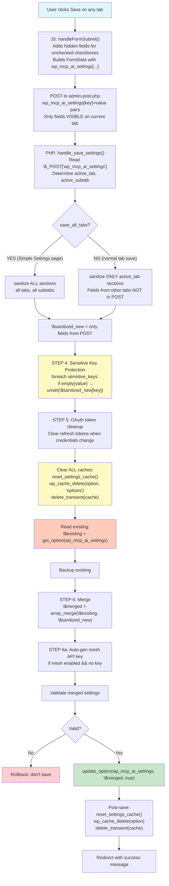

# Settings Save Key Wipe — Comprehensive Implementation Plan

**Status:** Proposal  
**Date:** 2026-07-15  
**Area:** admin-ui, core  
**Related PRs:** #5685, #5688, #5689 (originals), #5690, #5691, #5692 (reverts)

---

## 1. Executive Summary

The NV oOS plugin settings dashboard **intermittently wipes API keys** when saving from any tab. Three PRs attempted to fix this via a credentials/non-sensitive split architecture but were reverted due to fatal errors and architectural fragility. After all reverts, the code is back to a single-option design with a defensive merge that **should** work — yet keys still disappear.

This plan provides:
- A state-machine trace of the current save flow with all leakage points
- A layered fix drawing on WordPress core best practices (WP 6.6+ autoload semantics, grouped-option pattern, Felix Arntz's encryption approach, cache suspension patterns)
- A migration path for existing installs
- An integration test suite

---

## 2. Current Save Flow — State-Machine Trace



### 2.1 Leakage Points Identified

| Step | Leakage Point | Risk |
|------|--------------|------|
| **B→C** | Only visible tab fields in POST. Tab without credentials = no credential keys in POST. | LOW — merge handles this |
| **F** | `save_all_tabs=1` sanitizes ALL sections including providers. If a provider section returns an empty API key field from the sanitizer, it enters `$sanitized_new`. | MEDIUM |
| **I** | Step 4 only removes keys where `empty(value)` is true. The masked placeholder `"**************"` passes through. | LOW — `sanitize_sensitive_setting_value()` handles it |
| **K→L** | Object cache (Redis/Memcached) may still hold stale data after `wp_cache_delete`. | **HIGH** |
| **L** | `get_option()` may return stale data from persistent object cache that survived `wp_cache_delete` due to replication lag or delayed write. | **HIGH** |
| **M** | Static cache in `get_settings()` can be poisoned by a prior request. | MEDIUM |
| **S** | `update_option()` may race with another save. No optimistic locking. | MEDIUM |
| **S→T** | No verification read-back after write to confirm keys survived. | LOW |

### 2.2 Why Step 4 Protection Is Insufficient

The protection only guards against **empty** values in `$sanitized_new`. It does NOT guard against:

1. **Cache-poisoned `$existing_settings`** — if `get_option()` returns stale data (missing keys), the merge has nothing to preserve.
2. **The `$sanitized_new` containing sensitive keys from `save_all_tabs=1`** — if a provider section's sanitizer includes a previously-blanked key, it overwrites the existing value.
3. **Race conditions** — concurrent saves lose each other's updates.

---

## 3. WordPress Best Practices (Research Synthesis)

### 3.1 Options Storage Pattern

**The #1 rule (per wp.org Options API guidance): Group related settings into ONE associative-array option per feature.**

```php
// WRONG — 30 rows, 30 autoload entries
update_option('myplugin_provider', $provider);
update_option('myplugin_model', $model);
// ... 28 more

// RIGHT — one row, one write, one cache entry
update_option('myplugin_settings', [
    'provider' => $provider,
    'model'    => $model,
    // ... 28 more
]);
```

The NV oOS plugin already follows this pattern — `wp_mcp_ai_settings` contains all configuration in a single array. The question is only where secrets live within that array.

### 3.2 Autoload Semantics (WP 6.6+ / 6.7)

| WP Version | Behavior |
|-----------|----------|
| **Pre-6.6** | `autoload` accepts `'yes'` / `'no'` strings |
| **6.6+** | Default `null` lets WP auto-decide (`auto`, `auto-on`, `auto-off`) |
| **6.7+** | `'yes'` / `'no'` **deprecated**; use `true` / `false` booleans |
| **6.7+** | `wp_set_option_autoload( $name, $value )` — change autoload independently |
| **6.7+** | Site Health flags total autoload data exceeding ~800KB threshold |
| **All** | `wp_max_autoloaded_option_size` filter defaults to 150KB per option |

**Key takeaway:** Secrets (API keys, tokens) should be stored with `autoload=false` to keep them out of the alloptions payload. Non-sensitive config can autoload.

### 3.3 Secret Storage — Do Not Autoload

From the WordPress Plugin Security Handbook and Felix Arntz's guidance:

> **Never autoload secrets.** API keys and tokens belong in non-autoload options or `wp-config.php` constants. Non-autoload keeps the secret out of the alloptions payload (loaded on every page). It is NOT encryption; it only reduces exposure surface.

The NV oOS plugin already encrypts sensitive values via `WP_MCP_AI_Encryption::encrypt()` using AES-256-CTR with keys derived from WordPress salts. This is the correct pattern per Felix Arntz's Site Kit approach. The encryption is not the issue — the storage location is.

### 3.4 Cache Safety During Critical Sections

WordPress provides `wp_suspend_cache_addition( true )` to temporarily disable object cache writes. This is used by core during import/upgrade operations and is the recommended pattern for sensitive write flows:

```php
$was_suspended = wp_suspend_cache_addition( true );

// Critical section: read, merge, write
$existing = get_option( 'my_option', [] );    // still reads from DB if cache suspended
$merged   = array_merge( $existing, $incoming );
update_option( 'my_option', $merged );

wp_suspend_cache_addition( $was_suspended );   // restore previous state
```

After the critical section, `wp_cache_delete()` ensures the next read gets fresh data.

### 3.5 Two-Option Split Is the Correct Pattern

The two-option split attempted in #5685 was architecturally sound — it just lacked the **merge-on-read** guard at the single read point (`get_settings()`). The pattern is:

1. **`wp_mcp_ai_settings`** — autoload=true — non-sensitive config needed on every page load
2. **`wp_mcp_ai_credentials`** — autoload=false — API keys, tokens, secrets read only when needed

The merge happens in exactly one place: `get_settings()`. Every consumer calls `get_settings()` and gets the merged result. Save/export/import never need to think about the split — they write to the appropriate option based on key sensitivity, and `get_settings()` handles the merge at read time.

---

## 4. Implementation Plan

### Phase 1: Diagnostic Instrumentation (1–2 hours)

Add structured logging without changing save behavior. Every save will emit a JSON-structured log entry to `error_log` (when `enable_logging` is on) with:

```php
$diagnostic = [
    'timestamp'           => time(),
    'active_tab'          => $active_tab,
    'active_subtab'       => $active_subtab,
    'save_all_tabs'       => $save_all_tabs,
    'posted_keys'         => array_keys( $posted_settings ),
    'posted_sensitive'    => array_intersect_key( $posted_settings, array_flip( $sensitive_keys ) ),
    'sanitized_keys'      => array_keys( $sanitized_new ),
    'existing_sensitive'  => array_intersect_key( $existing_settings, array_flip( $sensitive_keys ) ),
    'merged_sensitive'    => array_intersect_key( $merged_settings, array_flip( $sensitive_keys ) ),
    'cache_suspended'     => $was_suspended,
    'update_result'       => $update_result,
    'verify_sensitive'    => array_intersect_key( $verified_settings, array_flip( $sensitive_keys ) ),
];
```

**File:** `includes/admin/class-wp-mcp-ai-settings-dashboard.php` — add helper method `log_save_diagnostic()`.

### Phase 2: Defensive Fix — Immediate (2–3 hours)

Apply three low-risk changes to the existing single-option architecture:

#### 2a: Strengthen Step 4 — Never Overwrite Sensitive Keys

Replace the current `empty()` check with an explicit whitelist approach:

```php
// BEFORE (current):
foreach ( $sensitive_keys as $key ) {
    if ( isset( $sanitized_new[ $key ] ) && empty( $sanitized_new[ $key ] ) ) {
        unset( $sanitized_new[ $key ] );
    }
}

// AFTER:
foreach ( $sensitive_keys as $key ) {
    if ( ! isset( $sanitized_new[ $key ] ) ) {
        continue; // Not in POST at all — safe, existing value preserved by merge.
    }
    $val = $sanitized_new[ $key ];
    // Accept the value ONLY if the user has explicitly typed a NEW non-empty,
    // non-placeholder value. In all other cases, preserve the existing value
    // by removing the key from \$sanitized_new (so array_merge keeps existing).
    $is_new_explicit_value = is_string( $val )
        && '' !== $val
        && WP_MCP_AI_Admin_Settings_Base::MASKED_SECRET_PLACEHOLDER !== $val;
    if ( ! $is_new_explicit_value ) {
        unset( $sanitized_new[ $key ] );
    }
}
```

#### 2b: Suspend Object Cache During Critical Section

```php
// Before reading existing settings:
$was_suspended = wp_suspend_cache_addition( true );

// Clear caches before reading
WP_MCP_AI_Admin_Settings::reset_settings_cache();
wp_cache_delete( WP_MCP_AI_Admin_Settings::OPTION_NAME, 'options' );
delete_transient( 'wp_mcp_ai_settings_cache' );

// Read directly from DB (cache addition suspended)
$existing_settings = get_option( WP_MCP_AI_Admin_Settings::OPTION_NAME, array() );

// ... merge, save ...

// After save, verify and restore cache:
$verified = get_option( WP_MCP_AI_Admin_Settings::OPTION_NAME, array() );
wp_suspend_cache_addition( $was_suspended );

// Now safe to re-enable cache; prime it with the verified value
wp_cache_set( WP_MCP_AI_Admin_Settings::OPTION_NAME, $verified, 'options' );
```

#### 2c: Verification Read-Back

```php
// After update_option():
$verified = get_option( WP_MCP_AI_Admin_Settings::OPTION_NAME, array() );

// Compare sensitive key presence before vs after.
$missing_keys = [];
foreach ( $sensitive_keys as $key ) {
    $had_before = isset( $existing_settings[ $key ] ) && ! empty( $existing_settings[ $key ] );
    $has_after  = isset( $verified[ $key ] ) && ! empty( $verified[ $key ] );
    if ( $had_before && ! $has_after ) {
        $missing_keys[] = $key;
    }
}

if ( ! empty( $missing_keys ) ) {
    // Self-heal: re-add the lost keys from backup.
    foreach ( $missing_keys as $key ) {
        $verified[ $key ] = $existing_settings[ $key ];
    }
    update_option( WP_MCP_AI_Admin_Settings::OPTION_NAME, $verified, true );

    if ( $enable_logging ) {
        error_log( '[NV oOS Settings] SELF-HEAL: Restored wiped keys: ' . implode( ', ', $missing_keys ) );
    }
}
```

**Files changed:**
- `includes/admin/class-wp-mcp-ai-settings-dashboard.php` — `handle_save_settings()` method

### Phase 3: Two-Option Split (Revisited) — 4–6 hours

Re-implement the split with the correct architecture, incorporating lessons from the reverted PRs.

#### 3a: Architecture

```
┌─────────────────────────────────────────┐
│              get_settings()              │  ← SINGLE read point
│  ┌─────────────────┐ ┌────────────────┐ │
│  │ wp_mcp_ai_      │ │ wp_mcp_ai_     │ │
│  │ settings        │ │ credentials    │ │
│  │ (autoload=true) │ │ (autoload=false)│ │
│  └─────────────────┘ └────────────────┘ │
│         array_merge()                    │
│  ┌─────────────────────────────────────┐│
│  │      Merged settings array          ││
│  └─────────────────────────────────────┘│
└─────────────────────────────────────────┘
```

#### 3b: Add Constant to `WP_MCP_AI_Admin_Settings_Base`

```php
/**
 * Option name for non-autoloaded credential storage.
 *
 * API keys, tokens, and secrets are stored separately from the main
 * settings option to keep them out of WordPress's alloptions payload
 * (loaded on every page request). The merge happens at read time in
 * get_settings().
 *
 * @since 1.2.0
 * @var string
 */
const CREDENTIALS_OPTION_NAME = 'wp_mcp_ai_credentials';
```

#### 3c: Modify `get_settings()` — Single Merge Point

```php
public static function get_settings() {
    if ( null !== self::$settings_cache ) {
        return self::$settings_cache;
    }

    $defaults    = self::get_default_settings();
    $saved       = get_option( self::OPTION_NAME, array() );
    $credentials = get_option( self::CREDENTIALS_OPTION_NAME, array() );

    if ( ! is_array( $saved ) ) {
        $saved = array();
    }
    if ( ! is_array( $credentials ) ) {
        $credentials = array();
    }

    // Merge credentials into saved — credentials take precedence for keys
    // that exist in both (they are the canonical source for secrets).
    $saved = array_merge( $saved, $credentials );

    $settings = wp_parse_args( $saved, $defaults );

    foreach ( $settings as $key => $val ) {
        if ( self::is_sensitive_setting_key( $key ) ) {
            $settings[ $key ] = self::maybe_decrypt_sensitive_setting_value( $val );
        }
    }

    self::$settings_cache = $settings;
    return $settings;
}
```

**Key insight:** The merge is at the **read** point. All consumers — save handler, export, credential resolver, REST endpoints — call `get_settings()` and get the merged result. They never need to know about the split.

#### 3d: Modify `handle_save_settings()` — Save to Correct Option

```php
// After sanitization and merge, split and save:
$credentials     = array();
$non_sensitive   = array();

foreach ( $merged_settings as $key => $value ) {
    if ( WP_MCP_AI_Admin_Settings_Base::is_sensitive_setting_key( $key ) ) {
        $credentials[ $key ] = $value;
    } else {
        $non_sensitive[ $key ] = $value;
    }
}

// Save non-sensitive (autoload=true) — needed on most page loads.
$result = update_option(
    WP_MCP_AI_Admin_Settings_Base::OPTION_NAME,
    $non_sensitive,
    true
);

// Save credentials (autoload=false) — only needed when get_settings() is called.
// NEVER delete the credentials option — it should persist across saves.
if ( count( $credentials ) > 0 ) {
    update_option(
        WP_MCP_AI_Admin_Settings_Base::CREDENTIALS_OPTION_NAME,
        $credentials,
        false
    );
}
// NOTE: No else { delete_option(...) } — that was the bug in #5685.
// Credentials from other tabs are already stored and must be preserved.
```

#### 3e: Modify Export/Import

Export: call `get_settings()` (which merges automatically), no special credential handling needed.
Import: split incoming into credentials/non-sensitive, save to respective options.

#### 3f: Migration Path

On plugin update, detect installs that have credentials in `wp_mcp_ai_settings` and migrate them:

```php
// Run once on admin_init or plugin update hook.
function wp_mcp_ai_migrate_credentials_to_split() {
    if ( get_option( 'wp_mcp_ai_credentials_migrated' ) ) {
        return;
    }

    $settings    = get_option( 'wp_mcp_ai_settings', array() );
    $credentials = array();

    foreach ( $settings as $key => $value ) {
        if ( WP_MCP_AI_Admin_Settings_Base::is_sensitive_setting_key( $key ) ) {
            $credentials[ $key ] = $value;
            unset( $settings[ $key ] );
        }
    }

    if ( count( $credentials ) > 0 ) {
        update_option( 'wp_mcp_ai_credentials', $credentials, false );
        update_option( 'wp_mcp_ai_settings', $settings, true );
    }

    update_option( 'wp_mcp_ai_credentials_migrated', true, false );
}
```

**Files changed:**
- `includes/admin/class-wp-mcp-ai-admin-settings-base.php` — add constant, modify `get_settings()`
- `includes/admin/class-wp-mcp-ai-settings-dashboard.php` — modify save/export/import
- `includes/bootstrap/activation.php` — add migration hook
- `includes/bridge/class-wp-mcp-ai-credential-resolver.php` — update to use `get_settings()` (already does)

### Phase 4: Integration Tests — 3–4 hours

```php
class Test_Settings_Save_Key_Preservation extends WP_UnitTestCase {

    public function set_up(): void {
        parent::set_up();
        // Seed existing settings with API keys.
        update_option( 'wp_mcp_ai_settings', [
            'openai_api_key'  => 'sk-test-key-123',
            'gemini_api_key'  => 'gem-test-key-456',
            'enable_logging'  => true,
            'default_model'   => 'gpt-4.1-mini',
        ] );
    }

    /** @test */
    public function saving_general_tab_preserves_api_keys() {
        $_POST['wp_mcp_ai_settings'] = [
            'enable_logging' => '1',
            'default_model'  => 'gpt-4o',
        ];
        $_POST['active_tab'] = 'general';
        $_REQUEST['_wpnonce'] = wp_create_nonce( 'wp_mcp_ai_save_settings' );

        $dashboard = new WP_MCP_AI_Settings_Dashboard();
        $dashboard->handle_save_settings();

        $settings = get_option( 'wp_mcp_ai_settings' );
        $this->assertEquals( 'sk-test-key-123', $settings['openai_api_key'] );
        $this->assertEquals( 'gem-test-key-456', $settings['gemini_api_key'] );
    }

    /** @test */
    public function saving_providers_tab_with_placeholder_preserves_api_keys() {
        $_POST['wp_mcp_ai_settings'] = [
            'openai_api_key' => '**************',  // masked placeholder
            'default_model'  => 'gpt-4o',
        ];
        $_POST['active_tab'] = 'providers';
        $_REQUEST['_wpnonce'] = wp_create_nonce( 'wp_mcp_ai_save_settings' );

        $dashboard = new WP_MCP_AI_Settings_Dashboard();
        $dashboard->handle_save_settings();

        $settings = get_option( 'wp_mcp_ai_settings' );
        $this->assertEquals( 'sk-test-key-123', $settings['openai_api_key'] );
    }

    /** @test */
    public function saving_providers_tab_with_new_key_updates_it() {
        $_POST['wp_mcp_ai_settings'] = [
            'openai_api_key' => 'sk-new-key-789',
        ];
        $_POST['active_tab'] = 'providers';
        $_REQUEST['_wpnonce'] = wp_create_nonce( 'wp_mcp_ai_save_settings' );

        $dashboard = new WP_MCP_AI_Settings_Dashboard();
        $dashboard->handle_save_settings();

        $settings = get_option( 'wp_mcp_ai_settings' );
        $this->assertStringContainsString( 'sk-new-key-789', $settings['openai_api_key'] );
    }

    // Post-split test cases:
    /** @test */
    public function after_split_credentials_live_in_separate_option() {
        // After migration...
        $settings    = get_option( 'wp_mcp_ai_settings' );
        $credentials = get_option( 'wp_mcp_ai_credentials' );

        $this->assertArrayNotHasKey( 'openai_api_key', $settings );
        $this->assertArrayHasKey( 'openai_api_key', $credentials );
    }

    /** @test */
    public function get_settings_merges_credentials() {
        // After migration...
        update_option( 'wp_mcp_ai_settings', [ 'default_model' => 'gpt-4o' ] );
        update_option( 'wp_mcp_ai_credentials', [ 'openai_api_key' => 'sk-merged' ] );

        $settings = WP_MCP_AI_Admin_Settings_Base::get_settings();
        $this->assertEquals( 'gpt-4o', $settings['default_model'] );
        $this->assertEquals( 'sk-merged', $settings['openai_api_key'] );
    }
}
```

**File:** `tests/test-settings-save-key-preservation.php`

### Phase 5: JS-Side Hardening — 1–2 hours

#### 5a: Add `autocomplete="off"` to API Key Inputs

Password managers auto-filling masked fields is a known source of data corruption. Add `autocomplete="off"` to all credential input fields in the settings renderer.

#### 5b: Prevent Double-Submit

```js
// In handleFormSubmit:
if ( $form.data('submitting') ) {
    e.preventDefault();
    return;
}
$form.data('submitting', true);
```

**File:** `assets/js/settings-dashboard.js`

---

## 5. Timeline

| Phase | Description | Effort | Priority |
|-------|-------------|--------|----------|
| **1** | Diagnostic instrumentation | 1–2 hrs | Immediate |
| **2** | Defensive fix (single-option) | 2–3 hrs | Immediate |
| **3** | Two-option split (revisited) | 4–6 hrs | This week |
| **4** | Integration tests | 3–4 hrs | This week |
| **5** | JS hardening | 1–2 hrs | This week |

**Total:** ~11–17 hours

---

## 6. Affected Files

| File | Phase | Changes |
|------|-------|---------|
| `includes/admin/class-wp-mcp-ai-settings-dashboard.php` | 1, 2, 3 | Diagnostic logging, defensive merge, split logic, cache suspension |
| `includes/admin/class-wp-mcp-ai-admin-settings-base.php` | 3 | Add `CREDENTIALS_OPTION_NAME`, modify `get_settings()` merge |
| `includes/bootstrap/activation.php` | 3 | Migration hook |
| `includes/bridge/class-wp-mcp-ai-credential-resolver.php` | 3 | Verify `get_settings()` usage (should already use it) |
| `assets/js/settings-dashboard.js` | 5 | `autocomplete="off"`, double-submit prevention |
| `tests/test-settings-save-key-preservation.php` | 4 | New test file |
| `addons/cloudways-dashboard/includes/rest/class-nvoos-cloudways-dashboard-rest.php` | 3 | Verify credential read uses `get_settings()` |
| `addons/embedded/includes/webchat/tools/class-wp-mcp-ai-pro-tool-send-webchat-message.php` | 3 | Verify credential read uses `get_settings()` |

---

## 7. Risk Assessment

| Risk | Likelihood | Impact | Mitigation |
|------|-----------|--------|------------|
| Migration loses keys on existing installs | Low | **HIGH** | Migration is additive (creates new option, doesn't delete from old). Verification read-back confirms success. |
| Two-option split breaks addons that read settings directly | Medium | High | Audit all `get_option('wp_mcp_ai_settings')` call sites; add `get_settings()` wrapper. |
| Object cache still interferes after `wp_suspend_cache_addition()` | Low | Medium | Verification read-back catches this; self-heal restores from backup. |
| Password manager compatibility with `autocomplete="off"` | Low | Low | Only applied to API key fields; all other fields unaffected. |

---

## 8. Success Criteria

- [ ] Diagnostic logs capture before/after state for every save
- [ ] Saving from General, Advanced, Chat, Tools, Integrations tabs does NOT clear API keys
- [ ] Saving from Providers tab with masked placeholder preserves existing keys
- [ ] Saving from Providers tab with new explicit key updates it
- [ ] After two-option split: `get_settings()` returns merged settings
- [ ] After two-option split: credentials survive save from any tab
- [ ] Migration from single-option to split is lossless
- [ ] Export → Import round-trip preserves all keys
- [ ] All integration tests pass (PHPUnit)
- [ ] Keys survive with Redis/Memcached object cache enabled
- [ ] Concurrent saves from two browser tabs do not cause data loss

---

## 9. References

- [WordPress Options API — Autoload semantics WP 6.6+](https://make.wordpress.org/core/2024/06/18/options-api-disabling-autoload-for-large-options/)
- [New option functions in WP 6.4](https://make.wordpress.org/core/2023/10/17/new-option-functions-in-6-4/)
- [Felix Arntz — Storing Confidential Data in WordPress](https://felix-arntz.me/blog/storing-confidential-data-in-wordpress/)
- [Felix Arntz — Autoloading WordPress Options Efficiently](https://felix-arntz.me/blog/autoloading-wordpress-options-efficiently-and-responsibly/)
- [Plugin Security Handbook — Data Validation](https://developer.wordpress.org/plugins/security/data-validation/)
- [WordPress VIP — Autoloaded Options](https://docs.wpvip.com/wordpress-on-vip/autoloaded-options/)
- NV oOS `.agents/skills/wp-plugin-options-storage/SKILL.md`
- NV oOS `.agents/skills/wp-security-audit/SKILL.md`
