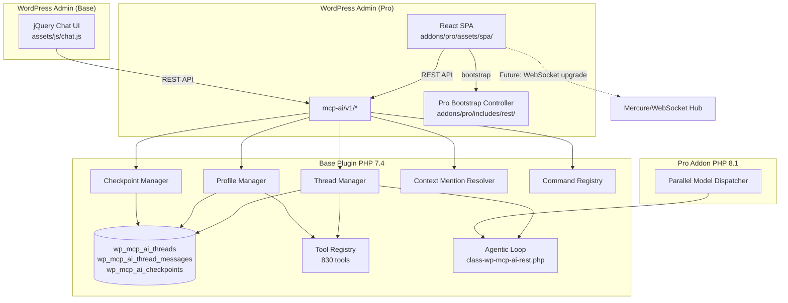
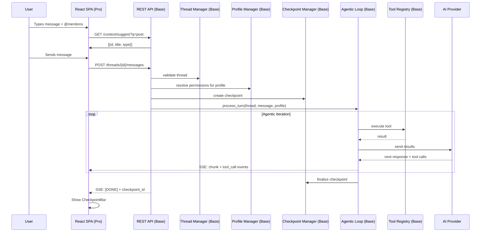

# Zed-Inspired SPA Architecture for NV oOS

> **Proposal ID:** ZED-SPA-2026-05  
> **Status:** Draft  
> **Author:** AI Agent (Zed Coding Agent)  
> **Date:** 2026-05-25  
> **Target:** NV oOS v1.7.0+  
> **Tiers:** Base (PHP backend) + Pro (React SPA frontend)

---

## Table of Contents

1. [Executive Summary](#1-executive-summary)
2. [Research & Inspiration](#2-research--inspiration)
3. [Tier Split: Base vs Pro](#3-tier-split-base-vs-pro)
4. [Architecture Overview](#4-architecture-overview)
5. [Database Schema](#5-database-schema)
6. [REST API Design](#6-rest-api-design)
7. [Base Plugin — PHP Backend](#7-base-plugin--php-backend)
8. [Pro Addon — React SPA Frontend](#8-pro-addon--react-spa-frontend)
9. [Implementation Phases](#9-implementation-phases)
10. [Files Manifest](#10-files-manifest)
11. [Backward Compatibility](#11-backward-compatibility)
12. [Risk Assessment](#12-risk-assessment)
13. [Open Questions & Decisions](#13-open-questions--decisions)

---

## 1. Executive Summary

This proposal outlines a comprehensive enhancement to NV oOS, inspired by the **Zed code editor's** architecture patterns — specifically its Threads Sidebar (parallel agents), Agent Panel, Inline Assistant, Command Palette, @-mention context system, agent profiles with tool permissions, and checkpoint/snapshot system. The enhancement delivers these patterns as a **React Single Page Application (SPA)** admin panel in the **Pro addon**, backed by new PHP infrastructure in the **base plugin**.

**Key architectural decision:** The React SPA and all browser-side UI enhancements live exclusively in Pro (`addons/pro/assets/spa/`). The base plugin (`includes/`) receives the PHP backend infrastructure (thread manager, profile manager, checkpoint manager, REST controllers, DB schema) — all PHP 7.4 compatible and consumable by both the existing jQuery chat UI and the new React SPA. This follows the existing tier pattern where base provides the API surface and Pro provides premium UI/UX.

---

## 2. Research & Inspiration

### 2.1 Zed's Design Patterns (Mapped to NV oOS)

| Zed Pattern | Zed Implementation | NV oOS Equivalent | Phase |
|-------------|-------------------|-------------------|-------|
| **Threads Sidebar** | Left-docked panel showing all agent threads grouped by project; run multiple agents in parallel | New Thread Manager + React ThreadsSidebar component; each thread = isolated conversation + model + profile | P2 |
| **Agent Panel** | Full-height conversation view; streaming responses; tool call indicators; message editing/queueing | Existing chat UI → React AgentPanel with SSE streaming, tool call cards, message editing | P1–P2 |
| **Command Palette** | `Cmd+Shift+P` universal launcher; fuzzy search across all actions, tools, navigation | New Command Registry (PHP) + React CommandPalette component | P6 |
| **Agent Profiles** | Write/Ask/Minimal profiles + custom; per-tool allow/deny/confirm patterns | New Profile Manager (PHP) + React ProfileSelector + ToolPermissionModal | P3 |
| **@-mention Context** | `@` autocomplete for files, dirs, symbols, threads, rules, diagnostics | New Context Mention Resolver (PHP) + React ContextMention autocomplete | P4 |
| **Checkpoints** | State snapshot on every model edit; one-click restore; accept/reject individual hunks | New Checkpoint Manager (PHP) + React CheckpointBar + DiffReviewPanel | P5 |
| **Multi-Model Inline Alternatives** | Same prompt → multiple models; cycle through outputs | New Parallel Model Dispatcher (Pro PHP) + React model cycling UI | P8 |
| **Inline Assistant** | Select text → `Ctrl+Enter` → transform in place | Gutenberg integration (Pro only); React InlineAssistant component | P7 |
| **CRDT Collaboration** | Conflict-free Replicated Data Types for zero-lag multiplayer editing | Simplified: collaborative AI-assisted authoring via polling/presence (Phase 9, long-term) | P9 |

### 2.2 WordPress SPA Best Practices

- **Framework:** React via `@wordpress/element` — already bundled in WP core since 5.0; zero additional bundle weight
- **State Management:** Zustand (1KB) — works outside React tree for SSE event handling; simpler than Redux
- **Bundling:** `@wordpress/scripts` — WP ecosystem standard; zero-config webpack
- **Routing:** Hash router (`#/chat`, `#/settings`) — no server config needed; WP permalink agnostic
- **Data Layer:** Existing REST API (`/wp-json/mcp-ai/v1/*`) — backend is already fully REST-compliant
- **CSS:** CSS Modules + `@wordpress/components` styles — scoped styles; matches WP admin look-and-feel

### 2.3 Key Zed Architecture Principles Applied

1. **AI is woven into the editing surface, not bolted on** — The SPA makes the Agent Panel the default view, not a secondary page
2. **Performance is a feature** — The SPA loads once, navigates instantly (no full page reloads between admin tabs)
3. **Explicit context > implicit search** — @-mentions let users inject exactly the right context
4. **Safety without friction** — Profiles make tool permissions simple; checkpoints make agentic editing safe
5. **Everything is discoverable** — Command palette makes all 830+ tools, actions, and navigation reachable by name

---

## 3. Tier Split: Base vs Pro

### 3.1 Principle

> **Base provides the API. Pro provides the premium UI.**

All new PHP infrastructure lives in the base plugin (PHP 7.4 compatible). The React SPA lives in the Pro addon (PHP 8.1+ for build tooling; served assets are vanilla JS). This ensures:

- Base users continue to use the jQuery chat UI with no disruption
- Pro users get the premium React SPA experience
- Both UIs consume the same REST API — no API duplication
- Future third-party clients can also consume the new REST endpoints

### 3.2 What Goes Where

| Component | Base (`includes/`) | Pro (`addons/pro/`) | Rationale |
|-----------|:---:|:---:|-----------|
| Thread Manager (PHP) | ✅ | — | Pure PHP CRUD; no UI dependency |
| Profile Manager (PHP) | ✅ | — | Profile logic is backend; UI is Pro |
| Checkpoint Manager (PHP) | ✅ | — | State snapshots are backend concern |
| Context Mention Resolver (PHP) | ✅ | — | @-mention resolution is a REST endpoint |
| Command Registry (PHP) | ✅ | — | Action registry is backend; UI is Pro |
| REST Controllers (PHP) | ✅ | — | API surface lives in base |
| DB Schema / Migration | ✅ | — | Schema is infrastructure |
| **React SPA (all components)** | — | ✅ | Premium UI is Pro-only |
| **SPA Bootstrap endpoint** | — | ✅ | Pro-specific boot data |
| Parallel Model Dispatcher | — | ✅ | Multi-model requires Pro compute |
| Inline Assistant (Gutenberg) | — | ✅ | Deep editor integration is Pro |
| SPA webpack/build config | — | ✅ | Build tooling lives in Pro |
| Pro-specific hooks/filters | — | ✅ | Extension points in Pro |

### 3.3 PHP Compatibility

| Tier | Minimum PHP | Location | Constraints |
|------|------------|----------|-------------|
| Base | **PHP 7.4** | `includes/` | No enums, no `readonly`, no union types, no named arguments, no match expressions |
| Pro | **PHP 8.1** | `addons/pro/includes/` | Enums, fibers, `readonly`, named args, intersection types OK |

All new base classes **must** use PHP 7.4 patterns:
- PHPDoc `@param` instead of typed properties
- `array` type hints only (no `string|int`)
- Traditional `switch` instead of `match`
- No constructor property promotion

---

## 4. Architecture Overview

### 4.1 System Diagram



### 4.2 Data Flow — SPA Chat Turn



### 4.3 Component Tree (React SPA)

```
<App>
  <AdminPage>                          {/* WP admin chrome (header, sidebar) handled by WP */}
    <CommandPalette />                  {/* Global overlay; Cmd+K to open */}
    <Layout>
      <ThreadsSidebar>                  {/* Left panel (Zed pattern) */}
        <ThreadGroup label="Site Content">
          <ThreadItem />                {/* Per-thread: title, status, agent */}
          <ThreadItem />
        </ThreadGroup>
        <ThreadGroup label="SEO">
          <ThreadItem />
        </ThreadGroup>
        <NewThreadButton />
      </ThreadsSidebar>

      <MainContent>
        <Routes>
          <Route path="/chat/:threadId?">
            <AgentPanel>                {/* Zed's Agent Panel equivalent */}
              <ThreadHeader>            {/* Title, model selector, profile selector */}
                <ModelSelector />
                <ProfileSelector />
              </ThreadHeader>
              <MessageList>             {/* Virtual-scrolled message list */}
                <MessageItem />         {/* User message (editable) */}
                <AgentResponse>         {/* Assistant response */}
                  <ToolCallCard />      {/* Tool invocation indicator */}
                  <CheckpointBar />     {/* "Restore Checkpoint" after edits */}
                </AgentResponse>
              </MessageList>
              <ContextMention />         {/* @-mention autocomplete dropdown */}
              <MessageEditor>           {/* Textarea + @mention trigger */}
                <AttachmentButton />
                <SendButton />
              </MessageEditor>
            </AgentPanel>
          </Route>
          <Route path="/settings" component={SettingsPage} />
          <Route path="/tools" component={ToolsPage} />
          <Route path="/assistants" component={AssistantsPage} />
          <Route path="/workflows" component={WorkflowsPage} />
          <Route path="/analytics" component={AnalyticsPage} />
        </Routes>
      </MainContent>

      <RightPanel>                      {/* Contextual side panel */}
        <DiffReviewPanel />             {/* Accept/reject individual hunks */}
        <ToolPermissionModal />         {/* Per-tool allow/deny/confirm */}
        <MemoryDrawer />                {/* Existing memory drawer */}
        <TasksDrawer />                 {/* Existing tasks drawer */}
      </RightPanel>
    </Layout>
    <StatusBar>                         {/* Bottom bar */}
      <AgentStatus />                   {/* "Agent is writing..." */}
      <TokenUsage />                    {/* Token count */}
      <FollowToggle />                  {/* Follow agent across files */}
    </StatusBar>
  </AdminPage>
</App>
```

---

## 5. Database Schema

### 5.1 New Tables (Base Plugin)

All tables use `wp_` prefix from `$wpdb->prefix`. Migration runs on plugin update.

#### `wp_mcp_ai_threads`

```sql
CREATE TABLE `{$prefix}mcp_ai_threads` (
    `id`              BIGINT UNSIGNED NOT NULL AUTO_INCREMENT,
    `assistant_id`    BIGINT UNSIGNED NOT NULL DEFAULT 0,
    `user_id`         BIGINT UNSIGNED NOT NULL DEFAULT 0,
    `title`           VARCHAR(255) NOT NULL DEFAULT '',
    `model_provider`  VARCHAR(50) NOT NULL DEFAULT '',
    `model_name`      VARCHAR(100) NOT NULL DEFAULT '',
    `profile_name`    VARCHAR(50) NOT NULL DEFAULT 'write',
    `scope_type`      VARCHAR(50) NOT NULL DEFAULT 'site',   -- 'site', 'post_type', 'category'
    `scope_value`     VARCHAR(255) NOT NULL DEFAULT '',
    `status`          VARCHAR(20) NOT NULL DEFAULT 'active',  -- 'active', 'archived', 'summarizing'
    `message_count`   INT UNSIGNED NOT NULL DEFAULT 0,
    `token_count`     INT UNSIGNED NOT NULL DEFAULT 0,
    `created_at`      DATETIME NOT NULL DEFAULT CURRENT_TIMESTAMP,
    `updated_at`      DATETIME NOT NULL DEFAULT CURRENT_TIMESTAMP ON UPDATE CURRENT_TIMESTAMP,
    `archived_at`     DATETIME NULL DEFAULT NULL,
    PRIMARY KEY (`id`),
    KEY `user_id` (`user_id`),
    KEY `assistant_id` (`assistant_id`),
    KEY `status` (`status`),
    KEY `created_at` (`created_at`)
) ENGINE=InnoDB DEFAULT CHARSET=utf8mb4;
```

#### `wp_mcp_ai_thread_messages`

```sql
CREATE TABLE `{$prefix}mcp_ai_thread_messages` (
    `id`              BIGINT UNSIGNED NOT NULL AUTO_INCREMENT,
    `thread_id`       BIGINT UNSIGNED NOT NULL,
    `role`            VARCHAR(20) NOT NULL,                   -- 'user', 'assistant', 'system', 'tool'
    `content`         LONGTEXT NOT NULL,
    `tool_calls`      LONGTEXT NULL,                          -- JSON; tool invocations from this message
    `tool_results`    LONGTEXT NULL,                          -- JSON; tool results fed back
    `checkpoint_id`   BIGINT UNSIGNED NULL DEFAULT NULL,     -- FK to checkpoints table
    `token_usage`     INT UNSIGNED NOT NULL DEFAULT 0,
    `model_provider`  VARCHAR(50) NOT NULL DEFAULT '',
    `model_name`      VARCHAR(100) NOT NULL DEFAULT '',
    `created_at`      DATETIME NOT NULL DEFAULT CURRENT_TIMESTAMP,
    PRIMARY KEY (`id`),
    KEY `thread_id` (`thread_id`),
    KEY `created_at` (`created_at`),
    KEY `thread_id_created` (`thread_id`, `created_at`)
) ENGINE=InnoDB DEFAULT CHARSET=utf8mb4;
```

#### `wp_mcp_ai_checkpoints`

```sql
CREATE TABLE `{$prefix}mcp_ai_checkpoints` (
    `id`              BIGINT UNSIGNED NOT NULL AUTO_INCREMENT,
    `thread_id`       BIGINT UNSIGNED NOT NULL,
    `message_id`      BIGINT UNSIGNED NULL DEFAULT NULL,     -- Message after which this checkpoint was taken
    `label`           VARCHAR(255) NOT NULL DEFAULT '',
    `state_snapshot`  LONGTEXT NOT NULL,                      -- JSON; serialized state diff
    `affected_entities` LONGTEXT NULL,                       -- JSON; [{type, id, before, after}]
    `created_at`      DATETIME NOT NULL DEFAULT CURRENT_TIMESTAMP,
    PRIMARY KEY (`id`),
    KEY `thread_id` (`thread_id`),
    KEY `thread_id_created` (`thread_id`, `created_at`)
) ENGINE=InnoDB DEFAULT CHARSET=utf8mb4;
```

#### `wp_mcp_ai_profiles`

```sql
CREATE TABLE `{$prefix}mcp_ai_profiles` (
    `id`              BIGINT UNSIGNED NOT NULL AUTO_INCREMENT,
    `name`            VARCHAR(50) NOT NULL,                   -- 'write', 'ask', 'minimal', 'custom-name'
    `label`           VARCHAR(255) NOT NULL DEFAULT '',
    `is_builtin`      TINYINT(1) NOT NULL DEFAULT 0,
    `tool_allowlist`  LONGTEXT NULL,                          -- JSON; ['tool_slug', ...] or null = all
    `tool_denylist`   LONGTEXT NULL,                          -- JSON; ['tool_slug', ...]
    `always_confirm`  LONGTEXT NULL,                          -- JSON; ['tool_slug', ...]
    `always_allow`    LONGTEXT NULL,                          -- JSON; ['tool_slug', ...]
    `default_approval` VARCHAR(20) NOT NULL DEFAULT 'confirm', -- 'allow', 'deny', 'confirm'
    `user_id`         BIGINT UNSIGNED NULL DEFAULT NULL,      -- NULL = site-wide; user_id = per-user
    `created_at`      DATETIME NOT NULL DEFAULT CURRENT_TIMESTAMP,
    `updated_at`      DATETIME NOT NULL DEFAULT CURRENT_TIMESTAMP ON UPDATE CURRENT_TIMESTAMP,
    PRIMARY KEY (`id`),
    UNIQUE KEY `name_user` (`name`, `user_id`),
    KEY `user_id` (`user_id`)
) ENGINE=InnoDB DEFAULT CHARSET=utf8mb4;
```

### 5.2 Pro-Specific Extensions

Pro extends the `wp_mcp_ai_threads` table with a `pro_meta` longtext JSON column (added via `dbDelta` in Pro migration):

```json
{
  "parallel_model_alternatives": [
    { "provider": "anthropic", "model": "claude-sonnet-4-5" }
  ],
  "inline_assistant_enabled": true,
  "worktree_site_id": 0
}
```

Pro also adds an `wp_mcp_ai_pro_thread_snapshots` table for multi-model parallel result storage (Phase 8).

---

## 6. REST API Design

### 6.1 Namespace

All endpoints live under the existing namespace:

```
/wp-json/mcp-ai/v1/
```

### 6.2 New Base Endpoints

#### Threads

| Method | Route | Description | Capability |
|--------|-------|-------------|------------|
| `GET` | `/threads` | List user's threads (paginated, filterable by status/scope) | `read` |
| `POST` | `/threads` | Create a new thread | `read` |
| `GET` | `/threads/{id}` | Get thread detail + recent messages | `read` |
| `PUT` | `/threads/{id}` | Update thread (title, profile, model, scope) | `edit_posts` |
| `DELETE` | `/threads/{id}` | Archive thread (soft-delete; sets status='archived') | `edit_posts` |
| `POST` | `/threads/{id}/restore` | Restore archived thread | `edit_posts` |
| `POST` | `/threads/{id}/summarize` | Compact thread — summarize, create new thread with summary as context, archive old | `edit_posts` |
| `POST` | `/threads/{id}/messages` | Send a message to the thread (SSE streaming response) | `read` |
| `GET` | `/threads/{id}/messages` | Get messages for a thread (paginated) | `read` |

#### Profiles

| Method | Route | Description | Capability |
|--------|-------|-------------|------------|
| `GET` | `/profiles` | List all profiles (built-in + custom) | `read` |
| `POST` | `/profiles` | Create custom profile | `manage_options` |
| `GET` | `/profiles/{id}` | Get profile detail | `read` |
| `PUT` | `/profiles/{id}` | Update profile (override built-in = create custom with same name) | `manage_options` |
| `DELETE` | `/profiles/{id}` | Delete custom profile | `manage_options` |
| `GET` | `/profiles/{id}/tools` | List tools available under this profile | `read` |

#### Checkpoints

| Method | Route | Description | Capability |
|--------|-------|-------------|------------|
| `GET` | `/threads/{id}/checkpoints` | List checkpoints for thread | `read` |
| `POST` | `/threads/{id}/checkpoints` | Manually create checkpoint | `edit_posts` |
| `POST` | `/threads/{id}/checkpoints/{cp_id}/restore` | Restore thread state to checkpoint | `edit_posts` |
| `GET` | `/threads/{id}/checkpoints/{cp_id}/diff` | Get diff of changes since checkpoint | `read` |

#### Context Mentions

| Method | Route | Description | Capability |
|--------|-------|-------------|------------|
| `GET` | `/context/suggest` | Autocomplete for @-mentions. Query params: `q` (search), `types[]` (post_types, tools, skills, threads, files, users, terms, settings) | `read` |
| `GET` | `/context/{type}/{id}` | Resolve a mention to its full context payload (injected into system prompt) | `read` |

#### Command Palette

| Method | Route | Description | Capability |
|--------|-------|-------------|------------|
| `GET` | `/commands` | List all registered commands for fuzzy search (returns id, label, category, keywords) | `read` |

### 6.3 New Pro Endpoints

#### SPA Bootstrap

| Method | Route | Description | Capability |
|--------|-------|-------------|------------|
| `GET` | `/mcp-ai-pro/v1/spa/bootstrap` | Single-request bootstrap: user threads, profiles, tools catalogue, settings, capabilities, commands. Optimized for SPA initial load. | `read` |

#### Multi-Model (Phase 8)

| Method | Route | Description | Capability |
|--------|-------|-------------|------------|
| `POST` | `/mcp-ai-pro/v1/threads/{id}/compare-models` | Send same prompt to multiple models; return parallel results | `read` |

### 6.4 Request/Response Examples

#### Create Thread

```http
POST /wp-json/mcp-ai/v1/threads
Content-Type: application/json
X-WP-Nonce: {{nonce}}

{
  "assistant_id": 42,
  "title": "",
  "model": { "provider": "openai", "model": "gpt-4o" },
  "profile": "write",
  "scope": { "type": "post_type", "value": "post" }
}
```

```json
{
  "success": true,
  "data": {
    "id": 1,
    "title": "New Thread",
    "status": "active",
    "model_provider": "openai",
    "model_name": "gpt-4o",
    "profile_name": "write",
    "created_at": "2026-05-25T12:00:00Z"
  }
}
```

#### Send Message (SSE)

```http
POST /wp-json/mcp-ai/v1/threads/1/messages
Content-Type: application/json
Accept: text/event-stream
X-WP-Nonce: {{nonce}}

{
  "content": "Analyze the SEO of @post:hello-world",
  "context_mentions": [
    { "type": "post", "id": 123, "title": "Hello World" }
  ]
}
```

```
event: chunk
data: {"content": "I'll", "thread_id":1}

event: chunk
data: {"content": " analyze", "thread_id":1}

event: tool_call
data: {"tool":"rank_math_analysis","arguments":{"post_id":123}}

event: tool_result
data: {"tool":"rank_math_analysis","success":true,"data":{"score":85}}

event: chunk
data: {"content": " the SEO...", "thread_id":1}

event: done
data: {"thread_id":1,"message_id":5,"checkpoint_id":3,"token_usage":1240}
```

#### @-mention Autocomplete

```http
GET /wp-json/mcp-ai/v1/context/suggest?q=post:hello&types[]=posts&types[]=tools
```

```json
{
  "success": true,
  "data": {
    "posts": [
      { "id": 123, "title": "Hello World", "type": "post", "excerpt": "My first post..." }
    ],
    "tools": []
  }
}
```

---

## 7. Base Plugin — PHP Backend

### 7.1 Class Overview

| Class | File | Purpose |
|-------|------|---------|
| `WP_MCP_AI_Thread_Manager` | `includes/class-wp-mcp-ai-thread-manager.php` | Thread CRUD, message management, archival, summarization |
| `WP_MCP_AI_Profile_Manager` | `includes/class-wp-mcp-ai-profile-manager.php` | Profile CRUD, permission resolution, built-in profile seeding |
| `WP_MCP_AI_Checkpoint_Manager` | `includes/class-wp-mcp-ai-checkpoint-manager.php` | State snapshot creation, restoration, diff computation |
| `WP_MCP_AI_Context_Mention_Resolver` | `includes/class-wp-mcp-ai-context-mention-resolver.php` | @-mention type resolution and autocomplete |
| `WP_MCP_AI_Command_Registry` | `includes/class-wp-mcp-ai-command-registry.php` | Action/command registration for palette |
| `WP_MCP_AI_Threads_Schema` | `includes/class-wp-mcp-ai-threads-schema.php` | DB table creation/migration |

### 7.2 REST Controllers

| Class | File | Purpose |
|-------|------|---------|
| `WP_MCP_AI_REST_Threads_Controller` | `includes/rest/class-wp-mcp-ai-rest-threads-controller.php` | Thread CRUD endpoints |
| `WP_MCP_AI_REST_Profiles_Controller` | `includes/rest/class-wp-mcp-ai-rest-profiles-controller.php` | Profile management endpoints |
| `WP_MCP_AI_REST_Checkpoints_Controller` | `includes/rest/class-wp-mcp-ai-rest-checkpoints-controller.php` | Checkpoint endpoints |
| `WP_MCP_AI_REST_Context_Controller` | `includes/rest/class-wp-mcp-ai-rest-context-controller.php` | @-mention autocomplete endpoint |
| `WP_MCP_AI_REST_Commands_Controller` | `includes/rest/class-wp-mcp-ai-rest-commands-controller.php` | Command palette endpoint |

### 7.3 Key Class Design — `WP_MCP_AI_Thread_Manager`

```php
<?php
/**
 * Thread Manager — CRUD for agent conversation threads.
 *
 * @package NV_oOS
 * @since   1.7.0
 */

class WP_MCP_AI_Thread_Manager {

    /** @var wpdb */
    private $wpdb;

    /** @var string Threads table name. */
    private $threads_table;

    /** @var string Messages table name. */
    private $messages_table;

    /** @var int Maximum threads per user (filterable). */
    private $max_threads_per_user = 50;

    /** @var int Maximum messages per thread (filterable). */
    private $max_messages_per_thread = 500;

    /**
     * Constructor.
     */
    public function __construct() {
        global $wpdb;
        $this->wpdb           = $wpdb;
        $this->threads_table  = $wpdb->prefix . 'mcp_ai_threads';
        $this->messages_table = $wpdb->prefix . 'mcp_ai_thread_messages';

        $this->max_threads_per_user  = apply_filters( 'wp_mcp_ai_max_threads_per_user', 50 );
        $this->max_messages_per_thread = apply_filters( 'wp_mcp_ai_max_messages_per_thread', 500 );
    }

    /**
     * Create a new thread.
     *
     * @param int    $user_id      WordPress user ID.
     * @param int    $assistant_id Assistant post ID.
     * @param array  $model        { provider: string, model: string }.
     * @param string $profile      Profile name (default: 'write').
     * @param array  $scope        { type: string, value: string }.
     * @return array|WP_Error      Thread data or error.
     */
    public function create_thread( $user_id, $assistant_id, $model, $profile = 'write', $scope = array() ) {
        $user_id      = absint( $user_id );
        $assistant_id = absint( $assistant_id );
        $profile      = sanitize_key( $profile );

        // Enforce max threads limit.
        $count = $this->count_user_threads( $user_id, 'active' );
        if ( $count >= $this->max_threads_per_user ) {
            return new WP_Error(
                'thread_limit_reached',
                __( 'Maximum number of active threads reached.', 'mcp-ai-wpoos' )
            );
        }

        $data = array(
            'assistant_id'   => $assistant_id,
            'user_id'        => $user_id,
            'title'          => __( 'New Thread', 'mcp-ai-wpoos' ),
            'model_provider' => sanitize_key( $model['provider'] ),
            'model_name'     => sanitize_text_field( $model['model'] ),
            'profile_name'   => $profile,
            'scope_type'     => isset( $scope['type'] ) ? sanitize_key( $scope['type'] ) : 'site',
            'scope_value'    => isset( $scope['value'] ) ? sanitize_text_field( $scope['value'] ) : '',
            'status'         => 'active',
            'created_at'     => current_time( 'mysql' ),
            'updated_at'     => current_time( 'mysql' ),
        );

        $inserted = $this->wpdb->insert( $this->threads_table, $data, $this->get_thread_format() );
        if ( false === $inserted ) {
            return new WP_Error( 'db_error', __( 'Failed to create thread.', 'mcp-ai-wpoos' ) );
        }

        $data['id'] = $this->wpdb->insert_id;

        /** This action is documented in includes/class-wp-mcp-ai-thread-manager.php */
        do_action( 'wp_mcp_ai_thread_created', $data['id'], $data );

        return array(
            'success' => true,
            'message' => __( 'Thread created.', 'mcp-ai-wpoos' ),
            'data'    => $data,
        );
    }

    /**
     * Archive a thread (soft delete).
     *
     * @param int $thread_id Thread ID.
     * @param int $user_id   WordPress user ID (ownership check).
     * @return array|WP_Error
     */
    public function archive_thread( $thread_id, $user_id ) {
        // ... ownership check, update status to 'archived', set archived_at
    }

    /**
     * Add a message to a thread.
     *
     * @param int    $thread_id   Thread ID.
     * @param string $role        'user', 'assistant', 'system', 'tool'.
     * @param string $content     Message content.
     * @param array  $meta        Optional: tool_calls, tool_results, checkpoint_id.
     * @return array|WP_Error
     */
    public function add_message( $thread_id, $role, $content, $meta = array() ) {
        // ... insert message, update thread message_count + updated_at
    }

    /**
     * Get messages for a thread (paginated).
     *
     * @param int $thread_id Thread ID.
     * @param int $page      Page number.
     * @param int $per_page  Messages per page.
     * @return array
     */
    public function get_messages( $thread_id, $page = 1, $per_page = 50 ) {
        // ...
    }

    /**
     * Get thread context for LLM (formatted message array).
     *
     * @param int $thread_id Thread ID.
     * @param int $limit     Max messages to include (default: last 50).
     * @return array         Array of { role, content } for LLM API.
     */
    public function get_thread_context( $thread_id, $limit = 50 ) {
        // ...
    }

    /**
     * Summarize thread and create continuation.
     *
     * Creates a summary of the thread, creates a new thread
     * with the summary as initial context, archives the old thread.
     *
     * @param int   $thread_id Thread to compact.
     * @param int   $user_id   WordPress user ID.
     * @return array|WP_Error  New thread data or error.
     */
    public function summarize_thread( $thread_id, $user_id ) {
        // ...
    }

    // ... additional methods for listing, filtering, counting threads
}
```

### 7.4 Key Class Design — `WP_MCP_AI_Profile_Manager`

```php
<?php
/**
 * Profile Manager — Tool permission profiles for agent safety.
 *
 * Built-in profiles: write, ask, minimal.
 * Custom profiles: user-defined tool subsets + permission patterns.
 *
 * @package NV_oOS
 * @since   1.7.0
 */

class WP_MCP_AI_Profile_Manager {

    /** @var array Built-in profile definitions. */
    const BUILTIN_PROFILES = array(
        'write' => array(
            'label'            => 'Write',
            'description'      => 'All tools enabled — full agentic editing.',
            'default_approval' => 'confirm',
            'tool_allowlist'   => null,  // null = all tools
            'tool_denylist'    => array(),
        ),
        'ask' => array(
            'label'            => 'Ask',
            'description'      => 'Read-only tools only — safe for research and analysis.',
            'default_approval' => 'allow',
            'tool_allowlist'   => null,  // Will be filtered to read-only tools at resolve time
            'tool_denylist'    => array(),
        ),
        'minimal' => array(
            'label'            => 'Minimal',
            'description'      => 'No tools — pure LLM conversation.',
            'default_approval' => 'allow',
            'tool_allowlist'   => array(),
            'tool_denylist'    => array(),
        ),
    );

    /** @var wpdb */
    private $wpdb;

    /** @var string Profiles table. */
    private $table;

    /**
     * Resolve whether a tool is allowed/denied/needs-confirmation for a profile.
     *
     * Returns one of: 'allow', 'deny', 'confirm'
     *
     * Resolution order:
     * 1. always_deny pattern match → 'deny'
     * 2. always_allow pattern match → 'allow'
     * 3. tool_denylist exact match → 'deny'
     * 4. tool_allowlist check (null=all, empty=none, array=listed) → 'allow' or 'deny'
     * 5. default_approval → 'confirm'
     *
     * @param string $profile_name Profile name.
     * @param string $tool_slug    Tool slug.
     * @return string 'allow' | 'deny' | 'confirm'
     */
    public function resolve_permission( $profile_name, $tool_slug ) {
        // ...
    }

    /**
     * Filter tool definitions to only those allowed by profile.
     *
     * Used when building the tools array for the LLM API request.
     *
     * @param string $profile_name Profile name.
     * @param array  $all_tools    All registered tool definitions.
     * @return array               Filtered tool definitions.
     */
    public function filter_tools_for_profile( $profile_name, $all_tools ) {
        // ...
    }

    // ... CRUD methods: create, update, delete, get, list
}
```

### 7.5 Key Class Design — `WP_MCP_AI_Checkpoint_Manager`

```php
<?php
/**
 * Checkpoint Manager — State snapshots for safe agentic editing.
 *
 * Creates WordPress state snapshots before each agentic turn.
 * Supports restoration to any previous checkpoint.
 *
 * @package NV_oOS
 * @since   1.7.0
 */

class WP_MCP_AI_Checkpoint_Manager {

    /** @var wpdb */
    private $wpdb;

    /** @var string Checkpoints table. */
    private $table;

    /** @var int Max checkpoints per thread. */
    private $max_checkpoints = 50;

    /** @var int Checkpoint TTL in seconds (default: 24 hours). */
    private $ttl = 86400;

    /**
     * Create a checkpoint capturing current WordPress state.
     *
     * Captures: posts modified during this turn, options changed,
     * terms affected, users modified. Uses a lightweight diff approach
     * — only records entities that were actually changed.
     *
     * @param int   $thread_id    Thread ID.
     * @param int   $message_id   Message ID before which checkpoint is taken.
     * @param array $affected_ids Array of {type, id} touched during the turn.
     * @return array|WP_Error
     */
    public function create_checkpoint( $thread_id, $message_id, $affected_ids = array() ) {
        $state = array();
        foreach ( $affected_ids as $entity ) {
            $state[] = $this->capture_entity_state( $entity['type'], $entity['id'] );
        }

        // ...
    }

    /**
     * Capture a single entity's current state.
     *
     * @param string $type Entity type (post, option, term, user, comment).
     * @param int    $id   Entity ID.
     * @return array       { type, id, state: {...} }
     */
    private function capture_entity_state( $type, $id ) {
        switch ( $type ) {
            case 'post':
                $post = get_post( absint( $id ) );
                return array(
                    'type'  => 'post',
                    'id'    => absint( $id ),
                    'state' => $post ? $post->to_array() : null,
                );
            case 'option':
                return array(
                    'type'  => 'option',
                    'id'    => sanitize_key( $id ),
                    'state' => get_option( $id, null ),
                );
            // ... term, user, comment
        }
    }

    /**
     * Restore state to a checkpoint.
     *
     * @param int $thread_id     Thread ID.
     * @param int $checkpoint_id Checkpoint ID to restore to.
     * @return array|WP_Error
     */
    public function restore_checkpoint( $thread_id, $checkpoint_id ) {
        $checkpoint = $this->get_checkpoint( $checkpoint_id );
        if ( is_wp_error( $checkpoint ) ) {
            return $checkpoint;
        }

        $state = json_decode( $checkpoint['state_snapshot'], true );
        foreach ( $state as $entity ) {
            $this->restore_entity_state( $entity );
        }

        // Delete all checkpoints after this one.
        $this->prune_checkpoints_after( $thread_id, $checkpoint_id );

        return array(
            'success' => true,
            'message' => __( 'Checkpoint restored.', 'mcp-ai-wpoos' ),
            'data'    => array( 'thread_id' => absint( $thread_id ) ),
        );
    }

    /**
     * Compute diff of changes since a checkpoint.
     *
     * @param int $thread_id     Thread ID.
     * @param int $checkpoint_id Checkpoint ID.
     * @return array             Array of { type, id, before, after } diffs.
     */
    public function diff( $thread_id, $checkpoint_id ) {
        // Compare captured state with current state for each entity.
    }

    // ... additional methods: get_checkpoint, list_checkpoints, prune_old
}
```

### 7.6 Command Registry Pattern

```php
<?php
/**
 * Command Registry — Universal action palette.
 *
 * Commands are registered via filter. Each command has:
 * - id: unique slug
 * - label: human-readable name
 * - category: grouping (Threads, Tools, Navigation, Settings, etc.)
 * - keywords: search aliases
 * - capability: required WP capability
 * - handler: optional JS callback name (for SPA) or URL (for jQuery fallback)
 *
 * @package NV_oOS
 * @since   1.7.0
 */

class WP_MCP_AI_Command_Registry {

    /**
     * Get all registered commands for the current user.
     *
     * @return array Array of { id, label, category, keywords, capability, handler }.
     */
    public function get_commands() {
        $commands = array();

        // Built-in commands.
        $commands[] = array(
            'id'         => 'thread.new',
            'label'      => __( 'New Thread', 'mcp-ai-wpoos' ),
            'category'   => 'Threads',
            'keywords'   => array( 'create', 'start', 'conversation' ),
            'capability' => 'read',
            'handler'    => 'nvoos:thread.new',
        );

        $commands[] = array(
            'id'         => 'thread.archive',
            'label'      => __( 'Archive Thread', 'mcp-ai-wpoos' ),
            'category'   => 'Threads',
            'keywords'   => array( 'delete', 'close', 'remove' ),
            'capability' => 'edit_posts',
            'handler'    => 'nvoos:thread.archive',
        );

        // Tools are registered as commands.
        $tools = WP_MCP_AI_Tool_Registry::get_instance()->get_tools();
        foreach ( $tools as $slug => $tool ) {
            $commands[] = array(
                'id'         => 'tool.' . $slug,
                'label'      => $tool['name'],
                'category'   => 'Tools',
                'keywords'   => array( $slug ),
                'capability' => $tool['required_capability'],
                'handler'    => 'nvoos:tool.execute',
                'meta'       => array( 'tool_slug' => $slug ),
            );
        }

        // Navigation commands.
        $commands[] = array(
            'id'         => 'nav.settings',
            'label'      => __( 'Settings', 'mcp-ai-wpoos' ),
            'category'   => 'Navigation',
            'keywords'   => array( 'config', 'preferences', 'options' ),
            'capability' => 'manage_options',
            'handler'    => 'nvoos:nav.go',
            'meta'       => array( 'route' => '/settings' ),
        );

        /** This filter is documented in includes/class-wp-mcp-ai-command-registry.php */
        return apply_filters( 'wp_mcp_ai_commands', $commands );
    }
}
```

---

## 8. Pro Addon — React SPA Frontend

### 8.1 Directory Structure

```
addons/pro/assets/spa/
├── package.json                     # React, Zustand, React Router, @wordpress/scripts
├── webpack.config.js                # wp-scripts compatible config
├── src/
│   ├── index.js                     # Entry: ReactDOM.render into #wp-mcp-ai-spa-root
│   ├── App.jsx                      # Root component: CommandPalette + Layout + Router
│   ├── router.jsx                   # Hash router config
│   │
│   ├── pages/
│   │   ├── ChatPage.jsx             # Full-screen chat (default route)
│   │   ├── SettingsPage.jsx         # Plugin settings
│   │   ├── ToolsPage.jsx            # Tool registry browser/search
│   │   ├── AssistantsPage.jsx       # Assistant management
│   │   ├── WorkflowsPage.jsx        # Workflow builder
│   │   ├── AnalyticsPage.jsx        # Usage dashboard
│   │   └── NotFoundPage.jsx         # 404
│   │
│   ├── components/
│   │   ├── layout/
│   │   │   ├── Layout.jsx           # Three-column: sidebar | main | right panel
│   │   │   ├── ThreadsSidebar.jsx    # Left: thread list grouped by scope
│   │   │   ├── RightPanel.jsx       # Right: DiffReview, ToolPermissions, Drawers
│   │   │   └── StatusBar.jsx        # Bottom: agent status, tokens, follow toggle
│   │   │
│   │   ├── chat/
│   │   │   ├── AgentPanel.jsx        # Main chat view
│   │   │   ├── ThreadHeader.jsx      # Title, model selector, profile selector
│   │   │   ├── MessageList.jsx       # Virtual-scrolled message list
│   │   │   ├── MessageItem.jsx       # Single message (user or assistant)
│   │   │   ├── AgentResponse.jsx     # Assistant message with tool call cards
│   │   │   ├── ToolCallCard.jsx      # Tool invocation indicator (expandable)
│   │   │   ├── MessageEditor.jsx     # Textarea + send button + attachments
│   │   │   └── StreamingText.jsx     # SSE chunk accumulator with render
│   │   │
│   │   ├── context/
│   │   │   ├── ContextMention.jsx    # @-mention popover with grouped results
│   │   │   └── MentionChip.jsx       # Rendered mention in message (removable)
│   │   │
│   │   ├── profiles/
│   │   │   ├── ProfileSelector.jsx   # Dropdown for Write/Ask/Minimal/Custom
│   │   │   └── ToolPermissionModal.jsx # Per-tool allow/deny/confirm editor
│   │   │
│   │   ├── checkpoints/
│   │   │   ├── CheckpointBar.jsx     # "N files changed — Restore | Review Changes"
│   │   │   └── DiffReviewPanel.jsx   # Accept/reject individual change hunks
│   │   │
│   │   ├── models/
│   │   │   ├── ModelSelector.jsx     # Provider + model dropdown with favorites
│   │   │   └── ModelComparisonView.jsx # Multi-model parallel results (Phase 8)
│   │   │
│   │   └── shared/
│   │       ├── CommandPalette.jsx     # Cmd+K universal launcher
│   │       ├── CommandInput.jsx       # Fuzzy search input
│   │       ├── Spinner.jsx           # Loading indicator
│   │       ├── Toast.jsx             # Notification toast
│   │       └── EmptyState.jsx        # Empty state placeholder
│   │
│   ├── hooks/
│   │   ├── useSSE.js                 # SSE EventSource hook with reconnection
│   │   ├── useThreads.js             # Thread CRUD operations
│   │   ├── useMessages.js            # Message list + pagination
│   │   ├── useCheckpoints.js         # Checkpoint/restore operations
│   │   ├── useProfiles.js            # Profile CRUD
│   │   ├── useToolPermissions.js     # Permission state machine
│   │   ├── useContextMentions.js     # @-mention autocomplete
│   │   ├── useCommandPalette.js      # Open/close, search, execute
│   │   ├── useKeyboardShortcuts.js   # Global keyboard shortcut bindings
│   │   └── useTokenUsage.js          # Token counting + context window warning
│   │
│   ├── store/
│   │   ├── index.js                  # Re-exports
│   │   ├── threadsStore.js           # Zustand: threads, activeThreadId
│   │   ├── messagesStore.js          # Zustand: messages by threadId
│   │   ├── profilesStore.js          # Zustand: profiles, active profile
│   │   ├── settingsStore.js          # Zustand: user preferences, UI state
│   │   ├── toolsStore.js             # Zustand: tool catalogue cache
│   │   └── uiStore.js                # Zustand: sidebar open, modals, toasts
│   │
│   ├── services/
│   │   ├── api.js                    # REST API client (fetch wrapper with nonce)
│   │   ├── sse.js                    # SSE stream manager
│   │   └── bootstrap.js             # Initial data loader
│   │
│   └── utils/
│       ├── fuzzySearch.js            # Fuzzy search for command palette
│       ├── formatDate.js             # Relative timestamps
│       ├── tokenEstimate.js          # Client-side token estimation
│       └── keyboardUtils.js          # Shortcut normalization (Mac/Win)
│
└── dist/                             # Built output (committed or built in CI)
    ├── spa-bundle.js
    └── spa-bundle.css
```

### 8.2 Key Component Design — `AgentPanel.jsx`

```jsx
/**
 * AgentPanel — Main chat conversation view.
 *
 * Zed equivalent: Agent Panel with streaming responses, tool call cards,
 * message editing, checkpoint bar, @-mentions.
 *
 * @since 1.7.0 (Pro)
 */

import { useState, useEffect, useCallback } from '@wordpress/element';
import { useParams } from 'react-router-dom';
import { useThreads } from '../hooks/useThreads';
import { useMessages } from '../hooks/useMessages';
import { useSSE } from '../hooks/useSSE';
import { useCheckpoints } from '../hooks/useCheckpoints';
import MessageList from './MessageList';
import MessageEditor from './MessageEditor';
import ThreadHeader from './ThreadHeader';
import CheckpointBar from '../checkpoints/CheckpointBar';
import ContextMention from '../context/ContextMention';

export default function AgentPanel() {
  const { threadId } = useParams();
  const { activeThread } = useThreads(threadId);
  const { messages, addMessage, updateMessage } = useMessages(threadId);
  const { stream, isStreaming, abort } = useSSE();
  const { lastCheckpoint } = useCheckpoints(threadId);

  const [mentionQuery, setMentionQuery] = useState(null);
  const [showMention, setShowMention] = useState(false);

  const handleSend = useCallback(async (content, mentions) => {
    // Add user message optimistically.
    addMessage({ role: 'user', content });

    // Start SSE stream.
    const streamControl = stream(
      `/wp-json/mcp-ai/v1/threads/${threadId}/messages`,
      { content, context_mentions: mentions },
      {
        onChunk: (chunk) => {
          // Append to current assistant message.
          updateMessage('streaming', chunk);
        },
        onToolCall: (toolCall) => {
          // Show tool call card.
          updateMessage('tool_call', toolCall);
        },
        onDone: (data) => {
          // Finalize message, show checkpoint bar.
          updateMessage('done', data);
        },
        onError: (error) => {
          updateMessage('error', error);
        },
      }
    );
  }, [threadId, stream, addMessage, updateMessage]);

  return (
    <div className="nvoos-agent-panel">
      <ThreadHeader thread={activeThread} />
      <MessageList
        messages={messages}
        isStreaming={isStreaming}
      />
      {lastCheckpoint && <CheckpointBar checkpoint={lastCheckpoint} />}
      <MessageEditor
        onSend={handleSend}
        onMentionTrigger={(query) => { setMentionQuery(query); setShowMention(true); }}
        disabled={isStreaming}
      />
      {showMention && (
        <ContextMention
          query={mentionQuery}
          onSelect={(mention) => { /* inject into editor */ }}
          onClose={() => setShowMention(false)}
        />
      )}
    </div>
  );
}
```

### 8.3 Key Component Design — `ThreadsSidebar.jsx`

```jsx
/**
 * ThreadsSidebar — Left sidebar showing all agent threads.
 *
 * Zed equivalent: Threads Sidebar with groups by scope,
 * status indicators, archive/restore actions.
 *
 * @since 1.7.0 (Pro)
 */

import { useThreads } from '../hooks/useThreads';
import { groupBy } from '../utils/groupBy';

export default function ThreadsSidebar() {
  const {
    threads,
    activeThreadId,
    setActiveThread,
    createThread,
    archiveThread,
    restoreThread,
    summarizeThread,
  } = useThreads();

  const grouped = groupBy(threads, (t) => t.scope_type || 'General');

  return (
    <aside className="nvoos-threads-sidebar" aria-label="Threads">
      <div className="nvoos-threads-sidebar__header">
        <h2>Threads</h2>
        <button onClick={createThread} aria-label="New thread">+</button>
      </div>

      {Object.entries(grouped).map(([scope, scopeThreads]) => (
        <div key={scope} className="nvoos-threads-sidebar__group">
          <h3 className="nvoos-threads-sidebar__group-title">{scope}</h3>
          {scopeThreads.map((thread) => (
            <div
              key={thread.id}
              className={`nvoos-threads-sidebar__item ${
                thread.id === activeThreadId ? 'nvoos-threads-sidebar__item--active' : ''
              } ${thread.status === 'archived' ? 'nvoos-threads-sidebar__item--archived' : ''}`}
              onClick={() => setActiveThread(thread.id)}
              role="button"
              tabIndex={0}
            >
              <span className="nvoos-threads-sidebar__item-status" data-status={thread.status} />
              <span className="nvoos-threads-sidebar__item-title">{thread.title}</span>
              <span className="nvoos-threads-sidebar__item-model">{thread.model_name}</span>

              <div className="nvoos-threads-sidebar__item-actions">
                {thread.status === 'archived' ? (
                  <button onClick={(e) => { e.stopPropagation(); restoreThread(thread.id); }}>
                    Restore
                  </button>
                ) : (
                  <>
                    <button onClick={(e) => { e.stopPropagation(); summarizeThread(thread.id); }}>
                      Compact
                    </button>
                    <button onClick={(e) => { e.stopPropagation(); archiveThread(thread.id); }}>
                      Archive
                    </button>
                  </>
                )}
              </div>
            </div>
          ))}
        </div>
      ))}

      <div className="nvoos-threads-sidebar__footer">
        <button onClick={() => {/* open thread history */}}>
          Thread History
        </button>
      </div>
    </aside>
  );
}
```

### 8.4 Key Component Design — `CommandPalette.jsx`

```jsx
/**
 * CommandPalette — Universal action launcher with fuzzy search.
 *
 * Zed equivalent: Cmd+Shift+P / Ctrl+Shift+P.
 * Searches across threads, tools, navigation, and settings.
 *
 * @since 1.7.0 (Pro)
 */

import { useState, useEffect, useMemo } from '@wordpress/element';
import fuzzySearch from '../utils/fuzzySearch';

export default function CommandPalette() {
  const { isOpen, close } = useCommandPalette();
  const [query, setQuery] = useState('');
  const [commands, setCommands] = useState([]);
  const [selectedIndex, setSelectedIndex] = useState(0);

  // Fetch command registry on mount.
  useEffect(() => {
    fetch('/wp-json/mcp-ai/v1/commands', {
      headers: { 'X-WP-Nonce': wpMcpAiPro.nonce },
    })
      .then((r) => r.json())
      .then((data) => setCommands(data.data || []));
  }, []);

  const results = useMemo(() => {
    if (!query.trim()) {
      // Show recent/frequent commands.
      return commands.slice(0, 10);
    }
    return fuzzySearch(commands, query, { keys: ['label', 'keywords'] });
  }, [commands, query]);

  const execute = (command) => {
    close();
    if (command.handler?.startsWith('nvoos:thread.')) {
      // Dispatch to thread store.
    } else if (command.handler?.startsWith('nvoos:tool.')) {
      // Execute tool via REST.
    } else if (command.handler?.startsWith('nvoos:nav.')) {
      // Navigate SPA route.
      navigate(command.meta.route);
    }
  };

  if (!isOpen) return null;

  return (
    <div className="nvoos-command-palette-overlay" onClick={close}>
      <div
        className="nvoos-command-palette"
        onClick={(e) => e.stopPropagation()}
        role="dialog"
        aria-label="Command Palette"
      >
        <input
          className="nvoos-command-palette__input"
          type="text"
          placeholder="Type a command..."
          value={query}
          onChange={(e) => { setQuery(e.target.value); setSelectedIndex(0); }}
          autoFocus
        />
        <div className="nvoos-command-palette__results">
          {groupBy(results, 'category').map(([category, items]) => (
            <div key={category} className="nvoos-command-palette__group">
              <div className="nvoos-command-palette__group-label">{category}</div>
              {items.map((item, idx) => (
                <div
                  key={item.id}
                  className={`nvoos-command-palette__item ${
                    idx === selectedIndex ? 'nvoos-command-palette__item--selected' : ''
                  }`}
                  onClick={() => execute(item)}
                >
                  <span>{item.label}</span>
                  {item.keywords?.length > 0 && (
                    <span className="nvoos-command-palette__item-keywords">
                      {item.keywords.slice(0, 3).join(', ')}
                    </span>
                  )}
                </div>
              ))}
            </div>
          ))}
        </div>
      </div>
    </div>
  );
}
```

### 8.5 SPA Bootstrap & WordPress Integration

**Enqueue (Pro):**

```php
<?php
// addons/pro/includes/class-wp-mcp-ai-pro-spa-loader.php

class WP_MCP_AI_Pro_SPA_Loader {

    /**
     * Register the SPA admin page and enqueue assets.
     *
     * Replaces the existing admin page with the SPA when Pro is active.
     * The original admin page continues to exist — it just isn't shown
     * because the SPA page registers over it.
     */
    public function register_admin_page() {
        $hook = add_menu_page(
            __( 'NV oOS', 'mcp-ai-wpoos' ),
            __( 'NV oOS', 'mcp-ai-wpoos' ),
            'read',
            'wp-mcp-ai-spa',
            array( $this, 'render_spa_root' ),
            'dashicons-superhero',
            30
        );

        add_action( "load-{$hook}", array( $this, 'enqueue_spa_assets' ) );
    }

    public function render_spa_root() {
        echo '<div id="wp-mcp-ai-spa-root"></div>';
    }

    public function enqueue_spa_assets() {
        $asset_file = include WP_MCP_AI_PRO_PATH . 'assets/spa/dist/index.asset.php';

        wp_enqueue_script(
            'wp-mcp-ai-spa',
            WP_MCP_AI_PRO_URL . 'assets/spa/dist/spa-bundle.js',
            $asset_file['dependencies'],
            $asset_file['version'],
            true
        );

        wp_enqueue_style(
            'wp-mcp-ai-spa',
            WP_MCP_AI_PRO_URL . 'assets/spa/dist/spa-bundle.css',
            array( 'wp-components' ),
            $asset_file['version']
        );

        wp_localize_script( 'wp-mcp-ai-spa', 'wpMcpAiPro', array(
            'nonce'        => wp_create_nonce( 'wp_rest' ),
            'restUrl'      => rest_url(),
            'sseUrl'       => rest_url( 'mcp-ai/v1/sse' ),
            'bootstrapUrl' => rest_url( 'mcp-ai-pro/v1/spa/bootstrap' ),
            'userId'       => get_current_user_id(),
            'i18n'         => array( /* ... */ ),
        ) );
    }
}
```

### 8.6 Keyboard Shortcuts (Zed-Inspired)

| Shortcut | Action | Zed Equivalent |
|----------|--------|---------------|
| `Cmd+K` / `Ctrl+K` | Open Command Palette | `Cmd+Shift+P` |
| `Cmd+N` / `Ctrl+N` | New Thread | `Cmd+N` in Agent Panel |
| `Ctrl+Tab` | Cycle threads | Thread switcher |
| `Cmd+Enter` / `Ctrl+Enter` | Follow agent (auto-scroll) | Hold Cmd while submitting |
| `Shift+Ctrl+R` | Review Changes | `Shift+Ctrl+R` |
| `Cmd+Alt+P` / `Ctrl+Alt+P` | Manage Profiles | `Cmd+Alt+P` |
| `Cmd+Alt+/` / `Ctrl+Alt+/` | Switch Model | `Cmd+Alt+/` |
| `Alt+Tab` (in model selector) | Cycle favorite models | `Alt+Tab` |
| `Shift+Tab` (in profile selector) | Cycle profiles | `Shift+Tab` |
| `Escape` | Close any modal/palette | — |

---

## 9. Implementation Phases

### Phase 1: Foundation — SPA Shell + Navigation (Week 1–2)

**Files created:**
- `addons/pro/assets/spa/` — full directory scaffold
- `addons/pro/includes/class-wp-mcp-ai-pro-spa-loader.php`
- `addons/pro/includes/rest/class-wp-mcp-ai-pro-spa-bootstrap-controller.php`

**Deliverable:** React SPA loads in WP admin with hash routing, navigation between pages. Bootstrap endpoint returns user context. No chat functionality yet — just the shell.

### Phase 2: Thread Management Backend + Frontend (Week 3–4)

**Base files:**
- `includes/class-wp-mcp-ai-threads-schema.php` — DB tables
- `includes/class-wp-mcp-ai-thread-manager.php` — CRUD
- `includes/rest/class-wp-mcp-ai-rest-threads-controller.php` — endpoints

**Pro files:**
- `addons/pro/assets/spa/src/store/threadsStore.js`
- `addons/pro/assets/spa/src/hooks/useThreads.js`
- `addons/pro/assets/spa/src/components/layout/ThreadsSidebar.jsx`
- `addons/pro/assets/spa/src/pages/ChatPage.jsx`
- `addons/pro/assets/spa/src/components/chat/AgentPanel.jsx`

**Deliverable:** Create, list, archive, restore threads. SSE chat streaming in SPA. ThreadsSidebar with groups.

### Phase 3: Profiles & Tool Permissions (Week 5)

**Base files:**
- `includes/class-wp-mcp-ai-profile-manager.php`
- `includes/rest/class-wp-mcp-ai-rest-profiles-controller.php`

**Pro files:**
- `addons/pro/assets/spa/src/store/profilesStore.js`
- `addons/pro/assets/spa/src/hooks/useProfiles.js`
- `addons/pro/assets/spa/src/hooks/useToolPermissions.js`
- `addons/pro/assets/spa/src/components/profiles/ProfileSelector.jsx`
- `addons/pro/assets/spa/src/components/profiles/ToolPermissionModal.jsx`

**Deliverable:** Write/Ask/Minimal built-in profiles. Custom profile creation. Per-tool permission resolution. Model selector in ThreadHeader.

### Phase 4: @-mention Context System (Week 6)

**Base files:**
- `includes/class-wp-mcp-ai-context-mention-resolver.php`
- `includes/rest/class-wp-mcp-ai-rest-context-controller.php`

**Pro files:**
- `addons/pro/assets/spa/src/hooks/useContextMentions.js`
- `addons/pro/assets/spa/src/components/context/ContextMention.jsx`
- `addons/pro/assets/spa/src/components/context/MentionChip.jsx`

**Deliverable:** Type `@` in message editor → autocomplete popover. Mention types: post, tool, skill, thread, file, user, term, setting. Mentions injected as context into API request.

### Phase 5: Checkpoints & Diff Review (Week 7)

**Base files:**
- `includes/class-wp-mcp-ai-checkpoint-manager.php`
- `includes/rest/class-wp-mcp-ai-rest-checkpoints-controller.php`

**Pro files:**
- `addons/pro/assets/spa/src/hooks/useCheckpoints.js`
- `addons/pro/assets/spa/src/components/checkpoints/CheckpointBar.jsx`
- `addons/pro/assets/spa/src/components/checkpoints/DiffReviewPanel.jsx`

**Deliverable:** Automatic checkpoints on each agentic turn. Restore button. Accept/reject individual hunks. Diff visualization.

### Phase 6: Command Palette (Week 8)

**Base files:**
- `includes/class-wp-mcp-ai-command-registry.php`
- `includes/rest/class-wp-mcp-ai-rest-commands-controller.php`

**Pro files:**
- `addons/pro/assets/spa/src/hooks/useCommandPalette.js`
- `addons/pro/assets/spa/src/components/shared/CommandPalette.jsx`
- `addons/pro/assets/spa/src/utils/fuzzySearch.js`

**Deliverable:** `Cmd+K` opens palette. Fuzzy search across threads, tools, navigation. Execute commands.

### Phase 7: Inline Assistant (Week 9–10 — Optional)

**Pro files:**
- `addons/pro/assets/spa/src/components/chat/InlineAssistant.jsx`
- `addons/pro/includes/class-wp-mcp-ai-pro-inline-assistant.php`

**Deliverable:** Gutenberg sidebar plugin. Select text in editor → transform via AI.

### Phase 8: Multi-Model Parallel Generation (Week 11 — Optional)

**Base files:**
- `includes/class-wp-mcp-ai-parallel-model-dispatcher.php` (or Pro only if using fibers)

**Pro files:**
- `addons/pro/includes/rest/class-wp-mcp-ai-pro-model-comparison-controller.php`
- `addons/pro/assets/spa/src/components/models/ModelComparisonView.jsx`

**Deliverable:** Configure alternative models. Same prompt → multiple models simultaneously. Cycle through outputs in UI.

### Phase 9: Real-time Collaborative AI (Long-term)

Exploratory phase. Simplified approach: polling-based presence + WordPress revision-based conflict resolution. No CRDT implementation needed.

---

## 10. Files Manifest

### 10.1 Base Plugin — New Files

```
includes/
├── class-wp-mcp-ai-threads-schema.php              # DB table creation
├── class-wp-mcp-ai-thread-manager.php               # Thread CRUD + messages
├── class-wp-mcp-ai-profile-manager.php              # Profile CRUD + permission resolution
├── class-wp-mcp-ai-checkpoint-manager.php           # State snapshots + restore + diff
├── class-wp-mcp-ai-context-mention-resolver.php     # @-mention resolution
├── class-wp-mcp-ai-command-registry.php             # Command palette actions
└── rest/
    ├── class-wp-mcp-ai-rest-threads-controller.php
    ├── class-wp-mcp-ai-rest-profiles-controller.php
    ├── class-wp-mcp-ai-rest-checkpoints-controller.php
    ├── class-wp-mcp-ai-rest-context-controller.php
    └── class-wp-mcp-ai-rest-commands-controller.php
```

### 10.2 Base Plugin — Modified Files

```
includes/class-wp-mcp-ai-plugin.php                  # Register new REST controllers
includes/class-wp-mcp-ai-rest.php                    # Agentic loop integration with threads
includes/tools-init.php                              # Register new hooks (wp_mcp_ai_commands, etc.)
mcp-ai-wpoos.php                                     # Version bump, schema migration trigger
```

### 10.3 Pro Addon — New Files

```
addons/pro/
├── includes/
│   ├── class-wp-mcp-ai-pro-spa-loader.php           # SPA admin page registration + enqueue
│   ├── class-wp-mcp-ai-pro-thread-extensions.php    # Pro-specific thread features
│   ├── class-wp-mcp-ai-pro-inline-assistant.php     # Gutenberg inline assistant (Phase 7)
│   └── rest/
│       ├── class-wp-mcp-ai-pro-spa-bootstrap-controller.php
│       └── class-wp-mcp-ai-pro-model-comparison-controller.php (Phase 8)
└── assets/spa/
    ├── package.json
    ├── webpack.config.js
    └── src/
        ├── index.js
        ├── App.jsx
        ├── router.jsx
        ├── pages/                  (7 files)
        ├── components/
        │   ├── layout/             (4 files)
        │   ├── chat/               (7 files)
        │   ├── context/            (2 files)
        │   ├── profiles/           (2 files)
        │   ├── checkpoints/        (2 files)
        │   ├── models/             (2 files)
        │   └── shared/             (6 files)
        ├── hooks/                  (10 files)
        ├── store/                  (6 files)
        ├── services/               (3 files)
        └── utils/                  (4 files)
```

### 10.4 Pro Addon — Modified Files

```
addons/pro/mcp-ai-wpoos-pro.php                      # Register SPA loader on init
addons/pro/includes/class-wp-mcp-ai-pro-toolkit-integration.php  # Register Pro commands
```

### 10.5 Total New File Count

| Tier | New Files | Modified Files |
|------|-----------|---------------|
| Base PHP | 12 | 4 |
| Pro PHP | 5 | 2 |
| Pro JS/JSX | ~55 | 0 |
| **Total** | **~72** | **6** |

---

## 11. Backward Compatibility

### 11.1 Existing jQuery Chat UI

- **Unaffected.** The existing `assets/js/chat.js` and shortcode `[mcp_ai_assistant]` continue to work identically.
- The new REST endpoints are additive — they don't modify existing endpoints.
- The new DB tables coexist with existing post types and options.

### 11.2 Base-Only Users

- Receive the new PHP infrastructure on plugin update.
- Can optionally use the new REST endpoints via third-party clients.
- No SPA assets are loaded — no performance impact.
- Existing admin pages are unchanged.

### 11.3 Pro Upgrade Path

- Activating Pro adds the SPA admin page.
- The SPA uses the same REST API — no data migration needed.
- Threads created via jQuery UI are visible in the SPA (and vice versa).
- Profiles default to "Write" — matches current behavior.

### 11.4 Database Migration

- Tables created via `dbDelta()` on plugin update.
- No existing data is migrated — new tables start empty.
- Option `wp_mcp_ai_db_version` tracks schema version.
- Downgrade protection: schema version check prevents running old code on new schema.

---

## 12. Risk Assessment

| Risk | Likelihood | Impact | Mitigation |
|------|-----------|--------|------------|
| React bundle too large for WP admin | Medium | Medium | Code-split per route; `@wordpress/element` is zero-cost (already loaded); lazy-load pages |
| Concurrent threads overload server | High | High | Per-thread rate limiting; max 50 threads/user; Action Scheduler queue; configurable max |
| Checkpoint storage grows unbounded | Medium | Low | TTL (24h default); max 50 checkpoints/thread; cron-based pruning |
| PHP 7.4 limits thread manager patterns | Low | Medium | Use PHPDoc types instead of native types; traditional `switch` instead of `match` |
| SSE streaming conflicts with SPA routing | Low | Medium | Abort SSE on route change; reconnect on return |
| Browser compatibility (SSE, React 18) | Low | Medium | SSE supported in all modern browsers; React 18 polyfills for IE11 if needed |
| Breaking existing admin workflows | Low | High | SPA is opt-in page; old admin pages remain accessible |
| npm dependency conflicts with WP core | Medium | Medium | Use `@wordpress/scripts` which pins compatible versions; peer deps from WP core |

---

## 13. Open Questions & Decisions

| Question | Recommendation | Status |
|----------|---------------|--------|
| Should Thread Manager use CPT or custom table? | **Custom table** — faster for many threads, better indexing, avoids postmeta bloat | ✅ Decided |
| Should Checkpoint Manager store full state or diffs? | **Hybrid** — capture full state of affected entities at checkpoint time; diff is computed at review time | ✅ Decided |
| Should the SPA replace the existing admin page or be a separate page? | **Separate page** — `wp-mcp-ai-spa` slug; old page remains at `wp-mcp-ai` for backward compat | ✅ Decided |
| Zustand vs Redux for state management? | **Zustand** — 1KB, no boilerplate, works outside React tree (SSE events) | ✅ Decided |
| CSS strategy? | **CSS Modules** for component styles + `@wordpress/components` for WP admin consistency | ✅ Decided |
| Should @-mentions support custom post types registered by other plugins? | **Yes** — filter `wp_mcp_ai_context_mention_types` allows registration | Pending |
| Should the SPA support dark mode? | **Yes** — follow WP admin color scheme; `prefers-color-scheme` media query | Pending |
| WebSocket vs polling for real-time presence? | **Polling first** (heartbeat API), Mercure/WebSocket as upgrade path | Pending |

---

## Appendix A: Zed Pattern Mapping Reference

| Zed Feature | Zed Source | NV oOS Implementation | Phase |
|-------------|-----------|----------------------|-------|
| Threads Sidebar | `crates/agent_ui/` | `ThreadsSidebar.jsx` + `WP_MCP_AI_Thread_Manager` | P2 |
| Agent Panel | `crates/agent_ui/` | `AgentPanel.jsx` | P1–P2 |
| Command Palette | `crates/command_palette/` | `CommandPalette.jsx` + `WP_MCP_AI_Command_Registry` | P6 |
| Agent Profiles | `docs/ai/agent-panel` → Tool Permissions | `ProfileSelector.jsx` + `WP_MCP_AI_Profile_Manager` | P3 |
| Inline Assistant | `crates/inline_assistant/` | `InlineAssistant.jsx` (Gutenberg) | P7 |
| Checkpoints | `docs/ai/agent-panel` → Checkpoints | `CheckpointBar.jsx` + `WP_MCP_AI_Checkpoint_Manager` | P5 |
| @-mention Context | `docs/ai/agent-panel` → Adding Context | `ContextMention.jsx` + `WP_MCP_AI_Context_Mention_Resolver` | P4 |
| Multi-model Alternatives | `docs/ai/inline-assistant` → Parallel Generations | `ModelComparisonView.jsx` + `WP_MCP_AI_Parallel_Model_Dispatcher` | P8 |
| CRDT Collaboration | `crates/text/` (Rope + CRDT) | Polling-based presence (simplified) | P9 |

## Appendix B: NPM Package Dependencies (Pro SPA)

```json
{
  "dependencies": {
    "react": "^18.2.0",
    "react-dom": "^18.2.0",
    "react-router-dom": "^6.20.0",
    "zustand": "^4.4.0",
    "@wordpress/element": "^5.0.0",
    "@wordpress/components": "^25.0.0",
    "@wordpress/i18n": "^4.0.0",
    "@wordpress/icons": "^9.0.0"
  },
  "devDependencies": {
    "@wordpress/scripts": "^27.0.0",
    "@wordpress/eslint-plugin": "^17.0.0"
  }
}
```

> **Note:** `react` and `react-dom` are peer dependencies satisfied by `@wordpress/element`. They are listed for clarity but not bundled — WP core provides them.

---

*End of proposal.*
