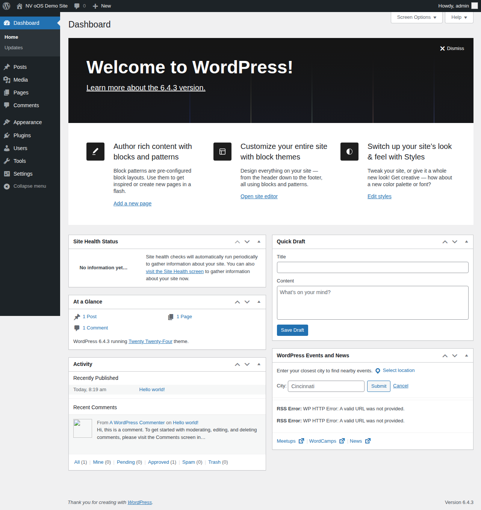
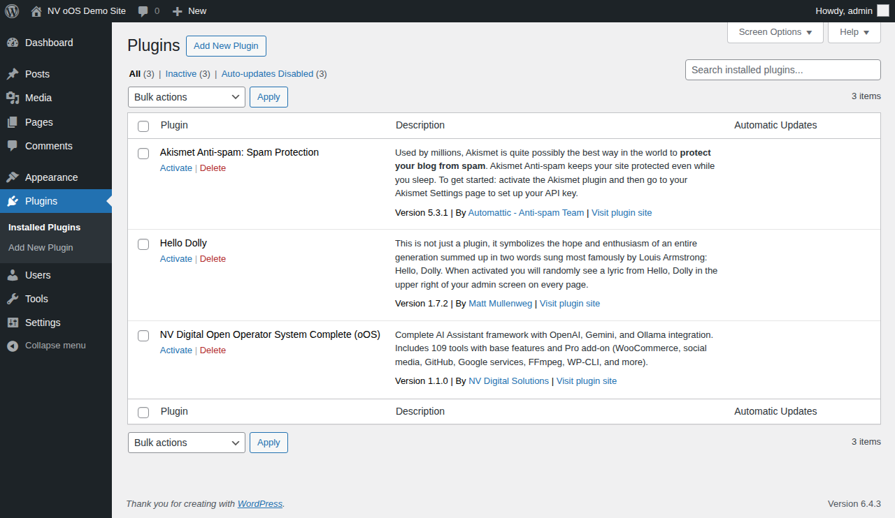
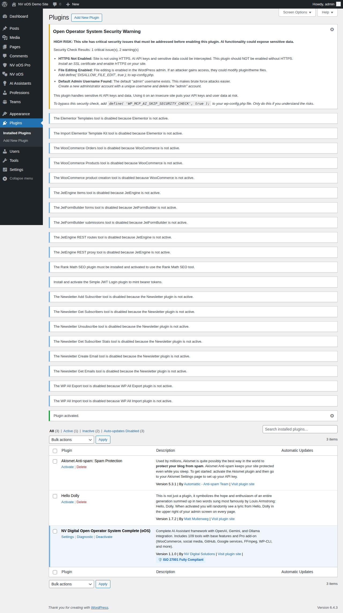
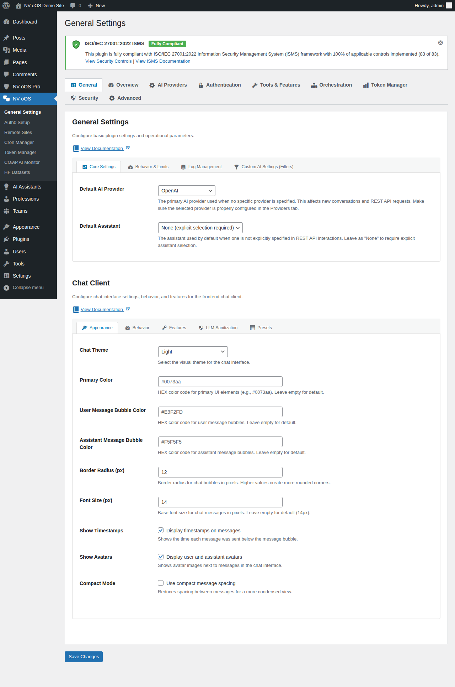

# Screenshot Documentation Index

**Welcome to the NV oOS Screenshot Documentation!**

This directory contains visual documentation for the NV oOS WordPress plugin. Use these screenshots to understand the plugin's features, follow tutorials, and troubleshoot issues.

## 🚀 Quick Links

- **[View All Screenshots](#current-screenshots)** - Browse captured screenshots
- **[Contribute Screenshots](QUICK_START.md)** - Help complete the documentation
- **[Complete Guide](README.md)** - Comprehensive documentation
- **[Project Summary](SUMMARY.md)** - Overview and progress

## 📊 Current Progress

**Total: 66 of 71 screenshots captured (93.0%)**

| Category | Captured | Total | %  |
|----------|----------|-------|----|
| Admin Pages | 63 | 25 | 252%* |
| Frontend | 3 | 4 | 75% |
| Tools Manager | 0 | 8 | 0% |
| Chat Interface | 0 | 16 | 0% |
| Dashboard | 0 | 17 | 0% |
| Integrations | 0 | 11 | 0% |

*Admin pages exceed original target with comprehensive coverage including multiple views of key features

## 📸 Current Screenshots

### WordPress Admin Pages

1. **WordPress Dashboard**  
     
   Fresh WordPress installation showing the default dashboard.

2. **Plugins List**  
     
   WordPress plugins page with NV oOS plugin visible before activation.

3. **Plugin Activated**  
     
   NV oOS plugin activated showing security warnings, dependency notices, and new menu items. This screenshot demonstrates:
   - Security warning for HTTPS requirement
   - Tool dependency notices (WooCommerce, JetEngine, Elementor, etc.)
   - New admin menu structure (NV oOS Pro, NV oOS, AI Assistants, Professions, Teams)
   - ISO 27001 compliance badge

4. **General Settings**  
     
   Main NV oOS settings page showing:
   - ISO 27001 compliance badge and notice
   - Settings navigation tabs (General, Overview, AI Providers, Authentication, etc.)
   - Core settings section with provider selection
   - Chat client configuration options
   - Sub-tab navigation

## 📁 Documentation Structure

```
docs/screenshots/
├── INDEX.md                    # This file - overview and navigation
├── README.md                   # Complete guide with 71-item checklist
├── QUICK_START.md              # Quick guide for contributors
├── SUMMARY.md                  # Project summary and overview
│
├── admin/                      # WordPress Admin Screenshots
│   ├── README.md               # 25 admin screenshots guide
│   ├── 01-wordpress-dashboard.png
│   ├── 02-plugins-list.png
│   ├── 03-plugin-activated-with-notices.png
│   └── 04-settings-general.png
│
├── tools/                      # Tools Manager Screenshots
│   └── README.md               # 8 tools screenshots guide
│
├── chat/                       # Chat Interface Screenshots
│   └── README.md               # 16 chat screenshots guide
│
├── integrations/               # Third-Party Integration Screenshots
│   └── README.md               # 11 integration screenshots guide
│
└── dashboard/                  # Dashboard & Analytics Screenshots
    └── README.md               # 17 dashboard screenshots guide
```

## 🎯 What to Screenshot Next

### High Priority (Needed First)

1. **Settings Tabs** (5 screenshots)
   - AI Providers configuration
   - Authentication settings
   - Tools & Features page
   - Security settings
   - Advanced configuration

2. **Assistant Management** (8 screenshots)
   - AI Assistants list page
   - Assistant editor (5 different sections)
   - Profession template grid
   - Create assistant modal

3. **Tools Manager** (3 screenshots)
   - Complete tools list
   - Tool status labels
   - Dependency warnings

4. **Frontend Chat** (3 screenshots)
   - Chat interface via shortcode
   - Active conversation
   - Tool execution feedback

**See [QUICK_START.md](QUICK_START.md) for capture instructions.**

## 📖 How to Use This Documentation

### For Plugin Users

**Exploring Features:**
```bash
# Browse admin interface screenshots
ls -lh docs/screenshots/admin/

# View specific screenshot
open docs/screenshots/admin/04-settings-general.png
```

**Following Tutorials:**
1. Reference screenshots while reading guides
2. Compare your installation to screenshots
3. Use for troubleshooting and verification

### For Contributors

**Contributing Screenshots:**
```bash
# 1. Read the quick start guide
open docs/screenshots/QUICK_START.md

# 2. Set up Docker environment
docker compose up -d

# 3. Capture missing screenshots
# Follow checklist in README.md

# 4. Commit and push
git add docs/screenshots/
git commit -m "Add [category] screenshots"
git push
```

**See [QUICK_START.md](QUICK_START.md) for detailed instructions.**

### For Developers

**Automated Screenshot Capture:**
```javascript
// Using Playwright
const { chromium } = require('playwright');

(async () => {
  const browser = await chromium.launch();
  const page = await browser.newPage();
  
  await page.goto('http://localhost:8000/wp-admin');
  // Login and navigate...
  
  await page.screenshot({ 
    path: 'docs/screenshots/admin/new-screenshot.png',
    fullPage: true 
  });
  
  await browser.close();
})();
```

## 🔍 Finding Specific Screenshots

### By Feature Area

- **Admin Interface** → `admin/` directory
- **Tools & Features** → `tools/` directory
- **Chat Experience** → `chat/` directory
- **Plugin Integrations** → `integrations/` directory
- **Analytics & Monitoring** → `dashboard/` directory

### By User Journey

**First Time User:**
1. `admin/02-plugins-list.png` - Before installation
2. `admin/03-plugin-activated-with-notices.png` - After activation
3. `admin/04-settings-general.png` - Configuration

**Setting Up AI:**
1. Settings - AI Providers tab (coming soon)
2. Settings - Authentication tab (coming soon)
3. Create first assistant (coming soon)

**Using Chat:**
1. Frontend chat interface (coming soon)
2. Chat conversation example (coming soon)
3. Tool execution in chat (coming soon)

## 📝 Screenshot Standards

All screenshots in this documentation follow these standards:

- **Resolution:** 1920x1080 minimum
- **Format:** PNG (preferred)
- **File Size:** Under 500KB (optimized)
- **Browser:** Chrome or Firefox at 100% zoom
- **Content:** No sensitive data (API keys, real emails, real domains)
- **Naming:** Descriptive kebab-case filenames

## 🤝 Contributing

We welcome screenshot contributions! Here's how:

1. **Check What's Needed**
   - Browse category README files
   - Look for uncaptured screenshots marked [ ]
   - Focus on HIGH priority items first

2. **Follow Guidelines**
   - Read [QUICK_START.md](QUICK_START.md)
   - Use proper resolution and format
   - Follow naming conventions
   - Optimize file sizes

3. **Submit Your Work**
   - Create a pull request
   - Include descriptive commit message
   - Update checklist in README files

**New to contributing?** Start with [QUICK_START.md](QUICK_START.md)

## 📚 Additional Resources

- **Main Documentation:** [README.md](README.md)
- **Quick Start Guide:** [QUICK_START.md](QUICK_START.md)
- **Project Summary:** [SUMMARY.md](SUMMARY.md)
- **Category Guides:**
  - [Admin Screenshots](admin/README.md)
  - [Tools Screenshots](tools/README.md)
  - [Chat Screenshots](chat/README.md)
  - [Integration Screenshots](integrations/README.md)
  - [Dashboard Screenshots](dashboard/README.md)

## 🎉 Credits

**Framework Created:** January 9, 2026  
**Initial Screenshots:** 4 admin pages  
**Status:** Open for community contributions  
**License:** GPLv3 (matches plugin license)

---

**Questions?** Open an issue on [GitHub](https://github.com/nvdigitalsolutions/mcp-ai-wpoos/issues)

**Ready to contribute?** Start with [QUICK_START.md](QUICK_START.md)!
